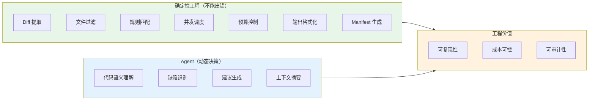
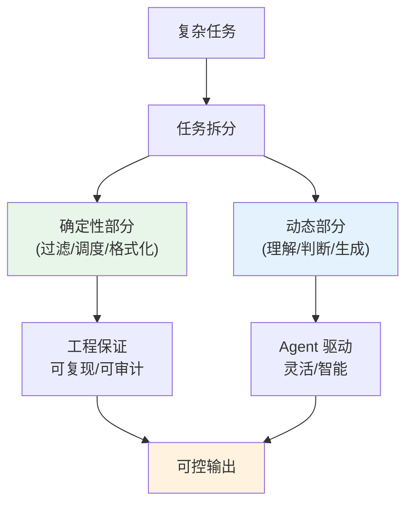
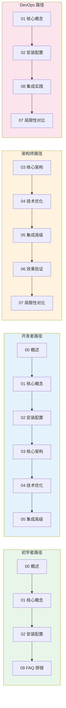
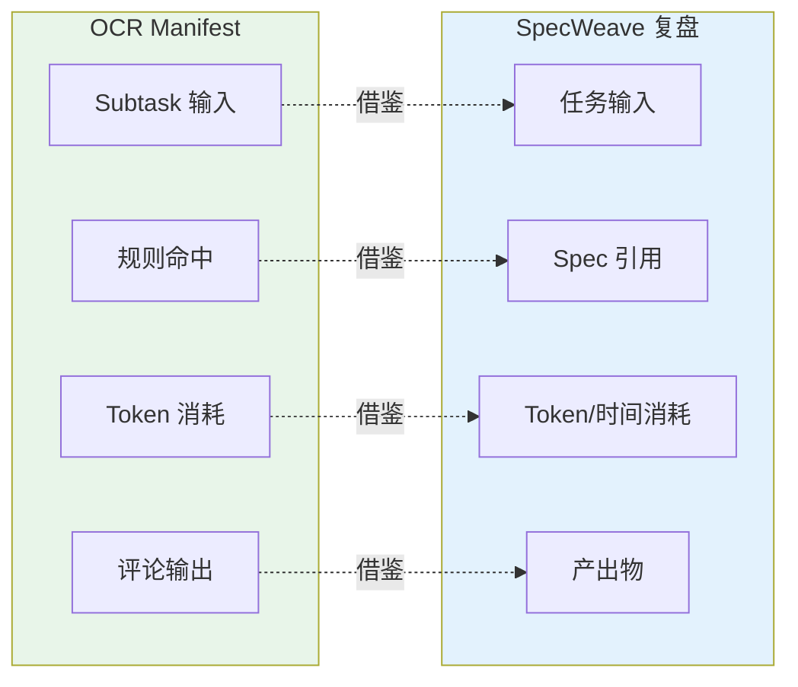

# Open Code Review 完全指南 — 总结、术语表与资源

> 本章是 Open Code Review（以下简称 OCR）wiki 的终章，系统总结全文知识体系、提供关键数据速查表与术语表、萃取可迁移的架构模式、对比同类工具、规划学习路径，并整理官方资源链接。读完本章，你将对 OCR 的设计哲学、技术细节与工程价值形成完整闭环认知。

---

## 1. 知识体系总结

### 1.1 核心设计哲学：确定性工程 × Agent 混合

OCR 的核心设计哲学可概括为一句话：**"能确定的部分用工程代码保证，需要语义判断的部分才交给 Agent"**。这一哲学源于对代码审查任务本质的深刻洞察：



这一哲学带来的三个工程价值：
1. **可复现性**：相同输入 + 相同 Manifest = 可复现的审查过程
2. **成本可控**：预算前瞻 + 估算模型让成本在执行前可预测
3. **可审计性**：每个评论可追溯到具体的 Subtask、Rule 和 Manifest 摘要

### 1.2 六个核心特性回顾

| # | 特性 | 章节定位 | 工程价值 |
|---|------|---------|---------|
| 1 | 确定性 Diff 提取与文件过滤 | 03 | 从源头控制噪声，避免 Agent "看到不该看的" |
| 2 | Subtask 两阶段执行（Plan + Main Loop） | 03 | 先规划再执行，避免盲目循环 |
| 3 | 三区内存压缩（Frozen/Compress/Active） | 03 | 在有限上下文窗口内审查大文件 |
| 4 | 工具循环 + 预算门控 | 04 | 既给 Agent 自由度，又用预算防止成本爆炸 |
| 5 | Manifest 可追溯性 | 05 | 每个评论可溯源到 Subtask、规则与摘要 |
| 6 | 4 层配置优先级链 | 02 | 灵活配置 + 团队规范统一 |

### 1.3 架构关键决策回顾

| 决策 | 选择 | 理由 |
|------|------|------|
| 全 Agent vs 混合 | 混合 | 纯 Agent 不可预测、成本失控、可观测性差 |
| 同步 vs 异步压缩 | 60% 异步 / 80% 同步 | 平衡压缩效果与延迟 |
| 单文件 vs 分治 | 分治策略 | 大型 PR token 仅线性增长 |
| 单一 LLM vs 多供应商 | 多供应商抽象 | 避免供应商锁定，支持本地模型 |
| 强制规则 vs 自由 Agent | 规则驱动 + Agent 补充 | 规则保证下限，Agent 提升上限 |

---

## 2. 关键数据速查表

### 2.1 版本与依赖

| 项 | 要求 |
|---|------|
| Git | ≥ 2.41 |
| Node.js | ≥ 18 |
| Go | ≥ 1.25 |
| License | Apache-2.0 |

### 2.2 核心常量

| 常量 | 值 | 说明 |
|------|---|------|
| `MAX_TOKENS` | 58888 | 单次 LLM 调用最大 token |
| `MAX_TOOL_REQUEST_TIMES` | 30 | 单 Subtask 最大工具调用次数 |
| `PLAN_MODE_LINE_THRESHOLD` | 50 | 超过此行数触发 Plan 模式 |
| `DiffContextLines` | 3 | diff 上下文行数 |
| `maxConsecutiveEmptyRounds` | 3 | 连续空轮次后退出循环 |

### 2.3 压缩阈值

| 场景 | 阈值 | 行为 |
|------|------|------|
| 异步压缩 | 60% | 后台 goroutine 压缩，不阻塞 |
| 同步压缩 | 80% | 阻塞主循环，强制压缩 |

### 2.4 默认值

| 参数 | 默认值 | 说明 |
|------|--------|------|
| `--concurrency` | 8 | 并发 Subtask 数 |
| `--timeout` | 10 分钟 | 单次审查超时 |
| `--max-git-procs` | 16 | git 并发进程数 |
| LLM 超时 | 300 秒 | 单次 LLM 调用超时 |
| viewer 端口 | 5483 | Web 查看器端口 |
| 自动更新检查间隔 | 18 分钟 | 后台检查新版本 |

### 2.5 工具限制

| 工具 | 限制 | 说明 |
|------|------|------|
| `file_read` | 500 行 | 单次读取最大行数 |
| `file_find` | 100 匹配 | 单次搜索最大匹配数 |
| `code_search` | 100 匹配/文件 | 每文件最大匹配数 |

### 2.6 MCP 超时

| 阶段 | 超时 | 说明 |
|------|------|------|
| setup | 5 分钟 | MCP 服务器启动 |
| 初始化 | 30 秒 | MCP 工具注册 |

### 2.7 OTLP 端口

| 协议 | 端口 | 说明 |
|------|------|------|
| gRPC | 4317 | OTLP gRPC endpoint |
| HTTP | 4318 | OTLP HTTP endpoint |

---

## 3. 术语表

以下术语按首字母排序，每条用一句话解释。

| 术语 | 解释 |
|------|------|
| **Agent Skill** | OCR 中可被 Agent 调用的能力单元，封装为工具供 Main Loop 使用。 |
| **CommentWorkerPool** | 评论写入的并发工作池，控制评论生成的并发度与排序。 |
| **Coverage（五集合）** | 文件覆盖率的五类集合（kept/excluded/binary/unsupported/deleted），用于审查范围可追溯性。 |
| **Delegate Mode** | 委托模式，OCR 将部分审查逻辑委托给外部 Agent（如 Claude Code）执行。 |
| **Diff Provider** | Diff 提供器，负责从 Git 或文件系统提取变更内容，支持 workspace/commit/range 三种模式。 |
| **DNS Rebinding Protection** | DNS 重绑定防护，防止恶意域名解析到本地地址攻击 MCP 服务器。 |
| **Frozen Zone** | 三区内存压缩中的"冻结区"，存放已摘要的早期上下文，不再参与活跃推理。 |
| **Compress Zone** | 三区内存压缩中的"压缩区"，存放部分摘要的中间上下文，按需检索。 |
| **Active Zone** | 三区内存压缩中的"活跃区"，存放当前推理所需的完整上下文。 |
| **Glob Pattern** | 通配符模式，用于文件路径匹配（如 `**/*.go`），遵循双星号递归规则。 |
| **Manifest** | 审查清单文件，记录每个 Subtask 的输入、输出、token 消耗与规则命中，保证可追溯性。 |
| **MCP（Model Context Protocol）** | 模型上下文协议，标准化的 LLM 工具调用协议，OCR 通过 MCP 接入外部工具。 |
| **OCR（Open Code Review）** | 阿里开源的 AI 代码评审 CLI 工具，采用确定性工程 × Agent 混合架构。 |
| **OTLP（OpenTelemetry Protocol）** | OpenTelemetry 传输协议，OCR 通过 OTLP 导出 span 到可观测性后端。 |
| **Plan Phase** | Subtask 执行的第一阶段，Agent 先规划审查步骤再执行，避免盲目循环。 |
| **Main Loop** | Subtask 执行的第二阶段，Agent 按计划循环调用工具直至 TerminalState。 |
| **Subtask** | 单文件审查任务，是 OCR 调度的最小单元，包含 Plan 与 Main Loop 两阶段。 |
| **TerminalState** | 终止状态，Agent 循环的退出条件，包括完成、预算耗尽、错误等。 |
| **Token Budget Guard** | Token 预算守卫，在 Subtask 执行前预测消耗，超预算时提前截断。 |
| **Tool Loop** | 工具循环，Agent 反复调用工具（file_read、code_search 等）收集信息直至收敛。 |

---

## 4. 命令速查表

### 4.1 安装

```bash
# NPM 全局安装（推荐）
npm install -g @alibaba-group/open-code-review

# 验证安装
ocr --version
ocr --help
```

### 4.2 配置

```bash
# 交互式选择供应商
ocr config provider

# 交互式选择模型
ocr config model

# 设置单项配置
ocr config set llm.url https://api.anthropic.com/v1/messages
ocr config set llm.token sk-ant-xxx
ocr config set llm.model claude-sonnet-4
ocr config set llm.protocol anthropic

# 查看当前配置
ocr config get
```

### 4.3 审查

```bash
# Range 审查（最常用）
ocr review --from main --to HEAD

# Commit 审查
ocr review --commit abc123

# 预览文件列表（不调用 LLM）
ocr review --from main --to HEAD --preview

# JSON 格式输出
ocr review --from main --to HEAD --format json -o review.json

# 控制预算
ocr review --from main --to HEAD --max-tokens-budget 500000

# 控制并发
ocr review --from main --to HEAD --concurrency 4
```

### 4.4 扫描

```bash
# 扫描目录
ocr scan --path ./src

# 批次扫描（大仓库）
ocr scan --path ./src --batch

# 控制预算
ocr scan --path ./src --max-tokens-budget 1000000
```

### 4.5 会话

```bash
# 列出所有会话
ocr session list

# 查看最近 10 个
ocr session list --limit 10

# 查看某会话的评论
ocr session comments <session-id>

# 恢复中断的会话
ocr review --from main --to HEAD --resume <session-id>
```

### 4.6 查看

```bash
# 启动 Web 查看器（默认端口 5483）
ocr viewer

# 指定端口
ocr viewer --port 8080
```

### 4.7 委托

```bash
# 预览委托规则
ocr delegate preview

# 管理委托规则
ocr delegate rule list
ocr delegate rule add
ocr delegate rule remove
```

### 4.8 测试

```bash
# 测试 LLM 连接
ocr llm test

# 列出已配置供应商
ocr llm providers
```

### 4.9 规则

```bash
# 验证规则文件
ocr rules check

# 列出所有规则
ocr rules list
```

---

## 5. 可迁移模式

以下模式从 OCR 架构中萃取，可迁移到其他 Agent 系统设计。

### 5.1 确定性工程 × Agent 混合模式

**核心思想**：将任务拆分为"不能出错"与"需要动态决策"两部分，前者用工程代码保证，后者交给 Agent。



**迁移场景**：文档生成、数据处理流水线、自动化测试。

### 5.2 三区内存压缩策略

**核心思想**：将上下文分为冻结区（已摘要）、压缩区（部分摘要）、活跃区（完整保留），按需检索而非全量保留。

**迁移场景**：长对话 Agent、多文档问答、代码库理解。

### 5.3 工具循环 + 预算门控

**核心思想**：给 Agent 工具调用的自由度，但用预算上限防止成本爆炸；预算触发前预测，而非"花超了再停"。

**迁移场景**：任何需要多轮工具调用的 Agent 系统。

### 5.4 文件过滤五门算法

**核心思想**：用五种原因标签（binary/user_exclude/unsupported_ext/default_path/deleted）解释每个文件的保留/排除决策，确保可解释。

**迁移场景**：文件处理流水线、代码扫描工具、静态分析。

### 5.5 Manifest 可追溯性

**核心思想**：记录每个决策的输入、输出、消耗与规则命中，让结果可溯源。

**迁移场景**：任何需要审计的 AI 系统、合规性要求场景。

### 5.6 4 层配置优先级链

**核心思想**：命令行 > 环境变量 > 配置文件 > 默认值，逐层降级，灵活与统一兼顾。

**迁移场景**：任何需要多环境配置的 CLI 工具。

---

## 6. 与其他工具对比

### 6.1 OCR vs Claude Code（通用 Agent）

| 维度 | OCR | Claude Code |
|------|-----|-------------|
| 定位 | 专用代码评审 | 通用编码 Agent |
| 架构 | 确定性工程 × Agent 混合 | 全 Agent |
| 可预测性 | 高（Manifest 可复现） | 中（Agent 决策随机） |
| 成本控制 | 强（预算门控） | 弱（Agent 自主决定） |
| 召回率 | 中（20.00% 最优） | 高（28.90% 最优） |
| 精确率 | 高 | 中 |
| F1 指标 | 25.10%（最优） | 22.89% |
| 适用场景 | 工程级稳定评审 | 探索性编码、安全审计 |

> **选择建议**：日常 PR 评审用 OCR；安全审计、探索性任务用 Claude Code；两者可集成（OCR 委托 CC 处理复杂场景）。

### 6.2 OCR vs Codex / Cursor

| 维度 | OCR | Codex / Cursor |
|------|-----|----------------|
| 定位 | 代码评审 | 代码生成与补全 |
| 交互模式 | CLI 一次性 | IDE 实时交互 |
| 评审深度 | 深度（多轮工具循环） | 浅（单次建议） |
| 可定制性 | 强（规则、供应商） | 中 |
| 集成方式 | CI/CD 友好 | IDE 绑定 |

### 6.3 OCR vs 传统静态分析工具

| 维度 | OCR | SonarQube / ESLint |
|------|-----|---------------------|
| 检测方式 | 语义理解（LLM） | 规则匹配（AST） |
| 误报率 | 低 | 中高 |
| 召回率 | 中 | 低（仅已知模式） |
| 上下文理解 | 强（跨文件） | 弱（单文件） |
| 成本 | 有 LLM 调用成本 | 几乎为零 |
| 速度 | 慢（秒级） | 快（毫秒级） |

> **互补关系**：传统工具做"快筛"，OCR 做"精审"，两者结合性价比最高。

---

## 7. 学习路径建议

根据角色与目标，推荐以下学习路径。



### 7.1 初学者路径：00 → 01 → 02 → 09

**目标**：快速上手，能用 OCR 评审自己的 PR。

- **00 概述**：理解 OCR 是什么、解决什么问题
- **01 核心概念**：理解"确定性工程 × Agent 混合"
- **02 安装配置**：装好 OCR，配置 LLM
- **09 FAQ 排错**：遇到问题能自查

### 7.2 开发者路径：00 → 01 → 02 → 03 → 04 → 05

**目标**：深入理解架构，能自定义规则与集成。

- 在初学者路径基础上，增加：
- **03 核心架构**：理解六阶段流水线与 Agent 执行
- **04 技术优化**：理解假阴性/假阳性/定位/Token 优化
- **05 集成高级**：掌握 CI/CD 与自定义规则

### 7.3 架构师路径：03 → 04 → 05 → 06 → 07

**目标**：评估 OCR 的工程价值与适用边界。

- **03 核心架构**：深入架构设计决策
- **04 技术优化**：评估优化效果
- **05 集成高级**：评估集成成本
- **06 效果验证**：看数据，判断是否达标
- **07 局限性对比**：明确适用边界

### 7.4 DevOps 路径：01 → 02 → 08 → 07

**目标**：在 CI/CD 中落地 OCR。

- **01 核心概念**：理解 OCR 价值
- **02 安装配置**：CI 环境配置
- **08 集成实践**：CI/CD pipeline 集成
- **07 局限性对比**：知道何时该用、何时不该用

---

## 8. 官方资源链接

### 8.1 核心资源

| 资源 | 链接 | 说明 |
|------|------|------|
| GitHub 仓库 | https://github.com/alibaba/open-code-review | 源代码与文档 |
| 官方文档 | https://open-codereview.ai/docs | 完整使用文档 |
| npm 包 | https://www.npmjs.com/package/@alibaba-group/open-code-review | NPM 安装包 |
| DeepWiki | https://deepwiki.com/alibaba/open-code-review | AI 生成的项目百科 |
| 贡献指南 | https://github.com/alibaba/open-code-review/blob/main/CONTRIBUTING.md | 贡献流程 |

### 8.2 评测资源

| 资源 | 链接 | 说明 |
|------|------|------|
| AACR-Bench GitHub | https://github.com/alibaba/aacr-bench | 评测数据集与代码 |
| AACR-Bench 论文 | https://arxiv.org/abs/2601.19494 | 行业基准评测体系 |
| HuggingFace 数据集 | https://huggingface.co/datasets/Alibaba-Aone/aacr-bench | 在线数据集 |

### 8.3 集成资源

| 资源 | 链接 | 说明 |
|------|------|------|
| Claude Code 文档 | https://docs.anthropic.com/en/docs/claude-code | 委托模式集成对象 |
| Ollama 工具模型 | https://ollama.com/search?c=tools | 本地模型选择 |
| OpenTelemetry | https://opentelemetry.io/ | 遥测后端标准 |

### 8.4 本 wiki 章节索引

| 章节 | 文件 | 内容 |
|------|------|------|
| 00 | [00-overview.md](./00-overview.md) | 概述与学习目标 |
| 01 | [01-installation.md](./01-installation.md) | 安装与配置指南 |
| 02 | [02-cli-reference.md](./02-cli-reference.md) | CLI 命令参考 |
| 03 | [03-architecture.md](./03-architecture.md) | 核心架构 |
| 04 | [04-llm-providers.md](./04-llm-providers.md) | LLM 协议与 Provider |
| 05 | [05-tools-mcp.md](./05-tools-mcp.md) | 内置工具与 MCP 集成 |
| 06 | [06-review-rules.md](./06-review-rules.md) | 审查规则系统 |
| 07 | [07-session-telemetry.md](./07-session-telemetry.md) | 会话持久化、遥测与查看器 |
| 08 | [08-integrations.md](./08-integrations.md) | 集成与扩展 |
| 09 | [09-faq-troubleshooting.md](./09-faq-troubleshooting.md) | FAQ 与排错 |
| 10 | [10-summary-resources.md](./10-summary-resources.md) | 总结、术语表与资源（本章） |

---

## 9. SpecWeave 应用启示

OCR 的架构设计对 SpecWeave 工作流治理有以下启示。

### 9.1 确定性工程原则在 Agent 系统中的应用

SpecWeave 的"启动协议"（PRIORITY ZERO）与 OCR 的"确定性工程"哲学一脉相承：

- **OCR 的做法**：文件过滤、规则匹配、并发调度由工程代码保证，Agent 只做语义判断
- **SpecWeave 的做法**：上下文路由、规范加载、Skill 选择由 AGENTS.md 协议保证，Agent 只做内容生成

**启示**：在 Agent 系统中，"不能出错的环节"必须用工程代码或协议保证，不能依赖 Agent 的"聪明"。

### 9.2 工具循环模式对 Agent 开发的借鉴

OCR 的 Tool Loop（Plan → Main Loop → TerminalState）模式可迁移到 SpecWeave 的 Skill 执行：

- **Plan 阶段**：Skill 加载前先规划执行步骤
- **Main Loop**：按计划循环调用工具
- **预算门控**：用 `MAX_TOOL_REQUEST_TIMES` 类机制防止 Skill 执行无限循环

### 9.3 Manifest 可追溯性对工作流治理的启发

OCR 的 Manifest 记录每个 Subtask 的输入、输出与规则命中。SpecWeave 的"原子提交"与"复盘体系"可借鉴：

- **原子提交**：每次提交对应一个"Subtask"，可溯源到 Spec 与变更
- **复盘体系**：记录每次任务的输入、输出、消耗与教训，形成可审计的知识库



### 9.4 三区内存压缩对长会话的启示

SpecWeave 的长会话（多轮任务）可借鉴 OCR 的三区压缩：

- **Frozen Zone**：早期会话摘要（如已完成的 todo）
- **Compress Zone**：中间会话部分摘要（如进行中的任务上下文）
- **Active Zone**：当前会话完整上下文

这有助于在 token 预算有限的情况下保持长会话的连贯性。

---

## 10. 版本信息

| 项 | 值 |
|---|---|
| License | Apache-2.0 |
| Copyright | 2026 Alibaba |
| 项目状态 | 开源（Apache 2.0） |
| 前身 | 阿里集团内部 ACR 工具 |
| 主要语言 | Go |
| 发布渠道 | npm / GitHub Releases |
| 文档语言 | 中文 / 英文 |

---

## 结语

Open Code Review 代表了 AI 代码评审领域的一种工程化思路：**不追求"全 Agent"的智能幻觉，而是用确定性工程为 Agent 划定安全边界**。这种"工程治理 Agent"而非"Agent 驱动工程"的哲学，在准确率、稳定性与成本之间取得了更均衡的表现，对任何构建 Agent 系统的团队都有借鉴价值。

希望本 wiki 能帮助你理解 OCR 的设计理念、掌握其使用方法，并在自己的研发工作流中落地。如果你在阅读或实践中发现问题，欢迎前往 [GitHub Issues](https://github.com/alibaba/open-code-review/issues) 反馈。

---

> **wiki 终点**：本章是 Open Code Review 完全指南的最后一章。如需回顾前面章节，请使用 [章节索引](#83-本-wiki-章节索引) 或 [学习路径建议](#7-学习路径建议) 导航。
