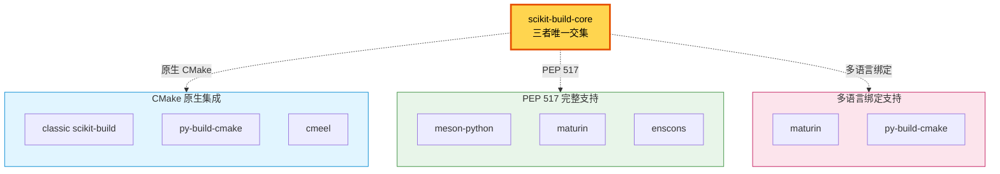
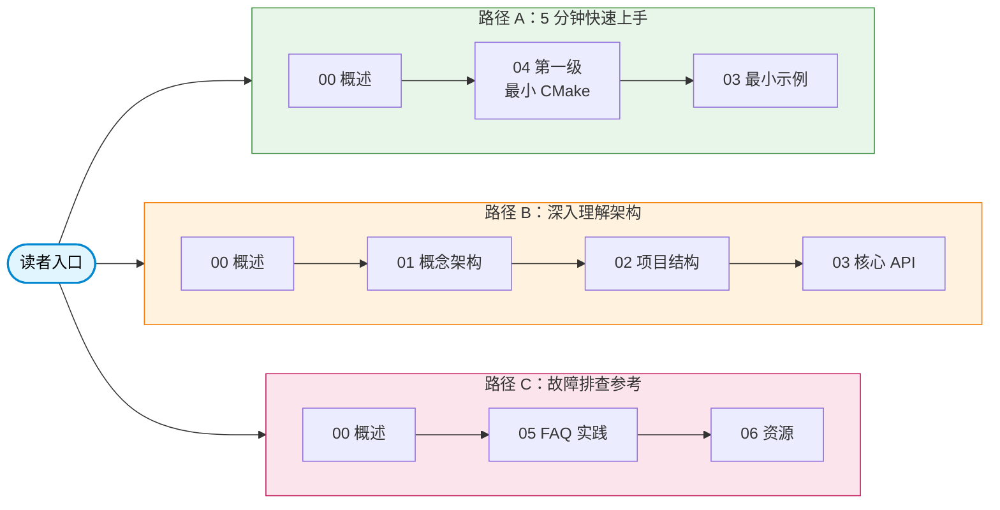

# scikit-build-core 全面教程：概述与导航

> 本章是 scikit-build-core Wiki 教程的入口与导航枢纽。目标：让读者在 3 分钟内理解 scikit-build-core 是什么、为何存在、应从哪里开始阅读。
> 源码版本：v0.12.2-164-g4f0a4b6（本地克隆于 `external/tools/scikit-build-core/`）。

## 引言：为什么需要 scikit-build-core

Python 扩展模块（C/C++/Fortran/Cython/SWIG/pybind11/nanobind 等绑定）的构建与分发，长期受困于三大难题：

1. **CMake 集成复杂**：CMake 是跨平台 C/C++ 构建系统的事实标准，但 Python 打包工具（setuptools/distutils）原生不懂 CMake，开发者只能手写 `setup.py` 调用 CMake，跨平台行为难以预测。
2. **跨平台 wheel 困难**：manylinux/musllinux/macOS/Windows 各有 wheel 标签与 ABI 约束（如 manylinux 缺 `libpython`、macOS universal2、Windows free-threaded），手工维护 CMake 工程与 wheel 标签的对应关系极易出错。
3. **setup.py 时代终结**：PEP 517/518/621/660 等标准确立"构建后端隔离"模型后，`setup.py` 不再是必经之路，但 setuptools 的 CMake 集成仍是临时拼装，缺乏一等公民支持。

**scikit-build-core 的定位**：现代 PEP 517 构建后端，桥接 CMake 与 Python 打包。一句话定义——

> 基于 CMake 的 Python 包构建后端，支持 C/C++/Fortran/Cython/SWIG/pybind11/nanobind 等多语言绑定，原生实现 PEP 517/660/621 钩子，无需 setuptools 即可产出 sdist 与 wheel。

它是 classic scikit-build（基于 setuptools + distutils 的旧方案）的全面重写，由 Henry Schreiner 等人在 SciPy 2024 论文中系统阐述其设计与内部实现。

## 与同类工具的对比

scikit-build-core 并非唯一可选的"带原生代码的 Python 构建后端"。下表给出八种主流后端的对比，便于选型。

| 后端 | 构建系统 | PEP 517 | CMake 集成 | 跨平台 wheel | 可编辑安装 | 学习曲线 |
|---|---|---|---|---|---|---|
| **scikit-build-core** | CMake | 原生完整 | 一等公民 | 支持 | redirect/inplace | 中 |
| classic scikit-build | CMake | 经 setuptools | 一等公民 | 支持 | 不支持 | 中 |
| setuptools/distutils | 自带 | 原生完整 | 拼装 | 支持 | 支持 | 低 |
| meson-python | Meson | 原生完整 | 无 | 支持 | 支持 | 中高 |
| maturin | Cargo | 原生完整 | 无 | 支持 | 支持 | 低（Rust 友好） |
| py-build-cmake | CMake | 经 setuptools | 一等公民 | 部分 | 不支持 | 低 |
| cmeel | CMake | 原生完整 | 一等公民 | 部分 | 不支持 | 中 |
| enscons | SCons | 原生完整 | 无 | 支持 | 不支持 | 中高 |

**关键差异点**：scikit-build-core 是目前唯一同时具备"原生 CMake 集成 + 完整 PEP 517/660/621 支持 + 多语言绑定（C/C++/Fortran/Cython/SWIG/pybind11/nanobind）"三重特性的后端。下图的三个集合分别对应这三类特性，scikit-build-core 落在三者唯一交集。

与 setuptools/distutils 的关系：scikit-build-core 完全不依赖 setuptools 即可工作（下游 `pyproject.toml` 写 `build-backend = "scikit_build_core.build"`，钩子从 `src/scikit_build_core/build/__init__.py#L45-L182` 导出），但保留了一个实验性的 setuptools 兼容层（`setuptools/`）用于平滑迁移。

与 classic scikit-build 的关系：scikit-build-core 是同一作者团队的全面重写，配置从 `setup.py`/`setup.cfg` 迁移到 `pyproject.toml` 的 `[tool.scikit-build]` 表，CMake 端移除 `PythonExtensions` 模块改用标准 `find_package(Python ... COMPONENTS Interpreter Development.Module)`，环境变量 `SKBUILD_CONFIGURE_OPTIONS` 改名为 `SKBUILD_CMAKE_ARGS`。迁移细节见 [05 - 常见问题与最佳实践](05-faq-and-best-practices.md)。

## 核心特性速览

scikit-build-core v0.12.2 提供七个核心特性，每个特性对应后续章节的深入讲解：

| 特性 | 一句话说明 | 详见章节 |
|---|---|---|
| **PEP 517/660 原生** | 完整实现 8 个钩子（`build_wheel`/`build_sdist`/`build_editable`/`prepare_metadata_*`/`get_requires_for_build_*`），无需 setuptools 中介 | [01 - 概念与架构](01-concepts-architecture.md)、[03 - 核心 API 与配置](03-core-api-and-config.md) |
| **CMake 三层抽象** | `CMake` 值对象（`cmake.py#L67-L99`）→ `CMaker` 进程封装（`cmake.py#L102`）→ `Builder` 高层包装（`builder/builder.py#L213`） | [01 - 概念与架构](01-concepts-architecture.md)、[02 - 项目目录结构](02-project-structure.md) |
| **多语言绑定** | 内置 8 种后端脚手架（`init/__main__.py#L28` 的 `generate_project`）：pybind11/nanobind/c/cython/swig/fortran/abi3/abi3t | [04 - 入门到进阶](04-quickstart-to-advanced.md) |
| **配置系统四层** | 数据模型（`settings/skbuild_model.py#L815-L933`）+ 源链（env/config-settings/TOML）+ 编排器（`settings/skbuild_read_settings.py#L61`）+ JSON Schema（`settings/skbuild_schema.py#L41`） | [01 - 概念与架构](01-concepts-architecture.md)、[03 - 核心 API 与配置](03-core-api-and-config.md) |
| **可编辑安装（PEP 660）** | redirect 模式（默认，`build/_editable.py#L48`）支持 import 触发 CMake 重建；inplace 模式提供简单 `.pth` | [01 - 概念与架构](01-concepts-architecture.md)、[04 - 入门到进阶](04-quickstart-to-advanced.md) |
| **Stable ABI / Free-threaded** | `wheel.py-api = "cp38"` 走 Stable ABI（CMake 3.26+ `Development.SABIModule`）；`cp315.cp315t` 支持 Python 3.13+ free-threaded | [03 - 核心 API 与配置](03-core-api-and-config.md)、[04 - 入门到进阶](04-quickstart-to-advanced.md) |
| **实验性变体（PEP 817）** | `variant`/`variant-label`/`null-variant` 实现 wheel 变体，需 `experimental=true` | [03 - 核心 API 与配置](03-core-api-and-config.md)、[05 - 常见问题与最佳实践](05-faq-and-best-practices.md) |

> 引用源码版本：v0.12.2（与 `external/tools/scikit-build-core/` 同步）。

## 目标读者

本教程面向三类读者：

- **Python 扩展模块开发者**：需要为 pybind11/nanobind/Cython/SWIG 等绑定选择构建后端的工程师。推荐路径：00 → 04 第一级 → 03 最小示例。
- **科研计算包维护者**：维护 NumPy/SciPy 风格的 Fortran/C++ 扩展包，关心跨平台 wheel 与 Conda 打包。推荐路径：00 → 04 → 05。
- **企业级 Python 工具链工程师**：需要在 CI 中大规模构建、缓存复用、Stable ABI 分发的工具链维护者。推荐路径：00 → 01 → 02 → 03 → 05。

## 阅读路径指南

本教程共 7 章，建议按下列三条路径之一阅读。每条路径针对不同时间预算与目的：

- **路径 A：5 分钟快速上手**——立即开始项目。00 → 04 第一级 → 03 最小示例。
- **路径 B：深入理解架构**——需要深度定制或阅读源码。00 → 01 → 02 → 03。
- **路径 C：故障排查参考**——已遇到问题。00 → 05 → 06。

> 路径 A 适合第一次接触 scikit-build-core 的开发者；路径 B 适合需要理解配置系统四层或 CMake 三层抽象的开发者；路径 C 适合已遇到 FindPython 报错、wheel 标签、Conda 打包等具体问题的开发者。

## 目录导航

下表列出全部 7 章及其核心内容速览与预估阅读时间。所有章节文件与本文件同目录。

| 章节 | 核心内容 | 预估阅读时间 |
|---|---|---|
| [00 - 概述与导航](00-overview.md) | 定位、对比、特性速览、阅读路径、目录导航（本章） | 10 分钟 |
| [01 - 概念与架构](01-concepts-architecture.md) | PEP 517/660 后端机制、CMake 三层抽象、8 步 wheel 构建流程、配置四层架构、File API 状态机、元数据插件、可编辑安装、后端适配层（含 5 张 Mermaid 图） | 30 分钟 |
| [02 - 项目目录结构](02-project-structure.md) | 13 个顶层文件 + 14 个子目录职责矩阵、PEP 517 钩子入口表、构建流程调用图、配置四层源码视角、overrides、File API、init 脚手架、CLI 子命令树 | 25 分钟 |
| [03 - 核心 API 与配置](03-core-api-and-config.md) | 8 个 PEP 517 钩子详解、`[tool.scikit-build]` 全部配置项、overrides 系统、动态元数据 4 个内置 provider、CMakeLists.txt 集成示例（`${SKBUILD_*}` 变量全集） | 35 分钟 |
| [04 - 入门到进阶](04-quickstart-to-advanced.md) | 三级递进：最小 CMake 项目 → 真实 C++ 扩展（pybind11/nanobind）→ 高级配置（abi3/交叉编译/可编辑重建/动态元数据/cibuildwheel），每级含验收标准 | 40 分钟 |
| [05 - 常见问题与最佳实践](05-faq-and-best-practices.md) | 12 个 FAQ 主题、跨平台编译故障排查、依赖管理、可编辑安装故障排查、CI 集成（GitHub Actions + cibuildwheel）、Conda 打包、从 classic scikit-build 迁移、调试方法 | 25 分钟 |
| [06 - 参考资料](06-resources.md) | 官方资源、教程资源（含 SciPy 2024 论文）、同类工具对比、术语表（15+ 术语）、关联本项目条目、扩展阅读建议 | 15 分钟 |

> 总计预估约 180 分钟（3 小时）。若只读路径 A 三章，约 50 分钟即可获得可运行的最小项目。

## 版本与溯源

- **当前源码版本**：v0.12.2-164-g4f0a4b6
- **官方文档版本**：0.12.2（main 分支 dev 0.12.3.dev149+gf0895076f）
- **源码克隆位置**：`external/tools/scikit-build-core/`
- **本地源码锚点格式**：`src/scikit_build_core/<path>#L<行号>`，所有锚点可对照本地克隆验证

本教程的内容来源遵循"三方互补"原则：

1. **官方文档**（[readthedocs](https://scikit-build-core.readthedocs.io/en/latest/)）：Guide / Configuration / Plugins / API docs 五大板块，是配置项、CLI、API 的权威来源。
2. **daobook 中文教程**：少有的中文 scikit-build-core 入门索引，但存在 1-2 个版本时滞，术语本地化（`wheel` 译为"轮子"）。
3. **SciPy 2024 论文**（[doi.org/10.25080/FMKR8387](https://doi.org/10.25080/FMKR8387)）：Henry Schreiner 等人发表，涵盖 Python 打包历史、scikit-build-core 设计动机与内部实现、采用案例。
4. **源码研究**：基于本地 `external/tools/scikit-build-core/` 源码逐模块解析，所有源码锚点可追溯。

> 三方互补关系详见 [06 - 参考资料](06-resources.md) 的"扩展阅读建议"小节。

## 反馈与改进

- **反馈渠道**：教程内容问题可在 SpecWeave 项目内提 issue 或 PR；scikit-build-core 本身的问题请到 [scikit-build/scikit-build-core](https://github.com/scikit-build/scikit-build-core) 反馈。
- **关联 spec**：`create-scikit-build-core-wiki-tutorial`（本教程的设计契约与章节大纲出处）。
- **改进流程**：章节内容偏离设计契约时，须先更新 `.trae/specs/standards-tools/create-scikit-build-core-wiki-tutorial/.research/wiki-structure-design.md`，再修订章节，避免返工。

---
← 上一章：无 | [返回目录](00-overview.md) | 下一章：[概念与架构](01-concepts-architecture.md) →
