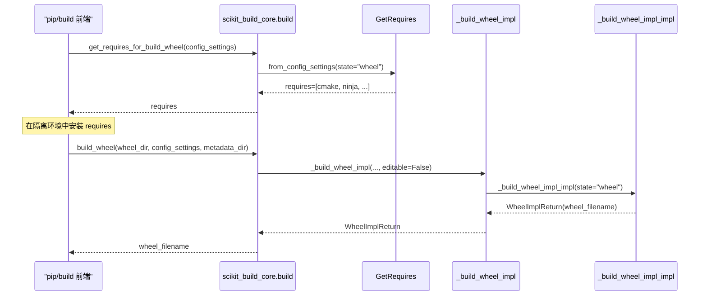
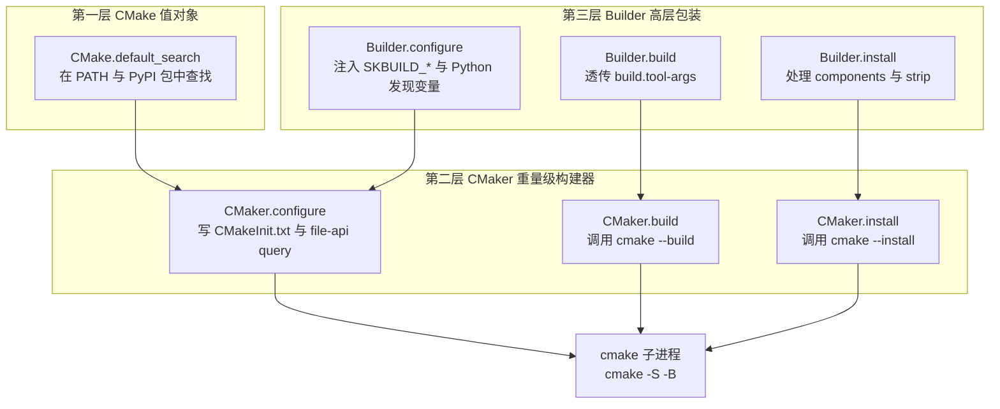
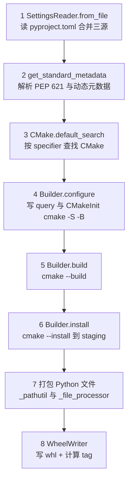
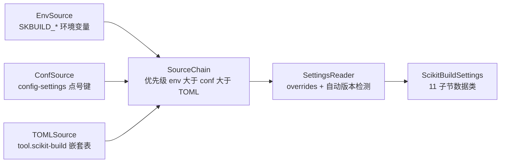
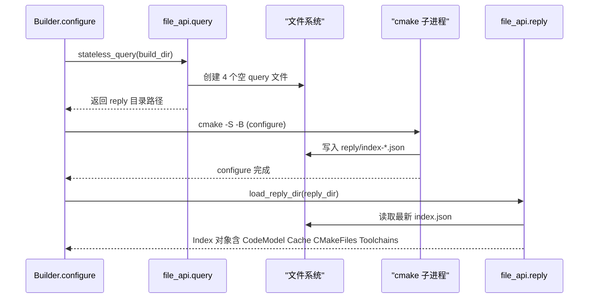

# 基本概念与架构解析

> 本章是理解 scikit-build-core 的理论基础。读完本章，你将清楚：scikit-build-core 如何作为 PEP 517 后端被 pip/build 调用、CMake 如何被三层抽象封装、wheel 在 8 步流程中如何被组装、配置如何经过四层架构被解析、CMake File API 如何以无状态查询获取构建信息。
>
> 本章含 5 张 Mermaid 图，覆盖 PEP 517 钩子时序、CMake 三层调用、8 步构建流程、配置源链合并、File API query/reply 时序。

## PEP 517/660 构建后端机制

### PEP 517：构建后端标准

PEP 517 的核心目标是**解耦构建系统与打包工具**：pip、build 等前端只负责调度，真正的构建逻辑由后端在隔离环境中执行。这一解耦让 Python 打包生态从 setup.py 时代的"工具即实现"转向"接口即契约"。

PEP 517 规定 5 个**必备钩子**：

| 钩子 | 职责 |
|---|---|
| `build_wheel` | 构建 wheel 二进制分发 |
| `build_sdist` | 构建 sdist 源码分发 |
| `get_requires_for_build_wheel` | 报告 wheel 构建所需的额外依赖（动态） |
| `get_requires_for_build_sdist` | 报告 sdist 构建所需的额外依赖（动态） |
| `prepare_metadata_for_build_wheel` | （可选）仅准备元数据，不实际构建 |

PEP 660 在此基础上扩展了 3 个**可编辑安装钩子**：`build_editable`、`get_requires_for_build_editable`、`prepare_metadata_for_build_editable`。

配置通过 `config-settings` 字典传递，约定为**扁平点号键**（如 `-Cskbuild.logging.level=INFO`）。这是 PEP 517 后端的统一动态配置入口，与 pyproject.toml 静态配置形成互补。

### scikit-build-core 的后端声明

下游项目在 `pyproject.toml` 中声明使用 scikit-build-core 作为后端：

```toml
[build-system]
requires = ["scikit-build-core>=0.10.0"]
build-backend = "scikit_build_core.build"
```

钩子从 `src/scikit_build_core/build/__init__.py` 导出。8 个钩子的源码位置与委托目标如下：

| 钩子 | 源码锚点 | 委托目标 |
|---|---|---|
| `build_wheel` | `src/scikit_build_core/build/__init__.py#L45-L58` | `_build_wheel_impl(..., editable=False)` |
| `build_editable` | `src/scikit_build_core/build/__init__.py#L61-L74` | `_build_wheel_impl(..., editable=True)` |
| `prepare_metadata_for_build_wheel` | `src/scikit_build_core/build/__init__.py#L95-L104` | `_build_wheel_impl(None, ...)` |
| `prepare_metadata_for_build_editable` | `src/scikit_build_core/build/__init__.py#L106-L116` | `_build_wheel_impl(None, ..., editable=True)` |
| `build_sdist` | `src/scikit_build_core/build/__init__.py#L124-L131` | `build.sdist.build_sdist` |
| `get_requires_for_build_sdist` | `src/scikit_build_core/build/__init__.py#L134-L150` | `GetRequires.from_config_settings(state="sdist")` |
| `get_requires_for_build_wheel` | `src/scikit_build_core/build/__init__.py#L173-L176` | `_get_requires_for_build_wheel(state="wheel")` |
| `get_requires_for_build_editable` | `src/scikit_build_core/build/__init__.py#L179-L182` | `_get_requires_for_build_wheel(state="editable")` |

注意一个**安全机制**：`prepare_metadata_for_build_wheel`/`prepare_metadata_for_build_editable` 这两个钩子只在 `_has_safe_metadata()` 返回真时才注册。`_has_safe_metadata()`（`src/scikit_build_core/build/__init__.py#L77-L90`）会扫描 `tool.scikit-build.overrides[].if.failed`，若存在 `failed` 条件则视为"不安全"，禁用 `prepare_metadata_*`——避免 metadata 阶段先失败导致后续的 retry 回退失效。

### PEP 660：可编辑安装支持

可编辑安装（`pip install -e .`）由 PEP 660 定义，scikit-build-core 提供两种模式：

- **redirect（默认）**：生成 `.pth` 文件 + `_editable_skbc_<pkg>.py` shim 模块，通过 `sys.meta_path` 钩子将 import 重定向到源码目录与 CMake 安装产物。若 `editable.rebuild=true`，import 时还会触发 CMake 增量重建。
- **inplace**：生成简单 `.pth` 指向源码包目录，不支持 import 触发重建。

redirect 模式的核心实现在 `editable_redirect`（`src/scikit_build_core/build/_editable.py#L48`），它读取 `resources/_editable_redirect.py` 模板并注入运行时参数。

### PEP 517 钩子调用时序

下图展示 pip/build 前端如何依次调用 `get_requires_for_build_*` 与 `build_wheel` 钩子：



时序图说明：前端先调 `get_requires_for_build_wheel` 拿到动态依赖列表（含 CMake、Ninja 等），在隔离环境中安装它们，然后再调 `build_wheel` 触发真正的构建。这种两阶段设计让构建依赖完全由后端决定，前端无需感知 CMake。

## CMake 集成机制

### 三层抽象架构

scikit-build-core 对 CMake 的封装呈三层金字塔结构，从下到上抽象层级递增：

**第一层：`CMake` 值对象**（`src/scikit_build_core/cmake.py#L67-L99`）

`CMake` 是一个 frozen dataclass，仅持有 `version` 与 `cmake_path` 两个字段。其 `default_search` 类方法（`src/scikit_build_core/cmake.py#L71-L95`）按 PEP 440 `SpecifierSet` 在两个来源中查找：

1. 系统 PATH 中的 cmake 可执行文件
2. PyPI 安装的 `cmake` Python 包（车轮中捆绑的 cmake 二进制）

找不到匹配版本时抛 `CMakeNotFoundError`。这一层只负责"找到 CMake"，不涉及任何构建逻辑。

**第二层：`CMaker` 重量级构建器**（`src/scikit_build_core/cmake.py#L102`）

`CMaker` 管理构建目录的生命周期与 CMake 子进程调用，三个核心方法：

- `configure`（`src/scikit_build_core/cmake.py#L284`）：写 `CMakeInit.txt`（含所有 `SKBUILD_*` cache entry）+ 写 file-api query + 运行 `cmake -S … -B …` + 解析 file-api reply
- `build`（`src/scikit_build_core/cmake.py#L327`）：运行 `cmake --build`，按 generator 传递参数
- `install`（`src/scikit_build_core/cmake.py#L352`）：运行 `cmake --install` 到 staging 目录，映射到 wheel 布局（platlib/data/headers/scripts/metadata）

构建目录通过 `.skbuild-info.json` 检测 stale cache：若 source_dir 或 skbuild_path 变化（典型场景：隔离环境变化），自动清理 `CMakeCache.txt` 与 `CMakeFiles/` 重新 configure。

**第三层：`Builder` 高层包装**（`src/scikit_build_core/builder/builder.py#L213`）

`Builder` 被 `build/wheel.py` 直接使用，在 `CMaker` 之上注入 Python 生态特定的 CMake 变量：

- `configure`（`src/scikit_build_core/builder/builder.py#L257`）：注入 Python 发现变量（`PYTHON_EXECUTABLE`、`Python3_EXECUTABLE`）、Limited API / Stable ABI（`SKBUILD_SOABI`、`SKBUILD_SABI_*`，由 `_SabiMode` 枚举控制）、macOS 跨编译（`ARCHFLAGS` → `CMAKE_OSX_ARCHITECTURES`，由 `get_archs` 解析）、entry-point 注入的 CMake 模块路径，然后委托给 `CMaker.configure`
- `build`（`src/scikit_build_core/builder/builder.py#L488`）：委托给 `CMaker.build`
- `install`（`src/scikit_build_core/builder/builder.py#L502`）：委托给 `CMaker.install`

### CMake 集成三层调用图

下图展示三层抽象的调用关系与最终落到 cmake 子进程的路径：



三层抽象的设计价值：`CMake` 层无状态、可单测；`CMaker` 层独立于 Python 生态，可被 hatchling 插件复用；`Builder` 层集中处理 Python 特有的发现与跨编译逻辑，避免污染下层。

### Generator 选择策略

`parse_generator`（`src/scikit_build_core/builder/generator.py#L39`）从 CMake args 中提取 `-G` 指定的 generator，同时支持 `-GNinja` 与 `-G Ninja` 两种写法。若用户未显式指定，则按 `cmake --help` 解析默认 generator，并通过 `set_environment_for_gen` 为 generator 设置环境变量（如 Ninja 路径）。

默认优先级：**Ninja > Make > MSVC**。Ninja 是 scikit-build-core 的推荐 generator，因其并行构建快、增量构建准确。

### 程序查找

`Program` NamedTuple（`src/scikit_build_core/program_search.py#L39-L46`）描述一个候选程序：路径、版本、来源。查找函数族包括：

- `get_cmake_programs` / `get_ninja_programs` / `get_make_programs`：从 PATH 与 PyPI 安装位置枚举候选
- `best_program`：按 PEP 440 specifier 选择最佳匹配
- `_macos_binary_is_x86`（`src/scikit_build_core/program_search.py#L57`）：macOS 上检测二进制架构（用于 Apple Silicon 与 x86 双架构二进制选择）

这套查找机制让 scikit-build-core 既能用系统 CMake，也能在隔离环境中自动安装 PyPI `cmake` 包，无需用户干预。

## Wheel 构建流程（8 步详解）

完整调用链：`build_wheel` → `_build_wheel_impl` → `_build_wheel_impl_impl`。其中 `_build_wheel_impl`（`src/scikit_build_core/build/wheel.py#L215`）负责失败重试（`if.failed` override 触发），实际构建逻辑在 `_build_wheel_impl_impl`（`src/scikit_build_core/build/wheel.py#L310`）。

8 步流程：

1. **读取并合并配置**：`SettingsReader.from_file` 读取 `pyproject.toml`，合并三源（env、config-settings、TOML），应用 overrides 与自动版本检测。源码锚点：`src/scikit_build_core/settings/skbuild_read_settings.py#L61`。
2. **解析 PEP 621 元数据**：`get_standard_metadata`（`src/scikit_build_core/build/metadata.py#L53`）调用 vendored `pyproject_metadata` 解析 `[project]` 表，处理 legacy 与新式动态元数据。
3. **查找 CMake**：`CMake.default_search`（`src/scikit_build_core/cmake.py#L71`）按 `cmake.version` specifier 查找 CMake。
4. **configure**：`Builder.configure`（`src/scikit_build_core/builder/builder.py#L257`）写 file-api query + 写 `CMakeInit.txt` + 运行 `cmake -S -B`，完成后调用 `load_reply_dir` 解析 reply。
5. **build**：`Builder.build`（`src/scikit_build_core/builder/builder.py#L488`）运行 `cmake --build`，按 `build.targets` 与 `build.tool-args` 传递参数。
6. **install**：`Builder.install`（`src/scikit_build_core/builder/builder.py#L502`）运行 `cmake --install` 到 staging 目录，按 `install.components` 与 `install.strip` 处理。
7. **打包 Python 文件**：通过 `build/_pathutil.py` 与 `build/_file_processor.py` 遍历包目录、应用 `wheel.exclude` 与 `wheel.force-include`，将 Python 模块与 CMake 产物合并到 wheel 暂存区。
8. **写 wheel 文件**：`WheelWriter`（`src/scikit_build_core/build/_wheelfile.py`）组装 `.whl` 文件，通过 `builder/wheel_tag.py` 计算 wheel tag（pythontag/abitag/platformtag），生成 `METADATA`/`WHEEL`/`RECORD`。

### 8 步 wheel 构建流程图



理解这 8 步的意义在于：每一步都对应一个可独立调试的边界。CI 日志中看到 "CMake configuration failed" 即可定位到第 4 步；看到 wheel 文件名错误即可定位到第 8 步的 `wheel_tag.py`。这种清晰的步骤划分是 scikit-build-core 相对 setup.py 时代的关键优势。

## 配置系统四层架构

scikit-build-core 的配置系统采用清晰的四层架构，从数据模型到 JSON Schema 自上而下分离职责。

### 第一层：数据模型（settings/skbuild_model.py）

主数据类 `ScikitBuildSettings`（`src/scikit_build_core/settings/skbuild_model.py#L815-L933`）聚合 11 个子节，每个子节是一组相关配置项：

| 子节 | 行号锚点 | 说明 |
|---|---|---|
| `cmake` | `skbuild_model.py#L164` | CMake 版本/路径/args/define/build-type |
| `search` | `skbuild_model.py#L270` | CMake/Ninja 查找上下文 |
| `ninja` | `skbuild_model.py#L278` | Ninja 版本与 make-fallback |
| `logging` | `skbuild_model.py#L313` | 日志级别 |
| `sdist` | `skbuild_model.py#L323` | sdist 包含/排除/reproducible |
| `wheel` | `skbuild_model.py#L434` | wheel packages/py-api/license-files |
| `editable` | `skbuild_model.py#L636` | 可编辑安装 mode/rebuild |
| `build` | `skbuild_model.py#L689` | 构建目录与 tool-args |
| `install` | `skbuild_model.py#L718` | components/strip |
| `generate` | `skbuild_model.py#L759` | 文件生成项数组 |
| `messages` | `skbuild_model.py#L798` | 自定义阶段消息 |
| `metadata` | `skbuild_model.py#L829` | legacy 动态元数据表 |
| `env` | `skbuild_model.py#L834-L848` | CMake 子进程环境变量 |

顶级字段包括 `strict_config`/`experimental`/`minimum_version`/`build_dir`/`fail`/`variant*`。两个特殊类型值得注意：

- `CMakeSettingsDefine`（`skbuild_model.py#L61-L82`）：str 子类型，自动将 bool/list 归一化为 CMake 表示（`TRUE`/`FALSE`/分号分隔列表）
- `EnvValue`（`skbuild_model.py#L85-L120`）：支持 `{env, default, force}` 表或裸字符串，延迟到构建时解析

### 第二层：源链（settings/sources.py）

三个 `Source` 实现按优先级查询：

| Source | 输入 | 编码 |
|---|---|---|
| `EnvSource` | `SKBUILD_*` 环境变量 | 列表 `a;b`，dict `k=v;k2=v2` |
| `ConfSource` | PEP 517 config-settings | 同上，扁平点号键 |
| `TOMLSource` | `tool.scikit-build` 嵌套表 | 原生 TOML 类型 |

`SourceChain` 按顺序查询，第一个匹配的 source 决定值。关键语义：**dict 跨源合并而非替换**——这意味着 TOML 中的 `cmake.define.A=1` 不会被 config-settings 中的 `cmake.define.B=2` 覆盖，而是合并为 `{A:1, B:2}`。

优先级：**env > config-settings > TOML**。源码顶部 docstring 详述了合并规则，见 `src/scikit_build_core/settings/sources.py#L1-L79`。

### 第三层：编排器（settings/skbuild_read_settings.py）

`SettingsReader`（`src/scikit_build_core/settings/skbuild_read_settings.py#L61`）的处理步骤：

1. 用 `SourceChain` 合并三源
2. 调用 `process_overrides`（`src/scikit_build_core/settings/skbuild_overrides.py#L38`）应用条件覆盖
3. 调用 `_handle_minimum_version`（`skbuild_read_settings.py#L71`）做版本兼容改写
4. 调用 `find_min_cmake_version`（`settings/auto_cmake_version.py`）从 `CMakeLists.txt` 解析 `cmake_minimum_required`
5. 调用 `get_min_requires`（`settings/auto_requires.py`）自动检测最小依赖
6. 调用 `load_config_providers`（`settings/_load_entrypoint_config.py`）加载入口点配置提供者
7. 校验未知选项与 override-only 字段约束

### 第四层：JSON Schema（settings/skbuild_schema.py）

- `generate_skbuild_schema`（`src/scikit_build_core/settings/skbuild_schema.py#L41`）：从 `ScikitBuildSettings` 数据类反射生成完整 JSON Schema
- `get_skbuild_schema`（`src/scikit_build_core/settings/skbuild_schema.py#L233`）：从打包资源读取已生成的 `resources/scikit-build.schema.json`

生成的 schema 落地于 `src/scikit_build_core/resources/scikit-build.schema.json`，由 `nox -t gen` 重新生成。修改 `skbuild_model.py` 后必须运行 `nox -t gen` 同步 schema 与文档 cog 段，否则 `validate-pyproject` 工具会因 schema 过时而拒绝项目配置。

### 配置源链合并示意图



四层架构的设计哲学：数据模型只描述"有什么"，源链只描述"从哪来"，编排器只描述"如何合并与校验"，Schema 只描述"对外契约"。修改配置项时只需改 `skbuild_model.py` 一处，`nox -t gen` 自动同步 schema 与文档，避免多源维护的漂移。

## CMake File API 状态机

CMake File API 是 CMake 3.15+ 提供的构建信息查询接口，scikit-build-core 用它推断 wheel 文件结构、检测 stale cache。

### 工作流程

1. **写 query**：`stateless_query`（`src/scikit_build_core/file_api/query.py#L19`）在 `build_dir/.cmake/api/v1/query/` 创建 4 个空文件：`codemodel-v2`、`cache-v2`、`cmakeFiles-v1`、`toolchains-v1`。这些文件名即"请求的响应类型"，文件内容为空。返回 `reply/` 目录路径供后续读取。
2. **CMake configure 写 reply**：CMake 在 configure 阶段自动检测 query 目录，向 `reply/` 写入 `index-*.json` 与各响应对象的 `*.json` 文件。这是 CMake 内建行为，无需 scikit-build-core 干预。
3. **解析 reply**：`load_reply_dir`（`src/scikit_build_core/file_api/reply.py#L38`）定位最新 `index-*.json`，通过 `Converter` 类（`reply.py#L50`）解析为 typed dataclass。

### 6 个 typed dataclass

| 数据类 | 模块 | 内容 |
|---|---|---|
| `Index` | `model/index.py` | file-api 入口索引 |
| `CodeModel` / `Target` | `model/codemodel.py` | 项目结构与目标 |
| `Cache` | `model/cache.py` | CMakeCache.txt 解析 |
| `CMakeFiles` | `model/cmakefiles.py` | 参与的 CMake 文件 |
| `Toolchains` | `model/toolchains.py` | 工具链信息 |
| `Directory` | `model/directory.py` | 目录结构 |

### File API query/reply 时序图



File API 的核心价值：scikit-build-core 无需自己解析 `CMakeCache.txt` 或扫描 `CMakeFiles/` 目录，而是通过 CMake 官方承诺的稳定 API 获取构建信息。这让 wheel 文件结构推断（哪些 target 安装到 platlib、哪些到 headers）变得可靠——即便 CMake 内部格式变化，File API 响应 schema 保持稳定。

CLI 也提供调试入口：`scikit-build file-api query <build_dir>` 与 `scikit-build file-api reply <reply_dir>`，可在不运行完整构建的情况下手动触发 query 与解析 reply，便于排查 CMake 集成问题。

## 元数据插件机制

scikit-build-core 支持两种动态元数据声明形式：

- **legacy 形式**：`[tool.scikit-build.metadata]` 表，键为字段名，值为 provider 配置
- **新式形式**：`[[tool.dynamic-metadata]]` 数组（dynamic-metadata 0.3+），每项含 `field` 与 provider 配置

`get_standard_metadata`（`src/scikit_build_core/build/metadata.py#L53`）按以下顺序处理：

1. 先处理 legacy `tool.scikit-build.metadata` 表（`process_legacy_dynamic_metadata`）
2. 再处理新式 `[[tool.dynamic-metadata]]`（`process_dynamic_metadata`）
3. 在 SDist 阶段标记 `dynamic_metadata` 字段为 Dynamic（METADATA 2.2 语义）
4. 调用 vendored `StandardMetadata.from_pyproject` 完成最终解析
5. `minimum_version` 控制 name 归一化、metadata version 等行为

4 个内置 provider（通过 `dynamic_metadata.provider` 入口点注册）：

| Provider | 适用字段 | 说明 |
|---|---|---|
| `scikit_build_core.metadata.setuptools_scm` | version | 从 git tag 或 `.git_archival.txt` 读版本 |
| `scikit_build_core.metadata.regex` | version | 从文件 regex 抽取，支持 `result`/`remove` 后处理 |
| `scikit_build_core.metadata.fancy_pypi_readme` | readme | 包装 hatch-fancy-pypi-readme |
| `scikit_build_core.metadata.template` | 任意字段 | 引用其他 metadata 字段做模板输出 |

第三方 provider 需 `experimental=true`，接口可能在 minor 版本间变化。字段按类型分类管理：`_STR_FIELDS`/`_LIST_STR_FIELDS`/`_DICT_STR_FIELDS`/`_LIST_DICT_FIELDS`/`_SCALAR_FIELDS`/`_EXTENDABLE_FIELDS`，决定哪些字段可被 provider 动态填充。

## 可编辑安装原理

可编辑安装（`pip install -e .`）让开发者修改源码后无需重新安装即可生效，对 C++ 扩展调试尤其重要。scikit-build-core 提供两种模式：

### redirect 模式（默认）

`editable_redirect`（`src/scikit_build_core/build/_editable.py#L48`）读取 `resources/_editable_redirect.py` 模板，生成两个文件：

1. **`.pth` 文件**：Python 启动时自动执行，将 `_editable_skbc_<pkg>.py` 加入 `sys.path`
2. **`_editable_skbc_<pkg>.py` shim**：注册 `sys.meta_path` finder，将 import 重定向到源码目录与 CMake 安装产物

**rebuild-on-import 机制**：当 `editable.rebuild=true` 且设置了 `build-dir`（持久构建目录）时，shim 在 import 时检查源码 mtime，若变化则触发 CMake 增量重建。这对 C++ 扩展调试体验至关重要——修改 `.cpp` 后只需 `python -c "import myext"` 即可自动重新编译。

辅助函数包括 `get_packages`/`package_search_dirs`/`collect_search_locations`/`mapping_to_modules`/`libdir_to_installed`，负责将源码模块映射到安装路径。

### inplace 模式

`editable_inplace` 生成简单 `.pth` 指向源码包目录，不引入 meta_path 钩子。优点是零开销，缺点是不支持 import 触发重建、不支持将 CMake 安装产物（如 `.so`/`.pyd`）重定向到源码树。

选择建议：纯 Python 包可用 inplace；含 C/C++ 扩展的包强烈推荐 redirect + `editable.rebuild=true`，可获得最佳调试体验。

## 后端适配层（实验性）

除了原生 PEP 517 后端，scikit-build-core 还提供两个适配层，让现有 hatchling 或 setuptools 项目渐进式引入 CMake 构建。

### Hatchling 插件

`ScikitBuildHook`（`hatch/hooks.py#L18` 通过 `hatch_register_build_hook` 注册）让 hatchling 驱动 CMake 构建，复用 `Builder`/`CMaker` 基础设施，但产物回填给 hatchling 而非自组装 wheel。入口点 `hatch.scikit-build` 注册于 `pyproject.toml#L90`。

适用场景：项目已用 hatchling 管理 Python 部分，只需为 C++ 扩展引入 CMake，无需切换整体后端。

### Setuptools 兼容层

三个组件协同：

- `setuptools/build_meta.py#L14-L19`：从 `setuptools.build_meta` 重导出 `build_sdist`/`build_wheel`/`prepare_metadata_for_build_wheel`
- `setuptools/build_cmake.py`：实现 distutils `BuildCMake` 命令（`distutils.commands.build_cmake` 入口点），含 `cmake_source_dir`/`cmake_args`/`cmake_install_dir`/`cmake_process_manifest_hook`/`cmake_install_target`/`cmake_with_sdist` 等 setup() 关键字（`pyproject.toml#L82-L87`）
- `setuptools/wrapper.py#L25`：`setup()` 包装函数，兼容旧 `scikit-build` 项目的 setup() 调用风格

### 何时选择原生后端 vs 插件后端

| 场景 | 推荐后端 |
|---|---|
| 新项目，纯 CMake 构建 | 原生 `scikit_build_core.build` |
| 已用 hatchling，需加 C++ 扩展 | hatchling 插件 |
| 从 classic scikit-build 迁移 | setuptools 兼容层（过渡）→ 原生后端（最终） |

注意：hatchling 与 setuptools 适配层均标记为**实验性**，接口可能在 minor 版本间调整。生产项目优先考虑原生后端。

## 本章小结

本章从 PEP 517 标准出发，逐层拆解 scikit-build-core 的架构：

- **PEP 517/660 钩子**是 scikit-build-core 与 pip/build 前端的契约，8 个钩子从 `build/__init__.py` 导出
- **CMake 三层抽象**（`CMake` 值对象 → `CMaker` 进程调用 → `Builder` Python 生态包装）分离关注点，让 CMake 集成既灵活可测又贴合 Python 生态
- **8 步 wheel 构建流程**从配置读取到 wheel 写入每步可独立调试，是排查构建问题的导航地图
- **配置系统四层架构**（数据模型 → 源链 → 编排器 → Schema）让配置项变更只需改一处，由 `nox -t gen` 自动同步
- **CMake File API 状态机**通过无状态查询获取构建信息，避免解析 CMake 内部格式
- **元数据插件机制**与**可编辑安装**两个高级特性，前者支持动态版本/README，后者支持 import 触发重建
- **后端适配层**为 hatchling/setuptools 项目提供渐进式迁移路径

下一章将从源码模块树视角，逐文件解析 `src/scikit_build_core/` 的 13 个顶层文件与 14 个子目录，把本章的概念映射到具体源码位置。

---
← 上一章：[概述与导航](00-overview.md) | [返回目录](00-overview.md) | 下一章：[项目目录结构](02-project-structure.md) →
