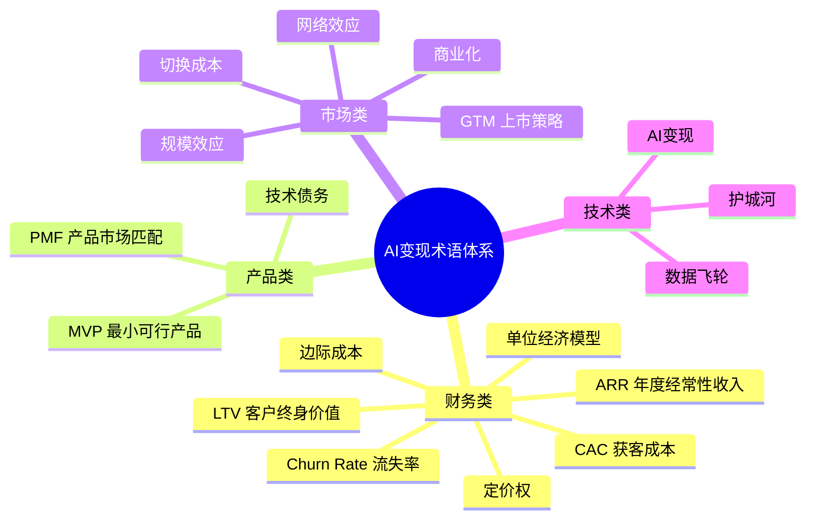

# 核心概念界定：AI变现术语体系

> AI变现领域的术语长期存在"通用定义"与"AI语境特定含义"混淆的问题。本章对全 Wiki 涉及的核心术语进行统一定义，明确其在 AI 变现场景下的特定语义，确保后续章节中"PMF""护城河""单位经济模型"等关键词具有一致的、可操作的解读基准。阅读建议：先看分类总览建立结构认知，再按需查阅具体术语释义。

## 一、术语分类总览

AI 变现术语可归为四类：财务类（衡量变现效率与健康度）、产品类（衡量产品成熟度）、市场类（衡量增长与竞争）、技术类（衡量 AI 特有的壁垒与杠杆）。下图给出 18 个核心术语的分类归属。

### 术语速查表

| 类别 | 术语 | 缩写 | 核心关注点 |
|---|---|---|---|
| 财务 | 客户终身价值 | LTV | 单客户长期净收入贡献 |
| 财务 | 获客成本 | CAC | 单客户获取投入 |
| 财务 | 年度经常性收入 | ARR | 订阅业务年化口径收入 |
| 财务 | 流失率 | Churn Rate | 客户/收入流失比例 |
| 财务 | 单位经济模型 | Unit Economics | 单客户收入-成本结构 |
| 财务 | 边际成本 | Marginal Cost | 单次产出的增量成本 |
| 财务 | 定价权 | Pricing Power | 提价而不流失客户的能力 |
| 产品 | 最小可行产品 | MVP | 低成本验证核心假设 |
| 产品 | 产品市场匹配 | PMF | 产品是否被市场真正接受 |
| 产品 | 技术债务 | Technical Debt | 次优方案的累积维护成本 |
| 市场 | 商业化 | Commercialization | 技术→市场→收入的转化 |
| 市场 | 上市策略 | GTM | 触达客户并完成销售 |
| 市场 | 网络效应 | Network Effects | 用户增长带来的价值提升 |
| 市场 | 切换成本 | Switching Cost | 客户迁移的代价 |
| 市场 | 规模效应 | Economies of Scale | 规模扩大带来的单位成本下降 |
| 技术 | AI变现 | AI Monetization | AI能力→可持续收入 |
| 技术 | 护城河 | Moat | 可持续的竞争优势 |
| 技术 | 数据飞轮 | Data Flywheel | 数据反哺的闭环增长 |

## 二、财务类核心术语

### 1. LTV（Life Time Value，客户终身价值）

- **标准定义**：一个客户在与企业关系存续期内为企业带来的总净收入贡献。
- **AI 变现语境释义**：AI 订阅产品的 LTV 受使用深度影响——重度用户的 token 消耗可能蚕食毛利，因此必须区分"账面 LTV"（订阅收入总额）与"扣推理成本后的净 LTV"，后者才是评估 AI 商业模式可持续性的真实指标。
- **示例**：某 AI 写作工具用户平均使用 18 个月，每月付费 99 元，账面 LTV 为 1782 元，扣除大模型 token 成本后净 LTV 约 1200 元。

### 2. CAC（Customer Acquisition Cost，获客成本）

- **标准定义**：获取一个新客户所投入的全部销售与营销成本（含广告、销售人力、内容运营等）。
- **AI 变现语境释义**：AI 产品 CAC 受开发者社区、免费试用转化、PLG（产品驱动增长）策略影响显著；高 CAC 必须由高客单价或长 LTV 支撑，否则单位经济为负。AI 产品普遍存在"免费用户 token 成本吞噬营销预算"的隐性 CAC。
- **示例**：某企业级 AI 分析平台月营销支出 50 万元，新增付费客户 20 家，CAC 为 2.5 万元；同期免费试用用户消耗 token 成本 8 万元未计入 CAC，需追加修正。

### 3. ARR（Annual Recurring Revenue，年度经常性收入）

- **标准定义**：订阅制业务中所有有效订阅合同按年化口径计算的经常性收入总额。
- **AI 变现语境释义**：AI SaaS 的 ARR 是估值核心指标，但需扣除按用量计费部分（非常规收入）；MRR × 12 仅为简化估算，实际需考虑季节性波动、合同周期差异以及"使用量飙升导致的不可持续收入"。
- **示例**：某 AI 数据标注 SaaS 月经常性收入 80 万元，年化 ARR 约 960 万元；另有按标注量计费的弹性收入不计入 ARR。

### 4. Churn Rate（流失率）

- **标准定义**：特定周期内流失的客户数或收入占期初总数的比例，分客户流失率与收入流失率。
- **AI 变现语境释义**：AI 产品的流失率常因"效果不及预期"或"被底层模型官方功能替代"（如 OpenAI 直接上线同类功能）而偏高；月流失率 > 5% 通常意味着 PMF 或留存策略存在问题。需关注"净收入流失率"（Net Dollar Retention），扩张收入可抵消流失。
- **示例**：某 AI 写作工具月流失率 7%，调研发现流失用户中 60% 因生成质量不稳定转向竞品，30% 因底层模型降价失去付费动力。

### 5. 单位经济模型（Unit Economics）

- **标准定义**：以单个客户或单笔交易为单位的收入与成本分析框架，是商业模式可行性的微观验证。
- **AI 变现语境释义**：AI 产品的单位经济必须计入 GPU 推理成本、token 消耗、训练成本摊销、数据标注成本四项 AI 专属支出。LTV / CAC ≥ 3 是健康基线，但 AI 早期常因推理成本高导致 UE 为负，需通过模型蒸馏、量化、缓存降低推理成本。
- **示例**：某 AI 客服 SaaS 单客户年付 1 万元，推理成本 3000 元、销售与服务成本 4000 元，单位毛利 3000 元，UE 为正。

### 6. 边际成本（Marginal Cost）

- **标准定义**：每增加一个单位产出所增加的总成本。
- **AI 变现语境释义**：AI 产品边际成本主要由推理算力构成，与传统软件 SaaS 的近零边际成本有本质区别。高并发场景下边际成本可能接近甚至超过订阅价格，需通过模型蒸馏、KV 缓存、prompt 缓存、量化压缩等技术手段压低。
- **示例**：某 AI 图片生成工具单张图 GPU 推理成本 0.05 元，按 0.2 元/张收费，毛利率 75%；引入缓存后重复请求成本降至 0.01 元。

### 7. 定价权（Pricing Power）

- **标准定义**：企业在不流失客户的前提下提升产品价格的能力，是商业模式的终极检验。
- **AI 变现语境释义**：AI 产品的定价权来源于效果可量化、工作流深度绑定、替换成本高三要素。纯 API 转售（无差异化的薄包装）无定价权，议价权掌握在底层模型厂商手中；垂直行业 AI 因效果可量化而享有强定价权。
- **示例**：某 AI 风控系统将银行坏账率降低 30%，客户愿按节省金额的 20% 付费；涨价 50% 客户仍续约，享有强定价权。

## 三、产品类核心术语

### 8. MVP（Minimum Viable Product，最小可行产品）

- **标准定义**：用最小成本构建的、能验证核心商业假设的可发布产品版本。
- **AI 变现语境释义**：AI MVP 常以"API 封装 + Prompt 工程 + 人工兜底"形态快速上线，先验证用户是否愿意为 AI 能力付费，再决定是否投入自研模型。AI MVP 的关键不是技术先进性，而是验证"付费意愿"与"使用频次"两个核心假设。
- **示例**：某团队用 GPT-4 API + Prompt 模板上线 AI 合同审查 MVP，2 周内验证 100 家企业付费意愿，再决定自研垂直模型。

### 9. PMF（Product-Market Fit，产品市场匹配）

- **标准定义**：产品满足目标市场真实需求的程度，达到 PMF 意味着产品被市场接受并具备规模化增长基础。
- **AI 变现语境释义**：AI 产品 PMF 的判断标准包括付费留存率、token 使用频次、模型调用深度嵌入用户工作流。"Demo 惊艳但无人付费续费"是典型的伪 PMF，需通过续费率而非试用率判断。
- **示例**：某 AI 编程助手上线 3 个月后，周活用户留存率从 15% 提升至 45%，付费转化率达 8%，月留存付费率 > 80%，标志达到 PMF。

### 10. 技术债务（Technical Debt）

- **标准定义**：为快速交付而采取的次优技术方案所累积的后续维护与重构成本。
- **AI 变现语境释义**：AI 产品的技术债务包括 Prompt 硬编码、模型版本锁定、评测体系缺失、数据漂移未监控、训练数据未版本化等。这些债务会在底层模型升级时集中爆发，直接影响变现稳定性与产品迭代速度。
- **示例**：某 AI 客服产品早期 Prompt 写死在业务代码中，更换底层模型时需重写 80% 业务逻辑，迭代停滞 2 个月。

## 四、市场类核心术语

### 11. 商业化（Commercialization）

- **标准定义**：将技术、产品或研究成果推向市场并实现收入转化的全过程，包含定价、销售、交付、回款等环节。
- **AI 变现语境释义**：AI 商业化往往涉及模型版本分层（开源社区版 / 闭源企业版 / 行业专属版）、API 与私有化部署组合、按用量 / 按席位 / 按效果计费的混合模式。开源引流 + 企业版收费是 AI 商业化的主流路径之一。
- **示例**：开源向量数据库 Milvus 通过社区版免费获取用户，企业版按节点数与 SLA 收费实现商业化。

### 12. GTM（Go-To-Market，上市策略）

- **标准定义**：企业将产品推向目标市场、触达客户并实现销售的整体策略与执行路径。
- **AI 变现语境释义**：AI 产品 GTM 需明确自上而下（企业销售）或自下而上（PLG / 开发者社区）路径，选择开源引流、API 免费额度、行业垂直打法。GTM 错配（如企业级产品走 PLG 路径，或消费品走 SLG 长周期销售）是 AI 创业失败主因之一。
- **示例**：某 AI 代码工具采用开发者免费试用 + 企业版付费的 PLG 路径，6 个月内企业版付费率达 12%，GTM 路径与产品形态匹配。

### 13. 网络效应（Network Effects）

- **标准定义**：产品价值随用户数量增加而提升的网络外部性。
- **AI 变现语境释义**：AI 产品的网络效应常为"数据网络效应"（用户越多 → 数据越多 → 模型越强 → 用户越多）而非传统双边市场网络效应；需警惕数据合规、隐私边界与跨用户数据隔离。多租户场景下数据共享机制设计是数据网络效应的关键。
- **示例**：某 AI 病历质控系统接入医院越多，跨院数据反哺使模型识别罕见病例能力越强，新客户愿意为更高准确率付费。

### 14. 切换成本（Switching Cost）

- **标准定义**：客户从现有产品迁移到替代产品所需付出的时间、金钱与机会成本。
- **AI 变现语境释义**：AI 产品的切换成本来自模型定制（专属微调权重）、数据积累（历史交互语料）、工作流集成（API 嵌入深度、业务系统对接）三方面。高切换成本是留存与涨价的保障，但需平衡"切换成本过高导致新客户不愿进入"的悖论。
- **示例**：客户已用某 AI 客服系统训练了专属 FAQ 库与意图识别模型，迁移至新系统需重新标注 2 万条数据并重新微调，切换成本显著。

### 15. 规模效应（Economies of Scale）

- **标准定义**：随产量或用户规模扩大，单位成本下降的经济学现象。
- **AI 变现语境释义**：AI 的规模效应来自训练成本固定摊薄、推理批处理优化、GPU 利用率提升、数据采集边际成本递减。但模型规模扩大也带来算力成本非线性增长，需平衡"规模"与"经济"——盲目扩大模型规模可能反而破坏单位经济。
- **示例**：某大模型 API 调用量翻 10 倍后，单 token 推理成本从 0.003 元降至 0.0008 元，规模效应释放定价空间。

## 五、技术类核心术语

### 16. AI 变现（AI Monetization）

- **标准定义**：将人工智能技术能力转化为商业收入的过程。
- **AI 变现语境释义**：特指通过 AI 模型、AI 应用、AI 能力 API、数据资产等形成可重复、可持续的收入流，强调"AI 原生"的商业逻辑——模型即服务（MaaS）、推理即计费、效果即定价。区别于"用 AI 降本"（成本侧），AI 变现聚焦"用 AI 创收"（收入侧）。
- **示例**：某团队将开源大模型微调后，通过 API 按 token 计费向电商客户提供商品文案生成服务，月度收入达 50 万元，形成可持续 AI 变现。

### 17. 护城河（Moat）

- **标准定义**：企业拥有的可持续竞争优势，能阻止竞争对手侵蚀其市场份额与利润。
- **AI 变现语境释义**：AI 企业的护城河来源于专属数据、模型微调 know-how、算力成本优势、用户反馈闭环、行业工作流深度集成。纯算法优势（任何人都能复现的公开方法）不构成护城河；开源模型普及后，"模型本身"越来越难以构成护城河，"数据 + 工作流"成为护城河主战场。
- **示例**：医疗影像 AI 公司通过 5 年积累的 200 万张标注病历数据构建壁垒，新进入者难以短期内复现诊断准确率。

### 18. 数据飞轮（Data Flywheel）

- **标准定义**：用户使用产生的数据反哺产品优化，产品提升又吸引更多用户的数据闭环增长机制。
- **AI 变现语境释义**：AI 产品的数据飞轮体现为"用户使用 → 反馈数据 → 模型微调 → 效果提升 → 用户增加"的正循环，是 AI 变现长期竞争力的核心引擎。飞轮启动的关键是"冷启动数据"与"反馈闭环设计"，缺乏反馈采集机制的产品无法形成飞轮。
- **示例**：某 AI 翻译工具收集用户改写结果作为训练数据，6 个月内翻译准确率提升 12%，用户增长 3 倍，飞轮启动。

## 六、术语使用约定

本 Wiki 后续章节使用上述术语时，遵循以下约定：

- 出现 LTV / CAC / ARR / Churn 等指标时，默认指"AI 变现语境下的净口径"（已扣推理成本）。
- 讨论"护城河"时，默认聚焦"数据 + 工作流"维度，不将"算法先进性"单独视为护城河。
- "商业化"与"AI 变现"在本文中可互换使用，但涉及收入侧时优先使用"AI 变现"以强调 AI 原生逻辑。
- 缩写首次出现时给出全称，后续章节直接使用缩写。

---

**上一章**：[00 - AI变现完整指南总览](00-overview.md)  
**下一章**：[02 - 市场需求分析：识别与评估AI商业化机会](02-market-analysis.md)  
**返回目录**：[00 - 总览](00-overview.md)
