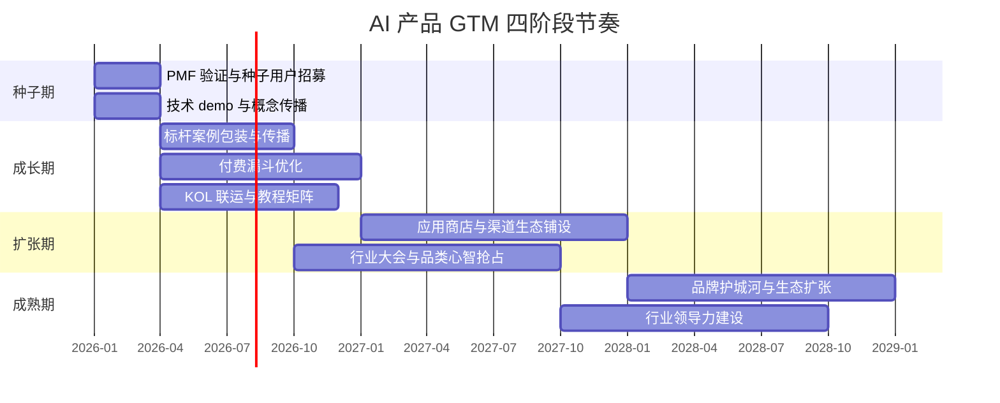

# 市场推广：AI产品的GTM策略

> AI 产品不是"做出来就有人用"。技术领先不等于市场领先，模型能力不等于商业价值。GTM（Go-To-Market）策略决定了 AI 产品能否从"demo 惊艳"走向"持续变现"。本章围绕定位、渠道、传播、节奏与冷启动五个维度，给出可操作的 GTM 框架。

---

## 一、定位策略：在用户心智中占据一个词

### 1.1 品类定义：创造品类 vs 进入品类

定位的第一步是回答"我们是什么品类"。AI 产品通常面临两条路径：

| 路径 | 适用场景 | 优势 | 风险 |
|------|---------|------|------|
| **创造新品类** | 技术范式变革、无现成对照物（如 Midjourney 之于"AI 绘画"、ChatGPT 之于"通用对话"） | 心智空白、定价权高、可定义标准 | 教育市场成本高、需要时间窗口 |
| **进入现有品类** | 已有成熟品类与玩家（如 AI 客服、AI 翻译、AI 写作） | 用户认知现成、需求已被验证 | 同质化竞争激烈、需强差异化锚点 |

**判断准则**：如果用户需要先理解"这是什么"才能理解"为什么好"，倾向创造品类；如果用户已经知道这类工具存在，只需理解"为什么选你"，倾向进入品类。

### 1.2 差异化锚点：四类差异化路径

AI 产品的差异化通常落在以下四个锚点上，建议优先选择一个主锚点，其余作为支撑：

1. **技术差异化**：模型能力或算法壁垒领先（如更准的识别率、更低的延迟、独家的多模态融合）
2. **数据差异化**：拥有独占数据资产或数据飞轮效应（如行业私有语料、用户行为闭环数据）
3. **场景差异化**：深耕某一垂直场景的深度适配（如法律文书生成、医疗影像辅助诊断）
4. **体验差异化**：交互范式或工作流集成度领先（如 Notion AI 的内嵌编辑体验、Cursor 的 IDE 深度集成）

> **避坑提示**：差异化锚点必须是用户可感知的。"我们用了更大的模型"不是差异化，"同样问题答案准确率提升 30%"才是。

### 1.3 定位声明模板

将定位压缩成一句话，便于内部对齐与外部传播：

```
对于 [目标用户群体]，[产品名] 是一个 [品类定义]，
它通过 [核心差异化能力]，帮助用户 [可衡量的价值结果]，
不同于 [主要竞品]，我们的优势是 [不可替代的差异点]。
```

**示例**：
> 对于独立开发者，Cursor 是一个 AI 原生的代码编辑器，它通过全程上下文感知的代码补全与重构，帮助开发者将编码效率提升 2 倍以上，不同于 GitHub Copilot 仅作为插件嵌入，我们的优势是 IDE 层级的深度集成。

### 1.4 AI 产品定位的常见误区

- **误区一：堆砌技术参数**。"基于 175B 参数大模型""使用 RAG + Agent 架构"——用户不买参数，用户买结果
- **误区二：定位过宽**。"面向所有企业的 AI 助手"等于没有定位，早期必须收敛到具体人群与具体场景
- **误区三：以技术代价值**。"我们用了多模态大模型"不是价值，"上传一张图自动生成营销文案"才是价值
- **误区四：照搬传统 SaaS 话术**。AI 产品的价值往往体现在"能力边界"而非"功能清单"，套用 SaaS 的功能罗列会让定位失焦
- **误区五：忽视信任成本**。AI 产品涉及幻觉、隐私、合规等顾虑，定位中需主动回应"为什么可信"

---

## 二、渠道选择：找到性价比最高的触达路径

### 2.1 四类渠道概览

AI 产品的获客渠道主要分为四类，各有不同的成本结构与适用阶段。

| 渠道类型 | 典型载体 | 获客成本 | 用户质量 | 规模上限 | 可控性 | 适用阶段 |
|---------|---------|---------|---------|---------|-------|---------|
| **自有渠道** | 官网、公众号、私域社群、邮件订阅 | 低（边际） | 高 | 中 | 高 | 全周期，尤其中后期 |
| **合作渠道** | 集成商、平台生态（如飞书/钉钉应用市场）、ISV 联运 | 中（分成） | 中高 | 高 | 中 | 成长期与扩张期 |
| **社区渠道** | GitHub、HuggingFace、技术论坛（V2EX/掘金）、Product Hunt | 极低 | 极高（开发者） | 中 | 低 | 种子期与成长期 |
| **应用商店** | App Store、Google Play、各分发市场 | 中高（ASO/竞价） | 中 | 极高 | 中 | C 端产品扩张期 |

### 2.2 渠道选择决策框架

选渠道不是"全都要"，而是按阶段与用户类型匹配：

- **B 端开发者产品**：优先 GitHub + 技术社区 + 自有官网，合作渠道走云市场（AWS/Azure/阿里云）
- **B 端企业 SaaS**：优先自有内容 + 行业活动 + ISV 渠道，应用商店作用有限
- **C 端工具型 AI**：优先应用商店 + 社交媒体（小红书/抖音/B站）+ KOL，社区渠道作辅助
- **C 端创意型 AI**（绘图/视频/写作）：优先社区作品传播 + KOL + 应用商店，内容自传播是关键

### 2.3 渠道组合的"3+1"原则

建议每阶段重点经营 **3 个主渠道 + 1 个试验渠道**，避免摊薄资源。每季度评估渠道 ROI，淘汰表现最差者，从试验池中补位。

---

## 三、营销传播：让目标用户听见、看懂、相信

### 3.1 内容营销：建立专业信任

| 内容形态 | 适用阶段 | 制作成本 | 复用价值 | 典型载体 |
|---------|---------|---------|---------|---------|
| 技术博客 | 全周期 | 中 | 高 | 自有博客、知乎、Medium |
| 案例白皮书 | 成长期起 | 高 | 极高 | 官网下载、销售物料 |
| 教程视频 | 成长期起 | 中高 | 高 | B 站、YouTube、视频号 |
| Prompt 库 / 模板库 | 种子期 | 低 | 中 | GitHub、文档站 |
| 行业报告 | 扩张期 | 极高 | 极高 | 联合发布、媒体合作 |

**内容生产原则**：每篇内容必须服务于一个明确的获客目标（收集线索 / 建立权威 / 教育用户 / SEO 占位），避免"为发而发"。

### 3.2 活动营销：制造节点与势能

- **行业大会**：年度/季度旗舰活动，适合发布重磅产品、塑造行业地位
- **Meetup**：城市级小规模聚会，适合深度用户运营与口碑沉淀，成本低、转化高
- **Webinar（线上研讨会）**：高频低成本，适合 To B 产品线索培育，建议每月 1-2 场
- **Hackathon /共创活动**：激发开发者社区参与，产出集成案例与生态内容

### 3.3 KOL 营销：借势与背书

AI 产品的 KOL 分两类，配合使用效果最佳：

- **技术 KOL**：开发者、研究者、技术博主（如 AI 领域公众号、B 站 UP 主）。擅长建立技术可信度，影响开发者与企业技术决策者
- **行业 KOL**：垂直行业专家、企业高管、咨询顾问。擅长建立业务可信度，影响企业采购决策

**KOL 合作三步法**：① 提供 early access 与独家素材；② 共创内容而非纯投放（让 KOL 真实使用并产出评测/教程）；③ 设立联盟计划（affiliate）让转化可追踪、可分润。

### 3.4 案例营销：用真实结果说话

AI 产品最大的转化障碍是"它真的有用吗"。标杆客户案例是最有效的说服工具，包装方法如下：

1. **选客户**：优先选择行业头部、痛点典型、配合度高的客户
2. **讲故事**：采用 STAR 结构——情境（Situation）、任务（Task）、行动（Action）、结果（Result）
3. **量化结果**：必须有可验证的数据指标（节省工时 X%、成本下降 Y%、准确率提升 Z%）
4. **多形态输出**：一份案例产出文字版、视频版、一图读懂版，覆盖不同触点
5. **授权与合规**：尤其涉及企业客户，需明确数据使用授权与脱敏要求

---

## 四、GTM 节奏设计：分阶段推进，避免"一上来就全国铺开"

### 4.1 四阶段 GTM 框架

| 阶段 | 核心目标 | 主力渠道 | 传播重点 | 预算占比 |
|------|---------|---------|---------|---------|
| **种子期**（0-3 月） | 验证 PMF、获取首批种子用户 | 社区、KOL、自有内容 | 概念验证、技术 demo | 15% |
| **成长期**（3-12 月） | 建立口碑、跑通付费漏斗 | 社区+内容+活动、KOL 联运 | 标杆案例、教程内容 | 35% |
| **扩张期**（12-24 月） | 规模化获客、抢占品类心智 | 应用商店、合作渠道、行业大会 | 品类第一、行业报告 | 35% |
| **成熟期**（24 月+） | 品牌护城河、生态扩张 | 自有渠道为主、生态联运 | 生态、行业领导力 | 15% |

### 4.2 GTM 节奏时间轴



### 4.3 节奏设计的三个原则

- **节奏不可压缩**：每个阶段都有最低时间窗口，跳过种子期直接铺量往往导致"获客越多流失越快"
- **预算前重后稳**：成长期与扩张期是花钱主力，种子期靠"巧劲"而非"砸钱"
- **指标分层**：种子期看激活与留存、成长期看付费转化、扩张期看 CAC/LTV、成熟期看 NPS 与生态规模

### 4.4 GTM 阶段切换的硬性门槛

避免"按时间硬切阶段"的常见错误。阶段切换应基于指标达成，而非日历推进：

| 切换节点 | 通过条件（建议阈值） | 未通过的应对 |
|---------|---------------------|-------------|
| 种子期 → 成长期 | 周留存 ≥ 40%、付费意愿验证 ≥ 10 个付费用户 | 继续打磨 PMF，不进入铺量 |
| 成长期 → 扩张期 | 付费漏斗跑通、CAC < LTV/3、NPS ≥ 30 | 优化漏斗与留存，不放大投放 |
| 扩张期 → 成熟期 | 品类心智占有（品牌词搜索量）进入前 3 | 持续投入心智战役 |

> **关键提醒**：硬性门槛是"刹车"而非"油门"。未达成时强行进入下一阶段，会放大前期问题的成本——种子期留存差的缺陷，在扩张期会被放大 10 倍以上的获客浪费所暴露。

---

## 五、冷启动策略：从 0 到 1 的破局路径

冷启动是 AI 产品最难也最关键的阶段。以下六种策略可单独或组合使用，按团队资源与产品类型选择。

### 5.1 六种冷启动策略

#### 策略一：种子用户深耕
- **适用场景**：B 端垂类产品、需深度反馈迭代的早期产品
- **执行要点**：精选 20-50 个高契合种子用户，提供 1v1 支持、共建功能路线图；用"专属感"换取早期口碑与案例
- **风险**：种子用户需求可能不代表主流，需定期校验

#### 策略二：单点突破
- **适用场景**：能力可复用但场景需聚焦的产品
- **执行要点**：选一个高频高痛的场景作为"敲门砖"，把这一场景做到极致，再横向扩展；典型如 ChatGPT 早期以"对话能力"破局，再扩展至写作、编程、分析
- **风险**：单点过深可能固化品类认知，扩展时需重新教育

#### 策略三：免费工具引流
- **适用场景**：有可拆分的轻量功能、面向开发者的产品
- **执行要点**：把核心能力的一个切片做成免费工具（如 API 试用、Prompt 生成器、模型对比器），用 SEO 与社区传播获客，再向上转化付费版
- **风险**：免费用户转化为付费比例通常 <5%，需设计清晰的上钩

#### 策略四：内容引流
- **适用场景**：团队有内容生产能力、目标用户习惯搜索学习
- **执行要点**：围绕目标用户的高搜索关键词生产系列内容（教程、对比、最佳实践），用 SEO 沉淀长期流量；配合邮件订阅做线索培育
- **风险**：见效慢（通常 3-6 个月），需坚持更新

#### 策略五：活动引爆
- **适用场景**：有话题性或可演示性强的产品、新品发布节点
- **执行要点**：策划一次有传播性的活动（比赛、挑战、限时开放、KOL 集中评测），制造短期流量峰值；典型如 Midjourney 早期的 Discord 社区作品传播
- **风险**：流量来得快走得也快，需承接机制（社群、订阅、新手引导）留住用户

#### 策略六：合作借势
- **适用场景**：可嵌入大平台或大客户工作流的产品
- **执行要点**：与已有用户基数的平台合作（如上架飞书/钉钉应用市场、与云厂商联合方案、嵌入已有 SaaS 工作流），借势获取流量
- **风险**：渠道依赖度高，议价能力弱，需同步建设自有阵地

### 5.2 冷启动策略选择矩阵

| 策略 | B 端开发者 | B 端企业 | C 端工具 | C 端创意 | 见效速度 |
|------|-----------|---------|---------|---------|---------|
| 种子用户 | 强推 | 强推 | 可选 | 可选 | 慢但稳 |
| 单点突破 | 强推 | 强推 | 强推 | 强推 | 中 |
| 免费工具 | 强推 | 可选 | 强推 | 可选 | 中快 |
| 内容引流 | 强推 | 强推 | 可选 | 可选 | 慢 |
| 活动引爆 | 可选 | 可选 | 强推 | 强推 | 快 |
| 合作借势 | 强推 | 强推 | 可选 | 可选 | 中 |

### 5.3 冷启动的三个反直觉认知

1. **冷启动不是"少花钱"，而是"少分散"**：资源有限时，集中投入一个渠道一个场景一个用户群，比铺开做效果好十倍
2. **首批用户的"质量"比"数量"重要**：50 个深度参与的用户比 5000 个注册即流失的用户更有价值
3. **冷启动期不要追求品牌，要追求"被记住"**：早期用户记不住 logo，但记得住"那个解决了我 XX 问题的工具"

### 5.4 冷启动执行清单

将策略落地为可勾选的动作，避免"知道方法但不知从何做起"：

- [ ] 明确首批目标用户画像（1-2 个具体人群 + 场景）
- [ ] 锁定 1 个主冷启动策略 + 1 个备份策略
- [ ] 准备最小可信物料（demo / 试用 / 案例稿）
- [ ] 设计用户反馈收集机制（1v1 访谈模板 / 行为埋点）
- [ ] 设定 30 天内的退出标准（达不到则切换策略，不恋战）

---

## 六、GTM 效果度量：用数据驱动节奏调整

### 6.1 核心指标分层

GTM 不是"市场部的事"，而是需要全公司对齐的数据系统。按漏斗分层定义指标：

| 漏斗层 | 核心指标 | 含义 | 优化方向 |
|-------|---------|------|---------|
| 触达 | 曝光量、品牌词搜索量 | 多少人知道你存在 | 内容传播、SEO、品牌投放 |
| 兴趣 | 访问量、注册转化率 | 多少人主动了解 | 落地页优化、内容质量 |
| 激活 | 首次关键行为率（Aha Moment 达成率） | 多少人体验到核心价值 | 新手引导、首用体验 |
| 留存 | 次日/周/月留存 | 多少人持续用 | 产品价值、习惯培养 |
| 付费 | 付费转化率、ARPU | 多少人愿意付费 | 定价、付费墙设计 |
| 推荐 | K 因子、NPS | 多少人主动推荐 | 邀请机制、口碑运营 |

### 6.2 AI 产品的特殊度量维度

AI 产品的 GTM 度量需在传统漏斗之外补充以下维度：

- **能力使用深度**：单用户调用量、功能覆盖率（反映产品能力被榨取程度）
- **效果满意度**：用户对 AI 输出质量的评分（结合人工评分与隐式反馈）
- **失败成本**：幻觉率、错误率及对应的用户流失影响
- **数据飞轮强度**：用户反馈回流到模型迭代的速度与比例

> **度量反模式**：只看流量不看质量、只看注册不看激活、只看 CAC 不看 LTV。单一指标优化必然导致局部最优而全局失衡。

---

## 本章要点回顾

- **定位**：选择创造品类或进入品类，选定一个主差异化锚点，用定位声明模板对齐内部认知
- **渠道**：四类渠道按产品类型与阶段匹配，坚持"3+1"原则季度复盘
- **传播**：内容、活动、KOL、案例四条线协同，每条线服务于明确获客目标
- **节奏**：种子→成长→扩张→成熟四阶段推进，节奏不可压缩、预算前重后稳、切换看指标不看日历
- **冷启动**：六种策略按场景选择，集中投入、深耕质量、追求被记住
- **度量**：漏斗六层指标 + AI 特殊维度，避免单一指标优化导致的局部最优

---

**上一章**：[05 - 产品开发：AI产品的构建与迭代流程](05-product-development.md)  
**下一章**：[07 - 盈利策略：定价模型与规模化路径](07-profitability-strategy.md)  
**返回目录**：[00 - 总览](00-overview.md)
