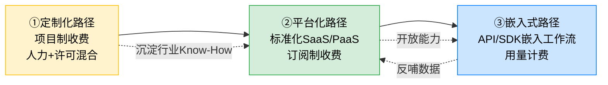

# 企业服务场景：ToB AI应用变现路径

> ToB（To Business）AI应用是企业数字化转型的重要引擎。与面向消费者的ToC产品相比，ToB AI应用具有决策链长、采购周期长、定制化需求强、数据安全要求高、客户黏性强等鲜明特征，这决定了其变现路径不能照搬ToC模式，而需要构建适配企业采购与运营节奏的商业模式。

## 一、ToB AI应用的核心特点

ToB AI应用的本质是"用AI替换或增强企业既有业务流程"，其价值取决于能否在企业现有IT架构、组织流程和合规框架内稳定运行。理解以下五大特点，是设计变现路径的前提：

1. **决策链长**：从需求识别到采购拍板，通常涉及业务部门、IT部门、采购部门、法务、安全合规乃至C-Level多角色，平均决策周期3-9个月。
2. **采购周期长**：包含需求调研、供应商筛选、POC验证、商务谈判、合同签订、实施交付等多阶段，整体周期6-12个月不等。
3. **定制化需求强**：不同行业、不同规模企业的业务流程差异巨大，标准化产品难以直接覆盖，需要领域知识注入和流程适配。
4. **数据安全要求高**：企业数据涉及客户隐私、商业机密、监管合规（如《数据安全法》《个人信息保护法》、GDPR、HIPAA等），对部署模式、数据流转、访问控制有严格约束。
5. **客户黏性强**：一旦AI能力嵌入企业核心业务流程，迁移成本和业务中断风险极高，形成天然护城河，续约率普遍在80%以上。

### 1.1 ToB 与 ToC AI应用对比

| 维度 | ToB AI应用 | ToC AI应用 |
|------|-----------|-----------|
| 决策者 | 多角色采购委员会 | 终端用户个人决策 |
| 决策周期 | 3-9个月，长周期 | 秒级到数小时，短周期 |
| 付费方 | 企业预算（CapEx/OpEx） | 个人钱包，感性消费 |
| 定价模式 | 订阅/项目/许可/用量混合 | 订阅/广告/免费增值 |
| 定制化 | 高，需行业适配 | 低，标准化产品 |
| 数据安全 | 严苛，私有化部署为主 | 中等，公有云为主 |
| 客户黏性 | 强，迁移成本高 | 弱，切换成本低 |
| 增长曲线 | 阶梯式，靠KA驱动 | 指数式，靠流量驱动 |
| 销售模式 | 直销为主，渠道为辅 | 自助开通，PLG驱动 |
| 单客户价值 | 高（ARPU万级到百万级） | 低（ARPU几十到几百） |
| 失败成本 | 高，影响企业业务连续性 | 低，用户可随时弃用 |

## 二、典型变现路径分析

ToB AI应用的变现路径并非单一，而是随企业成熟度、客户规模、行业特性的不同，呈现"定制→平台→嵌入"的演进关系。三条路径各有适用阶段，也常组合使用。

### 2.1 三条路径的演进关系

### 2.2 路径一：定制化路径

**核心模式**：项目制收费 + 人力服务费 + 软件许可费的混合模式。供应商根据客户需求提供端到端的AI解决方案，包含需求调研、算法开发、系统集成、运维支持等全流程服务。

**收费结构**：
- 一次性项目费（开发与实施）：50万-2000万元不等
- 年度许可费（基础软件）：项目费的15%-25%
- 运维与增强服务费：项目费的10%-20%/年

**适用阶段**：
- 创业公司起步期：通过定制项目验证产品-market fit，积累行业知识
- 客户为大型企业/政府/国企：对私有化部署、定制化有刚性需求
- 新行业拓展期：进入新垂直领域时，需深度定制建立标杆

**典型案例**：
- 第四范式：早期通过定制化AI项目服务银行、能源等行业头部客户，沉淀行业Know-How后再推出标准化平台
- 海康威视AI Cloud：为公安、交通等行业提供端到端定制方案

**优势**：客单价高、客户深度绑定、行业壁垒深  
**劣势**：交付重、难规模化、毛利受人力成本挤压

### 2.3 路径二：平台化路径

**核心模式**：将通用AI能力抽象为标准化SaaS或PaaS产品，通过订阅制收费。客户在标准平台上自助配置、按需使用，供应商不再提供深度定制服务。

**收费结构**：
- SaaS订阅：按席位/模块/套餐分级定价（如基础版/专业版/企业版）
- PaaS用量计费：按调用量、训练时长、存储量等计量
- 增值服务：高级模板、专家咨询、优先支持

**适用阶段**：
- 已通过定制化沉淀行业模板和最佳实践，可抽象出标准化能力
- 目标客户群体为中型企业，具备一定自助能力
- 通用AI能力（OCR、NLP、推荐等）市场需求已规模化

**典型案例**：
- 商汤SenseCore：将视觉AI能力封装为标准化平台，对外提供MaaS（Model-as-a-Service）
- 阿里云PAI：机器学习PaaS平台，按计算资源用量计费
- Salesforce Einstein：在CRM标准产品上叠加AI能力，按席位订阅

**优势**：边际成本低、可规模化、毛利高（70%+）  
**劣势**：标准化与定制化的平衡难、客户教育成本高

### 2.4 路径三：嵌入式路径

**核心模式**：将AI能力以API/SDK形式嵌入客户既有工作流系统（如ERP、CRM、OA、SaaS应用），客户在原系统中无感调用AI能力，供应商按调用量或嵌入席位收费。

**收费结构**：
- API调用计费：按token/次数/QPS阶梯定价
- SDK嵌入授权：按嵌入产品SKU或客户规模授权
- 分成模式：与ISV/SaaS厂商按AI能力产生的增量收入分成

**适用阶段**：
- AI能力已高度标准化、稳定可靠
- 客户工作流系统成熟，对API/SDK集成接受度高
- 已建立开发者生态或ISV合作网络

**典型案例**：
- OpenAI API：将GPT能力以API形式嵌入各类SaaS应用（如Notion AI、GitHub Copilot底层）
- 阿里通义千问API：嵌入电商、内容平台，按调用量计费
- Stripe Radar：将风控AI嵌入支付流程，按交易量计费

**优势**：轻量、规模化潜力大、生态协同强  
**劣势**：单次调用价值低、对API稳定性要求极高、易被替代

## 三、成功案例深度剖析

以下选取AI客服、智能营销、AI风控三个垂直领域的代表性案例，剖析其变现路径与商业逻辑。

### 3.1 案例一：智齿科技——AI客服的"定制+平台"双轮驱动

**背景**：
智齿科技成立于2014年，是国内领先的智能客服解决方案提供商。客服场景天然具备AI落地条件：对话数据丰富、人工成本高、可量化效果（响应时间、解决率、人效）。

**解决方案**：
- 全渠道智能客服平台：覆盖在线客服、呼叫中心、工单、智能机器人、智能外呼
- 自研NLP引擎：意图识别、多轮对话、知识图谱、情感分析
- 行业知识包：金融、电商、教育、政企等行业专属语料与话术

**商业模式**（定制+平台混合）：
- 大客户：定制化项目（私有化部署+定制开发），单合同500万-3000万
- 中小客户：SaaS订阅（按席位+功能模块），年费5万-50万
- 增值：智能外呼按分钟计费、知识库按量计费

**成果**：
- 服务超过10万家企业客户，包括招商银行、京东、海底捞等行业头部
- 2022年营收突破5亿元，毛利率约65%
- 完成D轮融资，估值超60亿元

**启示**：
1. **行业化是关键**：通用客服能力易同质化，行业知识包构筑差异化壁垒
2. **分层变现**：大客户定制贡献营收基本盘，中小客户SaaS贡献增长与毛利
3. **效果可量化**：将AI价值转化为客服KPI（解决率提升、人力下降），降低客户决策阻力

### 3.2 案例二：神策数据——智能营销的数据驱动变现

**背景**：
神策数据成立于2015年，定位"用户行为分析平台"，为零售、金融、互联网等行业企业提供数据驱动的智能营销解决方案。其核心痛点：企业积累大量用户数据但难以转化为营销行动。

**解决方案**：
- 神策分析：用户行为分析平台，提供事件分析、漏斗、留存、归因等模型
- 神策智能运营：基于用户画像的自动化营销触达（推送、短信、邮件、APP内消息）
- 神策推荐：个性化推荐引擎，嵌入APP/网站
- 数据治理：CDP（客户数据平台）能力，打通企业内部数据孤岛

**商业模式**（平台化为主）：
- SaaS订阅：按数据量+功能模块分级（标准版/企业版/旗舰版），年费10万-200万
- 私有化部署：金融、政企等数据敏感行业，单项目100万-500万+年度运维
- 行业解决方案包：零售、金融等行业垂直方案，溢价30%-50%

**成果**：
- 服务2000+付费客户，包括中国银行、东方航空、东方财富、华润等
- 2021年完成D轮融资2亿美元，估值超15亿美元（独角兽）
- 客户续约率持续保持在90%以上

**启示**：
1. **数据闭环是护城河**：从"分析"到"运营"到"推荐"，越用数据越多，迁移成本越高
2. **私有化与SaaS并重**：金融、政企客户的私有化部署贡献高客单价，SaaS贡献规模化
3. **行业垂直方案溢价**：通用平台同质化严重，行业解决方案可显著提升客单价与差异化

### 3.3 案例三：同盾科技——AI风控的"嵌入式+定制化"组合

**背景**：
同盾科技成立于2013年，是国内AI风控领域的头部企业。金融风控场景天然适合AI落地：数据结构化程度高、可量化（坏账率、欺诈拦截率）、监管要求严格。

**解决方案**：
- 智能风控：反欺诈、信用评估、设备指纹、行为验证
- 信贷决策：从反欺诈到信用评分到贷后管理的全流程
- 智能反洗钱：基于图计算与NLP的AML解决方案
- 联邦学习：在数据不出域前提下实现跨机构联合建模（满足合规要求）

**商业模式**（嵌入式+定制化组合）：
- API调用计费：反欺诈查询、信用评分等按调用次数计费（0.1-5元/次）
- 私有化部署：银行、消费金融等大客户，单项目300万-2000万
- 联邦学习平台授权：按机构数+模型数授权
- 咨询与建模服务：按项目人力费

**成果**：
- 服务超过1万家客户，包括工商银行、建设银行、招商银行、京东金融等
- 累计API调用量超千亿次
- 完成E轮融资，估值超20亿美元

**启示**：
1. **合规即壁垒**：联邦学习等合规技术不仅满足监管，更成为差异化竞争力
2. **嵌入式变现威力大**：高频API调用（千亿级）形成稳定现金流，且切换成本高
3. **数据飞轮效应**：调用越多，数据越多，模型越准，进一步吸引更多客户

## 四、行业特定挑战与应对策略

ToB AI应用虽具备客户黏性强等优势，但也面临交付周期长、定制成本高、数据安全、客户教育等挑战。以下为典型挑战与应对策略：

| 挑战 | 具体表现 | 应对策略 | 实践案例 |
|------|---------|---------|---------|
| 交付周期长 | 项目从立项到上线6-12个月，影响现金流与团队产能 | 模块化交付：将项目拆分为MVP+迭代，每2-4周交付可见成果；敏捷验收：分阶段验收与付款 | 智齿科技：客服机器人先上线（4周），后续迭代工单、外呼模块 |
| 定制成本高 | 行业差异大，每个客户都需要定制开发，毛利被人力成本侵蚀 | 标准化底座+配置化扩展：构建行业无关的核心引擎，通过配置而非开发满足定制；行业模板沉淀：将定制成果抽象为可复用模板 | 第四范式：先知平台底层标准化，金融/能源等行业通过模板配置实现 |
| 数据安全 | 客户数据敏感，公有云部署受阻；数据出境、跨机构共享受限 | 私有化部署：为大客户提供专属部署；联邦学习：数据不出域前提下联合建模；数据脱敏：差分隐私、k-匿名等技术 | 同盾科技：联邦学习平台已应用于多家银行联合风控 |
| 客户教育成本 | 企业对AI能力认知不足，难以理解价值与风险；POC周期长、效果难量化 | 行业解决方案包装：将技术能力包装为业务语言（如"反欺诈拦截率"而非"模型AUC"）；标杆案例驱动：用同行业成功案例降低决策阻力 | 神策数据：每个行业有专属解决方案白皮书+标杆案例 |
| 销售周期长 | 决策链多、POC成本高，单客户获客成本（CAC）高 | 直销+生态伙伴组合：直销聚焦KA，ISV/集成商覆盖中小客户；免费POC工具化：提供标准化评估工具降低POC成本 | 阿里云PAI：通过合作伙伴生态覆盖中小企业 |
| 续约与流失 | 客户业务变化、模型效果衰减导致续约风险 | 模型持续优化服务：提供持续训练与效果监控；客户成功团队：主动跟进使用情况，识别流失信号 | Salesforce Einstein：Customer Success Manager机制 |
| 效果归因 | AI贡献难以从业务整体效果中剥离，影响续约与涨价 | 业务指标对齐：在合同中明确量化KPI（如解决率、转化率）；A/B测试机制：提供效果对比工具证明AI价值 | 智齿科技：每季度输出客服KPI提升报告 |
| 数据冷启动 | 新客户缺乏历史数据，模型效果差，影响首单 | 预训练行业模型：基于公开数据与历史项目沉淀通用模型；迁移学习：将其他客户模型微调适配新客户 | 商汤SenseCore：行业预训练大模型快速适配 |

## 五、变现路径选择框架

针对不同阶段、不同资源禀赋的ToB AI创业公司，建议按以下框架选择变现路径：

### 5.1 决策矩阵

| 维度 | 定制化优先 | 平台化优先 | 嵌入式优先 |
|------|-----------|-----------|-----------|
| 公司阶段 | 早期，需验证PMF | 成长期，已积累行业知识 | 成熟期，能力高度标准化 |
| 目标客户 | 大型企业/政府 | 中型企业为主 | 已有生态/ISV网络 |
| 团队构成 | 行业专家+算法+实施 | 产品+研发主导 | 平台+开发者关系 |
| 营收节奏 | 项目制，毛利30%-50% | 订阅制，毛利70%+ | 用量制，毛利80%+ |
| 现金流 | 前期重投入，回款慢 | 续约驱动，可预测 | 高频小额，稳定 |
| 壁垒来源 | 行业Know-How+客户关系 | 平台网络效应 | 生态锁定 |

### 5.2 演进建议

1. **起步期（0-3年）**：以定制化为主，深度服务3-5个头部客户，沉淀行业知识与标准化能力。营收占比：定制70%+。
2. **成长期（3-5年）**：定制与平台并行，将定制中沉淀的能力抽象为标准产品，逐步降低定制比例。营收占比：定制50%，平台40%，嵌入10%。
3. **成熟期（5年+）**：平台与嵌入为主，定制仅保留战略客户。营收占比：定制20%，平台50%，嵌入30%。

## 六、关键经验总结

1. **行业纵深优于横向广度**：通用AI能力易同质化，深耕1-2个行业建立知识壁垒，是ToB变现的核心。智齿、神策、同盾的成功均印证这一点。

2. **混合变现模式是常态**：纯定制、纯SaaS、纯API均难以兼顾规模与利润，"定制+平台+嵌入"的混合模式是ToB AI应用的成熟形态。

3. **合规即竞争力**：数据安全与合规不是成本，而是壁垒。联邦学习、私有化部署等合规能力可转化为差异化优势。

4. **效果可量化是续约前提**：将AI能力转化为客户业务KPI（解决率、转化率、坏账率等），并在合同与续约中体现，是降低续约风险的关键。

5. **从定制到平台到嵌入的演进**：定制化沉淀Know-How → 平台化抽象标准能力 → 嵌入式实现规模化与生态化，是ToB AI应用变现的自然演进路径，不可跳步。

6. **数据飞轮是终极护城河**：通过嵌入式变现获取更多调用数据 → 训练更优模型 → 吸引更多客户 → 形成正向循环。同盾科技千亿级API调用即为典范。

---

**上一章**：[07 - 盈利策略：定价模型与规模化路径](07-profitability-strategy.md)  
**下一章**：[09 - 消费级产品场景：ToC AI应用变现路径](09-scenario-consumer.md)  
**返回目录**：[00 - 总览](00-overview.md)
