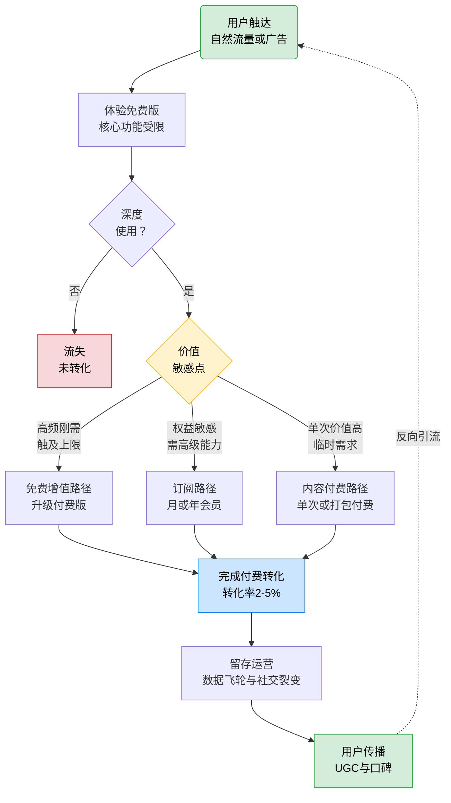

# 消费级产品场景：ToC AI应用变现路径

> ToC（To Consumer）AI应用是AI技术触达大众的最直接形态。与ToB应用的长决策链、重交付不同，ToC AI应用以"决策链短、规模化潜力大、留存挑战严峻"为核心特征。从AI写作、AI绘画到AI陪伴，海量用户在数秒内完成体验决策，又在数日内决定去留。理解ToC变现的底层逻辑，是把握AI大众化红利的关键。

## 一、ToC AI应用的核心特点

ToC AI应用的本质是"用AI降低个人用户的创造门槛或提升娱乐体验"。其价值取决于能否在极短的决策窗口内捕获用户，并通过持续的场景深化与情感连接留住用户。以下五大特点是设计变现路径的前提：

1. **决策链短**：用户从接触到决定使用通常在数秒到数分钟内完成，依赖直觉而非采购委员会，"第一印象即生死"。
2. **获客竞争激烈**：应用商店、社交媒体、口碑传播是主战场，单用户获取成本（CAC）持续攀升，自然流量红利收窄。
3. **留存难**：用户切换成本极低，竞品体验稍有提升即可引发迁移；30日留存率普遍低于20%，"获客即流失"陷阱频发。
4. **同质化严重**：底层模型趋同（多数基于开源大模型微调），功能易被复制，护城河难以仅靠技术建立。
5. **规模化潜力大**：一旦突破PMF（Product-Market Fit），用户增长可呈指数级，单用户价值虽低但总量可观，边际成本极低。

### 1.1 ToC 与 ToB AI应用对比

| 维度 | ToC AI应用 | ToB AI应用 |
|------|-----------|-----------|
| 决策者 | 终端用户个人决策 | 多角色采购委员会 |
| 决策周期 | 秒级到数小时，短周期 | 3-9个月，长周期 |
| 付费方 | 个人钱包，感性消费 | 企业预算（CapEx/OpEx） |
| 定价模式 | 订阅/广告/免费增值/内容付费 | 订阅/项目/许可/用量混合 |
| 定制化 | 低，标准化产品 | 高，需行业适配 |
| 数据安全 | 中等，公有云为主 | 严苛，私有化部署为主 |
| 客户黏性 | 弱，切换成本低 | 强，迁移成本高 |
| 增长曲线 | 指数式，靠流量驱动 | 阶梯式，靠KA驱动 |
| 销售模式 | 自助开通，PLG驱动 | 直销为主，渠道为辅 |
| 单用户价值 | 低（ARPU几十到几百） | 高（ARPU万级到百万级） |
| 失败成本 | 低，用户可随时弃用 | 高，影响企业业务连续性 |
| 核心风险 | 留存与获客成本 | 交付周期与效果归因 |

## 二、典型变现路径分析

ToC AI应用的变现路径围绕"先体验、后付费"的核心理念展开，根据产品形态与用户价值感知方式的不同，呈现"免费增值→订阅→内容付费"的递进关系。三条路径并非互斥，常组合使用以覆盖不同用户分层。

### 2.1 三路径的客户旅程

### 2.2 路径一：免费增值路径

**核心模式**：免费版引流 + 付费版转化。免费版提供基础功能（通常带用量限制或水印），让用户零门槛体验AI价值；付费版解除限制、解锁高级能力，实现转化。这是ToC AI应用最主流的路径。

**转化率基准**：行业平均免费到付费转化率为2%-5%。低于2%说明免费版过于宽裕或付费墙过陡，高于5%通常意味着免费版限制过严（影响获客规模）。头部产品如Notion AI、Canva AI可达5%-8%。

**收费结构**：
- 免费版：每日限额（如10-50次生成）、基础模型、带水印导出
- 付费版（Pro）：解除限额、高级模型、无水印、优先响应，月费$8-$20或年费$80-$200
- 团队版：协作功能、管理后台、统一计费

**适用场景**：
- AI工具类产品（写作、绘画、剪辑、设计），用户有明确产出需求
- 产品的"啊哈时刻"可在免费体验中感知，但完整价值需付费解锁
- 目标用户基数大，可通过规模弥补低转化率

**典型案例**：
- Notion AI：免费用户每月20次AI调用，超出需订阅Notion Plus（$10/月）
- Canva AI：免费版基础设计模板，Magic Studio高级AI功能需Canva Pro（$12.99/月）
- 秘塔写作猫：免费版基础校对，高级改写与续写需付费

**优势**：获客门槛低、用户教育自然、PLG驱动规模化  
**劣势**：免费用户占用算力成本、转化率天花板明显、对免费版边界设计要求高

### 2.3 路径二：订阅路径

**核心模式**：月/年订阅制会员，将AI能力打包为持续可用的会员权益。用户为"持续使用权"而非"单次产出"付费，强调长期价值与会员身份认同。与免费增值的差异在于：订阅路径通常提供完整试用（7-14天）后转为纯付费，而非永久免费版。

**会员权益设计**：
- 基础权益：核心AI功能无限使用、优先算力、去广告
- 增值权益：高级模型访问（如GPT-4级模型）、独家模板/风格、云端存储、多设备同步
- 社群权益：会员社区、优先反馈通道、内测资格、创作者认证
- 分层定价：个人版/专业版/家庭版/创作者版，覆盖不同支付意愿

**收费结构**：
- 月订阅：$10-$30，适合尝鲜与短期需求
- 年订阅：$100-$300，通常优惠20%-30%，锁定长期用户
- 一次性终身版：$200-$500，适合核心粉丝，现金流一次性回收

**适用场景**：
- AI陪伴、AI助手等高频使用场景，用户需持续交互
- 产品价值随使用深度递增（如个性化记忆、风格学习）
- 用户已形成使用习惯，切换成本较高

**典型案例**：
- Midjourney：无免费版，直接订阅制（$10-$60/月），按GPU时长分级
- ChatGPT Plus：$20/月，提供GPT-4访问、优先响应、插件功能
- 星野（AI陪伴）：月卡/年卡订阅，解锁深度对话与专属角色

**优势**：收入可预测性强、LTV高、便于精细化运营  
**劣势**：获客门槛较高、试用期流失风险、需持续提供新鲜感防流失

### 2.4 路径三：内容付费路径

**核心模式**：按内容产出付费，包括单次付费、打包付费、打赏三种形式。用户不为"使用权"付费，而为"特定结果"付费，决策更轻量，适合低频但单次价值高的场景。

**三种形式**：
- 单次付费：单次生成或单份内容付费，如AI写真$5-$20/组、AI头像$2-$10/套
- 打包付费：按主题或数量打包，如50张AI壁纸$10、AI简历模板包$15
- 打赏制：免费生成基础上，用户自愿打赏支持创作者或解锁高清版

**收费结构**：
- 单次定价：$2-$50，根据内容复杂度与独家性
- 打包溢价：相对单次优惠30%-50%，提升客单价
- 打赏：通常$1-$10，依赖用户慷慨度与情感连接

**适用场景**：
- AI写真、AI头像、AI壁纸等"一次性消费"内容
- 内容生产类工具（AI绘画、AI音乐）的非订阅用户转化
- UGC平台中创作者与消费者的直接交易

**典型案例**：
- 妙鸭相机：AI写真单次付费（9.9元），一度刷屏朋友圈
- SeaArt（海艺）：AI绘画平台，单次高清导出付费或积分制
- Civitai：Stable Diffusion模型社区，打赏与付费模型下载

**优势**：决策门槛低、适合病毒式传播、不绑定长期关系  
**劣势**：复购率低、收入波动大、难以构建持续护城河

## 三、成功案例深度剖析

以下选取AI写作、AI绘画、AI陪伴三个ToC核心赛道的代表性案例，覆盖国内外市场，剖析其变现路径与商业逻辑。

### 3.1 案例一：秘塔写作猫——AI写作的"免费增值+垂直深化"

**背景**：
秘塔科技成立于2015年，旗下"秘塔写作猫"是国内领先的AI写作辅助工具。AI写作场景天然适合ToC变现：用户基数大（学生、自媒体、白领）、需求高频、产出可量化。但赛道竞争激烈，面临Notion AI、Grammarly、WPS AI等国内外强敌。

**解决方案**：
- 智能校对：错别字、语法、标点、语病检测，覆盖中英文
- AI改写与续写：基于大模型的文本润色、风格转换、内容扩写
- 写作模板：公文、论文、营销文案、小说等场景化模板
- 秘塔AI搜索（2024年推出）：无广告、直答式AI搜索，差异化切入

**商业模式**（免费增值为主）：
- 免费版：基础校对不限次，AI改写每日限额（约500字）
- 个人版：¥39/月或¥299/年，解除限额、解锁高级模板与长文处理
- 团队版：¥199/人/月起，协作功能与团队词库
- 企业版：私有化部署，按席位定价

**成果**：
- 累计用户超千万，月活百万级
- 秘塔AI搜索上线数月日活破百万，成为国内无广告搜索的口碑标杆
- 2024年完成数亿元融资，估值进入独角兽梯队

**启示**：
1. **垂直深化优于横向铺开**：写作猫先深耕中文校对这一"被Grammarly忽视"的细分场景，建立口碑后再扩展AI能力，避免了与巨头的正面竞争。
2. **免费版是获客引擎而非成本负担**：基础校对免费既降低获客门槛，又通过高频使用培养用户依赖，为付费转化蓄水。
3. **差异化场景切入破局**：秘塔AI搜索以"无广告直答"切入，精准击中用户对传统搜索广告泛滥的痛点，实现病毒式传播。

### 3.2 案例二：Midjourney——AI绘画的"订阅制+社区驱动"

**背景**：
Midjourney成立于2021年，是全球领先的AI图像生成平台。AI绘画是ToC AI变现最成功的赛道之一：视觉冲击力强、社交传播属性天然、单次产出价值明确。但赛道内Stable Diffusion开源生态免费提供同类能力，商业化挑战巨大。

**解决方案**：
- 自研闭源模型：图像质量与艺术性领先开源模型一代以上
- Discord原生交互：通过Bot在Discord中直接生成图像，零客户端门槛
- 风格化能力：突出艺术感与审美调性，区别于DALL-E的写实倾向
- 社区共创：用户作品公开可见，形成灵感池与社交传播

**商业模式**（纯订阅制，无免费版）：
- Basic Plan：$10/月，约200张图片/月
- Standard Plan：$30/月，约900张图片/月+放松生成时长
- Pro Plan：$60/月，优先队列、私有生成、混合图片
- Mega Plan：$120/月，最高额度+12小时快速生成

**成果**：
- 2023年ARR（年经常性收入）突破1亿美元，团队仅约40人
- Discord社区成员超2000万，是全球最大AI创作社区之一
- 人均产值超250万美元，远超传统SaaS公司
- 2024年推出网页版，进一步降低使用门槛

**启示**：
1. **极致产品力支撑纯订阅**：在开源免费竞品环绕下，Midjourney凭借质量代差优势成功推行纯订阅制，证明ToC AI变现的核心是"不可替代的价值"而非"低价"。
2. **社区即护城河**：Discord原生交互让创作天然公开，形成灵感共享与社交传播的飞轮，用户不仅为工具付费，更为社区身份与氛围付费。
3. **审美调性是差异化关键**：在所有人都用相同底层模型的时代，Midjourney通过艺术化的默认风格与调参哲学，建立了独特的"品牌审美"，这是开源生态难以复制的。

### 3.3 案例三：星野——AI陪伴的"订阅+内容付费"组合

**背景**：
星野是MiniMax旗下AI陪伴产品，2023年上线，定位"沉浸式AI角色对话"。AI陪伴是ToC AI的"情感赛道"：用户付费意愿源于情感连接而非工具价值，LTV潜力高但留存挑战严峻。同期竞品包括Character.AI（海外）、Glow、筑梦岛等。

**解决方案**：
- 角色创建与扮演：用户可创建或选择AI角色，进行多轮沉浸式对话
- 高质量语音：自研语音模型，角色音色自然且有情感起伏
- 视觉化呈现：角色立绘、场景图、互动卡牌，增强沉浸感
- 社区与UGC：用户分享自创角色，形成角色生态

**商业模式**（订阅+内容付费组合）：
- 免费+订阅：基础对话免费，星钻会员（¥30-68/月）解锁长记忆、高级语音、专属形象
- 内容付费：付费角色（¥6-30/个）、限定皮肤、剧情包
- 打赏制：对喜爱的创作者角色打赏"星币"，平台抽成
- 虚拟礼物：对话中赠送虚拟礼物，增强情感表达

**成果**：
- 上线数月日活破百万，登顶App Store社交榜
- 用户日均使用时长超60分钟，远高于工具类AI应用
- 付费率约8%-12%，显著高于行业平均的2%-5%
- MiniMax估值超25亿美元，星野是其ToC核心阵地

**启示**：
1. **情感连接提升付费意愿**：AI陪伴的付费率远高于工具类产品，因用户为"关系"而非"功能"付费，情感依恋天然提升LTV与价格敏感度。
2. **内容付费与订阅互补**：订阅提供持续权益，内容付费满足即时情感需求（如限定角色、剧情），二者组合覆盖不同付费动机。
3. **UGC生态是留存关键**：用户自创角色形成长尾内容池，既降低平台内容生产成本，又通过创作者与玩家的双向绑定提升留存。

## 四、行业特定挑战与应对策略

ToC AI应用虽具备规模化潜力，但面临留存低、获客贵、同质化、算力成本四大严峻挑战。以下为典型挑战与应对策略：

| 挑战 | 具体表现 | 应对策略 | 实践案例 |
|------|---------|---------|---------|
| 留存率低 | 30日留存率普遍低于20%，用户尝鲜后快速流失 | 核心场景深化：持续投入核心场景能力，让产品不可替代；数据飞轮：用户使用越多，个性化越准，迁移成本越高；社交裂变：引入关注、分享、共创机制，用社交关系锁定留存 | 星野：通过长记忆与个性化语音建立情感依恋，30日留存率达35%以上 |
| 获客成本高 | 自然流量红利收窄，买量CAC攀升至$5-$30，ROI压力大 | 自然流量建设：SEO、ASO、内容营销构建有机获客；UGC传播：让用户产出成为传播素材，激发病毒式扩散；合作借势：与IP、KOL、平台联动，借势曝光 | Midjourney：Discord社区作品天然公开可见，形成灵感共享与口碑传播，几乎零广告获客 |
| 同质化严重 | 底层模型趋同，功能易被复制，价格战频发 | 差异化场景：切入巨头忽视的细分场景建立心智；数据壁垒：积累垂直场景专有数据训练专属模型；品牌心智：通过审美、调性、价值观建立品牌辨识度 | 秘塔写作猫：深耕中文校对细分场景，积累中文语料壁垒，避开与Grammarley的正面竞争 |
| 算力成本压力 | AI推理成本高昂，免费用户每次调用都在烧钱，毛利承压 | 缓存优化：对高频相似请求缓存结果，降低重复推理；模型蒸馏：将大模型蒸馏为小模型，降低单次推理成本；分时调度：利用闲时算力服务低优先级请求，降低峰值成本 | ChatGPT：免费版使用GPT-3.5蒸馏模型，Plus用户才访问完整GPT-4，分层控制算力成本 |

## 五、关键经验总结

1. **留存是ToC变现的第一性原理**：获客决定规模上限，留存决定LTV下限。在留存率低于20%的ToC AI赛道，任何获客投入都是漏水桶。核心场景深化、数据飞轮、社交绑定是留存的三板斧。

2. **免费增值是主流，但免费墙设计是艺术**：免费版过宽则转化率低，过窄则获客受阻。2%-5%的转化率是健康基准，需通过A/B测试持续优化付费墙位置与触发时机。

3. **情感价值高于工具价值**：AI陪伴类产品付费率（8%-12%）远高于工具类（2%-5%），证明用户为情感连接付费的意愿更强。即便是工具类产品，也应思考如何注入情感化设计与社区氛围。

4. **不可替代性是定价权的来源**：Midjourney在开源免费竞品环绕下仍能推行纯订阅制，根本原因在于质量代差。ToC AI变现的核心竞争力不是"便宜"，而是"不可替代"。

5. **UGC生态是规模化护城河**：用户自创内容（角色、模板、模型、作品）形成长尾内容池，既降低平台生产成本，又通过创作者-消费者的双向绑定提升留存。Midjourney社区、Civitai模型库、星野角色生态均印证此路径。

6. **算力成本治理决定毛利生死线**：免费用户的算力消耗是ToC AI应用最大的隐性成本。缓存优化、模型蒸馏、分时调度、分层服务（免费用小模型，付费用大模型）是控制算力成本的四大杠杆，直接决定能否实现规模化盈利。

---

**上一章**：[08 - 企业服务场景：ToB AI应用变现路径](08-scenario-enterprise.md)  
**下一章**：[10 - 行业解决方案场景：垂直行业AI变现路径](10-scenario-industry.md)  
**返回目录**：[00 - 总览](00-overview.md)
