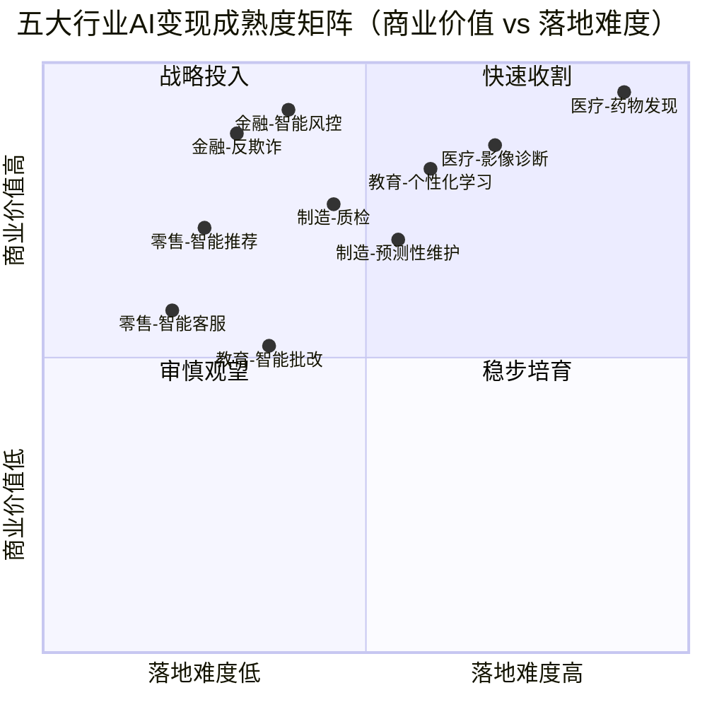

# 10、行业解决方案场景：垂直行业AI变现路径

## 10.1 本章导读

前一章聚焦 ToC 消费级产品的"轻量变现"模式。当 AI 进入医疗、金融、制造、教育、零售等垂直行业时，变现逻辑发生根本性转变：**行业 know-how 成为核心壁垒，解决方案打包、平台分成、数据服务取代单纯的订阅或广告**，单笔合同金额从千万级跃升至亿级，但落地周期也随之拉长到 12–36 个月。

本章针对五大垂直行业，分别拆解：

- 行业特点与 AI 应用场景
- 典型变现路径（解决方案打包 / 平台分成 / 数据服务等）
- 成功案例 1–2 个（含背景 / 方案 / 商业模式 / 启示）
- 行业特定挑战与应对策略

### 10.1.1 五大行业 AI 变现成熟度矩阵

下图从"商业价值"与"落地难度"两个维度，定位五大行业代表性场景的变现成熟度。第一象限（快速收割）适合优先投入资源，第二象限（战略投入）需长期布局但回报丰厚。

**矩阵解读**：金融与零售场景多落在"快速收割"区，ROI 见效快；医疗（尤其药物发现）落在"战略投入"区，周期长但天花板高；教育与制造居中，需平衡投入节奏。企业选择切入场景时，建议从第一象限起步，建立现金流与客户信任后，再向第二象限延伸。

## 10.2 医疗行业：合规驱动的高门槛赛道

### 10.2.1 行业特点与 AI 应用场景

医疗行业数据敏感、监管严格、决策风险高，但单次服务价值巨大。AI 主要落地于三类场景：

- **AI 影像诊断**：肺结节筛查、糖网病变检测、骨折辅助诊断。模型可在秒级完成 CT/MRI 初筛，缓解影像科医生短缺
- **药物发现**：靶点发现、分子生成、ADMET 预测。可将早期药物筛选周期从 4–5 年压缩至 18 个月
- **智能问诊与病历生成**：基于大模型的预问诊、结构化病历自动书写，释放医生重复劳动

### 10.2.2 典型变现路径

1. **解决方案打包（主流）**：软硬件一体机 + SaaS 订阅，按设备数 / 检查次数收费。典型合同金额 200 万–2000 万元
2. **平台分成**：作为影像云平台的能力模块，按调用量与医院分成
3. **数据服务**：脱敏后的合规数据集授权药企 / 科研机构，按数据量定价
4. **研发服务（CRO 模式）**：AI 药物发现以里程碑付款 + 上市分成变现，单管线交易可达数亿美元

### 10.2.3 成功案例

**案例一：推想科技（Infervision）— AI 肺结节辅助诊断**

- **背景**：2016 年成立于北京，瞄准中国影像科医生严重不足（每百万人口仅约 10 名放射科医生）的痛点
- **方案**：基于深度学习的肺结节 CT 辅助诊断系统，部署在医院 PACS 系统，秒级输出可疑结节标注
- **商业模式**：软硬件打包销售 + 年度服务费；国内走医院采购，海外（日本、欧洲）走 SaaS 订阅。2021 年成为国内首批获 NMPA 三类医疗器械认证的 AI 影像产品
- **启示**：医疗 AI 的关键不是算法 SOTA，而是**合规认证 + 临床验证数据 + 渠道铺设**三位一体。认证周期长达 2–3 年，是核心护城河也是最大门槛

**案例二：英矽智能（Insilico Medicine）— AI 驱动药物发现**

- **背景**：2014 年成立，用生成式 AI 设计全新分子靶点与候选药物
- **方案**：Pharma.AI 平台（PandaOmics 靶点发现 + Chemistry42 分子生成），主攻特发性肺纤维化（IPF）等难治疾病
- **商业模式**：自研管线 + 授权合作。2023 年其 ISM001-055 进入 II 期临床，并与赛诺菲达成最高 12 亿美元里程碑付款的授权协议
- **启示**：药物发现是"高难度高回报"的典范，变现周期 5–8 年，但一旦管线进入临床或授权，单笔回报覆盖前期所有投入

### 10.2.4 行业特定挑战与应对策略

| 挑战 | 应对策略 |
|---|---|
| 医疗合规（NMPA 三类认证周期 2–3 年） | 早期同步启动临床多中心试验，选择认证路径清晰的二类器械切入，三类做长线布局 |
| 数据隐私（《数据安全法》《个保法》） | 联邦学习 / 多方安全计算实现"数据不出院"；建立院内数据治理委员会 |
| 医生认可度低 | 嵌入医生现有 PACS / HIS 工作流，提供可解释热力图，定位为"辅助"而非"替代" |
| 付费方错位（医生用、医院付、医保报） | 优先打入自费项目与高端体检，再争取医保物价编码 |

## 10.3 金融行业：监管与可解释性的平衡艺术

### 10.3.1 行业特点与 AI 应用场景

金融行业数字化基础好、数据结构化程度高、付费能力强，是 AI 最早商业化的领域。核心场景：

- **智能风控**：信贷反欺诈、信用评分、贷后预警。可将坏账率降低 20%–40%
- **量化交易**：因子挖掘、新闻情绪因子、高频策略生成
- **智能投顾**：基于风险偏好的资产配置建议，管理 AUM 从千万到万亿级
- **反欺诈与反洗钱**：图神经网络识别团伙欺诈，实时拦截异常交易

### 10.3.2 典型变现路径

1. **解决方案打包**：风控系统 / 反欺诈平台按年费 + 调用量计费，单家银行年合同 500 万–5000 万元
2. **平台分成**：智能投顾按 AUM 收取 0.25%–0.5% 管理费分成
3. **数据服务**：另类数据（卫星、舆情、供应链）授权给基金，按数据订阅收费
4. **效果分成**：反欺诈按挽回损失金额比例分成，量化策略按超额收益提成

### 10.3.3 成功案例

**案例一：蚂蚁集团 — 智能风控大脑**

- **背景**：支付宝日均交易数十亿笔，传统规则引擎误报率高、漏损大
- **方案**：基于图神经网络 + 实时特征计算的 AlphaRisk 风控引擎，毫秒级识别团伙欺诈与盗刷
- **商业模式**：自用为主，能力以云服务（蚂蚁链 / 金融云）输出给合作银行与中小金融机构
- **启示**：金融 AI 的最佳变现路径是"自用验证 → 能力云化输出"。规模效应下，单笔交易风控成本可降至传统方案的 1/10

**案例二：Betterment — 智能投顾**

- **背景**：2008 年成立的美国智能投顾鼻祖，瞄准传统投顾门槛高（百万美元起）的痛点
- **方案**：基于用户风险问卷自动构建 ETF 组合并持续再平衡，最低 0 美元起投
- **商业模式**：按 AUM 收 0.25% 年费（高端版 0.40%），2023 年管理规模超 450 亿美元
- **启示**：智能投顾的壁垒不在算法而在**合规牌照 + 信任品牌 + 低成本运营**。国内需基金销售牌照，变现依赖规模摊薄

### 10.3.4 行业特定挑战与应对策略

| 挑战 | 应对策略 |
|---|---|
| 监管合规（模型需备案、可审计） | 保留可解释规则层 + ML 层双轨，关键决策提供 SHAP / LIME 解释报告 |
| 可解释性要求高 | 优先采用 GBDT / 逻辑回归等白盒模型做信贷决策，深度模型仅用于反欺诈 |
| 数据孤岛（银行间数据不互通） | 联邦学习跨机构联合建模，央行征信 + 银行私有数据双轮驱动 |
| 模型漂移与黑天鹅 | 建立模型监控与自动重训机制，保留人工干预熔断开关 |

## 10.4 制造行业：know-how 壁垒下的渐进式变现

### 10.4.1 行业特点与 AI 应用场景

制造业流程长、设备多、现场环境复杂，AI 价值体现在"提质、降本、增效"三件事。核心场景：

- **质检（AOI）**：表面缺陷检测（PCB、面板、电池、钢材），替代人工目检，漏检率降至 0.1% 以下
- **预测性维护**：基于振动 / 温度 / 声学信号预测设备故障，减少非计划停机
- **供应链优化**：需求预测、排产优化、库存周转提升
- **数字孪生**：产线 / 工厂级仿真，支持工艺优化与新产线调试

### 10.4.2 典型变现路径

1. **解决方案打包**：软硬件一体（工业相机 + 边缘服务器 + AI 算法）按产线 / 工位收费，单产线 50 万–500 万元
2. **平台订阅**：工业互联网平台按设备接入数 + 数据存储量收费，年费制
3. **效果分成**：预测性维护按减少停机时长 / 节省维修成本分成
4. **数据服务**：脱敏工艺数据授权行业研究，按数据量计费

### 10.4.3 成功案例

**案例一：创新奇智 — 钢铁表面缺陷质检**

- **背景**：2018 年成立的工业 AI 公司，服务钢铁、汽车、3C 等制造业
- **方案**：基于计算机视觉的钢板表面缺陷检测系统，部署在冷轧产线，实时识别 20+ 类缺陷
- **商业模式**：软硬件打包 + 年度服务费；按产线数计价，单产线合同 200 万–800 万元
- **启示**：制造业 AI 的关键是**懂工艺**。算法只占 30%，工艺适配、数据标注、现场部署占 70%。与头部客户共建标杆案例，再复制到同行业

**案例二：西门子 MindSphere — 工业互联网平台**

- **背景**：西门子 2016 年推出的开放工业 IoT 平台，连接全球设备
- **方案**：提供设备连接、数据建模、应用开发与预测性维护 App，开放第三方生态接入
- **商业模式**：平台订阅 + 应用市场分成 + 实施服务；从"卖设备"转向"卖数据与服务"
- **启示**：平台模式在制造业变现慢但粘性强，需依托既有设备存量与行业关系。中小企业更适合走垂直解决方案路径

### 10.4.4 行业特定挑战与应对策略

| 挑战 | 应对策略 |
|---|---|
| 行业 know-how 壁垒高 | 聘请行业专家组建"AI + 工艺"复合团队，从单点场景深耕而非广撒网 |
| 现场数据采集难（环境恶劣、数据孤岛） | 边缘计算 + 5G 回传；与设备厂商合作打通数据接口 |
| ROI 验证周期长 | 选择"小切口大收益"场景（如质检可量化漏检率），3–6 个月见效建立信任 |
| 客户决策链长 | 从产线工程师切入做 PoC，向上影响 IT 与采购，提供分阶段付费方案 |

## 10.5 教育行业：效果度量与付费意愿的双重博弈

### 10.5.1 行业特点与 AI 应用场景

教育行业需求刚性但付费分散（家长付费、学生使用、学校采购），效果难以量化。AI 落地场景：

- **个性化学习**：自适应学习系统，根据学生掌握度动态调整难度与路径
- **智能批改**：作业自动批改与讲解，释放教师重复劳动
- **虚拟教师**：基于大模型的对话式辅导，7×24 答疑
- **内容生成**：题目生成、课件生成、口语陪练

### 10.5.2 典型变现路径

1. **订阅制（ToC 主流）**：按月 / 学期收费，单价 50–300 元 / 月
2. **B2B2C（学校采购）**：学校购买平台账号，按学生数年付，单价 100–500 元 / 生 / 年
3. **平台分成**：内容市场分模式，创作者与平台三七分成
4. **效果付费**：部分 K12 与考研场景按提分效果收费，单价高但转化难

### 10.5.3 成功案例

**案例一：松鼠 Ai — 自适应学习**

- **背景**：2014 年成立，主打 K12 自适应学习，对标美国 Knewton
- **方案**：基于知识空间理论 + AI 算法，为每个学生构建知识图谱与个性化学习路径，精准推送知识点
- **商业模式**：线下学习中心加盟 + 线上订阅双轨；单店年营收百万级，2023 年累计学员超千万
- **启示**：教育 AI 变现依赖"技术 + 教研 + 渠道"三力合一。纯技术难以支撑，必须深度结合教研内容与地面服务

**案例二：Duolingo — AI 驱动语言学习**

- **背景**：2011 年成立的免费语言学习 App，2021 年纳斯达克上市
- **方案**：基于 AI 的个性化题目推送、口语识别评分、GPT-4 驱动的 Roleplay 对话练习
- **商业模式**：免费 + 广告（免费用户）+ Super 订阅（去广告 + 无限心，6.99 美元 / 月）；2023 年付费用户超 580 万，DAU 8800 万
- **启示**：Freemium 模式在教育 ToC 极为有效，AI 提升"上瘾性"与"学习效果"双重驱动付费转化。语言学习因效果可量化（连续打卡、等级测试）付费意愿最强

### 10.5.4 行业特定挑战与应对策略

| 挑战 | 应对策略 |
|---|---|
| 教育公平（AI 加剧资源集中） | 提供 Freemium 免费版覆盖低线市场，B2B2C 进公立校实现普惠 |
| 效果度量难 | 建立学习数据看板（提分 / 知识点掌握度 / 坚持时长），用过程指标替代单一分数 |
| 付费意愿低（ToC 教育"烧钱获客"） | 优先做效果可感知、客单价高的成人与职教市场（考研、考证、留学） |
| 政策风险（"双减"限制 K12 学科） | 转向素质教育、成人教育、出海市场，规避合规风险 |

## 10.6 零售行业：数据驱动的体验与效率双线作战

### 10.6.1 行业特点与 AI 应用场景

零售行业竞争激烈、毛利薄、流量成本高，AI 价值体现在"提转化、降库存、提复购"。核心场景：

- **智能推荐**：商品推荐、千人千面首页，提升 GMV 与客单价
- **库存预测**：基于销售与外部因素（天气、节假日）预测销量，降低库存周转天数
- **虚拟试穿 / 试妆**：AR + AI 提升线上购物体验，降低退货率
- **智能客服**：7×24 售前咨询与售后处理，降低人力成本

### 10.6.2 典型变现路径

1. **平台分成**：SaaS 推荐引擎按 GMV 提升部分分成，或按调用量计费
2. **订阅制**：营销自动化、CRM 工具按月订阅，单价 500–5000 元 / 月
3. **效果付费**：广告投放优化按 ROI / CPC 提升 portion 分成
4. **数据服务**：消费行为洞察报告授权品牌方，按报告定价

### 10.6.3 成功案例

**案例一：阿里巴巴 — 智能推荐与搜索**

- **背景**：淘宝月活超 9 亿，推荐流量占比从 2015 年的不足 10% 提升至 80%+
- **方案**：基于深度学习的推荐系统（DIN / DIEN 等模型），结合用户行为序列与商品图谱实时排序
- **商业模式**：自用 + 通过阿里云向商家输出（数据银行、策略中心），按 SaaS 订阅 + 数据服务收费
- **启示**：流量平台 AI 变现的最佳路径是"自用提升平台 GMV → 能力云化输出给商家"。规模数据是核心壁垒，中小玩家难以复制

**案例二：Amazon — 预测式发货与推荐**

- **背景**：Amazon 35% 营收来自推荐系统，并率先实践"预测式发货"
- **方案**：基于历史购买、地域、季节等预测商品需求，提前将商品调拨至离消费者最近的仓库
- **商业模式**：自用降低物流成本与配送时长，提升 Prime 会员价值；并通过 AWS 输出 Personalize 推荐服务
- **启示**：零售 AI 的终极形态是"预测优于响应"。库存与物流优化的隐性收益（降库存 20%+）往往超过营销收益

### 10.6.4 行业特定挑战与应对策略

| 挑战 | 应对策略 |
|---|---|
| 数据整合难（线上线下、多渠道割裂） | 提供 CDP（客户数据平台）统一 One ID，打通全渠道数据 |
| 营销 ROI 量化难 | 建立 AI 营销归因模型，按增量 GMV 而非点击量结算 |
| 竞争激烈、毛利薄 | 聚焦高客单 / 高复购品类（美妆、母婴、3C），避开低毛利标品 |
| 客户生命周期短 | 通过 AI 驱动的会员运营与精准复购提醒提升 LTV |

## 10.7 本章小结与跨行业启示

### 10.7.1 五大行业变现模式对比

| 行业 | 主流变现模式 | 典型合同金额 | 变现周期 | 核心壁垒 |
|---|---|---|---|---|
| 医疗 | 解决方案打包 + 研发服务 | 200 万–数亿 | 2–8 年 | 合规认证 + 临床数据 |
| 金融 | 平台分成 + 效果分成 | 500 万–数千万 | 6–18 个月 | 规模数据 + 牌照 |
| 制造 | 软硬件打包 + 平台订阅 | 50 万–千万 | 6–24 个月 | 工艺 know-how + 现场 |
| 教育 | 订阅 + B2B2C | 50–500 元 / 生 / 年 | 3–12 个月 | 教研内容 + 渠道 |
| 零售 | 平台分成 + 订阅 | 500–5000 元 / 月 | 1–6 个月 | 规模数据 + 流量 |

### 10.7.2 跨行业三条通用规律

1. **行业 know-how > 算法 SOTA**：所有成功案例都印证"懂行业比懂算法更值钱"。组建"AI + 行业专家"复合团队是切入垂直行业的唯一正道
2. **自用验证 → 能力输出**：蚂蚁、阿里、亚马逊均走"自用打磨 → 云化输出"路径。先在自有场景验证 ROI，再向行业输出，可信度与变现效率最高
3. **合规即护城河**：医疗 NMPA、金融牌照、教育"双减"——看似是限制，实则是过滤竞争者的天然屏障。早期投入合规的企业，后期享受集中度提升的红利

### 10.7.3 选型建议

- **现金流导向**：优先切入金融反欺诈、零售推荐、制造质检（第一象限），6–12 个月见效
- **战略布局导向**：医疗影像、药物发现、教育个性化学习需 2 年以上长线投入，但天花板高
- **资源有限的小团队**：避免正面硬刚巨头平台，选择细分场景（如某类设备质检、某考证培训）做深做透

---

**上一章**：[09 - 消费级产品场景：ToC AI应用变现路径](09-scenario-consumer.md)  
**下一章**：[11 - 实施步骤与关键成功因素](11-implementation-steps.md)  
**返回目录**：[00 - 总览](00-overview.md)
