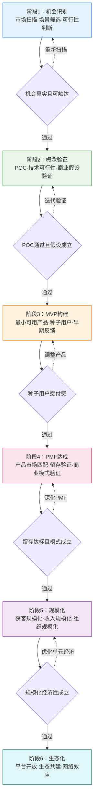
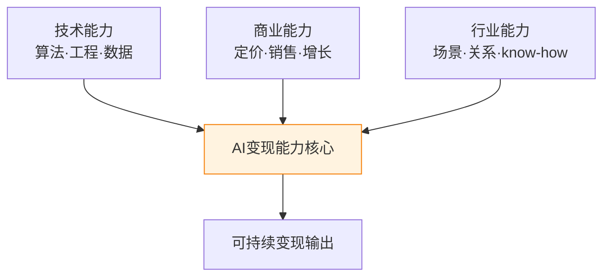

# 实施步骤与关键成功因素

AI 变现不是一次性的爆发，而是一条从机会识别到生态共建的渐进式演进路径。许多团队失败并非因为技术不强，而是在错误的时间跳过了关键阶段——例如在 PMF 尚未达成时就盲目规模化，或在概念验证阶段就投入重金搭建完整产品。本章将 AI 变现拆解为六个可执行阶段，明确每阶段的目标、关键动作、产出物、退出标准与典型周期，并提炼各阶段的关键成功因素（KSF）与跨阶段核心要素，帮助读者定位自身位置并明确下一步方向。

## 一、六阶段实施路径

### 1.1 阶段演进总览

上图展示六阶段正向演进路径（实线）与回退迭代路径（虚线）。每个阶段转换都设有一个关键判断点，未通过判断点应回退到本阶段或上一阶段迭代，而非强行推进。强行跳阶是 AI 变现最常见的失败模式。

### 1.2 阶段速查表

| 阶段 | 核心目标 | 典型周期 | 投入量级 | 失败成本 |
|------|---------|---------|---------|---------|
| 1 机会识别 | 找到真实可变现的 AI 机会 | 2-4 周 | 低 | 极低 |
| 2 概念验证 | 验证技术可行性与核心商业假设 | 1-3 月 | 低-中 | 低 |
| 3 MVP 构建 | 用最小产品验证用户愿意使用 | 3-6 月 | 中 | 中 |
| 4 PMF 达成 | 验证留存与商业模式可成立 | 6-12 月 | 中-高 | 中-高 |
| 5 规模化 | 在单位经济成立前提下放大规模 | 12-24 月 | 高 | 高 |
| 6 生态化 | 通过开放与共建形成网络效应 | 24 月+ | 极高 | 极高 |

### 1.3 阶段1：机会识别

**目标**：在大量潜在 AI 应用场景中，筛选出真实存在、可触达且具备变现潜力的高价值机会。

**关键动作**：
- **市场扫描**：系统性扫描行业痛点、用户呼声、竞品空白，建立机会清单
- **场景筛选**：用"痛点强度 × AI 增益 × 可触达性"三维评分模型对机会排序
- **可行性判断**：评估技术成熟度、数据可得性、合规边界与商业壁垒
- **用户接触**：与至少 10 位目标用户深度访谈，验证痛点真实性而非臆测

**产出物**：机会清单（含评分）、TOP 3 机会深度分析报告、目标用户画像

**退出标准**：
- 至少 1 个机会通过三维评分（痛点强度≥4/5、AI 增益≥3/5、可触达性≥3/5）
- 目标用户访谈中痛点被独立提及≥5 次
- 技术可行性初步判断为可行或部分可行

**典型周期**：2-4 周（小团队），大型组织机会盘点可达 1-2 月

### 1.4 阶段2：概念验证

**目标**：用最低成本验证两个核心假设——技术假设（AI 能否做到）与商业假设（用户是否愿意为此付费）。

**关键动作**：
- **POC 构建**：搭建最小技术验证，重点验证 AI 核心能力是否达标（准确率、延迟、稳定性）
- **商业假设验证**：通过预售、意向书、付费意愿调研等方式验证商业可行性
- **数据获取**：确认训练/推理所需数据的获取路径与成本
- **竞品对照**：与现有替代方案（含非 AI 方案）做价值对照，明确差异化

**产出物**：POC 原型、技术指标报告、商业假设验证报告、数据获取方案

**退出标准**：
- 核心技术指标达到可用阈值（如准确率、响应时间、错误率）
- 至少 3 位用户表达明确付费意愿或签署意向书
- 数据获取成本在可承受范围内
- 差异化价值清晰可量化

**典型周期**：1-3 月

### 1.5 阶段3：MVP 构建

**目标**：构建最小可用产品，让真实用户在日常场景中持续使用，并收集可指导迭代的早期反馈。

**关键动作**：
- **MVP 定义**：聚焦核心价值闭环，砍掉一切非必要功能，避免"AI 瑞士军刀"陷阱
- **种子用户招募**：招募 20-50 位高粘性种子用户，建立紧密共创关系
- **敏捷迭代**：以 1-2 周为迭代周期，根据真实使用数据持续优化
- **早期反馈机制**：建立结构化反馈渠道，区分"用户说要什么"与"用户行为显示要什么"

**产出物**：可交付使用的 MVP、种子用户反馈报告、产品迭代路线图

**退出标准**：
- 种子用户周活跃率≥40%（具体阈值因产品而异）
- 核心价值闭环被用户独立完成（无需人工引导）
- 收到至少 5 条"如果去掉这个功能我就不用了"的反馈

**典型周期**：3-6 月

### 1.6 阶段4：PMF 达成

**目标**：验证产品已找到真实的市场匹配——用户自发留存、自发传播，且商业模式在单元经济上成立。

**关键动作**：
- **留存验证**：追踪次日/周/月留存曲线是否趋于平稳（不再持续下滑）
- **价值验证**：通过 NPS、自发推荐率、付费转化率验证产品价值
- **商业模式验证**：测试定价模型，确认 LTV/CAC≥3（生命周期价值/获客成本）
- **聚焦场景**：识别出最高价值的细分场景，主动舍弃非核心场景，避免过度分散

**产出物**：留存数据报告、商业模式定稿、PMF 评估报告、聚焦场景定义

**退出标准**：
- 次日留存≥40%、周留存≥25%、月留存≥15%（参考阈值，因产品类型而异）
- 付费用户中至少 30% 自发续费或持续付费
- LTV/CAC≥3，且 CAC 回收周期≤12 月
- 至少 20% 新用户来自老用户自发推荐

**典型周期**：6-12 月（部分产品需要更长时间反复打磨）

### 1.7 阶段5：规模化

**目标**：在 PMF 已验证、单位经济已成立的前提下，将获客、收入与组织同时规模化，且不破坏产品体验与单位经济。

**关键动作**：
- **获客规模化**：建立可复制的获客渠道（销售团队、增长引擎、渠道合作）
- **收入规模化**：扩展定价层级、客户分层、追加销售与交叉销售
- **组织规模化**：从创始团队向专业化组织演进，建立产品-技术-销售-客户成功协同机制
- **单元经济守护**：规模化过程中持续监控 CAC、毛利率、流失率，防止规模不经济

**产出物**：规模化增长模型、组织架构设计、渠道矩阵、单元经济仪表盘

**退出标准**：
- 月收入连续 6 月环比增长≥15%
- CAC 在规模化过程中不显著上升（上升幅度<30%）
- 客户流失率维持在健康区间（年流失率<20%）
- 组织能稳定支撑 3 倍以上业务量增长

**典型周期**：12-24 月

### 1.8 阶段6：生态化

**目标**：通过平台开放、生态共建形成网络效应，将单点产品升级为生态壁垒，构建长期护城河。

**关键动作**：
- **平台开放**：开放 API、SDK、插件机制，吸引第三方开发者共建
- **生态共建**：与上下游、行业伙伴建立互补合作关系，形成完整价值链
- **网络效应设计**：设计让用户/开发者越多、平台价值越大的机制（数据飞轮、双边市场）
- **治理能力建设**：建立生态治理规则、利益分配机制、质量保障体系

**产出物**：开放平台、生态合作伙伴体系、治理规则文档、网络效应度量指标

**退出标准**：
- 第三方开发者/合作伙伴数量达到生态阈值（参考：≥100 活跃开发者或≥30 核心伙伴）
- 平台网络效应指标持续提升（每新增用户的边际价值为正）
- 生态贡献收入占比≥20%

**典型周期**：24 月以上（生态化是长期工程，需要持续投入）

## 二、各阶段关键成功因素（KSF）

### 2.1 KSF 总览表

| 阶段 | 关键成功因素 1 | 关键成功因素 2 | 关键成功因素 3 | 关键成功因素 4 | 关键成功因素 5 |
|------|--------------|--------------|--------------|--------------|--------------|
| 1 机会识别 | **洞察力**：能穿透表象识别真实痛点 | **行业人脉**：能接触目标用户与行业专家 | **快速判断**：果断舍弃伪机会 | 数据驱动评分 | 跨领域视野 |
| 2 概念验证 | **技术能力**：能快速搭建验证原型 | **数据获取**：能拿到验证所需数据 | **用户接触**：能直接对话目标用户 | 商业假设显性化 | 差异化清晰 |
| 3 MVP | **敏捷迭代**：1-2 周一次有效迭代 | **用户共创**：种子用户深度参与 | **聚焦**：砍掉非核心功能 | 行动数据驱动决策 | 价值闭环最短 |
| 4 PMF | **留存数据**：盯住留存曲线是否平稳 | **价值验证**：NPS 与自发推荐 | **聚焦场景**：主动舍弃低价值场景 | 商业模式单元经济成立 | 不被虚荣指标误导 |
| 5 规模化 | **组织能力**：能从团队走向组织 | **资金**：规模化所需现金流充足 | **渠道**：可复制的获客渠道 | 品牌：降低获客成本 | 守护单位经济 |
| 6 生态化 | **开放心态**：愿意让出部分利益换生态 | **平台能力**：API/SDK/治理基础设施 | **治理能力**：规则与利益分配 | 网络效应设计 | 长期主义定力 |

### 2.2 各阶段 KSF 详解

**机会识别阶段的洞察力**：本质上是"在噪声中识别信号"的能力。常见误区是把"技术能做"等同于"用户需要"，或把"行业热门"等同于"机会真实"。训练洞察力的方法是：先不带 AI 假设地理解用户工作流，再判断 AI 能在哪个环节提供 10 倍而非 10% 的改进。

**概念验证阶段的数据获取**：是 AI 项目区别于传统软件的关键挑战。许多 POC 失败不是因为算法不行，而是因为拿不到足够质量的训练/评估数据。建议在 POC 启动前先做"数据可行性评估"：数据是否存在、是否可获取、质量是否达标、合规是否通过。

**MVP 阶段的聚焦**：是绝大多数 AI 产品的死亡陷阱。AI 能力天然适合做"加法"（再加一个功能、再支持一个场景），但 MVP 阶段的胜负在于减法——能否把核心价值闭环做到极致。判断标准：如果砍掉某个功能后核心用户会流失，则保留；否则砍掉。

**PMF 阶段的不被虚荣指标误导**：注册量、DAU、GMV 等指标在 PMF 阶段往往是虚荣指标。真正应盯住的是留存曲线（是否平稳）、付费意愿（是否愿意持续付费）、自发推荐（是否主动告诉别人）。一个 1000 用户但留存平稳的产品，比一个 10000 用户但持续流失的产品更接近 PMF。

**规模化阶段守护单位经济**：是规模化的生死线。许多 AI 产品在规模化时 CAC 急剧上升、毛利率下降，最终陷入"规模越大亏损越大"的死亡螺旋。建议建立单元经济仪表盘，每周复盘 CAC、LTV、毛利率、流失率四项核心指标。

**生态化阶段的开放心态**：是反直觉的——传统产品思维强调"控制"，而生态化要求"让出"。开放 API 意味着让第三方在你的平台上赚钱，短期看是让利，长期看是建立网络效应的必经之路。缺乏开放心态的"伪生态"最终会退化为普通产品。

## 三、跨阶段核心要素

### 3.1 团队能力三角

AI 变现需要技术、商业、行业三种能力的协同，缺一不可：

| 能力维度 | 缺失后果 | 典型表现 |
|---------|---------|---------|
| 技术能力缺失 | 产品做不出来或质量不达标 | POC 反复失败、效果不达预期 |
| 商业能力缺失 | 做得出卖不掉 | 技术领先但收入为零 |
| 行业能力缺失 | 做得出卖得掉但用不起来 | 销售成功但留存崩盘 |

实践建议：早期团队至少具备其中两项，缺失的第三项通过顾问、合作伙伴或早期 hire 补齐。单人同时具备三种能力极为罕见，应优先构建互补团队而非追求全才。

### 3.2 资源储备

AI 变现对资源的需求与传统软件不同，需提前储备三类核心资源：

- **资金储备**：AI 产品研发成本高（算力、数据标注、模型迭代），资金储备应能覆盖至少 18 个月运营。建议按"PMF 前保守、PMF 后激进"的节奏使用资金。
- **数据储备**：数据是 AI 产品的核心资产。在阶段 1-2 就应建立数据获取与积累机制，包括独家数据源、数据标注流程、数据治理规范。没有数据壁垒的 AI 产品极易被复制。
- **算力储备**：训练与推理算力成本是 AI 区别于传统 SaaS 的关键成本项。需根据模型规模规划 GPU/云算力预算，并预留弹性以应对峰值。

### 3.3 时机判断

AI 变现对时机极为敏感，需在三个维度判断时机是否成熟：

- **技术成熟度**：所选 AI 技术是否达到"可用且稳定"的水平？过早进入会因技术不成熟而失败，过晚进入会因红海而难以差异化。建议关注技术成熟度曲线（Gartner Hype Cycle）的"爬升光明期"。
- **市场窗口**：目标市场是否处于需求觉醒期？窗口期通常 6-18 个月，错过则需等待下一波。判断信号：行业媒体开始讨论、头部客户主动问询、政策文件开始提及。
- **政策环境**：AI 监管政策（数据合规、算法备案、行业准入）在不同地区差异巨大。需在阶段 1 即评估目标市场的政策环境，避免后期合规风险导致业务停摆。

### 3.4 组织协同

AI 产品的特殊性在于产品、技术、销售三端的紧密耦合，组织协同质量直接决定变现效率：

| 协同关系 | 常见断裂点 | 解决机制 |
|---------|-----------|---------|
| 产品 ↔ 技术 | 产品提的需求技术实现不了 | 技术负责人参与需求评审 |
| 产品 ↔ 销售 | 销售承诺的功能产品没有 | 销售承诺必须产品确认 |
| 技术 ↔ 销售 | 销售不懂技术边界 | 销售培训 + 技术方案预审 |
| 三方 ↔ 客户成功 | 售后问题无人对接 | 客户成功作为独立职能 |

实践建议：在 PMF 阶段前保持组织扁平、信息透明；规模化阶段引入专业化分工但保留跨职能同步机制（如周会、OKR 对齐）；生态化阶段建立平台治理组织平衡生态利益。

## 四、阶段定位与下一步指引

读者可根据以下特征判断自身所处阶段并明确下一步：

| 你当前的状态 | 所处阶段 | 下一步关键动作 |
|-------------|---------|--------------|
| 有想法但未验证用户痛点 | 阶段1 | 完成机会评分与用户访谈 |
| 痛点已验证但技术未验证 | 阶段2 | 搭建 POC 验证核心技术 |
| 技术可行但无可用产品 | 阶段3 | 聚焦核心闭环构建 MVP |
| 有产品但留存不稳 | 阶段4 | 盯留存曲线、聚焦高价值场景 |
| PMF 已达成但增长缓慢 | 阶段5 | 建立可复制获客渠道 |
| 规模化成熟但增长见顶 | 阶段6 | 开放平台、设计网络效应 |

> **核心提醒**：阶段判断不要看投入了多少资源或做了多久，而要看核心判断点是否通过。许多团队因 sunk cost 而强行推进，是 AI 变现失败的高频原因。

---

**上一章**：[10 - 行业解决方案场景：垂直行业AI变现路径](10-scenario-industry.md)  
**下一章**：[12 - 风险提示与资源推荐](12-risks-resources.md)  
**返回目录**：[00 - 总览](00-overview.md)
