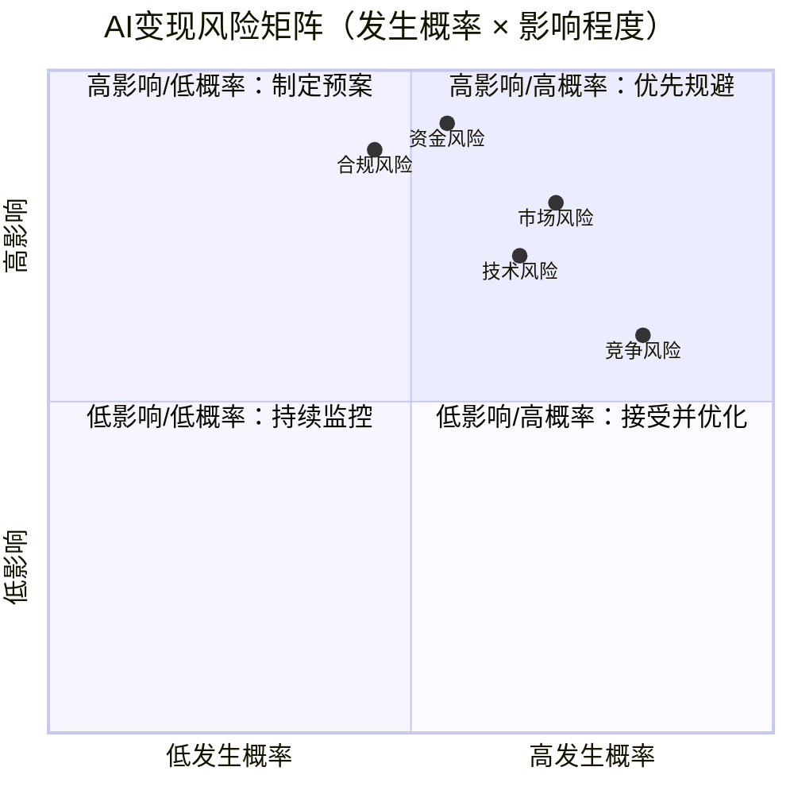

# 风险提示与资源推荐

> 本章是《AI变现完整指南》的末章。前十一章聚焦"如何做对"，本章聚焦"如何避免做错"——识别风险、备好弹药、建立可复用的认知地基。风险管理不是悲观主义，而是让创新跑得更久的护城河。

## 12.1 风险提示与规避策略

AI变现兼具"技术创业"与"内容创业"的双重不确定性，风险来源比传统软件创业更多一层。我们将风险归纳为五大类：**技术风险、市场风险、合规风险、竞争风险、资金风险**。它们彼此关联——技术选错会放大资金压力，合规踩雷会直接关闭业务窗口，因此需要系统性应对而非单点优化。

### 12.1.1 风险矩阵概览

下图以"发生概率 × 影响程度"二维矩阵呈现五类风险的相对位置，帮助读者快速识别优先级。坐标值为基于行业经验的相对评估（0-1 区间），具体项目需结合自身场景重估。

**阅读指引**：
- 落入第一象限（右上）的"资金风险""市场风险"必须优先建立规避机制
- 落入第二象限（左上）的"合规风险"虽概率较低但一旦发生影响致命，必须提前制定合规预案
- "竞争风险"高概率但单次影响有限，宜采用快速迭代 + 差异化壁垒策略

---

### 12.1.2 技术风险

**风险描述**：AI 项目的成败高度依赖模型效果、技术路线与工程化能力。模型在 demo 阶段惊艳、生产环境失效是行业最常见的死亡原因之一。

**典型表现**：
- 模型在测试集表现优异，上线后因数据漂移（Data Drift）导致效果持续衰减
- 技术路线选错（如盲目追逐大模型而忽视小模型 + 规则的性价比）
- 技术债务累积：Prompt 硬编码、数据管线缺失版本管理、缺乏评测集
- 算力选型失误：训练阶段用 A100 验证，推理阶段却被迫降级到 T4 导致延迟飙升
- 关键依赖单一工程师，"核心算法工程师离职即项目停摆"

**规避策略**：
- **建立离线 + 在线双重评测体系**：离线评测集覆盖典型场景与边界 case，在线 A/B 测试监控真实业务指标
- **技术路线分期下注**：先以规则 + 小模型跑通商业闭环，再逐步引入大模型提升体验，避免"一步到位"
- **模型可替换架构**：将模型调用封装为统一接口（如 OpenAI 兼容协议），切换底层模型时业务无感
- **数据资产沉淀**：每一次用户反馈都进入标注池，形成正向飞轮；建立数据版本管理（DVC）
- **算力成本前置测算**：在立项阶段完成单位推理成本、QPS 上限、SLA 承诺的三角平衡

**案例**：某 AI 写作工具早期依赖 GPT-3.5 跑通 MVP，未做模型抽象层。当 OpenAI 调价 + 限流时无法快速切换至开源模型（Llama 系列），导致毛利率从 65% 跌至 20%，被迫重构调用层，耗时 3 个月，错过关键融资窗口。

---

### 12.1.3 市场风险

**风险描述**：AI 应用最致命的陷阱是"技术上自嗨，市场上无人买单"。需求真伪与市场窗口是两个必须反复验证的前提。

**典型表现**：
- 需求伪命题：解决方案在寻找问题，而非问题在寻找解决方案
- 市场窗口关闭：大厂推出免费同类功能后，付费意愿瞬间归零
- 客户教育成本过高：用户不知道自己需要，需要先改变认知再卖产品
- 客单价天花板低：C 端用户愿付 ¥9.9/月，B 端客户嫌贵 ¥999/年
- 增长曲线见顶：早期靠流量红利起量，红利消退后留存断崖式下跌

**规避策略**：
- **精益创业方法论**：用最小可行产品（MVP）+ 真实付费验证需求，而非问卷调研
- **付费意愿前置测试**：在产品完成前用落地页 + 预售验证真实付费转化率
- **选择"大厂不愿做、小厂做不了"的垂直缝隙**：避开通用赛道，深耕行业 know-how
- **客户教育成本纳入 ROI 测算**：若教育成本 > 客户 LTV，直接放弃该方向
- **监控市场窗口信号**：关注大厂发布会节奏，预留 6-12 个月的差异化护城河建设期

**案例**：某团队开发"AI 简历优化"工具，上线 2 个月后某大厂在招聘 App 内置同类功能且免费。该团队因提前布局"猎头行业定制版"（含简历 + 岗位匹配算法 + 猎头 CRM 集成），成功转入 B 端市场，避开 C 端红海。

---

### 12.1.4 合规风险

**风险描述**：合规风险是 AI 变现中"影响程度最高"的风险类别，一次违规可能直接导致业务下线、行政处罚甚至刑事责任。中国、欧盟、美国三地的监管框架正在快速成型，2024-2026 是合规要求最密集落地的窗口期。

**典型表现**：
- 数据合规违规：未获用户授权收集个人信息、跨境传输未做数据出境评估
- 算法合规违规：未做深度合成算法备案、生成内容未标识"AI 生成"
- 行业准入违规：医疗 AI 未取得 NMPA 二类/三类医疗器械注册证即收费
- 金融 AI 未持牌开展投顾、信贷风控业务
- 内容生成类应用未做内容审核，输出违法信息

**规避策略**：

| 合规维度 | 核心法规 | 规避策略 |
|---|---|---|
| 数据合规 | 《个人信息保护法》（PIPL）、《数据安全法》、GDPR | 建立数据分级分类制度；用户授权链路可审计；跨境数据通过标准合同（SCC）或数据出境评估 |
| 算法合规 | 《深度合成管理规定》、《生成式人工智能服务管理暂行办法》、《互联网信息服务算法推荐管理规定》 | 深度合成算法在网信办备案；生成内容显著标识"AI 生成"；建立算法伦理审查委员会 |
| 行业准入 | 医疗：NMPA《人工智能医用软件产品分类界定指导原则》；金融：证监会/银保监会相关牌照 | 涉医 AI 优先申请二类医疗器械注册证（周期 12-18 个月）；金融 AI 与持牌机构合作而非自营 |
| 内容安全 | 《网络信息内容生态治理规定》 | 接入网信办认可的内容审核服务；建立敏感词库 + 人工复核双层机制 |

**案例**：某 AI 心理咨询 App 因未做深度合成算法备案，被网信办约谈后下架整改 45 天，损失当季度全部营收。补办备案后重新上架，但用户留存下降 60%。同期竞品因提前完成备案，承接了部分流失用户。

---

### 12.1.5 竞争风险

**风险描述**：AI 行业竞争节奏远超传统软件，从"蓝海"到"红海"的窗口期可能只有 3-6 个月。大厂入场、同质化内卷、开源冲击是三种最主要的竞争威胁。

**典型表现**：
- 大厂入场：巨头以免费策略碾压付费产品（如某厂推出免费 AI 绘画后，多家付费工具倒闭）
- 同质化：100 个团队做同一件事，最终比拼的不是技术而是渠道和资本
- 开源冲击：开源模型能力逼近闭源产品，付费产品的护城河被填平
- 价格战：竞品以 1/10 价格提供服务，毛利空间被压缩至不可持续

**规避策略**：
- **建立三层壁垒**：数据壁垒（独家数据集）+ 行业 know-how（垂直场景沉淀）+ 客户关系（高切换成本）
- **避开"所有人都能做"的赛道**：选择有数据门槛、行业许可门槛或客户网络效应的方向
- **差异化定价与定位**：通用功能免费引流，深度功能 + 服务收费（Open Core 模式）
- **监控开源动态**：定期评估 HuggingFace Trending、Papers with Code，预判开源能力曲线
- **生态位思维**：与其做"更好的通用工具"，不如做"特定行业的必备组件"

**案例**：某 AI 翻译工具在 DeepL 与大厂翻译免费冲击下，转向"法律合同翻译 + 律所术语库 + 律师协作工作流"垂直场景，客单价从 C 端 ¥29/月提升至 B 端 ¥2999/月，毛利提升 4 倍且客户黏性显著增强。

---

### 12.1.6 资金风险

**风险描述**：AI 项目烧钱速度快于传统软件——算力是显性成本，数据标注、模型迭代、人才是隐性成本。资金链断裂是创业项目的头号杀手。

**典型表现**：
- 现金流断裂：账上资金按现有 burn rate 只能撑 3 个月，但下一轮融资未到账
- 算力成本失控：训练一次大模型烧掉数百万，推理成本随用户量线性增长
- 回款周期长：B 端客户账期 90-180 天，C 端付费率低于 5%
- 隐性成本超支：数据标注、合规咨询、知识产权诉讼等未纳入预算
- 融资环境变化：行业寒冬下估值腰斩，被迫接受苛刻条款

**规避策略**：
- **18 个月现金流红线**：账上资金始终保留 18 个月以上的 burn rate，触及 12 个月立即启动融资
- **算力成本精细化管理**：训练用竞价实例 + Spot 实例；推理用模型量化（INT8/INT4）+ 投机解码
- **混合收入模型**：C 端订阅 + B 端定制 + API 调用三层收入，降低单一收入波动风险
- **回款周期前置谈判**：B 端合同明确预付款比例（建议 ≥30%）、里程碑款、尾款账期
- **建立单位经济模型（Unit Economics）**：每个客户 LTV / CAC ≥ 3，回本周期 ≤ 12 个月

**案例**：某 AI 视频生成团队未做算力成本测算，免费内测期 1 个月烧掉天使轮 40%。被迫紧急转向付费模式时用户大量流失，最终因资金链断裂在 Pre-A 轮融资前倒闭。事后复盘显示：若提前 3 个月做单位经济测算并引入付费墙，本可避免崩盘。

---

## 12.2 实用资源推荐

本节按"工具—学习—报告—社区"四层组织资源，覆盖从建模到运营的全链路。资源选择遵循"主流 + 活跃 + 中文友好"三原则。

### 12.2.1 工具

#### 模型开发

| 工具 | 用途 | 推荐场景 |
|---|---|---|
| [PyTorch](https://pytorch.org/) | 深度学习框架 | 自研模型训练、学术研究生态最完整 |
| [HuggingFace Transformers](https://huggingface.co/docs/transformers) | 预训练模型库 | 快速调用、微调开源大模型 |
| [LangChain](https://python.langchain.com/) | LLM 应用编排 | 构建 Agent、RAG、Tool Calling 工作流 |
| [LlamaIndex](https://www.llamaindex.ai/) | RAG 框架 | 企业知识库 + 检索增强生成 |
| [Axolotl](https://github.com/OpenAccess-AI-Collective/axolotl) | 微调工具 | LoRA/QLoRA 高效微调主流开源模型 |

#### 数据标注与管理

| 工具 | 用途 | 推荐场景 |
|---|---|---|
| [Label Studio](https://labelstud.io/) | 多模态数据标注 | 开源、支持图像/文本/音频/视频，可私有化部署 |
| [Prodigy](https://prodi.gy/) | 主动学习标注 | 商业产品，标注效率高，适合 NLP 任务 |
| [DVC (Data Version Control)](https://dvc.org/) | 数据版本管理 | 数据集与模型版本对齐，实验可复现 |
| [Snorkel](https://www.snorkel.org/) | 弱监督标注 | 用规则自动生成训练数据，降低人工成本 |

#### 模型部署

| 工具 | 用途 | 推荐场景 |
|---|---|---|
| [vLLM](https://vllm.ai/) | LLM 推理引擎 | PagedAttention 显存优化，吞吐量为 HF 默认的 14-24 倍 |
| [Triton Inference Server](https://developer.nvidia.com/triton-inference-server) | 多模型服务 | 多框架（TensorRT/PyTorch/ONNX）统一部署 |
| [Ollama](https://ollama.com/) | 本地 LLM 部署 | 开发测试与本地小模型快速验证 |
| [TGI (Text Generation Inference)](https://github.com/huggingface/text-generation-inference) | 文本生成推理 | HuggingFace 出品，支持主流开源大模型 |

#### 监控与可观测性

| 工具 | 用途 | 推荐场景 |
|---|---|---|
| [Weights & Biases](https://wandb.ai/) | 实验追踪 | 训练指标可视化、模型对比、团队协作 |
| [Prometheus + Grafana](https://prometheus.io/) | 服务监控 | 推理 QPS、延迟、错误率实时监控 |
| [LangSmith](https://www.langchain.com/langsmith) | LLM 应用追踪 | Prompt 调用链可视化、效果评测 |
| [Arize AI](https://arize.com/) | 模型可观测性 | 数据漂移检测、模型效果监控、生产排障 |

---

### 12.2.2 学习资源

#### 经典书籍

| 书名 | 作者 | 推荐理由 |
|---|---|---|
| 《深度学习》（花书） | Ian Goodfellow 等 | 深度学习理论基础圣经，建立体系化认知 |
| 《机器学习》（西瓜书） | 周志华 | 中文经典，机器学习算法入门必读 |
| 《精益创业》 | Eric Ries | AI 创业方法论，MVP + 验证驱动开发的源头 |
| 《从零到一》 | Peter Thiel | 创业思维，理解"垄断 vs 竞争"的差异化逻辑 |
| 《AI 3.0》 | Melanie Mitchell | 理性认识 AI 能力边界，避免技术过度乐观 |
| 《预测机》 | Ajay Agrawal 等 | 从经济学视角理解 AI 商业价值与定价 |

#### 在线课程

| 课程 | 平台 | 推荐理由 |
|---|---|---|
| [Deep Learning Specialization](https://www.coursera.org/specializations/deep-learning) | Coursera（吴恩达） | 深度学习入门首选，理论与代码并重 |
| [Practical Deep Learning for Coders](https://course.fast.ai/) | Fast.ai | 自顶向下教学法，快速上手实战 |
| [CS25 Transformers United](https://web.stanford.edu/class/cs25/) | Stanford | Transformer 主题公开课，前沿研究综述 |
| [HuggingFace NLP Course](https://huggingface.co/learn/nlp-course) | HuggingFace | 官方 NLP 实战教程，配合 Transformers 库 |
| [LangChain Academy](https://academy.langchain.com/) | LangChain | LLM 应用开发与 Agent 工程化 |

#### 技术博客

| 博客 | 关注重点 |
|---|---|
| [OpenAI Blog](https://openai.com/blog) | 大模型前沿动态、能力边界官方解读 |
| [Anthropic Blog](https://www.anthropic.com/news) | AI 对齐、安全与可解释性研究 |
| [HuggingFace Blog](https://huggingface.co/blog) | 开源模型动态、训练实践 |
| [Lilian Weng's Blog](https://lilianweng.github.io/) | AI 综述级长文，体系化深度 |
| [机器之心](https://www.jiqizhixin.com/) | 中文 AI 资讯与解读 |
| [量子位](https://www.qbitai.com/) | 中文 AI 行业新闻与产品评测 |

---

### 12.2.3 行业报告

#### 国际机构

| 报告来源 | 关注价值 |
|---|---|
| [Gartner Hype Cycle for AI](https://www.gartner.com/) | AI 技术成熟度曲线，判断技术落地窗口 |
| [McKinsey AI Reports](https://www.mckinsey.com/ai) | AI 商业化与组织变革洞察 |
| [IDC AI Reports](https://www.idc.com/) | AI 市场规模、支出预测与厂商份额 |
| [Stanford AI Index](https://aiindex.stanford.edu/) | 年度 AI 综合报告，学术/产业/政策全景 |
| [a16z AI Reports](https://a16z.com/) | VC 视角的 AI 投资趋势与商业模式分析 |

#### 国内机构

| 报告来源 | 关注价值 |
|---|---|
| [艾瑞咨询 AI 报告](https://www.iresearch.com.cn/) | 国内 AI 应用场景与商业化数据 |
| [亿欧智库](https://www.iyiou.com/) | AI 行业研究、垂直领域应用案例 |
| [IDC China](https://www.idc.com/getdoc.jsp?containerId=prCHC) | 中国 AI 市场预测与厂商分析 |
| [信通院 AI 研究报告](http://www.caict.ac.cn/) | 政策解读、产业白皮书、合规指引 |
| [量子位智库](https://www.qbitai.com/) | 中国 AI 创业生态与产品分析 |

---

### 12.2.4 社区

| 社区 | 性质 | 价值 |
|---|---|---|
| [GitHub](https://github.com/) | 全球开源社区 | 跟踪开源 AI 项目、复用基础设施 |
| [HuggingFace](https://huggingface.co/) | 模型与数据集社区 | 模型/数据集/Space 一站式获取 |
| [Kaggle](https://www.kaggle.com/) | 数据科学竞赛社区 | 真实数据集、竞赛方案、实战经验 |
| [Papers with Code](https://paperswithcode.com/) | 论文 + 代码 | 跟踪 SOTA、复现论文、对比方法 |
| [Reddit r/MachineLearning](https://www.reddit.com/r/MachineLearning/) | 学术讨论社区 | 前沿研究讨论、行业内幕 |
| [机器之心社区](https://www.jiqizhixin.com/) | 中文 AI 媒体 | 国内 AI 资讯、活动、招聘 |
| [AI 新智界](https://www.ai-scholar.net/) | 中文 AI 学习社区 | 教程、解读、入门资源 |
| [Layer](https://layer.ai/) | 中文 AI 工程社区 | 工程实践、面试、行业洞察 |

---

## 12.3 术语速查表

下表汇总本指南出现的关键术语，按字母 + 中文混合排序，便于速查。

| 术语（中文） | 术语（英文） | 一句话释义 |
|---|---|---|
| 阿尔法折叠 | AlphaFold | DeepMind 的蛋白质结构预测模型，AI4Science 标志性突破 |
| 智能体 | Agent（AI Agent） | 具备规划、调用工具、自主决策能力的 AI 系统 |
| 检索增强生成 | RAG（Retrieval-Augmented Generation） | 检索外部知识库后再生成回答，降低幻觉 |
| 单位经济模型 | Unit Economics | 单个客户的 LTV 与 CAC 关系，衡量商业可持续性 |
| 生成式人工智能 | Generative AI | 能生成文本/图像/音频/视频等新内容的 AI |
| 现金消耗率 | Burn Rate | 企业每月消耗的现金量，衡量资金 runway |
| 客户获取成本 | CAC（Customer Acquisition Cost） | 获取一个付费客户所需的市场投入 |
| 客户终身价值 | LTV（Lifetime Value） | 单个客户在生命周期内贡献的总收入 |
| 最小可行产品 | MVP（Minimum Viable Product） | 用最小成本验证需求的最简产品形态 |
| 微调 | Fine-tuning | 在预训练模型基础上用领域数据继续训练以适配任务 |
| 指令微调 | Instruction Tuning | 用"指令-回答"对训练模型遵循人类意图 |
| 基于人类反馈的强化学习 | RLHF | 用人类偏好数据训练奖励模型优化模型行为 |
| 低秩适配 | LoRA（Low-Rank Adaptation） | 冻结主干、仅训练低秩矩阵的高效微调方法 |
| 提示工程 | Prompt Engineering | 通过设计提示词引导大模型产生期望输出的技术 |
| 思维链 | Chain-of-Thought（CoT） | 引导模型分步推理以提升复杂问题准确率 |
| 函数调用 | Function Calling | 大模型调用外部工具/API 的能力 |
| 深度合成 | Deep Synthesis | 利用 AI 生成或编辑文本/图像/音视频等内容的技术 |
| 算法备案 | Algorithm Filing | 依据中国法规向网信办提交算法服务信息的合规流程 |
| 数据漂移 | Data Drift | 上线后输入数据分布与训练分布偏离导致模型衰减 |
| 推理优化 | Inference Optimization | 通过量化、蒸馏、并行等技术降低推理成本 |
| 模型量化 | Quantization | 将模型权重从 FP16 压缩为 INT8/INT4 以降低显存与延迟 |
| 投机解码 | Speculative Decoding | 用小模型预测 + 大模型校验的推理加速技术 |
| 幻觉 | Hallucination | 大模型生成与事实不符或编造内容的现象 |
| 上下文窗口 | Context Window | 大模型单次可处理的最大 token 数 |
| 智能体工作流 | Agentic Workflow | 多个 Agent 协作完成复杂任务的工作流编排 |
| 开放核心模式 | Open Core Model | 核心开源、增值功能闭源收费的商业模式 |
| 计算机视觉 | Computer Vision（CV） | 让机器理解和处理图像/视频的 AI 子领域 |
| 自然语言处理 | Natural Language Processing（NLP） | 让机器理解、生成人类语言的 AI 子领域 |

---

## 12.4 结语

《AI变现完整指南》从市场洞察、商业模式、产品策略、技术架构到落地实施，构建了一套从"看见机会"到"赚到钱"的完整认知框架。回望全篇，几条核心认知值得反复内化：

1. **AI 是杠杆，不是终点**。技术只是放大器，真正决定成败的是商业洞察、行业 know-how 与执行速度。再强大的模型，套在伪需求上也是负杠杆。

2. **变现优先于技术完美**。先验证有人付费，再投入工程化。MVP 不是"功能简陋的产品"，而是"用最低成本回答商业问题的实验"。每一次付费行为都是对需求的最强证明。

3. **合规与风险是地板，不是天花板**。把它们当作创新的前提条件而非阻碍，提前规划反而能成为护城河。备案、牌照、数据资产——这些"慢变量"恰恰是别人难以快速复制的壁垒。

4. **飞轮比爆发更重要**。AI 变现是一场长跑，单次爆款不构成生意。让用户反馈沉淀为数据资产，让数据资产提升模型效果，让模型效果降低边际成本——飞轮转起来后，才是真正的复利生意。

5. **保持对边界的敬畏**。AI 能力边界与商业边界并不重合。理解"哪些事 AI 现在做不好、未来 3 年也做不好"，与理解"AI 擅长什么"同等重要。在边界外下单，是绝大多数失败案例的共性。

希望本指南能成为你 AI 变现路上的地图与指南针。系统性规划、敬畏式执行、飞轮式迭代——这三句话送给每一位读者。商业的世界永远奖励"既懂技术、又懂生意"的人，而 AI 时代，恰恰是这类人最好的时代。

> **本指南结束。愿你不仅读懂，更能做成。**

---

**上一章**：[11 - 实施步骤与关键成功因素](11-implementation-steps.md)  
**返回目录**：[00 - 总览](00-overview.md)  
**本指南结束**
