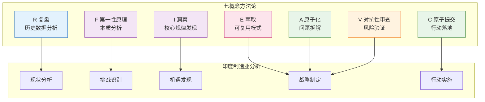

# 七概念方法论解析印度制造业供应链变迁

## 教程概述

本教程基于**七概念方法论**（R-I-E-C-A-F-V）框架，系统性解析印度制造业供应链的发展现状、核心挑战与未来机遇。通过将理论框架与实战案例相结合，帮助读者建立对印度制造业的深度认知，并掌握一套可迁移的分析方法。

### 🎯 教程目标

1. **掌握七概念方法论**：理解复盘、洞察、萃取、原子提交、原子化、第一性原理、对抗性审查七个核心概念及其相互关系
2. **深入理解印度制造业**：全面了解印度制造业的发展历程、现状和未来趋势
3. **建立供应链分析框架**：学会运用七概念方法论分析复杂的供应链问题
4. **获取可操作建议**：掌握评估印度市场机会和制定供应链战略的方法

### 👥 适用人群

| 角色 | 学习价值 | 推荐路径 |
|------|---------|---------|
| **企业战略决策者** | 了解印度市场机遇与风险，制定国际化战略 | 快速浏览→深入阅读挑战与机遇章节→实践指南 |
| **供应链管理专业人士** | 掌握供应链重构分析方法，评估印度供应链可行性 | 完整学习→重点关注实践操作指南 |
| **商业分析师** | 获取系统化的分析框架和最新数据 | 完整学习→参考资源链接拓展研究 |
| **制造业从业者** | 了解印度制造业生态，评估市场进入机会 | 快速浏览→深入阅读现状分析 |
| **投资者** | 理解印度制造业投资逻辑和风险 | 重点关注挑战与机遇→FAQ |

### 📚 学习路径

### 📖 章节导航

| 章节 | 标题 | 核心内容 |
|------|------|---------|
| [00](00-overview.md) | 概述与学习路径 | 教程目标、适用人群、学习路径 |
| [01](01-seven-concepts-framework.md) | 七概念知识框架 | 五层定位模型、触发决策树、核心工作流 |
| [02](02-india-manufacturing-status.md) | 印度制造业现状分析 | GDP占比、增长数据、产业结构、政策解读 |
| [03](03-challenges-opportunities.md) | 挑战与机遇深度解析 | 基于七概念方法论的深度洞察 |
| [04](04-practice-guide.md) | 实践操作指南 | 分步骤分析方法、决策框架、行动建议 |
| [05](05-faq.md) | 常见问题解答 | 政策、市场、供应链、投资等维度 |
| [06](06-resources.md) | 资源扩展链接 | 官方报告、学术研究、行业分析 |
| [07](07-assessment.md) | 学习效果评估 | 自测题、案例分析、实践项目 |

## 七概念与印度制造业的关系

## 核心数据速览（2026年）

| 指标 | 数值 | 说明 |
|------|------|------|
| 制造业GDP占比 | ~15% | 目标25%，十余年未提升 |
| 制造业GVA增长率 | 7.72% (Q1) / 9.13% (Q2) | FY 2025-26 |
| PMI指数 | 53.9 (2026年3月) | 近4年最低点 |
| 物流成本占GDP | 13-14% | 中国为8% |
| 电子元件进口依赖 | 56%来自中国 | 关键供应链风险 |
| PLI计划吸引投资 | 2.16万亿卢比 | 约250亿美元 |
| 手机产值增长 | 近28倍 | 过去10年 |

## 学习提示

- 建议按顺序阅读，章节之间有逻辑依赖关系
- 每个章节都包含深度分析和实战案例
- 实践操作指南章节提供可直接使用的分析工具
- FAQ章节解答常见疑问，建议随时查阅
- 完成学习后使用评估章节检验学习效果

---

**开始学习**：[第一章 - 七概念知识框架](01-seven-concepts-framework.md)
