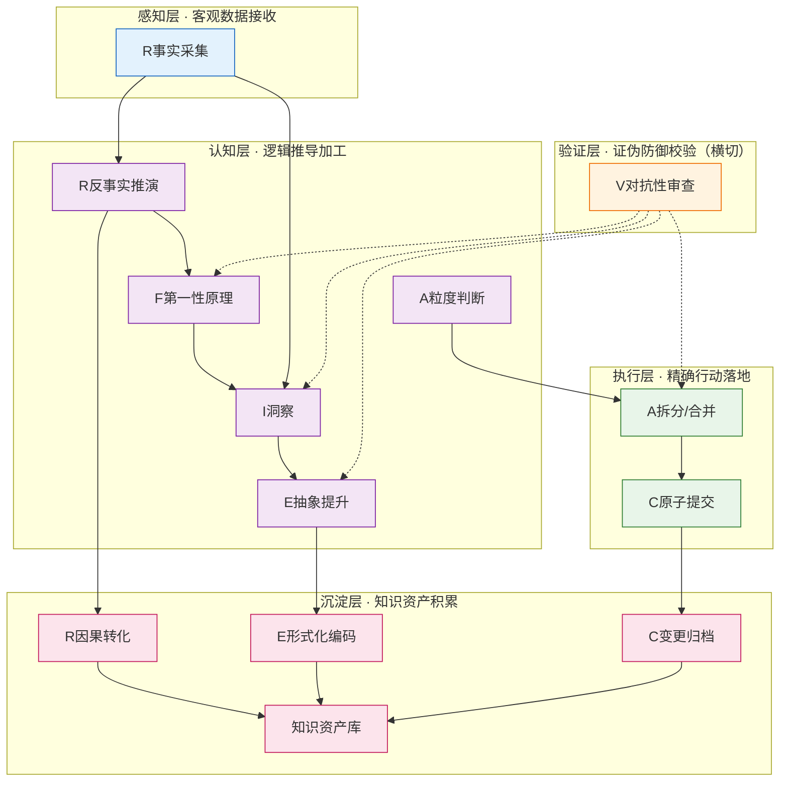
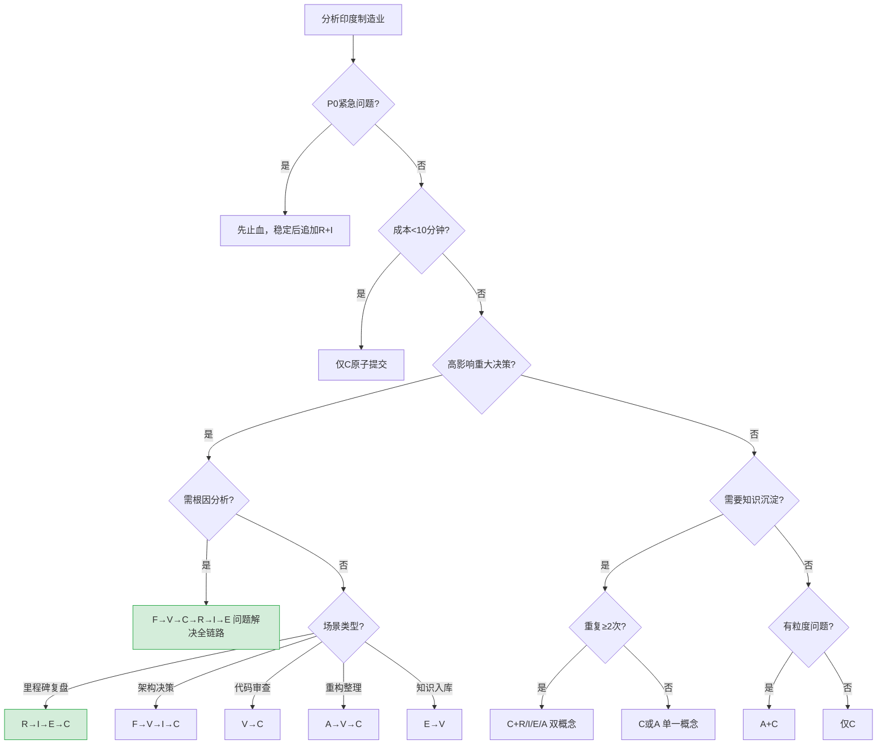

# 第一章 - 七概念知识框架

## 1.1 七概念方法论概述

七概念方法论是一套基于第一性原理构建的知识沉淀与分析框架，包含七个核心概念：

| 概念 | 缩写 | 一句话定义 | 核心要素 |
|------|------|-----------|---------|
| **复盘** | R | 对已发生事件的结构化反事实推理 | 事实采集、时序结构化、反事实推演、因果转化 |
| **洞察** | I | 跨情境可迁移规律 | 条件识别、机制揭示、结论生成、迁移验证 |
| **萃取** | E | 知识从隐性经验到显性模式的形式化转换 | 显化转换、抽象提升、漏斗过滤、形式化编码 |
| **原子提交** | C | 变更集的不可分割单一职责单元 | 职责内聚、因果闭合、独立回滚、认知平滑 |
| **原子化** | A | 复杂系统向最优信息粒度的收敛 | 粒度寻优、单元独立、链接完整、双向收敛 |
| **第一性原理** | F | 从不可证伪公理出发，自下而上重构方案 | 假设剥离、要素拆解、公理自洽、重构推导 |
| **对抗性审查** | V | 主动寻找证伪证据的认知防御机制 | 证伪导向、多角攻击、偏差防御、审计可溯 |

## 1.2 五层定位模型

七概念在五层认知架构中扮演不同角色：



### 各层核心职能

- **感知层**：信息采集、现象观察（无主观判断）
- **认知层**：思维推理、本质洞察、方案生成
- **验证层**：证伪防御、质量保障、偏差修正（V横切作用于认知/执行层后置）
- **执行层**：操作落地、变更实施、粒度控制
- **沉淀层**：知识归档、模式复用、资产积累

## 1.3 触发决策树

在分析印度制造业之前，先使用决策树判断适用的概念组合：



### 印度制造业分析适用场景

对于印度制造业供应链分析，适用的概念组合为：

1. **现状分析**：R（复盘历史数据）+ F（第一性原理拆解）
2. **挑战识别**：F（第一性原理）+ V（对抗性审查验证）
3. **机遇发现**：I（洞察）+ E（萃取模式）
4. **战略制定**：A（原子化拆解）+ E（萃取模式）+ V（对抗性审查）
5. **行动落地**：C（原子提交）

## 1.4 五种核心工作流


## 1.5 质量门定义

在分析过程中，需要通过四个质量门确保产出质量：

| 质量门 | 检查点 | 检查内容 | 不合格处理 |
|:---:|--------|---------|-----------|
| **G1** | 事实无因果词 | 事实清单中是否有"因为/所以/导致/错误/失误"等判断词 | 返回R阶段重写事实 |
| **G2** | 洞察四元组完整 | 每条洞察是否包含：条件C/机制M/行动A/结果B | 返回I/F阶段补充 |
| **G3** | 模式可迁移 | 模式是否能迁移到≥1个非当前领域场景 | 返回E阶段重新抽象 |
| **G4** | 行动项原子化 | 行动项是否符合：单一职责/可验证/有Owner/有时间/可独立交付 | 返回A阶段重写 |

## 1.6 洞察四元组格式

在后续分析中，每条洞察将采用以下格式：

```
[条件C] → 因为[机制M] → 做[行动A] → 导致[结果B]
（必须可证伪、附迁移场景）
```

**示例**：
```
[印度人均收入仅3000美元] → 因为[底层消费能力不足，高端产品依赖进口] → 做[优先布局中低端消费市场] → 导致[市场渗透率提升]
```

---

**下一章**：[第二章 - 印度制造业现状分析](02-india-manufacturing-status.md)
