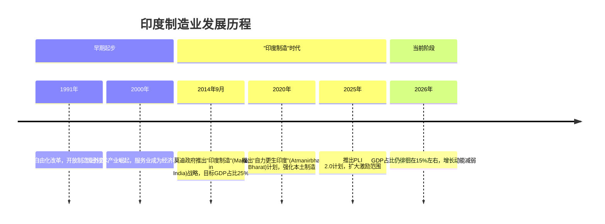
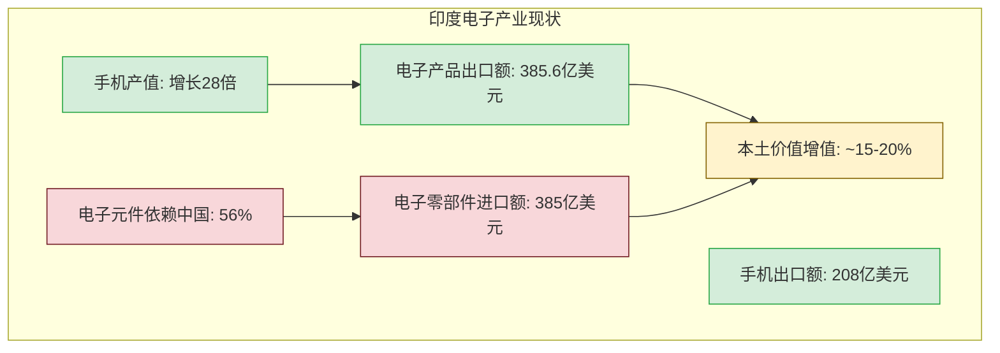
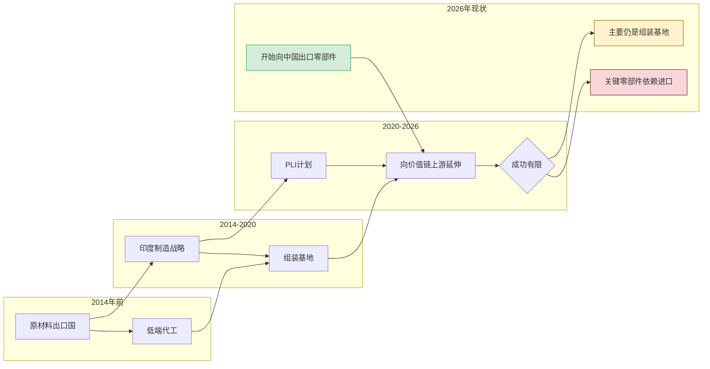

# 第二章 - 印度制造业现状分析

## 2.1 发展历程回顾（R·复盘视角）

### "印度制造"战略演变



### 关键事实清单（R·无因果词）

1. 2014年莫迪政府推出"印度制造"战略，目标将制造业占GDP比重提升至25%
2. 2026年制造业GDP占比约15%，十余年未提升
3. 制造业GVA增长率：FY 2025-26 Q1为7.72%，Q2为9.13%
4. 2026年3月制造业PMI指数为53.9，为近4年最低点
5. 中型和高科技产业占制造业增加值的46.3%
6. 电子元件进口中56%来自中国
7. PLI计划累计吸引投资2.16万亿卢比（约250亿美元）
8. 手机产值在过去10年增长近28倍
9. 物流成本占GDP的13-14%，中国为8%
10. 印度是全球第三大最受欢迎的制造业目的地

## 2.2 GDP占比与增长数据

### 制造业GDP占比趋势

```mermaid
bar chart
    title 印度制造业GDP占比变化（2014-2026）
    x-axis 年份: ["2014", "2016", "2018", "2020", "2022", "2024", "2026"]
    y-axis 占比(%): [15.4, 15.6, 15.1, 14.3, 14.8, 14.5, 15.0]
    bar [15.4, 15.6, 15.1, 14.3, 14.8, 14.5, 15.0]
```

### 增长数据详情

| 指标 | 数值 | 时间 | 来源 |
|------|------|------|------|
| 制造业GVA增长率 | 7.72% | FY 2025-26 Q1 | 印度央行 |
| 制造业GVA增长率 | 9.13% | FY 2025-26 Q2 | 印度央行 |
| 工业生产增长率 | 7.8% | 2025年12月 | IIP |
| PMI指数 | 55.4 | 2026年1月 | S&P Global |
| PMI指数 | 53.9 | 2026年3月 | S&P Global |
| 八大核心产业指数 | 175.7 | 2025年12月 | ICI |

## 2.3 产业结构分析

### 产业增长不平衡

| 产业类型 | 增长表现 | 说明 |
|---------|---------|------|
| **资本密集型产业** | 快速增长 | 汽车、基础金属、基础设施与建筑材料 |
| **内需导向型产业** | 增长稳定 | 受国内消费驱动 |
| **劳动密集型产业** | 萎缩 | 纺织（-5.3%）、皮革（-4.1%）、服装 |
| **出口导向型产业** | 几乎无增长 | 传统制造业核心领域 |
| **电子制造业** | 高速增长 | 手机产值增长近28倍 |

### 电子产业深度解析



## 2.4 "印度制造"战略成效评估

### PLI计划成效

| 指标 | 数值 | 说明 |
|------|------|------|
| 累计吸引投资 | 2.16万亿卢比 | 约250亿美元 |
| 累计产销 | 20.41万亿卢比 | 约2400亿美元 |
| 出口额 | 8.3万亿卢比 | 约1000亿美元 |
| 创造就业 | 143万+ | 官方数据 |
| 手机组装产业 | 规模化落地 | 唯一成功案例 |

### 政策失效领域

| 领域 | 问题 | 数据 |
|------|------|------|
| 纺织行业 | PLI资金兑付率低 | 不足10% |
| 皮革行业 | 开工率低 | 不到两成 |
| 劳动密集型产业 | 持续萎缩 | 服饰-5.3%，皮革-4.1% |

## 2.5 印度在全球供应链中的定位

### 供应链地位变化



### Apple生态供应链变化

| 指标 | FY25 | FY26 | 变化 |
|------|------|------|------|
| 印度供应商向中国出口 | 9.2亿美元 | 25亿美元 | +171% |
| 预计全年出口 | - | 35亿美元 | - |
| 出口产品 | - | PCB组件、机械零件、专业模块 | - |

---

**下一章**：[第三章 - 挑战与机遇深度解析](03-challenges-opportunities.md)
