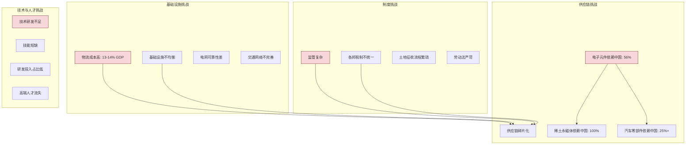
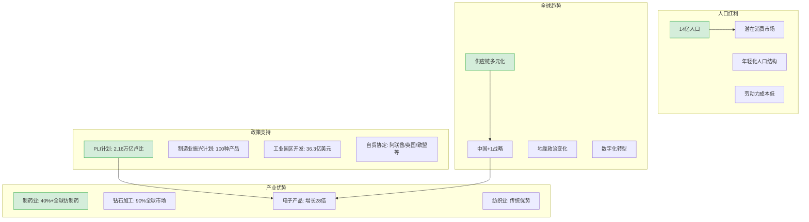

# 第三章 - 挑战与机遇深度解析

## 3.1 核心挑战分析（F·第一性原理视角）

### 挑战全景图



### 挑战深度解析

| 挑战 | 数据 | 影响 | 根因（F·第一性原理） |
|------|------|------|-------------------|
| **物流成本高** | 13-14% GDP（中国8%） | 产品成本上升，竞争力下降 | 基础设施建设滞后，各邦间协调不足 |
| **供应链碎片化** | 电子元件56%依赖中国 | 供应链脆弱，易受外部冲击 | 产业生态不完整，缺少上下游配套 |
| **监管复杂** | 跨邦物流繁琐 | 企业运营成本高，效率低 | 联邦制导致各邦政策不一致 |
| **技术研发不足** | 锂电产能目标完成率7% | 无法掌握核心技术，产业升级受阻 | 重厂房轻技术的扶持思路 |
| **技能短缺** | 65%民众日均生活费<3美元 | 高素质产业工人不足 | 教育体系与产业需求脱节 |

## 3.2 发展机遇分析（I·洞察视角）

### 机遇全景图



### 机遇深度解析

| 机遇 | 数据 | 潜力 | 关键成功因素 |
|------|------|------|------------|
| **人口红利** | 14亿人口，中位年龄28岁 | 庞大消费市场和劳动力储备 | 教育体系改革，技能培训 |
| **政策支持** | PLI计划吸引250亿美元投资 | 政策驱动产业发展 | 政策执行效率，资金到位 |
| **供应链多元化** | 全球第三大制造业目的地 | 承接全球供应链转移 | 基础设施改善，产业链完善 |
| **制药业优势** | 占全球仿制药市场40%+ | 全球医药供应链核心 | 质量标准提升，研发投入 |
| **电子产品增长** | 手机产值增长28倍 | 向价值链上游延伸 | 本土零部件制造能力提升 |

## 3.3 基于七概念方法论的深度洞察

### 洞察一："组装繁荣"的幻象

```
[条件C] 印度电子产品出口额385.6亿美元，零部件进口额也达385亿美元
→ 因为[机制M] 印度只是进行简单组装，本土价值增值仅15-20%，核心零部件依赖中国
→ 做[行动A] 不能被表面数据误导，需深入分析产业链完整性
→ 导致[结果B] 做出更准确的市场进入决策
```

**迁移场景**：分析其他新兴市场制造业时，同样需要区分"组装繁荣"与"产业链完整"

### 洞察二：供应链脆弱性的系统性风险

```
[条件C] 中国对稀土永磁体出口管制后，印度电动车产量下降50%
→ 因为[机制M] 印度100%依赖中国稀土永磁体，供应链缺乏替代来源
→ 做[行动A] 在制定印度供应链战略时，必须评估关键零部件的来源集中度
→ 导致[结果B] 建立更具韧性的供应链体系
```

**迁移场景**：任何供应链战略都应包含关键依赖的风险评估

### 洞察三："弃低端追高端"的陷阱

```
[条件C] 印度劳动密集型产业持续萎缩（纺织-5.3%，皮革-4.1%），高端产业进展缓慢
→ 因为[机制M] 跳过低端代工积累阶段，直接追求高端制造，缺少供应链基础和产业工人
→ 做[行动A] 理解制造业发展的阶段性规律，重视低端产业的积累价值
→ 导致[结果B] 制定符合发展阶段的产业政策
```

**迁移场景**：其他发展中国家的制造业发展路径规划

### 洞察四：内需驱动的局限性

```
[条件C] 印度人均收入仅3000美元，65%民众日均生活费不足3美元
→ 因为[机制M] 内部消费能力有限，高端产品依赖进口，本土品牌缺乏市场支撑
→ 做[行动A] 企业进入印度市场应优先考虑出口导向或中低端市场
→ 导致[结果B] 制定更符合市场实际的营销策略
```

**迁移场景**：评估新兴市场消费潜力时的决策框架

### 洞察五：政策执行力的关键瓶颈

```
[条件C] 纺织行业PLI资金兑付率不足10%，皮革企业开工率不到两成
→ 因为[机制M] 政策设计与执行存在脱节，企业实际获得的支持有限
→ 做[行动A] 评估印度市场机会时，不仅要看政策内容，还要看政策执行效果
→ 导致[结果B] 做出更务实的投资决策
```

**迁移场景**：评估任何政策驱动型市场机会时的通用方法

## 3.4 对抗性审查（V·挑战主流观点）

### 观点1：印度将取代中国成为世界工厂

**对抗性审查**：
- ⚠️ 物流成本是中国的1.6倍，成本优势不明显
- ⚠️ 供应链生态远不如中国完整，关键零部件依赖进口
- ⚠️ 基础设施建设需要时间，短期内难以大幅改善
- ✅ 但印度可成为中国的补充，而非替代

### 观点2：PLI计划取得巨大成功

**对抗性审查**：
- ⚠️ 14个赛道中仅有手机组装产业实现规模化落地
- ⚠️ 劳动密集型产业扶持政策基本空转
- ⚠️ 资金兑付率低，实际效果打折扣
- ✅ 手机产业的成功证明PLI模式在特定条件下有效

### 观点3：人口红利必然转化为经济优势

**对抗性审查**：
- ⚠️ 人口红利需要配套的教育和技能培训才能转化
- ⚠️ 印度教育体系与产业需求存在脱节
- ⚠️ 高素质人才流失问题严重
- ✅ 年轻化人口结构提供了长期潜力

## 3.5 可萃取模式（E·方法论沉淀）

### 模式一：新兴市场制造业发展阶段判断

**核心判断标准**：
1. 制造业GDP占比是否持续提升
2. 本土价值增值率是否高于30%
3. 产业链完整性（上下游配套能力）
4. 物流成本是否低于10% GDP
5. 政策执行力（资金兑付率、企业开工率）

### 模式二：供应链风险评估框架

**评估维度**：
1. **来源集中度**：单一来源占比是否超过50%
2. **替代难度**：是否存在可替代来源
3. **地缘风险**：来源地政治稳定性
4. **库存周期**：安全库存是否足够应对中断
5. **本地生产能力**：是否有本地替代方案

---

**下一章**：[第四章 - 实践操作指南](04-practice-guide.md)
