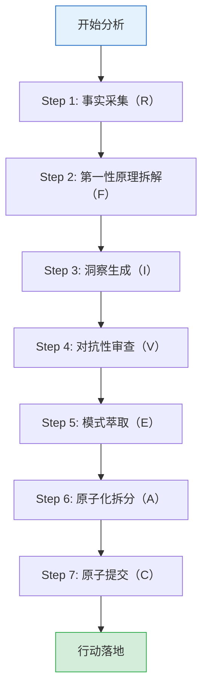

# 第四章 - 实践操作指南

## 4.1 七概念方法论应用总流程



## 4.2 Step 1: 事实采集（R·复盘基础）

### 操作步骤

1. **收集原始数据**：从官方渠道获取GDP数据、产业报告、政策文件
2. **构建时间线**：整理关键事件和时间节点
3. **提炼事实清单**：将数据转化为无因果词的客观事实
4. **验证数据来源**：确保数据来源可靠，标注出处

### 实践模板

```markdown
## 事实清单（R·无因果词）

| 序号 | 事实描述 | 数据来源 |
|------|---------|---------|
| 1 | 印度制造业GDP占比约15% | 印度央行2026年数据 |
| 2 | 物流成本占GDP的13-14% | 世界银行报告 |
| ... | ... | ... |

## 时间线

- 2014年9月：推出"印度制造"战略
- 2020年：推出"自力更生印度"计划
- 2025年：推出PLI 2.0计划
```

### 质量门检查（G1）

- [ ] 事实清单中无"因为/所以/导致/错误/失误"等因果词
- [ ] 每条事实都有明确的数据来源
- [ ] 时间线按时间顺序排列，无遗漏关键事件

## 4.3 Step 2: 第一性原理拆解（F·根因分析）

### 操作步骤

1. **剥离假设**：列出所有隐含假设，逐一验证
2. **要素拆解**：将复杂问题拆解为最基本要素
3. **公理识别**：找到不可证伪的基本原理
4. **重构推导**：基于公理重新推导解决方案

### 实践模板

```markdown
## 第一性原理分析（F）

### 假设清单
- [ ] 假设1：印度人口红利必然转化为经济优势
- [ ] 假设2：PLI计划能有效促进制造业发展
- [ ] 假设3：印度将取代中国成为世界工厂

### 要素拆解
1. **基础设施**：物流成本、电网可靠性、交通网络
2. **供应链**：产业链完整性、关键零部件依赖度
3. **制度环境**：监管复杂度、税制统一性、劳动力政策
4. **技术人才**：研发投入、技能培训、人才储备

### 公理识别
1. 制造业发展需要完整的产业链支持
2. 物流成本直接影响产品竞争力
3. 政策执行力决定政策效果
```

## 4.4 Step 3: 洞察生成（I·规律发现）

### 操作步骤

1. **条件识别**：找出关键触发条件
2. **机制揭示**：解释条件与结果之间的因果机制
3. **结论生成**：形成可验证的结论
4. **迁移验证**：验证洞察是否可迁移到其他场景

### 实践模板（洞察四元组）

```markdown
## 洞察清单（I·四元组格式）

### 洞察1：[洞察标题]

[条件C] 具体条件描述（可量化数据）
→ 因为[机制M] 因果机制解释
→ 做[行动A] 具体行动建议
→ 导致[结果B] 预期结果

**迁移场景**：其他适用场景描述
**证伪方法**：如何证明此洞察错误
```

### 质量门检查（G2）

- [ ] 每条洞察包含完整四元组（条件C/机制M/行动A/结果B）
- [ ] 洞察可证伪（有明确的证伪方法）
- [ ] 洞察可迁移（至少一个非当前领域场景）

## 4.5 Step 4: 对抗性审查（V·证伪防御）

### 操作步骤

1. **收集对立证据**：主动寻找反驳现有观点的证据
2. **多角攻击**：从不同角度挑战结论
3. **偏差识别**：识别认知偏差和逻辑漏洞
4. **审计可溯**：记录审查过程，便于追溯

### 实践模板

```markdown
## 对抗性审查（V）

### 观点：[被审查的观点]

**审查维度**：
1. **数据挑战**：数据是否完整？是否有相反数据？
2. **逻辑挑战**：推理是否严密？是否有逻辑漏洞？
3. **假设挑战**：假设是否成立？是否有替代解释？
4. **时间挑战**：短期数据能否代表长期趋势？

**审查结果**：
- ✅ 支持证据：...
- ⚠️ 挑战证据：...
- 📌 修改后的结论：...
```

### 常见认知偏差

| 偏差类型 | 描述 | 应对方法 |
|---------|------|---------|
| **确认偏差** | 只关注支持自己观点的证据 | 主动寻找反面证据 |
| **锚定效应** | 过度依赖初始信息 | 设定多个锚点，综合评估 |
| **光环效应** | 由单一优点推断整体优秀 | 分项评估，避免整体判断 |
| **事后诸葛亮** | 事后认为结果可预测 | 记录事前预测，对比实际结果 |

## 4.6 Step 5: 模式萃取（E·知识沉淀）

### 操作步骤

1. **显化转换**：将隐性经验转化为显性知识
2. **抽象提升**：从具体案例抽象出通用模式
3. **漏斗过滤**：过滤掉特定场景的干扰因素
4. **形式化编码**：用结构化格式记录模式

### 实践模板

```markdown
## 模式清单（E）

### 模式名称：[模式名称]

**适用场景**：哪些场景适用此模式
**核心逻辑**：模式的核心原理
**判断标准**：如何判断是否适用此模式
**实施步骤**：具体操作步骤
**成功案例**：应用此模式的成功案例
**失败案例**：应用此模式失败的案例及原因
```

### 质量门检查（G3）

- [ ] 模式可迁移到≥1个非当前领域场景
- [ ] 模式有明确的适用条件和判断标准
- [ ] 模式包含成功和失败案例

## 4.7 Step 6: 原子化拆分（A·粒度控制）

### 操作步骤

1. **粒度寻优**：确定最优信息粒度
2. **单元独立**：确保每个行动项独立可执行
3. **链接完整**：建立行动项之间的逻辑关系
4. **双向收敛**：从宏观和微观双向验证

### 实践模板

```markdown
## 原子化行动项（A）

| 序号 | 行动项 | 负责人 | 截止日期 | 依赖项 | 可验证标准 |
|------|--------|--------|---------|--------|-----------|
| 1 | 完成印度市场供应链风险评估 | 张三 | 2026-08-01 | 无 | 输出评估报告，包含5个关键维度 |
| 2 | 分析竞争对手在印度的布局 | 李四 | 2026-08-05 | 行动1 | 输出竞争分析报告 |
| 3 | 制定印度市场进入策略 | 王五 | 2026-08-10 | 行动1,2 | 输出策略方案 |
```

### 质量门检查（G4）

- [ ] 每个行动项符合单一职责原则
- [ ] 每个行动项有明确的负责人和截止日期
- [ ] 每个行动项有可验证的完成标准
- [ ] 行动项之间的依赖关系清晰

## 4.8 Step 7: 原子提交（C·行动落地）

### 操作步骤

1. **职责内聚**：确保提交内容聚焦单一目标
2. **因果闭合**：提交内容完整，无遗漏
3. **独立回滚**：提交可独立回滚，不影响其他部分
4. **认知平滑**：提交内容易于理解和审查

### 实践模板

```markdown
## 原子提交记录（C）

### 提交标题：[简洁描述]

**提交类型**：新增/修改/删除
**涉及范围**：具体文件/模块/领域
**变更内容**：详细描述变更
**验证方法**：如何验证变更正确性
**回滚方案**：如果需要回滚，如何操作
**关联洞察**：此提交基于哪个洞察
```

## 4.9 完整实践案例

### 案例：分析印度电子制造业市场机会

#### Step 1：事实采集（R）

```markdown
## 事实清单

| 序号 | 事实描述 | 来源 |
|------|---------|------|
| 1 | 印度电子产品出口额385.6亿美元 | 印度电子和半导体协会 |
| 2 | 电子零部件进口额385亿美元 | 印度商务部 |
| 3 | 电子元件56%来自中国 | 行业报告 |
| 4 | 手机产值增长28倍 | PLI计划官方数据 |
| 5 | 本土价值增值约15-20% | 专家分析 |
```

#### Step 2：第一性原理拆解（F）

```markdown
## 要素拆解
1. **产业链完整性**：组装能力强，零部件制造能力弱
2. **成本结构**：物流成本高，劳动力成本低
3. **政策环境**：PLI计划支持，但执行效率待提升
4. **市场潜力**：庞大内需市场，但消费能力有限

## 公理识别
1. 电子产品制造需要完整的零部件供应链
2. 本土价值增值率是衡量产业链深度的关键指标
3. 单一来源依赖度超过50%存在供应链风险
```

#### Step 3：洞察生成（I）

```markdown
### 洞察：印度电子制造业处于"组装繁荣"阶段

[条件C] 电子产品出口额与零部件进口额几乎相等，本土价值增值仅15-20%
→ 因为[机制M] 印度主要进行简单组装，核心零部件依赖中国进口
→ 做[行动A] 进入印度市场应优先考虑零部件制造，而非组装
→ 导致[结果B] 获得更高附加值，降低供应链风险

**迁移场景**：分析越南、印尼等其他新兴市场电子制造业
**证伪方法**：当印度本土价值增值率超过30%时，此洞察不再适用
```

#### Step 4：对抗性审查（V）

```markdown
### 观点：印度电子制造业正在崛起

**审查结果**：
- ✅ 支持证据：手机产值增长28倍，出口额增长显著
- ⚠️ 挑战证据：本土价值增值率仅15-20%，零部件严重依赖进口
- ⚠️ 逻辑漏洞：将组装规模扩大等同于产业升级
- 📌 修改后的结论：印度电子制造业在组装规模上取得成功，但产业链深度不足
```

#### Step 5：模式萃取（E）

```markdown
### 模式：新兴市场"组装繁荣"识别

**适用场景**：分析新兴市场制造业发展阶段
**核心逻辑**：出口额增长但本土价值增值率低，表明处于组装阶段
**判断标准**：
1. 本土价值增值率 < 30%
2. 零部件进口额 ≈ 成品出口额
3. 关键零部件依赖单一来源

**实施步骤**：
1. 计算本土价值增值率
2. 分析零部件来源构成
3. 评估产业链完整性
4. 判断发展阶段
```

#### Step 6：原子化拆分（A）

```markdown
## 行动项

| 序号 | 行动项 | 负责人 | 截止日期 | 可验证标准 |
|------|--------|--------|---------|-----------|
| 1 | 调研印度电子零部件市场需求 | 张三 | 2026-08-01 | 输出需求调研报告 |
| 2 | 分析中国零部件企业在印度的布局 | 李四 | 2026-08-05 | 输出竞争分析 |
| 3 | 评估进入印度市场的可行性 | 王五 | 2026-08-10 | 输出可行性报告 |
```

#### Step 7：原子提交（C）

```markdown
## 提交：印度电子零部件市场调研报告

**提交类型**：新增
**涉及范围**：市场分析报告
**变更内容**：完成印度电子零部件市场需求调研，涵盖5个主要品类
**验证方法**：数据来源验证、专家评审
**回滚方案**：保留历史版本
**关联洞察**：基于"组装繁荣"洞察
```

---

**下一章**：[第五章 - 常见问题解答（FAQ）](05-faq.md)
