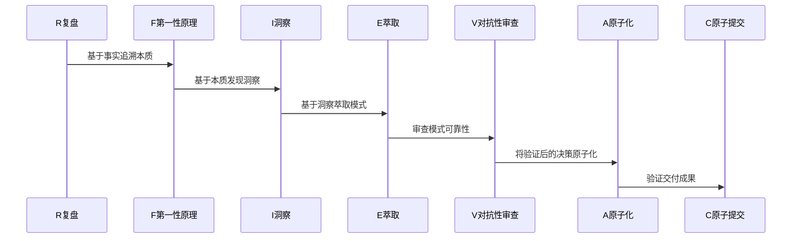

# 参考资料与附录

## 概述

本章提供教程中引用的参考资料、术语表、七概念理论官方定义以及相关工具和资源推荐，帮助读者深入学习和应用七概念理论框架。

---

## 参考资料

### 核心参考

| 资料名称 | 来源 | 说明 |
|---------|------|------|
| 七概念理论官方定义 | [seven-concepts.md](../../../../../.agents/commands/seven-concepts.md) | 七概念理论的官方定义和详细说明 |
| 复盘命令 | [retrospective.md](../../../../../.agents/commands/retrospective.md) | 复盘命令的使用说明和最佳实践 |
| 洞察命令 | [insight.md](../../../../../.agents/commands/insight.md) | 洞察命令的使用说明和分析方法 |
| 萃取命令 | [extraction.md](../../../../../.agents/commands/extraction.md) | 萃取命令的使用说明和模式沉淀方法 |

### 事件相关资料

| 资料名称 | 来源 | 说明 |
|---------|------|------|
| 印度塔塔电子数据泄露事件报道 | 公开新闻媒体 | 事件的详细报道和分析 |
| 苹果供应链安全要求 | Apple官方文档 | 苹果对供应商的安全标准和要求 |
| 特斯拉印度建厂计划 | 特斯拉官方公告/新闻 | 特斯拉在印度的投资计划和进展 |
| 印度制造业发展报告 | 世界银行/IMF报告 | 印度制造业的发展数据和趋势分析 |

### 方法论参考

| 资料名称 | 来源 | 说明 |
|---------|------|------|
| 第一性原理 | 亚里士多德/马斯克 | 第一性原理的哲学基础和应用方法 |
| 5Why分析法 | 丰田生产方式 | 5Why追问的起源和应用场景 |
| 对抗性审查 | 情报分析方法论 | 对抗性审查的理论基础和实践方法 |
| 原子化设计 | 软件设计方法论 | 原子化原则在设计领域的应用 |

---

## 术语表

### 七概念相关术语

| 术语 | 定义 |
|------|------|
| **复盘（R）** | Retrospective，收集客观事实，不包含因果词，用于构建分析的基础 |
| **第一性原理（F）** | First Principles，追溯事物本质，使用5Why追问法，直达根本原因 |
| **洞察（I）** | Insight，从事实和本质分析中发现的有价值的结论，包含陈述、证据、反常识、行动四元组 |
| **萃取（E）** | Extraction，将洞察升华为可复用的模式，实现知识沉淀和迁移 |
| **对抗性审查（V）** | Verification，从对立视角挑战分析结论，检验结论的可靠性 |
| **原子化（A）** | Atomization，将复杂任务拆分为最小可执行单元，确保单一职责、可验证、有Owner、有时间 |
| **原子提交（C）** | Commit，验证交付，确保行动项按计划完成并产生预期效果 |

### 供应链相关术语

| 术语 | 定义 |
|------|------|
| **供应链风险** | 供应链中可能导致中断、延迟或损失的不确定性因素 |
| **供应链多元化** | 分散供应链依赖，降低单一供应商或地区风险的策略 |
| **供应商评估** | 对供应商能力、可靠性和风险的评估过程 |
| **数据安全** | 保护数据免受未授权访问、泄露或破坏的措施 |
| **IT安全审计** | 对信息技术系统安全状况的评估和审查 |
| **成本竞争力** | 产品或服务在价格方面的竞争优势 |
| **供应链中断** | 供应链中某个环节出现问题导致整体流程受阻 |

### 分析方法相关术语

| 术语 | 定义 |
|------|------|
| **5Why追问** | 连续追问5层"为什么"，追溯问题的根本原因 |
| **洞察四元组** | 洞察的标准结构：陈述、证据、反常识、行动 |
| **质量门** | 分析过程中的检查点，确保每个阶段的产出质量 |
| **事实清单** | R阶段收集的客观事实列表，不含因果词 |
| **可复用模式** | 从具体案例中萃取的、可迁移到其他场景的方法论 |
| **原子化行动项** | 符合原子化标准的行动项：单一职责、可验证、有Owner、有时间 |
| **交付物清单** | C阶段验证的最终交付成果列表 |

---

## 七概念理论官方定义

### 七概念速查表

| 缩写 | 概念 | 英文 | 层级定位 | 核心作用 |
|------|------|------|---------|---------|
| R | 复盘 | Retrospective | 感知层 | 收集客观事实 |
| F | 第一性原理 | First Principles | 认知层 | 追溯本质原因 |
| I | 洞察 | Insight | 认知层 | 发现核心结论 |
| E | 萃取 | Extraction | 沉淀层 | 提炼可复用模式 |
| V | 对抗性审查 | Verification | 验证层 | 检验结论可靠性 |
| A | 原子化 | Atomization | 执行层 | 拆分可执行任务 |
| C | 原子提交 | Commit | 执行层 | 验证交付成果 |

### 质量门定义

| 质量门 | 检查内容 | 通过标准 |
|-------|---------|---------|
| G1 | R阶段事实无因果词 | 事实清单中不包含"因为"、"导致"、"由于"等因果词 |
| G2 | I阶段洞察四元组完整 | 每个洞察包含陈述、证据、反常识、行动四个要素 |
| G3 | E阶段模式可迁移 | 模式脱离具体场景，可应用于其他类似场景 |
| G4 | A阶段行动项原子化 | 行动项符合单一职责、可验证、有Owner、有时间标准 |

### 顺序不可颠倒原则

七概念理论的应用顺序必须严格遵循：



---

## 工具推荐

### 分析工具

| 工具名称 | 用途 | 推荐理由 |
|---------|------|---------|
| Mermaid | 流程图、时间线、关系图绘制 | 代码化绘图，易于维护和版本控制 |
| XMind | 思维导图 | 可视化展示概念关系和分析思路 |
| Tableau/Power BI | 数据可视化 | 展示数据趋势和分析结果 |
| Notion | 文档协作和知识管理 | 结构化存储分析成果和模式库 |

### 协作工具

| 工具名称 | 用途 | 推荐理由 |
|---------|------|---------|
| Slack/Discord | 实时沟通 | 团队协作和对抗性审查讨论 |
| GitHub/GitLab | 版本控制 | 管理分析文档和模式库的版本 |
| Jira/Asana | 任务管理 | 跟踪原子化行动项的执行进度 |

### 学习资源

| 资源名称 | 用途 | 推荐理由 |
|---------|------|---------|
| SpecWeave知识库 | 七概念理论和实践案例 | 官方知识库，内容全面 |
| 七概念命令文档 | 命令使用说明 | 详细的命令参数和使用示例 |
| 复盘案例库 | 复盘实践案例 | 真实案例分析，学习应用方法 |

---

## 模板与清单

### 事实收集模板

```markdown
## R阶段：事实收集清单

### 事件基本信息
- [ ] 事件名称：
- [ ] 发生时间：
- [ ] 发生地点：
- [ ] 涉及方：

### 事件过程
- [ ] 事件发生阶段：
- [ ] 事件响应阶段：
- [ ] 后续影响阶段：

### 核心数据
- [ ] 数据规模：
- [ ] 影响范围：
- [ ] 涉及企业：

### 注意事项
- [ ] 所有事实均为客观陈述
- [ ] 不包含因果词
- [ ] 包含时间、地点、人物、数据等要素
```

### 5Why追问模板

```markdown
## F阶段：5Why追问

### 问题：[待分析的问题]

**Why 1**：[表面现象] → [直接原因]
**Why 2**：[直接原因] → [间接原因]
**Why 3**：[间接原因] → [根本原因]
**Why 4**：[根本原因] → [深层原因]
**Why 5**：[深层原因] → [系统性原因]

### 根本原因总结：
```

### 洞察四元组模板

```markdown
## I阶段：洞察四元组

### 洞察1：[洞察名称]
- **陈述**：[核心结论]
- **证据**：[事实依据]
- **反常识**：[与普遍认知相悖的地方]
- **行动**：[具体行动建议]

### 洞察2：[洞察名称]
- **陈述**：[核心结论]
- **证据**：[事实依据]
- **反常识**：[与普遍认知相悖的地方]
- **行动**：[具体行动建议]

### 洞察3：[洞察名称]
- **陈述**：[核心结论]
- **证据**：[事实依据]
- **反常识**：[与普遍认知相悖的地方]
- **行动**：[具体行动建议]
```

### 对抗性审查清单

```markdown
## V阶段：对抗性审查

### 审查意见1
- **审查角度**：[审查角度描述]
- **审查意见**：[具体审查内容]
- **修正方案**：[如何修正]

### 审查意见2
- **审查角度**：[审查角度描述]
- **审查意见**：[具体审查内容]
- **修正方案**：[如何修正]

### 审查意见3
- **审查角度**：[审查角度描述]
- **审查意见**：[具体审查内容]
- **修正方案**：[如何修正]

### 审查意见4
- **审查角度**：[审查角度描述]
- **审查意见**：[具体审查内容]
- **修正方案**：[如何修正]

### 审查意见5
- **审查角度**：[审查角度描述]
- **审查意见**：[具体审查内容]
- **修正方案**：[如何修正]
```

### 原子化行动项模板

```markdown
## A阶段：原子化行动项

| 序号 | 行动项 | Owner | 截止日期 | 状态 | 完成标准 |
|------|--------|-------|---------|------|---------|
| 1 | [行动项描述] | [责任人] | [日期] | □ | [完成标准] |
| 2 | [行动项描述] | [责任人] | [日期] | □ | [完成标准] |
| 3 | [行动项描述] | [责任人] | [日期] | □ | [完成标准] |
| 4 | [行动项描述] | [责任人] | [日期] | □ | [完成标准] |
| 5 | [行动项描述] | [责任人] | [日期] | □ | [完成标准] |
```

### 交付物清单模板

```markdown
## C阶段：交付物清单

| 序号 | 交付物名称 | 描述 | 状态 |
|------|-----------|------|------|
| 1 | 事实清单 | R阶段收集的客观事实列表 | □ |
| 2 | 5Why分析报告 | F阶段的根本原因分析 | □ |
| 3 | 洞察四元组 | I阶段的核心洞察 | □ |
| 4 | 可复用模式 | E阶段萃取的模式 | □ |
| 5 | 对抗性审查报告 | V阶段的审查意见和修正方案 | □ |
| 6 | 原子化行动项 | A阶段的行动项清单 | □ |
| 7 | 分析报告 | 完整的分析报告 | □ |
```

---

## 附录：七概念应用检查清单

### 完整应用流程检查清单

```markdown
## 七概念应用检查清单

### R阶段：复盘
- [ ] 收集20条以上客观事实
- [ ] 事实不包含因果词（G1）
- [ ] 事实包含时间、地点、人物、数据等要素

### F阶段：第一性原理
- [ ] 进行5Why追问
- [ ] 追溯到根本原因
- [ ] 识别核心假设

### I阶段：洞察
- [ ] 构建3条以上洞察四元组
- [ ] 每个洞察包含陈述、证据、反常识、行动（G2）
- [ ] 洞察有事实支撑

### E阶段：萃取
- [ ] 萃取2个以上可复用模式
- [ ] 模式可迁移到其他场景（G3）
- [ ] 模式包含适用条件和限制

### V阶段：对抗性审查
- [ ] 进行至少5条审查意见
- [ ] 审查多角度、系统性
- [ ] 根据审查意见修正洞察

### A阶段：原子化
- [ ] 制定5个以上原子化行动项
- [ ] 行动项符合单一职责、可验证、有Owner、有时间（G4）
- [ ] 行动项有明确的完成标准

### C阶段：原子提交
- [ ] 验证所有行动项完成情况
- [ ] 评估分析结论的正确性
- [ ] 形成完整的交付物清单
```

---

**上一章**：[常见问题与注意事项](05-faq-notes.md) | **返回首页**：[Wiki教程首页](README.md)
