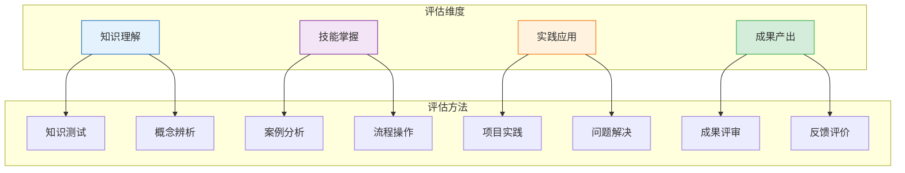
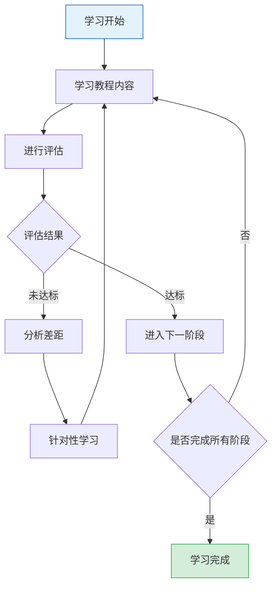

# 第七章 - 学习效果评估方法

## 7.1 评估体系概述

### 评估维度框架



### 评估层次模型

| 层次 | 评估内容 | 评估方法 | 达标标准 |
|------|---------|---------|---------|
| **Level 1** | 知识理解 | 知识测试、概念辨析 | 答对率≥80% |
| **Level 2** | 技能掌握 | 案例分析、流程操作 | 分析质量评分≥70分 |
| **Level 3** | 实践应用 | 项目实践、问题解决 | 成功完成实践项目 |
| **Level 4** | 成果产出 | 成果评审、反馈评价 | 成果被采纳或认可 |

## 7.2 Level 1：知识理解评估

### 7.2.1 七概念定义测试

**测试题**：

| 题号 | 问题 | 答题区域 |
|------|------|---------|
| 1 | 请用一句话定义"复盘（R）"的核心要素 | ______________ |
| 2 | 请用一句话定义"洞察（I）"的核心要素 | ______________ |
| 3 | 请用一句话定义"第一性原理（F）"的核心要素 | ______________ |
| 4 | 请用一句话定义"对抗性审查（V）"的核心要素 | ______________ |
| 5 | 请用一句话定义"原子化（A）"的核心要素 | ______________ |

**评分标准**：
- 完全正确：2分
- 基本正确：1分
- 错误：0分
- **达标标准**：总分≥8分

### 7.2.2 概念辨析测试

**测试题**：

| 题号 | 问题 | 答案 |
|------|------|------|
| 1 | 复盘（R）和洞察（I）的区别是什么？ | ______________ |
| 2 | 原子化（A）和原子提交（C）的区别是什么？ | ______________ |
| 3 | 第一性原理（F）和模式萃取（E）的关系是什么？ | ______________ |
| 4 | 对抗性审查（V）在认知架构中的位置是什么？ | ______________ |

**评分标准**：
- 完全正确：3分
- 基本正确：2分
- 部分正确：1分
- 错误：0分
- **达标标准**：总分≥10分

### 7.2.3 印度制造业知识测试

**测试题**：

| 题号 | 问题 | 选项A | 选项B | 选项C | 选项D | 答案 |
|------|------|-------|-------|-------|-------|------|
| 1 | 印度制造业GDP占比约为多少？ | 10% | 15% | 20% | 25% | ____ |
| 2 | 印度物流成本占GDP的比例约为？ | 8% | 10% | 13-14% | 18% | ____ |
| 3 | 印度电子元件依赖中国的比例约为？ | 30% | 45% | 56% | 70% | ____ |
| 4 | PLI计划累计吸引投资约为？ | 100亿美元 | 200亿美元 | 250亿美元 | 300亿美元 | ____ |
| 5 | 印度手机产值在过去10年增长了多少倍？ | 10倍 | 18倍 | 28倍 | 38倍 | ____ |

**评分标准**：
- 每题2分
- **达标标准**：总分≥8分

## 7.3 Level 2：技能掌握评估

### 7.3.1 案例分析评估

**任务**：阅读以下案例，使用七概念方法论进行分析。

**案例背景**：
> 某中国电子零部件企业计划进入印度市场，需要评估市场机会和风险。

**评估维度**：

| 维度 | 评估内容 | 评分标准 |
|------|---------|---------|
| **事实采集** | 是否收集了完整的事实数据 | 0-5分 |
| **第一性原理拆解** | 是否正确识别了关键要素和公理 | 0-5分 |
| **洞察生成** | 是否生成了高质量的洞察四元组 | 0-5分 |
| **对抗性审查** | 是否进行了有效的证伪防御 | 0-5分 |
| **模式萃取** | 是否提炼了可迁移的模式 | 0-5分 |
| **原子化拆分** | 是否制定了合理的行动项 | 0-5分 |

**评分标准**：
- 总分30分
- **达标标准**：≥21分（70%）

### 7.3.2 流程操作评估

**任务**：按照七步骤流程，完成一个完整的分析报告。

**评估清单**：

| 步骤 | 要求 | 完成状态 |
|------|------|---------|
| Step 1 | 事实清单包含≥10条无因果词的客观事实 | [ ] |
| Step 2 | 假设清单包含≥5个假设，要素拆解≥4个维度 | [ ] |
| Step 3 | 洞察四元组包含完整的C-M-A-B结构 | [ ] |
| Step 4 | 对抗性审查从≥3个角度进行挑战 | [ ] |
| Step 5 | 模式萃取包含适用场景和判断标准 | [ ] |
| Step 6 | 原子化行动项包含负责人、截止日期、可验证标准 | [ ] |
| Step 7 | 原子提交记录包含验证方法和回滚方案 | [ ] |

**达标标准**：完成所有7项要求

## 7.4 Level 3：实践应用评估

### 7.4.1 项目实践评估

**任务**：选择一个实际问题，应用七概念方法论进行分析，并产出可执行的行动方案。

**评估维度**：

| 维度 | 评估内容 | 评分标准 |
|------|---------|---------|
| **问题选择** | 问题是否具有实际意义和挑战性 | 0-5分 |
| **分析深度** | 分析是否深入，是否触及根本原因 | 0-5分 |
| **方案可行性** | 行动方案是否具体可行 | 0-5分 |
| **方法论应用** | 是否正确应用了七概念方法论 | 0-5分 |
| **成果质量** | 产出物是否清晰、完整、专业 | 0-5分 |

**评分标准**：
- 总分25分
- **达标标准**：≥18分（72%）

### 7.4.2 问题解决评估

**任务**：解决一个实际的供应链问题，使用七概念方法论。

**评估维度**：

| 维度 | 评估内容 | 评分标准 |
|------|---------|---------|
| **问题定义** | 问题定义是否清晰准确 | 0-5分 |
| **根因分析** | 是否找到根本原因 | 0-5分 |
| **解决方案** | 解决方案是否有效 | 0-5分 |
| **执行计划** | 执行计划是否合理 | 0-5分 |
| **风险评估** | 是否考虑了潜在风险 | 0-5分 |

**评分标准**：
- 总分25分
- **达标标准**：≥18分（72%）

## 7.5 Level 4：成果产出评估

### 7.5.1 成果评审

**评估维度**：

| 维度 | 评估内容 | 评分标准 |
|------|---------|---------|
| **完整性** | 成果是否包含所有必要内容 | 0-10分 |
| **准确性** | 数据和分析是否准确 | 0-10分 |
| **实用性** | 成果是否具有实际应用价值 | 0-10分 |
| **创新性** | 是否提出了新的见解或方法 | 0-10分 |
| **专业性** | 成果是否符合专业标准 | 0-10分 |

**评分标准**：
- 总分50分
- **达标标准**：≥35分（70%）

### 7.5.2 反馈评价

**评估方式**：

1. **同行评审**：邀请3-5位同行对成果进行评价
2. **专家评审**：邀请行业专家进行点评
3. **用户反馈**：收集成果使用者的反馈意见

**反馈收集表**：

| 评价维度 | 评分（1-5分） | 改进建议 |
|---------|--------------|---------|
| 内容质量 | ____ | ______________ |
| 分析深度 | ____ | ______________ |
| 实用性 | ____ | ______________ |
| 表达清晰度 | ____ | ______________ |

**达标标准**：平均评分≥4分

## 7.6 学习进度跟踪

### 学习进度表

| 阶段 | 学习内容 | 评估方式 | 预计时间 | 完成状态 |
|------|---------|---------|---------|---------|
| **阶段1** | 七概念方法论概述 | 知识测试 | 1-2小时 | [ ] |
| **阶段2** | 七概念知识框架 | 概念辨析 | 2-3小时 | [ ] |
| **阶段3** | 印度制造业现状分析 | 知识测试 | 2-3小时 | [ ] |
| **阶段4** | 挑战与机遇深度解析 | 案例分析 | 3-4小时 | [ ] |
| **阶段5** | 实践操作指南 | 流程操作 | 3-4小时 | [ ] |
| **阶段6** | 综合实践项目 | 项目实践 | 8-10小时 | [ ] |

### 学习成果档案

**模板**：

```markdown
## 学习成果档案

### 基本信息
- 姓名：________
- 学习开始日期：________
- 学习完成日期：________

### 评估记录
| 评估类型 | 日期 | 得分 | 达标情况 |
|---------|------|------|---------|
| 知识测试 | ________ | ____ | [ ]达标 [ ]未达标 |
| 案例分析 | ________ | ____ | [ ]达标 [ ]未达标 |
| 项目实践 | ________ | ____ | [ ]达标 [ ]未达标 |
| 成果评审 | ________ | ____ | [ ]达标 [ ]未达标 |

### 学习心得
________

### 改进计划
________
```

## 7.7 持续改进机制

### 评估反馈循环



### 针对性改进策略

| 评估结果 | 差距分析 | 改进策略 |
|---------|---------|---------|
| 知识测试未达标 | 概念理解不清晰 | 重新阅读相关章节，制作思维导图 |
| 案例分析未达标 | 分析方法不熟练 | 参考教程案例，进行更多练习 |
| 项目实践未达标 | 实践能力不足 | 参与更多实际项目，积累经验 |
| 成果评审未达标 | 成果质量有待提高 | 参考优秀范例，寻求专家指导 |

### 学习建议

1. **定期回顾**：每周回顾已学内容，巩固记忆
2. **实践应用**：在实际工作中应用方法论，积累经验
3. **寻求反馈**：请他人审查分析结果，获取改进建议
4. **持续学习**：关注行业动态，更新知识体系
5. **分享经验**：将学习成果分享给他人，加深理解

---

**附录**：[返回教程首页](00-overview.md)
