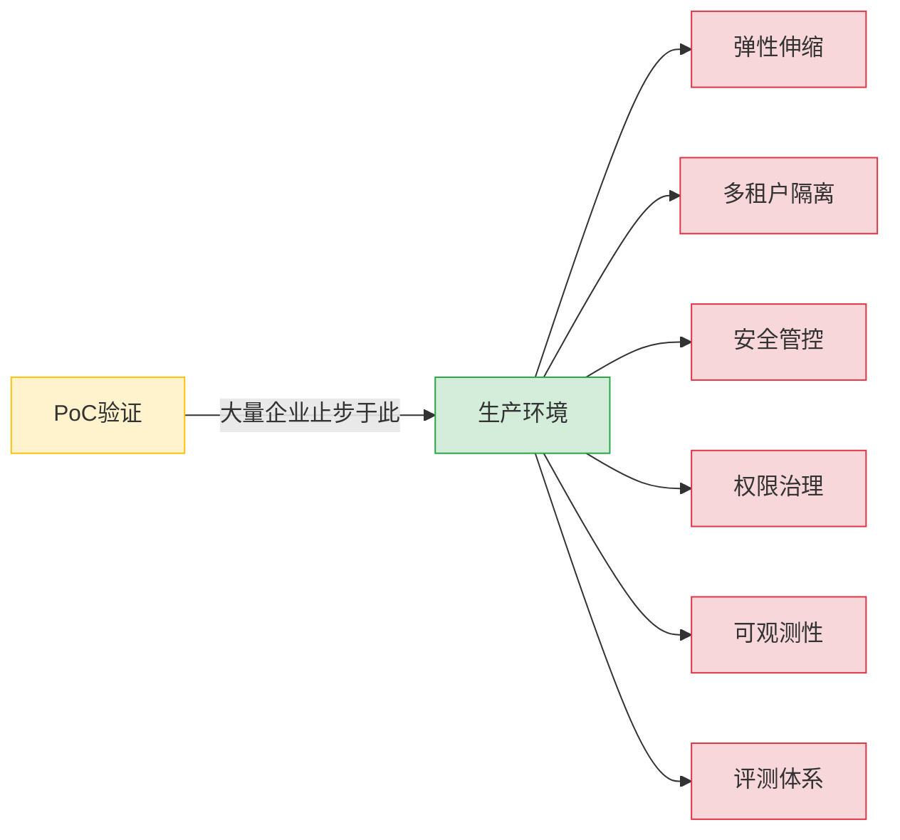
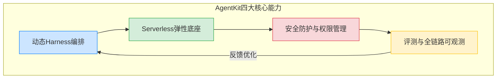
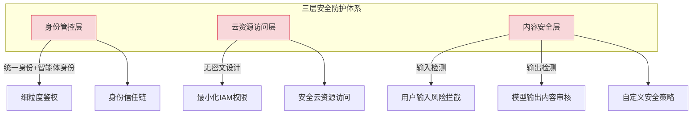
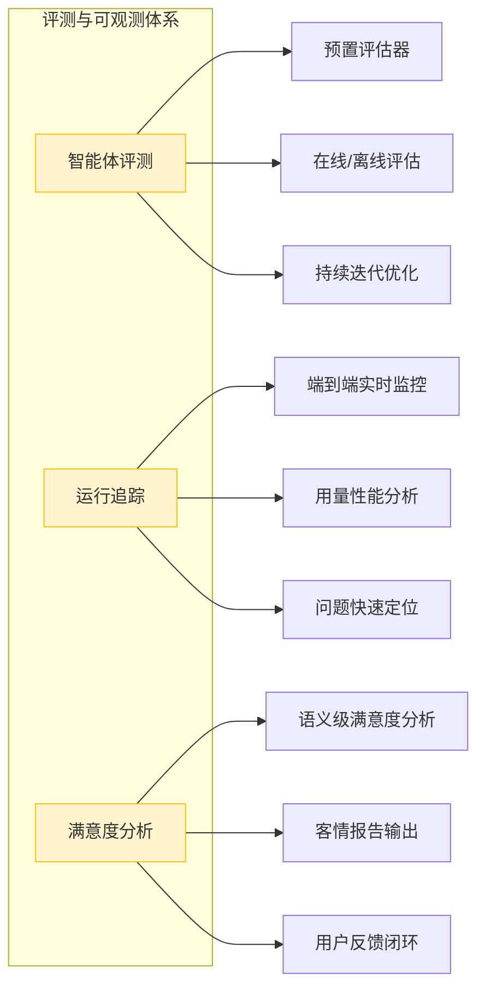
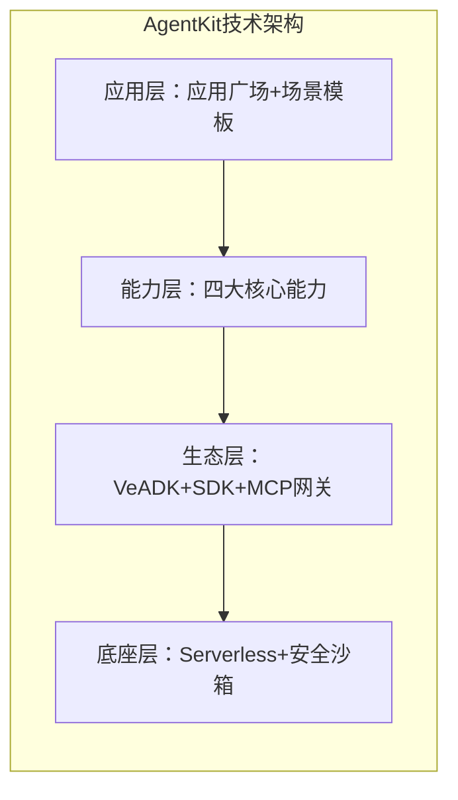
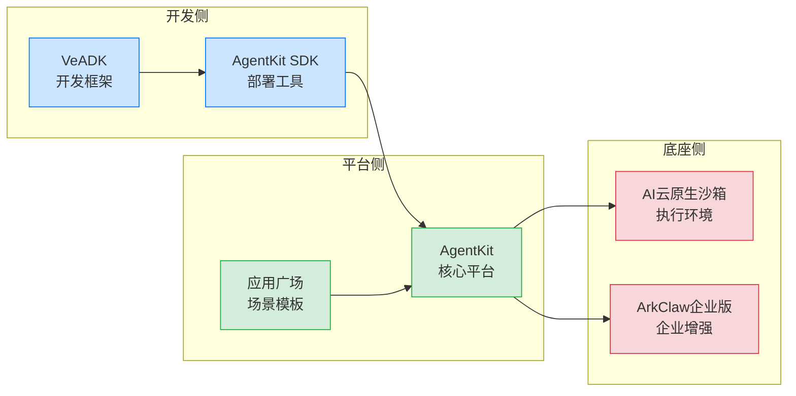
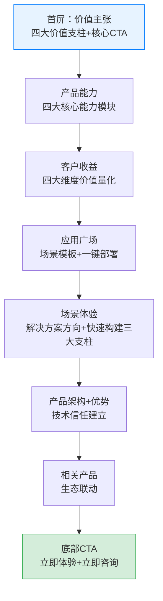

# 火山引擎AgentKit企业级AI Agent平台深度学习笔记

> **产品介绍页**: https://www.volcengine.com/product/agentkit
> **产品定位**: 企业级AI Agent平台——打通最后一公里，快速构建和部署生产可用的智能体
> **核心价值**: 快速投产、安全可信、存量焕新、质量可见
> **配套生态**: VeADK开发框架、AgentKit SDK、应用广场、AI云原生沙箱、ArkClaw企业版

---

## 📋 目录导航

- [一、产品概述与定位](#一产品概述与定位)
- [二、四大核心产品能力深度解析](#二四大核心产品能力深度解析)
- [三、客户收益四大维度分析](#三客户收益四大维度分析)
- [四、应用广场与场景模板](#四应用广场与场景模板)
- [五、技术架构与产品优势](#五技术架构与产品优势)
- [六、相关产品生态矩阵](#六相关产品生态矩阵)
- [七、网页信息架构与UX设计分析](#七网页信息架构与ux设计分析)
- [八、商业价值与市场机会](#八商业价值与市场机会)
- [九、可借鉴设计理念与实践经验](#九可借鉴设计理念与实践经验)
- [十、行业启示与趋势判断](#十行业启示与趋势判断)
- [十一、专业术语表](#十一专业术语表)
- [十二、相关资源链接](#十二相关资源链接)
- [十三、开放问题清单](#十三开放问题清单)

---

## 一、产品概述与定位

### 1.1 产品定位："企业级AI Agent平台"与"最后一公里"

AgentKit定位为**企业级AI Agent平台**，其核心使命是**"打通最后一公里，快速构建和部署生产可用的智能体"**。这一定位具有深刻的行业洞察：

| 定位维度 | 内涵说明 |
|---------|---------|
| **企业级** | 面向中大型企业生产环境，强调安全、可靠、可审计、可管控，而非面向开发者的玩具级/实验级工具 |
| **AI Agent平台** | 不是单一的Agent开发框架，而是覆盖编排、运行、安全、评测全链路的平台级产品 |
| **最后一公里** | 直击行业痛点：大量企业已完成Agent PoC验证，但从PoC到生产环境存在巨大鸿沟，AgentKit聚焦填补这一鸿沟 |
| **生产可用** | 核心关键词：Serverless弹性、多租户隔离、安全防护、全链路可观测——这些都是生产环境的刚需 |

### 1.2 四大价值支柱

AgentKit的价值主张由四大支柱构成，形成完整的价值闭环：

| 价值支柱 | 核心内涵 | 支撑能力 | 解决的痛点 |
|---------|---------|---------|-----------|
| **快速投产** | 缩短从构想到上线的周期，让Agent快速投入业务使用 | Harness配置即部署、开箱即用组件、内置工具集 | Agent开发周期长、投产慢 |
| **安全可信** | 企业级安全防护与权限治理，确保Agent运行可控 | 零信任身份体系、IAM最小权限、内容护栏、多租户隔离 | 企业担心数据安全、权限失控、内容风险 |
| **存量焕新** | 渐进式改造存量应用，而非推倒重来 | MCP协议连接存量API、开放兼容原有技术栈 | 传统企业系统改造成本高、风险大 |
| **质量可见** | 端到端评测与可观测，持续优化Agent效果 | 预置评估器、实时监控、满意度语义分析 | Agent效果不可量化、问题难定位、优化无方向 |

### 1.3 从PoC到生产的鸿沟：AgentKit解决的核心问题

当前AI Agent行业的现实是：很多企业能在几周内做出Agent Demo，但要真正投产需要数月甚至更长时间解决生产级问题。AgentKit的定位正是聚焦这"最后一公里"的脏活累活。

### 1.4 AgentKit vs Agent开发框架：本质差异

| 维度 | Agent开发框架（如LangChain、早期HiAgent） | AgentKit企业级平台 |
|------|----------------------------------------|-------------------|
| **目标用户** | 开发者、AI团队 | 企业IT、业务部门、运维团队 |
| **核心关注点** | 快速搭建Demo、编排逻辑 | 生产稳定、安全合规、成本可控 |
| **部署模式** | 自建、需要自己管理基础设施 | Serverless全托管、按需扩缩容 |
| **安全能力** | 需要自己实现 | 内置零信任、IAM、内容护栏 |
| **可观测性** | 需要自己集成 | 端到端预置、开箱即用 |
| **多租户** | 不支持/需自己实现 | 原生支持、资源数据严格隔离 |
| **存量系统** | 需要大量定制开发 | MCP协议快速连接存量API |

---

## 二、四大核心产品能力深度解析

AgentKit的产品能力围绕生产全链路设计，形成"编排→底座→安全→可观测"的完整闭环：

### 2.1 能力一：动态Harness编排

**官方表述**：开箱即用：Harness配置即部署，无需开发Agent代码；动态加载：Agent模型/工具/Skills支持session内热切换，动态调整Agent能力边界；复杂任务调度：意图准确解析、任务可动态拆解、长周期任务可中断/恢复。

#### Harness概念解析

Harness（马具/挽具）是一个极具隐喻的概念：
- 传统方式：你需要自己"造马车"——编写Agent代码、集成各种组件
- Harness方式：你只需"套上挽具"——通过配置即可驾驭大模型能力，Harness承载了所有底层复杂性

| Harness特性 | 功能说明 | 核心价值 |
|------------|---------|---------|
| **配置即部署** | 无需编写Agent代码，通过Harness配置即可完成部署 | 大幅降低开发门槛，缩短投产周期 |
| **Session内热切换** | Agent的模型、工具、Skills可在运行时动态切换，无需重启 | 支持A/B测试、灰度发布、能力动态调整 |
| **意图准确解析** | 精准理解用户意图，路由到正确的处理流程 | 提升用户体验，减少误判 |
| **任务动态拆解** | 复杂任务自动拆解为可执行的子任务 | 支持复杂业务场景的自动化处理 |
| **长周期任务中断/恢复** | 长时间运行的任务可中断并从断点恢复 | 提升可靠性，支持需要人工介入的场景 |

#### Harness vs 传统工作流编排

| 维度 | 传统工作流编排 | Harness编排 |
|------|--------------|------------|
| **设计理念** | 预定义流程、固定路径 | 动态适配、根据意图灵活调度 |
| **变更方式** | 修改流程定义、重新部署 | Session内热切换、实时生效 |
| **开发模式** | 代码/可视化编排 | 配置化、极少代码 |
| **适用场景** | 确定性流程 | 开放性、探索性任务 |

### 2.2 能力二：弹性易用、稳定可靠的智能体底座

**官方表述**：Serverless：无需管理服务器，底层资源按需秒级扩缩容；多租户隔离：租户间资源与数据严格隔离，保障业务安全；内置工具集：开箱即用的工具能力，支持快速部署与集成。

#### Serverless弹性架构

| 特性 | 说明 | 业务价值 |
|------|------|---------|
| **免服务器管理** | 无需 provisioning、维护服务器，平台全托管 | 降低运维成本，团队聚焦业务逻辑 |
| **秒级扩缩容** | 根据流量自动弹性伸缩，秒级响应 | 应对突发流量，避免资源浪费或服务不可用 |
| **按需付费** | 按实际使用量计费，闲置无成本 | 成本优化，适合波峰波谷明显的业务 |

#### 多租户隔离架构

多租户是SaaS化企业平台的核心能力：
- **资源隔离**：计算、存储、网络资源严格隔离，避免租户间相互影响
- **数据隔离**：租户数据不可互访，满足数据安全合规要求
- **安全隔离**：一个租户的安全问题不会波及其他租户
- **体验一致**：每个租户都像使用独立部署的系统

#### 内置工具集

平台预置开箱即用的工具能力，避免重复造轮子：
- 常见工具的标准化集成
- 工具调用的统一接口与错误处理
- 工具权限的统一管控

### 2.3 能力三：智能体安全防护与权限管理

**官方表述**：身份管控：统一身份/智能体身份，细粒度鉴权，身份信任链；云身份管控：无密文、最小化IAM权限设计，实现快速安全云资源访问；内容护栏：提供用户输入与模型输出内容的风险检测拦截，支持自定义安全策略。

安全是企业级产品的生命线，AgentKit构建了三层安全防护体系：

| 安全层 | 核心能力 | 设计理念 |
|--------|---------|---------|
| **身份管控** | 统一用户身份+智能体身份双身份体系、细粒度鉴权、身份信任链 | 零信任安全模型，每次访问都验证 |
| **云身份管控** | 无密文（不在代码/配置中硬编码密钥）、最小化IAM权限 | 遵循安全最佳实践，减少攻击面 |
| **内容护栏** | 用户输入风险检测、模型输出内容审核、自定义安全策略 | 双向内容安全，防止Prompt注入、有害内容生成 |

#### 双身份治理体系：核心差异化壁垒

AgentKit的"统一智能体身份和用户身份与权限治理"是其独特优势：
- **用户身份**：传统的用户认证与权限管理
- **智能体身份**：为每个Agent分配独立身份，Agent访问资源时使用自己的身份而非用户身份
- **价值**：实现Agent行为的可审计、可追溯、可管控，避免Agent权限过大带来的安全风险

### 2.4 能力四：智能体评测与全链路可观测

**官方表述**：智能体评测：预置最佳实践评估器，多维度在/离线评估，助力持续迭代；运行追踪：提供端到端实时监控、用量性能分析；满意度分析：实时分析用户语义，输出客情报告。

| 模块 | 核心能力 | 解决的问题 |
|------|---------|-----------|
| **智能体评测** | 预置最佳实践评估器、多维度在/离线评估 | Agent效果如何量化？如何系统优化？ |
| **运行追踪** | 端到端实时监控、用量性能分析 | 出问题如何定位？性能瓶颈在哪？ |
| **满意度分析** | 实时语义分析、客情报告输出 | 用户真实反馈如何？满意度如何？ |

#### 从DevOps到AgentOps

AgentKit的可观测体系标志着从传统DevOps向AgentOps的演进：
- **DevOps**：关注系统指标（CPU、内存、响应时间、错误率）
- **AgentOps**：除了系统指标，还要关注语义级指标（意图理解准确率、任务完成率、用户满意度、回答质量）

---

## 三、客户收益四大维度分析

### 3.1 敏捷开发：大幅缩短构建迭代周期

| 收益点 | 具体体现 |
|--------|---------|
| **开箱即用组件** | 丰富的预置组件，避免从零开始构建 |
| **编码脚手架** | 标准化的开发框架与工具链，提升开发效率 |
| **一站式体验** | 在单一平台内完成开发、调试、部署、运维，减少工具切换 |
| **迭代周期缩短** | 从数月缩短到数周甚至数天，快速验证业务价值 |

### 3.2 生产就绪：稳定可靠运行于业务环境

| 收益点 | 具体体现 |
|--------|---------|
| **系统对接** | 预置企业系统集成能力，打通数据孤岛 |
| **内置运维** | 平台提供完善的运维工具，无需自建运维体系 |
| **全程可控可审计** | 所有操作可追溯、可审计，满足企业合规要求 |
| **稳定可靠** | 高可用架构设计，保障业务连续性 |

### 3.3 开放兼容：无缝集成原有技术栈

| 收益点 | 具体体现 |
|--------|---------|
| **主流框架兼容** | 支持业界主流Agent开发框架，避免技术栈锁定 |
| **开放协议支持** | 支持MCP等开放协议，生态互联互通 |
| **模块化设计** | 松耦合架构，可按需选用组件 |
| **存量系统集成** | 与企业原有IT系统无缝对接，保护既有投资 |

### 3.4 成本优化：规模化部署更经济

| 收益点 | 具体体现 |
|--------|---------|
| **资源秒级伸缩** | 按需使用资源，避免闲置浪费 |
| **链路优化** | 平台优化调用链路，降低延迟与成本 |
| **全托管服务** | 减少运维人力投入 |
| **规模化效应** | 随着部署规模扩大，边际成本递减 |

---

## 四、应用广场与场景模板

### 4.1 应用广场：从工具到场景最佳实践

应用广场提供"快速入门到场景化最佳实践的模板"，这是产品化成熟的重要标志——不仅提供工具，还提供经过验证的场景解决方案。

### 4.2 三大场景模板深度分析

| 模板名称 | 核心能力 | 适用场景 | 业务价值 | 配套能力 |
|---------|---------|---------|---------|---------|
| **智能代码生成助手** | 专业高效的编程辅助体验 | 研发团队、软件企业 | 提升编码效率、降低重复劳动、代码质量提升 | 场景模板+工具 |
| **短视频制作智能体** | 背景信息检索、故事描述生成、视频创作 | 内容创作、营销团队、MCN机构 | 降低视频制作门槛、提升内容产出效率 | 场景模板 |
| **客户服务助理** | 智能客服系统，处理客户咨询和商品售后服务 | 客服中心、电商、企业服务 | 7x24小时服务、降低人工成本、响应速度提升 | 场景模板+知识库+记忆库 |

#### 场景模板的战略意义

这三个模板的选择体现了火山引擎的战略思考：
1. **代码生成**：开发者场景，技术门槛最高但需求最明确，容易建立口碑
2. **短视频制作**：字节跳动核心优势领域（抖音生态），差异化竞争
3. **客户服务**：最成熟的企业AI应用场景，市场接受度高，客单价可观

### 4.3 场景体验：解决方案方向

页面展示的场景体验方向：
- **售后助手**：面向售后服务场景
- **门店巡检**：面向线下零售/连锁门店场景

### 4.4 快速构建企业级Agent三大支柱

在场景体验模块，AgentKit总结了快速构建企业级Agent的三大支柱：

| 支柱 | 内涵 |
|------|------|
| **完备工具链，标准开发范式** | 从开发框架到调试工具的完整工具集，内置丰富脚手架模板，无需关注底层配置即可快速构建Agent |
| **开放生态，高扩展运行时** | 支持MCP协议，通过高性能网关轻松连接各类外部服务与数据源，支持企业存量API资产梳理并快速转为Agent可用工具 |
| **企业级治理，可信安全沙箱** | 内置严格的身份鉴权体系与安全沙箱机制，确保Agent在执行代码或调用敏感接口时的边界可控 |

---

## 五、技术架构与产品优势

### 5.1 产品架构三大技术特性

#### 特性一：完备工具链，标准开发范式

- **全链路工具集**：从开发框架到调试工具的完整覆盖
- **脚手架模板**：丰富的预置模板，快速启动项目
- **底层配置屏蔽**：开发者无需关注底层基础设施配置
- **标准化范式**：建立Agent开发的标准流程与最佳实践

#### 特性二：开放生态，高扩展运行时

**MCP协议支持是核心战略选择**：
- **MCP（Model Context Protocol）**：开放的Agent工具连接协议
- **高性能网关**：连接各类外部服务与数据源
- **存量API资产转换**：将企业已有的API快速转为Agent可用工具
- **避免厂商锁定**：基于开放协议，企业可自由选择生态组件

#### 特性三：企业级治理，可信安全沙箱

- **严格身份鉴权**：每一次访问都经过身份验证与权限检查
- **安全沙箱机制**：Agent代码执行在隔离沙箱中，边界可控
- **敏感接口管控**：调用敏感接口需要额外授权与审计
- **可信执行环境**：保障Agent运行时的安全可信

### 5.2 三大产品优势

| 产品优势 | 内涵说明 | 差异化价值 |
|---------|---------|-----------|
| **极简开发体验** | 快速将构想落地为服务，Harness配置即部署 | 对比需要大量编码的框架，开发效率大幅提升 |
| **统一身份权限治理** | 用户身份+智能体身份双身份体系，细粒度权限管控 | 这是很多竞品缺失的企业级核心能力 |
| **存量业务低成本改造** | 支持渐进式智能化改造，无需推倒重来 | 直击传统企业AI转型最大顾虑——改造成本与风险 |

---

## 六、相关产品生态矩阵

AgentKit不是孤立产品，而是火山引擎AI生态的一部分：

| 产品 | 定位 | 与AgentKit关系 | 入口链接 |
|------|------|---------------|---------|
| **VeADK** | 火山引擎智能体开发框架 | 开发侧：提供Agent开发的框架与SDK | [veadk-python](https://volcengine.github.io/veadk-python/) |
| **AgentKit SDK** | 快速构建和部署智能体应用到AgentKit | 开发侧：将开发的Agent部署到AgentKit平台 | [agentkit-sdk-python](https://volcengine.github.io/agentkit-sdk-python/) |
| **应用广场** | 丰富模板，快速构建业务专属智能体 | 应用侧：场景化模板与最佳实践 | [控制台入口](https://console.volcengine.com/agentkit/region:agentkit+cn-beijing/application) |
| **AI云原生沙箱** | Agent生产级执行底座 | 底座侧：安全的代码执行环境 | [产品介绍](https://www.volcengine.com/solutions/ai-cloud-native-sandbox) |
| **ArkClaw企业版** | （页面未详细说明，推测为企业级安全/治理产品） | 企业侧：面向大型企业的增强能力 | - |

### 生态协同逻辑

---

## 七、网页信息架构与UX设计分析

### 7.1 内容组织逻辑：五层递进结构

页面内容按照用户决策路径层层递进：

### 7.2 转化漏斗设计

| 漏斗层级 | 对应模块 | 用户心理 | CTA设计 |
|---------|---------|---------|---------|
| **认知层** | 首屏价值主张 | "这是什么？对我有什么用？" | 立即体验、产品文档 |
| **兴趣层** | 产品能力+客户收益 | "具体能做什么？能带来什么价值？" | 各模块详情入口 |
| **信任层** | 技术架构+产品优势 | "技术可靠吗？能满足企业要求吗？" | - |
| **决策层** | 应用广场+场景体验 | "有现成的例子吗？能快速开始吗？" | 一键部署 |
| **行动层** | 底部CTA | "怎么开始试用/购买？" | 立即体验、立即咨询 |

### 7.3 CTA分层策略

页面设计了多个CTA入口，形成分层转化体系：

| CTA类型 | 入口位置 | 目标用户 | 转化目标 |
|---------|---------|---------|---------|
| **立即体验** | 首屏、底部 | 想直接试用的用户 | 注册/登录控制台 |
| **产品文档** | 首屏 | 技术人员、开发者 | 查看文档、深入了解 |
| **一键部署** | 应用广场模板旁 | 想快速尝试场景的用户 | 基于模板快速创建Agent |
| **立即咨询** | 底部 | 企业客户、有采购意向 | 联系销售、获取商务支持 |
| **VeADK/SDK** | 首屏下方 | 开发者 | 进入开发文档、开始开发 |

### 7.4 核心能力重复展示的设计意图

页面中四大产品能力模块出现了多次重复展示，这一设计有两种可能：
1. **有意设计**：通过重复强化核心能力认知，类似广告的"有效频次"理论
2. **渲染问题**：单页应用滚动加载导致的重复渲染

从B端产品设计角度分析，更可能是**有意的模块化设计**——每个能力模块独立成卡片，在不同上下文（总览、细节、生态联动）中重复出现，强化记忆。

### 7.5 B端生产级产品设计特征

AgentKit页面体现了典型的B端企业生产级产品设计特点：

| 特征 | 具体体现 |
|------|---------|
| **强调安全可信** | 零信任、身份管控、内容护栏、多租户隔离——安全相关内容占比高 |
| **强调生产就绪** | Serverless、可观测、可审计、运维——面向生产环境而非实验环境 |
| **强调存量兼容** | 开放兼容、MCP协议、存量API转换——保护企业既有投资 |
| **强调ROI与成本** | 成本优化、快速投产、缩短周期——帮助企业计算投入产出 |
| **多入口转化** | 针对不同角色（开发者、业务、采购）设计不同CTA |
| **生态体系展示** | VeADK、SDK、沙箱、应用广场——展示完整生态而非单一产品 |

---

## 八、商业价值与市场机会

### 8.1 目标客户画像（五层）

| 客户层级 | 典型特征 | 核心诉求 |
|---------|---------|---------|
| **PoC困境企业** | 已完成Agent PoC但无法投产 | 生产级能力、快速上线 |
| **存量改造企业** | 有大量IT系统，想智能化但怕风险 | 渐进式改造、不推倒重来 |
| **高合规要求行业** | 金融、政企、医疗等 | 安全、可控、合规、可审计 |
| **规模化部署企业** | 需要部署大量Agent服务 | 弹性伸缩、成本优化、统一管控 |
| **中大型企业** | 500人以上，有专门IT团队 | 企业级特性、技术支持、服务保障 |

### 8.2 五大差异化竞争优势

| 竞争优势 | 说明 | 壁垒强度 |
|---------|------|---------|
| **生产级就绪** | 聚焦"最后一公里"，提供从PoC到生产的完整能力 | ⭐⭐⭐⭐⭐ |
| **存量焕新能力** | 渐进式改造、MCP连接存量API，这是很多竞品忽略的 | ⭐⭐⭐⭐⭐ |
| **企业级安全** | 双身份治理、零信任、内容护栏、多租户，安全能力完备 | ⭐⭐⭐⭐ |
| **云生态整合** | 与火山引擎方舟大模型、云资源IAM深度整合 | ⭐⭐⭐⭐ |
| **MCP开放生态** | 支持开放协议，避免厂商锁定，生态随MCP成长 | ⭐⭐⭐ |

### 8.3 六大适用行业分析

基于页脚行业导航和产品特性，AgentKit重点面向以下行业：

| 行业 | 适配场景 | 核心需求匹配 |
|------|---------|-------------|
| **金融行业** | 智能客服、风控助手、投研助手 | 安全合规、可审计、多租户隔离 |
| **汽车行业** | 智能座舱、售后助手、供应链助手 | 存量系统集成、规模化部署 |
| **文娱/传媒** | 短视频制作、内容创作助手、营销助手 | 内容生成模板、弹性扩缩容 |
| **医疗健康** | 问诊助手、病历处理、科研助手 | 数据安全、合规要求 |
| **大消费/零售** | 智能客服、门店巡检、营销助手 | 成本优化、快速上线 |
| **智慧文旅** | 导览助手、客服助手、营销助手 | 场景化模板、快速部署 |

### 8.4 四大核心市场机会

| 市场机会 | 市场规模判断 | 进入时机 |
|---------|-------------|---------|
| **企业Agent生产平台** | 百亿元级，2026-2028年爆发 | 早期，格局未定 |
| **存量系统智能化改造** | 千亿元级，传统企业AI转型刚需 | 即将爆发 |
| **Agent安全与治理** | 新兴市场，安全是企业投产前提 | 蓝海，竞品少 |
| **MCP生态工具市场** | 伴随MCP生态成长，潜力巨大 | 早期布局阶段 |

---

## 九、可借鉴设计理念与实践经验

### 9.1 七个可复用产品设计模式

#### 模式一："最后一公里"定位法

**核心思想**：不做从0到1的工具，而是做从1到100的生产平台——当大量用户卡在"最后一公里"时，解决这一痛点比做全能产品更有价值。

**适用场景**：技术成熟度从早期采用者向早期大众跨越时（鸿沟理论）。

#### 模式二：三层映射架构（价值→能力→技术）

**核心思想**：
- 价值层：用户能感知的价值（快速投产、安全可信...）
- 能力层：产品功能模块（Harness编排、安全防护...）
- 技术层：实现细节（Serverless、零信任...）

每一层都有明确的对应关系，用户不需要理解技术就能感知价值。

#### 模式三：双身份治理模型

**核心思想**：不仅管理"谁在用"（用户身份），还要管理"谁在做"（智能体身份）。Agent作为独立的执行实体，应该有自己的身份与权限边界。

**适用场景**：任何涉及Agent调用资源、执行操作的企业级平台。

#### 模式四：存量优先的改造思路

**核心思想**：不是让企业推倒重来适应你的平台，而是让你的平台适应企业已有的系统。通过开放协议（如MCP）连接存量资产，实现渐进式改造。

**适用场景**：服务传统企业、大型企业的ToB产品。

#### 模式五：三级CTA入口体系

**核心思想**：
- 一级入口（首屏/底部）：立即体验、立即咨询——面向决策
- 二级入口（模块旁）：产品文档、了解详情——面向了解
- 三级入口（场景旁）：一键部署、快速开始——面向行动

针对不同决策阶段的用户设计不同转化路径。

#### 模式六：全链路生态协同

**核心思想**：不做单一产品，而是做产品矩阵——开发框架（VeADK）+部署工具（SDK）+核心平台（AgentKit）+场景模板（应用广场）+执行底座（云沙箱），形成完整闭环。

#### 模式七："配置即部署"Harness理念

**核心思想**：把复杂的Agent运行时封装在Harness层，用户只需配置即可部署，无需编写大量Agent基础设施代码。这是对"低代码/无代码"理念在Agent领域的深化。

### 9.2 五个宏观层面借鉴

| 借鉴方向 | 具体内容 |
|---------|---------|
| **企业级Agent平台能力设计** | "编排→底座→安全→可观测"四大支柱可作为平台能力设计参考框架 |
| **生产级特性设计** | 安全、权限、多租户、可观测不是附加功能，而是企业级产品的核心 |
| **存量系统改造策略** | 通过开放协议连接存量API是阻力最小的改造路径 |
| **开放生态vs厂商生态** | MCP开放协议+自有云生态整合是平衡开放与绑定的可行策略 |
| **B端产品官网设计** | 价值→能力→收益→模板→场景→架构→优势→生态的递进逻辑值得参考 |

---

## 十、行业启示与趋势判断

### 10.1 七个行业趋势判断

#### 趋势一：Agent平台从"开发框架"向"生产平台"演进

2024-2025年是Agent开发框架的爆发期（LangChain、CrewAI等），2026年开始进入生产平台期——企业需要的不只是能写Demo的框架，而是能稳定运行在生产环境的平台。AgentKit是这一趋势的标志性产品。

#### 趋势二："最后一公里"成为企业AI落地的核心瓶颈

PoC容易生产难，这将成为未来2-3年企业AI落地的核心矛盾。谁能解决生产级问题，谁就能拿下企业市场。

#### 趋势三：安全与治理从附加特性变为核心能力

早期Agent产品几乎不考虑安全，随着企业投产，安全（身份、权限、内容、审计）将成为产品选型的一票否决项。

#### 趋势四：存量系统智能化改造是巨大蓝海

大量传统企业有海量IT系统，推倒重来不现实，渐进式智能化改造是刚需。"存量焕新"将成为企业AI的主战场。

#### 趋势五：开放协议（MCP）+云生态整合成为主流策略

完全封闭的生态没有前途，完全开放又难以商业化。"基于开放协议（MCP）+深度整合自有云生态"将成为主流云厂商的选择。

#### 趋势六：可观测性从DevOps延伸到AgentOps

传统监控关注系统指标，Agent时代需要关注语义级指标：意图理解准确率、任务完成率、回答质量、用户满意度......AgentOps将成为新的细分领域。

#### 趋势七：Serverless架构在Agent场景价值凸显

Agent流量具有波峰波谷明显、调用链长、资源消耗动态变化等特点，Serverless按需扩缩容的特性与Agent场景高度匹配。

### 10.2 对四类角色的启示

#### 对产品经理：企业级Agent产品的"生产就绪"设计思路

- 不要只关注功能多少，要关注生产级特性（安全、可靠、可观测、可管控）
- - "最后一公里"的脏活累活才是真正的护城河
- 存量兼容比炫酷功能更重要——企业客户害怕推倒重来

#### 对技术架构师：平台架构参考

- Harness层封装Agent运行时复杂性是可行方向
- 双身份（用户+Agent）治理模型值得借鉴
- 安全沙箱是Agent执行环境的必备组件
- MCP协议应作为生态连接的标准选项

#### 对创业者：市场机会方向

- Agent生产平台：不要重复做开发框架，聚焦生产就绪能力
- 存量改造工具：帮助企业连接存量系统是蓝海
- Agent安全治理：安全是投产前提，目前竞品少
- MCP生态工具：MCP生态会爆发，工具层有机会

#### 对企业IT决策者：Agent平台选型关键维度

- 是否具备生产就绪能力（弹性、多租户、可观测）
- 安全能力是否完备（身份、权限、内容护栏、审计）
- 是否支持存量系统渐进式改造
- 是否基于开放协议，避免厂商锁定
- 是否有成熟的生态与工具链

---

## 十一、专业术语表

| 术语 | 解释 |
|------|------|
| **Harness编排** | AgentKit的核心概念，通过配置而非代码来部署Agent，Harness承载了Agent运行时的所有底层复杂性，类似"马具"——你只需套上挽具就能驾驭骏马，无需自己造马车 |
| **Serverless** | 无服务器架构，开发者无需管理服务器，平台按需自动扩缩容资源，按实际使用量付费 |
| **多租户隔离** | SaaS平台的核心架构能力，多个租户（客户）共享基础设施但资源、数据、安全严格隔离，互相不可见不影响 |
| **零信任/身份信任链** | Zero Trust安全模型，不默认信任任何内部或外部访问，每次访问都需验证身份与权限，建立完整的身份信任链 |
| **IAM最小权限** | Identity and Access Management，身份与访问管理；最小权限原则指每个身份只授予完成任务所需的最少权限 |
| **内容护栏** | Content Guardrails，对用户输入和模型输出进行双向内容安全检测与拦截，防止Prompt注入、有害内容生成等风险 |
| **MCP协议** | Model Context Protocol，模型上下文协议，开放的Agent工具连接标准，允许Agent标准化地连接各种工具与数据源 |
| **AI云原生沙箱** | 专为AI Agent设计的安全执行环境，Agent代码在隔离沙箱中运行，对宿主系统的访问受到严格管控 |
| **全链路可观测** | End-to-End Observability，从用户请求到Agent执行再到结果返回的完整链路都可监控、追踪、分析 |
| **存量焕新** | AgentKit提出的价值主张，指对企业已有的IT系统进行渐进式智能化改造，而非推倒重来，保护既有投资 |
| **VeADK** | Volcengine Agent Development Kit，火山引擎智能体开发框架，用于开发Agent应用 |
| **PoC** | Proof of Concept，概念验证，指企业验证某个技术/产品可行性的小规模试验项目 |
| **AgentOps** | Agent Operations，Agent运维，从DevOps延伸而来，关注Agent系统的运维、监控、评测、优化 |
| **热切换** | Hot Swap，系统运行时动态切换组件（模型、工具、配置等）而无需重启服务 |
| **会话/Session** | 用户与Agent的一次连续交互周期，Session内可保持上下文状态 |
| **ArkClaw** | 火山引擎相关产品，页面未详细说明，推测为面向企业级客户的安全治理增强产品 |

---

## 十二、相关资源链接

### 官方入口

| 资源 | 链接 |
|------|------|
| **产品首页** | https://www.volcengine.com/product/agentkit |
| **立即体验（控制台）** | https://console.volcengine.com/agentkit/region:agentkit+cn-beijing/overview |
| **产品文档** | https://www.volcengine.com/docs/86681/1844823 |
| **应用广场** | https://console.volcengine.com/agentkit/region:agentkit+cn-beijing/application |
| **AI云原生沙箱** | https://www.volcengine.com/solutions/ai-cloud-native-sandbox |

### 开发者资源

| 资源 | 链接 |
|------|------|
| **VeADK开发框架文档** | https://volcengine.github.io/veadk-python/ |
| **AgentKit SDK文档** | https://volcengine.github.io/agentkit-sdk-python/ |

### 商务支持

| 资源 | 说明 |
|------|------|
| **售前客服** | 产品购买咨询 |
| **售后客服** | 全天候售后服务 |
| **服务电话** | 400-034-7888 |
| **业务咨询邮箱** | service@volcengine.com |
| **市场合作邮箱** | marketing@volcengine.com |

---

## 十三、开放问题清单

以下问题基于页面信息无法回答，值得进一步研究：

- [ ] AgentKit与HiAgent的产品定位差异与分工？分别面向什么客户群体？（推测HiAgent侧重低代码开发，AgentKit侧重生产部署，但需要确认）
- [ ] Harness编排的具体实现机制？与传统工作流编排（如Airflow、Temporal）有何本质区别？
- [ ] VeADK开发框架的具体能力与使用方式？支持哪些编程语言？
- [ ] AI云原生沙箱的技术实现？是基于容器、微VM还是WASM？如何保障代码执行安全？
- [ ] 支持哪些大模型作为底层基座？是否支持模型热切换？是否支持第三方模型接入？
- [ ] MCP协议支持程度如何？如何连接企业存量API资产？是否有自动化工具？
- [ ] 评测体系包含哪些维度？预置了哪些评估器？是否支持自定义评估器？
- [ ] 具体定价策略与计费模式？Serverless如何计费？是否有免费额度？
- [ ] 有哪些成熟的企业客户案例？能提供哪些ROI数据？
- [ ] ArkClaw企业版是什么产品？与AgentKit是什么关系？
- [ ] 是否支持私有化部署？还是仅SaaS模式？
- [ ] Agent之间的协作机制如何？是否支持多Agent编排？
- [ ] 知识库能力如何？是内置还是需要外接？
- [ ] 与火山引擎其他AI产品（方舟大模型、扣子等）的集成深度如何？
- [ ] SLA承诺是什么？生产环境可用性保障如何？

---

*本学习笔记基于火山引擎AgentKit产品公开页面信息分析整理，仅供学习研究参考。产品功能以官方最新文档为准。*
