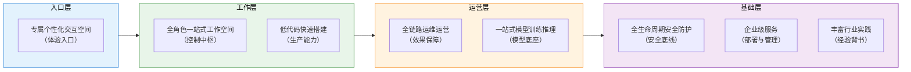
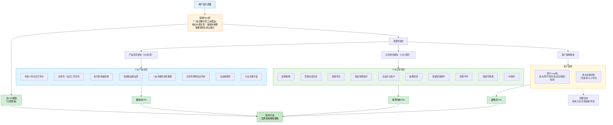

# 火山引擎HiAgent一站式数字员工派遣站完整学习笔记

> **产品介绍页**: https://www.volcengine.com/product/hiagent
> **产品定位**: 一站式数字员工派遣站——帮助企业低成本构建智能协同与办公能力，让协作更高效、业务更智能
> **核心客户**: 浙江大学、南开大学、爱玛、美宜佳、国信证券、南航数科

---

## 📋 目录导航

- [一、产品概述与定位](#一产品概述与定位)
- [二、八大产品优势深度解析](#二八大产品优势深度解析)
- [三、十大应用场景详解](#三十大应用场景详解)
- [四、技术架构与关键技术分析](#四技术架构与关键技术分析)
- [五、客户案例与落地实践](#五客户案例与落地实践)
- [六、网页信息架构与UX设计分析](#六网页信息架构与ux设计分析)
- [七、UX设计优劣势评估与改进建议](#七ux设计优劣势评估与改进建议)
- [八、可借鉴设计理念与实践经验总结](#八可借鉴设计理念与实践经验总结)
- [九、行业启示与趋势判断](#九行业启示与趋势判断)
- [十、专业术语表](#十专业术语表)
- [十一、相关资源链接](#十一相关资源链接)

---

## 一、产品概述与定位

### 1.1 产品定位："一站式数字员工派遣站"

HiAgent定位为**一站式数字员工派遣站**，其核心内涵包含三个维度：

| 维度 | 内涵说明 |
|------|----------|
| **一站式** | 覆盖智能体搭建、系统集成、运营运维、安全防护的全生命周期，企业无需在多个工具间切换，在单一平台内完成Agent从开发到落地运营的完整闭环 |
| **数字员工** | 以"数字员工"而非"工具"作为产品隐喻，强调Agent的角色化、拟人化、可协作属性，可像真实员工一样承担具体岗位职责 |
| **派遣站** | 平台作为数字员工的"派遣中心"，提供标准化的Agent供给、管理、调度能力，企业可按需"派遣"不同能力的数字员工到对应岗位 |

### 1.2 核心价值主张

HiAgent帮助企业**低成本构建智能协同与办公能力，让协作更高效、业务更智能**。价值主张可拆解为三大支柱：

| 价值支柱 | 核心内涵 | 支撑能力 |
|---------|---------|---------|
| **低成本** | 降低AI落地的技术门槛与成本投入 | 低代码搭建、200+行业样例、100+智能体模板、无缝集成MCP |
| **智能协同** | 实现人与Agent、Agent与系统、Agent与Agent之间的高效协作 | 全角色一站式工作空间、多源智能体纳管、企业系统打通、意图识别管理 |
| **业务智能** | 让AI能力真正渗透到业务场景产生价值 | 行业实践丰富、覆盖200+行业场景、落地Agent 500+款、端到端AI咨询服务 |

### 1.3 企业Agent落地痛点与解决方案

| 企业传统痛点 | HiAgent解决方案 |
|---------|----------------|
| Agent开发门槛高，需要专业AI团队 | 低代码快速搭建，200+行业样例、100+模板开箱即用 |
| 多系统集成复杂，数据孤岛严重 | 企业系统打通，一站式工作空间集成 |
| 模型管理困难，训练推理成本高 | 一站式模型训练和推理，支持三方模型接入、自有算力托管 |
| 缺乏运营运维手段，效果无法量化 | 全链路运维运营，快捷调试评测，效果直观可量化 |
| 数据安全合规风险大 | 全生命周期安全防护，数据不出域、审计可追溯、大模型防火墙 |
| 私有化部署需求难以满足 | 企业级服务，私有化部署+丰富配套管理功能 |
| 缺乏行业经验，AI转型无从下手 | 丰富行业实践，端到端AI咨询服务，500+落地Agent经验 |

### 1.4 产品命名隐喻分析："数字员工派遣站"

与其他Agent平台相比，HiAgent选择"数字员工派遣站"作为核心定位隐喻，这一选择具有深刻的商业逻辑：

| 隐喻维度 | 传统"Agent平台"隐喻 | HiAgent"数字员工派遣站"隐喻 |
|---------|-------------------|---------------------------|
| **用户认知** | 技术导向，需要理解"Agent"概念 | HR/业务导向，"员工"是企业熟悉的概念 |
| **价值感知** | 工具价值——"一个开发平台" | 人力价值——"可以直接上岗的员工" |
| **采购逻辑** | IT采购——技术选型、功能对比 | 人力采购——ROI计算、岗位替代/增强 |
| **使用预期** | 需要开发才能用 | 派遣即用，快速上岗 |
| **管理模式** | 系统管理思维 | 员工管理思维（培训、考核、调度） |

---

## 二、八大产品优势深度解析

### 2.1 优势一：专属个性化交互空间

**官方表述**：基于生成式画布，提供千人千面的交互入口，打造专属个性化交互空间

**核心功能解析**：

| 特性 | 功能说明 | 业务价值 |
|------|---------|---------|
| **生成式画布** | 采用画布式交互界面，而非传统表单/对话界面 | 可视化程度高，支持拖拽、连线等直观操作 |
| **千人千面交互入口** | 根据用户角色、使用习惯、业务场景动态呈现不同界面 | 降低学习成本，不同角色看到最相关的功能 |
| **专属空间** | 每个用户/团队拥有独立的工作空间 | 支持个性化配置、权限隔离、资产沉淀 |

**设计逻辑分析**：
- 生成式画布是当前低代码/无代码平台的主流交互范式，相比纯代码或纯表单更直观
- - "千人千面"解决了企业软件"一个界面给所有人用"的体验痛点
- 个性化空间满足企业级产品的多角色协作需求

**客观评估**：
- ✅ 方向正确：个性化是企业软件的重要体验趋势
- ⚠️ 信息有限：页面未说明具体如何实现"千人千面"，是基于角色还是基于行为
- ⚠️ 效果待验证：生成式画布在复杂场景下可能出现信息过载问题

---

### 2.2 优势二：全角色一站式工作空间

**官方表述**：集多源智能体纳管、企业系统打通、意图识别管理于一体，打造一站式智能体工作空间

**三大核心模块解析**：

| 模块 | 功能说明 | 解决的问题 |
|------|---------|-----------|
| **多源智能体纳管** | 统一管理来自不同来源、不同类型的智能体 | 解决企业内Agent碎片化、各部门自建Agent无法统一管控的问题 |
| **企业系统打通** | 与企业现有IT系统（OA、CRM、ERP等）集成打通 | 解决Agent"信息孤岛"问题，让Agent能访问企业真实业务数据 |
| **意图识别管理** | 统一管理用户意图理解、路由、分发 | 解决多Agent场景下的用户意图精准识别与路由问题 |

**价值深度分析**：

"一站式工作空间"本质上是HiAgent的**控制中枢**设计，这一设计回应了企业级Agent落地的核心挑战：

1. **Agent蔓延（Agent Sprawl）问题**：当企业各部门都开始搭建Agent，很快会出现数十上百个Agent，缺乏统一管理会导致重复建设、权限混乱、数据不一致
2. **系统集成难题**：Agent的价值不在于对话本身，而在于能调用企业系统完成实际任务，系统打通是Agent从"玩具"变"工具"的关键
3. **多Agent协作路由**：当有多个Agent时，需要准确识别用户意图并路由到正确的Agent，否则用户会困惑"该找哪个Agent"

**与竞品差异点**：很多Agent平台侧重"搭建单个Agent"，HiAgent强调"工作空间"概念，侧重Agent的统一管理与协同，这更贴合中大型企业的实际需求。

---

### 2.3 优势三：低代码快速搭建智能体

**官方表述**：200+行业样例，100+智能体模板，实现快速搭建，无缝集成MCP

**搭建效率矩阵**：

| 能力维度 | 具体内容 | 效率提升 |
|---------|---------|---------|
| **行业样例库** | 200+行业样例覆盖主流场景 | 提供行业最佳实践参考，避免从零开始 |
| **智能体模板** | 100+开箱即用的智能体模板 | 模板化复用，配置即可用，无需从零开发 |
| **低代码搭建** | 可视化搭建方式，降低编码要求 | 业务人员也能参与搭建，减少对技术团队依赖 |
| **MCP无缝集成** | 支持MCP（Model Context Protocol）协议 | 标准化接入工具与能力，生态丰富度有保障 |

**MCP集成的战略意义**：

MCP（Model Context Protocol）是当前Agent生态的重要开放协议，HiAgent"无缝集成MCP"意味着：

1. **生态开放**：不做封闭生态，可接入所有支持MCP的工具与服务
2. **避免锁定**：用户基于MCP开发的工具可以在不同平台间迁移
3. **快速扩展**：MCP生态的工具可快速接入HiAgent，平台能力随生态成长

**客观评估**：
- ✅ 200+样例、100+模板数量可观，体现了行业积累
- ✅ MCP支持是正确的生态战略选择
- ⚠️ 未说明低代码的具体能力边界：哪些能可视化配置，哪些仍需要编码

---

### 2.4 优势四：智能体和大模型全链路运维运营

**官方表述**：快捷调试评测，效果直观可量化

**全链路运维运营能力框架**：

```
┌─────────────────────────────────────────────────────────────┐
│                     全链路运维运营                           │
├─────────────┬─────────────┬─────────────┬───────────────────┤
│   调试阶段   │   评测阶段   │   上线阶段   │     运营阶段       │
├─────────────┼─────────────┼─────────────┼───────────────────┤
│ 快捷调试    │ 多维度评测  │ 监控告警    │ 效果数据看板       │
│ 实时日志    │ 效果对比    │ 性能监控    │ 用量统计分析       │
│ 问题定位    │ A/B测试     │ 异常追踪    │ 持续优化建议       │
│ 单步调试    │ 人工评估    │ 版本管理    │ 用户反馈收集       │
└─────────────┴─────────────┴─────────────┴───────────────────┘
```

**核心价值分析**：

运维运营能力是区分"玩具级Agent平台"和"企业级Agent平台"的关键标志：

1. **从"能用"到"好用"**：调试评测能力帮助开发者快速发现问题、优化效果
2. **从"黑盒"到"白盒"**：效果直观可量化，让企业能看到AI的实际价值
3. **从"上线即结束"到"持续运营"**：Agent不是一劳永逸的，需要持续监控、迭代、优化
4. **ROI可衡量**：用量统计、效果数据让企业能清晰计算AI投入的回报

**客观评估**：
- ✅ 运维运营是企业级产品的必备能力，HiAgent将其作为核心优势体现了对企业需求的理解
- ⚠️ 页面表述较为简略（"快捷调试评测，效果直观可量化"仅12字），未说明具体包含哪些运维能力

---

### 2.5 优势五：一站式模型训练和推理

**官方表述**：支持各类三方模型接入，可托管企业自有算力进行模型推理和训练

**模型能力矩阵**：

| 能力项 | 具体说明 | 适用场景 |
|-------|---------|---------|
| **三方模型接入** | 支持接入各类第三方大模型 | 企业已有模型投资、偏好特定模型能力 |
| **自有算力托管** | 可托管企业自有算力资源 | 对数据安全敏感、已有GPU硬件投资 |
| **模型推理** | 提供高可用推理服务 | 生产环境稳定运行 |
| **模型训练** | 支持模型训练/微调能力 | 基于企业私有数据优化模型效果 |

**技术架构选择分析**：

HiAgent在模型层采用**开放+混合**策略，这一策略有明显的商业考量：

1. **避免模型绑定**：不强制用户使用火山引擎自有模型，降低用户决策顾虑
2. **满足合规要求**：自有算力托管满足金融、政府等强监管行业的数据不出域要求
3. **保护现有投资**：企业已采购的模型、已投入的算力可以继续使用
4. **灵活性最大化**：企业可以根据场景选择最合适的模型（如代码场景选代码模型、创意场景选创意模型）

**与火山方舟的关系**：这一能力与火山方舟（火山引擎大模型服务平台）形成协同，HiAgent作为应用层平台，方舟作为模型层平台提供模型能力支撑。

---

### 2.6 优势六：全生命周期安全防护

**官方表述**：数据不出域、审计日志可追溯、大模型防火墙阻断攻击确保安全合规

**安全防护三层体系**：

| 安全层级 | 核心措施 | 防护目标 |
|---------|---------|---------|
| **数据安全层** | 数据不出域、私有化部署可选 | 防止企业敏感数据泄露 |
| **审计追溯层** | 完整审计日志、操作可追溯 | 满足合规审计要求，问题可回溯 |
| **攻击防护层** | 大模型防火墙、恶意攻击阻断 | 防范Prompt注入、数据泄露、内容生成风险 |

**企业AI安全痛点回应**：

安全是企业AI落地的头号顾虑，HiAgent的三大安全措施精准回应核心担忧：

| 企业安全担忧 | HiAgent应对措施 |
|------------|---------------|
| "我的核心业务数据会不会泄露？" | 数据不出域+私有化部署 |
| "出了问题能不能查到谁做了什么？" | 审计日志可追溯 |
| "AI会不会被人诱导做坏事？" | 大模型防火墙阻断攻击 |

**客观评估**：
- ✅ "数据不出域+审计可追溯+防火墙"是企业级AI安全的三板斧，组合完整
- ✅ "大模型防火墙"是有差异化的安全能力，不是所有平台都提供
- ⚠️ 未说明具体的安全认证资质（如等保三级、SOC2等）

---

### 2.7 优势七：企业级服务

**官方表述**：私有化部署，提供丰富的配套管理功能、灵活的开放集成能力

**企业级服务三大支柱**：

| 支柱 | 具体内容 | 价值说明 |
|-----|---------|---------|
| **私有化部署** | 支持将整个平台部署在企业自有环境 | 满足强监管行业、数据敏感型企业的合规要求 |
| **配套管理功能** | 组织架构、权限管理、资源管控、计量计费等 | 满足企业IT治理需求，可纳入企业现有管理体系 |
| **开放集成能力** | 提供API、SDK、标准协议，方便与现有系统集成 | 不做"孤岛"，可融入企业现有IT架构 |

**私有化部署的商业逻辑**：

私有化部署是区分大客户与中小客户的关键分水岭：
- **SaaS模式**：适合中小企业，快速上线、成本低、运维简单
- **私有化模式**：适合政府、金融、大型企业，数据可控、合规性高、可定制

HiAgent同时支持两种模式，覆盖了从中小企业到超大型客户的完整客户 spectrum。

---

### 2.8 优势八：行业实践丰富，更懂AI转型

**官方表述**：提供端到端AI咨询服务，覆盖200+行业场景，落地Agent 500+款

**行业服务能力量化**：

| 指标 | 数值 | 说明 |
|-----|------|------|
| 行业场景覆盖 | 200+ | 场景覆盖广度 |
| 落地Agent数量 | 500+款 | 项目落地经验 |
| 服务模式 | 端到端AI咨询 | 从规划到落地的全流程服务 |

**"咨询+产品"模式分析**：

HiAgent不是只卖产品，而是"咨询+产品"的组合模式，这对AI转型期的企业至关重要：

1. **很多企业不知道怎么用AI**：需要咨询服务帮助识别场景、规划路径
2. **AI落地不是买个工具就行**：需要组织变革、流程再造、能力建设
3. **500+落地经验是宝贵资产**：踩过的坑、验证过的模式可以复用给新客户
4. **咨询带动产品销售**：通过咨询建立信任，自然过渡到产品采购

**标杆客户背书**：浙江大学、南开大学、爱玛、美宜佳、国信证券、南航数科，覆盖了教育、零售、证券、航空等多个行业，客户质量较高。

---

### 2.9 八大优势协同关系

八大优势不是孤立存在的，而是形成了完整的企业级Agent平台价值闭环：



---

## 三、十大应用场景详解

HiAgent展示了10个典型应用场景，覆盖客服、营销、医疗、金融、办公、销售、教育、HR等多个领域。

### 3.1 场景一：智能客服

**场景描述**：智能回答常见问题，涵盖产品推荐、订单跟踪、投诉处理等场景，提升产品全链路服务体验

| 维度 | 详细说明 |
|-----|---------|
| **适用对象** | 客服部门、客户服务中心、电商平台、在线服务企业 |
| **核心能力** | 常见问题自动应答、产品智能推荐、订单状态查询跟踪、投诉自动受理与分流 |
| **业务价值** | 降低人工客服成本、7×24小时服务、响应速度提升、标准化服务质量、释放人工客服处理复杂问题 |
| **落地方式** | 基于客服知识库训练、对接订单/CRM系统、多轮对话能力、情绪识别与人工转接 |

---

### 3.2 场景二：营销文案生成

**场景描述**：深度分析产品特性提炼卖点，快速生成高质量营销文案，助力企业高效推广与知名度提升

| 维度 | 详细说明 |
|-----|---------|
| **适用对象** | 市场部、品牌部、内容运营、电商运营 |
| **核心能力** | 产品卖点自动提炼、多风格文案生成、多渠道适配（朋友圈/公众号/短视频脚本/电商详情页）、A/B测试版本生成 |
| **业务价值** | 文案生产效率大幅提升、内容质量标准化、快速响应营销热点、降低对资深文案的依赖 |
| **落地方式** | 接入产品信息库、营销知识库、品牌调性配置、多模板选择、人工审核优化流程 |

---

### 3.3 场景三：智能导诊

**场景描述**：通过分析患者资料与症状，提供个性化导诊体验，提升患者就医效率

| 维度 | 详细说明 |
|-----|---------|
| **适用对象** | 医院、医疗机构、互联网医疗平台、健康管理机构 |
| **核心能力** | 症状智能分析、科室精准推荐、就医流程指导、预问诊信息收集、健康科普解答 |
| **业务价值** | 减少患者排队等待时间、提升分诊准确率、减轻导诊台压力、优化就医体验、收集预问诊信息提高问诊效率 |
| **落地方式** | 医疗知识库训练、科室信息对接、症状-科室映射模型、隐私保护合规、人工兜底机制 |

**风险提示**：医疗场景属于高风险场景，必须强调"导诊而非诊断"，明确告知不能替代医生诊断，必须有完善的人工转接和免责机制。

---

### 3.4 场景四：基金投顾助手

**场景描述**：面向机构投顾/银行理财经理/个人投资者，提供基金经理业绩分析、配置推荐等投资建议

| 维度 | 详细说明 |
|-----|---------|
| **适用对象** | 券商、银行、基金公司、财富管理机构、个人投资者 |
| **核心能力** | 基金经理业绩分析、基金产品对比、资产配置建议、市场信息汇总、持仓分析诊断 |
| **业务价值** | 提升投顾服务效率、标准化服务质量、覆盖更多长尾客户、降低服务成本、辅助投顾决策 |
| **落地方式** | 金融数据接入、合规话术管控、适当性管理、风险提示强制展示、投资建议留痕审计 |

**风险提示**：金融场景强监管，必须满足适当性管理要求，所有建议需有风险提示，操作全程可审计，避免承诺收益。

---

### 3.5 场景五：企业办公助手

**场景描述**：不仅能够记录会议内容、整理会议纪要，还能准确审查合同条款，降低企业交易风险

| 维度 | 详细说明 |
|-----|---------|
| **适用对象** | 全体员工、行政部门、法务部门、管理层 |
| **核心能力** | 会议实时记录、会议纪要自动整理、待办事项提取与跟进、合同条款智能审查、风险点预警、文档智能问答 |
| **业务价值** | 会议效率提升、减少人工记录成本、合同审查效率提升、法律风险前置预警、知识沉淀与复用 |
| **落地方式** | 对接企业OA/会议系统、合同管理系统、企业知识库、权限精细管控、敏感信息脱敏 |

---

### 3.6 场景六：销售陪练

**场景描述**：模拟真实客户互动的AI陪练，通过话术训练、场景模拟帮助销售人员快速提升沟通与成交

| 维度 | 详细说明 |
|-----|---------|
| **适用对象** | 销售团队、销售培训部门、新入职销售、销售管理者 |
| **核心能力** | 真实客户场景模拟、AI角色扮演客户、实时话术反馈、异议处理训练、销售技巧辅导、训练效果评估 |
| **业务价值** | 缩短新销售成长周期、降低培训成本、可反复练习无压力、标准化销售方法论、训练效果可量化 |
| **落地方式** | 销售话术库训练、优秀销售对话案例学习、多场景客户画像、实时反馈机制、训练数据看板 |

---

### 3.7 场景七：智能营销助手

**场景描述**：涵盖营销素材生成、产品卖点提炼、客群精准匹配等

| 维度 | 详细说明 |
|-----|---------|
| **适用对象** | 营销部门、增长团队、用户运营、数据分析师 |
| **核心能力** | 营销素材批量生成、产品卖点智能提炼、客群画像分析、精准营销策略推荐、营销话术生成、活动方案策划 |
| **业务价值** | 营销效率提升、营销策略数据驱动、个性化营销落地、A/B测试创意快速生成、营销ROI提升 |
| **落地方式** | 对接用户数据平台(CDP)、营销自动化工具、产品库、历史营销数据、效果数据回流 |

---

### 3.8 场景八：智慧学伴

**场景描述**：面向学生的个性化学习伙伴，通过答疑解惑、推荐学习内容等方式自适应提升学习效率

| 维度 | 详细说明 |
|-----|---------|
| **适用对象** | 学生（K12/高等教育/职业教育）、教师、教育机构 |
| **核心能力** | 智能答疑解惑、知识点讲解、个性化学习路径推荐、作业辅导、学习进度跟踪、薄弱点诊断 |
| **业务价值** | 个性化学习体验、提升学习效率、减轻教师负担、教育资源公平化、学习兴趣激发 |
| **落地方式** | 学科知识库建设、教材内容对接、学习进度追踪、自适应学习算法、内容安全过滤、教师后台管理 |

---

### 3.9 场景九：校园百事通

**场景描述**：掌握学校办学、教务信息以及后勤支撑服务概况，全方位提升校内师生工作学习生活体验

| 维度 | 详细说明 |
|-----|---------|
| **适用对象** | 高校、K12学校、师生群体、行政后勤部门 |
| **核心能力** | 教务信息查询（课表/成绩/选课）、办学信息咨询、后勤服务指引（报修/食堂/校车）、校园导航、办事流程指引、新生入学指导 |
| **业务价值** | 提升师生服务体验、减少行政咨询工作量、7×24小时服务、信息传递准确高效、校园服务数字化 |
| **落地方式** | 对接教务系统、后勤系统、校园知识库、多端接入（公众号/小程序/APP）、多轮对话能力 |

**标杆案例**：浙江大学"浙大先生"大模型应用体系，7天落地，服务5万+在校师生。

---

### 3.10 场景十：HR助手

**场景描述**：人力资源管理的AI帮手，自动化处理招聘、考勤、员工咨询等事务性工作，优化HR流程

| 维度 | 详细说明 |
|-----|---------|
| **适用对象** | HR部门、招聘团队、员工关系、全体员工 |
| **核心能力** | 招聘简历筛选与初筛、考勤数据处理、员工政策咨询、入职离职流程指引、培训信息问答、薪酬福利查询 |
| **业务价值** | 提升HR事务处理效率、减少重复性咨询工作、提升员工服务体验、缩短招聘周期、HR聚焦高价值工作 |
| **落地方式** | 对接HR系统（招聘/考勤/薪酬）、人事政策知识库、权限管控（薪酬等敏感信息）、多轮对话引导流程 |

---

### 3.11 场景-能力映射关系矩阵

| 应用场景 | 核心痛点 | 关键能力依赖 | 价值量化指标 |
|---------|---------|-------------|-------------|
| **智能客服** | 人工成本高、响应慢 | 知识库、多轮对话、系统对接 | 客服人力节省、问题解决率、响应时长 |
| **营销文案生成** | 产能不足、质量不稳定 | 产品理解、文案生成、风格控制 | 文案产出量、审核通过率、转化率 |
| **智能导诊** | 分诊效率低、患者体验差 | 医疗知识、症状识别、科室匹配 | 分诊准确率、等待时间、满意度 |
| **基金投顾助手** | 服务覆盖不足、效率低 | 金融数据、合规管控、分析能力 | 服务客户数、响应速度、合规率 |
| **企业办公助手** | 会议效率低、合同风险高 | 语音识别、文档理解、风险识别 | 会议时间节省、合同审查效率、风险拦截 |
| **销售陪练** | 培训成本高、成长慢 | 角色扮演、话术反馈、场景模拟 | 新人上手周期、培训成本、成交率提升 |
| **智能营销助手** | 营销效率低、精准度差 | 用户画像、策略生成、素材生产 | 营销ROI、转化率、素材产出量 |
| **智慧学伴** | 个性化不足、资源不均 | 知识讲解、学习推荐、自适应 | 学习效率提升、成绩提升、学习时长 |
| **校园百事通** | 咨询量大、信息分散 | 多系统对接、知识库、多端接入 | 咨询量承载、问题解决率、师生满意度 |
| **HR助手** | 事务性工作多、效率低 | 简历筛选、政策问答、流程自动化 | HR效率提升、招聘周期、员工满意度 |

---

## 四、技术架构与关键技术分析

> **注**：基于产品页面公开信息分析，不涉及内部技术实现细节。

### 4.1 平台整体架构推断

基于八大产品优势描述，HiAgent的技术架构可推断为分层设计：

```
┌─────────────────────────────────────────────────────────────────────┐
│                        【交互层】个性化交互空间                        │
│       （生成式画布、千人千面入口、角色化工作台、多端适配）                │
├─────────────────────────────────────────────────────────────────────┤
│                      【工作空间层】控制中枢                            │
│  ┌──────────────┐  ┌──────────────┐  ┌──────────────┐               │
│  │ 多源Agent纳管 │  │ 企业系统打通  │  │ 意图识别路由  │               │
│  └──────────────┘  └──────────────┘  └──────────────┘               │
├─────────────────────────────────────────────────────────────────────┤
│                      【搭建层】低代码生产                              │
│  （可视化编排、200+行业样例、100+模板、MCP集成、插件市场）              │
├─────────────────────────────────────────────────────────────────────┤
│                      【运营层】全链路运维                              │
│  ┌──────────────┐  ┌──────────────┐  ┌──────────────┐               │
│  │   调试工具    │  │   评测体系    │  │  监控运营看板 │               │
│  └──────────────┘  └──────────────┘  └──────────────┘               │
├─────────────────────────────────────────────────────────────────────┤
│                      【模型层】训练推理                                │
│  ┌──────────────┐  ┌──────────────┐  ┌──────────────┐               │
│  │ 三方模型接入  │  │ 自有算力托管  │  │ 训练/微调    │               │
│  └──────────────┘  └──────────────┘  └──────────────┘               │
├─────────────────────────────────────────────────────────────────────┤
│                      【安全层】全生命周期防护                          │
│  （数据不出域、审计日志、大模型防火墙、权限管控、内容安全）              │
├─────────────────────────────────────────────────────────────────────┤
│                      【基础设施层】企业级服务                           │
│  （私有化部署、多租户管理、开放API、计量计费、高可用）                  │
└─────────────────────────────────────────────────────────────────────┘
```

### 4.2 关键技术模块分析

#### 4.2.1 生成式画布交互技术

**技术定位**：HiAgent的核心交互范式创新

| 技术要点 | 说明 |
|---------|------|
| **画布可视化** | 采用节点-连线式的可视化编排界面，类似Figma/Flowchart的交互方式 |
| **生成式交互** | AI辅助生成编排逻辑，而非纯手动拖拽 |
| **响应式布局** | 画布内容根据用户角色、场景动态调整 |
| **状态管理** | 复杂画布状态的保存、回滚、协作能力 |

**技术挑战**：
- 画布性能：节点数量多时的渲染性能
- 协作能力：多人同时编辑的冲突处理
- 生成准确性：AI生成的编排逻辑是否合理可用

---

#### 4.2.2 MCP（Model Context Protocol）集成

**技术定位**：生态开放的核心战略选择

MCP是由Anthropic提出的开放协议，旨在标准化大模型与外部工具/数据源的连接方式。

| MCP集成价值 | 具体说明 |
|------------|---------|
| **生态复用** | 所有MCP兼容工具可直接接入HiAgent，无需重复开发 |
| **避免锁定** | 用户开发的MCP工具可在不同平台间迁移 |
| **标准化** | 工具接入有统一标准，降低集成成本 |
| **社区红利** | 享受MCP生态快速增长的红利 |

---

#### 4.2.3 大模型防火墙

**技术定位**：企业级安全的差异化能力

大模型防火墙是针对AI Agent特有的安全风险设计的防护系统，主要防范：

| 威胁类型 | 防护机制 |
|---------|---------|
| **Prompt注入攻击** | 检测和拦截恶意提示词注入，防止Agent被"越狱" |
| **数据泄露** | 检测输出中的敏感数据（手机号、身份证、商业机密等）并阻断 |
| **有害内容生成** | 拦截违法违规、歧视、暴力等有害内容输出 |
| **工具滥用** | 监控和限制Agent对工具的危险调用（如删除数据、转账等） |
| **越权访问** | 确保Agent只能访问授权范围内的数据和功能 |

---

#### 4.2.4 多源智能体纳管

**技术定位**：企业级Agent管理的核心能力

| 技术能力 | 说明 |
|---------|------|
| **异构Agent接入** | 支持不同来源、不同框架开发的Agent统一接入管理 |
| **统一身份认证** | 所有Agent纳入统一的权限和身份体系 |
| **路由调度** | 根据用户意图智能路由到最合适的Agent |
| **状态监控** | 统一监控所有Agent的运行状态、性能、错误率 |
| **版本管理** | Agent版本的发布、回滚、灰度能力 |

---

#### 4.2.5 意图识别与路由

**技术定位**：多Agent协作的"中枢神经"

当工作空间中有多个Agent时，如何准确理解用户意图并路由到正确的Agent是核心挑战：

| 技术层级 | 能力 |
|---------|------|
| **第一层：意图分类** | 将用户请求分类到对应的Agent领域 |
| **第二层：上下文理解** | 结合对话历史理解真实意图 |
| **第三层：澄清交互** | 意图模糊时主动向用户澄清 |
| **第四层：多Agent协作** | 复杂任务需要多个Agent协作完成 |
| **第五层：兜底处理** | 无法识别时转人工或给出引导 |

---

### 4.3 技术选型策略分析

HiAgent在技术选型上体现了"开放务实"的策略：

| 技术选型 | 选择方向 | 商业逻辑 |
|---------|---------|---------|
| **模型层** | 开放接入三方模型+支持自有算力 | 不绑定模型，最大化用户选择空间，降低决策门槛 |
| **工具协议** | 支持MCP开放协议 | 拥抱开放生态，避免封闭花园 |
| **部署模式** | SaaS+私有化双支持 | 覆盖从中小客户到超大型客户的全 spectrum |
| **交互方式** | 低代码+生成式画布 | 降低使用门槛，同时保留灵活性 |
| **安全设计** | 数据不出域+审计+防火墙 | 直击企业安全顾虑 |

---

## 五、客户案例与落地实践

### 5.1 标杆客户一览

| 客户名称 | 所属行业 | 客户类型 | 场景推断 |
|---------|---------|---------|---------|
| **浙江大学** | 高等教育 | 985高校 | 校园百事通、智慧学伴、教学辅助 |
| **南开大学** | 高等教育 | 985高校 | 校园服务、科研辅助、智慧校园 |
| **爱玛** | 制造业（电动车） | 大型民企 | 智能客服、营销助手、办公助手 |
| **美宜佳** | 零售（便利店） | 连锁零售 | 门店服务、智能客服、供应链助手 |
| **国信证券** | 金融（证券） | 头部券商 | 基金投顾助手、客服、合规风控 |
| **南航数科** | 航空/科技 | 航司科技子公司 | 智能客服、旅客服务、办公助手 |

客户覆盖**教育、制造、零售、金融、航空**五大行业，包含高校、大型民企、国企、金融机构等多种类型，体现了HiAgent的跨行业适配能力。

### 5.2 浙江大学案例深度解析

**案例概述**：浙江大学携手火山引擎，依托HiAgent平台，7天时间高效落地"浙大先生"大模型应用体系，为5万+在校师生打造了更智能化的教学教务、科研创新、校园生活等全新体验。

**关键成功要素分析**：

| 维度 | 具体表现 | 启示 |
|-----|---------|------|
| **落地速度** | 7天完成从0到1的落地 | 平台成熟度高、模板/样例丰富、实施团队经验丰富 |
| **覆盖规模** | 5万+在校师生 | 平台具备高并发支撑能力、可扩展性好 |
| **场景广度** | 教学教务、科研创新、校园生活多场景 | 平台通用性强、可适配多种场景 |
| **合作模式** | "携手火山引擎"——深度合作而非单纯采购 | 大客户需要深度服务与联合创新 |

**"浙大先生"可能包含的应用**：
- 校园百事通：教务、后勤、办事流程咨询
- 智慧学伴：学习答疑、知识讲解
- 科研助手：文献检索、论文辅助
- 办公助手：会议纪要、公文写作
- 新生助手：入学指引、校园导航

**7天落地的方法论启示**：
1. 不是从零定制，而是基于平台能力快速配置
2. 优先落地高频刚需场景（咨询、问答类）
3. 高校场景相对标准化，有模板可复用
4. 需要校方各部门配合（教务、后勤、IT等）

---

## 六、网页信息架构与UX设计分析

### 6.1 页面信息架构

HiAgent产品页面采用经典的企业SaaS产品落地页结构，信息组织遵循营销转化逻辑：



### 6.2 AIDA转化模型分析

页面内容组织严格遵循AIDA营销转化漏斗模型：

| AIDA阶段 | 对应页面模块 | 核心策略 |
|---------|------------|---------|
| **Attention（注意）** | 首屏Hero区 | 主标题「一站式数字员工派遣站」+ 副标题「帮助企业低成本构建智能协同与办公能力」，用"数字员工"这一通俗隐喻快速抓住注意力 |
| **Interest（兴趣）** | 八大产品优势 | 系统展示平台能力，从体验、搭建、运营、模型、安全、服务、经验多个维度建立产品认知 |
| **Desire（欲望）** | 十大应用场景 | 通过丰富的场景覆盖让不同行业客户都能找到"这个适合我"的代入感 |
| **Trust（信任）** | 客户案例 | 展示6家高质量标杆客户，浙江大学案例用"7天落地、5万+师生"等具体数据增强信任 |
| **Action（行动）** | 多触点CTA | 页面多处设置"立即咨询"按钮，引导用户转化 |

### 6.3 导航与入口设计

| 导航区域 | 包含内容 | 设计特点 |
|---------|---------|---------|
| **顶部产品导航** | 节省计划、AgentKit、火山方舟、豆包语音、API网关等 | 火山引擎产品体系导流，体现平台协同 |
| **页面内锚点导航** | （从提取内容看锚点导航较少） | 页面相对简洁，以纵向滚动浏览为主 |
| **页脚导航** | 售前客服、售后客服、购买咨询、文档中心、关于我们 | 标准企业网站页脚，提供服务入口 |
| **联系方式** | service@volcengine.com、marketing@volcengine.com、400电话 | 多种联系方式，方便不同偏好客户 |

### 6.4 CTA设计分析

页面CTA（Call to Action）设计特点：

| CTA维度 | 具体表现 | 分析 |
|---------|---------|------|
| **CTA文案** | 「立即咨询」 | B端大宗采购产品用"咨询"而非"免费试用"是合理选择——企业级产品通常需要销售介入、方案定制 |
| **CTA位置** | 页面多个位置设置 | 多触点布局，用户在任何决策点都能方便转化 |
| **转化路径** | 点击→联系销售→方案沟通→签约 | 符合企业级软件销售流程，不是自助式SaaS转化 |

---

## 七、UX设计优劣势评估与改进建议

### 7.1 UX设计优势

#### 优势1：产品隐喻选择精准——"数字员工派遣站"

"数字员工派遣站"这一隐喻选择非常成功：
- **降低认知门槛**：企业不需要理解"Agent"、"大模型"这些技术概念，用"员工"这一熟悉概念就能理解产品价值
- **价值感知清晰**："派遣员工"直接对应人力成本，ROI计算逻辑清晰
- **差异化定位**：与其他"Agent开发平台"形成明显区隔，更贴近业务视角
- **使用预期明确**："派遣即用"暗示产品开箱即用、快速上岗

---

#### 优势2：价值主张简洁有力——"低成本构建智能协同与办公能力"

- 不说技术术语，直接说业务价值（低成本、智能协同、业务智能）
- 一句话讲清楚"给谁用、解决什么问题、带来什么价值"
- 符合B端产品价值表达"三字诀"：说人话、说价值、说数字

---

#### 优势3：场景覆盖广泛且贴近业务

- 10个场景覆盖客服、营销、金融、医疗、教育、办公、HR、销售等多个领域
- 每个场景描述都是业务语言而非技术语言
- 不同行业客户都能快速找到对应场景，代入感强

---

#### 优势4：客户案例选择有说服力

- 客户质量高：浙大、南开是知名高校，国信证券是头部券商，爱玛、美宜佳是各行业知名企业
- 案例数据具体：浙江大学案例用"7天落地"、"5万+师生"等具体数字，不是空泛的"某某企业选择了我们"
- 行业分布均衡：覆盖教育、制造、零售、金融、航空多个行业

---

#### 优势5：安全优势表述直击痛点

- 
- "数据不出域、审计日志可追溯、大模型防火墙阻断攻击"三个点，每个点都回应一个具体安全顾虑
- 没有堆砌安全术语，而是用企业能听懂的语言讲安全价值

---

### 7.2 UX设计可改进点

基于提取的页面内容，从客观中立角度提出以下改进建议：

| 优先级 | 问题类型 | 具体问题 | 改进建议 |
|--------|---------|---------|---------|
| 🔴 高 | 信息完整性 | 产品功能模块展示不足，页面主要讲优势和场景，缺乏核心功能/能力的可视化展示 | 增加"产品功能"模块，用截图/架构图/流程图展示工作台、画布、编排等核心界面；增加产品演示视频或交互式Demo |
| 🔴 高 | 数据支撑 | 缺乏量化效果数据和ROI数据 | 补充"效率提升X%"、"成本降低Y%"、"准确率Z%"等量化数据；增加不同场景的ROI计算器或案例数据 |
| 🔴 高 | 定价信息 | 完全没有定价或套餐信息，用户无法快速判断成本 | 增加定价页面入口或简单的套餐说明；即使是"联系商务询价"也应该有价格区间提示 |
| 🟠 中高 | 转化路径 | CTA只有"立即咨询"一种，缺乏自助服务入口 | 增加"免费试用"、"查看Demo"、"阅读文档"等轻量转化入口；区分不同决策阶段的用户路径 |
| 🟠 中高 | 差异化对比 | 没有说明与竞品的差异，也没有说明与火山引擎其他产品（扣子、方舟）的关系 | 增加"常见问题"模块说明与同类产品的区别；明确HiAgent在火山引擎AI产品矩阵中的定位 |
| 🟠 中高 | 可信度背书 | 除了Logo和浙大案例，缺乏更多深度案例、第三方评价、资质认证 | 增加2-3个深度案例（金融、制造、零售各一个）；展示安全合规资质（等保、SOC2等）；增加客户证言视频/引言 |
| 🟡 中 | 内容平衡 | 8大优势的描述篇幅过于简略，每个优势只有一句话，信息密度不足 | 每个优势补充核心功能点、客户价值、差异化说明；用图标+短句+详细说明的三层结构 |
| 🟡 中 | 导航结构 | 页面内锚点导航不足，长页面浏览不便 | 增加吸顶锚点导航（产品优势、应用场景、客户案例、立即咨询）；增加回到顶部按钮 |
| 🟡 中 | 风险提示 | 高风险场景（医疗、金融）未做风险提示说明 | 医疗、金融等场景增加明确的免责声明和合规说明；强调"辅助决策而非替代人工" |
| 🟢 低 | 视觉呈现 | 从提取内容无法判断视觉设计，但可以建议增强可视化 | 增加产品界面截图、流程图、架构图；用信息图展示8大优势和10大场景的关系 |

---

## 八、可借鉴设计理念与实践经验总结

### 8.1 七大可复用产品设计模式

#### 模式1：业务隐喻优先——用业务语言重新包装技术概念

**模式描述**：不直接使用技术术语（如Agent、大模型、编排），而是用目标用户熟悉的业务概念（如数字员工、派遣站）重新包装产品，大幅降低认知门槛。

**关键要素**：
1. **找到用户熟悉的对标事物**：HiAgent找到"员工/派遣站"作为对标
2. **隐喻要能承载核心价值**："员工"对应"完成工作"、"派遣"对应"灵活供给"
3. **隐喻贯穿整个产品体验**：从定位、功能到运营都用统一隐喻
4. **不要强行创造新概念**：用用户已经理解的概念，而不是教育用户理解新概念

**HiAgent实践**：将"Agent平台"重新包装为"数字员工派遣站"，将"Agent编排"转化为"员工派遣与调度"，将"多Agent协作"转化为"团队协作"。

**可借鉴场景**：所有To B产品都应该思考——我的产品在用户业务语言中对应什么？而不是用户需要学习我的技术语言。

---

#### 模式2：平台分层架构——从搭建到运营的全生命周期覆盖

**模式描述**：企业级Agent平台不能只解决"搭建"问题，必须覆盖交互→工作空间→搭建→运营→模型→安全→基础设施的完整分层，每层解决特定问题，形成闭环。

**设计原则**：
1. **每层职责清晰**：不把所有功能堆在一起
2. **下层为上层提供支撑**：安全是基础、模型是底座、运营是保障
3. **企业级能力下沉**：安全、管理、部署等共性能力放在基础层
4. **用户接触点在上层**：用户主要通过交互层、工作空间层使用产品

**HiAgent实践**：7层架构设计，从个性化交互到基础设施层层递进，不是只做"Agent搭建"单点工具。

---

#### 模式3：开放模型策略——不绑定模型，最大化用户选择自由

**模式描述**：在模型层不做封闭绑定，而是支持三方模型接入、自有算力托管，让用户保留模型选择的灵活性，降低决策顾虑。

**设计要点**：
1. **不把模型作为竞争壁垒**（至少在平台层不这样）
2. **把竞争壁垒转移到上层**：工作流、场景、体验、生态、服务
3. **满足合规需求**：自有算力托管满足强监管行业要求
4. **保护用户投资**：用户已有的模型、算力投资可以继续使用

**HiAgent实践**：支持各类三方模型接入+自有算力托管，不强制使用火山引擎自有模型。

---

#### 模式4：安全三板斧——数据安全+审计追溯+攻击防护

**模式描述**：企业级AI安全必须有组合拳，单一安全措施无法建立信任，"数据不出域+审计可追溯+大模型防火墙"三板斧组合是基本配置。

**三板斧逻辑**：
| 安全层级 | 措施 | 解决的心理顾虑 |
|---------|------|--------------|
| **事前预防** | 数据不出域、私有化部署 | "我的数据不会泄露" |
| **事中可控** | 大模型防火墙、权限管控 | "AI不会被人做坏事" |
| **事后可查** | 审计日志、操作追溯 | "出了问题能查到原因" |

**HiAgent实践**：三大安全措施精准回应企业三大安全顾虑，形成完整防护体系。

---

#### 模式5：咨询+产品双轮驱动——不只是卖工具，更是卖解决方案

**模式描述**：企业AI转型期，客户需要的不只是一个工具，更是"怎么用AI"的方法论和路径指导，"咨询服务+产品平台"双轮驱动能大幅提升转化率和客户成功。

**双轮价值**：
1. **咨询建立信任**：先通过咨询理解客户需求、展现专业能力
2. **咨询带动产品**：咨询后自然过渡到产品落地
3. **经验沉淀产品**：咨询中积累的场景、方案沉淀为产品模板/样例
4. **产品放大咨询**：产品平台让咨询方案可以快速规模化落地

**HiAgent实践**：端到端AI咨询服务+200+行业场景+500+落地Agent，形成"经验→产品→更多经验"的正向循环。

---

#### 模式6：多触点CTA布局——在用户决策路径的每个点都设置转化入口

**模式描述**：用户在页面浏览的不同阶段都可能产生转化意愿，需要在每个关键模块后都设置CTA，而不是只在页面底部放一个按钮。

**布局原则**：
1. **首屏主CTA**：抓住最高意向用户
2. **每个模块后CTA**：看完优势/场景/案例后产生兴趣的用户
3. **底部CTA区**：浏览完整页后决策的用户
4. **CTA文案与上下文匹配**：不同位置CTA可以有差异（如场景后是"了解XX场景方案"）

**HiAgent实践**：页面多个位置设置"立即咨询"按钮，形成多触点转化网络。

---

#### 模式7：客户矩阵背书——用高质量+多行业+具体数据的案例建立信任

**模式描述**：客户案例不是简单放Logo，需要"高质量客户+多行业覆盖+具体数据"组合，才能真正建立信任。

**案例三要素**：
1. **客户质量**：选择行业内有知名度、有代表性的标杆客户
2. **行业覆盖**：覆盖多个目标行业，让不同行业客户都能找到对标
3. **具体数据**：用数字说话（7天落地、5万+用户、成本降低X%），而不是空泛好评

**HiAgent实践**：6家标杆客户覆盖5大行业，浙江大学案例用"7天落地、5万+师生"具体数据，可信度高。

---

### 8.2 对Agent平台设计的七条具体启示

| 启示编号 | 启示内容 |
|---------|---------|
| **启示1** | **先想隐喻，再做功能**：产品定位第一步不是想功能列表，而是找到一个精准的业务隐喻，这决定了用户如何理解你的产品 |
| **启示2** | **做全生命周期，不做点工具**：企业级平台必须覆盖从搭建到运营到安全的完整链路，单点功能很容易被替代 |
| **启示3** | **开放生态，不要封闭**：模型、工具、协议尽量开放，把壁垒建在上层（场景、体验、服务）而非底层 |
| **启示4** | **安全不是可选项，是必选项**：安全能力要前置、要组合、要用客户听得懂的语言表达 |
| **启示5** | **服务即产品，产品即服务**：企业客户需要的不只是工具，配套的咨询、实施、运营服务同样重要 |
| **启示6** | **B端产品要讲ROI**：所有功能都要能对应到"省多少钱"、"提多少效"、"降多少风险"，用数字说话 |
| **启示7** | **客户案例是最好的销售**：一个带数据的深度案例胜过10页功能介绍，案例要选得准、讲得实 |

---

## 九、行业启示与趋势判断

### 9.1 五大行业趋势判断

#### 趋势1：从"Agent开发平台"到"数字员工管理平台"——概念演进加速

Agent平台正在经历概念和定位的演进：

| 阶段 | 定位 | 核心卖点 | 用户认知 |
|-----|------|---------|---------|
| **2023年** | 大模型应用开发框架 | 快速搭建、Prompt编排 | 技术开发者、AI团队 |
| **2024年** | Agent开发平台 | 工作流编排、工具调用、RAG | 开发团队、IT部门 |
| **2025年** | 数字员工/智能体管理平台 | 全生命周期管理、多Agent协作、企业级能力 | 业务部门、管理层、HR |
| **2026年+** | 企业智能协作中枢 | 人机协同、组织智能化、业务流程重塑 | CEO、全员 |

> **启示**：HiAgent选择"数字员工派遣站"作为定位，正是踩中了这一演进趋势——从技术工具向业务基础设施进化。谁能率先完成从"开发平台"到"员工平台"的认知跃迁，谁就能抢占更大的市场。

---

#### 趋势2：企业AI竞争从"模型能力"转向"落地能力"

2023年大家比"谁的模型参数大、谁的榜单分数高"，2025年企业客户更关心：
- 能不能快速上线？
- 能不能对接我的系统？
- 能不能保证数据安全？
- 有没有行业案例？
- 能不能持续运营？
- 投入产出比怎么样？

**落地能力四大支柱**：
1. **产品易用性**：低代码、模板化，快速上线
2. **系统集成性**：能对接企业现有IT系统
3. **安全合规性**：满足企业安全和监管要求
4. **服务专业性**：有行业经验和咨询能力

> **启示**：模型能力正在commoditize，真正的护城河在于对企业场景的理解、落地方法论、服务能力、生态整合能力。HiAgent的八大优势中有七个是在讲落地相关能力，只有一个讲模型，这一比例体现了正确的战略方向。

---

#### 趋势3：多Agent协作成为标配，"Agent OS"形态初现

单一对话Agent的价值有限，企业真正需要的是多个专业Agent协同工作，类似一个公司有不同岗位的员工：
- 客服Agent处理咨询
- 销售Agent辅助成交
- HR负责人力
- 法务审合同
- 财务理数据
- ...

这就需要一个"Agent操作系统（Agent OS）"来：
1. 统一管理所有Agent
2. 智能路由用户请求
3. 协调多Agent协作
4. 统一权限和安全
5. 监控和运营所有Agent

> **启示**：HiAgent的"全角色一站式工作空间+多源智能体纳管+意图识别管理"正是Agent OS的雏形。未来Agent平台的竞争是"操作系统"级别的竞争，不是单个应用的竞争。

---

#### 趋势4：开放协议决定生态位，MCP成为事实标准

2025年MCP（Model Context Protocol）正在快速成为Agent工具接入的事实标准，这对平台格局影响深远：

| 生态策略 | 结果 |
|---------|------|
| **封闭私有协议** | 生态建设成本高、第三方接入意愿低、容易被开放生态边缘化 |
| **支持MCP开放协议** | 快速接入整个MCP生态工具、降低开发者迁移成本、享受社区增长红利 |

> **启示**：HiAgent"无缝集成MCP"是正确的战略选择。在快速发展的早期市场，开放比控制更重要——先把生态做大，再考虑差异化。

---

#### 趋势5：私有化部署市场占比将持续提升

随着AI从边缘业务走向核心业务，企业对数据安全、可控性的要求越来越高，私有化部署（包括专有云、混合云）的需求将持续增长：

| 客户类型 | 部署偏好 | 核心诉求 |
|---------|---------|---------|
| **中小企业** | SaaS为主 | 低成本、快速上线、免运维 |
| **大型民企** | 混合云为主 | 核心数据私有、非核心SaaS |
| **国企/政府** | 全栈私有化 | 合规、自主可控、数据不出域 |
| **金融/医疗** | 全栈私有化+严格审计 | 强监管、高安全要求 |

> **启示**：HiAgent同时支持SaaS和私有化部署，覆盖了完整客户 spectrum。未来能服务好最大客单价客户的，一定是私有化部署能力强的厂商。

---

### 9.2 对不同角色的分类启示

| 角色 | 核心启示 |
|-----|---------|
| **产品经理** | 业务隐喻优先于技术概念；做全生命周期不做点工具；把安全做成卖点；用客户案例和数字说话；B端产品CTA用"咨询"而非"试用"可能更合适 |
| **UX设计师** | 用AIDA模型组织落地页内容；多触点CTA布局；不要只放功能名，要讲价值和场景；高风险场景要有风险提示；增加产品可视化展示（截图/Demo/视频） |
| **技术决策者** | 模型层开放、上层建壁垒；拥抱MCP等开放协议；安全是架构第一天就要考虑的；多租户和可扩展性从设计开始重视；运维运营能力与搭建能力同等重要 |
| **创业者** | 不要只做搭建工具，要做企业"用得起来"的平台；咨询+产品双轮驱动大客户；行业Know-How是真正的护城河；私有化部署是大客户的入场券 |
| **企业IT决策者** | 选型时不要只看演示效果，要看运维运营能力、安全能力、系统集成能力、服务能力；优先选择有同行业案例的厂商；MCP支持降低锁定风险；自有算力托管保护已有投资 |

---

## 十、专业术语表

### 10.1 Agent平台相关术语

| 术语 | 英文 | 简明解释 |
|------|------|----------|
| 智能体/Agent | Agent | 具备感知、思考、决策、行动能力的AI程序，可自主完成特定任务 |
| 数字员工 | Digital Employee | 拟人化的Agent概念，强调Agent可像员工一样承担岗位职责、完成工作 |
| Agent平台 | Agent Platform | 用于开发、管理、运营Agent的软件平台，提供编排、工具、知识库等能力 |
| 低代码/无代码 | Low-code/No-code | 通过可视化方式而非大量编码来开发应用，降低技术门槛 |
| 生成式画布 | Generative Canvas | 结合AI生成能力的可视化画布式交互界面，支持拖拽+AI辅助生成 |
| MCP | Model Context Protocol | 模型上下文协议，由Anthropic提出的开放协议，标准化大模型与外部工具/数据源的连接方式 |
| 多Agent协作 | Multi-Agent Collaboration | 多个专业Agent分工协作共同完成复杂任务 |
| Agent纳管 | Agent Management | 对多个来源、多个类型的Agent进行统一管理、监控、调度 |
| 意图识别 | Intent Recognition | 理解用户自然语言请求的真实意图，以便路由到正确的处理逻辑 |
| 智能体编排 | Agent Orchestration | 对Agent的工作流程、工具调用、决策逻辑进行可视化设计和管理 |
| RAG | Retrieval-Augmented Generation | 检索增强生成，通过检索外部知识库来增强大模型回答的准确性 |

### 10.2 企业AI相关术语

| 术语 | 英文 | 简明解释 |
|------|------|----------|
| 私有化部署 | On-Premise/Private Deployment | 将软件系统部署在企业自有服务器/数据中心，而非公有云SaaS |
| 数据不出域 | Data Localization | 企业敏感数据留在企业自有环境中，不流出到外部 |
| 审计日志 | Audit Log | 记录系统中所有操作的日志，用于合规审计和问题追溯 |
| 大模型防火墙 | LLM Firewall | 针对大模型/AI Agent的安全防护系统，防范注入攻击、数据泄露、有害输出等风险 |
| 全生命周期 | Full Lifecycle | 覆盖从需求、设计、开发、测试、上线、运营、迭代到下线的完整过程 |
| Prompt注入 | Prompt Injection | 通过恶意构造的提示词诱导AI忽略原有指令、执行非预期操作的攻击方式 |
| 自有算力托管 | Self-owned Compute Hosting | 平台可接管企业自有的GPU/服务器资源用于模型推理和训练 |
| 端到端服务 | End-to-End Service | 覆盖从咨询、规划、实施到运营的全流程服务 |
| 多租户 | Multi-tenancy | 一套系统为多个客户（租户）提供服务，各租户数据隔离 |
| ROI | Return on Investment | 投资回报率，衡量投入与产出的比例 |
| SaaS | Software as a Service | 软件即服务，通过云端提供软件服务，用户按需订阅使用 |

### 10.3 场景相关术语

| 术语 | 简明解释 |
|------|----------|
| 智能客服 | 用AI自动回答客户咨询、处理服务请求的系统 |
| 智能导诊 | 医院场景中AI引导患者选择科室、了解就医流程的服务 |
| 基金投顾 | 为投资者提供基金投资建议、资产配置方案的服务 |
| 销售陪练 | AI模拟客户与销售人员进行对话练习，提升销售能力 |
| 智慧学伴 | 面向学生的AI学习伙伴，提供答疑、辅导、学习推荐 |
| 校园百事通 | 校园场景的AI助手，提供教务、后勤、办事等信息咨询 |
| 合同审查 | AI自动审查合同条款、识别风险点 |
| 会议纪要 | AI自动记录会议内容、整理决议和待办事项 |

---

## 十一、相关资源链接

### 11.1 官方入口

| 资源类型 | 链接/说明 |
|---------|----------|
| 产品介绍页 | https://www.volcengine.com/product/hiagent |
| 火山引擎官网 | https://www.volcengine.com |
| 售前咨询 | service@volcengine.com / 400-034-7888 |
| 商务合作 | marketing@volcengine.com |

### 11.2 关联产品（火山引擎AI产品矩阵）

| 产品名称 | 定位说明 | 与HiAgent关系 |
|---------|---------|--------------|
| **火山方舟** | 大模型服务平台，提供模型接入、微调、推理服务 | HiAgent的模型层底座，提供模型能力支撑 |
| **AgentKit** | Agent开发工具包（推测） | 可能是HiAgent的开发层组件/工具包 |
| **豆包** | 字节跳动C端AI助手 | C端产品，HiAgent是企业级平台 |
| **扣子（Coze）** | AI Bot开发平台 | 偏C端/轻量级Bot开发，HiAgent偏企业级复杂场景 |
| **豆包语音** | 语音交互能力 | 为Agent提供语音识别、语音合成能力 |
| **API网关** | API管理服务 | 为Agent提供API接入和管理能力 |

> **注**：部分产品关系基于产品导航推断，官方未明确说明。

### 11.3 延伸学习资源

| 资源方向 | 推荐内容 |
|---------|---------|
| MCP协议 | Model Context Protocol官方文档（https://modelcontextprotocol.io） |
| Agent架构 | LangChain、AutoGPT、CrewAI等开源Agent框架文档 |
| 企业AI落地 | "AI原生应用"、"企业级Agent架构"相关白皮书和案例 |
| 大模型安全 | OWASP LLM Top 10、大模型安全防护相关资料 |

---

## 开放问题（基于页面信息无法回答，留待后续研究）

- [ ] HiAgent的具体定价策略与计费模式（按Agent数量？按调用量？按席位？）
- [ ] 低代码搭建的具体能力边界：哪些能可视化配置，哪些需要编码？
- [ ] 生成式画布的具体交互形态和使用体验
- [ ] 大模型防火墙具体包含哪些检测能力和规则
- [ ] 评测体系具体包含哪些维度和指标
- [ ] 支持哪些第三方大模型接入
- [ ] 与扣子（Coze）的具体差异和边界划分
- [ ] 更多深度客户案例和ROI量化数据
- [ ] 是否提供免费试用或免费版
- [ ] 知识库支持哪些文档格式、检索效果如何
