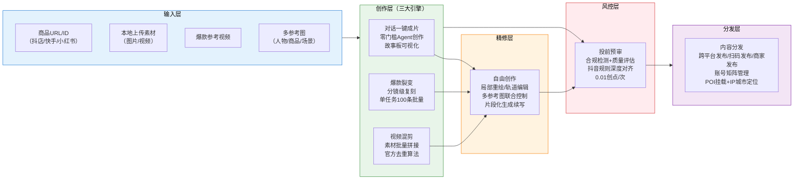
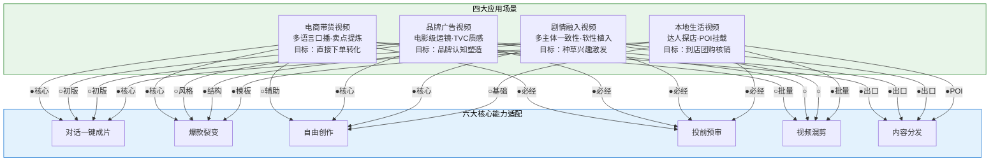
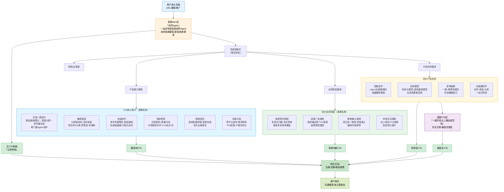

# 火山引擎KickArt一站式电商营销创作Agent完整学习笔记

> **产品介绍页**: https://www.volcengine.com/product/kickart
> **控制台入口**: https://console.volcengine.com/kickart
> **官方文档中心**: https://www.volcengine.com/docs/6664/0?lang=zh
> **产品定位**: 一站式电商营销创作Agent——自研独家创作模型加持，生成效果更"营销"

---

## 📋 目录导航

- [一、产品概述与定位](#一产品概述与定位)
- [二、六大核心能力深度解析](#二六大核心能力深度解析)
- [三、四大应用场景详解](#三四大应用场景详解)
- [四、能力协同与工作流设计](#四能力协同与工作流设计)
- [五、产品架构与Mermaid图表](#五产品架构与mermaid图表)
- [六、UX设计分析与评估](#六ux设计分析与评估)
- [七、产品洞察与可复用模式](#七产品洞察与可复用模式)
- [八、行业趋势判断与启示](#八行业趋势判断与启示)
- [九、专业术语表](#九专业术语表)
- [十、开放问题](#十开放问题)
- [十一、相关资源链接](#十一相关资源链接)

---

## 一、产品概述与定位

### 1.1 产品定位："一站式电商营销创作Agent"

KickArt定位为**一站式电商营销创作Agent**，其核心内涵包含三个维度：

| 维度 | 内涵说明 |
|------|----------|
| **一站式** | 覆盖从内容创作、编辑、管理到分发的全链路流程，用户无需在多个工具间切换，在单一平台内完成营销视频生产的完整闭环 |
| **电商营销** | 垂直聚焦电商营销场景，针对商品展示、带货转化、品牌传播等电商核心需求进行专项优化，而非通用视频创作工具 |
| **创作Agent** | 以AI Agent为核心驱动，而非传统工具形态，具备智能规划、自主创作能力，降低用户创作门槛，提升生产效率 |

### 1.2 核心痛点解决

| 传统痛点 | KickArt解决方案 |
|---------|----------------|
| 传统视频制作成本高（专业拍摄、剪辑团队） | AI Agent自主规划，零门槛创作 |
| 内容生产周期长（上新频率高无法满足） | 分钟级生成，批量产能支持 |
| 创作门槛高（缺乏专业视频制作技能） | 对话一键成片，无需专业技能 |
| 爆款复刻困难（成功经验无法规模化） | 爆款裂变，分镜级复刻批量生产 |
| 合规风险高（投放前缺乏审核） | 投前预审，前置拦截违规风险 |
| 分发流程繁琐（多平台重复操作） | 跨平台内容分发，账号矩阵管理 |

### 1.3 三大价值支柱

| 价值支柱 | 核心内涵 | 支撑能力 |
|---------|---------|---------|
| **爆款领跑** | 爆款解构，一键复刻 | 爆款裂变、灵感广场、对话一键成片 |
| **全域创作** | 基础高阶，多模式覆盖 | 对话一键成片、自由创作、视频混剪 |
| **生态出圈** | 效率效果，流量共赢 | 投前预审、内容分发 |

### 1.4 自研营销创作模型："生成效果更营销"

KickArt采用**自研独家创作模型**，基于Seedance 2.0/2.0 mini视频生成模型、VLM视觉语言模型、豆包大模型协同架构，核心差异化优势在于"更营销"——针对营销场景进行专项优化。

| 技术特性 | 价值说明 |
|----------|----------|
| **营销垂类优化** | 依托自研大模型与营销垂类模型，深度理解营销场景需求，突破通用模型在营销内容创作上的局限 |
| **Agent智能规划** | AI Agent智能规划内容创作全链路，从脚本生成到分镜设计全程自动化 |
| **营销要素理解** | 深度理解商品卖点、用户痛点、转化逻辑等营销核心要素 |
| **多风格适配** | 支持多语言、多演绎风格、多场景覆盖 |
| **场景化生成** | 针对电商带货、品牌广告、剧情融入、本地生活等场景专项优化 |

| 维度 | 通用视频生成模型 | KickArt自研营销模型 |
|------|-----------------|---------------------|
| **目标导向** | 视觉效果、艺术表达 | 营销转化、商品展示 |
| **内容理解** | 通用语义理解 | 深度理解营销要素、卖点、转化逻辑 |
| **场景覆盖** | 通用场景 | 电商营销垂直场景深度优化 |
| **合规能力** | 基础内容审核 | 电商/抖音场景专项合规预审 |
| **工作流** | 单一工具能力 | 全链路Agent驱动，创作-审核-分发闭环 |
| **批量能力** | 单次生成 | 支持批量生产、爆款复刻、SKU全覆盖 |

---

## 二、六大核心能力深度解析

### 2.1 对话一键成片

**官方名称**：对话式一键成片

**功能描述**：用户可通过界面直接输入商品URL/ID，或通过本地上传/历史文件上传素材图片/视频，进入对话交互界面。创作Agent结合用户输入、商品素材、卖点等信息生成创意和故事板，并最终生成完整视频。全流程轻交互，无使用门槛，一键完成专业视频创作。

**核心流程**：
- URL素材抓取：粘贴商品链接或ID，自动获取商品标题、描述、图片等核心素材（支持抖店、快手、小红书）
- 素材理解：AI深度解析商品信息，自动提炼结构化卖点、识别商品主体、评估图片质量
- 故事线生成：一次性生成4条差异化视频创意，包含标题、风格、时长完整框架
- 分镜故事板：生成逐镜脚本+商品/人物/场景参考图，支持替换/复刻
- 一键成片：按故事板内容生成最终视频

**核心价值**：
- 零门槛创作：无需专业视频制作技能，普通商家即可完成专业级视频
- 效率革命：从数天缩短至分钟级，大幅降低视频生产周期
- 智能决策：Agent自主规划创意方向，减少用户决策成本
- 可控性强：故事板可视化呈现，支持编辑调整后再生成

**技术亮点**：
- 自研创作VLM模型：多模态理解商品信息与视觉素材
- Agent架构：自主调度多步创作流程，而非单一生成
- 故事板中间态：提供可编辑的分镜脚本，实现人机协同创作
- 多平台适配：自动适配抖店、快手、小红书等电商平台素材格式

---

### 2.2 爆款裂变

**官方名称**：爆款裂变（复刻）

**功能描述**：针对用户上传的爆款视频，平台进行多维度拆解+结构化复用+原创重构，快速批量产出风格/结构/节奏高度相似、但内容/主体全新的合规内容。一次任务可创建最多10个商品、10个参考视频，一次最多生成100个爆款复刻视频。

**核心特性**：
- 高光保留：原视频爆点识别并仿写保留
- 分镜和画面级别的效果复刻
- 智能分析用户商品卖点，既复刻高光又突出商品实际卖点
- 超长复刻：支持15-60秒原视频的超长复刻
- 多样化复刻：支持跨行业爆款视频复刻
- 支持虚拟人像
- 本地化适配：支持多语种视频复刻，适配本地化模特、场景、文化
- 灵感广场：提供丰富爆款模板，"做同款"一键复刻

**核心价值**：
- 爆款概率提升：科学复刻已验证的成功模式，降低内容试错成本
- 规模化生产：单任务最高100个视频，批量覆盖海量SKU
- 跨类目迁移：将3C等成熟行业爆款方法论迁移至家居等其他行业
- 跨境赋能：多语种复刻能力助力跨境电商素材高效投放
- 成本优化：大幅降低爆款内容制作的时间与人力成本

**技术亮点**：
- 多维度爆款拆解算法：从节奏、结构、爆点位置、视觉语言等维度深度解析
- 分镜级复刻技术：实现画面级别的风格与节奏迁移
- 卖点智能融合：在复刻框架中自动植入新商品核心卖点
- 跨领域迁移学习：支持不同行业间的爆款模式迁移
- 多语种本地化引擎：语音、口型、文化元素的本地化适配

---

### 2.3 自由创作

**功能描述**：灵活性更高的创作方案，支持直接上传素材开启创作、@参考内容，自由组合图片、文字、音频、视频等多元创作元素；可同时输入角色参考图、商品参考图以及结构化分镜提示词，也可在一键成片后快速编辑分镜视频、重新局部生成。适合成片视频精修、专业化创作场景。

**核心功能**：
- 多参考图联合创作：同时引用人物图、商品图、场景图，稳定控制外观还原与形象一致性
- 素材前置锚定生成：先用高质量参考图锁定主体再让画面动起来
- 结构化提示词创作：按主体特征/场景背景/构图景别/运镜方式/主体动作/口播音频/一致性约束分字段填写
- 多类型电商短视频覆盖：品牌广告类、剧情演绎类、主播带货类
- 多主体一致性控制：人脸特写、商品图分开引用，减少人物漂移和商品变形
- 片段化生成与续写：先行生成4-15秒片段，追加拼接、逐段优化
- 生成后调优：擦除字幕、添加字幕、删除片段、重新生成调优

**核心价值**：
- 专业级控制力：满足专业团队对视频细节的深度定制需求
- 灵活工作流：支持从空白开始创作，也支持一键成片后的精修
- 成本降低：局部重绘机制大幅提升视频可用率，降低"抽卡"成本
- 多轨道编辑：视频、BGM、字幕轨道级生成、编辑、添加与删除
- 分步创作：片段化生成降低长视频创作难度，灵活可控

**技术亮点**：
- 多参考图联合控制：人物、商品、场景多参考图协同控制生成一致性
- 局部重绘技术：支持分镜级别的局部重新生成，不影响其他片段
- 结构化提示词解析：将自然语言拆解为专业视频创作参数
- 片段化生成与无缝拼接：支持逐段生成后智能拼接为完整视频
- 轨道级编辑引擎：提供专业非线性编辑的多轨道操控能力

---

### 2.4 投前预审

**功能描述**：从视频内容合规、是否优质等角度完成抖音视频发布前的预审。覆盖抖音及电商日常运营、商业投流场景，精准识别违规风险，支持投放效果预检测。

> **注**：预估结果仅供参考，不构成对视频实际投放效果的承诺。

**核心价值**：
- 风险前置拦截：在发布前识别违规内容，避免账号处罚
- 效果预判：提前感知哪些视频更容易获得流量奖励
- 合规保障：降低因内容违规导致的限流、下架、封号风险
- 成本节约：避免违规视频制作完成后无法投放的浪费
- 投流优化：预审通过的内容投放ROI更有保障

**成本优势**：每个任务每个视频仅扣除0.01创点，成本几乎可以忽略。

**技术亮点**：
- 抖音生态规则深度对齐：基于抖音官方审核标准训练
- 多维度风险识别：覆盖内容合规、广告法违规、低俗敏感等多维度
- 质量评估模型：不仅判断合规性，还评估内容优质度
- 低成本快审：高频调用能力极致优化成本
- 实时性：与创作流程无缝衔接，生成后立即预审

---

### 2.5 视频混剪

**功能描述**：用户只需上传多组已拍摄好的素材，系统即可快速拼接出自带音乐、转场等包装元素的大批量视频，并通过官方去重算法保证内容质量，实现低成本高效率创作，适用于脚本比较固定的批量生产场景。

**核心能力**：
- 多场景适用：休娱、丽人、餐饮、酒旅、电商等行业
- 批量高效产出：上传多组素材，快速拼接生成大批量视频
- 智能包装：自动添加音乐、转场等包装元素
- 官方去重算法：保证生成视频不重复，符合平台原创要求
- 语音集成：支持免费语音与付费语音，自动口播生成

**核心价值**：
- 极致产能：海量素材快速批量生成视频，满足矩阵号内容需求
- 去重保障：官方去重算法避免内容同质化导致的限流
- 零剪辑技能：无需人工剪辑，系统自动完成包装拼接
- 成本极低：使用免费语音时每创点可生成6.7分钟视频
- 标准化产出：固定脚本场景下质量稳定一致

**技术亮点**：
- 抖音官方去重算法：与平台原创检测标准对齐
- 智能编排引擎：自动组合多组素材，生成多样化拼接结果
- 音乐转场智能匹配：根据视频内容自动适配BGM和转场效果
- TTS语音集成：自动生成口播语音，支持音色选择
- 高并发处理：支持大批量视频并行生成

---

### 2.6 内容分发

**官方名称**：发布作品/跨平台分发

**功能描述**：支持用户绑定多个平台账号（账号矩阵），支持跨平台发布、抖音扫码发布以及抖音商家发布三种方式。素材分发抖音等平台，实现视频创作到发布主流自媒体平台的完整链路操作，实现电商用户业务流的素材创作与分发闭环。

**核心流程（跨平台分发）**：
- 账号绑定：进入"发布作品-跨平台发布-账号绑定"页面，新增绑定并选择平台
- 发布城市设置：设置账号所在城市IP（不可频繁切换，避免触发风控）
- 多账号管理：集中管理海量矩阵账号
- 多渠道发布：支持跨平台发布、抖音扫码发布、抖音商家发布
- POI挂载：支持挂载POI进行一键多账号发布

**核心价值**：
- 全链路闭环：从创作到发布无需切换平台，一站式完成
- 矩阵管理：集中管理几十上百家门店/账号的内容发布
- 风控规避：发布城市IP设置符合平台规则，降低封号风险
- 效率提升：批量内容批量发布，大幅提升分发效率
- 多平台覆盖：一次创作，多平台分发，扩大曝光范围

**技术亮点**：
- 账号矩阵管理系统：支持海量账号集中管理与授权
- 跨平台发布适配层：适配不同自媒体平台的发布接口与规范
- IP城市定位技术：发布时匹配账号所在城市IP
- POI挂载集成：本地生活场景支持地理位置挂载
- 多发布模式支持：跨平台发布、扫码发布、商家发布三种模式灵活适配

---

## 三、四大应用场景详解

### 3.1 电商带货视频

**适用对象**：
- 电商平台商家（抖店、快手、小红书等）
- 电商运营人员
- 带货主播/MCN机构
- 广告代理商
- 无剪辑经验的新手用户

**创作方式**：
- 对话式一键成片：输入商品链接或ID，系统自动抓取商品标题、描述、图片等核心素材
- 多语言口播生成：支持多语言、多演绎风格带货视频
- 结构化提示词创作：按「主体特征/场景背景/构图景别/运镜方式/主体动作/口播音频/一致性约束」分字段填写
- 主播口播模式：重点突出口播台词（15字内）+ 音色情绪描述，配合动作展示和卖点表达
- URL素材抓取：支持抖店、快手、小红书平台链接自动解析
- 素材理解与卖点提炼：AI自动深度解析商品信息，提炼结构化卖点

**价值产出**：
- 低成本、高效率覆盖多种带货场景
- 无需拍摄、剪辑、写脚本，仅通过对话引导即可完成商品视频全流程制作
- 大促期间快速响应上新、测款需求
- 支持批量视频混剪，通过官方去重算法保证内容质量
- 显著降低视频制作成本和周期

**典型案例**：
- 美妆个护产品主播口播展示
- 服饰穿搭商品卖点讲解
- 食品开箱试吃演示
- 3C数码产品功能演示
- 日用品使用效果展示

---

### 3.2 品牌广告视频

**适用对象**：
- 品牌方营销团队
- 品牌广告代理商
- 高端电商品牌
- 需要塑造品牌调性的企业客户

**创作方式**：
- 强调质感、运镜、氛围的电影级创作
- 静态图转化为动态视频：将商品静态图转化为有吸引力的动态视频
- 专业级运镜：内置水平/垂直位移、缩放、旋转及希区柯克变焦等导演级运镜手法
- 结构化提示词中重写运镜和场景氛围
- 多参考图联合创作：稳定控制商品外观还原、风格统一
- TVC式创作：通常无口播，靠画面和BGM传递品牌质感
- 品牌调性一致性控制：确保视频风格与品牌视觉统一

**价值产出**：
- 显著提升商品转化表现和品牌形象
- 极致画面质感和专业运镜效果
- 无需专业拍摄团队即可产出TVC级广告片
- 支持最长60秒视频生成，可承载完整品牌故事叙事
- 强化品牌认知和高端形象塑造

**典型案例**：
- 美妆精华液产品质感特写：镜头环绕旋转+水珠滑落细节展示
- 3C耳机科技感悬浮展示：缓慢旋转+蓝色科技光效流动
- 奢侈品高端调性短片：高级光影+电影级运镜
- 品牌故事宣传片：完整叙事结构+情绪渲染
- 新品发布预告视频：悬念营造+视觉冲击

---

### 3.3 剧情融入视频

**适用对象**：
- 内容营销团队
- 短视频剧情创作者
- 需要软性植入的品牌方
- 种草内容创作者
- 社交平台内容运营

**创作方式**：
- 剧情式演绎：人物×商品×场景互动
- 多主体一致性控制：人脸特写、商品图分开引用，提示词中明确指定"图片1中的女性"等
- 多张参考图联合引用：人物参考图（单独人脸特写）+ 商品参考图（单独一张）+ 场景参考图
- 软性广告植入：将商品巧妙穿插于剧情创作中
- 片段化生成与续写：4-15秒片段生成，追加拼接、逐段优化
- 趣味内容创作：通过趣味性剧情提升用户观看时长和接受度

**价值产出**：
- 通过软性广告和趣味视频推动商品转化
- 降低用户对广告的抵触心理
- 提升内容完播率和互动率
- 实现商品种草的软性渗透
- 人物ID稳定、商品细节不变形，减少重复制作成本

**典型案例**：
- 穿搭剧情：女主角在不同场景展示服饰搭配
- 食品开箱试吃：生活化场景中自然展示食品
- 家居好物植入：家庭剧情场景中展示家居用品
- 职场剧情：办公场景中自然植入办公用品
- 情感短剧：情感故事中软性植入相关商品

---

### 3.4 本地生活视频

**适用对象**：
- 本地生活商家（餐饮、美业、休闲娱乐等）
- 本地生活服务平台商家
- 达人探店创作者
- 本地团购运营人员
- 实体店经营者

**创作方式**：
- 达人探店模式：模拟达人到店体验拍摄
- 评测推荐：真实场景下的商品/服务评测
- 真实场景创作：助力真实场景的视频营销转化
- 本地特色化内容：结合门店环境、服务流程进行创作
- 横竖版均支持：适配抖音、大众点评等不同平台
- 口播+场景展示结合：达人推荐口吻+真实门店环境展示

**价值产出**：
- 全面服务各类本地生活商家
- 助力真实场景的视频营销转化
- 降低本地商家视频制作门槛
- 提升到店转化率和团购核销率
- 快速产出大量本地化营销内容

**典型案例**：
- 餐饮门店探店：美食展示+环境介绍+达人推荐
- 美业服务体验：项目流程展示+效果对比
- 休闲娱乐场所：环境展示+体验过程
- 酒店民宿推荐：房间展示+周边环境
- 零售店铺引流：新品展示+到店福利

---

### 3.5 场景-能力映射关系表

| 能力维度 | 电商带货视频 | 品牌广告视频 | 剧情融入视频 | 本地生活视频 |
|---------|-------------|-------------|-------------|-------------|
| **核心创作模式** | 对话一键成片 | 自由创作（高端定制） | 自由创作（多参考图） | 一键成片+视频混剪 |
| **素材输入方式** | 商品URL/ID自动抓取 | 高质量参考图前置锚定 | 多参考图联合引用 | 门店素材上传 |
| **口播支持** | ✅ 多语言口播（核心） | ❌ 通常无口播 | ⭕ 剧情对白 | ✅ 达人推荐口播 |
| **运镜要求** | 标准展示运镜 | ✅ 电影级专业运镜 | 剧情叙事运镜 | 真实记录运镜 |
| **画面质感** | 清晰实用 | ✅ 极致质感/TVC级 | 自然生活化 | 真实场景感 |
| **多主体一致性** | 商品一致性为主 | 商品/风格一致性 | ✅ 人物+商品双一致性 | 场景一致性为主 |
| **片段化生成** | ✅ 支持 | ⭕ 支持长片段 | ✅ 逐段拼接 | ✅ 支持 |
| **局部重绘** | ✅ 支持 | ✅ 精细调整 | ✅ 支持 | ⭕ 基础调整 |
| **字幕处理** | ✅ 卖点字幕 | ❌ 无字幕/极简字幕 | ✅ 剧情字幕 | ✅ 福利信息字幕 |
| **BGM要求** | 带货节奏感音乐 | ✅ 氛围感BGM（核心） | 剧情情绪音乐 | 轻松生活化音乐 |
| **合规预审** | ✅ 电商投流合规 | ✅ 品牌广告合规 | ✅ 内容合规 | ✅ 本地生活合规 |
| **爆款裂变** | ✅ 核心能力 | ⭕ 风格复用 | ✅ 剧情结构复用 | ✅ 探店模板复用 |
| **视频时长** | 15-60秒 | 30-60秒 | 30-60秒 | 15-45秒 |
| **目标转化** | 直接下单购买 | 品牌认知/好感度 | 种草/兴趣激发 | 到店消费/团购核销 |

**符号说明**：✅ 强支持/核心能力，⭕ 支持/辅助能力，❌ 不推荐/不使用

---

## 四、能力协同与工作流设计

### 4.1 能力协同矩阵

下表展示六大能力之间的协同关系：**●** 表示强协同（直接数据流/工作流衔接），**○** 表示弱协同（间接支持/场景互补），**-** 表示无直接协同。

| 能力 | 对话一键成片 | 爆款裂变 | 自由创作 | 投前预审 | 视频混剪 | 内容分发 |
|---|---|---|---|---|---|---|
| **对话一键成片** | - | ○ | ● | ● | ○ | ● |
| **爆款裂变** | ○ | - | ○ | ● | ● | ● |
| **自由创作** | ● | ○ | - | ● | ○ | ● |
| **投前预审** | ● | ● | ● | - | ● | ● |
| **视频混剪** | ○ | ● | ○ | ● | - | ● |
| **内容分发** | ● | ● | ● | ● | ● | - |

### 4.2 四条核心工作流

#### 链路一：零基础用户全流程（对话一键成片 → 投前预审 → 内容分发）
```
商品URL/素材 → [对话一键成片] 生成初版视频 → [投前预审] 合规与质量检测 → [内容分发] 多平台发布
```
- **适用场景**：中小商家快速出片、日常商品上新
- **协同特点**：最简路径，零门槛完成从素材到发布

#### 链路二：爆款规模化复制（爆款裂变 → 视频混剪 → 投前预审 → 内容分发）
```
爆款参考视频 + 多商品素材 → [爆款裂变] 批量复刻 → [视频混剪] 素材混剪（可选）→ [投前预审] 批量预审 → [内容分发] 矩阵账号分发
```
- **适用场景**：大促节点海量素材生产、多SKU爆款视频覆盖、跨境电商多语种素材
- **协同特点**：产能最大化，一次投入批量产出

#### 链路三：专业精修工作流（对话一键成片/爆款裂变 → 自由创作 → 投前预审 → 内容分发）
```
AI初版视频 → [自由创作] 局部精修/轨道编辑 → [投前预审] 合规检测 → [内容分发] 发布
```
- **适用场景**：品牌广告、高转化要求的投流视频、专业团队创作
- **协同特点**：AI效率+专业控制力平衡，质量最优

#### 链路四：素材混剪批量生产（自有素材库 → 视频混剪 → 投前预审 → 内容分发）
```
已拍摄原始素材 → [视频混剪] 批量拼接去重 → [投前预审] 批量过审 → [内容分发] 多账号分发
```
- **适用场景**：本地生活门店矩阵、固定脚本批量生产、已有素材复用
- **协同特点**：素材利用率最高，适合已有拍摄团队的商家

### 4.3 用户类型适配矩阵

| 用户类型 | 核心诉求 | 推荐能力组合 | 典型工作流 |
|---|---|---|---|
| **零基础中小商家** | 简单快速出片 | 对话一键成片 + 投前预审 + 内容分发 | 商品链接→一键成片→预审→发布 |
| **矩阵号运营者** | 海量内容产能 | 视频混剪 + 爆款裂变 + 投前预审 + 内容分发 | 批量素材→混剪/裂变→批量预审→矩阵分发 |
| **专业投流团队** | 高转化率、精细控制 | 对话一键成片/爆款裂变 + 自由创作 + 投前预审 + 内容分发 | AI初版→自由创作精修→预审→投流发布 |
| **跨境电商** | 多语种本地化 | 爆款裂变（多语种）+ 投前预审 + 内容分发 | 中文爆款→多语种复刻→预审→海外平台发布 |
| **本地生活商家** | 多门店覆盖 | 视频混剪 + 内容分发（POI挂载） | 门店素材→混剪→带POI多门店发布 |
| **品牌广告主** | 品牌调性、高质量 | 自由创作 + 投前预审 + 内容分发 | 专业素材→自由创作精修→预审→品牌渠道发布 |

---

## 五、产品架构与Mermaid图表

### 5.1 产品能力分层架构

```
┌─────────────────────────────────────────────────────────────┐
│                     【分发层】内容分发                        │
│      （跨平台发布、账号矩阵管理、POI挂载、多模式发布）          │
├─────────────────────────────────────────────────────────────┤
│                     【风控层】投前预审                        │
│      （合规检测、质量评估、风险前置、效果预判）                 │
├─────────────────────────────────────────────────────────────┤
│                    【创作层】三大创作引擎                      │
│  ┌──────────────┐  ┌──────────────┐  ┌──────────────┐       │
│  │ 对话一键成片  │  │   爆款裂变   │  │   视频混剪   │       │
│  │ （零门槛AI） │  │（爆款规模化）│  │（素材批量）  │       │
│  └──────┬───────┘  └──────┬───────┘  └──────┬───────┘       │
│         │                 │                 │                │
│         └─────────────────┼─────────────────┘                │
│                           ▼                                  │
│                    【精修层】自由创作                         │
│        （局部重绘、轨道编辑、多元素编排、片段续写）             │
└─────────────────────────────────────────────────────────────┘
```

### 5.2 Mermaid产品能力矩阵图



### 5.3 Mermaid四大场景适配图



### 5.4 Mermaid页面信息架构图



---

## 六、UX设计分析与评估

### 6.1 页面信息架构与AIDA模型

页面采用**线性叙事+锚点导航**的经典SaaS产品落地页结构，内容组织遵循"价值主张→能力证明→场景匹配→信任背书→行动召唤"的营销转化逻辑：

| AIDA阶段 | 页面模块 | 核心策略 |
|---------|---------|---------|
| **Attention（注意）** | 首屏Hero区 | 主标题「创作Agent」+ 副标题「一站式电商营销创作Agent」+ 核心价值主张「自研独家创作模型加持，生成效果更'营销'」 |
| **Interest（兴趣）** | 六大核心能力 | 每个能力采用"输入→处理→输出→收益"完整链路描述，解决效率痛点 |
| **Desire（欲望）** | 四大应用场景 | 每个场景关联具体KPI（提升转化、降低成本、扩大触达），建立场景代入感 |
| **Action（行动）** | CTA转化区 | 多触点CTA布局，价值导向文案「一键开启云上增长新空间」 |

### 6.2 设计优势

**优势1：营销转化逻辑清晰，严格遵循AIDA模型**
- 首屏完成注意力捕获，能力模块激发兴趣，场景模块建立欲望，CTA区完成行动转化
- 用户自然滚动即可完成从认知到转化的完整决策路径

**优势2：价值主张表达精准，避免功能罗列式陷阱**
- 不说"我们有什么"，而说"能帮你做什么"
- 一键成片："大幅缩短内容制作周期"而非"支持URL输入"
- 强调「自研营销垂类模型」建立"更懂营销"的专业认知

**优势3：场景化设计到位，目标用户代入感强**
- 四大场景覆盖电商全链路：电商带货、品牌广告、剧情融入、本地生活
- 每个场景直接关联业务KPI，不同类型电商从业者都能找到认同感

**优势4：双模式设计降低心理抗拒，平衡效率与控制**
- 对话一键成片满足"快"的需求，自由创作满足"控"的需求
- 有效回应新手怕复杂、老手怕失控两类核心顾虑

**优势5：信息架构扁平，导航清晰**
- 页面仅设3个锚点导航，层级深度控制在3层以内
- 单页锚点跳转保持用户在同一上下文完成信息获取

### 6.3 潜在问题与改进建议

| 优先级 | 问题 | 改进建议 |
|--------|------|---------|
| 🔴 高 | 内容重复渲染bug（能力/场景/优势重复出现3次） | 排查前端组件渲染逻辑，删除重复渲染代码块 |
| 🔴 高 | 核心能力展示不准确（缺失爆款裂变、投前预审、视频混剪） | 重新梳理六大能力与实际产品对齐，突出爆款裂变和投前预审 |
| 🔴 高 | 缺乏产品演示/效果预览 | 首屏增加30秒快速演示视频，增加Before/After对比展示 |
| 🟠 中高 | 缺乏量化数据支撑和客户案例 | 补充效率/成本/效果量化数据，增加客户Logo墙和深度案例 |
| 🟠 中高 | 风险逆转机制不明确（免费试用/定价） | 明确展示免费试用政策，增加定价入口，CTA旁注明"无需信用卡" |
| 🟠 中高 | 能力与场景匹配关系不直观 | 每个场景增加"推荐能力组合"标签，增加用户旅程工作流展示 |
| 🟡 中 | 导航锚点过少（缺失定价/案例/FAQ） | 导航扩展为6个锚点，增加FAQ模块和对比优势模块 |
| 🟡 中 | 文案具象化不足 | 将"大幅缩短周期"改为"从3天缩短到2分钟"等具象表达 |

---

## 七、产品洞察与可复用模式

### 7.1 七大可复用产品设计模式

#### 模式1：垂直领域专用模型——通用能力之上的行业壁垒构建

**模式描述**：在通用大模型基础上，通过领域数据微调、知识图谱嵌入、场景化Prompt工程三层架构，构建垂直场景专用模型。

**关键要素**：
1. 领域高质量数据沉淀（如抖音亿级爆款视频）
2. 领域专家参与标注与规则提炼
3. 评测标准领域化（用CTR/转化率而非视频清晰度衡量）
4. 对外沟通强调"懂行业"而非"AI能力强"

**KickArt实践**：基于Seedance+VLM+豆包的协同架构，内嵌营销领域知识（带货节奏、黄金3秒钩子、转化引导、平台规则），价值主张"生成效果更营销"。

---

#### 模式2：工作流式能力设计——从单点工具到Agent操作系统

**模式描述**：将复杂业务流程拆解为标准化、可组合的能力模块，通过预设工作流和自定义编排两种方式，适配不同用户类型和场景需求。

**设计原则**：
1. 每个能力模块单一职责、接口标准化
2. 提供"开箱即用"的预设工作流（降低新手门槛）
3. 支持"按需组合"的自定义编排（满足专业用户）
4. 关键节点（如风控、审核）作为必经环节内嵌
5. 中间状态可视化、可编辑（如故事板、分镜）

**KickArt实践**：四大创作引擎+精修层+风控层+分发层的分层架构，四条核心工作流覆盖不同用户需求。

---

#### 模式3：爆款复刻功能——经验数字化与规模化复用

**模式描述**：对领域内已验证的成功案例进行结构化拆解，提取可迁移的"成功模式"，通过AI实现规模化复用和个性化适配，降低试错成本。

**实现步骤**：
1. 成功样本库构建（标注什么是"爆款"）
2. 多维度结构化拆解（提取成功因子）
3. 模式抽象与参数化（节奏、结构、元素、时机）
4. 个性化适配引擎（植入新主体/新场景/新卖点）
5. 效果反馈闭环（追踪复刻内容的实际表现）

**KickArt实践**：多维度爆款拆解算法+分镜级复刻+卖点智能融合+跨领域迁移+多语种本地化，单任务100条批量产能。

---

#### 模式4：投前预审差异化——风控能力产品化

**模式描述**：在内容生产/业务操作流程中，将合规检测、风险评估、质量预审作为标准节点内嵌，而非事后审核，实现"生成即合规"。

**设计要点**：
1. 与平台/监管规则深度对齐，而非自建标准
2. 检测成本极低，可高频调用（KickArt仅0.01创点/次）
3. 不仅说"不行"，还要说"为什么不行"和"怎么改"
4. 流程默认必经，不依赖用户手动触发
5. 从"合规检测"升级到"质量评估+效果预判"

**KickArt实践**：抖音生态规则深度对齐，多维度风险识别+质量评估，与创作流程无缝衔接。

---

#### 模式5：双模式设计——平衡效率与控制的用户分层

**模式描述**：针对同一核心功能，提供"傻瓜模式"（零门槛、默认最优解）和"专家模式"（全参数、精细控制），通过渐进式披露实现不同技能水平用户的覆盖。

**实现策略**：
1. 默认展示简单模式，高级功能折叠/隐藏
2. 简单模式产出结果可进入专家模式二次编辑（不是二选一）
3. 中间状态可视化（如故事板）作为两模式的衔接桥梁
4. 提供"简单模式→专家模式"的平滑升级路径
5. 让用户在使用过程中自然学习

**KickArt实践**：对话一键成片（效率模式）+ 自由创作（控制模式），故事板作为中间态衔接。

---

#### 模式6：场景化入口+路径推荐——降低用户认知负荷

**模式描述**：不要求用户理解所有功能模块，而是从用户场景出发，直接推荐对应的能力组合和工作路径，降低用户的认知负荷和选择焦虑。

**设计方法**：
1. 识别核心用户角色和他们的典型场景
2. 为每个场景预设"推荐工作流"
3. 首屏提供场景选择入口，而非功能罗列
4. 在功能页面标注"此功能适用于XX场景"
5. 新用户引导从场景切入，而非功能教程

**KickArt实践**：六类用户类型的适配矩阵，明确推荐能力组合和典型工作流。

---

#### 模式7：端到端业务闭环——从生产工具到业务基础设施

**模式描述**：不止步于解决单点问题，而是沿着业务流程向前向后延伸，覆盖从"输入"到"输出"的完整链路，成为用户业务的基础设施而非单点工具。

**延伸方向**：
- 向前延伸：降低输入门槛（自动抓取、模板预设、经验复用）
- 向后延伸：打通输出渠道（多平台分发、效果追踪、数据回流）
- 横向延伸：覆盖相关场景（风控、协作、资产管理）
- 数据闭环：输出效果数据回流，反哺模型优化和推荐

**KickArt实践**：URL自动抓取素材→四大创作引擎→投前预审→跨平台分发+账号矩阵+POI挂载，形成完整闭环。

---

## 八、行业趋势判断与启示

### 8.1 五大行业趋势判断

#### 趋势1：从"工具"到"Agent"的范式演进

AI营销创作产品正在经历三代演进：
1. **第一代：工具型**（2022-2023）——"你说我做"，用户主导流程
2. **第二代：Copilot型**（2024）——辅助完成特定环节，提供建议
3. **第三代：Agent型**（2025+）——自主规划、自主执行、自主校验，用户只提目标

> **启示**：未来AI产品竞争不是比"谁的生成效果好10%"，而是比"谁能帮用户省掉更多步骤、谁更懂用户的业务目标"。

---

#### 趋势2：全链路闭环才是护城河，单点能力终会commoditize

视频生成等单点AI能力正在快速同质化，真正的护城河在于：
1. **工作流闭环**：用户全流程在你这里完成，迁移成本极高
2. **数据闭环**：用户创作数据、效果数据持续沉淀，模型越用越好
3. **生态闭环**：与平台规则、分发渠道、投放系统深度打通
4. **资产沉淀**：用户素材库、爆款模板库、历史作品都在你这里

> **启示**：投前预审和内容分发看似不是最酷的AI能力，却是构建闭环的关键——它们是"生成"到"商业价值"之间的最后一公里。

---

#### 趋势3：垂直场景价值远大于通用能力

通用AI工具有市场，但最大商业价值在于垂直场景深度挖掘。营销领域的"好用"和通用领域的"好用"标准完全不同：
- 通用：画面精美、有创意、艺术感强
- 营销：3秒抓注意力、卖点清晰、有转化引导、符合平台规则、能过审、能带货

垂直深耕三个层次：
1. 第一层：数据垂直——用垂直领域数据训练
2. 第二层：流程垂直——理解垂直领域工作流
3. 第三层：指标垂直——用垂直领域业务指标（CTR/转化率/ROI）衡量效果

> **启示**：优先选择垂直赛道打穿打透，而不是做"所有人都能用但所有人都觉得不够好用"的通用工具。

---

#### 趋势4：合规预审不是成本中心，而是核心价值点

随着AIGC内容爆发式增长，平台监管会越来越严格。未来演进方向：
- 从"违规检测"到"效果预测"：不仅说"能不能发"，还说"发了会不会火"
- 从"单一平台"到"多平台适配"：针对不同平台规则给出优化建议
- 从"检测"到"自动修正"：发现违规后自动修改
- 从"内容合规"到"广告法合规"、"知识产权合规"

> **启示**：用户生成内容最怕的不是"生成得不够好"，而是"辛辛苦苦生成完发不出去、发了被封号、投流打水漂"。谁能帮用户规避这些风险，谁就掌握了B端付费核心决策点。

---

#### 趋势5：B端AI产品的商业本质：ROI可量化

C端AI产品可以靠"好玩"获客，但B端AI产品核心决策逻辑永远是ROI：
- 效率提升：视频制作从3天→2分钟，效率提升1000倍
- 成本降低：单条视频从500元→2元，成本降低99%
- 效果提升：客户实测CTR提升30%+
- 产能提升：一次生成100条视频，覆盖全店SKU只需1小时

> **启示**：B端用户买的不是"AI能力"，而是"更赚钱的生意"。首页最显眼的位置不应该放"最先进的AI技术"，而应该放"帮你省X%成本"、"帮你提升Y%效率"。

---

### 8.2 对不同角色的分类启示

| 角色 | 核心启示 |
|-----|---------|
| **产品经理** | 垂直深耕优于大而全；闭环优先，单点其次；说收益不说功能，说数字不说形容词；把风控做成产品卖点 |
| **UX设计师** | 场景优先于功能；中间态可视化是人机协同关键；Show, don't tell；渐进式披露降低门槛；价值导向CTA文案 |
| **技术决策者** | Agent架构优于单模型调用；垂直微调+通用模型组合；模块化设计支持灵活编排；从第一天设计数据回流机制；高频轻量能力极致优化成本 |

---

## 九、专业术语表

### 9.1 营销创作相关术语

| 术语 | 英文 | 简明解释 |
|------|------|----------|
| 创作Agent | Creative Agent | 具备自主规划、执行、校验能力的AI创作系统 |
| 一站式营销创作平台 | One-stop Marketing Creative Platform | 覆盖创意→生产→风控→分发全链路的平台 |
| AIDA模型 | AIDA Model | Attention→Interest→Desire→Action营销转化漏斗 |
| 爆款裂变 | Viral Content Replication | 对爆款视频多维度拆解、结构化复用、批量产出相似内容 |
| 爆款复刻 | Hit Video Remake | 分镜级别的效果复刻，保留高光同时植入新卖点 |
| 高光保留 | Highlight Preservation | 识别并保留原视频爆点位置和关键转化节点 |
| 故事板 | Storyboard | 视频分镜脚本，包含逐镜画面、台词、运镜、时长 |
| 故事线 | Storyline | 视频整体创意框架，包含标题、风格、时长、叙事结构 |
| 投前预审 | Pre-publishing Review | 发布前合规检测和质量评估 |
| CTA | Call to Action | 行动召唤按钮/文案，引导用户完成转化 |
| 黄金3秒 | Golden 3 Seconds | 视频开头3秒决定用户是否继续观看的关键窗口 |
| 钩子 | Hook | 视频开头快速抓住注意力的内容元素 |
| 带货节奏 | Pacing for Conversion | 卖点展示、情绪引导、转化提示的时间节奏安排 |
| 转化引导 | Conversion Guidance | 引导用户完成下单、点击、关注等转化行为 |
| 品牌调性 | Brand Tone | 品牌在视觉、语言、风格上的统一调性 |
| TVC级 | TVC Quality | 电视广告水准的高质量视频制作 |
| 数字人口播 | Digital Human Voiceover | AI虚拟数字人进行产品讲解和带货口播 |
| 软性植入 | Soft Placement | 将商品广告巧妙融入剧情，降低广告抵触 |
| 种草 | Seeding | 通过内容分享激发购买欲望的营销方式 |
| 完播率 | Video Completion Rate | 视频被完整观看的比例 |
| ROI | Return on Investment | 投资回报率 |
| CTR | Click-Through Rate | 点击率 |
| MCN机构 | Multi-Channel Network | 连接内容创作者与平台的专业运营机构 |

### 9.2 AI视频生成相关术语

| 术语 | 英文 | 简明解释 |
|------|------|----------|
| VLM | Vision Language Model | 视觉语言模型，多模态理解图像与文本 |
| Seedance | Seedance | 火山引擎自研视频生成模型（2.0/2.0 mini） |
| 多模态理解 | Multimodal Understanding | AI同时理解文本、图像、视频、音频的能力 |
| 多参考图联合创作 | Multi-reference Image Generation | 同时引用多张参考图控制外观一致性 |
| 素材前置锚定 | Material Pre-anchoring | 先用参考图锁定主体外观再让画面动起来 |
| 结构化提示词 | Structured Prompt | 按固定字段组织的提示词 |
| 局部重绘 | Inpainting/Regeneration | 对特定片段/区域重新生成，不影响其他部分 |
| 片段化生成 | Segment Generation | 将长视频拆分为4-15秒片段逐段生成后拼接 |
| 多主体一致性 | Multi-subject Consistency | 保证人物、商品在不同镜头中外观稳定 |
| 人物漂移 | Character Drift | AI生成视频中人物外观不自然变化的问题 |
| 商品变形 | Product Distortion | AI生成视频中商品外形扭曲变形的问题 |
| 轨道级编辑 | Track-level Editing | 类似专业软件的多轨道编辑能力 |
| 分镜级复刻 | Shot-level Replication | 镜头/分镜级别的精准复刻，而非仅风格迁移 |
| 希区柯克变焦 | Dolly Zoom | 推拉镜头同时变焦的专业电影运镜手法 |
| 运镜 | Camera Movement | 镜头运动方式（推拉摇移、旋转、缩放等） |
| 景别 | Shot Size | 镜头取景范围（特写、近景、中景、全景、远景） |
| TTS | Text-to-Speech | 文本转语音技术 |
| 去重算法 | Deduplication Algorithm | 保证批量视频不重复，符合平台原创要求 |
| 大小模型协同 | Large-small Model Synergy | 简单任务小模型，复杂任务大模型的混合架构 |

### 9.3 电商运营相关术语

| 术语 | 英文 | 简明解释 |
|------|------|----------|
| 抖店 | Douyin Shop | 抖音电商平台商家店铺 |
| SKU | Stock Keeping Unit | 库存量单位，商品不同规格组合 |
| 投流 | Paid Traffic | 付费流量投放，通过广告系统推广视频 |
| 矩阵账号 | Account Matrix | 运营多个账号形成矩阵扩大覆盖 |
| POI挂载 | POI Tagging | 视频中挂载地理位置信息，用于本地生活引流 |
| 本地生活 | Local Life Services | 为本地商家提供的到店消费、团购核销服务 |
| 团购核销 | Group-buy Redemption | 用户购买团购券后到店验证使用 |
| 大促节点 | Mega Promotion Event | 电商大型促销活动（618、双11等） |
| 测款 | Product Testing | 小流量测试商品市场接受度 |
| 上新 | New Product Launch | 店铺新品上架发布 |
| 商品主图视频 | Product Main Image Video | 商品详情页主图位置展示的短视频 |
| 达人探店 | Influencer Store Visit | 本地生活达人到店体验拍摄推荐视频 |
| 跨平台分发 | Cross-platform Distribution | 同一内容发布到多个自媒体平台 |
| 限流 | Traffic Throttling | 平台因违规或质量问题限制视频流量推荐 |
| 封号 | Account Ban | 平台因严重违规封禁用户账号 |
| 创点 | Chuangdian/Credit Point | KickArt平台计费单位 |
| 卖点提炼 | Selling Point Extraction | AI自动从商品信息中提取核心卖点 |
| 跨境电商 | Cross-border E-commerce | 不同国家/地区间电子商务贸易 |

---

## 十、开放问题

基于现有公开信息，以下问题尚未得到明确解答：

- [ ] **定价策略与计费模式**：具体定价套餐、创点购买方式、不同功能计费标准、企业版/个人版差异？

- [ ] **自研模型技术差异**："自研独家创作模型"相比通用视频生成模型（Sora/Runway/Pika）有哪些具体技术差异？训练数据规模、营销领域微调方式？

- [ ] **投前预审维度与准确率**：具体审核维度（广告法/低俗/合规/质量的子项）、审核准确率、误判率、与抖音官方审核一致性比例？

- [ ] **爆点识别算法逻辑**：从哪些维度识别爆点（节奏变化/情绪峰值/画面切换/评论热词）？爆点定义标准？仿写具体实现方式？

- [ ] **支持分发的平台范围**：具体支持哪些平台（抖音/快手/小红书/淘宝/视频号/B站）？各平台功能支持程度（POI挂载是否全平台支持）？

- [ ] **去重算法原理**：如何实现去重（镜头顺序打乱/画面微调/BGM变化/MD5修改）？与抖音原创检测算法关系？实际测试数据？

- [ ] **API接入与自动化能力**：API具体能力范围（是否支持全流程自动化/批量提交/ERP集成）？API定价、QPS限制、私有化部署选项？

- [ ] **视频时长限制与质量水平**：不同功能具体时长上限？生成视频分辨率（1080p/4K）、帧率、生成速度？Seedance 2.0 vs 2.0 mini质量差异？

---

## 十一、相关资源链接

### 11.1 产品入口链接

| 资源类型 | 链接 | 说明 |
|----------|------|------|
| 产品介绍页 | https://www.volcengine.com/product/kickart | KickArt官方产品介绍页面 |
| 控制台入口 | https://console.volcengine.com/kickart | KickArt产品控制台，实际使用创作功能 |

### 11.2 官方文档链接

| 文档主题 | 链接 |
|----------|------|
| 文档首页 | https://www.volcengine.com/docs/6664/0?lang=zh |
| 快速入门 | https://www.volcengine.com/docs/6664/2119705?lang=zh |
| 对话一键成片 | https://www.volcengine.com/docs/6664/139856?lang=zh |
| 爆款裂变 | https://www.volcengine.com/docs/6664/139863?lang=zh |
| 自由创作 | https://www.volcengine.com/docs/6664/139858?lang=zh |
| 投前预审 | https://www.volcengine.com/docs/6664/1366349?lang=zh |
| 视频混剪 | https://www.volcengine.com/docs/6664/139859?lang=zh |
| 内容分发 | https://www.volcengine.com/docs/6664/139861?lang=zh |
| 灵感广场 | https://www.volcengine.com/docs/6664/139860?lang=zh |
| 素材管理 | https://www.volcengine.com/docs/6664/139862?lang=zh |
| 常见问题 | https://www.volcengine.com/docs/6664/1366350?lang=zh |
| 复刻操作指南 | https://www.volcengine.com/docs/6664/139864?lang=zh |
| 应用实践 | https://www.volcengine.com/docs/6664/1366354?lang=zh |
| API/SDK参考 | https://www.volcengine.com/docs/6664/1349322?lang=zh |
| 模型说明 | https://www.volcengine.com/docs/6664/1366352?lang=zh |

### 11.3 火山引擎平台链接

| 资源类型 | 链接 |
|----------|------|
| 火山引擎首页 | https://www.volcengine.com/ |
| 火山引擎控制台 | https://console.volcengine.com/ |

---

**文档版本**: v1.0
**更新日期**: 2026-07-04
**来源**: 火山引擎官方产品页 + 官方文档中心 + 产品UX深度分析综合整理
