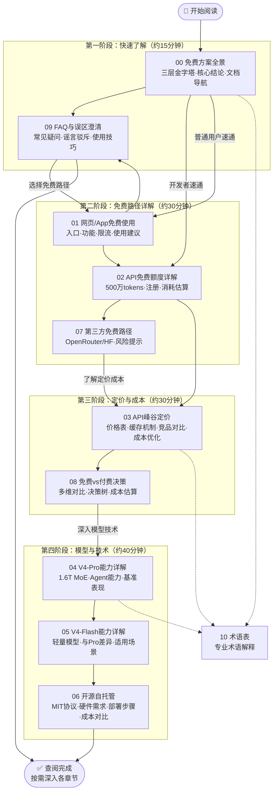

# DeepSeek-V4 免费方案 Wiki 教程

## 简介

本Wiki教程系统梳理了**DeepSeek-V4正式版免费方案**的全部信息，包括三条免费路径（网页/App永久免费、API新用户赠送、开源模型自托管）、模型能力详解、API峰谷定价、自托管方案、第三方路径、选型决策、FAQ误区澄清等内容。所有信息均经过官方文档和权威媒体多源交叉验证，确保准确可靠。

### 核心结论

1. **普通用户完全免费**：网页端(chat.deepseek.com)和App默认使用V4-Pro满血版，无对话次数限制，无付费会员计划
2. **API新用户赠500万tokens**：注册platform.deepseek.com即赠，无需信用卡，有效期约30天
3. **API涨价仅影响开发者**：8月17日峰谷定价仅针对API调用，网页/App完全不受影响
4. **V4-Flash完全开源**：MIT协议，可自托管，无调用限制
5. **警惕不实信息**："79.9元会员""每日50次限制"均为谣言

### 学习路径全景

## 文档索引

| 序号 | 文档 | 核心内容 | 适合读者 |
|------|------|---------|---------|
| 00 | [免费方案全景](00-overview.md) | 三层免费路径对比、核心结论、文档导航、适用人群推荐 | 所有读者 |
| 01 | [网页/App免费使用](01-web-app-free.md) | 入口、登录、功能清单、fair-use限流说明、使用建议 | 普通用户 |
| 02 | [API免费额度详解](02-api-free-tier.md) | 500万tokens规则、注册流程、代码示例、消耗估算、省Token技巧 | 开发者 |
| 03 | [API峰谷定价与对比](03-api-pricing-comparison.md) | 峰谷价格表、缓存机制、竞品对比、成本估算、优化策略 | 开发者/企业 |
| 04 | [V4-Pro能力详解](04-v4-pro-capabilities.md) | 技术规格、Agent能力、三档推理模式、基准表现 | 技术用户 |
| 05 | [V4-Flash能力详解](05-v4-flash-capabilities.md) | 轻量模型定位、与Pro差异、适用场景 | 开发者 |
| 06 | [开源自托管方案](06-self-hosting.md) | MIT协议、硬件需求、vLLM/SGLang部署、成本盈亏分析 | 技术团队 |
| 07 | [第三方免费路径](07-third-party-free.md) | OpenRouter/HF/云平台/插件、风险提示、安全建议 | 进阶用户 |
| 08 | [免费vs付费决策](08-free-vs-paid.md) | 多维对比表、用户画像选型、成本估算、决策树 | 决策者 |
| 09 | [FAQ与误区澄清](09-faq-mythbusting.md) | 22个常见问题、"79.9元会员"等谣言驳斥 | 所有读者 |
| 10 | [术语表](10-glossary.md) | Token/MoE/KV Cache等15+专业术语中英对照解释 | 初学者 |

## 快速导航

- **我是普通用户**：直接读 [00 概述](00-overview.md) → [01 网页/App使用](01-web-app-free.md) → [09 FAQ](09-faq-mythbusting.md)
- **我是开发者**：读 [00 概述](00-overview.md) → [02 API免费额度](02-api-free-tier.md) → [03 API定价](03-api-pricing-comparison.md) → [08 决策指南](08-free-vs-paid.md)
- **我要自托管**：读 [05 V4-Flash](05-v4-flash-capabilities.md) → [06 自托管](06-self-hosting.md)
- **遇到疑问**：直接查看 [09 FAQ](09-faq-mythbusting.md) 和 [10 术语表](10-glossary.md)

## 信息来源

本教程信息来源于以下14个权威渠道的交叉验证：

1. DeepSeek官方API文档（中文）：api-docs.deepseek.com/zh-cn/
2. DeepSeek开发者平台：platform.deepseek.com
3. DeepSeek官网：www.deepseek.com / chat.deepseek.com
4. HuggingFace官方仓库：huggingface.co/deepseek-ai
5. DeepSeek GitHub：github.com/deepseek-ai
6. 官方微博公告：深度求索DeepSeek
7. 中新经纬：《DeepSeek V4价格调整，两版本API调用7小时翻番》
8. 潮新闻：《DeepSeek宣布V4系列API调用8月17日起提价》
9. 新浪财经/新浪科技：多篇报道
10. CSDN：《一文看懂DeepSeek V4最全使用攻略》
11. 51CTO：《DeepSeek V4网页端限流机制深度拆解》
12. APIDog：《从零开始调用DeepSeek V4 API》
13. CostGoat/Geotoolbox：第三方定价分析
14. 百度百科：DeepSeek词条

> **信息更新时间**：2026年8月19日 | 如有变动请以官方最新信息为准

## 🔗 相关资源

- [⬆️ 返回上级：厂商产品学习](../README.md)
- [🏠 返回Learning Wiki 知识库](../../README.md)
- [📚 文档首页](../../../README.md)
