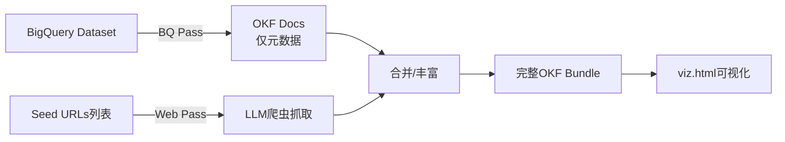

# 02 - 参考智能体（Python实现）

> 参考智能体是OKF格式的**概念验证生产者**，演示如何从BigQuery元数据和网页文档自动生成OKF知识包。配套的可视化器是OKF的**概念验证消费者**，演示如何渲染交互式知识图谱。

---

## 一、参考智能体概述

参考智能体（`reference_agent`）是一个Python实现的ADK（Agent Development Kit）智能体，用于自动化生成OKF bundles。它是理解OKF格式生产端工作流的最佳参考。

### 1.1 技术栈

| 组件 | 技术选择 | 版本要求 |
|------|---------|---------|
| Python | CPython | ≥3.11（推荐3.13） |
| Agent框架 | Google ADK | ≥2.0 |
| 数据源 | google-cloud-bigquery | ≥3.20 |
| LLM | Gemini API 或 Vertex AI | gemini-2.5-pro |
| 配置/解析 | PyYAML + Pydantic | ≥6.0 / ≥2.0 |
| HTML→Markdown | markdownify | ≥0.11 |
| 测试 | pytest | ≥7.0 |
| 可视化前端 | Cytoscape.js + marked.js | CDN加载 |

### 1.2 安装

```bash
cd okf
python3.13 -m venv .venv
.venv/bin/pip install --index-url https://pypi.org/simple/ -e .[dev]
```

### 1.3 认证配置

**BigQuery认证**：
```bash
gcloud auth application-default login
gcloud config set project <your-project-id>
```
> 注意：公开数据集可读，但查询字节费用由调用者项目承担。

**Gemini认证（二选一）**：
- AI Studio：设置`GEMINI_API_KEY`环境变量
- Vertex AI：设置`GOOGLE_GENAI_USE_VERTEXAI=true`、`GOOGLE_CLOUD_PROJECT=<id>`、`GOOGLE_CLOUD_LOCATION=<region>`

---

## 二、两阶段运行机制

参考智能体分两个阶段运行：**BQ pass**（BigQuery元数据阶段）和**Web pass**（网页抓取丰富阶段）。



### 2.1 BQ Pass（BigQuery阶段）

**功能**：仅使用BigQuery元数据，为数据源中声明的每个概念写入一个OKF文档。

**产出内容**：
- `datasets/<dataset>.md`：数据集级概念
- `tables/<table>.md`：表概念，含Schema信息
- 自动生成各目录的`index.md`

**特点**：确定性，无LLM调用，快速生成基础骨架。

### 2.2 Web Pass（网页阶段）

**功能**：将LLM作为自己的爬虫运行：
1. 接收种子URL列表（通过`--web-seed`或`--web-seed-file`提供）
2. 通过`fetch_url`工具抓取种子URL
3. 根据出站链接是否看起来像现有概念的权威文档，决定是否值得跟踪
4. 对每个抓取的页面，Agent选择：
   - (a) 丰富一个或多个现有概念文档
   - (b) 创建独立的`references/<slug>`文档
   - (c) 跳过

**安全限制**（工具内部强制执行）：
- `--web-max-pages`硬性上限，防止Agent过度爬行
- 同域名允许主机过滤器（通过`--web-allowed-host`配置）
- 使用`--no-web`可跳过Web pass，仅运行BQ-only模式

---

## 三、CLI使用指南

### 3.1 enrich命令（生成Bundle）

**最小调用**（指向BigQuery数据集和Bundle输出目录）：

```bash
.venv/bin/python -m reference_agent enrich \
    --source bq \
    --dataset <project>.<dataset> \
    --web-seed-file <path/to/seeds.txt> \
    --out ./bundles/<name>
```

**常用参数**：

| 参数 | 说明 |
|------|------|
| `--source bq` | 数据源类型（当前仅支持bq） |
| `--dataset <project>.<dataset>` | BigQuery数据集（格式：项目ID.数据集ID） |
| `--out <path>` | Bundle输出目录 |
| `--web-seed <url>` | 单个网页种子URL（可多次指定） |
| `--web-seed-file <path>` | 包含种子URL的文本文件（每行一个URL） |
| `--web-max-pages <n>` | Web pass最大抓取页数（硬性限制） |
| `--web-allowed-host <host>` | 允许爬行的主机名（可多次指定） |
| `--no-web` | 跳过Web pass，仅生成BQ元数据 |
| `--concept <type>/<name>` | 仅迭代单个概念（如`--concept tables/events_`），可重复运行 |

**迭代单个概念示例**：
```bash
.venv/bin/python -m reference_agent enrich \
    --source bq \
    --dataset <project>.<dataset> \
    --concept tables/events_ \
    --out ./bundles/ga4
```
这对逐个优化特定概念文档很有用，可重复运行直到满意。

### 3.2 visualize命令（生成可视化）

生成自包含交互式HTML文件——一个文件，无需后端，查看方无需安装。

```bash
.venv/bin/python -m reference_agent visualize --bundle ./bundles/<name>
```

写入`bundles/<name>/viz.html`。

**参数**：

| Flag | 默认值 | 说明 |
|------|--------|------|
| `--bundle` | *(必填)* | Bundle根目录 |
| `--out` | `<bundle>/viz.html` | 输出HTML路径 |
| `--name` | bundle目录名 | 查看器标题中显示的名称 |

**自定义输出位置和标题示例**：
```bash
.venv/bin/python -m reference_agent visualize \
    --bundle ./bundles/crypto_bitcoin \
    --out /tmp/btc.html \
    --name "Bitcoin OKF"
```

---

## 四、可视化器功能详解

### 4.1 可视化内容

可视化器本身是OKF的概念验证*消费者*，镜像参考智能体作为概念验证*生产者*的角色。OKF bundles可以被任何读取Markdown的东西消费；这只是一种形式。

**展示内容**：

1. **力导向图**：Bundle中每个概念的力导向图，节点按类型着色（datasets、tables、references等），从Markdown正文中的每个交叉链接绘制有向边
2. **详情面板**：选中概念的详情面板，显示其frontmatter（描述、资源链接、标签）和渲染后的Markdown正文——内部`[…](/path/to/concept.md)`链接重新连接到查看器内导航而非跟随路径
3. **"被引用"反向链接列表**：每个概念下方（从链接图反向计算）
4. **搜索与过滤**：搜索框（匹配标题、概念ID和标签）、类型过滤器、可切换图布局（cose/concentric/breadth-first/circle/grid）

### 4.2 技术实现

HTML将Bundle嵌入为JSON blob，使用：
- [Cytoscape.js](https://js.cytoscape.org/)：图形渲染
- [marked](https://marked.js.org/)：浏览器内Markdown渲染
- 两者均从CDN加载，数据不离开页面
- Bundle在生成时解析一次并序列化到文件中

### 4.3 使用方式

- 在任意现代浏览器中打开`viz.html`
- 作为工件分享
- 托管在静态文件服务器上
- 像本仓库一样提交到Bundle旁边

---

## 五、预构建Bundles解析

仓库中包含4个现成的可浏览bundle，由参考智能体生成并提交到[`bundles/`](../okf/bundles)：

| Bundle | 数据集 | 特点 | viz.html |
|--------|--------|------|----------|
| `bundles/ga4/` | GA4电商数据集（Google Merch Store） | 标准GA4 BigQuery Export schema，events_日分片表 | [viz.html](file:///d:/AI/vendor/knowledge-catalog/okf/bundles/ga4/viz.html) |
| `bundles/stackoverflow/` | Stack Overflow公开数据集 | 多表（badges/comments/posts/users/votes等），多对多关系，跨表连接文档丰富 | [viz.html](file:///d:/AI/vendor/knowledge-catalog/okf/bundles/stackoverflow/viz.html) |
| `bundles/crypto_bitcoin/` | Bitcoin区块链数据集 | blocks/transactions/inputs/outputs四表，外键关系在prose中表达 | [viz.html](file:///d:/AI/vendor/knowledge-catalog/okf/bundles/crypto_bitcoin/viz.html) |
| `bundles/acme_retail/` | Acme Retail示例 | 展示认证计算(Attested Computation)完整示例：metrics/policies/computations/attesters/skills | [viz.html](file:///d:/AI/vendor/knowledge-catalog/okf/bundles/acme_retail/viz.html) |

### 5.1 samples/目录与bundles/目录的关系

每个sample将**配方**（`samples/<name>/`，包含种子URL和确切`enrich`命令）与配方生成的**产出bundle**（`bundles/<name>/`）配对：
- 打开配方可复现结果
- 打开bundle可直接浏览结果

---

## 六、项目源码结构解析

```
src/reference_agent/
├── __init__.py
├── __main__.py              # python -m reference_agent 入口
├── agent.py                 # ADK智能体定义（核心编排逻辑）
├── cli.py                   # CLI命令行解析（enrich/visualize子命令）
├── runner.py                # 运行时执行器
│
├── bundle/                  # Bundle读写模块
│   ├── __init__.py
│   ├── document.py          # OKF文档模型（Pydantic）
│   ├── index.py             # index.md自动生成
│   ├── paths.py             # 路径处理工具
│   └── synthesizer.py       # LLM内容合成逻辑
│
├── prompts/                 # LLM提示词模板
│   ├── reference_instruction.md
│   └── web_ingestion_instruction.md
│
├── sources/                 # 数据源源码
│   ├── __init__.py
│   ├── base.py              # 数据源抽象基类
│   └── bigquery.py          # BigQuery元数据源实现
│
├── tools/                   # Agent工具集
│   ├── __init__.py
│   ├── bundle_tools.py      # Bundle读写工具
│   ├── context.py           # 上下文管理
│   ├── source_tools.py      # 数据源访问工具
│   └── web_tools.py         # 网页抓取工具
│
├── viewer/                  # 可视化器
│   ├── __init__.py
│   ├── generator.py         # HTML生成逻辑
│   ├── templates/viz.html   # HTML模板
│   └── static/              # CSS/JS静态资源
│       ├── viz.css
│       └── viz.js
│
└── web/                     # 网页抓取
    ├── __init__.py
    └── fetcher.py           # URL抓取与内容提取
```

---

## 七、测试运行

```bash
.venv/bin/pytest
```

测试覆盖：
- BigQuery源测试（`test_bigquery_source.py`）
- Bundle工具测试（`test_bundle_tools.py`）
- 文档模型测试（`test_document.py`）
- 索引生成测试（`test_index.py`）
- 可视化器测试（`test_viewer.py`）
- 网页抓取测试（`test_web_fetcher.py`）
- Web工具测试（`test_web_tools.py`）

---

继续阅读：[03-metadata-as-code.md - 元数据即代码工具链(kcmd/mdcode)](03-metadata-as-code.md)
