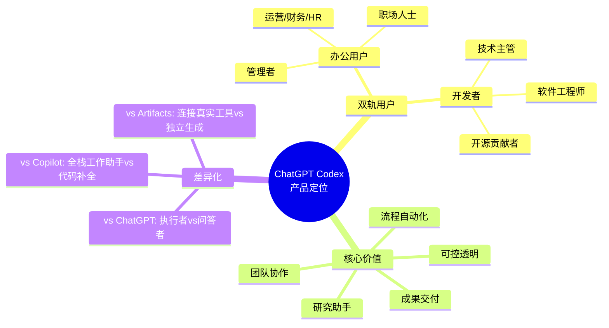
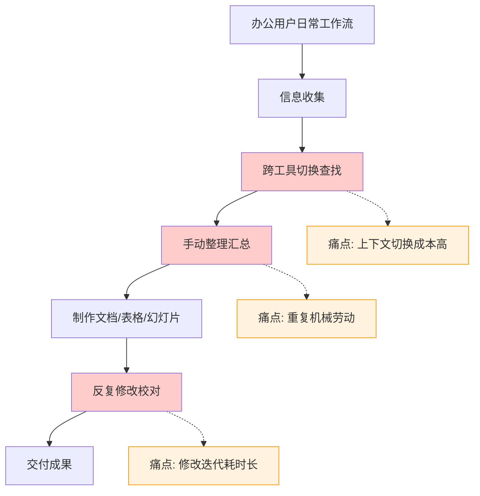
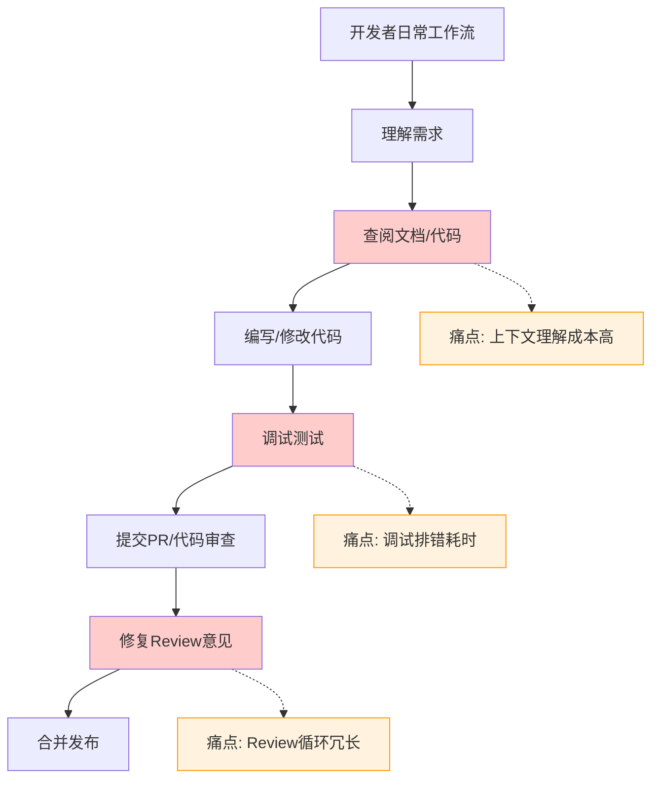
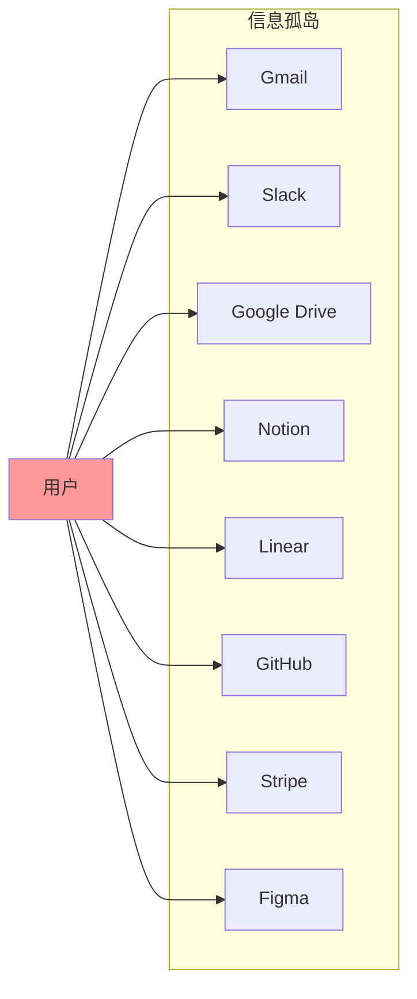
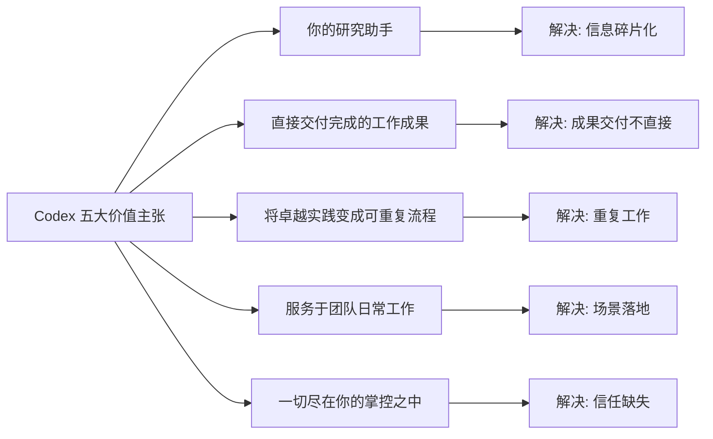
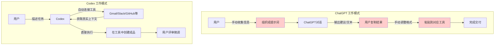
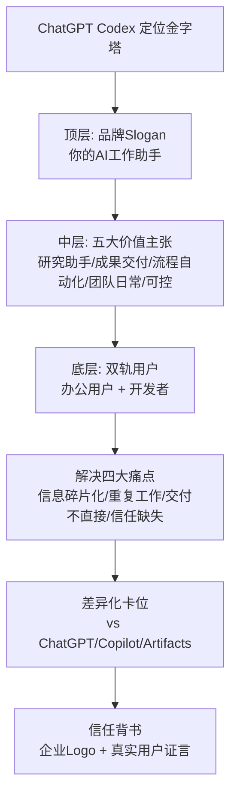

## 一、产品定位概览

ChatGPT Codex 是 OpenAI 推出的**新一代AI工作助手**，标志着AI产品从"对话式问答"向"执行式交付"的关键转型。与 ChatGPT 主要以对话形式提供建议不同，Codex 的核心定位是**一个能够理解真实工作上下文、连接你的工作工具、直接完成并交付工作成果的智能执行者**。

Codex 的出现不是为了替代人类工作，而是作为人类工作的**延伸与放大器**——它处理信息收集、整理、初稿撰写、重复执行等机械性工作，让人类能够专注于判断、决策、创意等高价值环节。

---

## 二、目标用户双轨画像

Codex 采用**双轨产品策略**，同时服务于两类截然不同但又高度互补的用户群体：办公用户与开发者。这两类用户在工作场景、工具链、痛点、期望成果上都存在显著差异，但都能从 Codex 中获得巨大价值。

### 2.1 办公用户画像

| 用户细分 | 典型角色 | 核心工作场景 | 日常工具 | 期望成果 |
|---|---|---|---|---|
| **职场人士** | 产品经理、市场专员、项目经理 | 写周报、做汇报、整理会议纪要、跟进项目进度 | Gmail、Slack、Google Docs、Notion、Calendar | 快速产出高质量文档、减少信息收集时间、不遗漏重要事项 |
| **管理者** | 部门总监、团队负责人、高管 | 审阅报告、做决策、跨部门协调、绩效评估 | Email、Slack、BI工具、幻灯片、电子表格 | 快速掌握团队状态、获得决策所需的数据洞察、高效对齐团队 |
| **运营/财务/HR** | 运营经理、财务分析师、HR专员 | KPI汇报、财务审计、招聘筛选、合同审阅、数据整理 | ERP系统、Excel、HR系统、财务软件、邮件 | 自动化重复报表、减少人工错误、快速生成分析结论、提升合规性 |

办公用户的共同特征是：他们不写代码，但每天需要处理大量信息、制作各类文档、跟进多个项目。他们的时间被工具切换和重复劳动大量消耗，真正用于思考和决策的时间被严重挤压。

### 2.2 开发者画像

| 用户细分 | 典型角色 | 核心工作场景 | 日常工具 | 期望成果 |
|---|---|---|---|---|
| **软件工程师** | 前端/后端/全栈工程师、移动端开发 | 写功能代码、调试Bug、代码审查、写测试、重构 | VS Code/JetBrains、GitHub、Terminal、Slack、Linear | 减少样板代码编写、快速定位问题、自动生成测试、加速PR审查 |
| **技术主管** | Tech Lead、工程经理、架构师 | 代码审查、技术方案设计、项目排期、团队协调 | GitHub、IDE、文档工具、项目管理工具 | 快速了解代码库状态、识别风险点、辅助技术决策、提升团队效率 |
| **开源贡献者** | 开源维护者、独立开发者、贡献者 | 维护Issue、处理PR、写文档、发布版本、回答社区问题 | GitHub、CLI、IDE、Discord/Slack | 自动化Issue分类、辅助PR审查、生成发布说明、减轻维护负担 |

开发者群体虽然具备技术能力，但同样面临大量重复性工作：写样板代码、调试已知类型的Bug、反复进行代码审查、手动更新文档和发布说明。Codex 对开发者而言不是替代写代码，而是**接管那些机械的、可预测的、耗时的开发环节**。

---

## 三、核心痛点深度分析

无论是办公用户还是开发者，当代知识工作者都面临着四大共性痛点：信息碎片化、重复工作繁重、成果交付不直接、信任缺失。Codex 的产品设计正是精准命中这四大痛点。

### 3.1 痛点一：信息碎片化

**问题表现**：
- 工作所需的信息分散在十几个不同工具中：邮件在Gmail、聊天在Slack、文档在Google Drive/Notion、任务在Linear/Jira、代码在GitHub、数据在Stripe/数据库
- 每次开始一项任务，首先要花15-30分钟在各个工具间切换，搜索、收集、整理相关上下文
- 上下文切换不仅浪费时间，还会导致注意力碎片化，深度思考难以持续
- 信息版本不一致：同一个项目的信息散落在各处，难以确定哪个是最新版本

**痛点量化**：根据微软2023年工作趋势指数，知识工作者平均每天切换工具超过**300次**，用于查找和整理信息的时间占比高达**25-30%**。这意味着每周有近1.5天的时间完全浪费在信息搜集上，而非真正创造价值。

### 3.2 痛点二：重复工作繁重

**问题表现**：
- **办公场景**：每周写周报、每月做KPI汇报、季度做财务审计、每次招聘做资料包、新客户来时做客户概要——这些工作内容有规律但每次都要重新做
- **开发场景**：重复编写CRUD代码、为每个函数写单元测试、每次发布写更新日志、处理相似类型的Bug、审查PR时反复检查同一类问题
- 这些工作不是"难"，而是"烦"——它们不需要高深的智力投入，但又必须认真完成，消耗大量精力
- 更糟糕的是，重复工作容易导致疲劳和失误，人工做10次同样的事，很难保证每次质量一致

| 重复工作类型 | 办公场景示例 | 开发场景示例 | 单次耗时 | 发生频率 |
|---|---|---|---|---|
| **周期性汇报** | 周报、月报、KPI复盘 | 站会更新、Sprint总结 | 30-60分钟 | 每周/每月 |
| **信息汇总** | 会议纪要整理、项目进度汇总 | Release Note生成、Changelog更新 | 20-45分钟 | 每次会议/发布 |
| **审查核对** | 财务审计、合同审阅 | 代码审查、安全漏洞扫描 | 1-3小时 | 定期/每次提交 |
| **文档撰写** | 方案初稿、客户邮件 | API文档、代码注释 | 1-2小时 | 每个项目/功能 |
| **流程执行** | 招聘筛选、入职流程 | 环境搭建、依赖更新 | 30-90分钟 | 每次新员工/新项目 |

### 3.3 痛点三：成果交付不直接

**问题表现**：
- 传统AI工具（包括早期的ChatGPT）的输出是**"建议"**而非**"成品"**：它会告诉你"你应该这样写周报"、"你可以按这个思路调试"，但不会直接把周报写好、把Bug修好
- 用户拿到AI的输出后，还需要自己复制粘贴、调整格式、补全细节、接入真实系统——AI做了30%，剩下70%还是要自己来
- 很多时候，"根据建议自己改完"的时间并不比"从头开始做"少多少
- AI生成的内容与用户真实工作环境脱节：它不了解你的项目背景、团队规范、历史决策，给出的建议往往"看上去很美但落地很难"

这是AI产品长期存在的"最后一公里"问题：AI能生成文本，但不能直接在你的Slack里发消息；能生成代码片段，但不能直接在你的代码库里创建PR；能分析表格数据，但不能直接更新你的BI看板。

### 3.4 痛点四：信任缺失

**问题表现**：
- AI是"黑盒"：你不知道它的答案是基于什么信息得出的，不知道它做了哪些假设，不知道它推理过程中哪里可能出错
- 幻觉问题：AI会自信地编造不存在的事实、引用不存在的文献、给出看似合理但实际错误的代码
- 无法验证：当AI给出一个结论或方案时，你很难快速验证它是否正确，往往需要从头到尾检查一遍，反而增加了工作量
- 失控担忧：用户担心AI会乱改自己的文件、发错消息、做出无法挽回的操作，不敢让AI真正"执行"动作

信任问题是阻碍AI从"建议者"升级为"执行者"的最大障碍。如果用户不敢相信AI的输出是对的，不敢让AI直接操作自己的工具和数据，那么AI永远只能停留在"辅助参考"的定位，无法真正承担工作。

---

## 四、价值主张：五大核心承诺

针对上述四大痛点，Codex 提出了清晰的五大价值主张，构成了产品的核心承诺体系。

### 4.1 价值主张一：你的研究助手

Codex 能够**连接你正在使用的工具**——Gmail、Google Drive、Slack、GitHub、Notion、Linear、Figma、Stripe 等——直接基于你真实的工作材料协同工作。

**核心差异**：你不需要把所有信息压缩成一段提示词喂给AI，Codex 可以主动去你的工具里查找所需信息，理解上下文，就像一个真正的人类助手那样。

**场景示例**：当你需要调查"为什么这个批发订单的物流延迟了"，你不需要去翻邮件、查Slack聊天记录、找物流系统截图、问相关同事——你只需要告诉Codex这个问题，它会自动：
1. 在Gmail中查找与该订单相关的所有邮件往来
2. 在Slack中搜索关于这个订单的讨论
3. 在物流系统中查看当前状态和历史轨迹
4. 整理出时间线和关键节点
5. 给出延迟原因分析和建议的下一步行动

这才是真正的"助手"——不是等你把所有材料准备好喂给它，而是它自己去搜集和整理信息。

### 4.2 价值主张二：直接交付完成的工作成果

Codex 不只是给你建议，它**直接产出你可以使用的成品**：简报、电子表格、幻灯片、视觉素材、消息、工具、自动化流程、原型、方案、代码改动——都是完成度很高的版本，你只需要评审、微调，就可以直接使用。

**核心差异**：传统AI是"你问我答，建议给你，怎么做自己想"；Codex是"理解任务，直接做完，成果给你评审"。

**成果交付物清单**：

| 成果类型 | 办公场景交付物 | 开发场景交付物 |
|---|---|---|
| **文档类** | 周报/月报、会议纪要、项目方案、客户邮件 | 技术方案、API文档、代码注释、发布说明 |
| **数据类** | 电子表格、KPI看板、财务分析报告 | Bug分析报告、性能测试结果、依赖审计报告 |
| **演示类** | 幻灯片、汇报材料、产品演示原型 | 架构图、流程图、技术分享PPT |
| **沟通类** | Slack消息、邮件草稿、会议议程、跟进提醒 | PR描述、Code Review意见、Issue回复、社区回答 |
| **执行类** | 自动化工作流、表单处理、数据录入 | 代码改动PR、测试用例、Bug修复、重构方案 |
| **工具类** | 定制化小工具、数据处理脚本 | CLI工具、内部插件、CI/CD配置 |

关键在于：这些成果不是脱离你环境的"纯文本"，而是**直接在你的工具中创建/更新**：邮件直接在Gmail里存为草稿，消息直接在Slack里准备好发送，代码直接在GitHub上创建PR，幻灯片直接在Google Slides中生成——你不需要复制粘贴。

### 4.3 价值主张三：将卓越实践变成可重复流程

当你或你的团队摸索出一套优秀的工作方式时，Codex 可以帮你**把这套实践固化为可重复执行的自动化流程**。它会自动抓取GitHub、Slack、文档中的最新上下文，将成熟的工作流转为定期自动执行的更新报告、摘要、自动化、代码变更。

**核心价值**：
- 优秀经验不再依赖于某个人"记得"去做，而是自动执行
- 团队新成员不需要反复学习"我们怎么做周报"、"我们怎么发版"，Codex已经按照团队最佳实践准备好了
- 每次执行的质量一致，不会因为人忙、人累、人疏忽而出错
- 流程可以持续迭代优化，越用越好用

**典型可自动化流程**：
- 每周一早上自动收集上周GitHub提交、Slack讨论、Linear任务进展，生成本周团队周报
- 每次Stripe有扣费失败时，自动分析相关日志、Slack记录、代码变更，定位问题原因并创建修复任务
- 每次候选人面试结束后，自动收集面试官反馈，整理成面试评价汇总
- 每次发布后，自动从PR记录生成Release Note，更新文档，通知相关团队

### 4.4 价值主张四：服务于团队的日常工作

Codex 不是为"一次性炫酷任务"设计的，而是为**团队每天都在做的、高频的、日常的工作**设计的。它深入到团队工作流的毛细血管中，成为日常工作不可或缺的一部分。

**覆盖团队日常工作场景**：

| 工作场景 | 办公团队应用 | 研发团队应用 |
|---|---|---|
| **汇报类** | KPI汇报、管线更新、业务周报 | 迭代总结、发布简报、技术复盘 |
| **审计类** | 财务审计、合规检查、合同审阅 | 代码审计、依赖漏洞扫描、安全评审 |
| **筹备类** | 客户续约筹备、季度会议准备 | 发布准备、里程碑规划、上线Checklist |
| **招聘类** | 招聘资料包、候选人评估、面试安排 | 面试题准备、代码笔试评审、Onboarding材料 |
| **客户类** | 客户概要、项目跟进、QBR准备 | 客户问题排查、定制化方案、支持工单处理 |
| **分析类** | Bug漏斗分析、用户反馈汇总、数据看板 | 性能瓶颈分析、错误日志分析、用户行为分析 |
| **构建类** | 产品原型、营销素材、流程设计 | 原型搭建、脚手架生成、内部工具开发 |
| **跟进类** | Action Item跟进、邮件回复、待办提醒 | Issue跟进、PR催办、告警处理 |

这一价值主张非常重要：很多AI产品展示的都是"炫酷Demo"——帮你写一首歌、画一幅画、解一道难题——但这些场景用户一个月可能只用一次。Codex瞄准的是"每天都要做3次"的日常工作，成为真正的生产力工具。

### 4.5 价值主张五：一切尽在你的掌控之中

这是Codex建立信任的核心设计：它会**清晰地展示来源、假设、所做的改动以及后续步骤**，让你完全理解它做了什么、为什么这么做、依据是什么。AI是助手，你是决策者，控制权始终在你手上。

**可控性设计体现**：
- **来源透明**：每一个结论、每一条信息都标注了来源——来自哪封邮件、哪个Slack消息、哪个文档、哪段代码，你可以一键追溯查证
- **假设明示**：当信息不完整需要做出假设时，Codex会明确告诉你"我假设了XXX，如果不对请告诉我"，而不是把假设当事实
- **改动预览**：所有对文件、代码、工具的改动都先展示给你看，你确认后才会真正执行，不会"先斩后奏"
- **步骤拆解**：复杂任务会拆解成清晰的步骤，你可以看到每一步做了什么，随时可以暂停、调整、介入
- **可逆操作**：重要操作都有"撤销"机制，即使AI做错了，你也可以一键回滚，不会造成无法挽回的损失

---

## 五、差异化定位：三大对比

在AI助手赛道已经相当拥挤的2026年，Codex通过清晰的差异化定位，在市场中找到了自己独特的位置。我们通过三个关键对比来理解Codex的卡位。

### 5.1 vs ChatGPT对话：执行者 vs 问答者

很多人会问："我已经有ChatGPT了，为什么还需要Codex？"这是一个非常好的问题，理解两者的区别是理解Codex定位的关键。

| 对比维度 | ChatGPT 对话 | ChatGPT Codex |
|---|---|---|
| **核心角色** | 问答顾问、创意伙伴 | 工作执行者、智能助手 |
| **交互模式** | 你问我答，多轮对话 | 你交代任务，它执行完成 |
| **信息来源** | 你通过提示词提供 + 训练数据 | 自动连接你的工具获取真实上下文 |
| **输出形式** | 对话中的文本/代码建议 | 直接交付的成品（文档/代码/消息等） |
| **工具连接** | 需要你手动复制粘贴 | 原生集成Gmail/Slack/GitHub等 |
| **执行能力** | 只能"说"，不能"做" | 可以实际操作工具、创建文件、提交PR |
| **典型场景** | 头脑风暴、解释概念、学习知识、写初稿 | 完成具体工作、交付成品、自动化流程 |
| **用户投入** | 需要你引导对话、提供信息、复制结果 | 交代任务后等待评审，中间无需介入 |

简单来说：**ChatGPT是和你聊天的聪明朋友，Codex是帮你干活的靠谱助手**。两者不是替代关系，而是互补关系——ChatGPT适合探索和思考，Codex适合执行和交付。

### 5.2 vs GitHub Copilot：全栈工作助手 vs 代码补全

GitHub Copilot是目前最成功的AI编程助手，很多开发者每天都在用。Codex与Copilot的区别是什么？

| 对比维度 | GitHub Copilot | ChatGPT Codex |
|---|---|---|
| **目标用户** | 主要是开发者（写代码时） | 开发者 + 办公用户（全场景工作） |
| **工作场景** | IDE内，写代码的瞬间 | 全工作场景：Web/IDE/CLI/桌面/移动端 |
| **核心能力** | 代码补全、行级/函数级建议 | 多步骤任务执行、跨工具理解、完整交付 |
| **上下文范围** | 当前打开的文件、相邻文件 | 连接所有工作工具，理解完整项目/业务上下文 |
| **输出粒度** | 代码片段、函数实现 | 完整PR、Bug修复、全套测试、文档更新 |
| **非代码能力** | 几乎没有 | 文档、幻灯片、消息、数据分析、自动化 |
| **团队协作** | 主要是个人辅助 | 面向团队工作流，支持团队级流程自动化 |
| **执行动作** | 建议代码，用户接受/拒绝 | 可以执行完整工作流：创建分支→写代码→跑测试→提PR |

Copilot就像你开车时的自动补全——你在写代码，它帮你补全下一行、下一个函数。而Codex像一个副驾驶——你告诉它"我要去这里"，它帮你规划路线、检查车况、甚至在你累的时候可以帮你开一段，但方向盘始终在你手上。

### 5.3 vs Claude Artifacts：连接真实工具 vs 独立生成

Anthropic的Claude Artifacts是另一个重要竞品，它可以生成交互式的网页、文档、代码。Codex与Artifacts的核心区别是什么？

| 对比维度 | Claude Artifacts | ChatGPT Codex |
|---|---|---|
| **输出环境** | Artifacts是Claude界面内的独立沙箱 | 直接在用户自己的工具/系统中创建/更新内容 |
| **上下文来源** | 用户上传/粘贴的内容 + 对话历史 | 原生连接用户的Gmail/Slack/GitHub等真实工作环境 |
| **成果落地** | 需要用户下载/导出/复制到自己的系统 | 成果直接存在于用户的工作流中，无需导出 |
| **数据时效性** | 基于用户提供的静态数据 | 实时获取工具中的最新数据 |
| **动作执行** | 只能生成内容，不能操作外部系统 | 可以发消息、提交PR、创建任务、更新数据等实际动作 |
| **场景覆盖** | 适合生成独立的、一次性的作品 | 适合融入日常工作流的、持续性的工作 |

Artifacts的优势是可以快速生成一个漂亮的、交互式的独立作品，但问题是：这个作品生成之后呢？你还是要把它拿出来，放到你真正用的工具里，接入你的真实数据，和你的团队协作。Codex从一开始就不打算构建一个"独立的沙箱世界"，而是**直接融入你已有的工作世界**。

---

## 六、信任背书：客户证言与社会认同

在B2B和生产力工具领域，信任是转化的关键。Codex在首屏和关键位置展示了强有力的信任背书，包括知名企业客户Logo和真实用户的具体证言。

### 6.1 企业客户Logo墙

Codex首屏展示了五家各行业顶尖企业的Logo，作为"顶尖团队都在使用"的社会认同信号：

| 客户Logo | 行业 | 为什么选择它们作为背书 |
|---|---|---|
| **Cisco** | 企业网络/科技巨头 | 传统大型科技企业，代表企业级市场认可 |
| **Instacart** | 电商/即时配送 | 互联网新贵，代表快速增长的科技公司 |
| **Duolingo** | 教育/消费App | 知名消费级科技产品，代表产品驱动型公司 |
| **Vanta** | 安全合规/SaaS | B2B SaaS代表，代表企业服务领域认可 |
| **Virgin Atlantic** | 航空/传统行业 | 传统非科技行业，代表AI跨行业渗透 |

这五个Logo的选择非常有讲究：
- **覆盖多个行业**：科技、电商、教育、安全、航空，证明Codex不是只适用于某一个垂直领域
- **兼顾新旧经济**：既有Cisco、Virgin Atlantic这样的传统大公司，也有Vanta、Instacart这样的新经济SaaS
- **包含To B和To C**：Duolingo是大众熟知的消费品牌，降低认知门槛；Vanta是专业B2B品牌，建立专业信任
- **灰度处理**：Logo全部做了灰度/黑白处理，不抢主视觉风头，但又清晰可辨，这是企业级产品Logo墙的标准设计手法

### 6.2 开发者真实推荐语

在面向开发者的页面，Codex展示了6位来自不同公司的真实开发者的推荐语。这些证言不是模糊的"很好用"，而是**具体到角色、场景、量化的效果**，非常有说服力。

**推荐语结构分析**：

| 证言要素 | 作用 | 示例 |
|---|---|---|
| **真实身份** | 增加可信度，让同角色用户产生认同 | 姓名、职位、公司 |
| **具体场景** | 不是泛泛而谈，而是说清在什么情况下用 | "调试一个棘手的Stripe扣费问题" |
| **对比效果** | 对比用之前和用之后的差异 | "以前要花一整天，现在一小时搞定" |
| **量化数据** | 用数字说话，增强冲击力 | "节省了50%的时间"、"周末搞定季度工作" |
| **情感表达** | 真实的情绪共鸣，不是冰冷的广告词 | "简直不敢相信"、"彻底改变了我的工作方式" |

**典型推荐语示例模式**：
> "作为[职位]，我在[具体场景]时使用Codex。以前做这件事需要[旧状态：耗时长/麻烦/痛苦]，现在Codex帮我[新状态：快速/自动/高质量完成]，节省了我[量化数据]的时间。这是我用过的最好的AI工具。"

这种证言的力量在于：当另一个开发者读到"我周末用Codex搞定了整个季度的代码重构"时，他会立刻想"我也有一堆重构要做，周末不想加班"——这就击中了真实痛点，产生了尝试欲望。

---

## 七、产品定位总结

Codex的产品定位可以总结为一句话：

> **"你的AI工作助手——连接你的所有工具，理解你的真实上下文，直接交付完成的工作成果，一切尽在你的掌控。"**

这不是一个"更聪明的聊天机器人"，而是一个**工作方式的变革**：从"人找信息、人做重复劳动、人手动把AI建议落地"，升级为"人定义目标和判断质量，AI负责信息搜集、执行、交付"。

理解这个定位，是理解Codex所有功能设计、界面设计、体验设计的基础。接下来的章节，我们将深入拆解：为了实现这个定位，Codex具体做了哪些功能设计？

---

**下一步**：继续阅读 [02 核心功能详解](02-core-features.md)，系统掌握Codex五大核心功能模块的详细设计与实现逻辑。
