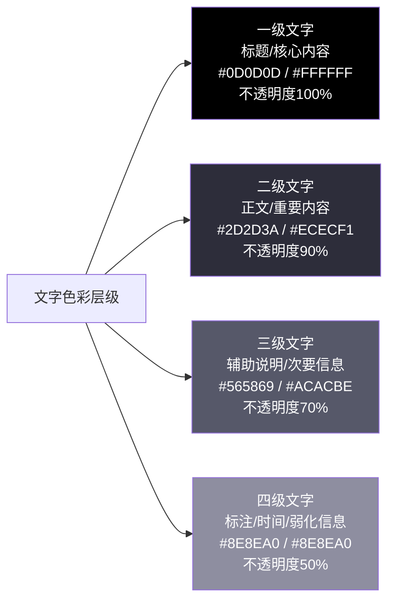
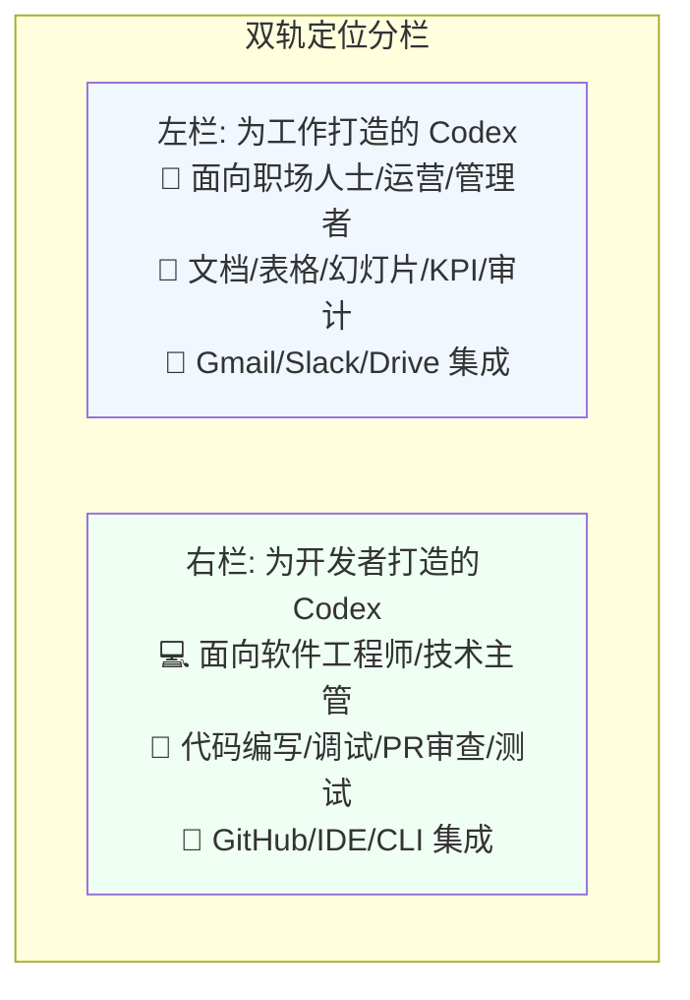
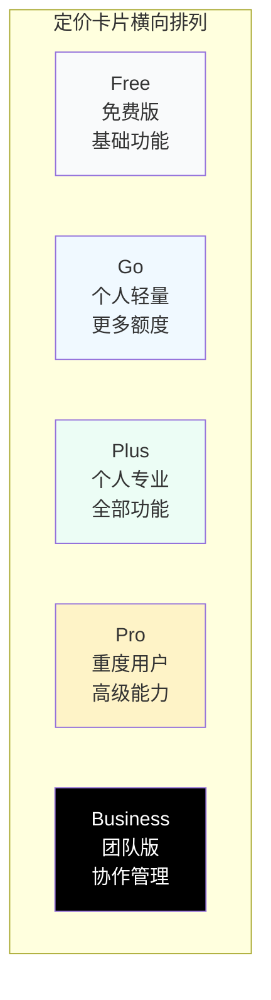
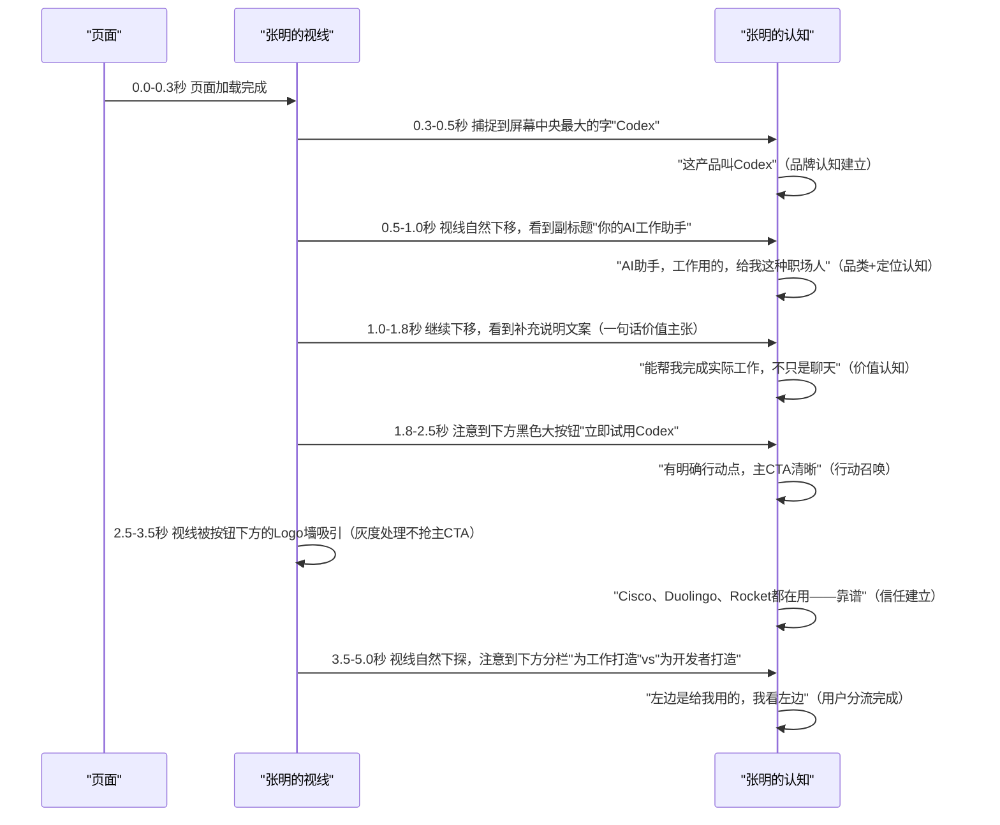
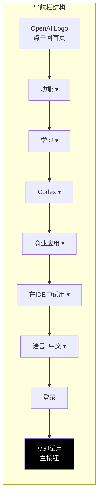
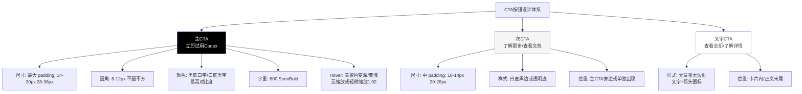
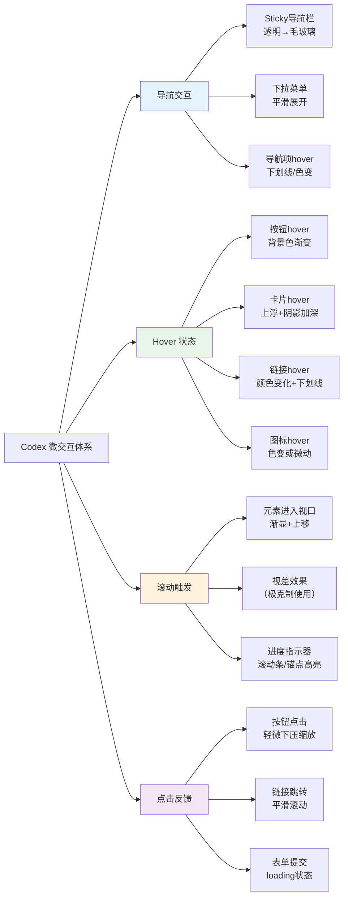
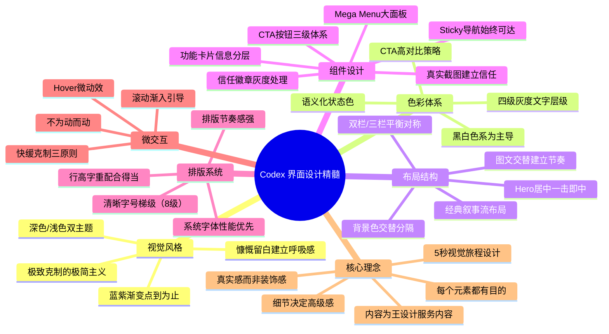

## 一、视觉设计整体风格

ChatGPT Codex 官网采用**极简主义（Minimalism）**设计语言，这是顶级 SaaS 产品落地页的经典选择。这种设计风格不是"简单"，而是"克制"——去掉所有不必要的装饰元素，让内容和功能本身成为视觉焦点，通过留白、排版、对比来建立层次和节奏感。

```mermaid
graph TD
    A["Codex 视觉设计体系"] --> B["视觉风格"]
    A --> C["色彩体系"]
    A --> D["布局结构"]
    A --> E["组件设计"]
    A --> F["图片设计"]
    A --> G["排版系统"]
    B --> B1["极简主义"]
    B --> B2["高留白"]
    B --> B3["深色/浅色主题支持"]
    B --> B4["蓝紫渐变点缀"]
    C --> C1["主色调: OpenAI品牌色"]
    C --> C2["CTA对比"]
    C --> C3["文字层级灰度"]
    D --> D1["Hero居中布局"]
    D --> D2["双轨定位分栏"]
    D --> D3["功能模块图文交替"]
    D --> D4["定价横向卡片"]
    D --> D5["平台三栏等宽"]
    E --> E1["Sticky导航"]
    E --> E2["功能展示卡片"]
    E --> E3["定价对比卡"]
    E --> E4["平台入口卡"]
    F --> F1["真实场景截图"]
    F --> F2["精确Alt描述"]
    F --> F3["无抽象概念图"]
    G --> G1["Hero超大字号"]
    G --> G2["章节标题层级"]
    G --> G3["正文舒适阅读"]
    G --> G4["辅助文字弱化"]
```

OpenAI 的设计团队非常清楚：Codex 是一个生产力工具，用户来这里不是为了"看炫酷设计"，而是为了"理解产品能帮我做什么"。因此设计的第一原则是**服务于信息传达**，而不是展示设计技巧。

---

## 二、视觉风格：极简与克制之美

### 2.1 极简主义核心特征

Codex 官网的极简主义体现在以下几个方面：

| 设计维度 | 具体表现 | 设计意图 |
|---|---|---|
| **无多余装饰** | 没有花哨的阴影、渐变边框、3D效果、动画装饰 | 避免视觉噪音，让用户注意力集中在内容上 |
| **元素纯粹** | 按钮就是按钮，卡片就是卡片，不做过度拟物或花哨变形 | 降低认知负荷，用户一眼就知道什么是什么 |
| **线面结合** | 主要靠色块和留白分割区域，分隔线用得非常克制 | 创造呼吸感，区域划分自然不生硬 |
| **动画柔和** | 滚动时的渐入、hover 时的微动效都非常克制，不抢眼 | 增加精致感但不分散注意力 |
| **图标简洁** | 所有图标都是线性或实心的简单风格，统一视觉语言 | 图标是辅助，不是主角 |

### 2.2 留白：呼吸的空间

Codex 设计中最值得学习的一点是**对留白的慷慨使用**。

很多国内网站喜欢把页面塞得满满当当，觉得"空着就是浪费空间"。但顶级 SaaS 产品的设计恰恰相反——他们用大量留白来：
1. **突出核心内容**：周围留白越多，中间的内容越突出
2. **建立视觉节奏**：密-疏-密-疏的节奏让页面读起来不累
3. **传递高级感**：奢侈品牌、高端产品都用大量留白，因为留白本身就是"奢侈"的——意味着你不需要靠堆内容来填满空间
4. **引导阅读流**：留白自然地把用户视线从一个区块引导到下一个区块

**留白量化参考**：
- 区块之间的垂直间距：80-120px（桌面端）
- 内容宽度限制：最大 1200px，居中，两侧大量留白
- 文字行高：正文 1.6-1.8 倍，标题 1.2-1.3 倍
- 段落间距：正文段落之间 1.5-2 倍行高

### 2.3 深色/浅色双主题支持

Codex 官网同时支持深色模式和浅色模式，跟随系统设置自动切换：

| 主题模式 | 背景色 | 文字色 | 适用场景 |
|---|---|---|---|
| **浅色主题（默认）** | 白色 #FFFFFF、浅灰 #F7F7F8 | 深灰/黑色 #0D0D0D、中灰 #565869 | 日间浏览、办公环境、打印 |
| **深色主题** | 深灰 #212121、近黑 #111111 | 白色 #FFFFFF、浅灰 #ACACBE | 夜间浏览、开发者习惯、IDE风格 |

双主题设计的细节处理非常到位：
- 不是简单的"反色"，而是重新调整了对比度和色彩饱和度
- 深色模式下的图片/截图会自动适配，不会有刺眼的亮块
- CTA按钮在两个主题下都保持足够的对比度
- 品牌渐变在两个主题下都有合适的表现

### 2.4 渐变点缀：蓝色到淡紫色

在整体极简克制的基调下，Codex 用**蓝色到淡紫色的微妙渐变**作为视觉点缀：
- "Codex"品牌名下方的微妙渐变光晕
- 某些装饰元素的渐变描边
- 部分插画/截图中的渐变元素

这个渐变色不是大面积使用的，而是**点到为止**——作为视觉趣味点，打破纯黑白灰的单调，但又不破坏整体的极简感。

---

## 三、色彩体系：OpenAI 品牌色进化

Codex 的色彩体系体现了 OpenAI 品牌视觉的进化——从早期 ChatGPT 标志性的绿色（#10A37F），转向更成熟、更中性、更企业级的黑白色系，同时保留品牌识别性。

### 3.1 主色调演变

| 色彩 | 色值 | 使用场景 | 设计含义 |
|---|---|---|---|
| **主黑** | #0D0D0D 或纯黑 #000000 | 标题文字、主要CTA按钮（深色主题）、导航文字 | 专业、可靠、高端，企业级产品的选择 |
| **主白** | #FFFFFF | 背景（浅色主题）、CTA按钮（深色主题） | 干净、纯粹、留白 |
| **OpenAI 品牌蓝** | #10A37F（经典绿）或新版品牌色 | Logo、链接、次要强调、品牌识别 | 保留OpenAI品牌基因，让老用户有熟悉感 |
| **蓝紫渐变** | 蓝色→淡紫色过渡 | 装饰元素、品牌光晕、重点强调 | 科技感、AI感，但用得非常克制 |
| **成功绿** | #10B981 | 成功状态、已连接标识、正面反馈 | 清晰的状态反馈 |
| **警示橙** | #F59E0B | 警告状态、待处理标识 | 温和提醒，不用刺眼的红色 |
| **错误红** | #EF4444 | 错误状态、断开连接、危险操作 | 谨慎使用，只在真正需要警示时 |

### 3.2 文字层级色彩

Codex 通过不同灰度的文字建立清晰的信息层级，而不是只靠字号大小：

**色彩层级原则**：
1. **对比度足够**：正文与背景对比度 ≥ 4.5:1（WCAG AA标准），标题 ≥ 7:1
2. **层级不超过4级**：太多层级用户反而分不清
3. **语义一致**：同级别信息始终用同样的颜色，不随便变色
4. **弱化而非消失**：不重要的信息是"变浅"，不是"看不见"

### 3.3 CTA 按钮色彩对比

CTA（Call to Action）按钮是转化的关键，Codex 的 CTA 设计采用**高对比策略**：

| 按钮类型 | 浅色主题样式 | 深色主题样式 | 使用场景 |
|---|---|---|---|
| **主 CTA（主要转化按钮）** | 黑色背景 #000000 + 白色文字 | 白色背景 #FFFFFF + 黑色文字 | Hero 区域"立即试用"、导航栏右侧按钮、底部 CTA |
| **次 CTA（次要行动）** | 白色背景 + 黑色边框 + 黑色文字 | 深灰背景 + 白字 | "了解更多"、"查看文档"等次要行动 |
| **文字 CTA（三级行动）** | 无背景、黑色文字+箭头图标 | 无背景、白色文字+箭头图标 | 卡片内链接、"查看全部"等 |
| **Hover 状态** | 背景变深灰 #333（主CTA） | 背景变浅灰 #eee（主CTA） | 鼠标悬停时的反馈 |

CTA 设计的精髓：**同一时间、同一屏内，永远只有一个最主要的 CTA 是视觉焦点**。你不会在 Codex 页面上看到两个一样大、一样醒目的按钮抢注意力——主 CTA 永远是最醒目的那个，其他按钮都主动"降级"，不抢戏。

---

## 四、布局结构：经典 SaaS 落地页叙事流

Codex 官网采用了经过无数 SaaS 产品验证的**经典落地页布局结构**，从首屏到页脚，按照用户认知的逻辑顺序组织内容，形成一个完整的叙事流：**吸引注意 → 告诉为谁做 → 展示能做什么 → 建立信任 → 促成转化**。

```mermaid
graph TD
    subgraph SG1 ["页面垂直滚动流"]
        H["Hero 首屏区域<br/>居中布局"] --> T["信任条<br/>客户Logo墙"]
        T --> D["双轨产品定位<br/>左右分栏: 办公/开发"]
        D --> F1["功能模块1<br/>左文右图"]
        F1 --> F2["功能模块2<br/>左图右文"]
        F2 --> F3["功能模块3<br/>左文右图"]
        F3 --> F4["功能模块4<br/>左图右文"]
        F4 --> F5["功能模块5<br/>左文右图"]
        F5 --> P["定价区域<br/>横向对比卡片"]
        P --> M["多平台入口<br/>三栏等宽卡片"]
        M --> CTA["底部CTA<br/>重复号召"]
        CTA --> FT["页脚导航"]
    end
    style H fill:#000000,color:#fff
    style F1 fill:#f5f5f5
    style F2 fill:#ffffff
    style F3 fill:#f5f5f5
    style F4 fill:#ffffff
    style F5 fill:#f5f5f5
    style CTA fill:#000000,color:#fff
```

### 4.1 首屏 Hero：居中布局，一击即中

Hero 区域是用户打开页面看到的第一屏，决定了用户是继续往下看还是直接关掉。Codex 的 Hero 设计极其克制但有效：

**Hero 区域构成元素**：

| 元素 | 位置 | 设计细节 |
|---|---|---|
| **品牌名 "Codex"** | 水平居中，视觉中心偏上 | 超大字号（桌面端 80-120px），字重粗，字间距略紧，品牌感极强 |
| **副标题 "你的 AI 工作助手"** | 品牌名下方，居中 | 大字号（32-48px），字重正常，清晰传递定位 |
| **补充说明文案** | 副标题下方 | 中号正文，一句话解释核心价值，不超过3行 |
| **主 CTA 按钮 "立即试用 Codex"** | 文案下方居中 | 最大号的主 CTA 按钮，黑色（浅色主题），圆角适中 |
| **次要文字链接** | 主 CTA 下方 | "已有账号？登录"，弱化处理，给老用户入口但不抢新用户转化 |
| **客户 Logo 信任条** | Hero 区域底部 | 5个Logo灰度处理，居中排列，文字"顶尖团队都在使用" |

**Hero 设计的聪明之处**：
1. **没有花里胡哨的动画/视频背景**：纯背景色，让 "Codex" 这五个大字成为绝对视觉焦点——品牌名本身就足够有冲击力
2. **一句话说清定位**："你的 AI 工作助手"——8个字，没有术语，任何人都能懂
3. **信任信号紧邻 CTA**：Logo 墙就在 CTA 下方，用户刚被勾起兴趣有点想点的时候，立刻看到"Cisco、Duolingo 这些大公司都在用"，打消顾虑
4. **响应式适配完美**：移动端自动调整字号、间距，保持同样的视觉冲击力

### 4.2 双轨产品定位：左右分栏

Hero 之后，立刻回答用户的第一个疑问："这东西是给我用的吗？"

Codex 采用**左右等宽分栏**设计，同时面向两类用户说话：

**双栏设计的优势**：
- **分流明确**：办公用户看左边，开发者看右边，互不干扰，不会"我到底该点哪个"
- **信息对称**：两栏结构相同（标题+说明+场景+工具+按钮），用户一眼就能对比
- **尊重差异**：不试图用一套文案说服所有人，承认两类用户关心的东西不一样
- **入口清晰**：每栏都有独立的 CTA，点进去就是为该类用户定制的落地页

### 4.3 五大功能模块：左文右图，交替布局

双轨定位之后，进入最核心的**功能展示区**——五大核心功能逐一展示。这里 Codex 用了一个非常经典的布局模式：**左文右图、左图右文交替出现**。

| 功能序号 | 布局形式 | 左侧内容 | 右侧内容 |
|---|---|---|---|
| 功能1：你的研究助手 | 左文右图 | 功能标题、一句话说明、详细描述、价值点 | 产品截图：调查批发订单物流延迟场景 |
| 功能2：直接交付成果 | 左图右文 | 产品截图：用日志/Slack/Linear调试Stripe扣费问题 | 功能标题、一句话说明、详细描述、价值点 |
| 功能3：流程自动化 | 左文右图 | 功能标题、一句话说明、详细描述、价值点 | 产品截图：任务列表三板块（接下来/未读/已读） |
| 功能4：团队日常工作 | 左图右文 | 产品截图：团队周报自动生成+自动化流程创建 | 功能标题、一句话说明、详细描述、价值点 |
| 功能5：一切尽在掌控 | 左文右图 | 功能标题、一句话说明、详细描述、价值点 | 产品截图：连接器集成列表（Linear/Notion已连接） |

**图文交替布局的设计逻辑**：
1. **避免单调**：如果永远是左文右图，用户滚动几屏就会视觉疲劳，交替布局创造节奏感
2. **阅读自然**：文字在左时从左读到右，自然看到图片；图片在左时从左看到图片，再读右侧文字——两种方向都符合阅读习惯
3. **视觉平衡**：页面左右重量始终平衡，不会出现"一边重一边轻"
4. **焦点突出**：每个功能块都是一个独立的视觉单元，图文互相支撑——文字解释"这是什么"，图片展示"长什么样、怎么用"

**功能区块内部结构**（以左文右图为例）：
- 区块间距：上下各 80-100px 留白，与其他功能块清晰分隔
- 左右占比：文字 45%，图片 55%（图片需要更多空间展示细节）
- 文字区内部：小标签/功能序号 → 大标题 → 副标题/一句话总结 → 正文描述 → 要点列表
- 图片区：真实产品截图，带轻微投影/边框，不是抽象插画

### 4.4 定价区域：横向对比卡片

功能讲完之后，用户自然会问："多少钱？"——进入定价区域。Codex 采用**横向排列的对比卡片**设计，从左到右套餐等级递增：

定价卡片的设计细节：
- **推荐标识**：最受欢迎的套餐（通常是 Plus/Pro）会有"推荐"标签，边框/背景色略有区分，引导用户选择
- **卡片宽度**：从左到右，高等级卡片视觉重量略重，但保持整体协调
- **功能列表**：用勾选标记清晰列出每个套餐包含什么，不包含的功能要么不写，要么灰色显示
- **CTA 明确**：每张卡片都有清晰的行动按钮，免费版是"开始使用"，付费版是"升级"，企业版是"联系销售"
- **对比方便**：横向排列天然适合对比——用户视线左右移动就能比较差异

### 4.5 多平台入口：三栏等宽卡片

定价之后，回答"我在哪能用"——多平台入口区域。这里采用**三栏等宽卡片**布局：

| 卡片位置 | 平台类别 | 内容 | CTA |
|---|---|---|---|
| 左栏 | Web/云端 | 在浏览器中使用 Codex，任何设备都能访问 | [在 Web 中使用] |
| 中栏 | IDE 集成 | VS Code、JetBrains、Cursor、Windsurf 等 | [下载 IDE 扩展] |
| 右栏 | 桌面/CLI | 桌面应用、终端命令行工具 | [下载桌面应用] |

三栏等宽设计传递的信息：**Codex 不是只能在一个地方用，它在你工作的任何地方**。你写代码时它在 IDE 里，你处理文档时它在浏览器里，你是终端重度用户它就在 CLI 里——同一个智能体，多端联动。

### 4.6 底部 CTA：重复转化号召

页面最后，在用户已经看完所有内容、被说服的时候，再来一个**大的 CTA 区块**——深色背景（或品牌渐变背景），再次重复核心价值主张，放一个大的"立即试用 Codex"按钮。

这是落地页设计的经典技巧：**首屏有 CTA（冲动转化），中间有 CTA（了解后转化），底部再有 CTA（看完所有内容后的深思熟虑转化）**——不同决策速度的用户都能在他们准备好的时候看到转化按钮。

---

## 五、Hero 区域深度拆解

Hero 区域是整个页面最重要的部分，我们单独深入拆解它的设计。

### 5.1 品牌名"Codex"的视觉处理

"Codex"这五个字母（注意：是 Codex 不是 GPT）的设计是 Hero 区域的灵魂：

- **字号巨大**：桌面端 80-120px，移动端也有 48-60px——这是整个页面最大的字，没有之一
- **字重足够粗**：不是细体，是粗体（Bold/Black），有视觉冲击力
- **字间距（Tracking）略紧**：字母之间比正常间距稍微紧一点，显得更紧凑、更有品牌感
- **字重与字间距平衡**：粗体+紧字距，不会散，也不会挤成一团
- **居中对齐**：水平绝对居中，成为视觉锚点
- **下方微妙光晕**：品牌名下方有一个非常淡的蓝紫色渐变光晕，不是明显的背景，只是若有若无的氛围感——增加精致感但不抢戏

为什么要这么大？因为品牌认知是第一位的。用户打开页面，第一眼就看到"Codex"，记住这个名字——这就是最高优先级。

### 5.2 副标题的精准文案

副标题"你的 AI 工作助手"只有 8 个字，但字字珠玑：
- "你的"：第二人称，建立归属感和对话感
- "AI"：明确品类属性，不会让人误会是什么别的东西
- "工作助手"：清晰定位——不是聊天伙伴，不是创意工具，是**工作**场景的**助手**

这八个字比任何长篇大论都有效——用户扫一眼，0.5秒就知道"这是什么、给谁用的"。

### 5.3 客户 Logo 信任条设计

Hero 底部的客户 Logo 墙有几个设计细节非常值得学习：

1. **灰度处理**：所有 Logo 都去色变成黑白/灰度——这很重要。如果用彩色 Logo，五个不同品牌的颜色会花里胡哨，分散注意力，还会因为各品牌 VI 颜色差异显得乱。灰度处理后视觉统一，同时又能识别。
2. **等大排列**：所有 Logo 调整到差不多的视觉重量，不会哪个特别大哪个特别小。像 Cisco 这种本来 Logo 就宽的，会适当缩小高度；像 Virgin Atlantic 这种高的，会适当缩小宽度。
3. **无多余装饰**：没有方框、没有卡片、没有分隔线，就是 Logo 安安静静排列在那里——它们是信任信号，不是视觉主角。
4. **文字引导**：Logo 上方或下方有一句小字："顶尖团队都在使用"——直接告诉你这些 Logo 是干什么的，建立社会认同。

### 5.4 场景还原：用户首屏 5 秒视觉旅程

Hero 区域设计的有效性不是靠"好看"来评判，而是靠**用户进入页面后前 5 秒内能否完成关键信息接收**来验证。我们以一个从未听说过 Codex 的职场用户张明为例，还原他打开页面后的眼动轨迹：

**传统落地页 vs Codex 设计对比**：

| 时间点 | 传统花哨落地页的反应 | Codex 的用户反应 |
|---|---|---|
| 0-1秒 | "哇好炫酷的动画视频背景……等等这产品叫什么来着？" | "Codex，AI工作助手"——信息立刻到位 |
| 1-3秒 | 视线被动画/弹窗/通知分散，找不到核心信息 | 视线沿垂直中轴线自然下移，信息接收顺畅 |
| 3-5秒 | "这东西到底能干嘛？我要不要注册？"——不确定 | "大公司都在用，左边是给我用的，想试试"——信任建立+行动意愿 |
| 5秒后 | 可能关掉页面，因为被轰炸得疲惫 | 继续向下滚动，因为已经被有效说服 |

**5秒视觉旅程的设计原则**：
1. **F型/Z型阅读模式适配**：用户视线不是均匀扫描的，而是沿 F 型或 Z 型轨迹快速移动，重要信息必须放在这些轨迹上
2. **单一视觉焦点**：每个时间点只有一个元素在争夺注意力，不会出现"不知道该看哪"的情况
3. **信息顺序符合认知逻辑**：品牌名→定位→价值→行动→信任→分流——恰好对应用户决策的六个阶段
4. **无干扰元素**：首屏没有弹窗、没有客服浮窗、没有浮动通知、没有自动播放视频——给信息传递留出干净的"舞台"

---

## 六、核心组件设计详解

### 6.1 导航栏：Sticky 固定导航

导航栏采用 **Sticky（吸顶）设计**——用户刚开始滚动时导航栏透明，往下滚动一点后，导航栏变成不透明背景（带轻微毛玻璃模糊效果），固定在页面顶部始终可见。

**导航栏结构（7项+按钮）**：

导航栏设计特点：
- **高度精简**：不是把所有链接都堆上去，只放最高优先级的5个下拉菜单
- **下拉菜单丰富**：每个导航项 hover 后展开大尺寸下拉面板，分类清晰，包含图标和描述
- **CTA 始终可见**：右侧"立即试用"按钮永远在那里，用户任何时候想转化都能点
- **登录入口弱化**："登录"只是文字链接，不是按钮——因为新用户转化是第一优先级，老用户自己能找到登录在哪
- **语言切换低调**：语言选择放在导航右侧，不显眼但需要时能找到
- **毛玻璃效果**：滚动后的导航栏用 backdrop-blur 毛玻璃效果，不是完全实的背景，显得现代精致

### 6.2 功能展示卡片：图文交替，信息分层

每个功能模块都是一个"大卡片"（视觉上是区块，不一定有边框），内部信息严格分层：

| 层级 | 元素 | 视觉重量 | 作用 |
|---|---|---|---|
| 1 | 功能标题 | 最大、最粗 | 告诉用户"这部分讲什么"，用户扫一眼标题就决定要不要细看 |
| 2 | 一句话副标题 | 次大、正常字重 | 用一句话解释这个功能的核心价值，比标题更具体 |
| 3 | 产品截图 | 占一半宽度 | 视觉展示，"有图有真相"，比文字有说服力 |
| 4 | 正文描述 | 正文字号 | 详细解释功能怎么工作、有什么用 |
| 5 | 要点列表 | 正文+小图标 | 用 bullet point 列出核心价值点，好读好记 |
| 6 | 行动链接（可选） | 文字链接 | 想了解更多的用户可以点进去深入看 |

功能卡片的"呼吸感"来自哪里？来自内边距——区块内部不是"塞满"，而是四周留足 padding，文字和图片之间有足够间距，每个元素之间有舒适的距离。

### 6.3 平台入口卡片：三栏等宽

多平台入口的三栏卡片设计：
- **等宽分布**：三栏宽度完全相同，用gap隔开，视觉平衡
- **图标+标题+描述**：每张卡片顶部是平台图标（浏览器/IDE/终端），然后是平台名称，然后是一句话描述，最后是CTA按钮
- **统一高度**：三张卡片高度相同，底部对齐，显得整齐
- **hover 微动效**：鼠标悬停时卡片轻微上浮、阴影变深，提示"这是可以点击的"——但动效非常克制，位移不超过 4px

### 6.4 图片/截图设计原则

Codex 官网所有的"视觉图片"都是**真实的产品界面截图**，没有一张抽象的概念插画、3D渲染图、库存图片（stock photo）。这是一个非常重要的设计选择。

| 图片设计原则 | 具体做法 | 为什么这样做 |
|---|---|---|
| **只用真实截图** | 所有配图都是产品实际使用时的界面截图 | 建立真实感和可信度——"这就是实际用起来的样子"，不是概念 |
| **展示具体场景** | 截图不是空界面，而是有真实内容的——比如Stripe调试截图里真的有错误日志和代码 | 让用户代入"我用的时候就是这样"，场景感强 |
| **精确 Alt 文本** | 每张截图都有详细准确的 alt 属性描述，说明这张图展示的是什么 | 无障碍访问（屏幕阅读器能读），也帮助SEO |
| **深色模式适配** | 截图同时准备浅色和深色版本，跟随主题切换 | 主题切换时不会有一张刺眼的亮图破坏体验 |
| **边框/投影** | 截图加轻微圆角和柔和投影，从背景中"浮"起来 | 区分截图和页面背景，有层次感 |
| **高清分辨率** | 提供2x/3x图，Retina屏幕下清晰 | 精致感来自细节，模糊的截图会显得廉价 |

**反例（很多网站犯的错）**：用握手的商务照片、发光的AI大脑、抽象的几何图形——这些图片"好看"但没用，用户看完还是不知道产品长什么样、怎么用。Codex 的选择是：**不做装饰性图片，每张图都在传递信息**。

### 6.5 CTA 按钮：转化的最后一厘米

CTA 按钮是整个页面中最重要的交互元素——所有的设计、文案、说服最终都指向这个按钮。Codex 的 CTA 设计体现了极高的专业度：

**CTA 按钮的关键设计细节**：

| 设计维度 | Codex 做法 | 反面做法（常见错误） |
|---|---|---|
| **文案** | 动词开头，明确行动："立即试用"、"开始使用"、"升级" | 模糊的"提交"、"确认"、"点击这里" |
| **尺寸** | 足够大但不过分：高度44-52px，宽度根据内容自适应 | 太小（点击困难）或全宽（失去焦点感） |
| **圆角** | 中等圆角（8-12px）：现代但不幼稚 | 全圆角（像药丸，不够专业）或直角（太硬） |
| **数量控制** | 同屏只有1个主CTA，次CTA最多1-2个 | 满屏都是大按钮，用户不知道点哪个 |
| **图标使用** | 文字CTA用箭头→暗示可点击，主CTA不用图标（简洁有力） | 主CTA上堆满图标，视觉杂乱 |
| **禁用状态** | 灰底+灰字+not-allowed光标，明确告知不可点击 | 没有禁用样式，用户点了没反应才知道不能点 |
| **加载状态** | 点击后显示loading/spinner，防止重复提交 | 点击后没反馈，用户以为没点上反复点 |

**CTA 放置的黄金位置**：
1. **Hero 区域中心**：用户刚进入页面，冲动转化
2. **导航栏右侧固定**：任何想转化的时刻都能点
3. **功能区块末尾**：看完某个功能被打动时
4. **定价区域每张卡片**：决定买哪个套餐时
5. **页面底部大CTA**：看完所有内容，理性决策后转化

### 6.6 导航下拉菜单：大面板设计

桌面端导航项 hover 时展开的不是简单的链接列表，而是**大型面板（Mega Menu）**：

- **面板尺寸**：宽度 400-600px，高度根据内容自适应，分 2-3 列
- **内部结构**：每列有分类标题，下面是带图标+标题+一句描述的链接项
- **图标风格**：统一的线性图标，16-20px，灰色
- **触发方式**：hover 触发（桌面端），展开有 100-200ms 延迟防止误触
- **关闭方式**：鼠标离开面板区域 200-300ms 后自动收起
- **视觉效果**：面板带轻微阴影，从导航栏下方平滑展开（opacity + translateY 过渡）

大面板设计相比简单下拉列表的优势：
1. **信息密度更高**：可以一次展示所有子项，用户不用点进点出
2. **有描述空间**：每个链接带一句描述，用户提前知道点进去是什么
3. **视觉更清晰**：分组+图标+描述的层次比纯链接列表清晰得多
4. **减少点击次数**：用户可以直接跳到具体的子页面，不用先进分类页再选

### 6.7 分隔与过渡：区块之间的呼吸

Codex 页面区块之间的分隔不是靠粗重的分割线，而是靠**留白+微妙的背景色交替**：

| 分隔方式 | 使用场景 | 效果 |
|---|---|---|
| **纯留白** | 大多数区块之间 | 80-120px 的垂直空白，最干净、最"高级"的分隔 |
| **背景色交替** | 相邻功能区块之间 | 一个白色背景，一个浅灰 #F7F7F8 背景，交替出现，暗示"这是新的一节" |
| **细分隔线** | 卡片内部、列表项之间 | 1px 浅灰 #E5E5E5 细线，用得非常克制 |
| **渐变过渡** | 深色CTA区块和浅色区块之间 | 微妙的渐变过渡，不突兀 |

**背景色交替的视觉效果**：看本章第四节的布局图，功能模块 F1-F5 的背景是白→灰→白→灰→白交替——用户滚动时能自然感觉到"这是一个新部分"，但又不会被突兀的颜色变化打断阅读流。

### 6.8 信任徽章与社会认同元素

除了 Hero 区域的 Logo 墙，Codex 还在多个地方用了社会认同元素：

| 元素类型 | 放置位置 | 设计处理 |
|---|---|---|
| **客户 Logo** | Hero底部、定价区域旁、底部CTA上方 | 灰度处理、统一高度、水平排列 |
| **数据指标** | 功能区块内（如"服务X百万用户"） | 大号数字+小号说明文字，突出数字 |
| **用户引言/证言** | 功能描述旁、定价区域附近 | 引号样式，用户头像+姓名+职位，真实可信 |
| **"被X团队使用"标签** | 连接器区域、集成展示区 | 简洁文字，不抢眼但建立信任 |
| **安全认证徽章** | 页脚或企业版区域 | 小图标+文字，低调但必要 |

信任元素的设计原则：
1. **真实具体**："Cisco、Duolingo、Rocket Companies 都在使用"比"众多知名企业选择我们"有力100倍
2. **不抢主角**：信任元素永远是配角，视觉处理必须弱化（灰度、小尺寸），不能盖过产品功能展示
3. **就近放置**：在用户需要打消顾虑的地方放对应的信任信号——功能旁放"有人在用"，定价旁放"大公司在用"，CTA旁放"安全可靠"

---

## 七、排版系统：清晰的文字层级

好的排版不是"用好看的字体"，而是**建立一套清晰、一致、可预测的文字层级系统**——用户不用想，自然就知道哪个是标题、哪个是正文、哪个不重要。

### 7.1 字体选择

Codex 官网使用的是现代无衬线字体栈（system font stack）：
- **英文/数字**：优先用 Inter、SF Pro（苹果系统）、Segoe UI（Windows）、Roboto（安卓），最后降级到系统默认无衬线
- **中文**：优先用苹方（SF Pro SC）、微软雅黑、PingFang SC、Noto Sans SC，最后降级到系统默认中文字体

**为什么用系统字体而不是自定义 Web 字体？**
1. **性能更好**：不用下载字体文件，页面打开速度更快
2. **更熟悉**：用户每天看自己系统的字体，阅读最舒适
3. **渲染更好**：系统字体在对应OS上渲染效果最好，不会有锯齿或发虚
4. **足够现代**：现在的系统默认字体（Inter/SF Pro/微软雅黑）都已经非常优秀，完全满足高端产品需求

### 7.2 字号梯级（Type Scale）

Codex 采用**模块化的字号梯级**，不是随便定字号，而是按比例递增：

| 层级 | 用途 | 桌面端字号 | 移动端字号 | 字重 | 行高 |
|---|---|---|---|---|---|
| **Hero 标题** | 首屏 "Codex" 品牌名 | 96px | 56px | 800 (Black/Heavy) | 1.0-1.1 |
| **一级标题** | 页面大区块标题、功能主标题 | 44-56px | 32-36px | 700 (Bold) | 1.1-1.2 |
| **二级标题** | 区块内副标题、卡片标题 | 28-32px | 24px | 600-700 (SemiBold/Bold) | 1.2-1.3 |
| **三级标题** | 小标题、列表标题 | 20-24px | 18-20px | 600 (SemiBold) | 1.3-1.4 |
| **正文大号** | 副标题、Lead 段落 | 18-20px | 16-18px | 400 (Regular) | 1.5-1.6 |
| **正文** | 主要阅读内容、描述文字 | 16px | 16px | 400 (Regular) | 1.6-1.7 |
| **正文小号** | 辅助说明、次要信息 | 14px | 14px | 400 (Regular) | 1.5 |
| **标注文字** | 标签、时间、脚注、法律文字 | 12-13px | 12px | 400-500 | 1.4-1.5 |

字号梯级的设计原则：
1. **层级不超过8级**：太多层级用户反而分不清
2. **相邻层级差异足够**：标题和正文至少差 8-12px，不会让人分不清
3. **移动端适当缩小**：但不是等比缩小，而是缩小大标题，正文基本保持16px（保证可读性）
4. **字重配合字号**：大标题用更粗的字重（重粗体），小标题用半粗，正文用常规字重——大号字细了压不住，小号字粗了看不清
5. **行高随字号变**：大号标题行高紧（1.1-1.2），正文行高松（1.6-1.7）——符合阅读规律

### 7.3 排版节奏感

好的排版有"节奏感"，像音乐一样有轻重缓急：
- **大标题周围留白多**：一级标题上下有大量留白，让它"透气"，突出它的重要性
- **段落间距 > 行高**：段落之间的间距比段落内行距大，清晰区分段落
- **列表有呼吸**：列表项之间有合适的间距，不是挤在一起
- **相关元素靠近**：功能标题和副标题间距小（它们是一组），功能区块和功能区块间距大——这就是格式塔心理学中的"接近性原则"

---

## 八、微交互与动效设计：精致感的来源

Codex 官网几乎没有"大动画"，但处处有"微动效"——这些用户可能不会刻意注意到的细节，恰恰是产品看起来"精致"、"高级"的原因。好的微交互像空气：用户感觉不到它的存在，但没有它就会觉得"哪里不对"。

### 8.1 微交互的四类应用场景

### 8.2 动效设计原则

Codex 的动效设计遵循三个核心原则：

| 原则 | 具体规则 | 为什么 |
|---|---|---|
| **快** | 大多数动效持续时间 150-300ms，最长不超过 500ms | 动效太慢用户会觉得"卡"，打断心流；太快用户感知不到 |
| **缓** | 使用 ease-out 或 cubic-bezier 缓动函数，不是匀速 linear | 现实世界中物体是先快后慢地停下，ease-out 符合物理直觉，感觉自然 |
| **克制** | 只在"有信息传递"的地方用动效，不为动而动 | 多余的动效是噪音，会降低页面的专业感和性能 |

**动效时长参考表**：

| 动效类型 | 推荐时长 | 缓动函数 | 用途 |
|---|---|---|---|
| **按钮/链接 Hover** | 150-200ms | ease-out | 快速反馈，响应手指/鼠标移动 |
| **下拉菜单展开/收起** | 200-300ms | ease-in-out | 展开稍慢让用户看清，收起可以稍快 |
| **卡片悬浮效果** | 200-300ms | cubic-bezier(0.4,0,0.2,1) | Material Design 标准缓动 |
| **滚动渐入** | 400-600ms | ease-out | 元素进入视口时的出现动画 |
| **页面平滑滚动** | 300-500ms | ease-in-out | 锚点跳转时的滚动动画 |
| **导航栏切换** | 200-300ms | ease-out | Sticky导航状态切换 |

### 8.3 关键动效详解

**Sticky 导航栏过渡**：
- 用户开始向下滚动 50-100px 后，导航栏从"透明背景"变为"半透明+毛玻璃效果"
- 过渡动画 200ms，用 backdrop-blur 逐渐增强，背景色逐渐加深
- 效果：导航栏永远在顶部可用，但不遮挡 Hero 区域的视觉冲击力

**功能卡片 Hover 效果**：
- 鼠标悬停时卡片 translateY(-2px) ~ translateY(-4px)（轻微上浮2-4像素）
- 同时 box-shadow 从几乎无阴影变为柔和的投影（0 4px 12px rgba(0,0,0,0.1)）
- 过渡 200ms ease-out
- 效果：告诉用户"这个卡片可以点击"，同时创造层次感——浮起来的卡片离用户更近

**滚动渐入（Scroll Reveal）**：
- 功能区块的文字和图片不是一开始就全部显示，而是滚动到该区域时渐入
- 初始状态：opacity:0, translateY(20px)
- 进入视口后：opacity:1, translateY(0)
- 持续 500ms ease-out，文字和图片可以有 100ms 的错开延迟
- 效果：引导用户视线跟着滚动节奏走，每次滚动都有新内容"出现"的奖励感

**为什么不用大动画？** 很多产品官网喜欢用：
- 首屏自动播放的视频背景❌
- 全屏滚动的3D特效❌
- 跟随鼠标移动的视差效果❌
- Lottie 复杂动画角色❌

这些在 Codex 上都没有。因为 Codex 的目标用户是职场人士和开发者——他们来这里是要评估一个生产力工具，炫酷的大动画反而会让他们觉得"这家公司在做表面功夫，产品可能华而不实"。**对于企业级/生产力工具，克制的动效比炫酷的动效更有说服力**。

---

## 九、响应式设计适配

SaaS 产品官网必须完美适配从手机到大屏显示器的所有设备，Codex 在响应式设计上做得非常到位。

| 断点 | 设备类型 | 布局调整 |
|---|---|---|
| **< 640px** | 手机 | 单列布局，双栏变单栏，三栏变单栏，字号缩小，导航折叠为汉堡菜单，CTA全宽 |
| **640-768px** | 大屏手机/小平板 | 单列布局，部分元素两列，导航可以展开或折叠 |
| **768-1024px** | 平板 | 双栏变单栏或保持双栏，三栏变两列，导航简化 |
| **1024-1280px** | 小屏笔记本 | 保持桌面布局，内容宽度略收窄 |
| **1280-1536px** | 标准桌面 | 最佳展示宽度，所有布局按设计呈现 |
| **> 1536px** | 大屏/超宽屏 | 内容最大宽度限制在 1200-1400px，两侧留白增加，不会拉得太宽 |

**移动端优先的设计细节**：
- 触控目标尺寸：按钮/链接最小 44x44px，适合手指点击
- 文字大小：正文不小于 16px，避免iOS自动缩放页面
- 间距调整：区块间距在移动端缩小（不是所有地方都等比缩放），但仍然保持舒适
- 图片自适应：所有截图 max-width:100%，不会溢出屏幕
- 导航简化：桌面端7项导航，移动端收进汉堡菜单，但保留"立即试用"按钮在外

---

## 十、界面设计总结

ChatGPT Codex 官网的界面设计是**极简主义 SaaS 落地页的教科书级范例**。它没有追求炫酷的视觉效果，而是把所有设计决策都服务于一个目标：**清晰、有说服力地传递产品价值，促成用户转化**。

**可借鉴的设计原则总结**：

1. **克制即高级**：去掉所有不必要的东西，剩下的才是设计。一个页面如果能去掉一个元素而不影响功能，那就去掉它。
2. **留白不是浪费**：留白是最重要的设计元素之一，它突出内容、建立节奏、传递高级感。
3. **真实胜于花哨**：用真实产品截图，不要用抽象概念图——用户想知道"真实用起来什么样"。
4. **一个焦点原则**：每个区块、每个时刻只有一个视觉焦点，不要让多个元素抢注意力。
5. **一致性建立信任**：同样的功能用同样的组件、同样的颜色、同样的字号——一致性带来专业感和信任感。
6. **排版是基础**：80%的设计是排版。好的排版不需要花哨装饰，层级清晰、阅读舒适就是好排版。
7. **CTA 无处不在但主次分明**：用户准备好转化的那一刻，按钮就在那里；但同一屏永远只有一个主 CTA。
8. **微交互是精致感的来源**：150-300ms 的 hover 效果、200ms 的过渡动画——这些用户"看不到"的细节决定了产品感觉"好不好用"。

### 界面设计 Do / Don't 速查表

| 设计决策 | ✅ Do（Codex 的做法） | ❌ Don't（常见错误） |
|---|---|---|
| **首屏设计** | 纯背景+大标题+副标题+CTA+信任Logo，5秒内完成品牌→定位→价值→行动→信任传递 | 视频背景+轮播图+弹窗+漂浮客服，用户5秒还不知道这是啥 |
| **色彩策略** | 黑白灰为主，品牌色点到为止，状态色（绿/橙/红）只用于反馈 | 满屏高饱和色，渐变到处都是，红绿配色混乱 |
| **CTA 按钮** | 同屏1个主按钮（黑/白高对比），文案动词开头，hover微动效 | 同屏3+个大按钮，文案"提交"，点击无反馈 |
| **图片选择** | 100%真实产品截图，展示具体使用场景，精确alt文本 | 握手照片、AI大脑插画、3D渲染图，用户看不出产品长相 |
| **留白** | 区块间80-120px，内容宽度限制1200px，行高1.6+ | 页面塞满内容，边距<20px，文字从左到右铺满屏幕 |
| **Logo墙** | 灰度处理+统一高度+等大排列+文字引导 | 彩色Logo大小不一胡乱排，分散注意力 |
| **导航栏** | Sticky吸顶+毛玻璃+5个核心菜单+Mega Menu+CTA始终可见 | 10+个链接堆在导航上，下拉是简单链接列表，滚动后消失 |
| **动效** | 150-300ms，ease-out缓动，只为信息传递服务 | 500ms+大动画，首屏自动播放视频，到处是视差效果 |
| **排版** | 系统字体栈，8级字号梯级，标题粗正文正，行高随字号变 | 自定义Web字体（加载慢），字号随意定，正文行高只有1.3 |
| **响应式** | 断点6个，正文移动端保持16px，触控目标≥44px | 只适配桌面，移动端文字缩小到12px，按钮太小点不到 |
| **双主题** | 深色/浅色都重新调整对比度和饱和度，不只是反色 | 深色模式就是简单反色，图片刺眼，按钮看不清 |
| **信任元素** | 就近放置，灰度/小尺寸处理不抢戏，真实具体数据 | "数百家企业信赖"空话，大徽章到处飞，比产品还抢眼 |

理解了"看起来什么样"，下一章我们将深入分析这些视觉元素背后的骨架——Codex 是如何设计信息架构和导航系统，让用户能快速找到自己需要的信息的。

---

**下一步**：继续阅读 [04 信息架构与导航设计](04-information-architecture.md)，深入拆解Codex的导航系统、内容组织逻辑、页面层级结构。
