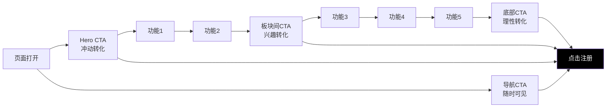
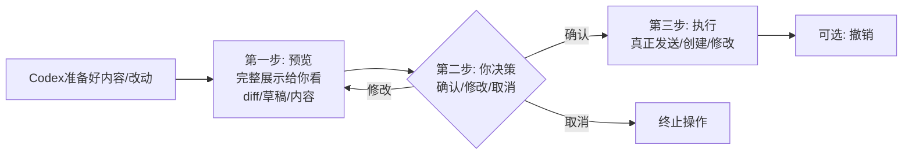
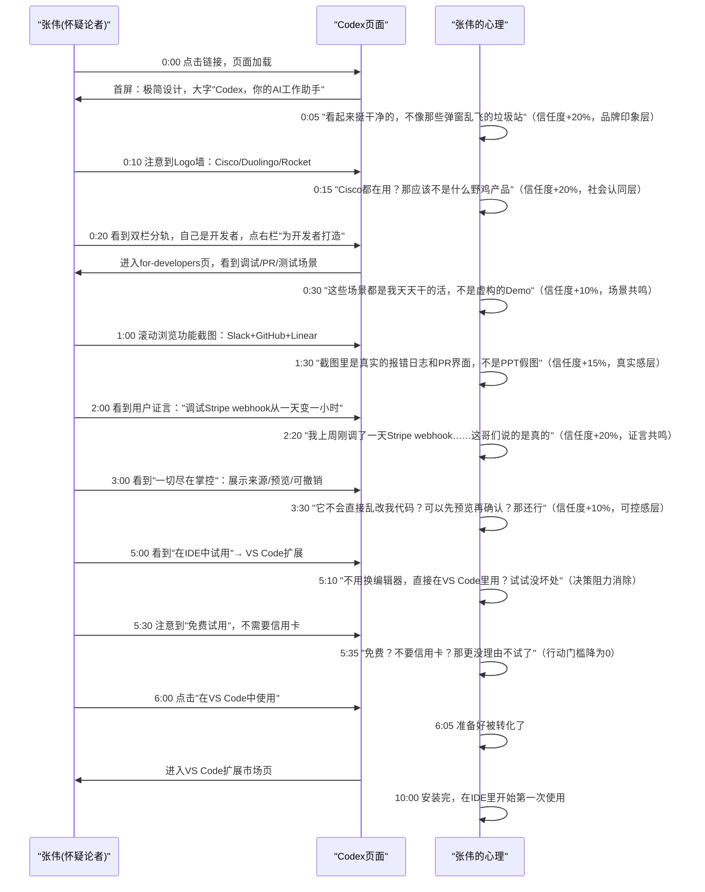
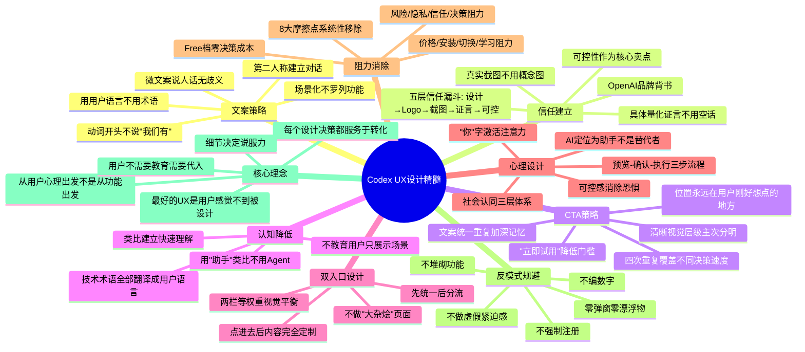

## 一、用户体验整体策略框架

用户体验（UX）不是"按钮好不好看""动画流不流畅"——这些是表层。顶级产品的UX是一整套**说服心理学和行为设计**的系统应用：如何让用户第一眼就懂、如何建立信任、如何降低认知门槛、如何引导用户行动、如何让用户感觉"这是为我设计的"。

ChatGPT Codex 的用户体验设计，是 SaaS 产品转化导向 UX 的教科书级案例。它的每一个文案、每一张图片、每一个按钮位置、每一个板块顺序，背后都有清晰的心理学和行为设计逻辑。

```mermaid
graph TD
    A["Codex UX策略体系"] --> B["文案策略"]
    A --> C["信任建立路径"]
    A --> D["渐进式披露"]
    A --> E["CTA设计策略"]
    A --> F["认知门槛降低"]
    A --> G["双入口设计"]
    A --> H["可控感设计"]
    A --> I["社会认同设计"]
    B --> B1["动词开头"]
    B --> B2["场景化而非功能罗列"]
    B --> B3[第二人称"你"对话感]
    C --> C1["首屏Logo→截图→真实证言→可控性"]
    E --> E1["固定导航CTA"]
    E --> E2["Hero主CTA"]
    E --> E3["板块间引导CTA"]
    E --> E4["底部重复CTA"]
    G --> G1["办公/开发者独立入口"]
    G --> G2["避免信息混淆"]
    H --> H1["AI是助手不是替代者"]
    I --> I1["顶尖企业Logo"]
    I --> I2["真实工程师具体证言"]
```

UX设计的核心目标只有一个：**消除从"访客"到"满意用户"路径上的所有阻力**——包括认知阻力（看不懂）、信任阻力（不敢信）、决策阻力（选哪个）、行动阻力（太麻烦）。

---

## 二、文案策略：用用户的语言说话

文案是 UX 最重要的元素，没有之一。用户看页面，80% 的注意力在文字上——图片是辅助，文字才是传递价值的核心。Codex 的文案策略有三个核心原则，值得所有产品学习。

### 2.1 原则一：动词开头，不说"我们有什么"，说"你能做什么"

很多网站的文案是"功能视角"：
> ❌ "Codex 拥有强大的连接器集成能力，支持Gmail、Slack、GitHub等多种工具，可以实现跨平台信息检索。"

这种文案在说"我们有什么功能"，用户看完的反应是"哦，然后呢？跟我有什么关系？"

Codex 的文案是"用户视角+动词开头"：
> ✅ "把任务背后的文件、对话、代码和系统关联起来，基于真实材料与 Codex 协同工作。"

对比一下：
- 不说"我们有连接器"，说"把...关联起来，基于真实材料协同工作"——直接说你能做什么
- 动词开头："把...关联""协同工作""产出""创建"——有行动感，有画面感
- 主语是"你"（省略，但语义上是你在做，Codex在帮你），不是"Codex能..."

**五大功能的标题文案**：

| 功能 | 文案（动词开头） | 为什么好 |
|---|---|---|
| 功能1 | **把任务背后的文件...关联起来，作为你的研究助手** | "把...关联" 是用户动作，"研究助手"是用户获得的角色 |
| 功能2 | **产出你可以直接评审、完善和使用的工作成果** | "产出"直接说结果，"评审、完善、使用"告诉你接下来做什么 |
| 功能3 | **自动抓取最新上下文，将卓越实践变成可重复流程** | "自动抓取"说动作，"变成可重复流程"说价值 |
| 功能4 | **服务于团队的日常工作，从KPI汇报、管线更新到代码改动** | "服务于日常工作"直接说场景，后面列具体例子 |
| 功能5 | **展示来源、假设、改动及后续步骤，一切尽在你的掌控之中** | "展示..."是透明动作，"尽在掌控"是用户获得的安全感 |

**文案写作公式**：**[动词] + [具体对象] + [你能获得什么结果/价值]**

### 2.2 原则二：场景化描述，不是功能罗列

什么是"场景化"？就是**描述一个具体的人在具体的情境下做具体的事**，让用户看到文案立刻想到"哦，这就是我！"

反例（功能罗列）：
> ❌ "Codex 支持多种文档格式导出，可以生成简报、电子表格、幻灯片、消息。支持自动化工作流。"

用户看完："所以呢？什么时候我会需要这个？"

正例（场景化）：
> ✅ "当你需要调查批发订单物流为什么延迟时，Codex 会自动查找邮件、Slack消息、物流数据，给你完整的时间线和处理建议。"
>
> ✅ "当Stripe扣费出问题时，Codex帮你分析日志、定位根因、写修复代码、提交PR、同步给团队。"

场景化文案的魔力：
1. **激活镜像神经元**：用户看到描述的场景，大脑会自动代入"如果是我遇到这个情况..."
2. **具体比抽象有说服力**："调查批发订单延迟"比"智能分析"有说服力100倍
3. **记忆点强**：用户可能记不住"跨工具信息检索"这个功能点，但会记住"它能帮我查订单为什么延迟"
4. **教育用户如何使用**：场景本身就是最好的教程——用户看完就知道"原来可以这么用"

**Codex 中典型的场景化文案**：

| 场景类型 | 场景化文案示例 |
|---|---|
| **办公场景** | "调查批发订单物流延迟、准备客户续约材料、生成周团队周报" |
| **开发场景** | "用日志/Slack/Linear调试Stripe扣费问题、创建自动化流程、审查PR" |
| **团队场景** | "KPI汇报、财务审计、招聘资料包、客户QBR准备、Bug漏斗分析" |

注意这些例子都是**具体到不能再具体的事情**——不是"提高效率"这种空话，而是"调试Stripe扣费问题"这种每个工程师都遇到过的真实痛点。

### 2.3 原则三：第二人称"你"，建立对话感

读 Codex 的文案，你会感觉像一个人在跟你说话，而不是一个公司在对着大众做广告。秘密就是大量使用第二人称"你"：

- "你的AI工作助手"（不是"AI工作助手"）
- "把任务背后的文件...关联起来"（你把，不是"用户可以"）
- "产出你可以直接评审的工作成果"（你评审，不是"供用户评审"）
- "一切尽在你的掌控之中"（你的掌控，不是"用户可控"）
- "顶尖团队都在使用"（社会认同，暗示"你也应该和他们一样"）

对比一下：
> ❌ "Codex是一款AI工作助手，可以帮助用户提高工作效率。"
> （第三人称，距离感，像说明书）

> ✅ "Codex，你的AI工作助手。"
> （第二人称，对话感，像朋友跟你介绍一个好用的工具）

**"你"字的心理学原理**：
- 人对自己的名字和指代自己的词天生敏感——大脑会自动激活注意力
- 第二人称建立对话感，让单向的信息传递变成双向的"我在跟你说话"
- 产生代入感——用户会不自觉地把自己放进文案描述的场景里
- 建立归属感——"你的助手"意味着这是属于你的、为你服务的东西

文案中"你"出现的频率，是判断文案是否有"用户视角"的最简单指标。数一数Codex页面上有多少个"你"，再去看看很多国内网站的文案——区别一目了然。

### 2.4 微文案设计：被忽略的转化杀手

"微文案（Microcopy）"指的是按钮文字、提示文字、错误信息、空状态文字、加载文案这些"小地方"的文字。它们虽然短，但对转化率和体验的影响极大——一个词之差，点击率可能差30%以上。

**Codex 微文案的精妙设计**：

| 微文案位置 | Codex文案 | 反面文案 | 为什么Codex更好 |
|---|---|---|---|
| **主CTA按钮** | "立即试用 Codex" | "立即注册"、"免费开始" | "试用"零门槛暗示，"Codex"重复品牌 |
| **功能区链接** | "了解更多 →" | "查看详情"、"点击进入" | 箭头暗示继续探索，语气自然不命令 |
| **平台下载入口** | "在VS Code中使用"、"在终端中使用" | "下载"、"安装" | 描述使用场景而非操作动作，降低安装心理负担 |
| **定价页按钮** | "升级"、"开始使用" | "立即购买"、"订阅套餐" | "升级"暗示变得更好，"购买"太商业化 |
| **企业版入口** | "联系销售" | "申请演示"、"获取报价" | 直接说找销售，坦诚不绕弯 |
| **证言引言标记** | "— 姓名，职位 @公司" | 匿名"某用户" | 真实名字+公司增强可信度 |
| **分栏入口标题** | "为工作打造" / "为开发者打造" | "解决方案A" / "解决方案B" | 第二人称直接对号入座 |

**微文案设计的三个黄金法则**：
1. **说人话，不说机器话**：不要说"请输入有效凭据"，说"邮箱或密码不对，再试一次"
2. **消除歧义**："提交"有歧义（提交什么？提交后发生什么？），"发送邮件给团队"清清楚楚
3. **给确定性**：用户在犹豫时，微文案要给他确定感——"试用"比"注册"确定（知道不花钱），"预览"比"执行"确定（知道不会立刻发生）

---

## 三、信任建立路径：从陌生到放心

信任不是一下子建立的，是一个**层层递进、逐步加深**的过程。Codex 设计了一条非常清晰的信任建立路径，从用户打开页面开始，每一屏都在增加信任度，直到用户足够放心点击"立即试用"。

### 3.1 信任建立的五层漏斗

```mermaid
graph TD
    A["访客打开页面<br/>信任度: 0%"] --> B["第一层: 品牌印象<br/>首屏专业极简设计<br/>信任度: 20%"]
    B --> C[第二层: 社会认同<br/>客户Logo墙<br/>"Cisco/Duolingo这些大公司都在用"<br/>信任度: 40%]
    C --> D[第三层: 真实感建立<br/>真实产品截图<br/>"这不是概念，是真长这样"<br/>信任度: 60%]
    D --> E[第四层: 用户证言<br/>6位开发者真实引述<br/>"和我一样的人用了说很好"<br/>信任度: 80%]
    E --> F[第五层: 可控感承诺<br/>"一切尽在掌控"<br/>来源透明/预览/可撤销<br/>信任度: 95%]
    F --> G["点击试用<br/>信任度足够"]
    style A fill:#ffcccc
    style B fill:#ffe0b2
    style C fill:#fff9c4
    style D fill:#c8e6c9
    style E fill:#b2ebf2
    style F fill:#e1bee7
    style G fill:#c8e6c9
```

| 信任层级 | 页面位置 | 信任信号 | 解决用户什么疑虑 |
|---|---|---|---|
| 第一层：品牌印象 | Hero首屏 | 简洁专业的设计、清晰的定位、大牌Logo | "这是不是个小作坊产品？看起来靠谱吗？" |
| 第二层：社会认同 | Hero下方Logo墙 | Cisco、Instacart、Duolingo、Vanta、Virgin Atlantic——各行业顶尖公司 | "大公司都在用，应该不是骗人的" |
| 第三层：真实感 | 五大功能截图 | 真实的产品界面截图，有真实内容（不是空界面） | "这是真的产品吗？还是PPT概念？" |
| 第四层：同类证言 | for-developers页 | 6位真实开发者（有名有姓有公司）的具体评价 | "和我一样的人用了真的觉得好吗？" |
| 第五层：可控感 | 功能5 | 来源透明、假设明示、改动预览、可撤销 | "它会不会乱搞？做错了怎么办？我能控制吗？" |

### 3.2 第一层：品牌设计建立第一印象

信任从第一眼开始。用户打开页面，0.1秒内就会形成"这个产品靠不靠谱"的第一印象——这个判断来自设计，不来自内容。

Codex 建立第一印象的设计语言：
- **极简克制**：没有乱七八糟的弹窗、没有飘动的客服图标、没有花哨的动画——专业感来自克制
- **排版工整**：文字层级清晰、对齐工整、间距舒适——细节精致暗示产品可靠
- **品牌一致**：色彩统一、组件统一、风格统一——一致性是专业度的信号
- **加载快速**：页面秒开、没有大体积资源加载等待——技术实力的第一体现

想想看：如果一个网站一打开弹个窗、飘个广告、文字歪歪扭扭、配色乱七八糟——哪怕它后面内容写得再好，你也会先入为主觉得"这产品不怎么样"。设计就是产品的"门面"，门面不干净，顾客不会进门。

### 3.3 第二层：客户Logo社会认同

首屏Logo墙的设计，我们在第三章已经讲过视觉处理（灰度、等大），这里讲它的心理学作用：

**为什么Logo墙能建立信任？**
1. **权威暗示**：Cisco是网络巨头，Duolingo是知名产品——这些公司选用的产品，一定经过了严格评估，不会差
2. **相似性吸引**："Virgin Atlantic（航空业）都在用，我们公司（非科技）也能用"——跨行业客户暗示产品普适性
3. **从众效应**："大家都在用，我用应该也没问题"——不确定的时候，从众是最安全的决策
4. **风险转移**："这么多大公司都用了，就算有问题也不是我一个人踩坑"——降低决策风险

**Logo选择的智慧**（为什么是这5个？）：
- 不是全放科技公司——避免让人觉得"这只是程序员用的"
- 有消费级品牌（Duolingo）——普通人也认识，降低认知门槛
- 有传统行业（Virgin Atlantic航空）——打消"只有互联网公司能用"的疑虑
- 有安全合规公司（Vanta）——暗示产品安全合规性过关

### 3.4 第三层：真实截图建立真实感

很多产品网站用抽象插画、3D渲染图、概念图——这些图"好看"但不建立信任。Codex从头到尾用**真实产品截图**，这是建立真实感的关键：
- 截图里有真实内容：Stripe报错日志真的是报错日志的样子，Slack消息真的像Slack，不是占位的"Lorem ipsum"文字
- 截图展示真实场景：不是空的界面，是正在使用中的状态——用户看到立刻能想象自己用的时候是什么样
- 截图细节逼真：界面元素、字体、颜色、布局都和真实产品一致——用户点进去发现"真的和截图一样"，预期一致就产生信任

**反例是什么样的？**
很多AI产品网站放一个"发光的大脑"、"抽象的几何网络"、"握手的商务照片"——用户看完只觉得"这美工不错"，但不知道产品长什么样、能做什么，信任建立为零。

### 3.5 第四层：真实用户证言

客户Logo是"公司背书"，真实用户证言是"个人背书"。对于工具类产品，后者有时候更有说服力——因为决策者是个人（"我要用这个工具"），他更相信和自己一样的人的话。

Codex的用户证言不是那种"XX公司CEO：这是革命性的产品"这种空话套话，而是**具体到人的、有细节的、有量化数据的证言**。

**证言的结构公式**：
> [我是谁/什么角色] + [在什么具体场景下] + [以前有多痛苦/多久] + [用了Codex之后怎么样] + [量化数据：节省多少时间/提升多少效率]

**典型示例模式**：
> "作为[职位]，[之前做某件事需要多长时间/多痛苦]。用了Codex之后，[现在多长时间搞定/变得多简单]，[具体量化：节省了X%时间/周末不用加班了/本来要做一周的事一下午搞定]。"

这种证言的力量在于**具体和可代入**：
- 有名有姓有公司——不是匿名的"某用户"，是真实存在的人
- 有具体场景——不是"提高效率"，是"调试Stripe webhook问题"
- 有前后对比——"以前要花一整天，现在一小时"
- 有真实情感——"我周末本来要加班重构，结果Codex帮我一下午搞定了"

当一个程序员读到"我周末用Codex搞定了整个季度的代码重构"时，他想的不是"这广告词写得不错"，而是"我下个季度也有重构要做，周末不想加班——我也试试"。

### 3.6 第五层：可控感消除终极顾虑

前面四层建立了"产品好、有人用、是真的"的信任，但还有最后一个终极顾虑："它是AI，它会不会自作主张搞砸我的东西？"

第五个功能"一切尽在你的掌控之中"就是专门解决这个顾虑的。它不是一个"附加功能"，而是信任闭环的最后一块拼图——告诉用户：
- 它不会偷偷做事（预告+预览）
- 你知道它为什么这么做（来源透明+假设明示）
- 你可以阻止它（确认后才执行）
- 做错了能改回来（可撤销）
- 你始终是老板，它是助手（控制权在你）

把"可控性"作为五大功能之一单独拿出来讲，这个设计决策本身就非常聪明——它传递的信息是："我们知道你担心什么，我们把这个问题解决得很好，好到值得作为核心功能来讲。"

---

## 四、CTA设计策略：在用户想行动的时候按钮就在那里

CTA（Call to Action，行动召唤）是转化的最后一步。CTA设计不只是"按钮长什么样"，而是**"在用户决策路径的每个节点，按钮是否在他刚好想点的地方"**。

### 4.1 CTA的四次重复策略

Codex 页面上 CTA"立即试用 Codex"不是只出现一次，而是在不同位置反复出现——但又不会让你觉得被骚扰，因为每次出现的时机都是用户刚好可能想点的时候：

| CTA位置 | 出现时机 | 用户心理状态 | CTA作用 |
|---|---|---|---|
| **导航栏固定CTA** | 任何滚动位置，始终可见 | 任何时候突然想试用 | 给冲动型用户一个随时可点的出口 |
| **Hero区域主CTA** | 首屏正中央，最醒目的按钮 | 刚打开页面，被定位和Logo打动，想试试 | 抓住3秒冲动转化 |
| **功能板块之间引导CTA** | 看完1-2个功能，兴趣被勾起来 | "有点意思，想试试" | 兴趣最高的时候推一把 |
| **底部大CTA区块** | 页面最底部，看完所有内容 | "我已经看完了，确实想试试" | 给深思熟虑型用户最后的行动点 |



这就是"重复但不骚扰"的艺术：
- **决策速度不同的用户都能被覆盖**：急性子看完首屏就点，慢性子看完所有内容才点——都有CTA在
- **位置合理不突兀**：CTA都在视觉流的自然终点，不是突然弹出来挡你路
- **主次分明**：同一屏永远只有一个最醒目的主CTA，其他都是次要的文字链接
- **文案统一**：所有主CTA都是"立即试用 Codex"——重复文案加深记忆，降低决策成本

### 4.2 CTA按钮的视觉层级设计

不是所有按钮都一样重要。Codex建立了清晰的**CTA视觉层级**，引导用户注意力优先到最主要的行动上：

| CTA层级 | 样式 | 使用场景 | 视觉重量 |
|---|---|---|---|
| **主CTA（Primary）** | 纯黑/纯白背景（反色）、白色/黑色文字、最大号、圆角适中 | Hero、导航栏、底部大CTA | ★★★★★ 最高，绝对视觉焦点 |
| **次CTA（Secondary）** | 白底黑边/透明背景黑边、黑色文字、中号 | "了解更多"、"查看定价"等次要行动 | ★★★ 中等，不抢主CTA风头 |
| **文字CTA（Tertiary）** | 无背景、文字+箭头图标、小号 | 卡片内链接、"查看全部" | ★ 最轻，需要时能找到 |
| **导航文字链接** | 纯文字、无下划线、hover变色 | "登录"、导航项 | ☆ 最弱，不干扰主动转化 |

视觉层级的关键是**对比和克制**：
- 主CTA和周围元素对比越强，越能吸引注意力
- 次要按钮主动降级（变边框/变小/变文字），不抢戏
- 永远不要在同一屏放两个一样醒目的主CTA——用户会选择困难，结果是两个都不点

### 4.3 CTA文案设计：动词+明确价值

CTA按钮上写什么字，对点击率影响巨大。Codex的主CTA文案是"立即试用 Codex"——我们来拆解为什么这么写：

**CTA文案要素分析**：

| 要素 | 文案内容 | 作用 |
|---|---|---|
| **动词开头** | "立即" | 制造紧迫感、行动感 |
| **明确动作** | "试用" | 不是"购买"、"注册"——降低心理门槛，"试用"意味着不用花钱、不用承诺、可以随时走 |
| **明确对象** | "Codex" | 品牌名重复，加深记忆 |

**对比几个常见CTA文案的优劣**：

| CTA文案 | 问题 | 为什么"立即试用"更好 |
|---|---|---|
| "立即注册" | "注册"让人联想到填表、设密码、花时间——有门槛 | "试用"更轻，没有压力 |
| "免费开始" | 太虚，"开始"什么？ | "试用 Codex"明确说了试什么 |
| "了解更多" | 太弱，行动指令不明确 | 明确让你"试用"，不是"了解" |
| "立即购买" | 太重，第一次访问就叫人买，吓跑用户 | "试用"暗示零/低成本尝试 |
| "开始使用" | 还行，但没提品牌名 | 重复品牌名Codex，加深印象 |

"试用"这个词选得特别好——它的心理暗示是：
- 你不需要付钱（免费试）
- 你不需要承诺（试了不好可以走）
- 你只需要花一点点时间（试一下而已，不麻烦）
- 你现在就可以开始（立即）

这把注册/试用的心理门槛降到了最低。

---

## 五、降低认知门槛：不用术语讲AI能力

AI产品最大的认知门槛是：技术术语太多，普通用户听不懂。"Agent""Tool use""Chain of Thought""RAG"——这些词工程师懂，但普通办公用户根本不知道是什么意思。

Codex 的策略是**彻底的用户语言**：不用任何技术术语解释AI能力，全部用普通人能听懂的类比和场景化描述。

### 5.1 术语→用户语言翻译表

| 技术术语/AI黑话 | Codex怎么说（用户语言） | 为什么后者更好 |
|---|---|---|
| Agent（智能体） | "你的研究助手"/"AI工作助手" | "助手"所有人都懂，知道助手是干什么的 |
| Tool Use / Function Calling（工具调用） | "连接你正在使用的工具" | 不说技术机制，说你能获得什么能力 |
| RAG / 检索增强生成 | "基于真实材料协同工作" | 不说怎么实现的，说用什么基础工作 |
| Multi-step Reasoning（多步推理） | "帮你调查、分析、给你建议" | 描述用户能看到的结果，不是内部过程 |
| Workflow Automation（工作流自动化） | "把卓越实践变成可重复流程" | 不说"工作流"，说"你做得好的事以后自动做" |
| Sandbox Execution（沙箱执行） | （根本不提，只说"你可以预览再确认"） | 用户不关心沙箱，只关心"会不会搞坏我东西" |
| Generative UI（生成式UI） | （根本不提，只展示真实截图） | 用户不关心什么UI范式，只关心"长什么样" |

这个策略的核心是：**用户不关心你怎么实现的，只关心"这对我有什么用、我需要知道什么"**。

- 你的车是燃油车还是电动车、发动机什么结构——多数车主不关心，他们只关心"车能开、好开、安全"
- AI是用RAG还是微调、是不是Agent——多数用户不关心，他们只关心"能帮我干活、不会搞砸、好用"

工程师出身的产品团队最容易犯的错误就是"忍不住讲技术"——觉得"我们用了Agent这么牛的技术为什么不说？"但对用户来说，你说"我们用了最先进的Agent架构"和不说没区别，因为他不懂。你说"它是你的研究助手，帮你查邮件找信息"，他立刻就懂了。

### 5.2 用类比建立快速理解

对于复杂概念，Codex用**用户已经理解的类比**来解释，不需要重新教育用户：

| 概念 | 类比 |
|---|---|
| Codex是什么 | "你的AI工作助手"——每个人都知道助手是做什么的（帮你找信息、帮你干活、听你指挥） |
| 连接器是什么 | "连接你正在使用的Gmail、Slack、Drive"——就像助手能进你的文件柜找资料 |
| 可控性设计 | "一切尽在你的掌控之中"——就像人类助手做事会跟你确认，不会擅自做主 |
| 流程自动化 | "把卓越实践变成可重复流程"——就像你带会了一个助手，以后这件事他就按你教的做 |

类比是认知的捷径——用用户已经知道的东西，解释他不知道的东西，不需要从零开始教育。

---

## 六、双入口设计：不让任何一类用户困惑

Codex 同时面向两类差异很大的用户：办公用户和开发者。这是一个设计难题：如果只讲开发场景，运营/HR/财务看不懂；如果只讲办公场景，程序员觉得"这不是给我用的"；如果混在一起讲，两边都觉得"好像跟我关系不大"。

Codex 给出的解决方案是**双入口分流设计**，我们在信息架构章节提过，这里从体验角度深度分析。

### 6.1 双轨分流的体验设计

```mermaid
graph TD
    V["访客打开首页"] --> H[Hero: 统一品牌认知<br/>"你的AI工作助手"]
    H --> S["双栏分流"]
    S --> L[左栏: 为工作打造<br/>办公场景图标+文案<br/>"文档/表格/KPI/审计"]
    S --> R[右栏: 为开发者打造<br/>开发场景图标+文案<br/>"代码/调试/PR/测试"]
    L --> PL["进入: /codex/for-work<br/>全是办公场景+办公用户证言"]
    R --> PR["进入: /codex/for-developers<br/>全是开发场景+开发者证言"]
    PL --> CTA1["立即试用"]
    PR --> CTA2["立即试用"]
    style L fill:#e3f2fd
    style R fill:#e8f5e9
    style PL fill:#e3f2fd
    style PR fill:#e8f5e9
```

**双入口设计的体验细节**：

| 设计细节 | 为什么这么做 |
|---|---|
| **首屏Hero统一不分流** | 先建立统一品牌认知，"Codex是什么"这个问题用同一个答案回答 |
| **Hero之后立刻分流** | 用户刚看完"这是AI工作助手"，立刻问"你是哪种用户？"，不让他往下翻找 |
| **两栏视觉权重相等** | 左栏和右栏一样大、一样醒目——不暗示哪类用户"更重要" |
| **每栏只讲该类用户关心的场景** | 左栏列KPI/财务/招聘，右栏列调试/PR/测试——用户一眼就知道"这边是讲给我听的" |
| **点进去后完全定制** | /for-work 页没有代码截图，/for-developers 页没有财务审计场景——彻底沉浸式，没有噪音 |

### 6.2 为什么不做"一个页面讲完所有人"？

很多产品会想："我们能不能一个页面同时说服办公用户和开发者？"答案是：几乎不可能，而且体验很差。

**如果混在一起讲会发生什么**：
- 办公用户看到PR、代码、调试，想："这是程序员的工具，不是给我用的"，走了
- 开发者看到周报、财务、招聘，想："这是办公软件，不是给我写代码的"，走了
- 两边都觉得"这东西好像跟我关系不大"，转化率极低

**双入口的优势**：
1. **自我选择**：用户自己选"我是哪类"，选完看到的全是为他定制的内容
2. **场景纯净**：点进去后没有不相关的信息噪音，代入感强
3. **转化提升**：定制化页面的转化率永远比"大杂烩"页面高
4. **精准数据**：可以分别追踪哪类用户转化好、哪类需要优化

双入口设计的本质是：**承认用户差异，尊重差异，为不同用户打造不同的第一印象**。

---

## 七、可控感设计：AI是助手，不是替代者

AI产品普遍面临一个心理障碍：用户害怕"AI取代我"、"AI乱搞我控制不了"。Codex的"一切尽在你的掌控之中"不仅是一个功能，更是一套完整的体验设计策略，用来化解这个恐惧。

### 7.1 定位上：助手，不是替代者

Codex所有文案和设计都在传递一个信息：**AI是你的助手，你是老板**。

| 设计选择 | 传递的信号 |
|---|---|
| 叫"助手"不是"自动驾驶"、不是"自动完成" | 助手是帮你干活的，最终决策者是你 |
| "你可以直接评审、完善" | 产出是给你评审的，不是直接就发出去了 |
| "展示来源、假设、改动" | 它不黑箱操作，做什么都给你看 |
| 所有写操作要你确认 | 它不会擅作主张，最后拍板的是你 |
| 可以撤销 | 就算你没看仔细错了，也能改回来 |

仔细品一品这个定位：**它不是来取代你的工作的，是来帮你干活的**。就像一个优秀的人类助理——你交代任务，他去执行，做完给你审核，你说OK就发，你说改就改，控制权始终在你手上。

这个定位极大降低了用户的心理防御：
- 不用担心"AI抢我饭碗"——它只是帮你做那些你不想做的重复活
- 不用担心"AI乱来"——它做什么你都看得见，都要你确认
- 不用觉得"用AI显得我无能"——好的领导者都有好助手，用助手是效率高，不是能力差

### 7.2 "预览→确认→执行"三步流程体验

所有实质性操作（发邮件、提PR、发消息、改任务），Codex都遵循统一的三步流程：



这个流程体验的心理作用：
1. **预期明确**：用户知道"点确认之前什么都不会发生"——有安全感
2. **主动权在我**：不是AI做完了通知我，是AI准备好等我拍板
3. **错误可拦截**：就算AI做得不对，预览阶段我就能发现，不会发出去
4. **压力降低**：用户知道"我有最终检查权"，就敢让AI做更多事

这和人类助手的工作模式一模一样：好的助手不会先斩后奏，他会说"老板，邮件我起草好了，你看一下，没问题我就发了"。Codex就是这样设计的。

---

## 八、社会认同设计：让用户说服用户

社会认同（Social Proof）是影响力六原则中最强大的武器之一——当人不确定的时候，会看其他人怎么做，然后跟着做。Codex在社会认同的设计上做得非常系统，不止是Logo墙和证言。

### 8.1 三层社会认同体系

```mermaid
graph TD
    A["社会认同体系"] --> B["第一层: 企业级认同<br/>顶尖公司Logo"]
    A --> C["第二层: 同行认同<br/>真实用户证言"]
    A --> D[第三层: 行动暗示<br/>"顶尖团队都在使用"]
    B --> B1["大公司背书, 建立权威信任"]
    C --> C1["同类人推荐, 建立情感共鸣"]
    D --> D1["从众暗示, 推动行动"]
```

### 8.2 "顶尖团队都在使用"这句文案的力量

Logo墙上方有一句短短的文案："顶尖团队都在使用"。这句话看起来简单，其实是非常精妙的社会认同设计：

- **"顶尖团队"**：不是"一些公司"、不是"我们的客户"，是"顶尖团队"——暗示用这个产品的都是优秀的团队，你用了你也是顶尖的
- **"都在"**：不是"有些"、不是"很多"，是"都在"——暗示这是普遍共识、行业标准
- **"使用"**：不是"试用"、不是"考虑"，是"正在使用"——是现在进行时，已经在用了

短短7个字，三个层面的暗示同时生效，比写一段"我们深受客户信赖"有力100倍。

### 8.3 用户证言的"量化数据"技巧

我们前面讲过证言结构，这里特别强调"量化数据"的力量：

| 模糊证言（无力） | 量化证言（有力） |
|---|---|
| "Codex大大提升了我的效率" | "Codex帮我节省了大概40%的调试时间" |
| "用Codex做事情快多了" | "以前要花一整天的Bug排查，现在一小时左右搞定" |
| "Codex改变了我的工作方式" | "我本来计划周末加班做季度重构，结果Codex帮我一个下午就做完了" |

为什么带数字的证言更有说服力？
1. **具体性=真实性**：能说出"40%""一个下午""一小时"，说明是真实经历，不是编的广告词
2. **可感知**："节省40%时间"用户能算出来"那我每周能省一天"，"提升效率"没感觉
3. **可信度高**：说谎话一般说模糊的大词，说真话才说具体细节
4. **可对比**：用户可以对标"他花一小时，我现在要花一天，那确实能帮我省时间"

### 8.4 证言的人物选择

Codex选的6位证言用户不是随便选的，覆盖了不同角色、不同公司类型：
- 有初创公司工程师，也有大公司Tech Lead
- 有前端也有后端
- 有开源维护者也有企业开发者

这让每个开发者看的时候，都能找到一个"和我差不多的人"——"他也是做后端的，他说好用，那我用应该也好用"。

社会认同的最高境界是：**用户看到证言，心里想"这个人跟我一样，他说的我信"**。

---

## 九、场景还原与UX反模式

前面八章拆解了UX的各个维度，现在我们用一个完整场景把所有元素串起来，然后对比常见的UX反模式。

### 9.1 场景还原：怀疑论者张伟的10分钟转化旅程

张伟是一家中型公司的技术经理，被同事在Slack里分享了一个链接："你看下这个，据说AI能帮写代码"。张伟对AI工具持怀疑态度——之前试过好几个，都是Demo好看实际不好用。我们追踪他打开Codex页面后的心理变化：



**这个旅程的UX设计关键点**：
1. **前5秒定生死**：极简设计+Logo墙在5秒内建立第一印象，让怀疑论者没有立刻关掉页面
2. **自我选择降低防御**：张伟自己选择"开发者"路径，不是被硬塞营销内容
3. **每个疑虑都被对应解决**："是不是假的？"→真实截图；"是不是Demo？"→真实证言；"会不会乱搞？"→可控性；"要花钱吗？"→免费试用；"要换工具吗？"→VS Code直接用
4. **CTA在怀疑消散时出现**：不是一上来就催你注册，而是等信任建立到一定程度才推行动
5. **10分钟内完成转化**：从"AI都是骗人的"到"安装完在IDE里用"，整个过程10分钟

### 9.2 决策阻力消除：Codex移除的8个Friction点

转化路径上的每一个"犹豫"都会流失用户。Codex系统性地识别并移除了以下阻力：

| 阻力点 | 用户的疑虑 | Codex的解法 |
|---|---|---|
| **价格阻力** | "会不会很贵？要不要绑信用卡？" | Free档免费可用，"试用"暗示零成本，不要求信用卡 |
| **安装阻力** | "要不要下载安装包？会不会很麻烦？" | 7个平台入口，Web端零安装即用，IDE扩展一键安装 |
| **切换阻力** | "我已经有工具链了，不想换" | 做插件不替换：VS Code扩展、CLI、桌面端，在你现有工具里用 |
| **学习阻力** | "学新工具会不会很难？" | 用"助手"类比，场景化展示，打开就能用不需要培训 |
| **风险阻力** | "AI做错事怎么办？搞砸了谁负责？" | 预览→确认→执行三步流程，所有写操作需确认，可撤销 |
| **隐私阻力** | "它会不会读我所有代码/邮件？" | Business/Enterprise版强调数据安全，连接器按需授权 |
| **信任阻力** | "这公司靠谱吗？会不会跑路？" | OpenAI品牌背书+大公司Logo墙+真实用户证言 |
| **决策阻力** | "选哪个套餐？从哪个入口进？" | 双入口分流（办公/开发），6档定价各有清晰定位，Free档零决策成本 |

### 9.3 UX反模式：8个常见错误及Codex的规避

| UX反模式 | 典型表现 | 危害 | Codex的做法 |
|---|---|---|---|
| **弹窗式欢迎** | 一打开页面弹个"订阅通讯！""预约演示！"窗口 | 打断首屏体验，用户第一反应是关掉弹窗，关完就走 | 零弹窗，首屏纯净 |
| **漂浮客服图标** | 右下角飘个"有问题问我"的机器人头像 | 遮挡内容，一直晃，像牛皮癣 | 无漂浮客服，需要帮助去文档站 |
| **自动播放视频** | 首屏背景视频自动播放带声音 | 加载慢、耗流量、打扰用户、办公室社死 | 首屏静态，视频需用户主动点击播放 |
| **虚假紧迫感** | "仅剩3个名额！""优惠24小时后结束！" | 对B端/工具产品无效，反而显得不专业不诚实 | 无任何虚假紧迫感，信任是靠产品本身 |
| **社交证明造假** | "已有1,234,567位用户使用"这种滚动数字 | 用户一看就知道是假的，信任瞬间崩盘 | 用真实Logo+真实人名+真实证言，一个数字都不编 |
| **强制注册才能看** | 必须注册登录才能看到产品详情/定价 | 用户还没被说服就要注册，80%直接走 | 所有功能介绍、定价、文档完全开放，想注册才注册 |
| **功能堆砌首页** | 首页列20个功能点密密麻麻 | 信息过载，用户哪个都记不住 | 首页只讲5大核心功能，每个配场景+截图，其他在子页 |
| **Cookie横幅挡屏** | 满屏Cookie授权横幅挡住核心内容 | 第一屏就被法律声明挡了，体验极差 | Cookie横幅极简小条，不遮挡核心内容 |

### 9.4 UX自检清单

审查产品官网的用户体验设计时，可以用以下清单：

- [ ] 文案是否动词开头、第二人称"你"、场景化描述？
- [ ] 信任路径是否完整：设计→Logo→截图→证言→可控性？
- [ ] CTA是否覆盖了冲动型和深思熟虑型用户？
- [ ] 是否用了技术术语让非技术用户看不懂？
- [ ] 不同用户群是否有独立的体验路径？
- [ ] AI产品是否主动解决了"可控感"焦虑？
- [ ] 社会认同是否具体（真实人名+公司+量化数据）？
- [ ] 微文案是否说人话、无歧义、给确定性？
- [ ] 是否存在弹窗/漂浮物/自动播放等打扰性元素？
- [ ] 转化路径上的8大阻力（价格/安装/切换/学习/风险/隐私/信任/决策）是否都有对应解法？

---

## 十、用户体验策略总结

Codex 的用户体验设计不是零散技巧的堆砌，而是一整套**从用户心理出发、沿着转化路径层层推进**的系统设计：



**可直接复用的UX原则**：

1. **文案要说"你能做什么"，不要说"我们有什么"**——动词开头，第二人称，场景化描述。
2. **信任是层层递进的**：设计专业感→大公司在用→真的长这样→和我一样的人说好→我能控制。不要跳过任何一层。
3. **CTA要重复但不骚扰**：导航固定+Hero+板块间+底部——四个位置，覆盖所有决策类型的用户。
4. **不要用技术术语教育用户**：他们不关心你用了Agent还是RAG，只关心"这能帮我干什么"。用类比，用用户语言。
5. **用户差异大就分流，不要试图一个页面说服所有人**——双入口/多入口虽然做起来麻烦，但转化率提升是巨大的。
6. **AI产品要主动解决"可控感"焦虑**：把"尽在掌控"作为核心卖点，预览-确认-执行三步流程，告诉用户AI是助手不是老板。
7. **社会认同要具体不要空洞**：不说"深受信赖"，说"顶尖团队都在使用"；不说"提升效率"，说"节省40%时间，周末不加班"。
8. **微文案是被忽略的转化杀手**：一个词之差可能差30%点击率——"试用"vs"注册"、"升级"vs"购买"、"在VS Code中使用"vs"下载"。
9. **系统性消除8大转化阻力**：价格、安装、切换、学习、风险、隐私、信任、决策——每个阻力都要有对应解法。
10. **每个细节都问自己："这个设计是在帮用户往前走，还是在给他制造阻力？"**——所有阻力都要消除。

### 用户体验 Do / Don't 速查表

| UX决策 | ✅ Do（Codex的做法） | ❌ Don't（常见错误） |
|---|---|---|
| **首屏内容** | 极简设计+大标题+副标题+1个CTA+Logo墙 | 弹窗欢迎+自动播放视频+漂浮客服+轮播图 |
| **文案视角** | 动词开头+第二人称"你"+场景化描述 | "我们拥有""本产品提供"+第三人称+功能罗列 |
| **术语使用** | 全部翻译成用户语言："助手""连接工具""协同工作" | "Agent""Tool Use""RAG""Chain of Thought"黑话满天飞 |
| **CTA文案** | "立即试用 Codex"——动词+试用+品牌名，零门槛 | "立即注册""立即购买""免费开始"——高门槛或模糊 |
| **CTA策略** | 4次重复：导航+Hero+板块间+底部，覆盖所有用户 | 只在底部放一个CTA，或满屏都是大按钮 |
| **信任建立** | 五层漏斗：设计→Logo→真实截图→量化证言→可控承诺 | "深受数百万用户信赖"空话+握手商务照 |
| **用户证言** | 真实人名+职位+公司+量化数据（"节省40%时间"） | 匿名"某企业CEO"+"显著提升效率"空话 |
| **客户Logo** | 跨行业选择+灰度处理+等大排列+"顶尖团队都在使用" | 全放科技公司+彩色大小不一+无说明文字 |
| **多用户群** | 双入口分流，点进去后内容完全定制 | 一个页面混讲所有场景，两边都觉得"不是给我的" |
| **AI定位** | 助手定位，预览→确认→执行，尽在你的掌控 | "全自动""AI取代""自动驾驶"——让用户恐惧失控 |
| **产品截图** | 100%真实产品界面，有真实内容 | 抽象插画+3D渲染+发光AI大脑+概念图 |
| **内容策略** | 首页只讲5个核心功能，渐进披露，想深入自己点 | 首页塞20个功能密密麻麻，信息过载 |
| **访问门槛** | 所有内容/定价/文档完全开放，想注册才注册 | 强制注册/留资才能看产品详情和定价 |
| **紧迫感营造** | 靠产品价值和信任驱动，不搞虚假营销 | "仅剩3个名额""24小时后恢复原价" |
| **微文案** | "在VS Code中使用""了解更多→""升级"——具体无歧义 | "提交""确认""点击这里""查看详情"——模糊命令 |
| **Cookie/法律** | 极简小条，不遮挡核心内容 | 全屏横幅挡住首屏，必须先同意才能看 |

Codex 的UX设计告诉我们：最好的用户体验不是"让用户觉得设计好酷"，而是**让用户在不知不觉中被说服、建立信任、采取行动——整个过程自然流畅，他甚至没感觉到"被设计"了**。这就是UX设计的最高境界。

---

**下一步**：继续阅读 [06 用户交互流程分析](06-user-flow.md)，追踪访客从进入页面到注册转化的完整用户旅程，理解四层CTA转化漏斗设计。
