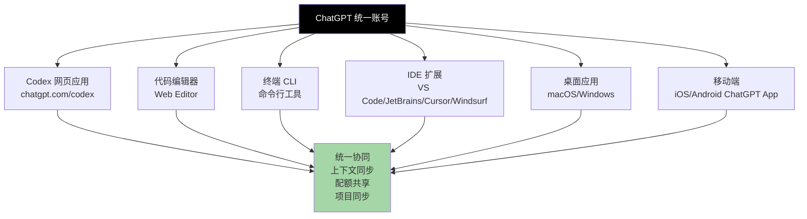
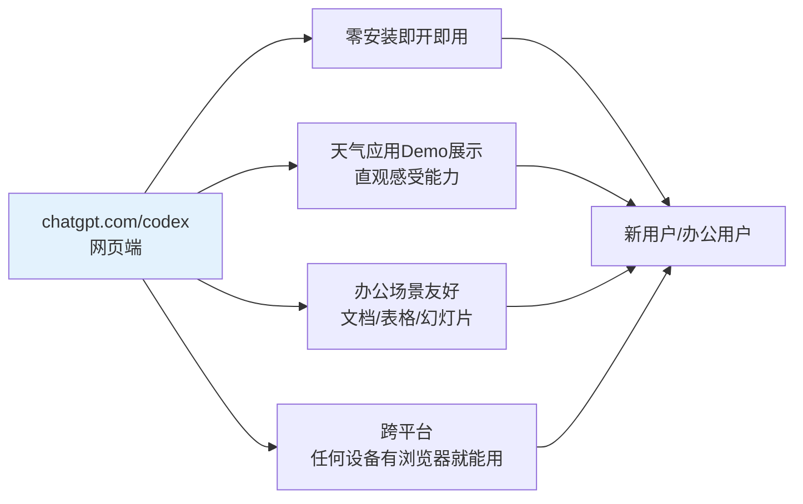
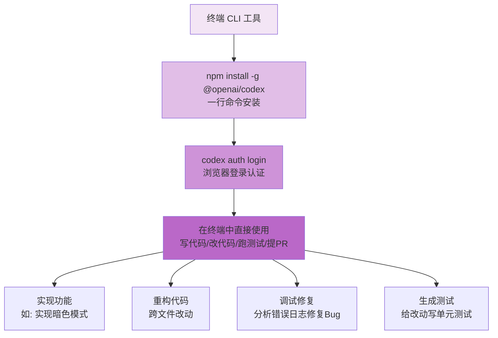
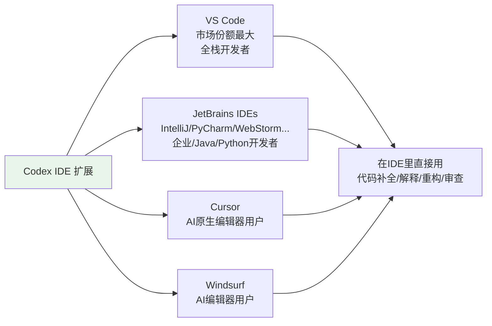
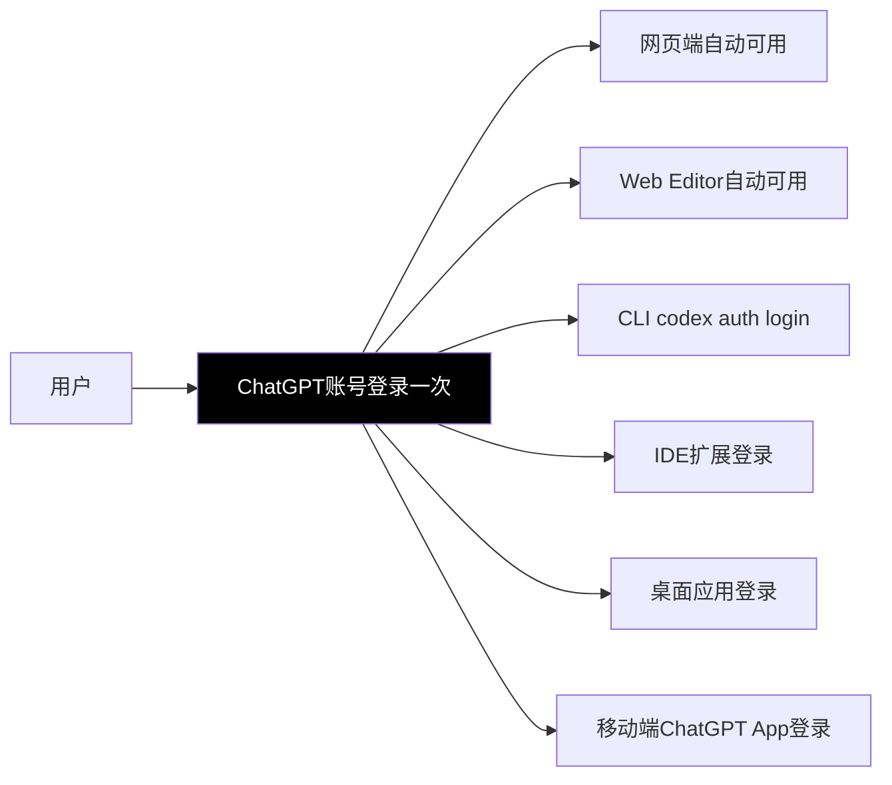
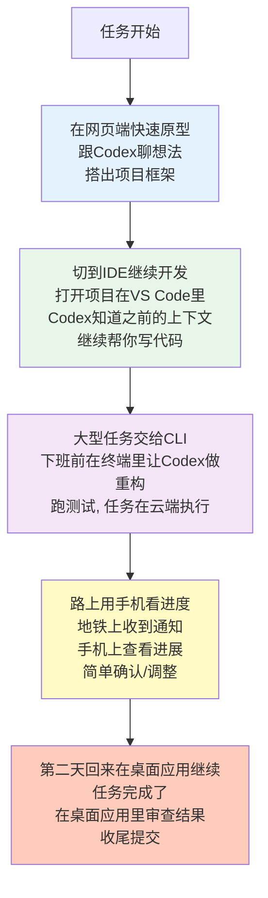
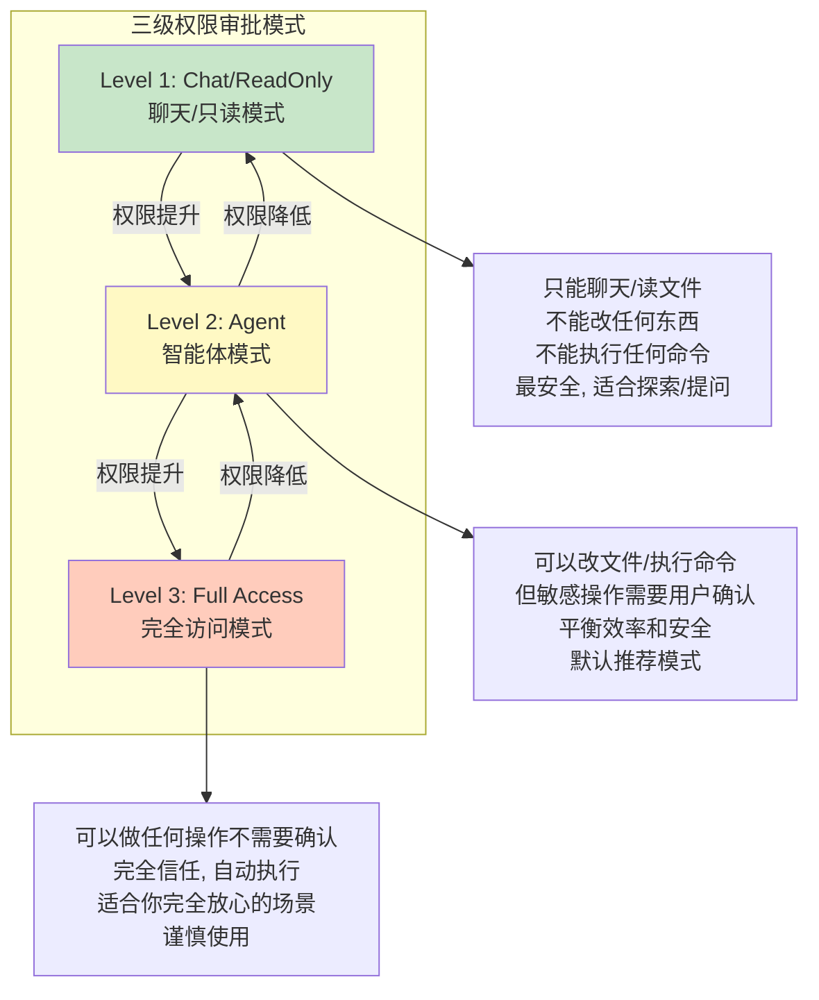
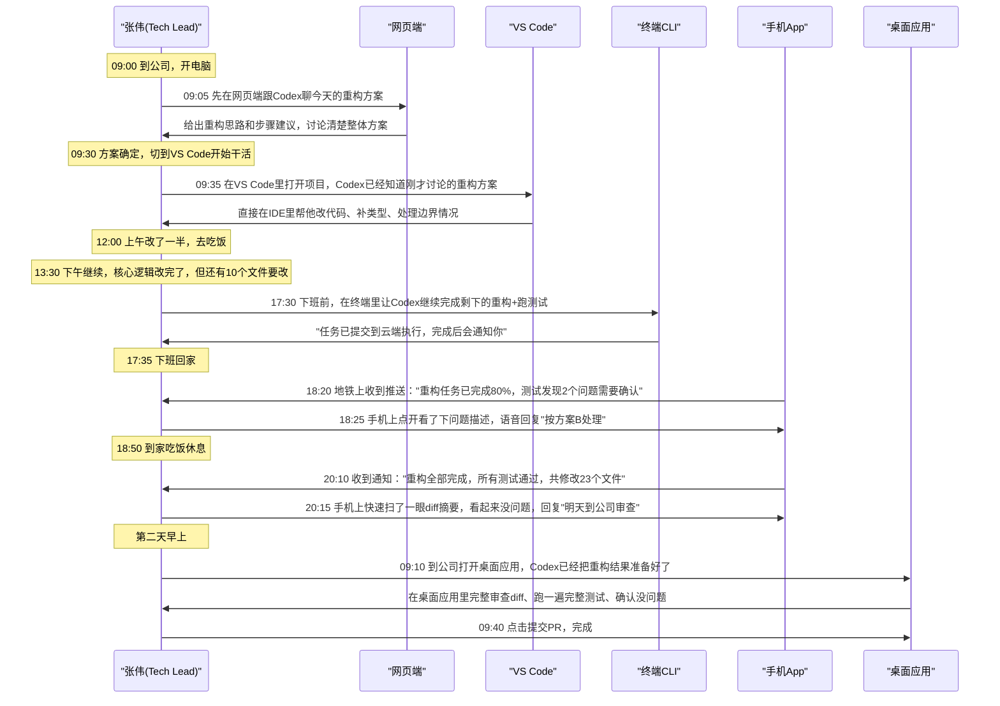
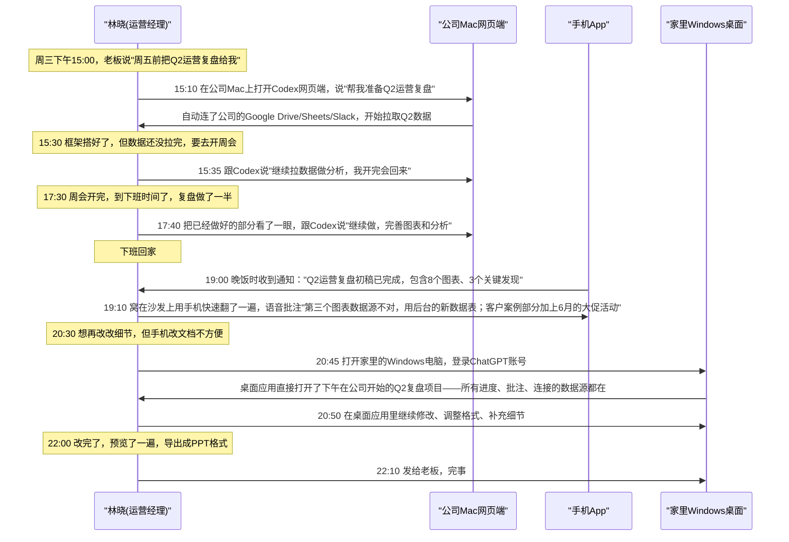
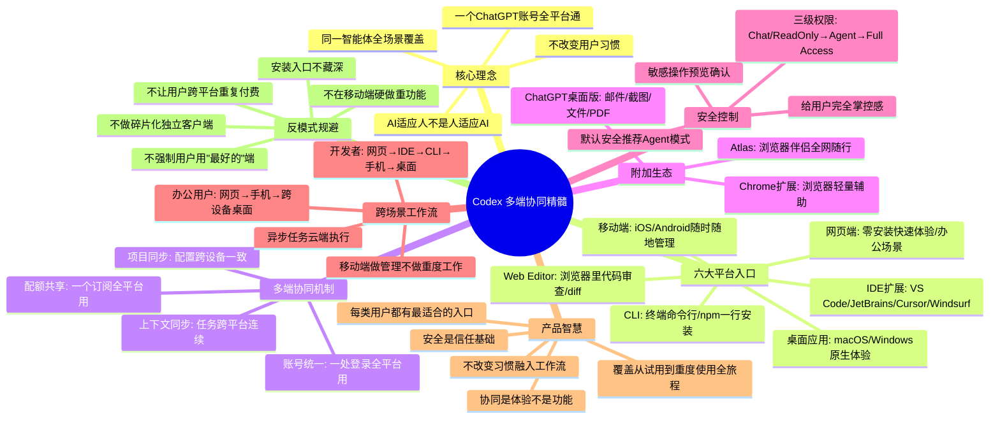

## 一、核心理念：同一智能体，全场景覆盖

在AI开发工具领域，有一个长期存在的痛点：**工具碎片化**。你在网页上用一个AI助手，在IDE里用另一个插件，在终端里用第三个工具，手机上又是第四个——每个工具都有独立的账号、独立的上下文、独立的配额、独立的使用习惯，用起来割裂又麻烦。

ChatGPT Codex的多端协同策略给出了一个清晰的答案：**"在各个编码场景中使用同一智能体"**——通过一个ChatGPT账户，实现全平台联动，无论你在哪个设备、哪个环境、哪个工具里工作，用的都是同一个Codex，上下文同步、配额共享、体验一致。

这个策略背后的产品哲学非常深刻：
1. **以用户为中心，不是以工具为中心**——用户不应该为了用AI而切换工具，AI应该来到用户已经在的地方
2. **状态连续性**——你在网页上开始一个任务，在IDE里继续，在终端里完成，整个过程是连续的，不需要重新解释上下文
3. **一次学习，到处使用**——学会在一个地方用Codex，其他平台的操作逻辑是一致的，不需要重新学习
4. **不强制改变工作流**——喜欢用网页的用网页，喜欢IDE的用IDE，喜欢终端的用终端，不用改变你已经习惯的工作方式

这和很多AI工具的策略完全相反——那些工具说"来我的网页编辑器写代码，这是最好的体验"，而Codex说"你在哪儿工作，我就去哪儿找你"。

---

## 二、六大平台入口详解

Codex提供了六大平台入口，覆盖了开发者和办公用户可能工作的几乎所有场景——从快速体验到深度开发，从桌面到移动，从图形界面到命令行。

### 2.1 入口一：Codex应用（Web网页端）

网页端是Codex的主入口，也是最容易开始的地方——不需要安装任何东西，打开浏览器就能用。

| 维度 | 详情 |
|---|---|
| **访问地址** | chatgpt.com/codex |
| **目标用户** | 新用户快速体验、办公用户、不想安装东西的用户、需要快速协作/分享的场景 |
| **核心功能展示** | 天气应用构建界面——展示从0到1创建一个完整应用的过程，非常适合第一次接触Codex的用户直观感受它能做什么 |
| **优势** | 零安装、即开即用、跨任何操作系统（只要有浏览器）、分享方便（发个链接就行） |
| **适合场景** | 第一次体验Codex、做文档/表格/幻灯片等办公任务、快速头脑风暴/原型设计、和他人协作分享 |

网页端是所有用户的第一站——不管你最终用哪个平台，第一次接触Codex大概率是从网页端开始。网页端承担了"产品展示""快速体验""转化注册"的核心角色。

### 2.2 入口二：编辑器（Editor）

Codex Web Editor是专门为代码审查和代码协同设计的网页端编辑环境，不用离开浏览器就能进行深度的代码相关工作。

| 维度 | 详情 |
|---|---|
| **核心功能** | 代码审查界面、Diff对比视图、添加测试代码 |
| **典型场景** | 别人分享给你一个PR/代码片段，你点链接直接在浏览器里打开审查；不想打开IDE做快速的代码修改/测试 |
| **展示内容** | 真实的代码diff界面——红色删除线标记删了什么，绿色标记加了什么，就像你在GitHub/GitLab里看到的PR界面一样熟悉 |
| **优势** | 不用打开IDE、链接分享即开即用、界面熟悉（和GitHub PR风格一致） |
| **适合用户** | 做代码审查的Tech Lead、快速查看/修改代码的开发者、通过链接分享代码场景 |

Web Editor的diff界面设计非常重要——它不是一个全新的、陌生的代码编辑器，而是做的和开发者每天都在用的GitHub PR diff几乎一模一样，开发者看到立刻就会用，没有学习成本。

### 2.3 入口三：终端（CLI命令行工具）

CLI是为高级开发者、Vim/Emacs用户、喜欢终端工作流的工程师准备的——这些人大部分时间都待在终端里，不想切到图形界面。

| 维度 | 详情 |
|---|---|
| **安装方式** | `npm install -g @openai/codex`——一行npm命令全局安装 |
| **认证方式** | 安装后运行 `codex auth login`——浏览器跳转登录，认证流程简单 |
| **核心使用方式** | 在终端里直接对话Codex，让它写代码、改代码、跑测试、提PR |
| **典型展示场景** | "实现暗色模式"——在终端里告诉Codex你要做什么，它直接在当前项目里进行修改、展示diff、运行测试 |
| **用户证言对应** | Daniel Sikorskiy (Wonderful首席架构师): "Codex CLI已完全取代所有其他智能体框架"——说明CLI的完成度和实用性已经极高 |
| **适合用户** | 高级开发者、终端爱好者、Vim/Emacs用户、DevOps/SRE、喜欢键盘操作效率的工程师 |

CLI的设计体现了对高级开发者习惯的深刻尊重——真正的硬核工程师很多时间都在终端里，如果你让他们切到IDE或者网页才能用AI，他们会觉得麻烦甚至直接放弃。CLI把Codex直接带到了终端里，这些用户甚至不需要离开他们的工作流。

### 2.4 入口四：IDE扩展

IDE集成是开发者最常用的入口——因为绝大多数开发者90%的编码时间都在IDE里，把Codex直接做到IDE里是体验最好、摩擦最小的方式。

Codex支持四大主流编辑器/IDE生态：

| IDE/编辑器 | 目标用户群体 | 安装方式 |
|---|---|---|
| **VS Code** | 最大众化的IDE，覆盖前端、后端、全栈等绝大多数开发者 | VS Code Marketplace直接搜索安装：marketplace.visualstudio.com/items?itemName=openai.chatgpt |
| **JetBrains IDEs** | Java/Kotlin（IntelliJ）、Python（PyCharm）、前端（WebStorm）、Go（GoLand）、PHP（PhpStorm）等JetBrains全家桶用户 | JetBrains插件市场直接安装 |
| **Cursor** | 用AI原生编辑器Cursor的开发者——这个群体本身就是AI工具的重度用户 | Cursor内置或通过插件市场安装 |
| **Windsurf** | 用Windsurf编辑器的开发者——另一个新兴的AI编辑器 | Windsurf内置或插件安装 |

IDE扩展的核心设计原则是**"不打断心流"**——开发者在IDE里写代码，想让Codex帮忙的时候，不需要切出去、不需要复制粘贴，直接在IDE里选中代码、唤出Codex、让它做事情，结果直接在IDE里展示，接受就应用，不接受就拒绝，整个过程不离开IDE，不打断编码心流。

为什么覆盖这四个？因为这四个加起来覆盖了**90%以上**的开发者：
- VS Code占了IDE市场的半壁江山，覆盖绝大多数开发者
- JetBrains是企业级开发、Java/Python/移动端开发的主流选择
- Cursor和Windsurf是AI原生编辑器，用户本身就是AI工具的早期采用者和重度用户

覆盖了这四个，就等于覆盖了几乎所有主流开发者。

### 2.5 入口五：桌面应用

桌面应用是为喜欢独立原生应用体验的用户准备的——比网页端功能更强大、集成更深、体验更流畅。

| 维度 | 详情 |
|---|---|
| **支持平台** | macOS、Windows 两大主流桌面操作系统 |
| **入门引导** | "让我们开始构建"——友好的欢迎引导界面，降低新用户门槛 |
| **核心流程** | 项目选择 → 向Codex提问 → Codex协助开发 |
| **展示场景** | 打开桌面应用后，可以选择你要工作的项目文件夹，然后直接在应用内和Codex对话开发 |
| **优势** | 原生应用体验更流畅、更深的系统集成、文件系统访问更方便、独立窗口不跟浏览器标签挤在一起、启动更快 |
| **适合用户** | 喜欢独立应用体验的用户、需要频繁切换项目的开发者、对浏览器里跑大工具有性能顾虑的用户 |

桌面应用的定位是"比网页端更强、比IDE更轻量"的中间选择：
- 比网页端强：原生体验、更好的系统集成、更适合长时间深度工作
- 比IDE轻量：不需要打开重型IDE，快速启动、快速开始一个小项目/原型

对于很多用户来说，桌面应用是"黄金平衡点"——既不用忍受浏览器的局限，也不用打开IDE那么重，随手打开就能开始干活。

### 2.6 入口六：移动端（ChatGPT App）

很多人会疑惑：写代码为什么需要移动端？但移动端有移动端不可替代的场景。

| 维度 | 详情 |
|---|---|
| **承载应用** | ChatGPT 移动应用（iOS/Android）——不是单独的Codex App，是集成在主ChatGPT App里 |
| **核心功能** | 管理Codex任务、语音交互、随时随地查看进度、接收通知、简单的对话/指令 |
| **典型场景** | 下班路上想起来"那个重构让Codex跑的怎么样了？"拿出手机看一眼；周末在外面，收到通知Codex任务完成了，手机上确认一下；通勤路上用语音跟Codex说"帮我给那个功能加个测试"；开会的时候快速查一下项目进展 |
| **优势** | 随时随地、语音输入方便、推送通知及时、不用带电脑 |
| **适合场景** | 任务进度查看、简单指令/确认、语音输入、接收通知、移动场景下的轻量使用 |

移动端不是用来让你在手机上写代码的——手机屏幕太小、输入效率太低，没人会在手机上写大段代码。移动端的价值是**"随时在线、随时管理、随时查看"**：你在电脑上让Codex跑一个大型重构任务，不用一直守在电脑前面等，可以出门、可以下班、可以休息，手机上会收到通知，随时可以看进度、做确认。这种"任务在云端跑，你在手机上管"的体验，是纯桌面端给不了的。

---

## 三、多端协同机制

六个平台不是六个孤岛——它们通过统一的账号体系和同步机制，形成一个完整的协同体验。

### 3.1 账号统一：一处登录，全平台通

这是多端协同的基础——只需要一个ChatGPT账号，所有平台都能登录，不需要在每个平台单独注册账号。

账号统一的价值不仅是"少记几个密码"，更重要的是：
1. **转化摩擦为零**——你在网页端注册了账号，想试试CLI？装完`codex auth login`一下就好；想在VS Code里用？装完插件点登录，浏览器已经登了直接授权
2. **用户身份一致**——无论在哪个平台，你都是你，你的偏好、历史、配额都跟着你走
3. **降低决策门槛**——"注册一次就能在所有地方用"，比"每个平台单独注册"的心理门槛低太多了

### 3.2 上下文同步：任务跨平台连续

多端协同最强大的地方在于**上下文和任务是同步的**——你在一个平台开始的工作，可以在另一个平台继续，不需要重新给Codex解释"我在做什么"。

典型的跨平台工作流（基于产品逻辑合理推测）：

这种连续的工作流体验是碎片化工具完全给不了的——以前你可能需要在网页端复制粘贴代码到IDE、记着晚上要跑的任务、第二天回来忘了进行到哪了；现在整个任务状态是连续的，Codex始终知道你在做什么、之前做了什么、接下来要做什么。

### 3.3 配额共享：一个订阅全平台用

不管你在网页端用、IDE里用、还是CLI里用，消耗的都是同一个订阅套餐的配额——不需要为不同平台买不同的订阅。

Codex的配额按三个维度计量，共享5小时滑动窗口：

| 配额维度 | 说明 |
|---|---|
| **本地消息/5小时** | 在本地环境（IDE/CLI/桌面）中跟Codex交互的消息数 |
| **云端任务/5小时** | 让Codex在云端执行的长时间运行任务 |
| **代码审查/5小时** | 使用Codex做代码审查的次数 |
| **模型分层** | GPT-5.4、GPT-5.4-mini、GPT-5.3-Codex 不同模型消耗配额不同 |

配额共享的设计非常用户友好：
- **简单透明**——不用算"在IDE用了多少，在CLI用了多少"，一个池子用多少算多少
- **灵活自由**——你想在哪个平台用就在哪个平台用，不会因为换平台浪费配额
- **最大化价值**——订阅费是固定的，但你可以在所有平台用，用户感知价值更高

### 3.4 项目同步：配置跨设备一致

除了任务和配额，你的项目配置、工作空间设置、连接的工具（连接器）等也是跨设备同步的：
- 你在工作电脑上配置好的连接器（Gmail、GitHub、Slack等），回家用个人电脑登录不需要重新连接
- 你在网页端创建的项目，在IDE和桌面应用里也能看到
- 你的使用偏好、自定义设置跟着账号走

项目同步的价值在于"换设备不换体验"——你不用在每台设备上重新配置一遍Codex，登录账号就是熟悉的环境。

---

## 四、附加工具生态

除了Codex本身的六大入口，整个ChatGPT生态还有几个重要的附加工具，和Codex形成协同效应。

### 4.1 ChatGPT桌面版（通用AI助手）

Codex桌面应用是专注于编码/工作的，而通用ChatGPT桌面版是一个更广泛的AI助手，围绕日常电脑使用场景：

| 功能 | 说明 |
|---|---|
| **围绕邮件对话** | 可以直接读取你屏幕上/邮件客户端里的邮件内容，让AI帮你回复、总结、润色 |
| **围绕截图对话** | 截个图直接问AI"这是什么意思？""这个bug怎么修？""帮我提取图里的文字" |
| **围绕文件对话** | 拖一个文件（PDF、Word、Excel、代码文件等）进去，直接问关于文件的问题 |
| **围绕屏幕内容对话** | 可以问"我屏幕上现在这个东西怎么用？""帮我解释一下这个界面在说什么" |
| **PDF编辑** | 直接对PDF进行操作——总结、问答、提取内容、修改 |

ChatGPT通用桌面版和Codex桌面应用是互补关系：
- Codex桌面应用专注于**深度工作/编码场景**，围绕项目和代码
- ChatGPT通用桌面版专注于**通用电脑使用场景**，围绕你屏幕上的任何内容

两者共享同一个账号、同一个订阅，用户可以根据场景切换使用。

### 4.2 ChatGPT Atlas：浏览器伴侣

Atlas是一个更前沿的工具，定位是"全网随行的浏览器AI伴侣"：

| 维度 | 详情 |
|---|---|
| **核心定位** | 浏览器伴侣，你在浏览任何网页的时候都能随时调用AI，不用切换到ChatGPT网页 |
| **核心能力** | 即时答案、页面内容总结、页面内容问答、写作辅助、浏览过程中随时提问 |
| **隐私设计** | 隐私可控——你可以控制Atlas什么时候能访问页面内容，不会默认偷偷看你浏览的所有东西 |
| **平台限制** | 目前仅支持 Apple Silicon (M系列芯片) 的 macOS 14+ 系统 |
| **价值** | AI不用在特定的网页/应用里，它跟着你的浏览走，你在任何网页上有问题，随时就能问 |

Atlas代表了一种趋势：AI从"特定的应用/网页"变成"无处不在的助手"——你不需要专门打开ChatGPT才能用AI，你在浏览网页、看文档、读文章、购物的时候，AI随时在旁边供你调用。

### 4.3 Chrome扩展

Chrome扩展是浏览器层面的轻量AI入口：

- 核心功能：浏览器内搜索辅助、网页内容快速问答、写作辅助
- 优势：轻量、不需要安装桌面应用、在Chrome里直接用
- 适合场景：搜索的时候让AI帮你总结结果、读文章的时候快速总结/解释、写邮件/写评论的时候AI辅助润色

和Atlas相比，Chrome扩展是更轻量、兼容性更广（所有系统只要有Chrome就能用）但功能也相对简单的选择。

---

## 五、下载页面设计

Codex的下载页面设计非常清晰，帮用户快速找到适合自己平台的安装方式。

### 5.1 分平台下载按钮

下载页面最醒目的位置是按平台划分的下载按钮：

| 平台 | 按钮设计 | 辅助信息 |
|---|---|---|
| **macOS** | 醒目的下载按钮，直接下载.dmg安装包 | 系统版本要求说明 |
| **Windows** | 醒目的下载按钮，直接下载.exe安装包 | 系统版本要求说明 |
| **iOS** | App Store 下载按钮 | 跳转到App Store |
| **Android** | Google Play 下载按钮 | 跳转到应用商店 |

每个按钮旁边配对应的平台Logo，用户一眼就能找到自己要的。

### 5.2 二维码扫码下载

对于移动端，除了商店跳转按钮，还提供二维码——用户掏出手机扫一下码直接跳转到下载页面，不用在手机上搜索，非常方便。

### 5.3 产品截图展示

下载按钮旁边/下方是各平台应用的真实截图：
- macOS桌面应用的界面截图
- Windows桌面应用的界面截图
- iOS/Android移动端的界面截图

截图的作用和官网其他地方一样——建立真实感：让用户下载之前就知道"这个应用长这样、界面是什么样的"，不会下完发现和预期不一样。

下载页面的设计原则是**"减少摩擦"**：
1. 用户来到下载页面，目的已经很明确——"我要下载"
2. 不要给多余信息干扰，最醒目的位置就是下载按钮
3. 分平台清晰，不要让用户找"我是Mac我点哪个"
4. 移动端给二维码，最方便
5. 放截图建立预期，让用户下载前心里有数

---

## 六、审批模式安全控制

Codex不仅是一个"帮你写代码"的工具，它真的能执行操作、改文件、跑命令——这就带来了安全问题："它会不会乱搞？我怎么控制它能做什么不能做什么？"

Codex设计了三级权限的审批模式，让用户可以根据场景灵活控制Codex的权限大小（基于开发者文档公开信息）：

| 权限级别 | 名称 | 能做什么 | 不能做什么 | 适合场景 |
|---|---|---|---|---|
| **Level 1** | Chat/ReadOnly 聊天/只读 | 读文件、看代码、回答问题、聊天、给建议 | 不能修改任何文件、不能执行任何终端命令、不能做任何写操作 | 第一次用Codex、只想问问题不想改东西、探索陌生代码库、对安全要求极高的环境 |
| **Level 2** | Agent 智能体模式 | 读文件、改文件、执行终端命令、创建PR、做大部分开发操作 | 敏感操作（比如删文件、执行危险命令、推送到主分支等）需要用户预览确认后才能执行 | 绝大多数日常开发场景——这是默认推荐模式，平衡了效率和安全，不用每个操作都确认，但危险操作会拦下来让你看一眼 |
| **Level 3** | Full Access 完全访问 | 拥有当前用户的所有权限，可以做任何操作，不需要任何确认 | （什么都能做，所以风险最高） | 你完全信任Codex、在沙箱/测试环境里、做非关键操作、或者你已经非常熟悉Codex的行为模式的时候——谨慎使用 |

三级权限设计的智慧在于**"安全不是非黑即白，是梯度的"**：
- 不是"要么完全不能用，要么完全放开"——那样要么太束缚要么太危险
- 给用户选择权，让他根据自己的场景、信任程度、环境敏感度选择合适的权限级别
- 默认是Level 2（Agent模式）——既给了足够的自动化能力，又把危险操作拦住要确认，对绝大多数用户来说这是最合理的默认值
- 敏感操作要确认——这和我们之前讲的"预览→确认→执行"可控性设计是一致的，无论权限级别多高，关键操作还是要用户拍板

---

## 七、场景还原：跨平台用户的一天

前面分析了六大平台和协同机制，现在我们用两个典型用户一天的真实工作流，直观感受多端协同是如何无缝融入日常工作的。

### 7.1 场景A：后端工程师张伟的多端协同工作日

张伟，30岁，互联网公司后端Tech Lead，重度终端用户，用VS Code写代码，手机是iPhone。

**张伟这个工作流的关键协同点：**

1. **网页端→IDE的上下文连续**：早上在网页讨论的方案，IDE里Codex直接知道，不用重新解释
2. **CLI云端异步执行**：大型任务不用守在电脑前等，交给云端跑，人可以下班
3. **移动端管理异步任务**：路上收通知、看进度、做简单确认，不用带电脑
4. **桌面应用做深度审查**：第二天回来在桌面应用里做最终审查和提交，体验流畅
5. **全程一个账号**：网页、IDE、CLI、手机、桌面，登录一次全平台自动同步

整个过程中，张伟不需要在任何平台重新解释"我在做什么重构"，不需要复制粘贴任何代码，不需要记着"昨天进行到哪了"——Codex始终保持上下文连续，他只需要在合适的设备、合适的场景做他该做的事。

### 7.2 场景B：运营经理林晓的跨设备办公旅程

林晓，28岁，电商公司运营经理，非技术背景，公司用MacBook，家里用Windows，手机是Android。

**林晓这个工作流的关键协同点：**

1. **异步任务云端执行**：她去开会、下班，Codex继续在云端干活，不用守在电脑前
2. **移动端批注和确认**：沙发上用手机快速审阅、语音提修改意见，不用开电脑
3. **跨设备项目同步**：公司Mac做了一半，回家Windows打开接着做——项目、进度、数据连接全同步，不用重新配置
4. **上下文跨设备保留**：Codex记得她下午说过什么、批过什么，不用她重新说一遍
5. **办公场景的多端价值**：对非技术用户来说，多端不是"在哪写代码"，而是"在哪都能继续工作"——公司没做完回家做，路上想到什么随时补

### 7.3 两个场景8维度对比表

| 对比维度 | 张伟（开发者） | 林晓（办公用户） |
|---|---|---|
| **核心身份** | 后端Tech Lead，技术重度用户 | 运营经理，非技术用户 |
| **主要入口顺序** | 网页→IDE→CLI→手机→桌面应用 | 网页→手机→桌面应用 |
| **异步任务使用** | 大型重构交给CLI云端跑，下班不等人 | 数据分析/文档生成交给云端，开会下班不中断 |
| **移动端用途** | 收通知、看进度、简单指令、语音确认 | 收通知、快速审阅、语音批注修改意见 |
| **跨设备场景** | 公司没做完的重构，第二天在桌面应用继续审查 | 公司Mac做了一半的复盘，回家Windows接着改 |
| **最有价值的协同点** | 任务异步执行+手机管理，不用守在电脑前等 | 跨设备项目同步，换电脑不用重新配置重新来 |
| **权限级别使用** | 日常Level 2，做熟悉项目偶尔开Level 3 | 全程Level 2，她根本不知道有权限级别这回事（默认安全） |
| **一天切换平台次数** | ~5次（网页/IDE/CLI/手机/桌面） | ~3次（网页/手机/家里桌面） |

两个人用的是完全不同的平台组合、做的是完全不同的工作，但他们享受到的多端协同核心价值是一样的：**工作不中断、上下文不丢失、换设备不用重来、人不用被绑在电脑前等任务完成**。

---

## 八、多端协同反模式：8个常见错误

多端策略看起来简单——"不就是做几个客户端吗？"但实际上90%的团队做多端产品时都会犯以下错误，导致多端变成用户的负担而不是助力：

| 反模式 | 典型表现 | 危害 | Codex的规避 |
|---|---|---|---|
| **做客户端不做协同** | 做了网页/IDE/CLI/手机App，但每个都是独立产品——账号不通、数据不同步、上下文不连续 | 用户等于在四个不同的产品里跳来跳去，每次换平台都要重新登录、重新解释上下文、重新配置 | 底层完全打通：一个账号、一个配额池、上下文跨端同步、项目配置云端同步 |
| **功能各平台不一致** | 网页有X功能，IDE里没有；CLI能做Y，桌面版做不了；每个平台功能列表不一样 | 用户不知道"哪个功能在哪个端有"，想做一件事要想"我得去哪个端"，体验割裂混乱 | 核心能力所有平台一致——在哪个端都能让Codex写代码/改文件/跑任务；平台差异只在交互方式，不在能力 |
| **强制用户用"最好的"端** | "网页端体验最好，你用网页吧""IDE插件是半成品，推荐用桌面版"——暗示或明示用户某个端"不好" | 喜欢IDE的用户被劝退，习惯终端的用户觉得被忽视，等于把用户往门外推 | 不说哪个端更好，只说每个端适合什么场景；所有端都是一等公民，没有"官方推荐"的端 |
| **移动端做重功能** | 试图在手机上做完整的代码编辑器、让用户在手机上写大段代码、做复杂的diff审查 | 手机屏幕和输入效率根本不适合重度工作，硬做出来体验极差，没人用 | 移动端明确定位为"管理端"——看进度、收通知、做简单确认、语音指令，不试图让用户在手机上写代码 |
| **每个平台单独注册付费** | 网页端注册一个账号，IDE插件要单独买License，CLI又是另一个服务，每个端单独付费 | 用户要记好几个账号、付好几次费，算下来贵得离谱，而且数据还不通 | 一个ChatGPT账号、一个订阅、一个配额池——全平台通用，付一次费在哪都能用 |
| **下载入口藏得深** | IDE插件、CLI安装方式、桌面版下载全藏在"文档"或"下载中心"里，要点三四次才能找到 | 急性子用户找了两下找不到就走了，转化漏斗在"找安装入口"这一步大量流失 | 导航栏直接放"在IDE中试用"下拉，7个入口直达安装；下载页面分平台清晰，二维码方便移动端 |
| **跨平台状态丢失** | 在网页端开了个头，切到IDE什么都不记得；CLI里跑的任务，IDE里看不到进度 | 状态不连续是多端体验最致命的问题——用户每次换端都要重新来，还不如用单端工具 | 任务状态、对话历史、项目上下文实时云端同步——在哪个端都能看到最新状态，无缝衔接 |
| **安全控制不统一** | 网页端有权限控制，CLI默认Full Access；IDE里要确认危险操作，桌面版不用 | 安全标准不统一，用户在一个端养成的安全习惯，换个端就失效了，容易出安全事故 | 三级权限模式跨平台统一——你在CLI开Level 1，所有端都是Level 1；安全规则跟着账号走，不跟着端走 |

### 多端协同自检清单

设计或审查多端产品策略时，可以用以下清单：

- [ ] 所有平台是否用同一个账号体系？登录一次全平台可用吗？
- [ ] 核心能力是否所有平台都有？平台差异只在交互方式，不在功能有无吗？
- [ ] 对话历史、任务状态、项目上下文是否跨平台实时同步？换端不需要重新解释吗？
- [ ] 配额/订阅是否全平台共享？付一次费在哪都能用吗？
- [ ] 是否明确了每个平台的定位？有没有在不适合的平台硬做重功能（比如手机写代码）？
- [ ] 安装入口是否直接可达？有没有藏在三四层菜单里面？
- [ ] 导航/首页是否给不同用户习惯的人提供了直达他们常用端的入口？
- [ ] 安全控制（权限/审批/确认）是否跨平台统一？不会换个端安全标准就变了？
- [ ] 是否不评判"哪个端更好"？而是告诉用户"每个端适合什么场景"？
- [ ] 异步任务（如果有）是否支持在移动端查看进度、接收通知、做简单确认？

---

## 九、多端协同策略总结

ChatGPT Codex的多端协同策略是"AI融入工作流"的典范——它不试图创造新的工作习惯让用户适应，而是全面覆盖用户已经在的所有地方，让AI无缝融入用户现有的工作方式。

**可直接复用的多端策略原则**：

1. **不要让用户换工具——去用户已经在的地方**。用户用VS Code你就做VS Code插件，用户待在终端你就做CLI，不要试图让所有人都来你的网页编辑器。
2. **多端不是做一堆客户端——底层要打通**。账号统一、上下文同步、配额共享、体验一致，否则只是一堆碎片化的工具。
3. **覆盖从新手到专家的完整旅程**。网页端给新人零门槛起步，CLI给重度用户最高效率，每个阶段都有最适合的入口。
4. **默认安全，给用户权限控制权**。做三级权限梯度，默认是平衡安全和效率的模式，危险操作必须确认，让用户有掌控感。
5. **移动端不是用来做重度工作的——是用来管理和同步的**。没人在手机上写大段代码，但人人都需要在路上看进度、收通知、做简单确认。
6. **下载页面要简单直接**。用户来下载就是要下载，把下载按钮放最显眼的地方，分平台清晰，移动端给二维码，别给多余信息干扰。
7. **不要忽视附加工具的协同效应**。通用桌面版、浏览器伴侣、扩展这些和核心产品形成生态，覆盖更多场景，增加用户粘性。
8. **体验一致比功能一致更重要**。不用每个平台功能完全一样，但操作逻辑、交互模式、视觉语言要一致——用户在一个地方学会了，其他地方自然就会用。
9. **支持异步工作流**：让用户可以把长时间任务交给云端跑，不用守在电脑前等，移动端负责通知和简单管理——这是多端协同真正的杀手级价值。
10. **跨设备状态连续性是底线**：在A端开始的工作，在B端必须能无缝继续，用户不需要重复解释上下文——做不到这一点，多端就是伪需求。

### 多端协同 Do / Don't 速查表

| 多端决策 | ✅ Do（Codex的做法） | ❌ Don't（常见错误） |
|---|---|---|
| **产品哲学** | AI去用户在的地方，适应用户习惯 | 让用户来"我们的平台"，改变用户工作流 |
| **平台覆盖** | 覆盖六大入口：网页/Web Editor/CLI/四大IDE/桌面/移动端 | 只做网页端，让用户都来浏览器；或只做IDE插件，其他场景不管 |
| **账号体系** | 一个ChatGPT账号登录一次，全平台自动可用 | 每个平台单独注册、单独登录、单独验证 |
| **付费模式** | 一个订阅一个配额池，全平台通用 | 每个平台单独卖License，网页$/月IDE$/月CLI再单独买 |
| **上下文同步** | 对话历史、任务状态、项目配置实时云端同步，换端无缝继续 | 各端数据完全隔离，换个平台就要重新开始重新解释 |
| **功能一致性** | 核心能力所有平台都有，差异只在交互方式 | 网页有X功能IDE没有，CLI能做Y桌面做不了，用户搞不清哪个功能在哪 |
| **平台定位** | 明确定位每个端的场景：移动端管理不写代码，CLI给高级用户 | 在手机上硬做代码编辑器，试图让手机承担重度工作 |
| **安装入口** | 导航栏直接放"在IDE中试用"下拉，7个入口直达；下载页分平台清晰+二维码 | IDE/CLI/桌面下载全藏在"文档"或"下载中心"里，要点3-5次 |
| **安全控制** | 三级权限模式跨平台统一，安全规则跟着账号走 | 网页端有权限控制，CLI默认全开，换个端安全标准就变了 |
| **异步任务** | 支持云端异步执行+移动端通知+手机确认，人不用等电脑 | 所有任务必须同步等结果，用户必须守在电脑前 |
| **跨设备同步** | 公司没做完回家打开电脑接着干，所有进度/配置/数据都在 | 换电脑就要重新配置、重新连接工具、重新找项目 |
| **平台推荐** | 介绍每个端适合什么场景，不说哪个"更好" | 强制推荐"网页端体验最好"，暗示其他端是二等公民 |
| **入门引导** | 每个端的入门方式匹配用户习惯：IDE插件市场一键安装，CLI一行npm命令 | 所有端都用同一套5页欢迎教程，不管用户是什么习惯 |
| **下载页面** | 下载按钮最醒目，分平台清晰，移动端给二维码，放真实截图 | 下载页先讲一堆产品理念，按钮藏在最下面，没有平台区分 |
| **附加生态** | 通用桌面版、Atlas浏览器伴侣、Chrome扩展形成生态覆盖更多场景 | 只做核心Codex产品，周边场景完全不覆盖 |

Codex的多端协同策略告诉我们：**最好的工具是你感觉不到它存在的工具——它就在你已经工作的地方，用你习惯的方式工作，你甚至不需要专门"打开"它、"切换"到它，它就在那里，随时帮你干活**。这就是AI工具融入工作流的最高境界。

---

**下一步**：继续阅读 [09 工具集成与生态系统](09-tool-integration.md)，学习Codex连接器（Connectors）的设计理念、读/写/触发三类能力、以及MCP开放协议的生态扩展策略。
