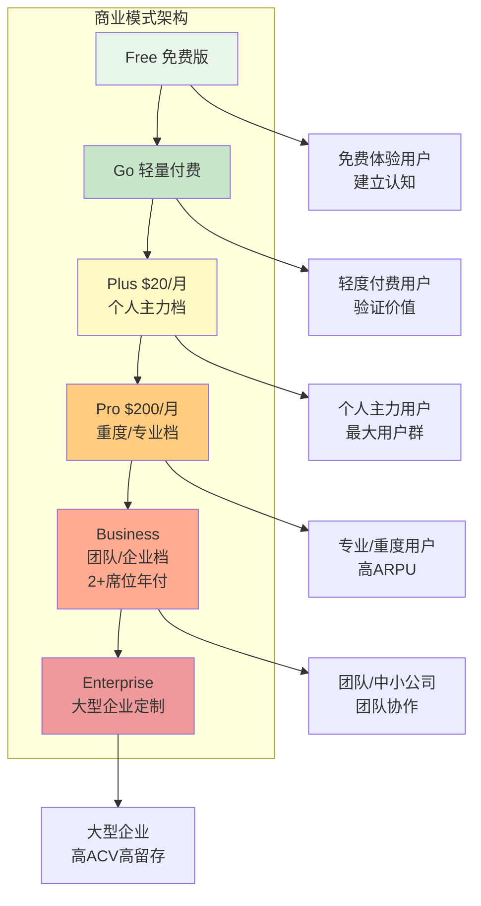
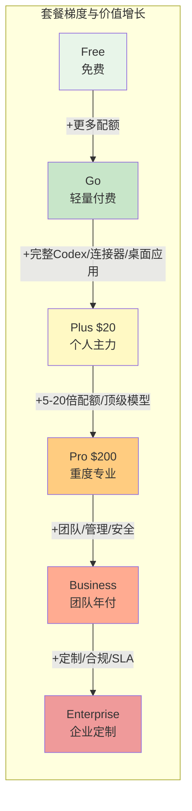
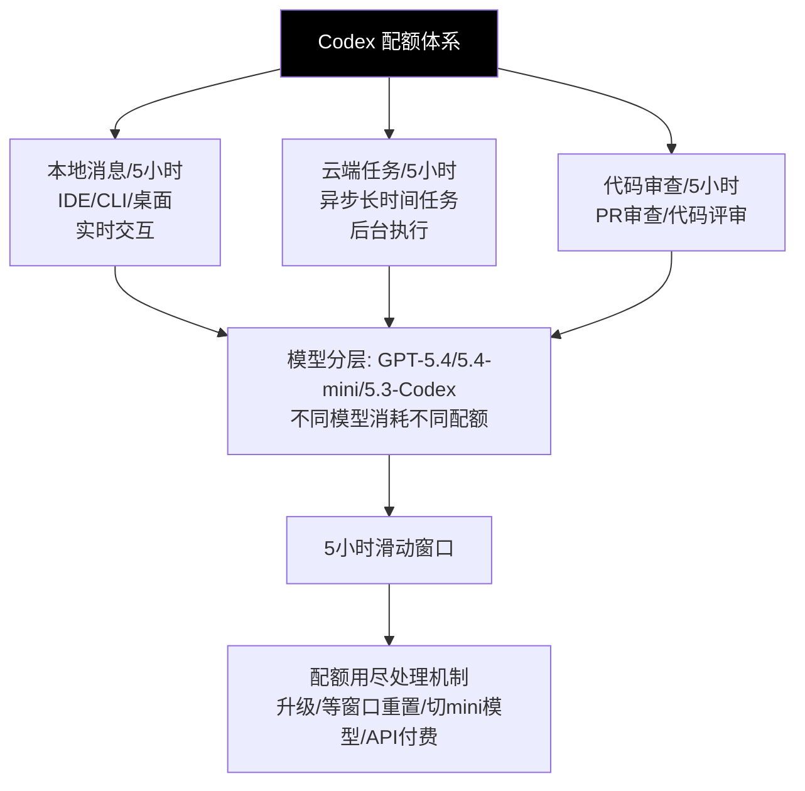
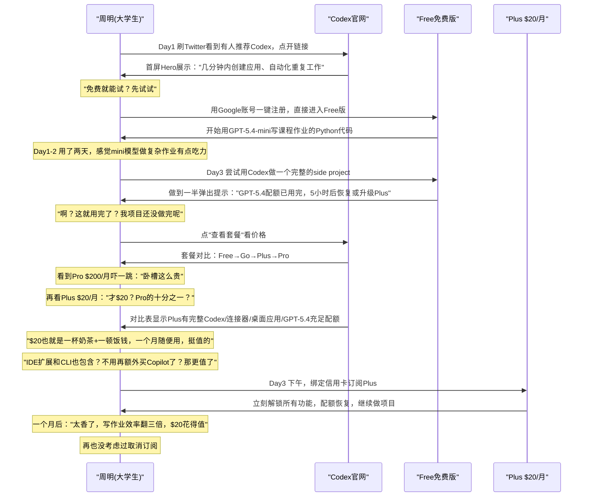
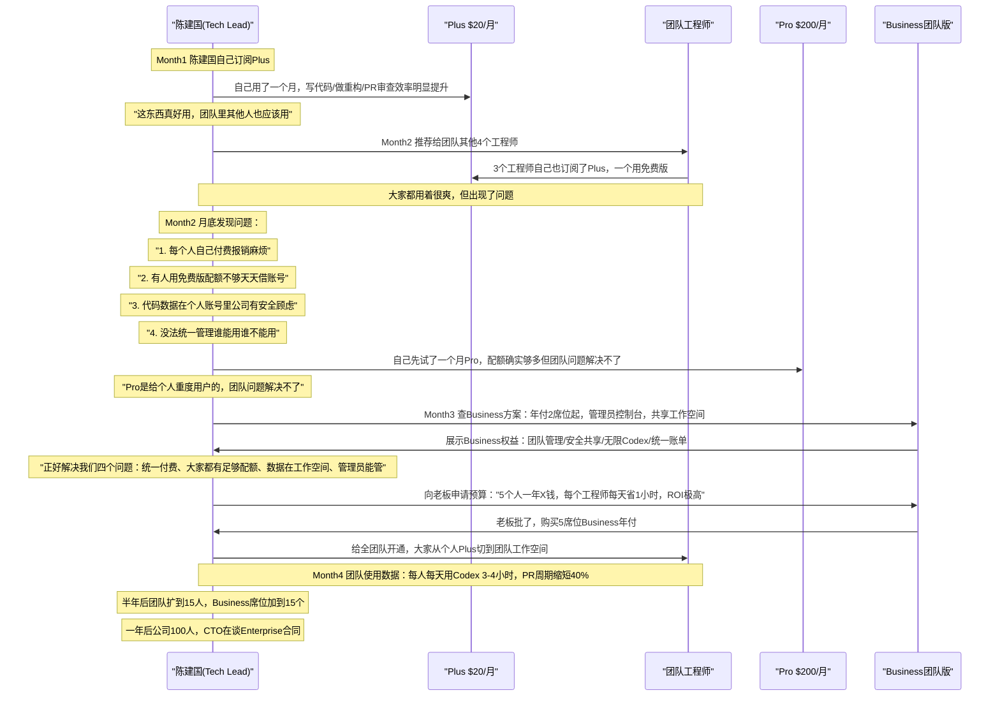
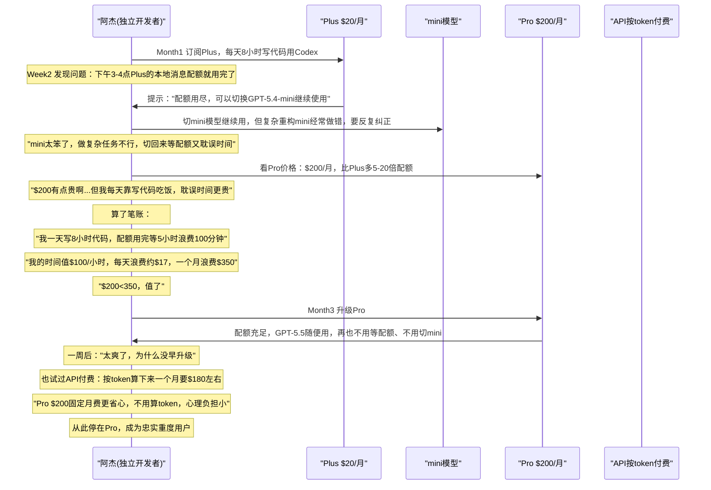
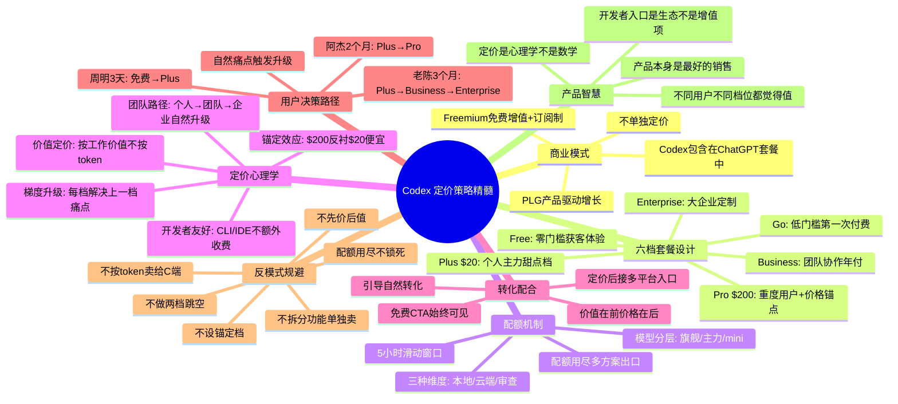

## 一、商业模式整体框架：免费增值+订阅制，Codex包含在ChatGPT套餐中

ChatGPT Codex没有采用独立定价——它不是一个需要单独购买的产品，而是**包含在ChatGPT的各个订阅套餐中**。这是一个非常聪明的商业模式选择：Codex不需要重新建立付费体系，不需要让用户"再买一个AI工具"，而是作为ChatGPT订阅价值的一部分，自然地触达ChatGPT已经拥有的数亿用户。

整体商业模式是经典的**免费增值（Freemium）+ 梯度订阅制**：



这个商业模式的核心优势是：
1. **获客成本极低**——ChatGPT已经有庞大的用户基础，Codex作为功能升级自然推送给现有用户，不需要从零开始获客
2. **决策门槛极低**——用户不需要"要不要再花钱买一个Codex"，已经是Plus/Pro用户直接就能用，免费用户升级就能用
3. **价值感知更强**——Codex不是单独卖$20/月，而是"ChatGPT Plus $20/月包含Codex"，用户会觉得"这钱花得值，又多了这么强的功能"
4. **升级路径清晰**——从免费到Go到Plus到Pro到Business到Enterprise，每一档都解决上一档的痛点，用户可以随着使用深度自然升级
5. **开发者友好**——CLI、IDE扩展这些开发者工具都包含在订阅里，不额外收费——这和很多AI编码工具单独收费的策略完全不同

一句话：**Codex不是一个独立产品来卖钱，而是ChatGPT订阅价值的"杀手级功能"，拉动订阅转化和留存**。

---

## 二、五档套餐设计详解

Codex/ChatGPT一共设计了六档套餐（Free、Go、Plus、Pro、Business、Enterprise），从免费到企业定制，覆盖了从个人体验到大型企业的几乎所有用户类型。每一档都有明确的目标用户、明确的价值定位、明确的配额提升。

### 2.1 套餐梯度总览

| 套餐 | 价格 | 目标用户 | 核心定位 | Codex能力 |
|---|---|---|---|---|
| **Free** | $0 | 新用户、体验用户、偶尔使用 | 基础体验，感受产品价值 | 基础Codex体验，GPT-5.4/GPT-5.4-mini有限配额 |
| **Go** | 低价位轻量付费 | 想多体验一点、不想花太多钱的用户 | 更长对话，更高配额，测试能力 | 更高GPT-5.5配额，适合测试Codex能力 |
| **Plus** | **$20/月** | 个人用户主力档——职场人士、开发者、学生 | 进阶工作与高效办公，个人生产力首选 | 更高Codex使用量，完整连接器/桌面应用/高级模型 |
| **Pro** | **$200/月** | 重度用户、专业开发者、研究人员、AI重度使用者 | 研究和编程，最大任务量，专业级能力 | Codex最大任务量，比Plus多5-20倍使用量 |
| **Business** | 按席位年付（2席位起） | 团队、中小公司、部门级使用 | 安全共享工作空间，管理员控制，团队协作 | 适合团队多代码仓库使用，无限（受滥用防护限制） |
| **Enterprise** | 定制报价 | 大型企业、组织、对安全合规有高要求 | 企业级安全、合规、管控、定制化 | 企业级安全合规与管控，更高配额和SLA |



梯度设计的核心逻辑是**"每一档都解决上一档用户的核心痛点"**，让用户自然想升级。

### 2.2 Free（免费版）：零门槛体验

| 维度 | 详情 |
|---|---|
| **价格** | $0，完全免费 |
| **目标用户** | 第一次接触ChatGPT/Codex的新用户、偶尔使用的轻度用户、学生、想先试试再决定付不付费的用户 |
| **Codex配额** | GPT-5.4：20-100条本地消息/5小时；GPT-5.4-mini：60-350条本地消息/5小时（有限配额，足够体验） |
| **核心价值** | 让用户零门槛体验Codex是什么、能做什么，建立产品认知 |
| **设计意图** | 免费不是"做慈善"，是获客手段——让尽可能多的人先用起来，用出价值了自然想升级 |

免费版的设计哲学：**给足够的配额让用户体验到价值，但又不够重度使用**。用户用免费版能感受到"这东西真好用"，但用到一半配额用完了，或者想用到高级功能，自然就会想升级。

### 2.3 Go：轻量付费试水档

| 维度 | 详情 |
|---|---|
| **价格** | 低价位（介于免费和Plus之间） |
| **目标用户** | 觉得免费版不够用，但还不确定要不要花$20买Plus的用户、想先花点小钱试试深度功能的用户 |
| **核心能力** | 更长对话历史、更高的GPT-5.5配额、比免费版更多的使用量 |
| **Codex定位** | 适合测试Codex能力——比免费版多，能做一些实际的事情，但还不是重度使用 |
| **设计意图** | 给价格敏感用户一个"低门槛起步"的选择，不要让免费到Plus的$20跨度太大吓跑人 |

Go档是一个有趣的设计——它在免费和$20之间加了一个"过渡档"，降低了用户第一次付费的心理门槛。从$0直接到$20是一个挺大的跨度，很多人会犹豫；但从$0到一个低价位再到$20，第一次付费就容易多了。而且一旦用户开始付费，就完成了"从免费用户到付费用户"的心理转变，后续升级到Plus也更容易。

### 2.4 Plus（$20/月）：个人用户主力档

Plus是整个订阅体系的**核心主力档**——绝大多数个人用户最终会停在这一档，也是OpenAI个人订阅收入的主要来源。

| 维度 | 详情 |
|---|---|
| **价格** | $20/月（约140-150人民币，是非常经典的SaaS个人订价点） |
| **目标用户** | 职场人士、开发者、学生、自由职业者——所有把ChatGPT/Codex当日常生产力工具的个人用户 |
| **Codex相关核心权益** | 更高的Codex使用量配额；macOS/Windows Codex桌面应用可用；插件连接器可用（连接Slack/GitHub/Figma等） |
| **其他核心权益** | 高级推理模型、更高的消息/文件上传配额、更快的图片生成、深度研究/智能体模式、记忆/上下文支持、项目/任务/自定义GPT、新功能抢先体验 |
| **价值定位** | 个人生产力的"甜点档位"——花一杯咖啡多一点的钱，获得完整的AI工作助手能力，足够绝大多数人日常重度使用 |

为什么$20/月是"黄金定价点"？
- 这个价格低到个人用户不用想太多就能决定——每天不到7毛钱，一顿饭钱就能用一个月
- 这个价格又高到能筛选出真正有需求的用户，过滤掉薅羊毛的
- 包含的价值足够多——Codex+高级模型+连接器+桌面应用+图片生成+深度研究+...用户会觉得"$20买这么多东西太值了"

### 2.5 Pro（$200/月）：重度/专业档

Pro是针对最高强度用户、专业用户的档位，价格是Plus的10倍——这个定价本身就有强烈的信号作用。

| 维度 | 详情 |
|---|---|
| **价格** | **$200/月**（Plus的10倍） |
| **目标用户** | 专业软件开发者、AI研究人员、内容创作者、重度生产力用户、把AI当主要生产工具的人 |
| **Codex核心权益** | Codex最大任务量配额，**比Plus多5-20倍使用量**；GPT-5.5 Pro专业推理模型 |
| **其他核心权益** | GPT-5.5及文件上传不设限；无限制更快速图片生成；深度研究/智能体模式最大支持；最大记忆/上下文窗口；更高的项目/任务/GPT配额；新功能研究预览 |
| **价值定位** | 给"靠AI吃饭"的人的专业档——如果你是开发者每天8小时写代码用Codex，如果你是研究者每天用AI做大量分析，Pro给你不受限制的顶级能力 |

Pro档存在的意义有两个：
1. **服务重度用户**——确实有一批用户Plus的配额不够用，他们愿意花更多钱获得更多配额和顶级能力
2. **价格锚定**——$200/月摆在那里，会让$20/月的Plus看起来极其划算（我们在定价策略部分详细讲锚定效应）

### 2.6 Business（2+席位，年付）：团队协作档

Business及以上是面向团队和企业的档位，从个人订阅转向团队/组织订阅。

| 维度 | 详情 |
|---|---|
| **价格** | 按席位计费，年付，2个席位起售 |
| **目标用户** | 团队、中小公司、部门级部署——3-100人规模的团队，需要协作、需要管理控制 |
| **核心能力** | 安全共享工作空间、管理员控制台、成员管理、灵活定价、适合团队多代码仓库使用 |
| **Codex能力** | Codex使用量"无限"（受滥用防护限制）——团队多人使用不用太担心配额不够 |
| **核心价值** | 团队能用、管理员能管、数据更安全、协作更顺畅——从个人工具变成团队工具 |

Business档的关键转变是**从"个人效率工具"变成"团队生产力平台"**：
- 个人用户只关心"我自己用着爽不爽"
- 团队/公司还要关心"管理员能不能管""数据安不安全""团队成员怎么协作""怎么统一付费"
- Business档就是解决这些企业级需求的起点

### 2.7 Enterprise：大型企业定制档

| 维度 | 详情 |
|---|---|
| **价格** | 定制报价（根据席位数量、需求、SLA要求等），通常是年框合同 |
| **目标用户** | 大型企业、政府、教育机构、对安全合规有极高要求的组织 |
| **核心能力** | 更高级别的安全合规与管控、企业级SLA、专属支持、定制化集成、可能的私有部署选项 |
| **销售模式** | 直销+解决方案工程师，不是自助购买 |

Enterprise档是典型的企业软件"顶端"设计：
- 价格不透明，需要谈——因为大客户需求差异很大
- 强调安全、合规、管控、SLA——大企业决策最关心这些，不是价格
- 销售介入——大客户需要人对接、需要POC、需要定制方案

---

## 三、配额管理机制：三种维度+滑动窗口

Codex不是简单的"无限用"——它有一套精细设计的配额管理机制，既防止滥用，又保证不同档位用户获得匹配的价值，还让用户清楚知道"我用了多少、还剩多少"。

### 3.1 三种配额计量维度

Codex配额按三个独立维度计量，不同类型的操作消耗不同维度的配额：

| 配额维度 | 计量说明 | 适用场景 |
|---|---|---|
| **本地消息/5小时** | 在本地环境（IDE扩展、CLI、桌面应用）中与Codex交互的消息数，5小时滑动窗口内的限额 | IDE里让Codex写代码、CLI里让Codex改bug、桌面应用里对话 |
| **云端任务/5小时** | 让Codex在云端执行的长时间运行任务数，5小时滑动窗口内的限额 | 大型异步任务、长时间运行的重构/分析任务、在云端执行的工作 |
| **代码审查/5小时** | 使用Codex做代码审查的次数，5小时滑动窗口内的限额 | PR审查、代码审查请求 |



### 3.2 模型分层：不同模型消耗不同配额

不是所有"用Codex"都消耗一样的配额——你选择的模型能力越强，消耗的配额越多，这是非常合理的设计：

| 模型 | 定位 | 配额消耗 | 适合场景 |
|---|---|---|---|
| **GPT-5.5 / GPT-5.5 Pro** | 旗舰模型，能力最强 | 配额消耗高（Pro/Business/Enterprise才能充分使用） | 复杂编码任务、大型重构、深度分析 |
| **GPT-5.4** | 主力模型，平衡能力和速度 | 中等配额消耗（Plus及以上有充足配额） | 日常编码、大多数开发任务 |
| **GPT-5.4-mini** | 轻量快速模型 | 配额消耗低，配额数量多 | 简单任务、快速问答、补全、想延长配额使用时间时切换 |
| **GPT-5.3-Codex** | 专用代码模型 | 特定配额 | 纯代码任务优化 |

这种模型分层设计的好处：
1. **用户有选择权**——简单任务用mini省配额，复杂任务用顶配模型
2. **资源合理分配**——最强的模型资源留给真正需要的重度用户
3. **延长配额使用寿命**——用户配额快用完了，可以切换到mini模型继续用，不会直接"断粮"

### 3.3 5小时滑动窗口机制

Codex采用**5小时滑动窗口**配额机制，而不是"每天重置"或"每月重置"：

| 机制 | 说明 | 用户体验 |
|---|---|---|
| **滑动窗口** | 配额不是每天0点重置，而是看"过去5小时内用了多少"——你刚用的配额5小时后就会"还回来" | 更灵活——你集中用了一阵，等5小时就又有配额了，不用等第二天 |
| **可能的每周限额** | 除了5小时窗口，可能还有每周/更长周期的软限制，防止极端滥用 | 既保证短期灵活，又防止长期过度使用 |

为什么用5小时滑动窗口而不是每日重置？
- 开发者经常有"集中编码时间"——比如下午2点到晚上7点连续写5小时代码，这时候需要集中用配额
- 如果是每日重置，你可能上午就把配额用完了，下午想干活干不了；滑动窗口更灵活，用了的配额过几小时就回来
- 用户感知更好——不会出现"今天没配额了明天再来"的挫败感，等几小时就又有了

### 3.4 配额用尽后的处理方案

配额用完不是"直接不让用了"——Codex设计了多个处理方案，给用户选择：

| 方案 | 适用用户 | 说明 |
|---|---|---|
| **购买额外额度** | Plus/Pro个人用户 | 配额不够可以单独买额外的使用量，不用升级整档 |
| **购买工作空间额度** | Business/Edu/Enterprise团队用户 | 团队管理员可以为整个工作空间购买额外额度 |
| **切换到GPT-5.4-mini** | 所有用户 | mini模型配额多、消耗低，配额快用完了切换到mini就能继续用，只是能力稍微弱一点 |
| **API Key按标准API费率计费** | 开发者/技术用户 | 如果订阅配额不够，可以用API Key走API计费，按token付费，不用等窗口重置 |

这种"多出口"设计非常人性化——不会让用户在需要干活的时候"卡壳"：
- 愿意加钱可以加钱买额度
- 不想加钱可以切mini模型凑合用
- 开发者还可以走API灵活计费

总有一个方案适合你。

---

## 四、定价策略深度洞察：心理与商业的双重算计

Codex/ChatGPT的定价看起来简单——六档套餐列出来给你选——但背后是一整套经过精心设计的定价心理学和商业策略。

### 4.1 锚定效应：Pro $200让Plus $20显得极其划算

这是定价心理学中最经典的**锚定效应（Anchoring Effect）**——商家放一个很贵的选项在旁边，不是为了让很多人买它，而是为了让中间的选项看起来特别划算。

```mermaid
graph LR
    ANCHOR[Pro $200/月<br/>价格锚点<br/>"真贵!"] --> COMPARE["对比感知"]
    PLUS[Plus $20/月<br/>"才$20? 太便宜了!"] --> COMPARE
    COMPARE --> DECISION["用户觉得Plus超值<br/>果断订阅Plus"]
    style ANCHOR fill:#ef9a9a
    style PLUS fill:#a5d6a7
    style DECISION fill:#81c784
```

想象一下：
- 如果只有Free和Plus $20——你会想"$20一个月，值吗？有点贵啊..."
- 但当你看到Pro要$200——你会想"哇$200这么贵，Plus才$20，一杯咖啡钱，太划算了"

$200/月的Pro档，买的人可能只有5%甚至更少，但它只要放在那里，就能让剩下95%的人觉得$20/月"太便宜了"——这就是锚定的威力。Pro档本身可能赚不了最多的钱，但它极大地提升了Plus档的转化率，这才是它最大的价值。

### 4.2 梯度设计：每档解决上一档的痛点

好的梯度定价不是"随便分几档标不同价格"，而是**每一档都精准解决上一档用户的核心痛点**，让用户"不得不升级"：

| 套餐 | 上一档的痛点 | 这一档解决什么 |
|---|---|---|
| Free | 免费，但配额太少不够用，高级功能用不了 | Go有更多配额，能体验更多功能 |
| Go | 还是有限制，连接器、桌面应用这些核心Codex功能用不了 | Plus给完整Codex、连接器、桌面应用，所有功能全开 |
| Plus | 配额还是不够重度用，我每天8小时写代码不够造 | Pro给5-20倍配额，顶级模型随便用 |
| Pro | 我一个人用爽了，但团队没法用，管理员没法管，数据不安全 | Business给团队工作空间、管理员控制、团队协作 |
| Business | 我们是大公司，需要合规、SLA、定制集成、专属支持 | Enterprise给企业级安全、合规、定制、SLA |

这个设计让用户在使用过程中"自然遇到瓶颈→自然想升级"——不是商家硬推销，是用户自己用着用着觉得"不够用了，我要升级"。

### 4.3 价值定价：按"完成的工作"定价，不是按token计费

很多AI工具（包括OpenAI自己的API）是按token计费——用多少token付多少钱，这种计费方式对用户很不友好：
- 用户不知道"我做这件事要花多少token"——没有预期，容易超预算
- 用户用的时候有心理负担——"这句话会不会太长了？多问一句是不是又要花钱？"
- 计费复杂，用户算不清自己要花多少钱

ChatGPT订阅制是**价值定价**——不是按你用了多少token收费，是按"你能完成多少工作"的价值收固定月费：
- $20/月，你可以放心用，不用算token，不用怕超预算
- 配额虽然有，但设计得让绝大多数人日常用够
- 用户心理感知是"我花$20雇了一个AI助手，这个月随便用"——这种感知比"按token计费，问一句话花几分钱"好太多了

本质区别是：**API按"成本"计费，订阅按"价值"计费**。用户不关心你推理花了多少token多少算力，用户关心"这个工具帮我做了多少工作、省了多少时间，值不值$20"。Codex作为产品用订阅制，正好踩中了价值定价的甜点。

### 4.4 团队升级路径：个人→团队→企业，自然向上销售

定价梯度还设计了一条清晰的**企业级向上销售路径**：

```mermaid
graph TD
    P1[个人用Plus/Pro<br/>"这个工具真好用"] --> P2["推荐给团队同事<br/>团队几个人都开始用"]
    P2 --> P3["个人账号不方便协作<br/>管理员没法统一管理"]
    P3 --> P4["升级Business<br/>团队工作空间, 管理员控制"]
    P4 --> P5["公司全员推广<br/>需要合规/SLA/定制"]
    P5 --> P6["升级Enterprise<br/>企业级合同和服务"]
    style P1 fill:#fff9c4
    style P4 fill:#ffab91
    style P6 fill:#ef9a9a
```

这条路径是自然发生的，不需要销售强推：
1. 一开始某个开发者/员工自己用Plus，觉得特别好用
2. 推荐给团队里的其他人，几个人都自己买个人版用
3. 用着用着发现个人版没法共享、没法管理、数据安全公司有顾虑
4. 团队/公司采购Business版，统一付费统一管理
5. 用好了在整个公司推广，变成Enterprise大客户

这就是PLG（Product-Led Growth，产品驱动增长）的经典路径——产品自己说话，用户用好了自然带来团队和企业客户。Codex强大的产品体验就是最好的销售。

### 4.5 开发者友好：CLI/IDE扩展不额外收费，包含在订阅里

这是一个非常重要的策略选择——很多AI编码工具（比如GitHub Copilot）是单独收费的，哪怕你已经是ChatGPT Plus用户，用编码功能还要再付一份钱。

Codex选择**CLI、IDE扩展、所有多端入口都包含在ChatGPT订阅里**，不额外收费：
- 只要你是Plus/Pro/Business用户，VS Code插件免费用
- CLI免费用，npm安装完登录账号就能用
- 桌面应用免费用，移动端也包含在内

这个策略的好处：
1. **价值感知爆棚**——"我$20不仅能用网页ChatGPT，IDE、CLI、桌面都能用，太值了"
2. **降低开发者 adoption 摩擦**——不用再额外花钱买一个编码工具，已有订阅直接用
3. **和竞品形成差异化**——别人单独收费，我包含在内，开发者自然愿意用我的
4. **培养使用习惯**——开发者在IDE和CLI里用得越多，粘性越强，越不可能走

CLI/IDE扩展不是"增值付费项"，是"订阅包含的核心功能"——这个选择极大地加速了Codex在开发者群体中的普及。

---

## 五、页面CTA与定价的转化配合：价值建立→价格展示→行动引导

定价不是孤立放在页面最后的——它和整个页面的CTA设计、内容节奏是精密配合的，形成一条"建立价值→展示价格→引导行动"的完整转化路径。

```mermaid
graph TD
    S1[页面顶部<br/>"立即试用"引导免费开始<br/>降低门槛, 先让用户进来] --> S2[功能模块1-5<br/>一个一个展示价值<br/>"这个能帮你干这个...这个能帮你干那个..."]
    S2 --> S3[信任建立<br/>客户Logo+用户证言<br/>"大公司都在用, 其他工程师说真好用"]
    S3 --> S4[定价板块<br/>这时候再展示价格<br/>用户已经觉得"这东西真值"再看价格]
    S4 --> S5["多平台入口<br/>看完价格, 选你想用的平台<br/>IDE/CLI/桌面/网页"]
    S5 --> S6["最终转化<br/>注册/下载/开始使用"]
    style S1 fill:#e3f2fd
    style S2 fill:#c8e6c9
    style S3 fill:#b2ebf2
    style S4 fill:#fff9c4
    style S5 fill:#f3e5f5
    style S6 fill:#a5d6a7
```

这个顺序是精心设计的，绝对不能反过来：

| 顺序 | 内容 | 为什么是这个顺序 |
|---|---|---|
| **第一步：顶部先放"立即试用"** | 页面最顶部导航和Hero就有免费试用入口 | 给急性子用户出口——想试直接试，不用往下翻；而且"试用"是免费的，零门槛 |
| **第二步：功能模块建立价值** | 五大功能一个一个展示，讲清楚Codex能帮你做什么 | 用户还没看价格，先让他觉得"这东西太有用了，我需要"——价值建立在前，价格在后 |
| **第三步：信任建立打消顾虑** | Logo墙、用户证言、可控性承诺 | 光有用还不行，还要让用户信得过——"真的好用，不会乱搞，大公司都在用" |
| **第四步：这时候才展示定价** | 价值和信任都建立了，再放定价表 | 这时候用户心里已经在想"这东西值多少钱？"，看到$20/月会觉得"才$20？太便宜了"——如果先放价格，用户还不知道值不值，第一反应是"怎么还要钱" |
| **第五步：多平台入口引导使用** | 看完价格选你要用什么环境——IDE/CLI/桌面/网页 | 用户决定付费/试用了，立刻告诉他"怎么开始用"，不要让他买完不知道干嘛 |
| **第六步：最终行动** | 注册、下载、开始使用 | 转化完成 |

这个顺序的心理学原理是**"价值前置，价格后置"**：
- 先让用户爱上产品、意识到产品的价值，再告诉他价格——他会觉得"这个价格买这么多价值，值"
- 如果先告诉他价格，他还没感受到价值，第一反应是"贵"然后走了
- 顶部放免费CTA是给"不想看长篇大论直接试"的用户，不冲突——两条路径并行

很多网站犯的错误是一打开就弹定价、弹付费——这是最差的体验，用户还不知道你是什么就要钱，转化率极低。Codex把定价放在功能和信任之后，这才是正确的顺序。

---

## 六、场景还原：不同用户的定价决策旅程

前面分析了套餐设计和定价心理学，现在我们用三个典型用户的真实决策路径，直观感受梯度定价是如何自然引导用户从免费到付费的。

### 6.1 场景A：大学生周明——从免费到Plus的3天转化

周明，21岁，计算机系大三学生，平时写课程作业和 side project，预算有限，对价格敏感。



**周明转化路径的关键定价设计：**
1. **零门槛起步**：免费直接用，不需要信用卡，让他先进来
2. **价值先建立**：用了两天确实觉得好用，不是"看了广告就冲动付费"
3. **配额痛点触发升级**：不是硬推销，是他自己项目做一半配额不够了——这是真实痛点，不是广告
4. **锚定效应发威**：看到$200的Pro吓一跳，再看$20觉得"真便宜"
5. **包含IDE/CLI消除顾虑**：不用再单独买Copilot，$20一个工具顶两个，感知价值翻倍

### 6.2 场景B：Tech Lead老陈——从个人Plus到团队Business的3个月旅程

陈建国，36岁，创业公司后端Tech Lead，团队5个工程师，一开始自己用Plus，后来推动全团队上Business。



**老陈团队转化路径的关键设计：**
1. **PLG自然增长**：从一个人自己用，到推荐给团队，到团队采购——完全是产品驱动，不是销售推的
2. **痛点随使用自然出现**：用了个人版才发现团队协作/管理/安全的痛点，这时候Business正好解决
3. **Pro和Business定位清晰不冲突**：Pro解决个人重度用户的配额问题，Business解决团队协作问题——不会互相抢用户
4. **ROI容易论证**："工程师每天省1小时"这种价值很容易算给老板听，决策门槛低
5. **升级路径平滑**：5人团队Business→15人加席位→100人Enterprise——随着公司成长自然升级

### 6.3 场景C：独立开发者阿杰——在Plus和Pro之间的摇摆与选择

阿杰，27岁，独立开发者，自己做产品，每天写代码8-10小时，重度Codex用户。



**阿杰决策路径的关键设计：**
1. **配额用尽给出口不是卡死**：可以切mini、可以买额度、可以走API——不会让用户干活干一半卡住，这给了他时间考虑要不要升级
2. **价值定价让Pro显得合理**：他不是"花$200买软件"，而是"花$200买不被打断的工作时间，省出的时间值更多"
3. **API作为备选但不抢Pro生意**：API灵活但按token计费心理负担重，Pro固定月费更适合重度日常使用——两者互补不冲突
4. **5小时滑动窗口的设计反而促升级**：对轻度用户来说滑动窗口很灵活，但对全天重度用户来说，等5小时是不可接受的——自然逼重度用户升级Pro

### 6.4 三个场景8维度对比表

| 对比维度 | 周明（大学生） | 老陈（Tech Lead） | 阿杰（独立开发者） |
|---|---|---|---|
| **身份** | 计算机系大三学生 | 创业公司Tech Lead | 独立开发者 |
| **初始档位** | Free（免费） | Plus（个人订阅） | Plus（个人订阅） |
| **转化触发点** | 项目做到一半配额用完 | 团队协作/管理/安全痛点 | 下午配额用完影响工作效率 |
| **锚定效应影响** | 看到$200觉得$20很便宜 | 团队价值远大于$20/人/月 | 算过时间账觉得$200划算 |
| **最终档位** | Plus $20/月 | Business团队版（5席位→15席位→Enterprise） | Pro $200/月 |
| **转化时长** | 3天（免费→Plus） | 3个月（个人→团队） | 2个月（Plus→Pro） |
| **核心决策因素** | 价格低+包含IDE不用再买Copilot | 团队管理+安全+统一计费 | 重度使用配额不够，时间比钱贵 |
| **留存可能性** | 高（学生→职场继续用） | 极高（团队年付→公司Enterprise） | 极高（重度依赖，生产力核心） |

三个用户，三条完全不同的路径，但都在Codex的六档梯度里找到了适合自己的位置——而且都是"自然遇到痛点→自然升级"，没有硬推销，这就是梯度定价的威力。

---

## 七、定价策略反模式：8个常见错误

SaaS定价看起来简单——"不就是分几档标价格吗？"但实际上90%的团队在设计定价时都会犯以下错误：

| 反模式 | 典型表现 | 危害 | Codex的规避 |
|---|---|---|---|
| **只有免费和很贵两档** | Free免费，然后直接$99/月Pro档，中间没有过渡 | 免费用户觉得$99太贵不敢升级，大量卡在免费变不成付费用户 | 六档梯度：Free→Go→Plus→Pro→Business→Enterprise，每一步跨度合理 |
| **先展示价格再讲价值** | 一进网站Hero区就写"$20/月起"，弹窗立刻让你付费 | 用户还不知道你能做什么就看到价格，第一反应是"又要钱"直接走 | 价值前置，价格放在五大功能+信任Logo+用户证言之后才展示 |
| **按token/用量计费面向普通用户** | 给普通C端用户看"$0.002/1K tokens"这种价格表 | 用户根本算不清"我用一次要花多少钱"，用的时候有心理负担，不敢放开用 | 普通用户用订阅制定价（$20固定月费），API按量计费只给开发者备选 |
| **每个功能单独卖** | 基础版$10，IDE扩展+$10，连接器+$10，桌面应用+$10 | 用户算下来一个月要$40，感觉被"割韭菜"；而且购买决策复杂，每个功能都要想值不值 | 一个订阅包含所有端、所有核心功能——"$20全平台全能用"价值感知极强 |
| **没有锚定档，所有档位价格接近** | Basic $9，Pro $12，Team $15——价格挤在一起 | 用户不知道选哪个，价格没有对比，感觉不出档位差异 | Pro $200和Plus $20差10倍——锚定效应明显，Plus显得极其划算 |
| **配额用尽直接锁死不让用** | 配额用完了直接弹"请升级"，什么都干不了 | 用户正干活呢突然被卡住，极其愤怒——"我项目做一半你给我断了？"直接卸载走了 | 配额用尽有四个出口：买额度、切mini模型、走API、升级——不会让用户卡死 |
| **每天0点重置配额** | 配额每天重置，今天用完了今天就别想用了 | 开发者下午写代码高峰配额用完，要等第二天——严重影响生产力，用户体验极差 | 5小时滑动窗口——集中用了等5小时就回来，不用等第二天，更灵活 |
| **开发者工具额外收费** | 基础订阅$20，但CLI/IDE扩展要再付$10/月 | 开发者觉得"我都订阅了为什么还要加钱"，直接去用免费/包含的竞品 | CLI/IDE/桌面/移动端全部包含在订阅里，不额外收费——和竞品形成差异化 |

### 定价策略自检清单

设计或审查SaaS产品定价时，可以用以下清单：

- [ ] 是否至少有3-4档梯度（免费→个人→重度→团队→企业）？有没有跨度太大的空档？
- [ ] 是否有一个明显贵的锚定档来衬托主力档划算？
- [ ] 每一档是否明确解决上一档的核心痛点？让用户自然想升级？
- [ ] 主力个人档是否在$10-$30的甜点价格区间？
- [ ] 是先展示产品价值和信任背书，还是一上来就说价格？（价值必须前置）
- [ ] 对普通用户是固定订阅费还是按token/用量计费？（普通用户要固定费给安全感）
- [ ] 核心功能是否分拆单独收费？还是一个订阅包含所有核心能力？（不要拆碎了卖）
- [ ] 开发者/多端入口是否额外收费？（生态入口不要单独收费，这是获客和留存手段）
- [ ] 配额用尽后有没有多个出口？还是直接锁死不让用？（别让用户干活干一半卡住）
- [ ] 配额重置机制是否适合用户使用场景？滑动窗口比每日重置更灵活吗？
- [ ] 有没有清晰的个人→团队→企业升级路径？PLG增长是否顺畅？
- [ ] 免费版是否给够量体验价值，但又不够重度使用让人自然想升级？

---

## 八、定价策略总结

ChatGPT Codex的定价和商业模式是SaaS定价的教科书级案例——它不是"拍脑袋定个价格"，而是从用户心理、商业目标、竞争格局、产品定位多个维度精密计算出来的结果。



**可直接复用的SaaS定价原则**：

1. **能用订阅制就不用按量计费（面向C端/轻量B端）**——固定月费给用户安全感和确定感，按token/按用量用户用着有心理负担。
2. **套餐梯度要清晰，每档解决上一档的明确痛点**——不要做没有差异的档位，每升一档用户都能获得明确的、他刚好需要的价值。
3. **一定要有一个"贵的锚定档"**——不需要很多人买，但它能让中间的主力档看起来特别划算，锚定效应的威力巨大。
4. **主力个人档定在$10-$30这个甜点区间**——$20左右是SaaS个人订阅的黄金价位，低到不用犹豫，高到能筛选出有价值的用户。
5. **价值建立在前，价格展示在后**——先让用户看到你的产品能解决他什么问题、值不值，再告诉他价格；先放价格只会吓跑人。
6. **开发者生态入口不要额外收费**——CLI、IDE扩展这些是建立生态和粘性的，包含在订阅里能极大提升adoption率和用户粘性。
7. **配额用尽要给用户多个出口**——不要直接"不让用了"，可以买额外额度、可以切轻量模型、可以走API——别让用户在想干活的时候卡住。
8. **设计清晰的个人→团队→企业升级路径**——让个人用户用爽了自然带动团队和企业购买，PLG模式下产品本身就是最好的销售。
9. **免费版要给足够的量体验价值，但又不够重度使用**——让用户感受到好，但用着用着"不得不升级"。
10. **不要为不同端/不同入口单独收费**——网页/IDE/CLI/桌面/移动端都包含在订阅里，"一个订阅全平台能用"的价值感知极强。

### 定价策略 Do / Don't 速查表

| 定价决策 | ✅ Do（Codex的做法） | ❌ Don't（常见错误） |
|---|---|---|
| **产品与定价关系** | Codex包含在ChatGPT现有套餐中，作为增值功能拉动订阅 | Codex作为独立产品单独定价，让用户"再买一个工具" |
| **套餐梯度** | 六档梯度Free→Go→Plus→Pro→Business→Enterprise，每档跨度合理 | 只有免费和$99两档，中间空档巨大，用户不敢跳 |
| **锚定设计** | Pro $200/月作为价格锚点，衬托Plus $20极其划算 | 所有档位价格挤在一起（$9/$12/$15），没有对比感知 |
| **价值与价格顺序** | 先讲五大功能+信任Logo+用户证言，最后才展示定价 | Hero区一上来就写"$20/月起"，弹窗立刻让付费 |
| **计费方式（C端）** | 普通用户用订阅制固定月费，$20随便用，不用算token | 给C端用户看"$0.002/1K tokens"，用户算不清用着有负担 |
| **功能打包** | 一个订阅包含所有端所有核心功能（IDE/CLI/连接器/桌面） | 基础$10+IDE+$10+连接器+$10+桌面+$10，拆碎了卖 |
| **开发者入口** | CLI/IDE扩展/桌面应用全部包含在订阅里，不额外收费 | 基础订阅$20，IDE扩展再收$10/月，开发者觉得被割韭菜 |
| **配额用尽处理** | 四个出口：买额度、切mini、走API、升级——不会卡死用户 | 配额用完直接弹"请升级"，什么都干不了，用户愤怒卸载 |
| **配额重置机制** | 5小时滑动窗口，集中用了等几小时就回来，灵活适配开发节奏 | 每天0点重置，下午配额用完只能等第二天，严重影响生产力 |
| **模型分层** | GPT-5.5/5.4/5.4-mini三级，用户可根据任务切换，省配额或用强模型 | 只有一个模型，配额用完就完了，没有降级选项 |
| **团队升级路径** | 个人Plus→推荐给同事→团队管理痛点→Business→公司Enterprise自然PLG | 个人版和团队版完全割裂，个人用好了不知道有团队版 |
| **免费版设计** | 给够配额体验价值（能做小项目），但重度使用不够用，自然触发升级 | 免费版功能砍得太狠根本没法用（体验不到价值），或无限免费（没人付费） |
| **Go档过渡** | 免费和Plus之间加Go低价位档，降低第一次付费的心理门槛 | 直接从$0跳到$20，价格敏感用户犹豫不敢第一次付费 |
| **Business定位** | Business解决团队管理/安全/统一付费问题，和Pro个人重度用户定位清晰区分 | Business和Pro功能重叠定位模糊，用户不知道选哪个 |
| **页面CTA节奏** | 顶部免费CTA→功能价值→信任建立→定价→多平台入口→行动转化 | 页面一开始就弹付费弹窗，用户还不知道产品是什么就被要钱 |

Codex的定价策略告诉我们：**最好的定价不是"怎么从用户身上赚最多钱"，而是"怎么让不同需求、不同付费能力、不同使用深度的用户，都能找到一个适合自己的档位，并且觉得'这个价格买这个价值太值了'"**。当用户觉得"太值了"的时候，他不仅会自己付费，还会推荐给同事、推荐给团队、推荐给公司——这才是定价的最高境界。

---

**下一步**：继续阅读 [11 技术实现推测](11-technology-speculation.md)，基于公开信息和产品行为，合理推测Codex的Agent五层架构、沙箱执行环境、上下文工程、模型策略等技术实现细节。
