## 一、Agent五层架构推测：从规划到交付的完整闭环

基于Codex的产品行为、公开文档以及行业内Agent系统的最佳实践，我们可以合理推测Codex采用了一套成熟的五层Agent架构，实现了从"理解任务"到"交付成果"的完整闭环。这不是简单的"提示词+模型调用"，而是一套精心设计的、具备自主决策和纠错能力的系统。

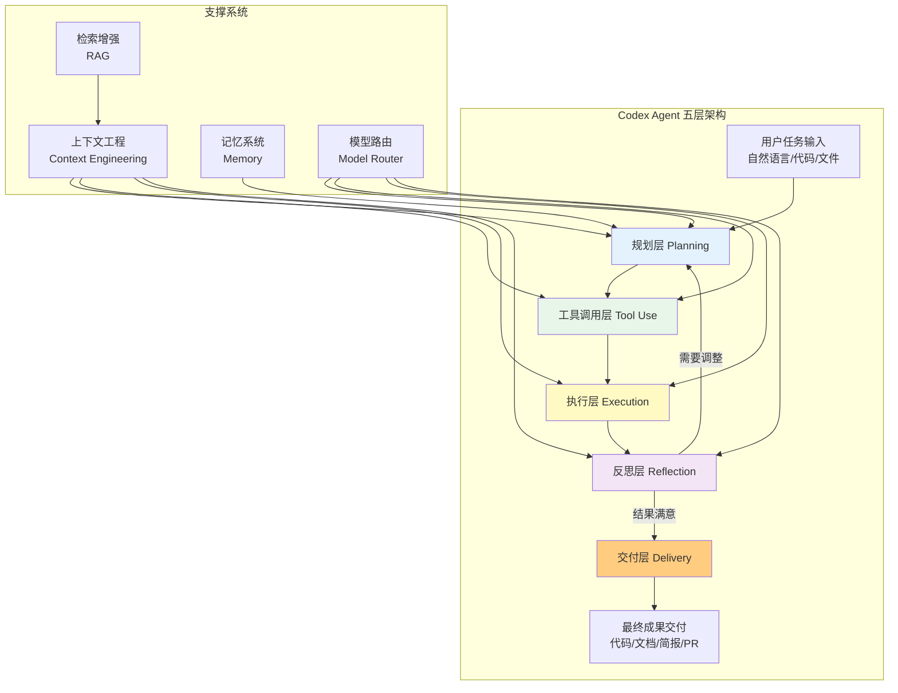

### 1.1 规划层（Planning）：任务理解与分解

规划层是Agent的"大脑"，负责理解用户的真实意图，并将复杂任务分解为可执行的子任务序列。

| 能力模块 | 具体功能 | 推测实现方式 |
|---|---|---|
| **意图理解** | 理解用户自然语言描述的真实需求，识别模糊点，必要时澄清 | 基于大模型的语义理解+few-shot示例+意图分类器 |
| **任务分解** | 将大任务拆分为有序的子任务步骤，识别依赖关系 | Chain-of-Thought思维链+Task Decomposition提示工程+可能的规划算法 |
| **依赖排序** | 判断子任务之间的先后顺序和依赖关系，决定执行路径 | DAG（有向无环图）任务编排+拓扑排序 |
| **假设生成** | 对任务中不明确的地方做出合理假设，并记录下来后续展示给用户 | 假设追踪系统，记录每一个假设及其来源 |
| **失败预案** | 预判可能失败的点，准备备选方案 | 可能的规划+执行+重规划（replan）循环 |

规划层不是一次性生成完整计划就结束了——它是一个动态的过程：在执行过程中如果发现计划有问题，反思层会触发重规划（replanning），调整后续步骤。这就是为什么Codex看起来能"随机应变"——它不是死板执行预设计划，而是根据实际情况动态调整。

### 1.2 工具调用层（Tool Use）：连接器选择与调用

工具调用层是Agent的"手眼"，负责决定"为了完成当前子任务，我需要调用哪个工具、传什么参数"。

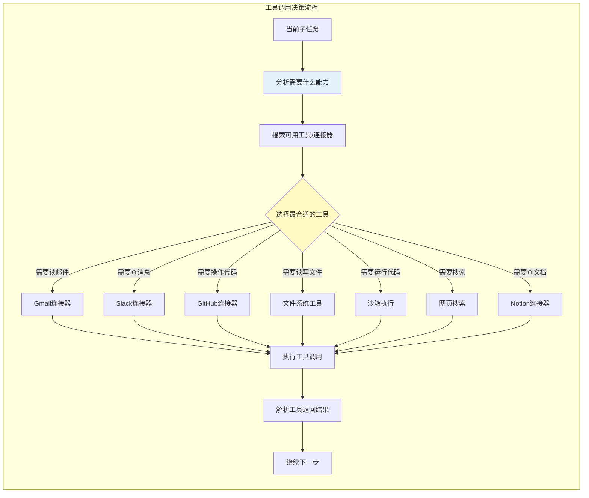

Codex工具调用层的关键推测特点：
1. **工具不是硬编码的**——通过MCP（Model Context Protocol）协议，第三方可以开发新的连接器，Codex能自动理解和使用新工具
2. **多工具并行调用**——复杂任务可能同时调用多个工具获取上下文
3. **工具结果智能解析**——不是简单把工具返回塞给模型，而是提取关键信息，过滤噪声
4. **错误处理与重试**——工具调用失败了会自动重试，或者换一种方式调用，或者换个工具
5. **权限管控**——不是所有工具都能随便调用，需要用户授权，而且有操作范围限制

### 1.3 执行层（Execution）：沙箱中的实际操作

执行层负责实际"干活"——运行代码、读写文件、调用API、创建PR、发送消息等。

| 执行环境 | 适用场景 | 特点 |
|---|---|---|
| **云端沙箱** | 异步任务、长时间运行任务、需要隔离环境的任务 | 隔离、安全、可连接GitHub执行测试、可访问网络API |
| **本地IDE环境** | VS Code/JetBrains扩展中的实时编码任务 | 直接操作用户本地文件系统，即时反馈 |
| **本地CLI环境** | 命令行中的开发任务、脚本执行 | 轻量、快速、适合自动化脚本场景 |
| **桌面应用环境** | Codex桌面应用中的混合任务 | 结合本地文件访问和云端能力 |
| **Web App环境** | 浏览器中的办公场景任务 | 主要操作连接器数据，生成文档/简报等 |

执行层的核心设计原则是**安全隔离**——不管是云端还是本地执行，都要有严格的权限控制：
- 云端沙箱是完全隔离的容器，任务结束后销毁
- 本地文件系统操作需要用户明确授权（可以选择"只读"或"读写"）
- API调用有作用域限制，不能访问用户未授权的数据
- 危险操作（比如删除文件、发送邮件、创建PR）需要用户确认

### 1.4 反思层（Reflection）：自我纠错与质量检查

反思层是Codex真正"智能"的关键——它不是执行完就完事，而是会回头检查"我做的对不对？有没有问题？要不要改进？"。

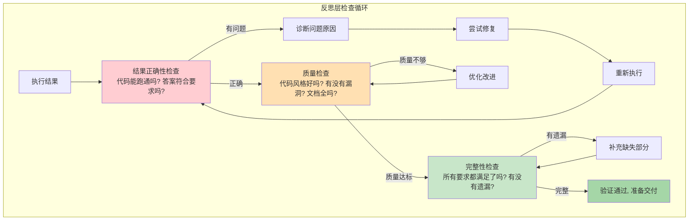

反思层的具体检查项推测包括：
1. **正确性检查**——代码能运行吗？测试能通过吗？逻辑有没有问题？
2. **错误自动修复**——如果发现错误，自动诊断原因并修复，而不是直接甩给用户
3. **质量检查**——代码风格是否规范？有没有明显的性能问题？有没有安全漏洞？
4. **完整性检查**——用户要求的所有点都覆盖了吗？有没有遗漏功能？
5. **向后兼容性检查**——代码改动会不会破坏现有功能？这是Duolingo案例中特别提到的能力
6. **可解释性记录**——记录下"我做了什么、为什么这么做、假设是什么"，后续展示给用户

Duolingo案例中提到Codex是"唯一能发现向后兼容性问题的工具"——这说明反思层不只是简单的语法检查，而是具备深度的上下文理解能力，能从业务逻辑层面判断改动可能带来的影响。

### 1.5 交付层（Delivery）：成果格式化与呈现

交付层负责把执行结果格式化成用户能用的最终产物，而不是简单丢一堆文本给用户。

| 交付物类型 | 适用场景 | 特点 |
|---|---|---|
| **代码改动PR** | 开发任务 | 直接在GitHub创建Pull Request，包含改动说明、测试结果 |
| **文档简报（.md/.doc）** | 办公任务、研究任务 | 结构化的文档，有标题、章节、表格、引用 |
| **表格数据（.xlsx/.csv）** | 数据分析、财务审计 | 格式化的表格，带公式、带图表 |
| **幻灯片（.pptx）** | 汇报、演示 | 完整的演示文稿，有排版、有视觉设计 |
| **邮件草稿** | 邮件处理 | 写好的邮件，用户可以直接编辑发送 |
| **消息回复** | Slack/IM回复 | 适合IM场景的简洁回复 |
| **任务总结** | 任何任务 | "我做了什么、来源是什么、假设是什么、下一步建议是什么" |

交付层的一个关键设计是**"展示你的工作（Show Your Work）"**——不只是给结果，还要展示：
- 来源：信息从哪里来的（哪个Gmail邮件、哪个Slack消息、哪个文件）
- 假设：做了哪些假设，为什么做这些假设
- 改动：具体改了什么，为什么这么改
- 下一步：建议用户接下来做什么

这就是Codex"可控感"设计的技术基础——用户能清清楚楚看到AI做了什么、为什么这么做，而不是面对一个黑盒结果。

---

## 二、沙箱执行环境：安全隔离与灵活执行的平衡

Codex需要执行用户的代码、操作文件系统、调用外部API——这些操作都有安全风险，因此必须有一个设计精良的沙箱环境。

### 2.1 双环境架构：云端沙箱 + 本地执行

Codex不是只有一个执行环境，而是采用**云端沙箱+本地执行**的双环境架构，根据任务类型选择最合适的环境：

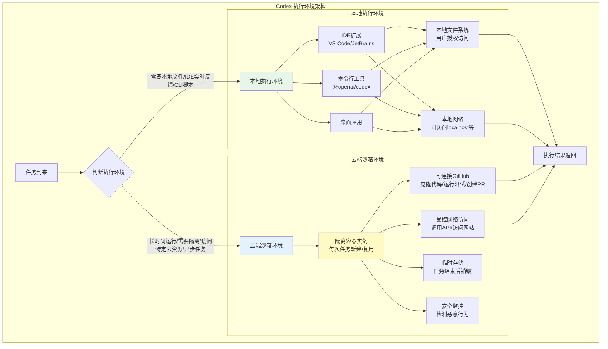

### 2.2 云端沙箱安全机制推测

云端沙箱是Codex执行高风险、长时任务的地方，安全机制必须做到位：

| 安全层级 | 机制 | 具体实现推测 |
|---|---|---|
| **容器隔离** | 每个任务在独立容器中运行 | 基于Firecracker或类似轻量虚拟化技术，内核级隔离，任务结束容器销毁 |
| **网络访问控制** | 不是完全开放网络 | 白名单机制，只能访问预定义的安全域名；或有流量监控检测异常访问 |
| **资源限制** | 防止DoS或资源滥用 | CPU/内存/磁盘/运行时间都有配额限制，超过就终止任务 |
| **文件系统隔离** | 看不到其他任务的数据 | 每个容器有独立的临时文件系统，任务结束后彻底删除 |
| **恶意代码检测** | 防止执行危险操作 | 静态扫描+运行时行为分析，检测挖矿、数据外传、系统破坏等行为 |
| **无持久化** | 不保留用户数据 | 任务结束后所有临时数据、缓存、容器实例都销毁，不持久化存储 |
| **密钥管理** | API密钥等敏感信息不泄露 | 连接器授权token安全存储，沙箱里只能通过受控接口访问，不能直接读取 |

### 2.3 本地执行的权限设计

本地执行环境（IDE/CLI/桌面）能直接访问用户的文件系统，权限设计更是重中之重：

1. **最小权限原则**——默认没有任何权限，需要用户主动授予
2. **授权粒度精细**——不是"给所有文件访问权"，而是可以授权"只访问当前项目目录"
3. **读写分离**——可以选择"只读"还是"读写"，敏感目录默认只读
4. **危险操作确认**——删除文件、覆盖重要文件、执行系统命令、发送邮件等操作，必须弹出确认框让用户确认
5. **操作审计**——所有本地文件修改都有记录，可以回滚
6. **路径保护**——系统关键目录（如/etc、~/.ssh等）默认禁止访问或需要额外确认

Ramp案例中提到Codex能"识别团队容易忽略的漏洞"——这说明执行环境不仅是跑代码，还集成了安全扫描能力，在执行过程中就能发现安全问题。

---

## 三、上下文工程（Context Engineering）：AI产品的核心竞争力

很多人以为AI产品的竞争是"谁的模型更强"——但实际上，**上下文工程才是AI产品真正的护城河**。模型能力大家都能调用，但"能不能把用户需要的正确信息，在正确的时间，以正确的方式给到模型"，这才是决定产品体验的关键。Codex在这方面下了极大的功夫。

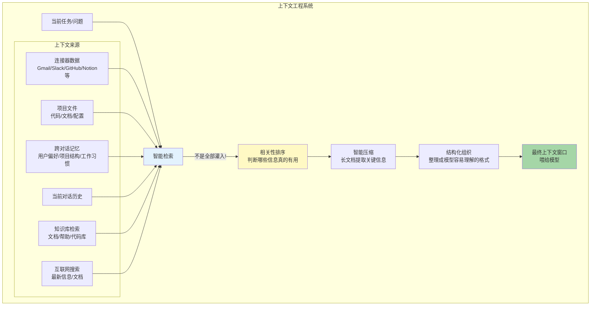

### 3.1 智能选择而非全部灌入：上下文检索策略

上下文工程最核心的误区是"把所有能拿到的信息都塞给模型"——这恰恰是最差的做法：
- 上下文窗口是有限的，塞太多无关信息会让模型"分心"，关键信息反而被淹没
- 信息太多会降低推理质量，模型容易"迷路"
- 成本高、速度慢，用户体验差

Codex的做法是**智能选择**——不是"能拿多少拿多少"，而是"判断当前任务需要什么，只拿最相关的"：

| 检索策略 | 具体做法 |
|---|---|
| **按需检索** | 不是一开始就把所有连接器数据都拉过来，而是执行到某个步骤发现需要某个信息，再去检索 |
| **相关性排序** | 对检索到的信息做相关性评分，只取排名靠前的最相关的N条 |
| **分层检索** | 先粗检索找到可能相关的文档，再细检索提取具体片段 |
| **动态扩展** | 如果发现信息不够，再逐步扩大检索范围；如果信息够了就停止 |
| **去重与过滤** | 过滤掉重复信息、无关信息、噪声信息 |

### 3.2 长上下文窗口与模型能力

虽然不是"全部灌入"，但足够大的上下文窗口依然是基础能力——GPT-5.5系列模型支持超长上下文窗口，这让Codex能处理：

| 长上下文场景 | 具体能力 |
|---|---|
| **大型代码库理解** | 一次把整个项目的关键文件放进去，理解整体架构，而不只是看单个文件 |
| **长文档处理** | 处理几百页的PDF、财报、法律合同，不用拆分 |
| **长对话历史** | 保持几个月的对话记忆，不用频繁"忘记"之前讨论的内容 |
| **多源信息整合** | 同时把Gmail历史、Slack讨论、GitHub PR、代码文件都放进来交叉分析 |

大窗口不是用来"塞垃圾"的——是用来在需要的时候能装下真正相关的大量信息，结合上面的智能检索策略，做到"该装的都能装下，不该装的绝不塞进来"。

### 3.3 记忆系统：跨对话的用户理解

真正好用的AI助手不是"每次对话都从零开始"——它应该记住你是谁、你喜欢什么、你在做什么项目、你的工作习惯是什么。Codex有一套跨对话的记忆系统：

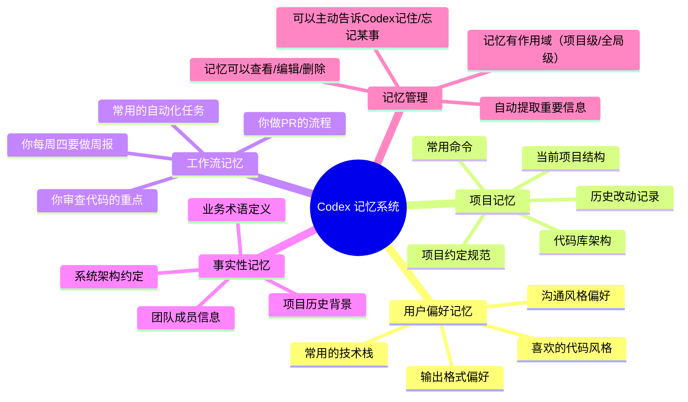

记忆系统的关键设计点：
1. **自动提取**——不需要用户主动说"记住这个"，Codex会在对话中自动识别重要信息并记住
2. **可控可编辑**——用户能看到Codex记住了什么，能修改、能删除——透明、可控
3. **分级记忆**——有短期记忆（当前对话）、长期记忆（跨对话）、项目记忆（只在某个项目里生效）
4. **记忆检索**——需要的时候智能检索相关记忆，不是全部都塞进来

### 3.4 RAG检索增强：从知识库中找答案

对于连接的知识库（比如公司文档、Notion知识库、代码库文档、帮助中心），Codex使用RAG（Retrieval-Augmented Generation）技术：

1. **离线索引**——先把知识库文档分块、生成embedding、建立向量索引
2. **在线检索**——用户提问时，把问题转成embedding，去向量库中找最相关的文档片段
3. **上下文注入**——把找到的相关片段和问题一起喂给模型，让模型基于这些信息回答
4. **引用标注**——回答中标注信息来自哪个文档、哪一页，用户可以溯源

这就是为什么Codex能回答关于你公司内部文档、你项目代码库的问题——它不是凭空编，是真的检索到了相关信息再回答。

---

## 四、模型策略：分层模型与智能路由

Codex不是只用一个模型打天下——它有一个完整的模型矩阵，并且有智能路由机制根据任务类型自动选择最合适的模型。

### 4.1 模型矩阵推测

| 模型 | 定位 | 核心优化方向 | 适用场景 |
|---|---|---|---|
| **GPT-5.3-Codex** | 专用编程模型 | 代码理解、代码生成、代码审查、调试 | 纯代码任务：写代码、改bug、PR审查、重构——编程相关任务优先用这个 |
| **GPT-5.5 / GPT-5.5 Pro** | 旗舰通用模型 | 复杂推理、多模态理解、长上下文、工具使用 | 最复杂的任务：跨工具的大型工作流、需要深度思考的分析、多模态任务（图+文+代码）、办公场景复杂任务 |
| **GPT-5.4** | 主力平衡模型 | 速度/能力/成本的平衡 | 绝大多数日常任务：常规编码、文档处理、数据分析、一般对话——Plus用户的主力模型 |
| **GPT-5.4-mini** | 轻量快速模型 | 速度快、成本低、配额耐用 | 简单任务：快速问答、代码补全、简单修改、格式转换——配额不够时降级使用 |

### 4.2 智能模型路由：为什么这很重要

不是"最强的模型做所有事"——那样成本太高、速度太慢。智能路由根据多个维度自动选择模型：

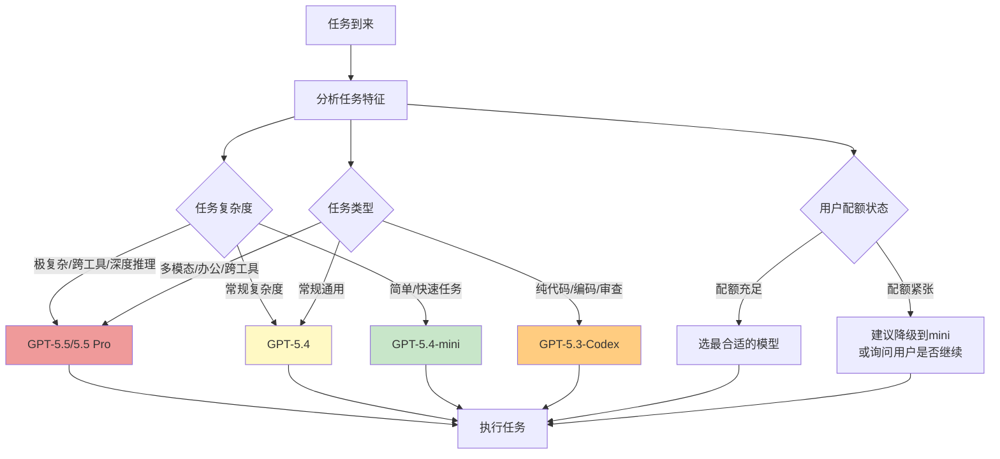

模型路由考虑的维度推测包括：
1. **任务类型**——纯代码任务优先路由到GPT-5.3-Codex，通用任务用5.4，复杂任务用5.5
2. **任务复杂度**——需要深度推理的复杂任务用强模型，简单任务用mini
3. **延迟要求**——用户在IDE里实时输入需要快速补全，用速度快的mini；异步云端任务可以用强模型多花点时间
4. **用户配额**——配额充足用最好的，配额紧张提醒用户或自动降级
5. **历史反馈**——如果用户之前手动切过模型，记住用户偏好
6. **成本优化**——在满足质量要求的前提下，尽量用成本更低的模型，节省资源

这种智能路由是多赢：用户得到合适的速度和质量，OpenAI优化了资源成本，平台能承载更多用户。

---

## 五、代码审查技术：从语法检查到业务逻辑理解

Codex的代码审查能力被Duolingo、Ramp等公司高度评价——它不只是做lint风格检查，而是能发现人类审查者容易遗漏的深层问题。

### 5.1 代码审查技术栈推测

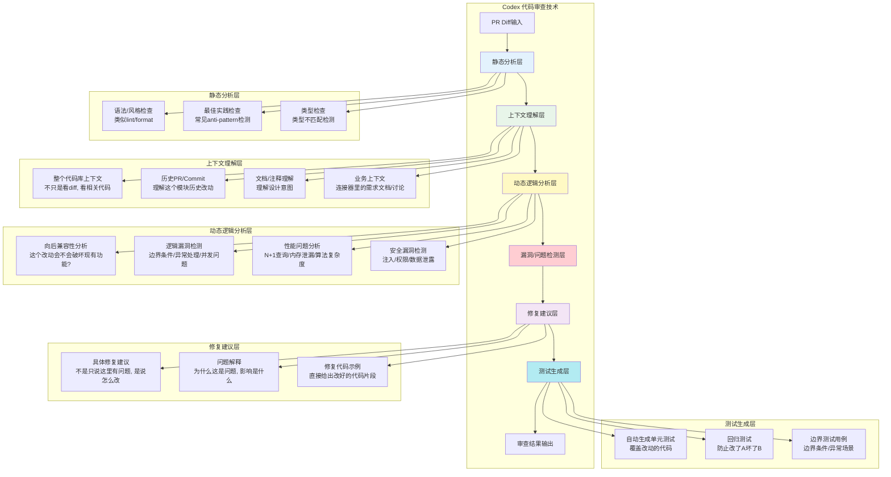

### 5.2 为什么Codex能发现人类发现不了的问题

Duolingo说Codex是"唯一能发现向后兼容性问题的工具"——这背后是几个关键能力：

1. **全代码库上下文理解**——人类审查者通常只看diff，很难记住整个代码库所有调用这个函数的地方；Codex能检索整个代码库，找到所有被影响的地方
2. **历史记忆**——能看到这个模块的历史改动，理解之前踩过什么坑，为什么这么写
3. **业务上下文结合**——能结合GitHub PR讨论、Jira工单、Slack讨论里的业务背景，理解"为什么要做这个改动，改完应该达成什么业务目标"
4. **不知疲倦**——人类审查到第10个PR就疲劳了，容易走神漏问题；AI不会疲劳，每一行代码都仔细分析
5. **模式匹配**——见过成千上万的bug模式，能识别出人类没见过但类似的问题

Ramp说Codex能"识别团队容易忽略的漏洞"——这是因为人类有"盲点"：团队待久了会形成思维定式，某些写法看久了就觉得"一直都是这么写的，没问题"；但AI没有这种思维定式，能客观分析每一处代码。

### 5.3 审查结果输出格式

Codex的审查结果不是简单的"这里有问题"，而是结构化的、可操作的：

| 输出项 | 内容 |
|---|---|
| **问题定位** | 精确到文件、行号，指出具体哪里有问题 |
| **问题描述** | 用清晰的语言说明这是什么问题、为什么是问题 |
| **影响分析** | 这个问题可能导致什么后果、影响哪些功能/用户 |
| **严重程度** |  Critical/High/Medium/Low分级，优先处理严重问题 |
| **修复建议** | 具体怎么改，给出修复代码片段 |
| **测试建议** | 应该加什么测试来覆盖这个问题，防止再出现 |
| **正向反馈** | 不只挑错，也指出哪里写得好，鼓励好的实践 |

---

## 六、多端同步机制：一个智能体，全平台连贯体验

Codex支持Web、IDE、CLI、桌面、移动端这么多端，但它们不是各自独立的——它们共享同一个智能体、同一个账号、同一份上下文、同一个配额池。

### 6.1 同步架构推测

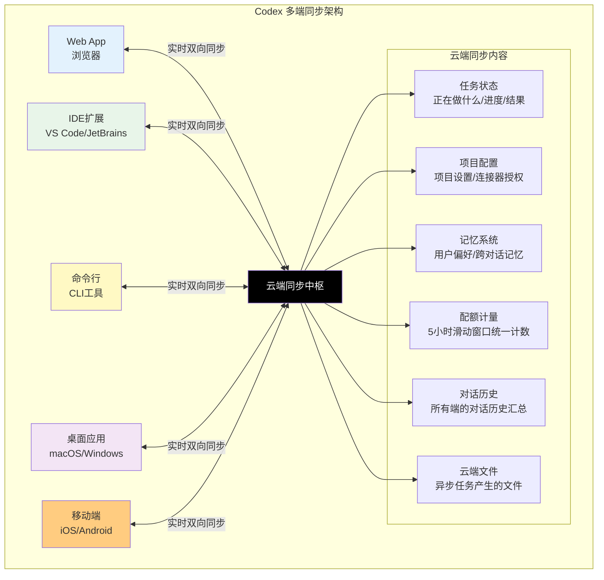

### 6.2 同步内容详解

| 同步内容 | 同步机制 | 用户价值 |
|---|---|---|
| **任务状态实时同步** | 云端任务在所有端实时显示状态——你在Web上开始一个长任务，IDE里能看到进度，手机上能收到完成通知 | 不用守在一个地方等任务完成，在哪都能看进度、接结果 |
| **项目配置跨设备** | 连接器授权、项目设置、自定义指令在所有设备同步——你在公司电脑配好了GitHub连接，回家用自己的电脑不用重新配 | 一次配置，全端生效，不用每台设备都设置一遍 |
| **记忆系统全局同步** | 用户偏好、工作习惯、项目记忆在所有端共享——不管你在哪个端用，Codex都"认识你" | 体验连贯，不会出现"在Web上它知道我喜欢什么，到IDE里就忘了" |
| **配额统一计量** | 不管你在哪个端用，配额都算在同一个池子里，5小时滑动窗口全局统一 | 用户不用算"我在IDE用了多少，在Web还能用多少"——一个池子统一算 |
| **对话历史漫游** | 在Web上聊到一半，回家打开桌面应用能接着聊，所有历史对话在所有端都能看到 | 工作无缝衔接，在哪都能继续之前的工作 |
| **文件云中转** | 云端任务生成的文件存在云端，所有端都能下载；本地大文件可能有选择性同步 | 异步任务生成的PR、文档、表格在哪都能取 |

### 6.3 本地-云端协作机制

对于本地执行的任务（IDE/CLI/桌面），同步机制是这样的：
1. 本地执行的动作和结果，异步同步到云端
2. 网络不好时本地缓存，联网后自动同步
3. 敏感文件内容默认不上传，只同步元数据和必要的上下文（除非用户选择云端处理）
4. 大文件只传hash和embedding用于检索，不传原始内容，保护隐私和带宽

---

## 七、MCP协议：开放生态的基础

Codex不是一个封闭系统——它通过MCP（Model Context Protocol）开放了工具扩展接口，第三方开发者可以开发自己的连接器。

### 7.1 MCP协议的意义

MCP就像是AI领域的"USB接口"——在MCP之前，每个AI工具都要自己做集成，每个SaaS工具都要单独对接每个AI平台；有了MCP，一次开发就能接入所有支持MCP的AI客户端。

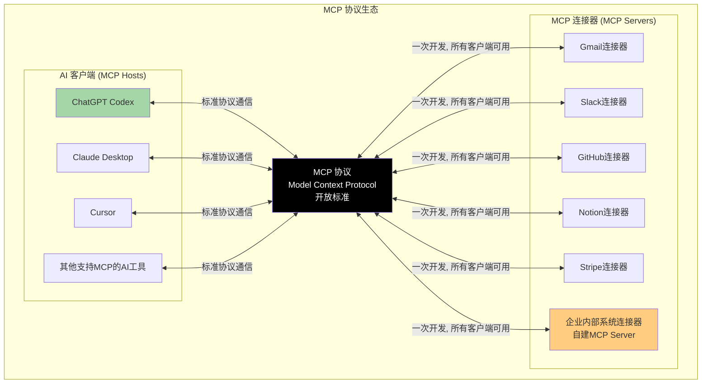

### 7.2 MCP连接器能做什么

一个MCP连接器可以向Codex暴露三类能力：

| 能力类型 | 说明 | 示例 |
|---|---|---|
| **资源（Resources）** | 可以被读取的数据 | 读取Gmail邮件、读取Notion页面、读取数据库记录、读取文件 |
| **工具（Tools）** | 可以被调用执行的动作 | 发送Slack消息、创建GitHub PR、创建Jira工单、发送邮件 |
| **提示（Prompts）** | 预构建的提示模板 | "总结本周未读邮件"、"审查这个PR"、"生成本周周报" |

MCP的开放意味着Codex的能力没有边界——任何开发者都可以为任何SaaS工具、内部系统、数据库开发MCP连接器，Codex就能自动使用这个工具。这比OpenAI自己一个个做连接器快得多，生态一旦形成就会产生网络效应。

---

## 八、技术架构总结

ChatGPT Codex的技术架构是当前AI Agent产品的标杆——它不是简单的"套壳GPT"，而是一套由五层Agent架构、智能上下文工程、双模式沙箱、分层模型路由、多端同步、开放MCP协议共同组成的复杂系统。

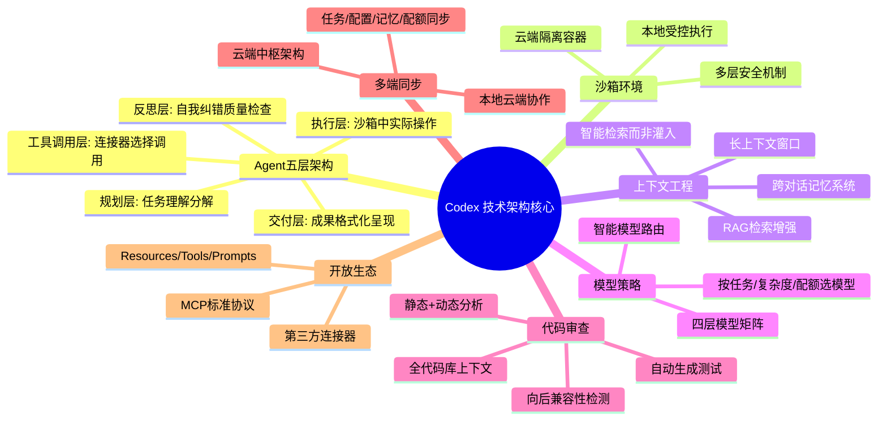

对技术团队和AI产品设计者的启示：

1. **Agent架构是分层的，不是一个提示词搞定一切**——规划、工具调用、执行、反思、交付，每层各司其职，又动态循环
2. **上下文工程比模型本身更重要**——模型能力是基础，但"给模型什么信息"决定了输出质量；智能检索、记忆、RAG是真正的护城河
3. **执行环境必须安全优先**——既要让AI能干活，又要保证安全；云端沙箱+本地授权的双模式是合理选择
4. **模型不要一刀切，要分层路由**——简单任务用小模型快且省，复杂任务用大模型保质量，智能路由平衡体验、成本、速度
5. **多端体验必须连贯**——用户在哪都能继续工作，一个智能体、一个账号、一份上下文、一个配额池
6. **开放生态才能做大**——MCP这样的开放协议让第三方帮你建生态，比自己做所有连接器快得多
7. **AI要有反思能力**——不是执行完就完事，要能自我检查、自我纠错、保证质量，这才是"智能"的体现
8. **交付成果，不要交付文本**——最终产出要格式化成用户能用的东西（PR/文档/表格/幻灯片），而不是一堆聊天记录

技术架构是为产品体验服务的——Codex这些技术选择最终都指向同一个目标：**让用户感觉是在和一个能干、可靠、懂你、让人放心的助手协作，而不是在使用一个复杂的技术工具**。

---

**下一步**：继续阅读 [12 可借鉴的设计理念](12-design-insights.md)，提炼12个可直接复用在AI产品/SaaS产品设计中的核心设计原则。
