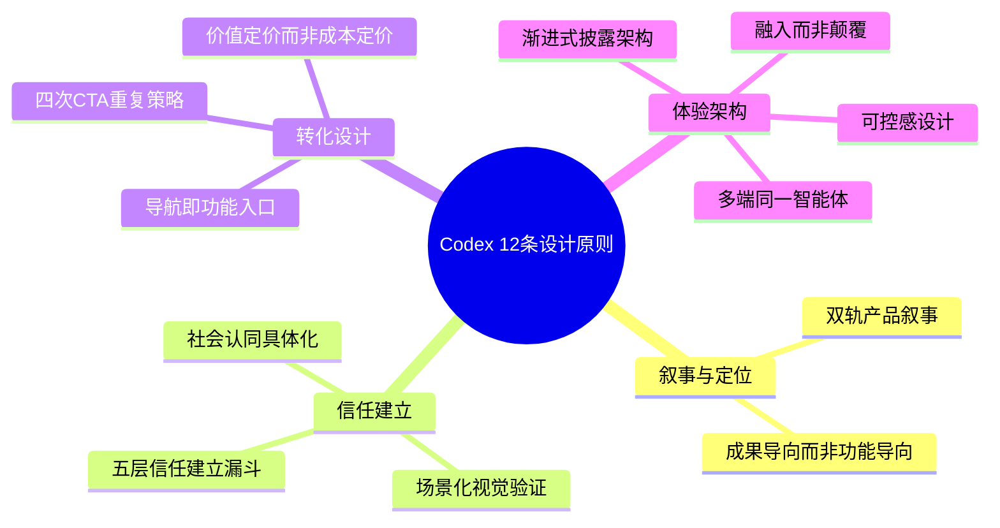
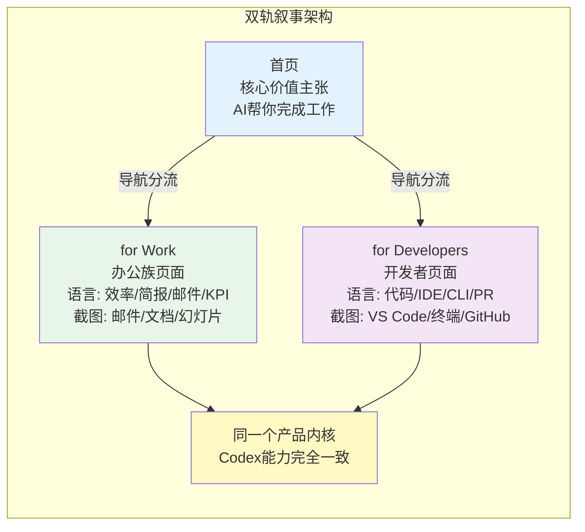
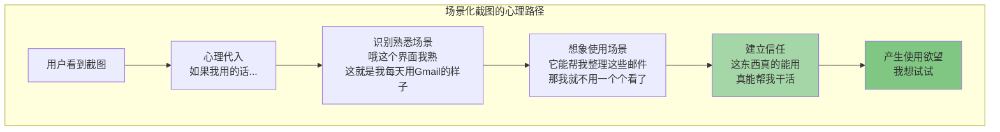
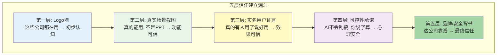
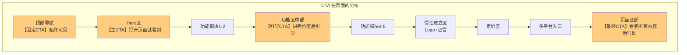
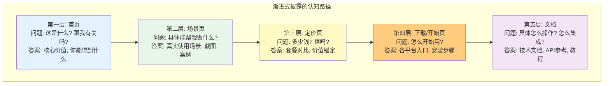
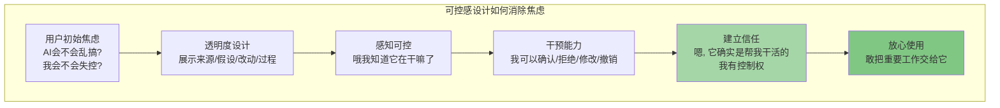
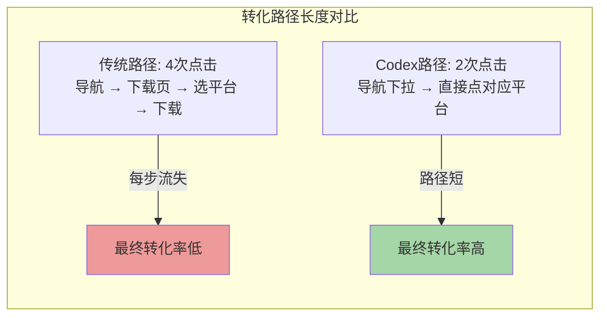
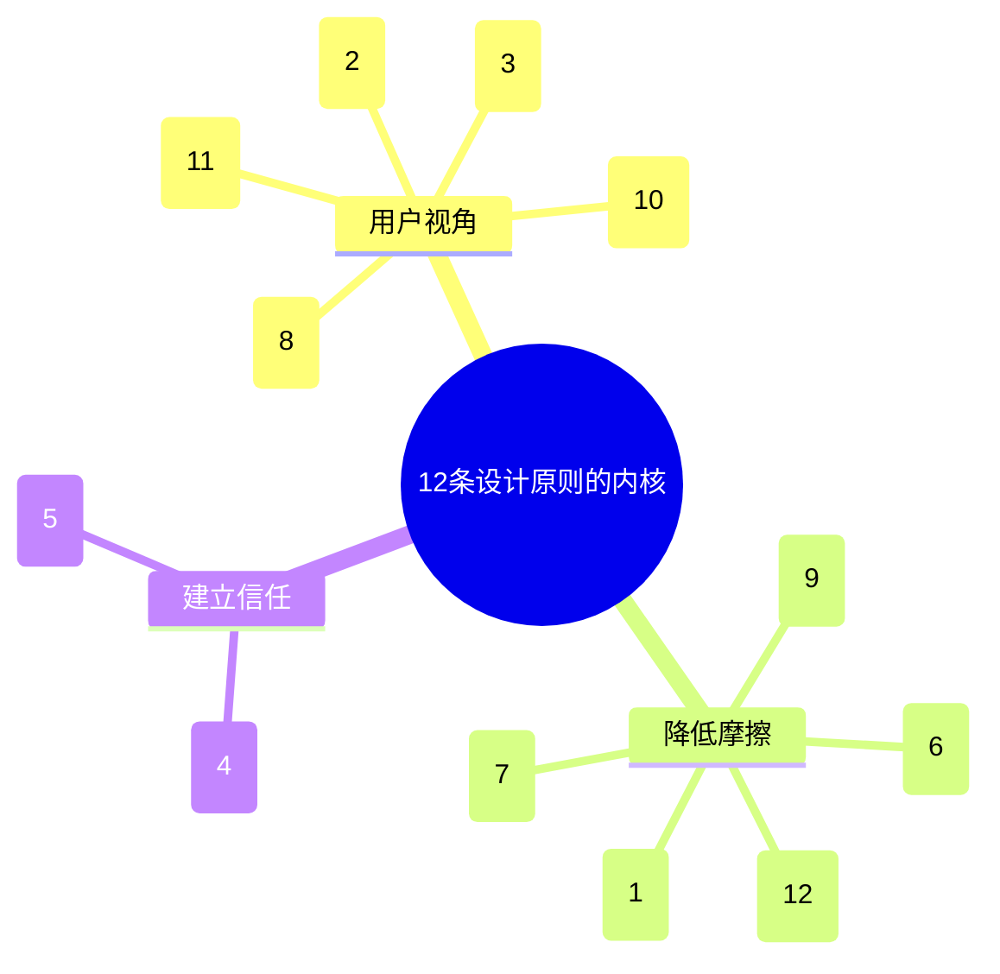

## 一、设计理念概述：从Codex中学到的12条可复用原则

ChatGPT Codex的产品设计和落地页是教科书级别的——它不是"功能堆砌"，而是每一个设计决策都服务于清晰的商业目标和用户体验目标。本章提炼12个可以直接复用在你的产品设计中的核心理念，每个原则都包含：**Codex具体怎么做**、**为什么这样做有效**、**我们可以如何借鉴**。

这些原则不是"设计玄学"——它们是经过OpenAI精心打磨、用数据验证过的有效策略，可以直接应用到SaaS产品、AI产品、ToB产品的设计中。

---

## 二、12个可直接复用的设计原则

### 原则1：双轨产品叙事——同一内核，不同故事讲给不同人听

| 维度 | 内容 |
|---|---|
| **设计原则** | 同一个产品内核，面向不同用户群体用完全不同的价值叙事，不要试图用一套话术打动所有人 |
| **Codex怎么做** | Codex有两个独立的落地页： • **for-work（面向办公族）**：讲"帮你处理邮件、写周报、做KPI分析、生成简报"，用商务场景截图，讲办公效率 • **for-developers（面向开发者）**：讲"代码审查、IDE集成、CLI工具、GitHub PR"，用开发者界面截图，讲编码效率 两个页面产品是同一个，但是价值故事完全分开，导航里明确区分"Work"和"Developers"两个入口 |
| **为什么有效** | 办公族和开发者关心的点完全不同： • 办公族不关心什么是CLI、什么是MCP，他们关心"能不能帮我省时间写周报" • 开发者不关心"生成KPI简报"，他们关心"能不能帮我在VS Code里改bug" 如果混在一起讲，两边的人都觉得"这不是给我用的"；分开讲，每个人进来都觉得"这就是我需要的" |
| **我们如何借鉴** | 如果你的产品同时服务多类差异很大的用户： 1. **不要试图做一个"大而全"的首页覆盖所有人**——首页只讲最普适的价值，然后在导航明确分流 2. **每个用户群有自己独立的落地页**——用他们的语言、他们的场景、他们的截图、他们关心的痛点 3. **保持产品内核统一**——不要做成两个产品，底层能力是一套，只是叙事和表层功能侧重不同 4. **导航入口要清晰分流**——"我是企业用户"/"我是开发者"/"我是个人用户"，让用户一进来就选对自己的路径 反例：很多产品首页想"既要又要"，一会儿讲企业管理，一会儿讲开发者API，结果企业用户觉得太技术，开发者觉得太虚 |

---

### 原则2：成果导向而非功能导向——用户买的是洞，不是钻头

| 维度 | 内容 |
|---|---|
| **设计原则** | 不要说"我们有XX功能"，要说"用了我们的产品你能得到XX成果"——用户买的不是功能，是功能带来的结果 |
| **Codex怎么做** | Codex不说"我们有代码生成功能"、"我们有连接器"、"我们支持沙箱执行"——这些都是功能术语。Codex说： • "周末就完成了季度的工作量" • "直接交付完成的代码、简报、幻灯片" • "帮你审查PR，发现人类发现不了的bug" • "连接Gmail后自动整理未读邮件生成摘要" Hero区大字是"为电脑工作的AI"——这是结果；功能列表里的每一项都用"能帮你做什么具体工作"来描述，不是"我们有什么技术" |
| **为什么有效** | 这是经典的市场营销原理：用户不关心你的产品是什么，只关心产品能帮**他**做什么。 • "我有128GB存储"——没人关心 • "存10000张照片不用删"——这用户关心 • "我们有Connectors连接器"——用户听不懂 • "直接读取你的Gmail/Slack/GitHub，不用你搬数据"——这用户懂 功能列表是"我们有什么"，成果描述是"你能得到什么"——后者才有说服力 |
| **我们如何借鉴** | 写文案和设计功能展示时做一个简单测试： 1. **把"我们支持XXX"改成"你可以用它来XXX"**——从主语"我们"变成主语"你" 2. **每个功能点问"然后呢？"**——"我们有代码生成"→"然后呢？"→"你不用自己写重复代码"→"然后呢？"→"你一天的活两小时干完" 3. **用具体的工作场景描述，不用抽象功能名**——不说"数据分析功能"，说"帮你做KPI汇报、财务审计、销售数据分析" 4. **Hero区不要放功能列表，放最终成果**——用户打开页面第一眼看到的应该是"用了这个我能变成什么样/做成什么事"，不是"这个产品有10个功能" 5. **最好的成果描述是有真实用户原话**——"周末完成季度工作"这是用户说的，比你自己写100句都有用 |

功能导向 vs 成果导向对比：

| 功能导向（差的文案） | 成果导向（好的文案） |
|---|---|
| "支持多种大语言模型" | "复杂任务用最强模型，简单任务用快速模型，既快又好还省配额" |
| "提供IDE扩展" | "在你熟悉的VS Code里直接用，不用切换窗口" |
| "具备沙箱执行环境" | "代码在安全环境中运行测试，不用担心弄坏你的系统" |
| "支持MCP协议" | "可以连接你正在用的任何工具，我们的生态每天都在长大" |
| "5小时滑动窗口配额" | "集中用一阵后，等几小时配额就回来，不用等第二天" |

---

### 原则3：场景化视觉验证——让用户"看见"自己在用

| 维度 | 内容 |
|---|---|
| **设计原则** | 每个功能都配**真实使用场景的截图**，不是抽象插画、不是概念图、不是空状态——让用户打开页面就能"看见"自己用这个产品的样子 |
| **Codex怎么做** | Codex落地页每一个功能模块都是**左/右文+另一侧真实产品截图**交替布局，而且截图极其讲究： • 不是截个空界面，截图里有**真实内容**——Gmail截图里有真实的邮件列表，Slack截图里有真实的对话，VS Code截图里有真实的代码 • 截图配**精确的alt文本和说明**——告诉你截图里展示的是什么场景，不是随便放个图 • 截图里的内容是**用户真实会遇到的场景**——"审查一个PR"、"整理未读邮件"、"分析销售数据"，不是"欢迎使用Codex"这种空状态 • 左文右图交替——视觉节奏舒服，不会看累 |
| **为什么有效** | 这是心理学中的"具象化效应"：**人们对具体、可视、能想象自己在里面的场景，信任度和购买意愿远高于抽象描述**。 当用户看到一张真实的、有具体内容的产品截图，他的大脑会自动进行"心理模拟"——"如果我用的话，我的屏幕也会是这样，我也能这么做"。这种代入感是抽象插画和功能列表给不了的。 反过来说，如果你放的是抽象插画、3D小人、空界面截图，用户看完还是不知道"这东西实际用起来是什么样"，无法代入，信任就建立不起来。 |
| **我们如何借鉴** | 1. **每个核心功能都配真实场景截图，不要用插画**——除非你是做创意/艺术产品，否则SaaS/AI产品请用真实产品截图 2. **截图里要有真实内容，不要截空状态**——放真实的邮件、真实的代码、真实的表格数据，让截图看起来"正在使用中" 3. **截图内容要对应你描述的场景**——如果你说"帮你处理邮件"，截图里就应该是正在处理邮件的界面，不是放个仪表盘首页 4. **如果有多类用户，截图要匹配目标用户**——办公页面用办公场景截图，开发者页面用开发者界面截图 5. **左文右图交替布局是非常稳的视觉节奏**——不要所有图都放一边，交替来视觉上更舒服 6. **给图片写清楚说明文字**——不要让用户猜"这张图展示的是什么"，图下面/旁边直接写清楚 7. **截图里的内容要真实可信**——不要用"Lorem ipsum"假文案，要用看起来真实的内容，哪怕是模拟的 |

---

### 原则4：五层信任建立漏斗——从"听说过"到"放心用"

| 维度 | 内容 |
|---|---|
| **设计原则** | 信任不是一下子建立的，是一层一层叠加的——你需要在用户决策路径的每个节点，给到对应的信任证据，从"知道你"到"信你"到"用你"到"敢把重要工作交给你" |
| **Codex怎么做** | Codex落地页有一个非常清晰的五层信任漏斗，层层递进： 1. **客户Logo墙（第一层）**：页面顶部下方放一长串知名公司Logo——Cisco、Duolingo、Ramp、Virgin Atlantic...你一进来先看到"哇这些大公司都在用" 2. **真实使用场景（第二层）**：然后是功能模块+真实截图——你看到它真的能在Gmail里、Slack里、VS Code里干活，不是PPT产品 3. **用户证言（第三层）**：然后是带真实姓名、职位、公司、头像的用户引述——"这是Duolingo的高级工程师说的，这是Ramp的工程师说的"，不是"某用户"这种匿名评价 4. **可控性承诺（第四层）**：专门有模块讲"一切尽在你的掌控之中"——展示来源、展示假设、展示改动、需要确认，消除"AI乱搞"的焦虑 5. **品牌背书（第五层）**：最后是OpenAI的品牌——ChatGPT已经有几亿用户，这个信任基础本身就是巨大的背书 |
| **为什么有效** | 用户对AI产品的不信任是分层的： • 第一层怀疑："这东西是不是吹的？是不是只有demo？"→Logo墙证明大公司在用 • 第二层怀疑："它实际用起来是什么样？是不是跟说的不一样？"→真实截图证明真有这个功能 • 第三层怀疑："真的好用吗？别是营销吧？"→真实用户（还是大公司的工程师）说好用，可信度高 • 第四层怀疑（AI产品特有）："它会不会乱改我东西？会不会瞎搞？"→可控性承诺消除焦虑 • 第五层怀疑："这公司会不会跑路？靠不靠谱？"→OpenAI品牌背书 每一层怀疑都有对应的信任证据去打消，层层递进，到最后用户心里的顾虑基本都被打消了 |
| **我们如何借鉴** | 设计你的落地页信任体系时，按这个漏斗检查： 1. **第一层：社会证明先上**——页面不要一开始就讲功能，先放客户Logo、用户数、使用量这些"第一眼信任信号" 2. **第二层：眼见为实**——功能一定要配真实截图/视频演示，光说没用，要让用户看到真东西 3. **第三层：用户证言要具体**——不要用"某500强公司CIO"这种匿名的，要带真实姓名、真实职位、真实照片、具体说了什么；最好是有影响力的公司/人 4. **第四层（AI/自动化产品必加）：可控感设计**——一定要专门讲"你有控制权"、"我们会展示来源"、"危险操作需要你确认"，这是AI产品特有的信任障碍 5. **第五层：品牌与保障**——如果是大公司，品牌放最后；如果是初创公司，可以放安全认证、退款保证、联系方式等 6. **信任证据要分散在整个页面**——不要堆在一个叫"客户评价"的板块，而是自然穿插在功能介绍里，讲完一个功能配一个用户证言，效果更好 |

---

### 原则5：四次CTA重复策略——在决策路径每个节点都给行动入口

| 维度 | 内容 |
|---|---|
| **设计原则** | 不要只在页面底部放一个"立即注册"按钮——用户在页面的任何位置，只要他被说服了，都应该立刻能看到行动按钮，不需要滚到最下面 |
| **Codex怎么做** | Codex页面里至少有四次CTA（Call to Action，行动召唤）出现，分布在用户决策路径的不同节点： 1. **第一次：导航栏固定CTA**——页面最顶部导航右侧，始终固定在那里，"立即试用"按钮，不管你滚到哪里都能看到 2. **第二次：Hero区主CTA**——打开页面第一眼就能看到的大按钮，"免费开始"或"立即试用"，给刚进来就想试的急性子用户 3. **第三次：功能区引导CTA**——讲完几个核心功能、用户已经觉得"这东西真有用"之后，再来一次CTA，"现在就试试" 4. **第四次：页面底部重复CTA**——看完了所有内容（包括定价、平台入口），最后再来一次大的CTA，"开始使用"或"立即下载" 而且这些CTA文案一致、视觉一致，都是同一个主按钮样式 |
| **为什么有效** | 用户的转化决策不是在某一个固定时刻发生的： • 有的用户是急性子，进来看到Hero就想试——你要在Hero给他按钮 • 有的用户要看完功能才信——你要在功能讲完后给他按钮 • 有的用户谨慎，要看完所有内容、看完定价才决定——你要在底部给他按钮 • 还有的用户看着看着突然被某个功能打动了——这时候如果顶部固定导航有CTA，他不用滚，点一下就行 如果你只在底部放一个CTA，那些中间就被说服的用户可能因为"懒得滚下去"就流失了。固定CTA解决了这个问题。 |
| **我们如何借鉴** | 1. **导航栏一定要有固定CTA**——不管滚到哪里，右上角始终有个"免费开始"/"注册"/"试用"按钮，这是转化率提升最明显的一招 2. **Hero区必须有主CTA**——打开页面第一眼就能看到，这是给"快速决策者"的 3. **功能介绍中间插1-2次CTA**——讲完2-3个核心功能，用户已经觉得"不错"的时候，再来一次引导，不要等看完所有内容 4. **页面底部必须有最终CTA**——看完所有内容的用户，最后给他一个清晰的行动按钮 5. **所有主CTA视觉要一致**——用同一个颜色、同一个样式、文案尽量统一，让用户形成认知"这个颜色的按钮就是我要开始用的按钮" 6. **CTA文案要具体，不要模糊**——"免费试用"比"开始"好，"立即下载VS Code扩展"比"了解更多"好；如果是免费产品，直接说"免费开始"，强调零风险 7. **CTA不要太多太杂**——主CTA就一个，次要按钮（"了解更多"、"看演示"）样式要弱，不要抢主CTA的注意力 |

CTA分布示意图：

---

### 原则6：渐进式披露架构——不要一上来就把用户淹死

| 维度 | 内容 |
|---|---|
| **设计原则** | 信息披露要循序渐进——首页讲价值，子页面讲场景，文档讲实现；不要让新用户一进来就面对技术细节、定价细节、配置细节，按认知深度分层展示 |
| **Codex怎么做** | Codex的信息架构是典型的渐进式披露，一层比一层深入： 1. **第一层：首页（codex/）**——只讲一件事："Codex是什么，能帮你做什么"，不涉及技术细节、不涉及价格、不涉及怎么用，建立认知和价值 2. **第二层：场景页（for-work/for-developers）**——讲具体场景怎么用，给目标用户看"你可以这么用"，比首页深入，但还是用户语言 3. **第三层：定价页（pricing）**——用户已经觉得"这东西我需要"了，再告诉他多少钱、哪个套餐适合他 4. **第四层：下载/入口页（download）**——决定要买/要试了，再告诉他"从哪里开始用"，给IDE/CLI/桌面各平台的下载入口 5. **第五层：开发者文档（developers.openai.com/codex）**——真正要用了、要集成了、要深入了，才给技术文档、API参考、CLI命令 每一层只解决该层用户的问题，不越界 |
| **为什么有效** | 新用户的认知是有过程的，不是一打开页面就能接受所有信息： • 刚进来时他脑子里的问题是"这是什么？跟我有关系吗？"——你要回答这个问题，不是给他甩API文档 • 觉得有关系了，他会问"具体能帮我做什么？适合我吗？"——这时候给他看场景页 • 觉得适合他了，他会问"多少钱？贵不贵？"——这时候给他看定价 • 决定要试了，他会问"从哪开始？怎么装？"——这时候给他下载入口 • 开始用了遇到问题，他才需要看文档 如果你一上来就把定价、技术文档、功能列表全堆首页，新用户会信息过载，直接关掉。渐进式披露让用户每一步只看到他当前阶段需要的信息，认知负担最小，转化路径最顺。 |
| **我们如何借鉴** | 设计信息架构时，按用户认知路径分层： 1. **首页只回答"为什么你需要这个"**——不要在首页放定价表、不要放技术文档、不要放配置说明，首页就是卖价值、建立欲望 2. **功能/场景页回答"具体能做什么"**——分场景讲，每个场景讲清楚痛点→方案→效果，用截图和案例 3. **定价页单独做**——用户决定要买了再去看定价，不要把定价表塞首页中间；定价页要清晰对比各档差异 4. **下载/开始使用页单独做**——用户决定试了再告诉他怎么开始，给清晰的步骤和入口 5. **文档/帮助中心放在深处**——不要把技术文档放在营销页面里，真正需要的人自己会找去 6. **导航顺序就是认知顺序**——导航栏从左到右应该是：产品→功能场景→定价→文档→下载，按认知深度排 7. **营销页面和产品文档要分开**——营销站（外网）讲价值，文档站（内网/子域名）讲怎么用，不要混在一起 |

---

### 原则7：融入而非颠覆——不要让用户迁移，去用户已有的地方

| 维度 | 内容 |
|---|---|
| **设计原则** | 不要试图让用户"迁移到你的平台"——那需要用户改变习惯，摩擦极大。相反，去连接用户已经在用的工具，融入他们已有的工作流，你是"增强"不是"替代" |
| **Codex怎么做** | Codex的连接器（Connectors）设计完美体现了这个原则： • 它不做自己的邮件系统——它连接Gmail/Outlook，去你已有的邮箱里读邮件、写草稿 • 它不做自己的IM——它连接Slack，去你已有的聊天工具里读消息、发回复 • 它不做自己的代码托管——它连接GitHub，去你已有的代码仓库里读代码、创建PR • 它不做自己的笔记工具——它连接Notion，去你已有的知识库中查资料、写内容 • 它不强迫你用网页——它做VS Code扩展、JetBrains扩展、CLI、桌面应用，去你已经在工作的地方 用户不需要"搬家到Codex"，Codex"长"在你已经在用的工具里 |
| **为什么有效** | 用户切换工具的成本是极高的——我Gmail里有十年的邮件，Slack里有我整个团队的沟通，GitHub里有我所有的代码，你让我迁移到一个新平台？不可能。 但如果你说"我连接你的Gmail，我帮你整理邮件，你的邮件还在Gmail里，我只是帮你读和写"——这个摩擦就几乎为零。用户不需要改变任何使用习惯，不需要迁移任何数据，只是多了一个AI助手帮忙。 这就是"融入vs颠覆"的区别：颠覆是"用我的，别用你原来的了"——用户抵触；融入是"我去你那，帮你把你正在用的东西变得更好用"——用户欢迎。 |
| **我们如何借鉴** | 做AI产品/SaaS产品时问自己一个问题：**"我是让用户搬到我这来，还是我去用户那？"** 1. **优先做集成，不要优先做替代**——如果用户已经在用某个工具完成某件事，不要上来就做一个竞品说"别用那个了用我的"，先做连接器去对接那个工具 2. **支持用户已经在使用的环境**——做开发者工具就做VS Code扩展，不要逼用户用你的网页IDE；做办公工具就集成进Office/Google Docs，不要逼用户用你的编辑器 3. **数据留在用户原来的地方**——不要把用户的数据"搬"到你的平台，你的平台只做AI处理层，源数据还在用户的Gmail/Slack/GitHub里 4. **入口放在用户已经在的地方**——如果你的用户每天8小时在VS Code里，你的AI助手就应该在VS Code里能直接唤起，而不是让用户开个浏览器去你的网页 5. **一开始不需要连接太多工具**——先集成用户最常用的2-3个（比如GitHub+Slack对于开发者，Gmail+Notion对于办公族），把体验做深，比连10个但每个都很浅好 6. **开放集成生态**——像MCP那样，让第三方和用户自己能集成更多工具，你不需要一个个自己做 |

"融入" vs "颠覆"对比：

| 策略 | 用户感知 |  adoption摩擦 | 举例 |
|---|---|---|---|
| **颠覆（替代）** | "我要学会用一个新工具，把数据迁过去，改变习惯" | 极高 | "扔掉你的邮箱用我们的AI邮箱" |
| **融入（增强）** | "我还在用原来的工具，只是多了个AI帮我干活" | 极低 | "连接你的Gmail，AI帮你整理邮件" |

---

### 原则8：可控感设计——AI是助手，不是替代者

| 维度 | 内容 |
|---|---|
| **设计原则** | 对于AI产品，"能力强"还不够——必须让用户感觉"我有控制权"、"AI听我的"、"我知道它在做什么"。黑盒能力再强，用户也不敢用。透明度带来可控感，可控感带来信任 |
| **Codex怎么做** | Codex把"一切尽在你的掌控之中"作为核心卖点之一，专门讲： • **展示来源**：它给你任何答案、任何结果，都会告诉你信息从哪来的——这封邮件、这个Slack消息、这个文件、这个PR • **展示假设**：如果任务中有不明确的地方，它会明确说"我假设XXX，如果不对请告诉我"，不会自作主张瞎猜 • **展示改动**：对代码、对文件的修改，会清晰展示改了什么、为什么改，diff一目了然，你可以审核可以拒绝 • **需要确认**：危险操作（发邮件、创建PR、删除文件、执行系统命令）会停下来问你"要不要这么做"，不会偷偷执行 • **后续步骤**：做完之后告诉你"接下来建议你做什么"，而不是说"我做完了拜拜" 整个传达的感觉是："我是你的助手，我帮你干活，但你是老板，大事你定，我做什么都让你看见" |
| **为什么有效** | AI产品有一个特有的心理障碍：**"AI焦虑"或者说"失控恐惧"**。 • 普通软件你点一个按钮它就做一件事，你有完全控制权；但AI是"自主"的，用户会担心"它会不会理解错我的意思？会不会乱改我的代码？会不会发不该发的邮件？" • 这种焦虑是能力再强也消除不了的——甚至能力越强，用户越怕，因为"它这么能干，万一不受控怎么办？" 解决这个问题的唯一方法就是**透明度+可控感**：让用户看见你在做什么，让用户有决定权，让用户能审核、能撤销、能拒绝。当用户发现"我能看见它做什么，我能阻止它，我能改它的决定"，焦虑就消失了，才敢真正把重要工作交给你。 |
| **我们如何借鉴** | 如果你在做AI产品、自动化产品、Agent产品，可控感不是"加分项"——是"必须有"： 1. **永远展示来源**——AI生成的任何内容、任何结论，都要告诉用户"我基于什么信息得出的这个结论"，给溯源链接 2. **明确列出假设**——如果有不确定的地方，明确说"我假设X，因为Y，如果不对请纠正"，不要把假设当事实 3. **所有改动清晰可见**——改代码给diff，改文档标出改动，动用户数据一定要让用户看到改了什么 4. **危险操作必须确认**——不可逆操作（发送、删除、支付、提交）一定要弹确认，不能自动执行 5. **提供"看看它在做什么"的视图**——任务执行过程中让用户能看到进度、看到当前步骤、看到它正在调用什么工具，不要只是一个加载转圈 6. **给用户撤销/回滚选项**——AI做完了如果用户不满意，一键回滚，不要让用户自己擦屁股 7. **文案传达"你是老板"的感觉**——不说"我将为你完成X"，说"我建议这样做，你确认吗？"；不说"我已经发送了"，说"草稿写好了，你可以编辑后发送" 8. **不要神化AI**——不要说"AI全自动搞定一切"，要说"AI帮你处理繁琐部分，关键决策你拍板"——后者用户更敢用 |

---

### 原则9：多端同一智能体——连贯体验比单端完美更重要

| 维度 | 内容 |
|---|---|
| **设计原则** | 如果你的产品有多端（Web/IDE/CLI/桌面/移动端），它们不应该是独立的"多个版本"——它们应该是**同一个智能体**，共享账号、上下文、记忆、配置、配额，用户在哪端都能继续工作，体验连贯 |
| **Codex怎么做** | Codex有Web App、VS Code扩展、JetBrains扩展、CLI工具、macOS桌面应用、Windows桌面应用、iOS、Android——但它们不是8个独立产品： • **同一个账号**——一个ChatGPT账号，在哪端登录都是你 • **同一个智能体**——记忆系统跨端同步，不管你在哪用，Codex都知道你是谁、你在做什么项目、你的偏好是什么 • **同一个上下文**——你在Web上聊到一半说"帮我写这个功能"，回家打开VS Code能接着让它改，对话历史漫游 • **同一个配额池**——不管你在IDE用还是Web用还是CLI用，配额统一计量，不用算"我在这端用了多少" • **同一份配置**——你连接了GitHub、设置了代码风格偏好，所有端都生效，不用每台设备重新配置 • **任务状态实时同步**——你在Web上开始一个长任务，手机上能收到通知，IDE里能看到进度，在哪都能接结果 |
| **为什么有效** | 用户的工作不是只在一个地方完成的： • 上班在公司用VS Code写代码 • 开会时用Web App查资料做简报 • 下班路上用手机看结果 • 回家用桌面应用继续 • 有时候用CLI跑个自动化脚本 如果这几端是割裂的——Web上聊的IDE里看不到，手机上只能看不能继续，每端都要重新配置重新连接——体验会极其破碎，用户会觉得"这怎么这么麻烦"。 多端同一智能体，让用户感觉"我有一个助手，我在哪它就在哪，它记得我们之前的所有事"——这种连贯体验的价值远大于某一端把功能做的多极致。 |
| **我们如何借鉴** | 如果做多端产品： 1. **从第一天开始就设计云端同步架构**——不要等端做了很多再补同步，一开始就要把"状态存在云端"作为核心设计 2. **账号体系统一**——不要Web一个账号、移动端另一个账号，一个账号通行所有端 3. **核心数据云端同步**——用户配置、对话历史、记忆、项目设置、任务状态，这些必须同步；本地大文件可以有选择地同步，但元数据和上下文要同步 4. **配额统一计量**——不要各端各算各的配额，一个池子统一算，用户不用算账 5. **任务可以跨端迁移**——在A端开始的任务，B端能看到进度、能继续、能接结果，不要绑死在一个端 6. **功能不需要各端完全一样，但上下文要连贯**——CLI端不用有图形界面，但它要知道你在IDE里正在做什么项目；移动端不用能写复杂代码，但它能看任务进度、接收通知、简单回复 7. **"在哪用"是用户的选择，不是你的限制**——用户想在哪用就在哪用，不要说"这个功能只能在Web用"，尽量让核心能力全端可用，至少能接续 |

---

### 原则10：价值定价而非成本定价——用户买的是价值，不是你的成本

| 维度 | 内容 |
|---|---|
| **设计原则** | 定价不要按"我的成本是多少加个利润"来定，要按"用户得到的价值是多少"来定。用户不关心你花了多少算力多少token，用户关心"这个东西帮我省了多少时间/赚了多少钱/值多少钱" |
| **Codex怎么做** | Codex/ChatGPT的定价完全是价值定价： • 不按token收费——订阅制，$20/月随便用（在配额内），用户不用算"这句话花了几分钱" • 不按功能模块拆卖——不是"代码生成$10、连接器$5、文档生成$5"，一个价全包含 • 档位按"能完成多少工作"分——Plus是"个人日常生产力"，Pro是"重度/专业用户5-20倍使用量"，档位之间的差异是"你能做多少事"，不是"你能买几个功能" • Pro $200/月的价格锚定——$200本身可能买的人不多，但它让$20看起来极其划算，因为$20能完成的工作价值远不止$20 • 包含所有端——Web/IDE/CLI/桌面/移动端全包含，不额外收费 |
| **为什么有效** | 成本定价的逻辑是"我花了X成本，所以卖X+利润"——但用户根本不关心你的成本。 价值定价的逻辑是"这个产品帮你创造Y价值，所以我收Y的一小部分"——用户觉得划算，因为他得到的比付出的多得多。 Codex帮一个工程师一天省2小时，工程师时薪$50-100，一天就省$100-200——那$20/月简直像白给一样，用户会觉得"这是我今年花的最值的$20"。哪怕OpenAI背后推理成本很高，用户感知的价值远大于价格，就觉得值。 反过来，如果你按token收费，用户说一句话都在算"这又花了我多少钱"，用的时候有心理负担，哪怕总花费其实更少，体验也很差。 |
| **我们如何借鉴** | 定价时： 1. **ToC/轻量ToB优先订阅制，谨慎按量计费**——固定月费/年费给用户确定感和安全感，"一个月$20随便用"比"用多少花多少"体验好太多（除非是企业级超大规模使用） 2. **档位按"使用价值/能完成的工作量"分，不要按"功能多少"分**——不要搞"基础版5个功能、专业版15个功能、企业版无限功能"这种拆功能卖的方式，让低档位用户觉得"这也不行那也不行"；要按"你是轻度使用还是重度使用"分，都能用，只是配额多少 3. **一定要有一个价格锚点档**——放一个贵的档位在那里，不是为了卖很多，是为了让你的主力档看起来特别便宜（Codex Pro $200→Plus $20） 4. **不要把核心功能单独拆出来卖**——IDE扩展、移动端这些是核心体验，包含在订阅里，不要单独收费；单独收费会严重影响adoption 5. **算用户ROI，不算你的成本**——定价前问"这个产品帮用户省多少钱/赚多少钱/省多少时间"，价格是这个价值的1/10甚至1/20，用户会毫不犹豫买单 6. **明确告诉用户"配额够不够用"**——不要让用户猜"这个配额我够不够"，要说"Plus适合日常个人使用，90%的用户足够；Pro适合每天重度使用8小时的专业用户" 7. **配额用尽给用户选项，不要直接断供**——可以买额外额度、可以切轻量模型、可以走API，不要让用户在想干活的时候用不了 |

---

### 原则11：社会认同具体化——真实比"百万用户"有说服力100倍

| 维度 | 内容 |
|---|---|
| **设计原则** | 社会认同（Social Proof）要具体、要真实、要有细节，不要用空泛的"百万用户信赖"、"众多企业选择"——这种话用户听多了根本不信。具体的公司名、具体的人名、具体的引述、具体的故事，可信度高100倍 |
| **Codex怎么做** | Codex的社会认同极其具体，一点都不空： • **Logo墙放具体的知名公司**——不是"500强企业都在用"，是直接放Cisco、Duolingo、Ramp、Virgin Atlantic这些真实公司的Logo，你认识这些公司，知道它们是干嘛的 • **用户证言带真实身份**——不是"某互联网公司工程师"，是"[人名], Senior Software Engineer, Duolingo"，有头有脸，你可以去LinkedIn搜到这个人 • **证言内容讲具体的事**——不是"Codex真好用"这种空话，是"Codex是唯一能帮我们发现向后兼容性问题的工具"（Duolingo）、"帮我周末就完成了季度的工作量"（某工程师）、"帮我们发现团队审查容易忽略的漏洞"（Ramp）——具体到一个点，有细节 • **证言内容有"意外感"**——"周末完成季度工作"这种超出预期的描述，比"提高效率30%"这种空话有冲击力多了 |
| **为什么有效** | 心理学上有个"可识别受害者效应"：人们对具体、有名有姓的一个人的故事，反应远强于"很多人"这种统计数字。 • "百万用户信赖"——用户心想"百万是多少？跟我有什么关系？不会是编的吧？" • "Duolingo的高级工程师说：Codex是唯一能发现向后兼容性问题的工具"——用户心想"哦Duolingo我知道，他们做语言学习App很厉害，他们工程师都说有用，那应该真的有用" 具体的、有细节的、可验证的社会认同，会让大脑自动进入"这个是真的"模式；而空泛的、模糊的、不可验证的说法，大脑会自动归类为"营销话术"，直接忽略。 |
| **我们如何借鉴** | 做客户证言/案例时： 1. **不要用"某公司"、"某用户"这种匿名证言**——一定要用真实公司名、真实人名、真实职位、真实头像，最好是用户能搜到、能验证的 2. **如果有知名公司客户，Logo墙一定要放具体Logo**——不要说"服务多家500强"，直接把Logo摆出来；大公司的背书价值远大于100个小客户 3. **证言内容要具体，不要空泛**——不要让用户说"这个产品真好用"，要让用户说"用了这个产品，我们把X时间从Y天缩短到Z小时"、"它帮我们发现了之前一直漏掉的X问题"这种有具体细节、有数字、有具体场景的话 4. **最好能有一点"超出预期"的描述**——"周末完成季度工作"比"提高效率20%"有记忆点多了，因为它超出了常规预期 5. **不同用户群配不同的证言**——面向开发者的页面放工程师的证言，面向企业的放CTO/CIO的证言，面向普通人放普通用户的证言 6. **证言不要堆在一个页面底部**——穿插在功能介绍里，讲完代码审查功能，紧跟Duolingo/Ramp关于代码审查的证言，上下文匹配，说服力最强 7. **如果有案例研究，做深不要做多**——1个详细的、有故事、有数据、有前后对比的完整案例，比10个一句话的证言有说服力 |

空泛vs具体社会认同对比：

| 空泛（没用） | 具体（有效） |
|---|---|
| "百万用户的选择" | "Cisco、Duolingo、Ramp、Virgin Atlantic都在使用" |
| "极大提升效率" | "周末就完成了一个季度的工作量" |
| "代码审查好帮手" | "唯一能发现向后兼容性问题的工具" |
| "深受工程师喜爱" | "[Name], Senior Software Engineer at Duolingo" |
| "众多企业信赖" | "帮助Ramp发现团队代码审查中容易忽略的漏洞" |

---

### 原则12：导航即功能入口——转化路径越短越好

| 维度 | 内容 |
|---|---|
| **设计原则** | 不要让用户"找"功能入口——用户想下载IDE扩展、想看定价、想试Web版，应该在导航里直接能点到，点一下就到，不要让用户点好几层、找半天 |
| **Codex怎么做** | Codex的导航设计极其高效，尤其是"在IDE中试用"这个下拉菜单： • 导航直接有**"在IDE中试用"**按钮，点一下直接展开下拉菜单 • 下拉菜单里**直接列出7个平台入口**：VS Code、JetBrains、CLI、macOS桌面、Windows桌面、Chrome扩展、Atlas浏览器伴侣——每个都有图标、有名称、直接点击就跳转到对应安装/下载页面 • 不需要先进"下载"页面，再"选择你的平台"，再点下载——导航里直接点，一步到位 • "Work"和"Developers"导航分流我们之前讲过了，也是导航直接分流 • "定价"直接在导航里，点一下就到，不用找 |
| **为什么有效** | 转化漏斗里每多一次点击，就会流失一部分用户——这是互联网产品的基本规律。 如果下载流程是：导航→下载页→选择平台→再点下载按钮——这是4次点击，每一步都会流失。 Codex的流程是：导航下拉→直接点你要的平台→到达下载/安装页面——2次点击，路径短一半以上。 而且"在IDE中试用"这个入口放在导航里，相当于在告诉开发者："我们知道你最想在IDE里用，直接给你入口，别找了"——这种"我懂你"的感觉本身就提升体验。 |
| **我们如何借鉴** | 1. **用户最常用的3-5个入口直接放在导航里**——不要让用户去二级页面找 2. **如果有多个平台/多个入口，用导航下拉直接列出**——不要让用户进一个中间选择页再选，下拉里直接给选项，点一下就到 3. **下载/开始使用的路径要最短**——从决定用到用上，点击次数越少越好 4. **导航项文案要清晰，不要玩创意**——"定价"就叫"定价"，不要叫"投资方案"；"下载"就叫"下载"，不要叫"开始旅程"——清晰比创意重要 5. **导航顺序按用户关心程度排**——最左边放Logo/首页，然后是产品/功能，然后是定价，然后是文档，最右边是CTA按钮——这是用户习惯的顺序 6. **当前所在页面导航要高亮**——让用户知道自己在哪，不会迷路 7. **移动端导航不要藏太深**——汉堡菜单里的结构也要清晰，核心入口尽量在首屏能看到 |

---

## 三、设计原则总结：12条原则的内在逻辑

这12条原则不是零散的"技巧"——它们有统一的内在逻辑，总结起来就是三句话：

1. **站在用户视角思考，不要站在产品视角**——讲成果不讲功能，融入不颠覆，给可控感，都是"用户怎么想、用户怕什么、用户习惯什么"，不是"我们有什么技术"
2. **降低每一步的摩擦**——双轨叙事让用户快速找到自己的路径，渐进披露降低信息负担，导航短路径减少点击，融入策略降低迁移成本，都是在减少用户"说不"的理由
3. **层层建立信任**——从Logo到截图到证言到可控感到品牌，五层信任漏斗，直到用户敢把重要工作交给你

这些原则可以直接用在任何SaaS产品、AI产品、ToB产品的设计中——它们不是Codex独有的，是经过验证的通用产品设计规律。Codex只是把这些原则执行得特别到位，所以产品体验和转化效果都极好。

当你自己设计产品、写落地页、做信息架构时，可以把这12条原则作为一个检查清单——一条一条过，看看哪里没做到，改进空间往往很大。

---

**下一步**：继续阅读 [13 AI产品功能启发](13-feature-inspiration.md)，从连接器模式、自动化路径、成果交付、任务管理、入门引导、配额管理等维度获得AI产品功能设计的具体启发。
