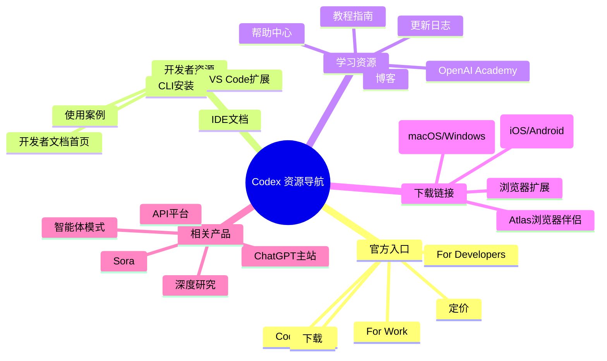
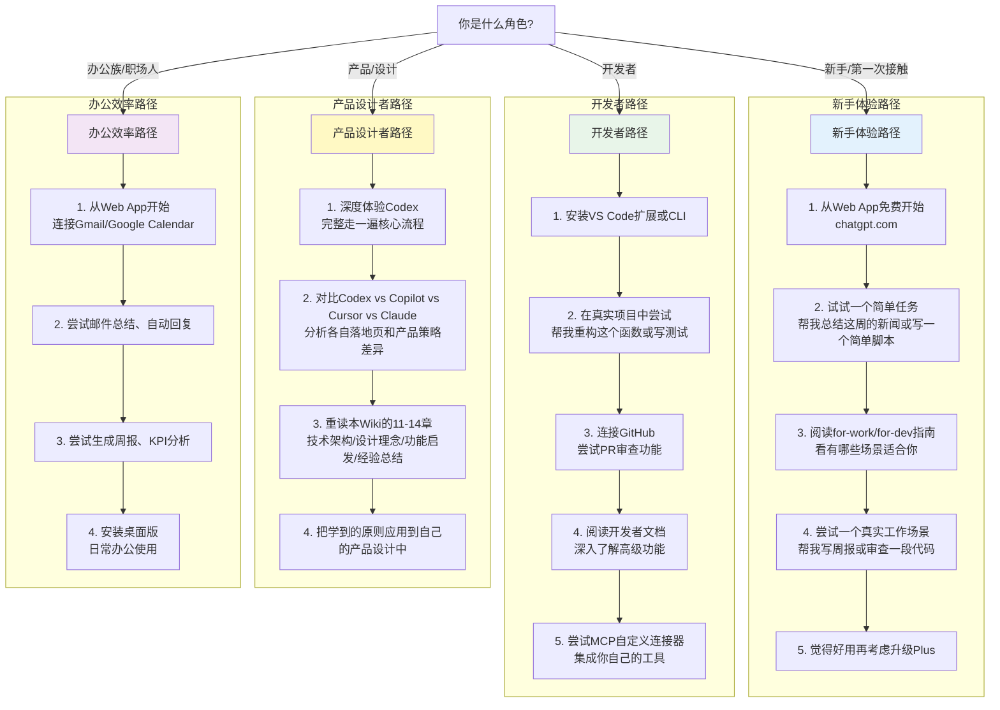
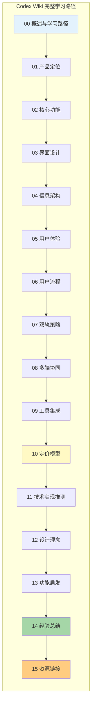

## 一、资源导航概述

本章整理ChatGPT Codex相关的所有官方资源、开发者文档、下载链接、学习材料，方便进一步深入学习和实际使用。



---

## 二、官方入口链接

这些是Codex最核心的官方页面，建议收藏。

| 资源 | 链接 | 说明 |
|---|---|---|
| **Codex主页** | https://chatgpt.com/zh-Hans-CN/codex/ | Codex中文官方主页，了解产品核心价值、功能介绍、客户案例 |
| **为工作打造的Codex** | https://chatgpt.com/zh-Hans-CN/codex/for-work | 面向办公族/职场人士的场景页面，邮件、文档、数据分析、办公自动化 |
| **为开发者打造的Codex** | https://chatgpt.com/zh-Hans-CN/codex/for-developers | 面向开发者的场景页面，代码生成、审查、IDE集成、CLI |
| **定价页面** | https://chatgpt.com/zh-Hans-CN/codex/pricing | 查看Free/Go/Plus/Pro/Business/Enterprise各档套餐详情 |
| **下载页面** | https://chatgpt.com/zh-Hans-CN/codex/download | 各平台（IDE/CLI/桌面/移动端/浏览器）下载入口汇总 |

### 页面浏览建议顺序

第一次接触Codex建议按以下顺序浏览：
1. **Codex主页**→建立整体认知，了解是什么、能做什么
2. **根据身份选择场景页**→办公族看for-work，开发者看for-developers
3. **定价页面**→了解哪个套餐适合自己
4. **下载页面**→选择你常用的平台，开始使用

---

## 三、开发者资源

如果你是开发者，想在IDE/CLI中使用Codex或者深度集成，这些资源是必备的。

### 3.1 官方文档

| 资源 | 链接 | 说明 |
|---|---|---|
| **开发者文档首页** | https://developers.openai.com/codex | Codex开发者文档入口，包含所有开发相关指南 |
| **IDE使用文档** | https://developers.openai.com/codex/ide/ | VS Code、JetBrains等IDE扩展安装和使用指南 |
| **CLI使用文档** | https://developers.openai.com/codex/cli/ | 命令行工具安装、配置、命令参考 |
| **使用案例** | https://developers.openai.com/codex/use-cases | 各类开发场景的实际使用案例和最佳实践 |
| **MCP协议文档** | https://modelcontextprotocol.io | Model Context Protocol官方文档，了解如何开发自定义连接器 |

### 3.2 扩展与工具安装

| 平台/工具 | 安装方式/链接 | 说明 |
|---|---|---|
| **VS Code扩展** | https://marketplace.visualstudio.com/items?itemName=openai.chatgpt | 在VS Code扩展市场搜索"ChatGPT"或直接访问链接安装 |
| **JetBrains插件** | JetBrains插件市场搜索"ChatGPT" | 支持IntelliJ IDEA、PyCharm、WebStorm等全系列JetBrains IDE |
| **CLI工具** | `npm install -g @openai/codex` | 需要Node.js环境，安装后运行`codex login`登录账号即可使用 |
| **GitHub集成** | Codex内连接GitHub账户 | 授权后可以读取PR、创建PR、审查代码、运行测试 |

### CLI快速开始

安装完CLI后，这几个命令就能上手：
```bash
# 安装CLI
npm install -g @openai/codex

# 登录你的ChatGPT账号
codex login

# 在当前项目目录启动Codex
codex

# 让Codex执行一个任务
codex "帮我审查最近的改动"

# 查看帮助
codex --help
```

---

## 四、学习资源

### 4.1 官方学习材料

| 资源 | 链接 | 说明 |
|---|---|---|
| **Codex for Work指南** | https://openai.com/academy/codex-for-work/ | OpenAI Academy官方教程，教你如何用Codex处理各类办公任务 |
| **ChatGPT帮助中心** | https://help.openai.com/ | 官方帮助中心，常见问题解答、使用指南、故障排查 |
| **官方教程与指南** | 帮助中心内Tutorials板块 | 各类场景的分步教程，从入门到进阶 |
| **更新日志（Changelog）** | https://help.openai.com/en/articles/changelog | 查看最新功能更新、改进、bug修复 |
| **OpenAI博客** | https://openai.com/blog | 官方博客，产品发布、技术文章、使用技巧 |

### 4.2 推荐学习路径

根据你的身份和目标，选择合适的学习路径：



---

## 五、下载链接汇总

Codex支持几乎所有主流平台，根据你的使用场景选择下载：

### 5.1 桌面应用

| 平台 | 下载链接 | 说明 |
|---|---|---|
| **Codex桌面版 macOS** | https://persistent.oaistatic.com/codex-app-prod/Codex.dmg | 原生macOS应用，推荐日常使用，支持本地文件访问 |
| **Codex桌面版 Windows** | Microsoft Store搜索"Codex"或"ChatGPT" | Windows桌面版，通过微软商店安装更新 |
| **ChatGPT桌面版 macOS** | https://persistent.oaistatic.com/sidekick/public/ChatGPT.dmg | ChatGPT通用桌面版（Codex功能已包含在ChatGPT中） |
| **ChatGPT桌面版 Windows** | Microsoft Store搜索"ChatGPT" | Windows通用桌面版 |

> **说明**：Codex功能已集成在最新版ChatGPT桌面应用中，安装ChatGPT即可使用Codex。独立Codex桌面应用也可使用。

### 5.2 移动端应用

| 平台 | 下载链接 | 说明 |
|---|---|---|
| **iOS（iPhone/iPad）** | https://apps.apple.com/app/chatgpt/id6448311069 | App Store搜索"ChatGPT"，支持语音对话、拍照提问、任务查看 |
| **Android** | https://play.google.com/store/apps/details?id=com.openai.chatgpt | Google Play搜索"ChatGPT"，功能与iOS版一致 |

移动端虽然不适合写大量代码，但非常适合：
- 接收云端任务完成通知
- 查看任务结果
- 回复简单消息、审批草稿
- 随时继续之前的对话

### 5.3 浏览器与扩展

| 工具 | 链接/获取方式 | 说明 |
|---|---|---|
| **Chrome扩展** | Chrome Web Store搜索"ChatGPT"或"Codex" | 在浏览器中随时唤起Codex，辅助网页浏览、内容总结、写作 |
| **Atlas浏览器伴侣** | 官方下载页面下载（macOS Apple Silicon only） | Codex专用浏览器伴侣，深度集成网页浏览能力 |

### 5.4 IDE与开发工具

| 工具 | 安装方式 | 说明 |
|---|---|---|
| **VS Code扩展** | VS Code扩展市场搜索"ChatGPT" | 最推荐的开发者使用方式，在编辑器内直接用Codex写代码、审查、debug |
| **JetBrains IDE插件** | JetBrains插件市场搜索"ChatGPT" | 支持IntelliJ/PyCharm/WebStorm等所有JetBrains IDE |
| **CLI命令行工具** | `npm install -g @openai/codex` | 终端中使用，适合自动化脚本、远程开发、Vim/Emacs用户 |

---

## 六、相关OpenAI产品

Codex不是孤立产品——它是OpenAI产品生态的一部分，和其他产品紧密配合使用效果更好。

| 产品 | 链接 | 说明 | 与Codex的关系 |
|---|---|---|---|
| **ChatGPT主站** | https://chatgpt.com | ChatGPT网页版，所有功能的入口 | Codex功能已集成在ChatGPT中，直接在ChatGPT对话中使用 |
| **OpenAI API平台** | https://platform.openai.com | 开发者API平台，按token计费，可集成到自己的应用 | Codex是面向终端用户的产品，API给开发者做自定义集成；Codex配额不够时也可以用API key额外计费 |
| **Sora视频生成** | ChatGPT内Sora功能 | 文生视频模型 | 在Codex工作流中如果需要生成视频，可以调用Sora |
| **深度研究（Deep Research）** | ChatGPT内深度研究功能 | 自主进行多步骤网络研究，生成完整研究报告 | Codex的云端异步任务能力与深度研究能力互补 |
| **智能体模式（Agent Mode）** | ChatGPT内Agent模式 | 通用自主智能体模式，可以调用工具、执行多步任务 | Codex是智能体模式面向编程和工作场景的专门化版本 |
| **自定义GPTs** | ChatGPT内GPTs功能 | 用户可以创建自定义GPT，配置特定提示词和工具 | Codex是官方的专业级工作智能体，你也可以用GPTs创建自己的专用助手 |

---

## 七、第三方资源与社区

这些不是官方资源，但对学习和使用Codex有帮助：

| 资源类型 | 推荐 | 说明 |
|---|---|---|
| **GitHub Awesome列表** | 搜索"awesome-chatgpt-codex"或"awesome-mcp-servers" | 社区整理的优秀MCP连接器、使用技巧、工具列表 |
| **Reddit社区** | r/ChatGPT、r/OpenAI | Reddit社区，用户分享使用经验、技巧、讨论 |
| **Discord社区** | OpenAI官方Discord | 和其他用户交流、反馈问题、分享作品 |
| **YouTube教程** | 搜索"ChatGPT Codex tutorial" | 视频形式的使用教程和案例演示 |
| **技术博客** | Medium、Dev.to上的Codex相关文章 | 其他开发者分享的深度使用经验、最佳实践 |
| **MCP服务器目录** | https://github.com/modelcontextprotocol/servers | 官方MCP服务器列表，找到你需要的第三方连接器 |

---

## 八、使用与学习建议

### 8.1 给第一次接触Codex的建议

1. **不要一上来就尝试复杂任务**——先从简单的开始，比如"帮我总结这篇文章"、"帮我写一封邮件"，建立基本的信任感
2. **先在Web App免费体验**——不需要安装任何东西，打开chatgpt.com就能用，零门槛
3. **不要一开始就授权所有连接器**——先不连任何工具，试试基础能力；觉得不错了再连接Gmail/GitHub一个一个来
4. **第一次用完花1分钟看看它是怎么工作的**——注意它怎么展示来源、怎么展示改动、怎么提问确认，体会它的设计思路
5. **遇到问题多用自然语言反馈**——"你理解错了，我的意思是..."、"这个结果不对，应该是..."——Codex会从你的反馈中学习

### 8.2 给想用好Codex的开发者建议

1. **安装VS Code扩展**——这是目前开发者体验最好的入口，比网页写代码效率高太多
2. **连接GitHub**——代码审查、PR创建、测试运行这些功能必须连了GitHub才真正好用
3. **试试CLI**——如果你习惯终端工作，CLI的效率非常高，而且容易集成到脚本和自动化流程
4. **把Codex当"结对编程伙伴"而不是"自动写代码机器"**——最好的用法是你和它一起写：你设计，它实现；你审查，它修改；互相配合效率最高
5. **一定要审查它写的代码**——Codex很强，但它也会犯错，重要改动一定要自己看一遍diff，跑一遍测试，不要直接merge
6. **从简单任务开始建立信任**——先让它写小函数、写测试、改小bug，慢慢你知道它什么能做好什么做不好，再给它更大的任务

### 8.3 给产品/设计从业者的建议

1. **完整走一遍用户旅程**——从第一次打开网站，到注册，到第一次任务，到连接工具，到完成第一个工作，完整走一遍，记录每一步的体验细节
2. **对比竞品**——同时用用GitHub Copilot、Cursor、Claude Desktop，对比它们和Codex在设计理念、交互模式、信任建立上的差异
3. **带着批判的眼光看**——不是说Codex什么都好，想想哪些地方你觉得可以改进，哪些设计你觉得不适合你的产品
4. **不要只抄界面，要学底层逻辑**——界面风格是表层的，更重要的是它背后的设计原则：信任怎么建立、摩擦怎么降低、价值怎么传达、用户怎么一步步从新手变成重度用户

---

## 九、本Wiki学习路径总结

恭喜你完成了ChatGPT Codex Wiki全部15章的学习！这里是完整的章节导航：



### 各章节内容回顾

| 章节 | 核心内容 |
|---|---|
| **00 概述与学习路径** | Wiki整体介绍、学习方法、目标读者 |
| **01 产品定位** | Codex是什么、不是什么、目标用户、核心价值主张 |
| **02 核心功能** | 代码审查、连接器、自动化、多格式交付、云端任务等核心能力 |
| **03 界面设计** | 界面布局、交互模式、视觉风格、左文右图交替布局 |
| **04 信息架构** | 页面结构、导航设计、内容层级、渐进式披露 |
| **05 用户体验** | 信任建立、可控感、透明化、多端连贯体验 |
| **06 用户流程** | 从新用户到重度用户的完整转化路径、关键决策节点 |
| **07 双轨策略** | Work/Developers双轨叙事如何设计、如何服务两类差异用户 |
| **08 多端协同** | Web/IDE/CLI/桌面/移动端如何配合、同步机制、各端定位 |
| **09 工具集成** | 连接器设计、MCP协议、如何融入用户已有工作流 |
| **10 定价模型** | Freemium模式、六档套餐设计、锚定效应、配额管理 |
| **11 技术实现推测** | Agent五层架构、沙箱环境、上下文工程、模型路由、代码审查技术 |
| **12 设计理念** | 12个可直接复用的设计原则，每个原则有Codex做法+为什么有效+如何借鉴 |
| **13 功能启发** | 连接器模式、自动化路径、成果交付、任务管理、入门引导、配额管理的功能设计启发 |
| **14 经验总结** | 产品思维、设计哲学、商业化、信息架构、UX写作的系统性经验总结 |
| **15 资源链接** | 你正在看的这一章，所有官方资源、下载链接、学习路径汇总 |

### 学完之后可以做什么？

1. **立刻去体验**——光看Wiki是不够的，打开chatgpt.com亲手用一用Codex，感受实际体验
2. **做一次产品拆解**——选一个你自己的产品或者你常用的AI工具，对照本Wiki的框架做一次完整拆解
3. **应用到你的工作中**——如果你是产品经理/设计师，把12条设计原则用到你的下一个项目中；如果你是开发者，试试用Codex提升你的开发效率
4. **批判性思考**——不要全盘接受，想想哪些设计适合你的场景，哪些不适合，为什么？Codex的设计有哪些你觉得可以改进的地方？
5. **持续关注更新**——AI产品进化极快，Codex每隔几周就会有新功能，保持关注和学习

---

返回[概述与学习路径](00-overview.md)重新开始学习
