# ChatGPT Codex Wiki 教程

## 简介

ChatGPT Codex 是 OpenAI 推出的**AI编程智能体与工作助手**，是 ChatGPT 产品体系中面向专业工作场景的核心产品。它不仅是代码补全工具，更是一个能够理解上下文、连接工作工具、自主执行多步骤任务、直接交付完成工作成果的**全栈AI智能体**。

本Wiki教程通过对 [ChatGPT Codex 官网](https://chatgpt.com/zh-Hans-CN/codex/) 的系统性深度分析，从产品定位、功能设计、界面视觉、信息架构、用户体验、双轨策略、多端协同、工具集成、商业模式到技术推测，全面拆解顶级AI SaaS产品的设计方法论，并提炼可复用的设计理念与功能启发。

### 核心洞察

- **从"对话"到"执行"**：Codex 标志着AI产品从问答式助手向执行式交付的关键转型——不只是回答问题，而是直接完成工作
- **双轨产品策略**：同一产品内核服务办公用户（文档/表格/自动化）和开发者（代码/审查/调试）两大差异群体
- **连接器生态哲学**：不替换用户已有工具，而是连接它们——读（获取数据）、写（回写成果）、触发（自动化执行）
- **成果交付思维**：产出物不是对话框中的文本，而是用户可以直接评审、完善、投入使用的文件/PR/报告
- **六层信任设计**：从首屏视觉、社会证明、产品演示到可控性承诺，系统性地建立用户信任

### 学习路径全景

```mermaid
flowchart TB
    START(["🚀 开始学习"])
    FINISH(["✅ 学习完成<br/>返回概述"])
    subgraph P1 ["第一阶段：产品认知（约40分钟）"]
        C00["00 概述与学习路径<br/>产品简介·学习目标·章节导航"]
        C01["01 产品定位与价值主张<br/>目标用户·核心痛点·差异化"]
        C02["02 核心功能详解<br/>五大功能模块深度拆解"]
    end
    subgraph P2 ["第二阶段：设计分析（约65分钟）"]
        C03["03 界面设计与视觉分析<br/>色彩体系·布局结构·组件设计"]
        C04["04 信息架构与导航设计<br/>导航系统·内容组织·渐进披露"]
        C05["05 用户体验策略分析<br/>文案策略·信任漏斗·CTA设计"]
    end
    subgraph P3 ["第三阶段：深度拆解（约100分钟）"]
        C06["06 用户交互流程分析<br/>转化漏斗·决策路径·移动端适配"]
        C07["07 双轨产品策略解析<br/>办公用户vs开发者·双轨叙事"]
        C08["08 多端协同策略分析<br/>Web/IDE/CLI/桌面/移动端联动"]
        C09["09 工具集成与生态系统<br/>连接器设计·MCP协议·读写触发"]
        C10["10 定价策略与商业模式<br/>六档套餐·配额机制·定价心理学"]
    end
    subgraph P4 ["第四阶段：洞察启发（约100分钟）"]
        C11["11 技术实现推测<br/>Agent五层架构·沙箱·上下文工程"]
        C12["12 可借鉴的设计理念<br/>12条可复用设计原则"]
        C13["13 AI产品功能启发<br/>连接器·自动化·成果交付·配额管理"]
        C14["14 设计启示与经验总结<br/>产品思维·设计哲学·商业化思考"]
        C15["15 相关资源链接<br/>官方文档·下载链接·学习建议"]
    end
    START --> C00
    C00 --> C01
    C01 --> C02
    C02 -->|"进入设计分析"| C03
    C03 --> C04
    C04 --> C05
    C05 -->|"进入深度拆解"| C06
    C06 --> C07
    C07 --> C08
    C08 --> C09
    C09 --> C10
    C10 -->|"进入洞察提炼"| C11
    C11 --> C12
    C12 --> C13
    C13 --> C14
    C14 --> C15
    C15 -->|"闭环回顾"| C00
    C15 --> FINISH
    style START fill:#10a37f,color:#fff,stroke:#0d8a6a,stroke-width:2px
    style FINISH fill:#f5f5f5,color:#333,stroke:#999,stroke-width:2px,stroke-dasharray:5 5
    style P1 fill:#e8f5e9,stroke:#4caf50,stroke-width:2px
    style P2 fill:#e3f2fd,stroke:#2196f3,stroke-width:2px
    style P3 fill:#fff3e0,stroke:#ff9800,stroke-width:2px
    style P4 fill:#f3e5f5,stroke:#9c27b0,stroke-width:2px
    style C00 fill:#c8e6c9,stroke:#4caf50
    style C01 fill:#c8e6c9,stroke:#4caf50
    style C02 fill:#c8e6c9,stroke:#4caf50
    style C03 fill:#bbdefb,stroke:#2196f3
    style C04 fill:#bbdefb,stroke:#2196f3
    style C05 fill:#bbdefb,stroke:#2196f3
    style C06 fill:#ffe0b2,stroke:#ff9800
    style C07 fill:#ffe0b2,stroke:#ff9800
    style C08 fill:#ffe0b2,stroke:#ff9800
    style C09 fill:#ffe0b2,stroke:#ff9800
    style C10 fill:#ffe0b2,stroke:#ff9800
    style C11 fill:#e1bee7,stroke:#9c27b0
    style C12 fill:#e1bee7,stroke:#9c27b0
    style C13 fill:#e1bee7,stroke:#9c27b0
    style C14 fill:#e1bee7,stroke:#9c27b0
    style C15 fill:#e1bee7,stroke:#9c27b0
```

## 阅读路径

根据你的学习目标，推荐以下阅读路径：

### 🏃 快速了解（约40分钟）

想快速了解 Codex 是什么、解决什么问题、核心能力：

> 00 → 01 → 02

适合产品经理、决策者快速建立认知框架。

### 🎨 设计学习路径（约105分钟）

重点学习 SaaS 落地页的设计方法论——视觉、信息架构、用户体验策略：

> 00 → 01 → 02 → 03 → 04 → 05

适合 UI/UX 设计师、前端工程师、产品营销人员。

### 🔧 产品深度拆解（约205分钟）

完整理解产品策略——从双轨叙事、多端协同、工具生态到商业模式：

> 00 → 01 → 02 → 03 → 04 → 05 → 06 → 07 → 08 → 09 → 10

适合产品经理、产品战略人员、SaaS创业者。

### 🧠 完整学习路径（约305分钟，约5小时）

系统性通读全部章节，获得从产品认知到设计启发的完整闭环：

> 所有章节（ch00 - ch15）

适合AI产品设计者、需要深度借鉴Codex设计理念的产品团队。

### 💡 启发借鉴路径（约70分钟）

直接获取可复用的设计理念和功能启发，跳过分析过程：

> 00 → 12 → 13 → 14 → 15

适合有产品经验、想快速获得 actionable insights 的从业者。

## 章节索引

### 第一阶段：产品认知 🟢

| 章节 | 标题 | 核心内容 | 预计时长 |
|------|------|----------|----------|
| ch00 | [概述与学习路径](00-overview.md) | 产品简介、学习目标、学习路径全景图、章节导航表 | — |
| ch01 | [产品定位与价值主张](01-product-positioning.md) | 从"对话"到"执行"的转型、目标用户画像、核心痛点、差异化价值、vs竞品对比 | 15分钟 |
| ch02 | [核心功能详解](02-core-features.md) | 五大核心能力体系：研究助手、成果交付、流程自动化、团队工作、可控性设计 | 25分钟 |

### 第二阶段：设计分析 🔵

| 章节 | 标题 | 核心内容 | 预计时长 |
|------|------|----------|----------|
| ch03 | [界面设计与视觉分析](03-interface-design.md) | 极简主义设计语言、色彩体系（OpenAI绿/黑/白）、布局结构、组件设计、视觉层级 | 20分钟 |
| ch04 | [信息架构与导航设计](04-information-architecture.md) | 导航系统设计（固定导航+双轨CTA）、内容组织逻辑、渐进式披露策略、F型视觉流 | 20分钟 |
| ch05 | [用户体验策略分析](05-user-experience.md) | UX文案策略、五层信任漏斗、社会证明（Logo墙/用户证言/量化数据）、四层CTA设计 | 25分钟 |

### 第三阶段：深度拆解 🟠

| 章节 | 标题 | 核心内容 | 预计时长 |
|------|------|----------|----------|
| ch06 | [用户交互流程分析](06-user-flow.md) | AIDMA转化漏斗、访客→用户决策路径、Hero区3秒法则、移动端适配策略 | 20分钟 |
| ch07 | [双轨产品策略解析](07-dual-track-strategy.md) | 办公用户vs开发者双轨叙事、六大场景矩阵（KPI/财务/招聘/开发/开源/运维）、双入口设计 | 20分钟 |
| ch08 | [多端协同策略分析](08-multi-platform.md) | Web/IDE/CLI/桌面/移动端六端协同、上下文同步、配额共享、三级权限体系、Atlas浏览器伴侣 | 20分钟 |
| ch09 | [工具集成与生态系统](09-tool-integration.md) | 连接器设计哲学（替换悖论）、读/写/触发三类能力、MCP开放协议、跨工具工作流案例 | 20分钟 |
| ch10 | [定价策略与商业模式](10-pricing-model.md) | 六档套餐设计（Free→Go→Plus→Pro→Business→Enterprise）、配额管理、定价心理学、锚定效应 | 20分钟 |

### 第四阶段：洞察启发 🟣

| 章节 | 标题 | 核心内容 | 预计时长 |
|------|------|----------|----------|
| ch11 | [技术实现推测](11-technology-speculation.md) | Agent五层架构（规划→工具调用→执行→反思→交付）、沙箱执行环境、上下文工程、模型策略 | 25分钟 |
| ch12 | [可借鉴的设计理念](12-design-insights.md) | 12条可复用设计原则：连接器思维、成果交付、渐进披露、信任设计、双轨叙事等 | 25分钟 |
| ch13 | [AI产品功能启发](13-feature-inspiration.md) | 连接器模式、自动化路径设计、成果交付格式、任务透明化、入门引导四步法、配额管理策略 | 20分钟 |
| ch14 | [设计启示与经验总结](14-lessons-learned.md) | 产品思维、设计哲学、商业化思考、信息架构智慧、UX写作心法的系统性总结 | 20分钟 |
| ch15 | [相关资源链接](15-resources.md) | 官方入口、开发者文档、CLI/IDE下载、API参考、扩展阅读建议 | 10分钟 |

## Mermaid 图表索引

本Wiki包含大量 Mermaid 图表辅助理解，以下是所有图表的快速索引：

| 章节 | 图表类型 | 数量 | 主要内容 |
|------|----------|------|----------|
| 00-概述 | flowchart + graph | 2 | 双轨产品策略图、学习路径全景图 |
| 01-产品定位 | mindmap + flowchart | 2 | 竞品对比思维导图、产品定位演进图 |
| 02-核心功能 | flowchart + sequenceDiagram | 3 | 五大功能体系图、场景时序图、功能架构图 |
| 03-界面设计 | flowchart + graph | 3 | 色彩体系图、布局结构图、视觉层级图 |
| 04-信息架构 | flowchart + graph | 3 | 导航系统图、内容组织图、渐进披露图 |
| 05-用户体验 | mindmap + flowchart | 3 | 五层信任漏斗、文案策略图、CTA转化漏斗 |
| 06-用户流程 | flowchart + mindmap | 3 | AIDMA转化漏斗、用户旅程图、CTA布局思维导图 |
| 07-双轨策略 | mindmap + flowchart | 4 | 六大场景矩阵mindmap、双轨对比图、用户画像 |
| 08-多端协同 | mindmap + flowchart | 3 | 六端协同矩阵、同步机制图、权限体系图 |
| 09-工具集成 | mindmap + flowchart | 4 | 连接器分类图、读写触发能力图、MCP生态图、场景案例 |
| 10-商业模式 | mindmap + flowchart | 3 | 六档定价矩阵、配额机制图、定价心理学mindmap |
| 11-技术推测 | flowchart + sequenceDiagram | 4 | Agent五层架构图、沙箱执行流程、任务处理时序图 |
| 12-设计理念 | flowchart + graph | 3 | 12原则关联图、设计决策树、可复用模式库 |
| 13-功能启发 | mindmap + flowchart | 4 | 功能启发mindmap、自动化路径图、成果交付格式图 |
| 14-经验总结 | flowchart + mindmap | 3 | 五维总结mindmap、产品思维框架、设计哲学图 |
| 15-资源 | graph | 1 | 资源分类导航图 |

**合计**：约 **43 个 Mermaid 图表**，涵盖流程图、思维导图、时序图、架构图等多种类型。

---

[返回知识库首页](../../../)

---

开始学习 → [00-overview.md](00-overview.md)
