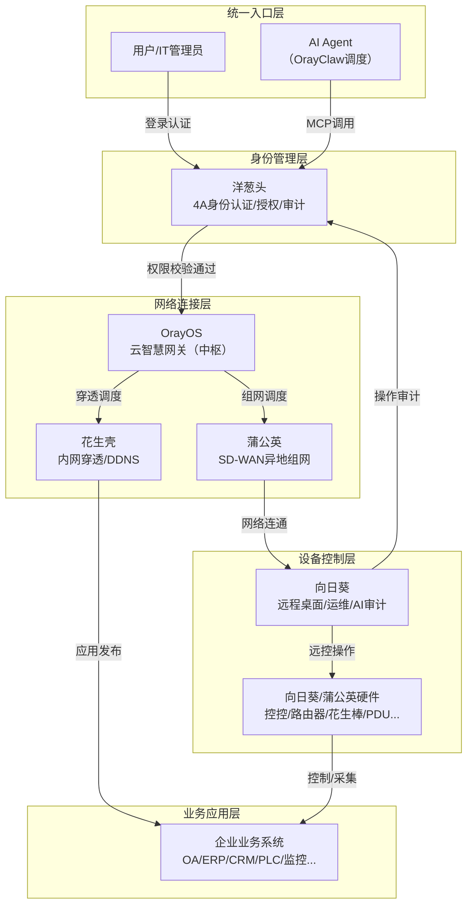
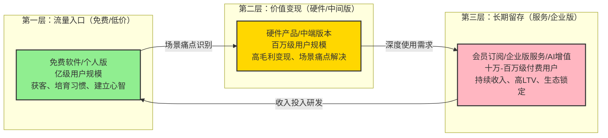
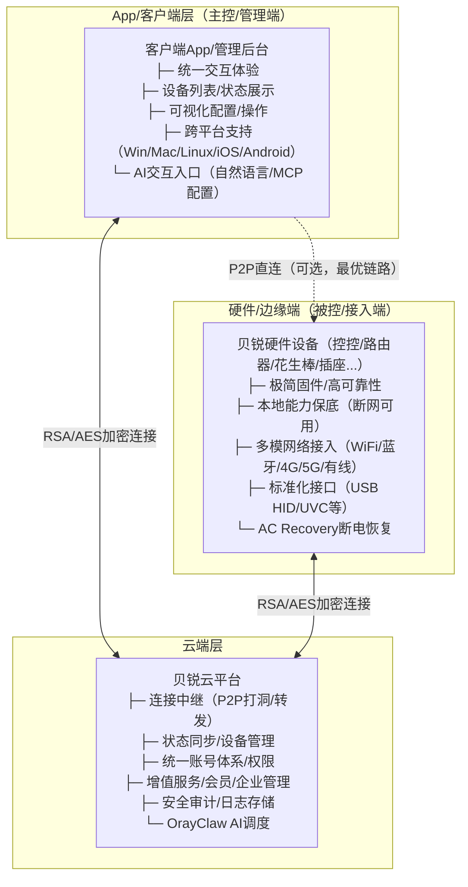
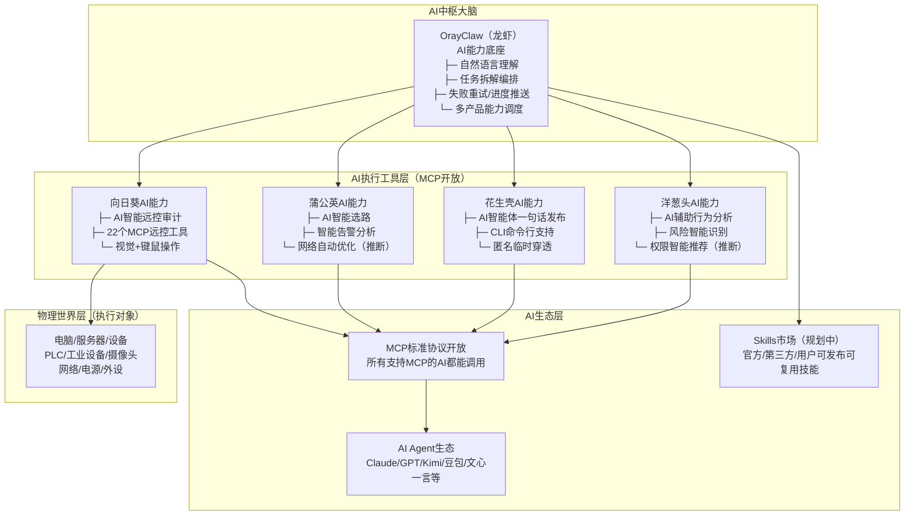

# 贝锐（Oray）五大产品线综合分析Wiki：20年连接专家的软硬服铁三角与AI战略跃迁

> **贝锐集团官网**: <https://www.oray.com/>
> **向日葵远程控制**: <https://sunlogin.oray.com/>
> **蒲公英智能组网**: <https://pgy.oray.com/>
> **花生壳内网穿透**: <https://hsk.oray.com/>
> **洋葱头企业管理**: <https://yct.oray.com/>
> **贝锐20周年AI发布会**: <https://gf-oray.com.cn/#ai>

***

## 📋 目录导航

- [一、报告概述与学习目标 🎯](#一报告概述与学习目标)
- [二、贝锐20年发展与集团战略定位 📜](#二贝锐20年发展与集团战略定位)
- [三、五大产品矩阵全景：从连接到管理到AI的完整生态 🧩](#三五大产品矩阵全景从连接到管理到ai的完整生态)
- [四、五大产品横向对比分析：十维度差异化定位矩阵 🏆](#四五大产品横向对比分析十维度差异化定位矩阵)
- [五、产品协同生态与闭环逻辑：1+1>2的连接网络 🔗](#五产品协同生态与闭环逻辑112的连接网络)
- [六、统一业务模式深度拆解：三层变现漏斗与软硬服铁三角 💰](#六统一业务模式深度拆解三层变现漏斗与软硬服铁三角)
- [七、跨产品线技术架构范式：一致性设计与共性技术沉淀 ⚙️](#七跨产品线技术架构范式一致性设计与共性技术沉淀)
- [八、官网 UX 与转化路径设计分析：B/C端差异化转化策略 🎨](#八官网-ux-与转化路径设计分析bc端差异化转化策略)
- [九、市场策略与客户成功体系：从个人到企业的全链路覆盖 📊](#九市场策略与客户成功体系从个人到企业的全链路覆盖)
- [十、AI 战略与 OrayClaw 生态：从连接工具到AI执行基础设施 🤖](#十ai-战略与-orayclaw-生态从连接工具到ai执行基础设施)
- [十一、核心洞察与跨领域启示 🚀](#十一核心洞察与跨领域启示)
- [十二、常见问题FAQ与资源链接 ❓](#十二常见问题faq与资源链接)

***

## 一、报告概述与学习目标 🎯

> **"连接世界、操作世界、服务世界"**
>
> —— 贝锐AI战略口号

### 1.1 研究背景

上海贝锐信息科技股份有限公司（简称贝锐）成立于2006年，是中国领先的远程连接SaaS服务商。经过20年深耕，贝锐已从单一的DDNS服务商，发展为覆盖"远程控制、智能组网、内网穿透、企业管理、云网关"五大产品线的连接技术集团，累计服务1.2亿+注册用户、150万+企业客户，接入设备超过26亿台。

2026年是贝锐成立20周年，也是集团战略转型的关键节点——随着OrayClaw（龙虾）AI能力底座推出、向日葵MCP开源、全产品线AI能力升级，贝锐正在从"连接技术服务商"向"AI执行基础设施提供商"跃迁，为AI Agent提供从网络接入到设备控制到身份管理的完整"手和脚"能力。

本报告在向日葵单产品深度分析的基础上，站在集团层面对五大产品线进行系统性整合分析，旨在全面理解贝锐的产品战略协同、商业模式设计、技术架构共性、市场运营策略和AI转型路径，为SaaS产品矩阵设计、软硬结合产品开发、企业服务生态构建提供跨领域参考。

> **关于洋葱头产品的说明**：洋葱头（yct.oray.com）官网公开信息相对有限，产品介绍集中于电商/代运营场景的账号管理能力，完整产品矩阵、企业级版本价格、技术架构细节等信息不足。本报告基于贝锐集团官网及其他产品线逻辑进行合理推断分析，相关推断内容已明确标注。

### 1.2 本报告学习目标

通过本报告的系统学习，你将能够：

1. **理解贝锐20年演进逻辑**：掌握从"能访问→能操作→能组网→可管理→AI执行"的五阶段战略主线
2. **建立五大产品全景认知**：清晰了解向日葵/蒲公英/花生壳/洋葱头/OrayOS各自的定位、功能、价格、用户和场景
3. **掌握产品协同生态逻辑**：理解五大产品如何形成从身份到网络到设备到应用的完整闭环
4. **拆解统一商业模式**：掌握"免费增值+软硬服铁三角+B/C端差异化定价"的三层变现漏斗设计
5. **提炼跨产品线技术范式**：理解三层架构一致性、本地能力保底、安全设计共性等技术沉淀
6. **洞察官网UX转化逻辑**：学习B端/C端官网差异化设计、信任建立、转化路径优化的实战经验
7. **理解AI战略布局**：深度解析OrayClaw生态、各产品AI能力、MCP开放的战略意图
8. **萃取可复用模式**：将贝锐20年产品经验映射到SaaS、IoT、企业服务、AI Agent等领域

### 1.3 分析框架说明

本报告遵循"从宏观到微观、从战略到产品、从协同到商业、从技术到洞察"的逻辑结构：

| 分析维度      | 核心问题                                      | 对应章节 |
| --------- | ----------------------------------------- | ---- |
| **集团战略层** | 贝锐20年如何演进？五大产品各自扮演什么战略角色？AI时代如何定位跃迁？      | 第二章  |
| **产品矩阵层** | 五大产品分别是什么？各有什么功能、价格、用户、场景？             | 第三章  |
| **横向对比层** | 五大产品在哪些维度存在差异？如何实现差异化定位而不内部竞争？         | 第四章  |
| **协同生态层** | 五大产品如何协同？有哪些核心闭环方案？AI/信创如何战略协同？         | 第五章  |
| **商业模式层** | 贝锐如何赚钱？免费和付费边界如何设计？软硬服铁三角如何运转？         | 第六章  |
| **技术架构层** | 跨产品线有哪些技术共性？三层架构如何统一？安全和全球节点如何设计？      | 第七章  |
| **UX设计层** | B端/C端官网有何差异？如何建立信任？转化路径和定价页如何设计？        | 第八章  |
| **市场运营层** | 用户如何分层？渠道策略是什么？客户案例和信任背书体系如何构建？         | 第九章  |
| **AI战略层** | 2026 AI战略全景是什么？各产品有哪些AI能力？MCP开放意味着什么？       | 第十章  |
| **洞察启示层** | 贝锐经验对产品设计、商业模式、技术架构、AI转型有什么可复用价值？       | 第十一章 |

***

## 二、贝锐20年发展与集团战略定位 📜

> **"从解决'能访问'，到实现'能操作'，再到构建'能组网'、'可管理'，最终走向'AI执行'——这是贝锐20年的产品演进主线。"**

### 2.1 贝锐20年发展五阶段

贝锐成立于2006年，20年来始终围绕"连接"这一核心命题，产品演进遵循清晰的能力升级主线，每一个阶段都推出一款里程碑式产品解决当时的核心痛点：

| 阶段       | 时间区间      | 核心产品      | 解决的核心问题   | 关键里程碑                                                                                                   |
| -------- | --------- | --------- | --------- | ------------------------------------------------------------------------------------------------------- |
| **第一阶段：域名时代** | 2006-2009 | 花生壳DDNS   | **能访问**   | 动态域名解析技术诞生，解决公网IP动态变化下的设备访问问题；2007年全球用户量破百万；2013年发布新花生壳首创内网穿透功能                                      |
| **第二阶段：远控时代** | 2009-2015 | 向日葵远程控制   | **能操作**   | 从远程访问升级为远程操作，成为国民级远程控制产品；2017年发布全球首款无网远控智能硬件"控控"；疫情期间成为远程办公关键支撑；牵头制定《远程控制软件技术要求》团体标准 |
| **第三阶段：组网时代** | 2015-2020 | 蒲公英异地组网   | **能组网**   | 从单点连接升级为网络组网，自研SD-WAN技术，实现即插即用无需公网IP；连续两年（2024-2025）全国异地组网路由器线上零售市场销量第一（洛图科技）                         |
| **第四阶段：管理时代** | 2020-2026 | 洋葱头企业应用管理 | **可管理**   | 从设备连接升级为组织级连接管理，构建统一账号体系、4A权限控制、行为审计能力；对接飞书/钉钉/企微第三方身份源；电商代运营场景量化价值显著（效率提升120倍）                    |
| **第五阶段：AI时代** | 2026至今    | OrayClaw+全产品线AI | **AI执行** | 发布OrayClaw AI能力底座及全产品线AI升级，向日葵原生集成AI Agent、花生壳AI智能体免注册发布、MCP协议开放，核心命题从"连接能力"跃升为"AI如何真正参与执行"                   |

**演进逻辑总结**：**能访问（花生壳）→ 能操作（向日葵）→ 能组网（蒲公英）→ 可管理（洋葱头）→ AI执行（OrayClaw）**

这五个阶段环环相扣，每一步都建立在前一阶段的技术积累和用户基础之上：花生壳解决了"在哪里"的问题，向日葵解决了"做什么"的问题，蒲公英解决了"怎么连"的问题，洋葱头解决了"谁能做"的问题，而OrayClaw正在解决"AI自主做"的问题。

### 2.2 五大产品战略角色定位

贝锐五大产品形成从底层接入到上层应用的完整技术栈，每个产品在集团矩阵中承担明确的战略角色，既独立运营又相互协同：

| 产品名称                | 产品定位                    | 在连接技术栈中的层级 | 核心战略角色                | 核心数据指标                |
| ------------------- | ----------------------- | ---------- | --------------------- | --------------------- |
| **花生壳内网穿透**         | 基于域名的内网穿透访问服务          | 接入层        | 流量入口先发、开发者生态基础       | 1800万+用户、100万+企业、200万+发布应用 |
| **向日葵远程控制**         | 国民远程控制、全企业场景远程IT运维解决方案  | 设备控制层      | 旗舰产品、核心收入来源、AI先锋      | 1.2亿+注册用户、150万+企业、26亿+接入设备 |
| **蒲公英智能组网**         | 软硬一体化SD-WAN异地组网解决方案    | 网络层        | 企业网络入口、工业物联基础        | 800万+用户、40万+企业、1000万+活跃终端  |
| **洋葱头企业应用管理**       | 团队账号管理浏览器、4A统一身份与访问管理平台 | 身份应用层      | 企业管理入口、权限闭环关键节点      | 新人授权2小时→1分钟、代运营效率提升120倍 |
| **OrayOS云智慧网关**     | 新一代云智慧网关系统              | 网关中枢层      | 底层连接枢纽、未来边缘计算载体       | 官网公开信息有限，作为战略底座产品      |
| **OrayClaw（龙虾）**   | AI能力底座                  | AI中枢层      | AI战略核心、跨产品能力调度        | 2026年新发布，处于早期落地阶段      |

**五大产品战略角色深度解析**：

1. **花生壳：奠基者与流量入口**
   - 花生壳是贝锐的起家产品，20年深耕DDNS和内网穿透领域，积累了最早的一批开发者和个人站长用户
   - 作为贝锐历史最悠久的产品，花生壳承担着品牌认知建立和开发者生态培育的战略角色
   -    - "本地部署、数据不上云"的产品定位，在数据安全敏感场景形成差异化优势
   - 2026年新增的"AI智能体免注册匿名发布"功能，让花生壳成为AI开发者快速发布服务的轻量入口

2. **向日葵：旗舰与现金牛**
   - 向日葵是贝锐用户量最大、产品线最丰富、商业化最成熟的旗舰产品，是集团主要的收入和利润来源
   - 作为"国民远程控制"，向日葵承担着品牌心智占领和C端用户获取的核心角色
   - 向日葵硬件产品线最丰富（控控、开机盒子、PDU、插线板、插座、鼠标、摄像头），是贝锐"软硬结合"战略的主要承载者
   - 在AI战略中，向日葵是先锋——MCP首个开源、AI Agent首个原生集成，承担着AI能力落地验证的战略使命

3. **蒲公英：企业网络基石**
   - 蒲公英是贝锐切入企业级市场和工业物联网的战略产品，SD-WAN技术填补了传统专线昂贵、公网IP枯竭的市场空白
   -    - "无需公网IP、即插即用、零接触部署"的产品特性，极大降低了异地组网的技术门槛，让连锁门店、分支机构、工业设备能够快速组网
   - 连续两年电商销量第一的市场地位，证明了蒲公英在SMB组网市场的领先优势
   - 4G/5G工业路由器产品线，让蒲公英成为贝锐切入工业物联网场景的关键入口

4. **洋葱头：管理闭环关键点**
   - 洋葱头是贝锐产品矩阵中相对年轻的产品，聚焦于"人"和"账号"的管理，填补了集团在身份认证和访问管理领域的空白
   - 基于4A管理体系（Authentication认证、Authorization授权、Account账号管理、Audit审计），洋葱头让贝锐的解决方案从"设备能连"升级为"人能管好"
   - 从电商代运营场景切入是非常务实的选择——这一场景账号共享需求强烈、安全痛点突出、价值量化容易
   - 洋葱头与向日葵、蒲公英的协同，能够形成"身份认证→网络接入→设备控制→操作审计"的完整企业IT运维闭环

5. **OrayOS+OrayClaw：未来战略底座**
   - OrayOS作为云智慧网关系统，是贝锐在边缘计算和网关层面的战略布局，未来可能成为整合所有连接能力的统一边缘入口
   - OrayClaw作为AI能力底座，是贝锐AI战略的中枢大脑，负责跨产品能力调度、AI任务编排、自然语言交互
   - 这两个产品虽然目前公开信息有限，但从命名和定位来看，承担着贝锐未来5-10年战略转型的使命

### 2.3 AI时代定位跃迁：从"连接专家"到"AI执行基础设施"

2026年的AI战略发布，标志着贝锐集团的定位发生了根本性跃迁——从"远程连接SaaS服务商"升级为"AI执行基础设施提供商"。

| 定位维度     | 传统定位（2006-2025） | 新定位（2026至今）                  |
| -------- | ----------------- | ---------------------------- |
| **核心价值主张** | 让人与人、人与设备、设备与设备安全连接 | 让AI能够安全、可靠、可审计地连接并操作现实世界       |
| **服务对象**  | 人（个人用户、企业IT人员）     | AI Agent + 人（AI为执行者，人为监督者）     |
| **核心能力**  | 连接能力（组网、穿透、远控）    | 执行能力（连接+理解+操作+审计）              |
| **产品形态**  | 客户端软件+硬件盒子+管理后台  | MCP工具集+AI能力底座+硬件生态+Skills市场     |
| **技术路线**  | 远控协议优化、组网技术、安全加密 | 视觉识别+键鼠模拟+任务编排+多设备协同         |
| **商业模式**  | 会员付费+硬件销售+企业服务   | API调用+Skills市场+企业级AI执行方案+原有模式延续 |

这一跃迁并非否定过去20年的积累，恰恰相反——正是因为有了20年在连接技术、安全体系、硬件生态、企业服务的深厚沉淀，贝锐才有资格成为AI时代的"执行基础设施"。AI大模型解决了"理解"和"规划"的问题，但要真正在现实世界中执行任务，还需要"手和脚"——这正是贝锐20年积累的核心价值。

> **关键洞察**：贝锐没有跟风做自己的通用大模型，而是选择做AI生态的"手脚"——这是非常务实的战略选择。大模型赛道是巨头的游戏，而垂直领域的执行能力才是真正的护城河。服务所有大模型，比自己做一个大模型的市场空间更大。

***

## 三、五大产品矩阵全景：从连接到管理到AI的完整生态 🧩

> **"构建人与设备、设备与设备、网络与网络的安全连接，提供从远程访问到智能连接的全方位解决方案"**
>
> —— 贝锐集团产品定位

### 3.1 五大产品全景概览

贝锐五大产品线覆盖了从网络接入到设备控制到身份管理的完整连接技术栈，形成了"软硬服"一体化的产品矩阵：

| 产品名称        | 官方Slogan                     | 核心解决痛点            | 目标用户群体           | 价格起点                | 核心硬件产品              |
| ----------- | --------------------------- | ----------------- | ---------------- | ------------------- | ------------------- |
| **向日葵远程控制** | "国民远程控制，视界触手可及"            | 远程桌面操作、IT运维、技术支持 | 个人→中小企业→大型企业     | 免费，个人会员￥158/年起     | 控控/开机盒子/PDU/插线板/插座/鼠标/摄像头 |
| **蒲公英智能组网** | "异地组网，像局域网一样简单"             | 异地网络互联、分支机构组网、工业联网 | 个人→中小企业→中大型企业→工业→政企 | 个人版免费，商业版￥148/年/客户端起 | X系列/G系列/R系列路由器    |
| **花生壳内网穿透** | "更安全，业务数据本地存储不上云"           | 无公网IP下的应用发布、内网服务外网访问 | 开发者→中小企业→连锁→工业     | 免费体验版，标准版￥1299/年起  | 花生棒（内网穿透硬件盒子）       |
| **洋葱头企业管理** | "从账号认证到行为审计，基于4A管理"         | 多账号管理、身份认证、操作审计   | 电商代运营→中小企业→有统一身份需求企业 | 月付低至￥3/账号，企业版面议    | 无（纯软件+浏览器）           |
| **OrayOS**  | "新一代云智慧网关系统"                | 边缘网关、多连接能力统一管理    | 企业、工业场景（战略产品）    | 官网未公开               | 网关硬件（推断）            |

### 3.2 向日葵远程控制（Sunlogin）

**官方网站**: <https://sunlogin.oray.com/>

#### 3.2.1 产品定位与核心价值

向日葵是贝锐的旗舰产品，定位为"全企业场景的远程IT运维解决方案"，也是国内用户量最大、知名度最高的远程控制品牌。"国民远程控制"的定位体现了向日葵在C端市场的深厚心智——提到远程控制，很多用户第一个想到的就是向日葵。

核心价值主张：
- 跨平台跨设备的远程桌面控制能力
- 从个人免费到企业私有化的全场景覆盖
- - "软件+硬件+服务+AI"的完整远控生态
- 每月稳定连接超150亿分钟的可靠服务

#### 3.2.2 核心功能矩阵

| 功能模块       | 具体功能                                                         | 免费/付费情况       |
| ---------- | ------------------------------------------------------------ | -------------- |
| **远程控制核心** | 跨平台支持（Windows/macOS/Linux/Android/iOS）、4K/8K超高清真彩画质（YUV4:4:4）、7ms零感延迟、144高帧率、双屏控双屏、RDP技术加持、CMD/SSH命令调试、3D鼠标/游戏手柄映射、远控隐私屏、远程文件传输、超级桌面、端口映射、远程安卓控制、成为副屏（多屏扩展） | 基础功能免费，高性能体验付费 |
| **企业级IT运维** | 屏幕墙多设备监控、人员权限精细化授权、批量部署、IT资产管理、设备策略实时下发、软件界面定制、系统提权、设备权限管理、自定义设备分类、设备统计报表、脚本命令分发、异常状态实时告警、硬件赋能复杂场景（远程宕机/死机重启/无网远控） | 企业版付费          |
| **AI能力（2026重点）** | 原生集成AI Agent、AI智能远控审计（一键识别分析远程操作行为）、智能标记敏感操作和关键信息、自动按时间轴排列生成直观报告、向日葵MCP（Model Context Protocol）选配 | 基础免费，高级能力付费    |
| **安全与管理**  | 多重加密、运维全程录像、多因子验证、访问黑白名单、访问安全过滤、企业组织架构管理（多层级）、第三方接入（飞书/企微/钉钉）、SSO单点登录、角色权限管理、等保三级规范、RSA/AES非对称加密传输 | 基础免费，企业级安全付费   |
| **全球化能力**  | 标准全球节点（2025年新增）、全球优质线路、智能节点加速、助力企业出海、独享加速                  | 全球会员付费         |
| **技术支持场景** | 客户主导全流程可视可控、技术支持工具免安装、客户同意才可远控、操作日志全记录、一对多远程协助、AR指导、无网/弱网环境远程协助（硬件方案）、客服全渠道接入、ITIL流程导入、第三方ITSM系统集成 | 企业版付费          |
| **私有化&信创** | 私有化部署方案、国产信创体系适配（统信UOS、麒麟等）、技术自主可控                            | 面议             |
| **SDK/API嵌入** | 快速构建企业远程体系、轻量化开发集成                                            | 按量/项目付费        |

> **注**：向日葵硬件产品线（控控系列、开机盒子、PDU、插线板、插座、鼠标、摄像头等）的详细分析已在向日葵单产品Wiki中覆盖，本报告从集团视角出发，不再重复单硬件产品的深度拆解，重点关注跨产品协同。

#### 3.2.3 版本价格体系

| 版本层级 | 具体版本 | 价格 | 核心权益 |
|-----|-----|-----|-----|
| 个人版 | 个人免费 | ￥0 | 基础远控、远程文件、远程安卓、RDP、多屏控多屏 |
|  | 瓜子会员 | ￥158/年（2年8.5折/3年7.5折） | 2K高清、高速文件传输、真彩画质 |
|  | 超级会员 | ￥298起/年（2年8.5折/3年7.5折） | 4K超高清、144高帧率、3D鼠标/手柄、超级桌面、端口映射 |
|  | 高性能版 | ￥468/年 | 专业极速线路、8K原画、超低延迟 |
|  | 全球会员 | ￥898/年（1年9折/2年8折） | 全球优质线路、智能节点、包含超级会员全部权益 |
| 企业版 | 商业/团队版 | 联系销售 | 企业管理、批量部署、基础审计 |
|  | 企业+/私有化部署 | 联系销售（400-601-0000转1） | 私有化、信创适配、定制化、专属服务 |
|  | SDK嵌入方案 | 联系销售 | 轻量化集成、自有品牌 |

#### 3.2.4 典型应用场景

1. **IT运维（AI加持）**：设备批量部署、统一管理维护、脚本命令分发、AI智能审计——AI自动识别异常操作、标记风险行为，大幅降低运维审计成本
2. **技术支持**：快速客户支持、AR远程指导、一对多协助、无网环境远控——客户无需安装复杂软件，点击链接即可接受支持，全程可控可追溯
3. **远程办公**：异地远程办公、高清桌面体验、安全加密传输——员工随时随地安全访问公司电脑和业务系统
4. **企业+**：多场景远程支持——从运维到办公到技术支持的一体化解决方案
5. **SDK/API嵌入**：ISV和开发者将远控能力嵌入自有产品，快速构建自有远程体系
6. **私有化部署&信创**：满足政府、金融、大型企业的安全合规和信创适配需求
7. **全球化运维**：海外节点支持中国企业出海，实现全球设备统一运维

### 3.3 蒲公英智能组网（PGY）

**官方网站**: <https://pgy.oray.com/>

#### 3.3.1 产品定位与核心价值

蒲公英定位为"采用云虚拟局域网技术实现SD-WAN智能组网的企业工业路由器"，核心Slogan是"异地组网，像局域网一样简单"。蒲公英解决了传统异地组网需要公网IP、需要专线、配置复杂的痛点，让零基础用户也能在60秒内完成异地组网。

核心市场地位：连续两年（2024-2025）全国异地组网路由器线上零售市场销量第一（数据来源：洛图科技）。

核心价值主张：
- 无需公网IP，无需专线，大幅降低组网成本
- 即插即用，零接触部署，分钟级上线
- P2P直连不限流量不限速，智能选路加速
- 从个人到企业到工业的全场景硬件覆盖
- 软硬一体化方案，软件+硬件+服务闭环

#### 3.3.2 核心功能矩阵

| 功能模块       | 具体功能                                                                 | 免费/付费情况      |
| ---------- | -------------------------------------------------------------------- | ------------- |
| **组网核心能力** | 无需公网IP即插即用、P2P直连不限流量不限速、全球智能链路智能选路（就近接入访问加速）、二层组网、自定义IP/固定IP便捷访问、带宽加速（加速传输随心分配）、DNS域名解析、抗丢包算法弱网优化 | 基础组网免费，带宽加速付费 |
| **管理与安全**  | 远程设备管理（云端批量管理）、组网链路可视化监控大屏、设备流量可视化监控大屏、自定义告警策略、访问策略/动态安全策略、风险终端自动隔离、WiFi内网准入（员工一键入网/访客网页认证）、应用代理访问（反向代理保护业务应用/精细化授权）、日志审计（30/90/180天可查） | 高级管理和审计付费    |
| **增值服务**   | 物联网SIM服务（企业定向流量/通用大流量）、运维通道版服务（异地设备自动发现/精细化PLC运维权限管理）、SDK&API嵌入（轻量化开发快捷集成）、国产信创支持（技术自主可控）、软件定制（私有定制树立品牌） | 增值服务单独付费      |

#### 3.3.3 版本价格体系

| 版本 | 客户端授权价格 | 硬件授权价格 | 转发带宽 | BGP线路 | 日志审计 | 适用场景 |
|-----|---------|---------|---------|---------|---------|-----|
| 商业版 | ￥148/年/个 | ￥328/年/个 | 6Mbps/授权数 | 三网+单条BGP（华东） | 30天 | 中小团队 |
| 旗舰版 | ￥208/年/个 | ￥528/年/个 | 8Mbps/授权数 | 多条BGP（华东/华南/华北/西南） | 90天 | 中小企业 |
| 铂金版 | ￥398/年/个 | ￥898/年/个 | 12Mbps/授权数 | 跨境线路（美东/香港/新加坡/法兰克福） | 180天 | 跨境组网企业 |
| 高性能版 | ￥518/年/个 | ￥1298/年/个 | 20Mbps/授权数 | - | - | 中大企业 |

*注：另有个人版免费使用；铂金版/高性能版提供技术专家一对一远程部署服务；私有化部署方案价格面议*

#### 3.3.4 硬件产品系列

蒲公英硬件产品线丰富，覆盖从个人消费级到工业级的全场景需求：

| 产品系列 | 代表产品 | 定位 | 典型适用场景 |
|-----|-----|-----|-----|
| X系列 | X4C（4G通信）、X1（私有云/NAS伴侣）、X3、X5、X5 Pro、X4 Pro、X6 | 消费级/中小企业级 | 个人私有云、联机游戏、中小企业办公、分支连锁 |
| G系列 | G5、P5、G100系列、G300系列 | 企业级/工业级 | 企业总部组网、工业设备联网、高性能需求 |
| R系列 | R300系列、S300P、A20、R300A、R300S | 工业级/专用场景 | 工业物联网、户外部署、专用网络场景 |

**X1产品特别值得关注**：定位为"私有云/NAS伴侣智能盒子"，支持旁路组网——这意味着用户不需要替换现有路由器，只需要在现有网络下接一个X1盒子，就能实现蒲公英组网能力，极大降低了存量用户的使用门槛。

#### 3.3.5 典型应用场景

**个人场景**：
- 个人私有云/NAS远程访问
- 跨地域联机游戏
- 蒲公英网盘（2026新功能）
- 蒲公英AI开发者（2026新功能）

**企业场景**：
1. **企业办公（HOT）**：分公司/出差员工访问内部业务系统，零接触部署，新员工分钟级接入
2. **远程运维（HOT）**：远程设备管理，工程师少跑现场，大幅降低差旅成本
3. **分支连锁**：新分支机构/连锁门店分钟级上线，收银系统/进销存/会员系统跨地域打通
4. **工业物联**：海量工业设备接入，4G/5G数据采集，PLC/串口设备远程连接与管理
5. **视频监控**：实时远程监控多点视频，抗丢包传输不卡顿，集中管理分散的监控点位
6. **远程医疗（NEW）**：2026年新拓展场景，支持医疗设备跨地域互联

### 3.4 花生壳内网穿透（HSK）

**官方网站**: <https://hsk.oray.com/>

#### 3.4.1 产品定位与核心价值

花生壳是贝锐的起家产品，深耕内网穿透领域20年，定位为"基于域名的内网穿透访问服务"，核心差异化卖点是"更安全，业务数据本地存储不上云"。在数据安全日益受到重视的今天，花生壳"本地部署、数据不流经云端"的架构设计成为重要的竞争优势。

2026年花生壳推出重磅新功能："AI智能体免注册匿名发布"——用户通过一句指令就能实现文件托管、内网穿透，大幅降低了开发者和AI应用的发布门槛。

核心价值主张：
- 20年技术积累，内网穿透领域的开创者和领军者
- 本地部署架构，数据不上云，安全可控
- 无需公网IP、无需路由端口映射，三步发布内网应用
- HTTPS加密、BGP多线路、容灾链路，稳定可靠
- 从个人开发者到大型企业的全版本覆盖
- AI时代支持智能体一句话匿名发布，拥抱AI新场景

#### 3.4.2 核心功能矩阵

| 功能模块       | 具体功能                                                                 | 免费/付费情况     |
| ---------- | -------------------------------------------------------------------- | ------------ |
| **核心穿透能力** | 无需公网IP无需路由端口映射、DDNS动态域名解析、HTTPS加密安全访问、内网应用三步发布外网、自定义端口支持、端口映射额外带宽分配 | 基础免费，带宽/映射数付费 |
| **安全与部署**  | 本地部署（数据不上云保护关键业务数据）、访问控制功能（保障设备与应用安全）、灵活部署（无需更改网络架构）、BGP多线路高防机房、容灾链路（业务高可用保障）、SLA客户服务质量保障 | 高级安全和SLA付费  |
| **AI新功能（2026）** | AI智能体免注册匿名发布、一句指令实现文件托管/内网穿透、CLI命令行支持                              | 基础免费         |

#### 3.4.3 版本价格体系

| 版本 | 价格 | 带宽/映射 | 映射数 | 并发数 | 解析间隔 | 服务保障 | 适用场景 |
|-----|-----|----------|--------|--------|---------|---------|-----|
| 体验版 | 免费 | 1Mbps | 2条 | 5个 | 60分钟 | 工单客服 | 体验使用 |
| 标准版 | ￥1299/年 | 10Mbps | 3条（可增配） | 100个 | 10分钟 | 在线客服 | 中小型团队 |
| 优选版 | ￥1899/年 | 16Mbps | 4条（可增配） | 300个 | 10分钟 | 1V1技术专家1次 | 中小企业跨地域访问 |
| 豪华版 | ￥2699/年 | 32Mbps | 6条（可增配） | 500个 | 5分钟 | 5*8专属专家、SLA | OA/ERP/CRM办公首选 |
| 臻享版 | ￥3699/年 | 50Mbps（可增配） | 8条（可增配） | 800个 | 5分钟 | 7*24专属专家、安全防护包、SLA | 大型企业/政企 |

*注：各版本均提供"无忧+"10年套餐（价格×10）；个人版价格体系另行提供；花生棒硬件产品另行销售*

#### 3.4.4 硬件产品：花生棒

花生棒是花生壳的内网穿透硬件盒子，核心价值是"无需公网IP、无需电脑，即插即用"实现内网穿透。对于不方便在服务器上安装软件、或者需要24小时稳定运行的场景，花生棒硬件是比软件客户端更可靠的选择。

#### 3.4.5 典型应用场景

1. **远程办公**：随时随地访问办公OA、财务ERP、3389远程桌面
   - **痛点**：公网IPv4地址枯竭、专线价格昂贵、网络架构改造困难、第三方平台数据安全无保障
   - **花生壳优势**：无需公网IP、3步快速部署、外网无需安装程序、精细访问控制
2. **网站搭建**：快速发布网页站点、门户网站、官网商城、微信小程序后端
   - **痛点**：运营商屏蔽80/443端口、HTTP明文传输有安全风险、大带宽需求成本高
   - **花生壳优势**：HTTPS加密传输、端口灵活配置、带宽按需分配
3. **安防监控**：整合网络摄像头、门禁安防、视频传输、物联网通信
   - **痛点**：监控点分散无公网IP、专线成本高、摄像头品牌杂乱难统一管理、运维困难
   - **花生壳优势**：即插即用、灵活增减监控点位、大幅降低成本
4. **远程文件访问**：远程访问内部文件服务器、NAS私有云
5. **AI/开发场景（NEW）**：AI智能体免注册匿名发布、开发测试环境临时公网发布、本地Demo快速分享

### 3.5 洋葱头企业应用管理（YCT）

**官方网站**: <https://yct.oray.com/>

> 本节信息基于yct.oray.com官网2026年5-6月公开内容整理（含2026-05-18产品详解、2026-06-16 RPA集成更新）。

#### 3.5.1 产品定位与核心价值

洋葱头定位为"企业账号管理浏览器"，面向国内电商运营和企业办公IT管理两大核心场景，是基于4A管理架构（Account账号管理/Authentication认证/Authorization授权/Audit审计）的企业应用统一身份与访问管理平台。月付低至3元/账号的定价策略，极大降低了中小企业尝试统一身份管理的门槛。

在贝锐产品矩阵中，洋葱头是唯一聚焦"人"和"身份"的产品——其他产品主要解决"设备"和"网络"的连接问题，而洋葱头解决"谁能连接"、"连接后能做什么"、"做了什么可审计"的管理问题。内置内网访问网关能力，无需单独部署VPN即可安全访问企业内网资源。

核心安全特性：账号全程加密存储、业务数据私有存储、禁止开发者工具、屏幕快照审计。

核心价值主张：
- 基于浏览器的轻量级方案，开箱即用无需复杂部署
- 4A管理体系覆盖账号全生命周期
- 电商代运营和企业办公双场景验证，价值可量化（效率提升120倍）
- 支持AD域、飞书、钉钉、企微多种身份源对接，无缝融入企业现有体系
- 内置内网访问网关，无需单独VPN
- 月付3元/账号起，极低的尝试门槛

#### 3.5.2 核心功能矩阵

| 功能模块 | 具体功能 |
| -------- | -------- |
| **账号多开与隔离** | 同一浏览器窗口多个账号同时登录、标签页级账号隔离、账号备注管理，切换便捷 |
| **自动代填与转发** | 短信验证码代收代填（短信助手App手机端接收、自动接收填充、支持多手机号管理、自动转发运营人员）、账密代填（加密存储一键登录）、Cookie授权无感知登录 |
| **4A-认证（Authentication）** | 第三方身份源认证（AD域对接、飞书、钉钉、企业微信）、无缝平移企业现有组织架构、无需过多配置 |
| **4A-审计（Audit）** | 事前管控（禁止右键/下载/打印、禁止开发者工具、数据脱敏、网页访问控制）、事中审计（屏幕录制、屏幕快照审计、GET/POST请求明文记录）、事后留痕（敏感网页水印） |
| **4A-授权（Authorization）** | 精细化权限分配、新人快速授权、离职权限快速回收、外包/供应商协作管理 |
| **4A-账号（Account）** | 集中式账号管理、批量账号操作、账号全程加密存储、业务数据私有存储 |
| **网络访问** | 内置内网访问网关、无需单独部署VPN即可安全访问内网资源 |
| **开放集成** | API接口支持、影刀RPA深度集成、验证码API自动调取填充 |

#### 3.5.3 部署模式

洋葱头提供两种部署模式，满足不同规模企业的需求：

| 部署模式 | SaaS版 | 私有化部署 |
| -------- | ------ | ---------- |
| **上线周期** | 开箱即用，注册即用 | 通用脚本30分钟极速安装 |
| **数据存储** | 云端托管 | 数据完全私有，存储在企业自有服务器 |
| **定制化** | 标准功能 | 支持深度定制开发 |
| **计费方式** | 按账号订阅付费 | 项目制一次性费用+年服务费 |
| **适用企业** | 中小企业、电商团队、快速试错场景 | 中大型企业、对数据安全有高要求、有定制需求 |

#### 3.5.4 版本信息与价格体系

**客户端版本信息**：
- Windows版本：3.2.5.0（支持Win10/Win11/Server2019+）
- macOS版本：3.2.5.0
- 国产信创版本（统信/麒麟）：2.2.6.17
- 另有预览版可供体验

**价格体系**：
- **起步价**：月付低至3元/账号
- **企业版/私有化部署**：价格需联系销售咨询

> 洋葱头采用"低价入口+企业增购"的定价策略，3元/账号/月的价格对于中小企业极具吸引力，而当企业需要更高级的审计、集成、私有化部署功能时，自然会升级到企业版或私有化部署。

#### 3.5.5 典型应用场景

**电商运营场景**：
支持主流电商与内容平台，包括：美团外卖、饿了么、抖店、小红书、巨量引擎、知乎知+、抖音巨量、小红书聚光、微信视频号、快手磁力等。
- 运营人员登录电商平台时，短信助手App自动接收并转发验证码，不需要专人值守收验证码
- 多店铺多平台账号同时登录管理，无需频繁切换浏览器或清除Cookie
- 24小时无人值守自动化运营，跨平台自动登录、批量发布、数据采集
- 保障账号安全的同时大幅提升运营效率

**企业办公IT管理场景**：
- 对接AD域、飞书/钉钉/企微组织架构，人员入职离职自动同步权限
- 内置内网访问网关，员工无需单独VPN即可安全访问企业内网OA/ERP/CRM系统
- 统一入口访问各业务系统，不需要记多套账号密码
- 操作行为全程审计，禁止开发者工具、屏幕快照审计，满足安全合规要求
- 外包/供应商协作管理，外部人员权限精细化管控，操作全程可追溯
- PLC运维场景下的安全访问与操作审计（基于集团连接能力协同）

**代运营团队协作场景**：
- 客户账号授权给运营人员使用，无需交付账号密码
- 每一步操作都可追溯，出现问题能够定位到人
- 人员离职立即回收权限，不会出现账号失控问题

#### 3.5.6 量化价值（官网公开数据）

洋葱头官网给出了非常具体的量化价值数据，这在To B产品中并不多见：
- 新人入职授权时间：从2小时压缩到**1分钟**
- 每天每人节省重复操作时间：**1.5小时**
- 离职漏关账号事件：零发生，客户投诉率下降**80%**
- 代运营效率提升：**120倍**

这些量化数据对于潜在客户的决策有很强的说服力——尤其是电商代运营这类ROI敏感的客户，能够直接算出投入产出比。

#### 3.5.7 最新动态：影刀RPA集成（2026-06-16）

2026年6月16日，洋葱头发布重大更新，深度集成影刀RPA能力：
- 通过API接口开放，验证码API自动调取填充
- 支持24小时无人值守自动化运营
- 实现跨平台自动登录、批量内容发布、数据采集等自动化流程
- 多端状态同步，自动化任务稳定可靠

RPA集成标志着洋葱头从单纯的"账号管理工具"升级为"自动化运营平台"，进一步强化了在电商运营场景的核心竞争力。

#### 3.5.8 与贝锐其他产品的协同（基于集团逻辑推断）

> 以下内容基于贝锐产品矩阵逻辑推断，非官网明确表述：
> - 洋葱头负责账号身份与权限管理，是"人"的入口，内置基础内网访问能力
> - 向日葵负责远程设备连接与运维操作，是"设备"的控制入口，可实现PLC运维等复杂场景的远程操作
> - 蒲公英负责SD-WAN异地组网，是"网络"的组网接入入口，提供更强大的企业级组网能力
> - 花生壳负责内网应用发布，可将洋葱头管理的企业应用安全发布到外网
> - 洋葱头内置网关能力与蒲公英/向日葵协同，可实现"身份认证→网络接入→远程连接→操作审计"的全链路IT运维闭环
> - 在统一贝锐账号体系下实现SSO单点登录与权限联动

### 3.6 OrayOS云智慧网关

**官方网站**: <https://os.oray.com/>（提取时未获取到详细内容）

> ⚠️ **信息充足度声明**：本次网页提取未获取到OrayOS官网的详细内容，本章节仅基于贝锐集团官网提及的产品定位和行业逻辑进行框架性描述，具体功能、价格、技术细节待后续补充。

#### 3.6.1 产品定位（基于集团官网信息）

根据贝锐集团官网的产品矩阵介绍，OrayOS定位为"新一代云智慧网关系统"。从命名和定位推断，OrayOS是贝锐在网关层面的战略产品，可能承担以下角色：

- **连接能力统一调度**：在网关层面整合向日葵远控、蒲公英组网、花生壳穿透等多种连接能力
- **边缘计算节点**：作为边缘侧的智能网关，承担本地计算、AI推理、数据预处理等功能
- **统一管理入口**：为企业提供一个统一的网关设备，管理所有分支机构和设备的连接策略
- **AI执行边缘节点**：在AI战略中，可能作为OrayClaw的边缘侧执行载体，实现低延迟的本地AI执行

OrayOS作为战略底座产品，虽然目前公开信息不多，但从贝锐"软硬服一体化"的一贯思路来看，这应该是一个软件+硬件结合的网关产品，未来可能成为贝锐切入边缘计算市场的关键载体。

***

## 四、五大产品横向对比分析：十维度差异化定位矩阵 🏆

> "五大产品不是互相竞争的关系，而是在连接技术栈的不同层级解决不同问题，形成互补协同的产品矩阵。"

### 4.1 十维度核心对比矩阵

为了更清晰地理解五大产品的差异化定位，我们从10个核心维度进行横向对比：

| 对比维度 | 向日葵远程控制 | 蒲公英智能组网 | 花生壳内网穿透 | 洋葱头企业管理 | OrayOS |
|-----|---------|---------|---------|---------|--------|
| **核心解决问题** | 远程操作设备（能操作） | 异地网络互联（能组网） | 内网应用发布（能访问） | 账号身份管理（可管理） | 网关能力统一调度（中枢） |
| **技术栈层级** | 设备控制层 | 网络层 | 接入层 | 身份应用层 | 网关中枢层 |
| **目标用户重心** | C端个人+B端企业并重 | B端中小企业/工业为主 | 开发者+中小企业为主 | B端企业（电商代运营切入） | 中大型企业/工业（推断） |
| **免费策略** | 基础远控永久免费 | 个人版组网免费 | 体验版免费（1Mbps/2映射） | 未明确公开免费版 | 未公开 |
| **价格起点（年付）** | 个人免费，会员￥158/年起 | 个人免费，商业版￥148/年/客户端起 | 免费，标准版￥1299/年起 | 月付￥3/账号起（≈￥36/年/账号） | 未公开 |
| **核心硬件产品** | 控控/开机盒子/PDU/插线板/插座/鼠标/摄像头（品类最丰富） | X/G/R系列路由器（品类系统） | 花生棒（单一硬件） | 无（纯软件浏览器） | 网关硬件（推断） |
| **AI能力进展（2026）** | 最成熟：AI Agent原生集成、智能审计、MCP开源 | 跟进中：AI智能选路、智能告警（推断） | 有亮点：AI智能体一句话发布 | 规划中：AI辅助行为分析（推断） | AI边缘节点（推断） |
| **信创适配** | 已实现大满贯（统信/麒麟认证） | 支持国产信创 | 未重点宣传 | 未重点宣传 | 预计支持（推断） |
| **市场地位** | 国民远控，用户量第一 | 异地组网路由器电商销量第一（2024-2025） | 内网穿透领域20年领军者 | 细分领域新星（电商代运营） | 战略孵化期 |
| **集团战略角色** | 旗舰产品、现金牛、AI先锋 | 企业网络入口、工业物联基石 | 奠基者、开发者生态入口 | 管理闭环关键点、身份层补全 | 未来战略底座、边缘计算载体 |

### 4.2 差异化定位深度分析

五大产品之所以能够共存于贝锐体系内而不发生内部竞争，核心在于每个产品都在连接技术栈的不同层级解决不同的核心痛点：

#### 4.2.1 层级差异化：各守一层，互补协同

```
┌─────────────────────────────────────────────────────────────────┐
│  应用层  │  洋葱头（账号/身份/4A审计）→ 解决"谁能做"的问题       │
├──────────┼───────────────────────────────────────────────────────┤
│  控制层  │  向日葵（远程控制）→ 解决"做什么"的问题               │
├──────────┼───────────────────────────────────────────────────────┤
│  网络层  │  蒲公英（SD-WAN组网）→ 解决"怎么连"的问题             │
├──────────┼───────────────────────────────────────────────────────┤
│  接入层  │  花生壳（内网穿透/DDNS）→ 解决"在哪里"的问题           │
├──────────┼───────────────────────────────────────────────────────┤
│  中枢层  │  OrayOS/OrayClaw → 统一调度、AI编排                   │
└──────────┴───────────────────────────────────────────────────────┘
```

这种分层设计非常精妙：
- **花生壳在最底层**：解决的是IP地址动态变化、内网服务无法被外网访问的基础问题，是所有远程连接的前提
- **蒲公英在网络层**：解决的是多个异地网络如何像局域网一样互联互通的问题，比单点穿透范围更大
- **向日葵在控制层**：解决的是连接建立后如何远程操作设备桌面的问题，是用户感知最直接的一层
- **洋葱头在应用层**：解决的是谁有权限连接、连接后能做什么、做了什么可审计的管理问题，是企业级场景的必需
- **OrayOS在中枢**：统一调度各层能力，是未来的战略枢纽

#### 4.2.2 用户差异化：从个人到企业，全覆盖不重叠

| 用户类型 | 主要使用产品 | 核心需求 |
|-----|--------|-----|
| 个人玩家/极客 | 花生壳（穿透）、向日葵（远控）、蒲公英（组网/游戏） | 免费、好用、折腾 |
| 开发者/站长 | 花生壳（发布服务）、向日葵（调试）、蒲公英（测试环境组网） | 便捷、稳定、API/CLI支持 |
| 远程办公个人 | 向日葵（远控办公电脑） | 高清、流畅、安全 |
| 中小企业IT | 向日葵（运维）+ 蒲公英（组网）+ 洋葱头（账号管理） | 性价比高、易部署、好管理 |
| 连锁门店 | 蒲公英（门店组网）+ 向日葵（门店设备运维）+ 花生壳（监控/收银发布） | 即插即用、零接触部署、稳定 |
| 工业企业 | 蒲公英（4G/5G工业组网）+ 向日葵（PLC/串口设备运维） | 工业级可靠性、多接口支持、抗干扰 |
| 大型企业/政企 | 全产品线企业版+私有化部署+信创适配 | 安全合规、可审计、定制化、专属服务 |

#### 4.2.3 价格差异化：不同锚点，不同付费逻辑

五大产品的定价策略也各有侧重，形成差异化的付费锚点：

- **向日葵**：以个人会员为低价入口（￥158/年），硬件产品作为中间变现层（几十到几千元），企业版作为高价值层
- **蒲公英**：按"客户端授权+硬件授权"双维度收费，转发带宽按版本分级，企业按规模线性扩容
- **花生壳**：按"带宽+映射数+并发数"三个维度分级定价，企业版价格相对较高（￥1299/年起），核心面向有正式业务发布需求的企业
- **洋葱头**：按账号数订阅收费（￥3/账号/月起），极低的单账号价格降低决策门槛，适合从几人团队开始逐步扩容

这种差异化定价避免了内部价格战——不同产品按不同的价值维度收费，用户为不同的价值点付费，不会出现"买了A就不需要买B"的情况。

#### 4.2.4 场景差异化：各有主场，组合出击

每个产品都有自己的主场场景，在这些场景中该产品是首选：
- **向日葵主场**：IT远程运维、远程桌面办公、远程技术支持
- **蒲公英主场**：连锁门店组网、分支机构互联、工业设备联网
- **花生壳主场**：内网网站/应用发布、开发测试临时发布、安防监控远程访问
- **洋葱头主场**：电商代运营账号管理、企业SaaS统一身份管理

而在复杂场景下，多个产品组合出击形成完整解决方案——这正是第五章要详细分析的协同生态。

***

## 五、产品协同生态与闭环逻辑：1+1>2的连接网络 🔗

> "单个产品是工具，产品组合是解决方案，生态闭环是平台。贝锐五大产品的真正威力不在于单个产品有多强，而在于它们组合起来能够形成完整的闭环。"

### 5.1 产品协同架构图

五大产品在统一账号体系和OrayClaw AI中枢的调度下，形成从身份到网络到设备到应用的完整协同：



### 5.2 五大核心协同方案

基于五大产品的组合，贝锐能够为不同场景提供完整的端到端解决方案：

#### 5.2.1 协同方案一：远程办公全链路方案

**适用场景**：企业员工居家/出差远程办公，需要安全访问公司内部系统和电脑

**产品组合**：洋葱头 + 蒲公英 + 向日葵 + 花生壳

**协同流程**：
1. **洋葱头**：统一身份认证，员工用飞书/钉钉/企微账号SSO登录，权限根据角色自动分配
2. **蒲公英**：在员工电脑和公司网络之间组建加密虚拟局域网，不需要公网IP，不需要VPN硬件
3. **向日葵**：员工通过向日葵远程控制公司办公电脑，使用高清桌面访问所有内部系统
4. **花生壳**：对于只需要Web访问的OA/ERP系统，通过花生壳直接发布外网，不需要远控桌面
5. **全链路审计**：所有操作通过洋葱头进行行为审计，通过向日葵进行远控录像，满足合规要求

**方案价值**：开箱即用、零硬件采购（软件起步）、安全可控、全程可审计。

#### 5.2.2 协同方案二：工业物联网全栈方案

**适用场景**：工厂、设备制造商需要远程连接和管理海量分布式工业设备（PLC、传感器、工控机等）

**产品组合**：蒲公英（工业路由器）+ 向日葵（工业远控）+ 花生壳（数据上报）+ OrayOS（边缘网关）

**协同流程**：
1. **蒲公英工业路由器（X4C/G系列/R系列）**：为工业设备提供4G/5G/有线多模联网，SD-WAN组网点对点直连，抗丢包算法适应工业弱网环境
2. **OrayOS边缘网关（推断）**：在工业现场做边缘计算，数据预处理、本地控制逻辑执行、AI推理，降低云端压力
3. **向日葵**：远程运维工程师通过向日葵远程连接工控机/PLC，进行程序升级、故障排查、参数调整，配合控控硬件实现无网远控
4. **花生壳**：将工业数据采集接口安全发布到外网，供云平台数据分析，本地部署数据不上云保障工业数据安全
5. **蒲公英运维通道版**：异地设备自动发现，精细化管理PLC运维权限，避免误操作

**方案价值**：从网络接入到设备控制到数据上报的完整工业物联栈，大幅减少工程师现场出差次数，降低运维成本。

#### 5.2.3 协同方案三：IT运维闭环方案

**适用场景**：企业IT部门需要对公司所有IT资产（电脑、服务器、网络设备、IoT设备）进行统一运维管理

**产品组合**：洋葱头 + 向日葵 + 花生壳 + AI审计

**协同流程**：
1. **洋葱头**：运维人员统一身份管理，基于角色分配不同设备的运维权限，新人入职1分钟授权，离职立即回收权限
2. **向日葵**：通过屏幕墙统一监控所有设备状态，批量分发脚本命令，异常状态实时告警，控控硬件解决宕机/无网场景
3. **花生壳**：将IT运维管理后台发布外网，运维人员随时随地可以访问管理界面
4. **向日葵AI审计**：AI自动识别和分析所有远程操作行为，智能标记敏感操作和关键信息，自动生成审计报告
5. **全程留痕**：洋葱头记录应用层操作，向日葵记录远控会话录像，双重审计满足等保要求

**方案价值**：实现"身份认证→权限校验→远程运维→AI审计"的完整闭环，大幅提升IT运维效率，降低安全风险。

#### 5.2.4 协同方案四：连锁门店统一管理方案

**适用场景**：零售、餐饮、服务类连锁企业，需要对全国成百上千家门店进行统一IT管理和业务系统运维

**产品组合**：蒲公英 + 向日葵 + 花生壳 + 洋葱头

**协同流程**：
1. **蒲公英**：每家门店部署一台蒲公英路由器，分钟级完成组网，新门店开业零接触上线，收银系统、进销存、会员系统全部打通
2. **向日葵**：总部IT通过向日葵远程运维门店收银机、监控设备、网络设备，不需要派工程师到现场，门店人员不需要懂技术
3. **花生壳**：门店监控摄像头、NVR通过花生壳发布，总部可以实时查看任意门店的监控画面
4. **洋葱头**：门店系统账号统一管理，店员离职立即回收权限，避免账号共享带来的安全风险
5. **可视化监控**：蒲公英组网链路和流量大屏，总部实时看到所有门店网络状态，异常自动告警

**方案价值**：门店上线快、运维成本低、故障恢复快、安全可管控，连锁扩张的IT瓶颈被彻底打通。贝锐代表客户中的泡泡玛特、绫致时装、收钱吧等连锁企业，应该都是这类方案的典型用户。

#### 5.2.5 协同方案五：技术支持客户服务方案

**适用场景**：软件厂商、设备制造商、IT服务商需要为客户提供远程技术支持服务

**产品组合**：向日葵 + 花生壳 + 洋葱头 + 硬件

**协同流程**：
1. **洋葱头**：技术支持人员统一账号管理，不同级别工程师分配不同客户的支持权限，客户授权有时间限制，到期自动回收
2. **向日葵**：客户不需要安装复杂软件，点击链接即可接受远程协助，客户主导全程可控，操作日志全记录；AR指导功能支持工程师通过摄像头指导现场人员操作
3. **花生壳**：为临时远程支持通道提供快速发布，支持结束后立即关闭，保障安全
4. **向日葵硬件（控控Q1/Q5Pro）**：对于无网/弱网环境的客户（如工业现场、户外设备），通过4G/5G版控控实现无网远控
5. **ITSM集成**：向日葵支持第三方ITSM系统集成，支持流程可以直接接入企业现有客服工单系统

**方案价值**：提升技术支持效率、降低现场服务差旅成本、提升客户满意度、全程服务可追溯。

### 5.3 AI战略协同：OrayClaw统一调度全产品线能力

2026年AI战略发布后，OrayClaw作为AI能力底座，将实现五大产品能力的统一AI调度——用户只需要用自然语言下达指令，OrayClaw自动判断需要调用哪些产品的哪些能力，自动编排执行流程：

| 用户自然语言指令 | OrayClaw自动调用的产品能力 | 执行流程 |
|---------|-------------------|------|
| "帮我排查一下上海门店收银系统连不上总部的问题" | 蒲公英（网络状态检测）+ 向日葵（远程登录排查） | 蒲公英检测网络连通性→发现某段链路丢包→尝试自动切换线路→切换后仍有问题→向日葵远程登录门店路由器检查配置→修复配置→验证连通性→生成报告 |
| "给新入职的运维工程师张三开通所有华东区域服务器的运维权限" | 洋葱头（身份同步/授权）+ 向日葵（设备权限配置） | 洋葱头从飞书同步张三账号→创建运维角色→授权华东区域设备→向日葵批量配置设备访问权限→发送通知给张三→记录授权日志 |
| "今晚凌晨2点把所有门店的收银系统升级到最新版本，升级失败自动回滚" | 蒲公英（组网确认）+ 向日葵（批量远程操作）+ AI审计（过程监控） | 凌晨2点定时触发→蒲公英确认所有门店网络在线→逐台连接门店收银机→执行升级脚本→截图验证升级结果→失败则执行回滚脚本→所有门店完成后生成升级报告 |
| "帮我把本地开发的一个Demo网站临时发布给客户看，24小时后自动关闭" | 花生壳（AI一句话发布） | 调用花生壳AI智能体→一句话指令创建临时穿透→生成临时访问链接→设置24小时自动过期→将链接发送给客户→到期自动关闭释放资源 |

**AI协同的核心价值**：过去需要IT人员手动操作多个产品控制台才能完成的复杂任务，现在通过自然语言一句话就能自动完成，大幅提升IT运维自动化水平。

### 5.4 信创战略协同：全栈信创大满贯

贝锐在信创领域的布局是集团层面的统一战略，五大产品协同实现"信创大满贯"：

- **集团层面**：获得统信UOS认证、麒麟软件认证，实现信创大满贯
- **向日葵**：完成6大国产芯片+5大国产OS适配，私有化部署方案满足政企信创要求
- **蒲公英**：国产信创体系支持，技术自主可控
- **其他产品**：预计在集团统一战略下逐步完成信创适配

信创协同的价值在于：政企客户不需要找多个供应商拼凑方案，贝锐一家就能提供从身份到网络到设备控制的全栈信创连接解决方案。

***

## 六、统一业务模式深度拆解：三层变现漏斗与软硬服铁三角 💰

> "软件引流+硬件变现+服务留存"——贝锐五大产品共享的三层商业模式内核

### 6.1 三层变现漏斗架构

贝锐五大产品虽然功能各异，但底层共享一套经过20年验证的三层变现漏斗商业模式：



| 层级 | 载体 | 价格策略 | 商业目标 | 用户规模 | 毛利率 |
|-----|-----|-----|-----|-----|-----|
| **第一层：软件引流** | 各产品免费版/个人版 | 免费或极低价格（洋葱头￥3/账号/月） | 获取海量用户、建立品牌认知、培育使用习惯、网络效应传播 | 亿级（向日葵1.2亿+、花生壳1800万+、蒲公英800万+） | 负（获客成本投入） |
| **第二层：硬件变现** | 向日葵/蒲公英/花生壳硬件、各产品中端付费版本 | 一次性购买（50-3000元）+ 年度订阅（几百-几千元） | 高毛利变现、承接高价值场景需求、形成差异化壁垒、生态锁定 | 百万级 | 高（硬件毛利+订阅毛利） |
| **第三层：服务留存** | 高级会员、企业版服务、私有化部署、AI增值服务 | 年度订阅（千元-万元级）+ 项目制 | 持续稳定收入、提高用户粘性、LTV提升、服务高价值客户 | 十万-百万级 | 极高（边际成本趋近于零） |

### 6.2 第一层：免费增值策略的深层逻辑

为什么贝锐所有产品线都有免费版？免费不是慈善，而是经过精心设计的商业策略：

#### 6.2.1 免费策略的四大商业价值

1. **病毒式获客与网络效应**
   - 远程连接是双向甚至多向需求——你用向日葵，自然会推荐给你需要协助的家人朋友、你的客户、你需要控制的设备的使用者
   - 蒲公英组网至少需要两端设备，免费策略让组网的门槛降到零，用户自发传播
   - 这种病毒式传播的获客成本远低于广告投放

2. **场景教育与痛点唤醒**
   - 用户在免费使用过程中，会自然遇到各种场景痛点：远程关机了开不了（需要开机盒子）、无网环境控不了（需要控控）、要控制电源（需要智能插座/PDU）、门店组网带不动（需要企业版带宽）
   - 这些痛点不是靠广告教育出来的，是用户在使用中自己"长出来"的需求，这时候转化付费是水到渠成

3. **替代壁垒与迁移成本**
   - 免费策略建立了极高的替代壁垒——用户的设备列表、好友关系、使用习惯、配置方案都在贝锐平台上，迁移到竞品的成本很高
   - 当竞品也免费时，用户没有动力迁移；当用户已经买了贝锐硬件后，更不可能迁移

4. **数据积累与产品迭代**
   - 海量免费用户的使用数据是最宝贵的资产——哪些功能用得最多、用户在哪些场景流失、哪些痛点最突出，这些数据指导着产品迭代和新硬件的定义
   - 为什么向日葵能精准定义出控控、开机盒子、智能鼠标这些硬件？正是因为千万级用户的使用数据告诉团队，这些场景有强烈需求

#### 6.2.2 免费 vs 付费的边界设计艺术

贝锐免费版的设计非常讲究——**不砍核心功能，只限制高阶体验和规模**：

| 功能类型 | 免费版策略 | 付费版价值 | 设计逻辑 |
|-----|-----|-----|-----|
| **核心基础功能** | ✅ 完整支持 | ✅ 保留 | 核心功能不能砍，否则用户直接流失到竞品；要让免费用户"能用" |
| **性能/体验** | 基础画质/带宽/帧率 | 4K/144fps/高带宽/低延迟 | 性能体验作为付费点，不影响基础使用；让付费用户"用得爽" |
| **规模/数量** | 基础设备数/映射数/带宽 | 更多数量/更高带宽/无限制 | 个人用户免费版够用，企业和重度用户规模大了自然付费 |
| **企业级能力** | 基础安全 | 批量管理/审计/SSO/信创/私有化 | 个人用户不需要企业级能力，企业客户为合规和管理付费 |
| **AI新功能** | 基础能力免费 | 高级OrayClaw能力/Skills市场 | 新功能先免费培育市场，用户养成习惯后再为高级能力付费 |
| **硬件相关场景** | 纯软件能解决的场景免费 | 无网/关机/电源控制等必须硬件的场景 | 软件免费让用户进来，遇到软件解决不了的痛点自然买硬件 |

**关键洞察**：好的免费策略不是"把功能砍到没法用逼用户付费"，而是"让免费用户用得很满意，但在遇到特定高价值场景时，心甘情愿地为更好的体验或解决特定痛点付费"。前者会把用户赶到竞品那里，后者能建立长期信任。

### 6.3 第二层：软硬服铁三角变现

"软硬结合"是贝锐区别于纯软件SaaS厂商的核心差异化特征，也是重要的收入和利润来源：

#### 6.3.1 硬件的五大战略价值

1. **高毛利现金流**：智能硬件毛利率通常在40-60%，远高于纯软件订阅的早期获客阶段，为集团提供稳定的现金流
2. **纯软件无法解决的刚需**：远程开机、无网远控、电源控制、工业组网这些场景，纯软件根本无法解决，用户必须买硬件，这是天然的付费点
3. **低退货高满意度**：硬件解决的是明确具体的痛点，用户购买后如果确实解决了问题，退货率很低，满意度很高
4. **强品牌感知与生态锁定**：实体硬件比纯软件有更强的品牌存在感——用户桌上摆着向日葵开机盒子、机房里装着蒲公英路由器，这种品牌感知是纯软件比不了的；用户买了硬件，自然会持续使用对应软件，迁移成本极高
5. **场景延伸与LTV提升**：一款硬件解决一个场景痛点，用户买了开机盒子发现还需要控控，买了控控发现还需要PDU，买了PDU发现还需要智能插座，用户生命周期价值持续提升

#### 6.3.2 各产品线硬件布局对比

| 产品 | 硬件丰富度 | 核心硬件产品 | 硬件战略定位 |
|-----|-------|--------|--------|
| 向日葵 | ★★★★★（最丰富） | 控控系列、开机盒子、PDU、插线板、插座、远控鼠标、USB摄像头 | 旗舰硬件载体，覆盖从消费级到工业级全场景 |
| 蒲公英 | ★★★★（系统完善） | X系列消费级、G系列企业级、R系列工业级路由器 | 企业网络入口，工业物联核心载体 |
| 花生壳 | ★★（单点聚焦） | 花生棒内网穿透盒子 | 轻量硬件补充，满足无需电脑的24小时穿透场景 |
| 洋葱头 | ☆（无硬件） | - | 纯软件浏览器形态，不需要专用硬件 |
| OrayOS | ★★★（战略布局） | 预计为云智慧网关硬件（推断） | 未来边缘计算和统一连接枢纽的硬件载体 |

#### 6.3.3 硬件定价：双版本矩阵策略

观察向日葵和蒲公英的硬件，可以发现一个共同规律：几乎每个品类都采用"入门版+专业版"的双版本甚至多版本梯度策略：

- 向日葵：K3/K4（开机盒子）、P4/P1Pro（插线板）、MM110/BM110（鼠标）、C1Pro/C2/C4（插座）、Q0.5/Q2Pro/Q5Pro（控控）
- 蒲公英：X系列分X1/X3/X4C/X5/X5 Pro/X6，G系列分G5/G100/G300

双版本策略的优势：
1. **覆盖两类用户**：价格敏感用户选入门版，功能敏感用户选专业版
2. **锚定效应**：专业版的存在让入门版显得"性价比很高"，降低入门版的决策门槛
3. **升级路径清晰**：用户先用入门版验证场景，需求升级后自然购买专业版
4. **渠道适配**：电商引流推入门版（低价走量），企业客户推专业版（高利润）
5. **SKU精简**：不需要做十几个型号，两个版本就能覆盖80%的市场需求

### 6.4 第三层：B/C端差异化定价与服务留存

会员订阅和企业服务是真正实现长期稳定收入的层级，贝锐在B端和C端采用明显差异化的定价和服务策略：

#### 6.4.1 C端定价：低门槛、梯度化、年付优惠

| C端定价策略 | 具体体现 |
|-----|-----|
| **极低入门门槛** | 基础功能永久免费，会员价格亲民（瓜子会员￥158/年，平均每天不到5毛钱） |
| **梯度化版本** | 瓜子会员→超级会员→高性能版→全球会员，从低到高四个梯度，用户可以按需选择 |
| **多年付折扣** | 2年8.5折、3年7.5折，鼓励用户长期订阅，提高留存率 |
| **硬件软件联动** | 买硬件送会员、会员买硬件打折，软硬件互相导流 |
| **电商渠道适配** | 京东/天猫经常有促销活动，符合C端用户消费习惯 |

#### 6.4.2 B端定价：价值导向、按规模扩容、服务增值

| B端定价策略 | 具体体现 |
|-----|-----|
| **不公开低价，联系销售** | 企业版价格不直接公开，引导用户联系销售，根据客户规模和需求报价，保留议价空间 |
| **按维度线性扩容** | 蒲公英按"客户端授权数+硬件授权数"收费、洋葱头按"账号数"收费、花生壳按"带宽/映射数/并发数"收费——企业规模越大，付费越多，收入随客户成长线性增长 |
| **分级服务体系** | 标准版：在线客服；优选版：1V1技术专家1次；豪华版：5×8专属专家+SLA；臻享版：7×24专属专家+安全防护包+SLA——客户付费越多，服务越好 |
| **私有化/定制化溢价** | 对于有私有化部署、信创适配、SDK嵌入、软件定制需求的大型客户，采用项目制报价，溢价空间大 |
| **专家部署服务** | 高端版本（铂金版/高性能版）提供技术专家一对一远程部署服务，降低企业使用门槛，提高转化率 |

#### 6.4.3 订阅制的长期价值

订阅制服务是贝锐商业模式的"压舱石"：
- **收入可预测**：年度订阅收入可以提前预测，便于规划研发和市场投入
- **高复购率**：只要产品持续好用，用户年复一年续费，留存率越高LTV越高
- **正向循环**：持续的订阅收入支撑持续的研发投入，产品越来越好，用户越来越满意，留存率越来越高
- **抗风险能力强**：对比纯硬件厂商一次性收入的波动，订阅收入现金流更稳定，抗经济周期能力更强

### 6.5 商业模式闭环总结：健康的正向循环

贝锐的三层商业模式形成了一个自我强化的健康正向循环：

```
免费软件获客 → 场景痛点识别 → 硬件销售变现 → 订阅服务留存
      ↑                                            ↓
  产品更好用 ← 收入投入研发 ← AI能力增值 ← 更高ARPU值
```

对比纯软件SaaS竞品和纯硬件厂商，贝锐"软硬服铁三角"模式的抗风险能力显著更强：
- 不单纯依赖订阅收入，硬件销售提供稳定现金流
- 不单纯依赖硬件一次性收入，订阅服务提供长期持续收入
- 软硬结合形成极强的生态锁定，用户迁移成本极高
- AI时代到来时，"软件+硬件"的生态成为AI执行的天然物理载体，获得先发优势

***

## 七、跨产品线技术架构范式：一致性设计与共性技术沉淀 ⚙️

> "虽然五大产品解决的问题不同，但在技术架构层面共享大量经过20年验证的设计范式——这些范式是贝锐最宝贵的技术资产。"

### 7.1 三层架构一致性：硬件端+App端+云端

跨产品线观察，贝锐所有涉及硬件的产品（向日葵、蒲公英、花生壳）都高度一致地采用"硬件端+App端+云端"三层架构范式，这是贝锐IoT类产品最核心的技术共性：



### 7.2 三层架构各层设计原则

#### 7.2.1 硬件端：极简、可靠、本地保底

贝锐所有硬件产品的固件设计都遵循"极简主义"原则：

| 设计原则 | 具体体现 | 为什么这样设计 |
|-----|-----|-----|
| **极简固件** | 硬件只做最核心的执行和采集功能，不做复杂逻辑 | 硬件算力有限，复杂逻辑容易导致bug和不稳定；硬件固件升级成本高（有变砖风险），越简单越可靠 |
| **本地能力保底** | 即使断网，核心功能仍可本地运行（本地定时、蓝牙近场、局域网控制） | 网络永远有不可靠的时候，云端故障、外网中断、WiFi不稳定——如果断网就变砖，用户体验极差；本地保底确保设备基本可用性 |
| **多模网络冗余** | 支持WiFi/蓝牙/4G/5G/有线等多种联网方式，根据场景自动选择最优链路 | 适应不同场景的网络条件：家里用WiFi、户外用4G/5G、工业场景用有线、近场配置用蓝牙 |
| **标准化接口优先** | 尽量使用标准协议（USB HID、UVC、标准网络协议） | 降低兼容性问题，被控端无需安装驱动，即插即用，减少维护成本 |
| **AC Recovery支持** | 断电恢复后自动回到期望状态 | 解决停电后设备需要人工到现场开机的痛点，这是远程运维场景的刚需功能 |

> **"本地能力保底"是贝锐硬件最重要的设计哲学之一**——这一设计的本质是"可靠性不能100%依赖云端"。用户对"可靠性"的感知远大于对"功能多"的感知，一个功能少但永远能用的产品，远比一个功能多但关键时候掉链子的产品更能赢得信任。

#### 7.2.2 App/客户端层：统一、灵活、体验一致

| 设计原则 | 具体体现 |
|-----|-----|
| **统一交互范式** | 不同产品、不同硬件在App中的交互体验尽量保持一致，降低用户学习成本 |
| **功能快速迭代** | 新功能优先在App层实现，不需要升级硬件固件就能快速发布更新 |
| **可视化操作** | 所有配置、管理、操作都有直观的视觉反馈，避免"黑盒"操作，减少用户误操作 |
| **跨平台一致** | Windows/macOS/Linux/iOS/Android全平台体验保持统一，用户切换设备不需要重新学习 |
| **AI交互入口** | 自然语言交互、MCP配置、OrayClaw调度都在App层集成，作为AI能力的用户界面 |

#### 7.2.3 云端层：连接、调度、增值、安全、AI

| 设计原则 | 具体体现 |
|-----|-----|
| **连接中继保障** | P2P打洞失败时提供云端中继服务，保证任何网络环境下（甚至对称NAT）都能建立连接 |
| **状态与配置同步** | 设备状态、配置信息、账号数据多端实时同步 |
| **统一账号体系** | 五大产品共享贝锐统一账号体系，支持SSO单点登录，为产品协同奠定基础 |
| **增值服务承载** | 会员权益、企业管理、批量部署、行为审计等云端增值能力都在云端实现 |
| **安全与审计** | 加密传输、日志存储、异常检测、安全审计等安全能力集中在云端实现 |
| **AI能力调度** | OrayClaw任务编排、Skills管理、多设备协同、跨产品能力调度都在云端进行 |

### 7.3 安全设计共性：全流程纵深防御

跨产品线观察，贝锐所有产品在安全设计上共享一套"全流程纵深防御"的架构和三大核心原则：

#### 7.3.1 三层纵深防御架构

| 防护层级 | 核心机制 | 跨产品共性体现 |
|-----|-----|-----|
| **事前防范** | 身份认证、授权确认、设备授信、多因子验证、访问策略、黑白名单 | 向日葵设备授信、洋葱头第三方身份源认证、蒲公英访问策略、花生壳访问控制 |
| **事中守护** | RSA/AES非对称加密传输、通道隔离、隐私屏、水印、实时监控、异常告警 | 全产品线统一使用RSA/AES加密、向日葵隐私屏/水印、蒲公英动态安全策略/风险终端自动隔离 |
| **事后追溯** | 操作日志、会话录像、安全审计、异常告警、漏洞响应 | 向日葵全程录像、洋葱头屏幕录制+GET/POST记录、蒲公英日志审计（30/90/180天） |

#### 7.3.2 安全设计三大原则

1. **用户主权默认原则**：被控方/被访问方始终拥有最高权限和最终控制权，可以随时中断连接、查看操作记录、收回权限。这一原则在向日葵（被控端随时断开远控）、洋葱头（账号所有者随时回收权限）、蒲公英（网络管理员随时调整策略）中都有体现。
2. **最小权限原则**：连接/会话只授予必要的最小权限，敏感操作需要额外验证，新设备登录需要二次确认。
3. **非侵入式安全UX原则**：风险分级，常规低风险操作不打扰用户（如常用设备远控自己电脑不需要每次输密码），高风险操作才弹窗验证，安全机制尽量隐性化（如设备授信替代静态密码），不因为安全而严重影响用户体验。

> 这一安全UX原则对AI Agent系统设计有极强参考意义——AI在执行操作时也需要类似的安全设计：既不能让AI随便乱动带来安全风险，也不能每一步都弹窗问用户"确定吗？"把用户烦死。风险分级、渐进式干预、全程可审计、用户随时接管，是AI安全UX的核心。

### 7.4 其他技术共性

#### 7.4.1 P2P直连+云端中继的混合网络模式

贝锐所有涉及网络连接的产品（向日葵远控、蒲公英组网、花生壳穿透）都采用"优先P2P直连，失败自动走云端中继"的混合网络模式：
- **P2P直连**：打洞成功时两端直接通信，不经过贝锐服务器，速度快、延迟低、不占服务器带宽、不泄露数据
- **云端中继**：P2P打洞失败时（如对称NAT网络环境），通过贝锐云端服务器中继转发，保证连接成功率100%
- **智能选路**：自动检测网络状况，选择最优链路，就近接入，弱网环境下自动调整码率/带宽抗丢包

这种混合模式既保证了连接速度（P2P成功时），又保证了连接可达性（P2P失败时中继兜底），是远程连接类产品的经典架构。

#### 7.4.2 全球化节点布局与跨境加速

从2025年开始，贝锐加速全球节点布局：
- 向日葵推出"全球会员"，提供全球优质线路和智能节点加速，助力企业出海
- 蒲公英铂金版提供跨境线路支持（美东、香港、新加坡、法兰克福），满足跨境组网需求
- 全球节点建设遵循"智能选路、就近接入、独享加速"的原则

这标志着贝锐从服务中国市场，开始正式服务中国企业出海的全球化连接需求。

#### 7.4.3 信创全栈适配

在集团"信创大满贯"战略下，核心产品逐步完成信创适配：
- 向日葵：完成6大国产芯片+5大国产OS适配，获统信UOS、麒麟软件认证
- 蒲公英：国产信创体系支持，技术自主可控
- 集团层面：获评国家级专精特新"小巨人"，参与制定行业团体标准

信创不是单个产品的事，而是集团层面的统一战略——政企客户需要的是全栈信创解决方案，不是单个信创产品。

#### 7.4.4 SDK/API开放策略

贝锐核心产品都提供SDK/API嵌入能力：
- 向日葵：SDK/API快速构建企业自有远程体系
- 蒲公英：SDK&API嵌入，轻量化开发快捷集成
- 2026年MCP开放：通过MCP标准协议将能力开放给所有AI Agent

这种开放策略让贝锐的连接能力不仅服务自己的App用户，还能嵌入到第三方产品和AI生态中，扩大能力边界。

***

## 八、官网 UX 与转化路径设计分析：B/C端差异化转化策略 🎨

> "官网是最好的销售——24小时不休息，全世界任何地方都能访问。贝锐五大产品官网在B端/C端差异化设计、信任建立、转化路径优化上有很多值得学习的实战经验。"

### 8.1 B端官网 vs C端官网设计差异

贝锐不同产品官网根据目标用户的不同，采用明显差异化的设计风格和转化策略：

| 设计维度 | C端风格（向日葵为代表） | B端风格（蒲公英/花生壳为代表） |
|-----|----------------|-------------------|
| **首屏视觉** | 大场景图、情感化Slogan、突出"国民远控"心智 | 产品架构图、核心价值点列表、突出解决什么问题 |
| **核心信息** | 性能参数（4K/8K/7ms/144fps）、体验提升 | 功能列表、场景方案、客户案例、资质认证 |
| **转化按钮** | "立即下载"、"免费注册"——醒目、大按钮、低门槛 | "免费试用"、"咨询专家"、"价格咨询"——多选项、分层转化 |
| **定价展示** | 个人版价格直接公开，对比表清晰明了 | 企业版价格部分公开，高端版本引导"联系销售" |
| **信任背书** | 电商销量第一、用户量数字（1.2亿/26亿/150亿分钟） | 客户Logo墙、资质认证、行业案例、数据安全声明 |
| **内容风格** | 活泼、视觉化、动效多、强调体验感 | 专业、严谨、结构化、强调价值感和可靠性 |
| **典型路径** | 看到广告/朋友推荐 → 官网下载免费版 → 遇到痛点买会员/硬件 | 搜索解决方案 → 官网看功能/案例 → 免费试用/咨询 → 销售跟进成交 |

### 8.2 信任建立要素：如何让访客放心买单？

To B和高价值To C产品官网的核心挑战是建立信任——访客为什么要相信你、为什么要给你钱、为什么要把设备访问权限给你？贝锐官网综合运用多种信任建立要素：

#### 8.2.1 数字型信任背书：用数据说话

数字是最有说服力的信任背书，贝锐各个产品官网都在首屏最醒目的位置展示核心数字：

| 产品 | 首屏核心数字 | 数字作用 |
|-----|--------|-----|
| 集团 | 20年专业沉淀、1.2亿+注册用户、150万+企业客户、26亿+接入设备 | 展示公司规模、行业地位、积累深厚 |
| 向日葵 | 每月稳定连接超150亿分钟、2.3万+企业选择企业方案、2024-2025无网远控IPKVM电商销量中国第一（洛图科技） | 证明产品被大规模使用、市场领先 |
| 蒲公英 | 800万+服务用户、40万+企业或组织、1000万+活跃终端、2024-2025异地组网路由器线上零售销量第一（洛图科技） | 证明组网市场领先地位 |
| 花生壳 | 20年内网穿透领域深耕、100万+服务企业、1800万+用户总量、200万+累计发布内网应用 | 证明领域专业性和历史积累 |
| 洋葱头 | 新人授权2小时→1分钟、每天节省1.5小时重复操作、客户投诉率下降80%、代运营效率提升120倍 | 用具体量化价值证明ROI |

**关键洞察**：数字一定要具体、要可信、最好有第三方来源（如洛图科技的数据），不要说"海量用户"、"百万级客户"这种模糊的话，要说"1.2亿+"、"150万+"、"连续两年销量第一（洛图科技）"。

#### 8.2.2 资质认证型信任背书：合规与权威

企业客户尤其看重资质认证，贝锐官网在醒目的位置展示核心资质：
- ISO9001质量管理体系认证
- ISO27001信息安全管理体系认证
- 国家级专精特新"小巨人"
- 高新技术企业、双软企业认证
- 国家公安部信息系统安全等级三级认证
- 统信UOS认证、麒麟软件认证（信创大满贯）
- 参与制定T/SCTA 018-2023、T/SSIA 0019-2024团体标准
- 发布中国首个远程控制行业团体标准《远程控制软件技术要求》

这些资质认证对于政企、金融、大型企业客户来说是准入门槛——没有等保三级、没有信创认证，连投标资格都没有。

#### 8.2.3 客户案例型信任背书：大牌客户站台

客户Logo墙和标杆案例是B端官网必不可少的信任元素：
- **代表客户Logo**：海尔、西门子、中联建设集团、科大讯飞、美的、OPPO、飞利浦、泡泡玛特、绫致时装、收钱吧等
- **行业覆盖**：零售连锁、信息科技、工业制造、智慧交通、政企、教育服务、医疗医药、节能环保、传媒娱乐
- **案例价值**：当访客看到和自己同行业的知名公司在用，会自然产生"他们能用，我也能用"的信任感

#### 8.2.4 价值观型信任背书：降低安全顾虑

远程连接类产品，客户最大的顾虑是安全——"你们会不会偷看我的电脑数据？""你们能不能控制我的设备？"贝锐用产品价值观来回应这种顾虑：

> **产品价值观**："有温度、不作恶"，始终提供基础免费服务。

花生壳更是把"更安全，业务数据本地存储不上云"作为核心Slogan，从架构层面回应用户的数据安全顾虑——数据不流经云端，从根源上杜绝数据泄露风险。

### 8.3 转化路径设计：从访客到付费用户的旅程

贝锐官网设计了清晰的多层转化路径，让不同阶段、不同需求的访客都能找到适合自己的下一步动作：

#### 8.3.1 C端用户转化路径（向日葵个人版）

```
访客访问官网
    ↓
首屏下载按钮（零门槛："立即下载"、"免费使用"）
    ↓
下载安装免费版，开始使用（核心功能完整可用）
    ↓
使用中遇到场景痛点：
  - 画质不够清晰 → 升级瓜子会员
  - 设备关机了开不了 → 买开机盒子
  - 电脑蓝屏/无网环境要控 → 买控控
  - 要远程控制电源 → 买智能插座/PDU
  - 鼠标远控不精准 → 买远控鼠标
    ↓
成为付费会员+硬件用户 → 持续续费+增购
```

**C端转化路径设计要点**：
- 零门槛进入：免费版核心功能不砍，让用户先用起来
- 场景化触发：不生硬推销，在用户遇到具体痛点时自然引导付费
- 软硬件联动：软件免费，硬件解决纯软件解决不了的问题，自然转化

#### 8.3.2 B端用户转化路径（蒲公英/花生壳企业版）

```
访客访问官网
    ↓
首屏了解核心价值 → 浏览功能介绍 → 查看客户案例/场景方案 → 建立初步信任
    ↓
选择转化动作（三选一）：
  1. "免费试用" → 自助注册试用个人版/体验版 → 试用后引导升级
  2. "价格咨询" → 查看价格矩阵 → 选择合适版本 → 在线购买/联系销售
  3. "咨询专家" → 留联系方式 → 销售专家1对1跟进 → 定制方案成交
    ↓
付费客户 → 专属服务/专家部署 → 客户成功 → 扩容/增购/续费
```

**B端转化路径设计要点**：
- 多选项设计：不是只有"联系销售"一个按钮，给访客自助选择的空间
- 分层转化：小客户自助购买，大客户销售跟进，不同客户不同路径
- 降低咨询门槛：提供400电话（400-601-0000）、在线客服等多种联系方式

### 8.4 定价页设计：价格锚点与版本梯度

定价页是转化的临门一脚，贝锐各产品定价页的设计有很多可圈可点之处：

#### 8.4.1 版本梯度设计：从免费到高端的平滑过渡

| 产品 | 版本梯度（从低到高） | 设计特点 |
|-----|----------------|-----|
| 向日葵个人版 | 免费 → 瓜子会员 → 超级会员 → 高性能版 → 全球会员 | 版本之间差异清晰，每个版本都有明确的增量价值，用户能清楚看到"加钱能多得到什么" |
| 蒲公英 | 个人版 → 商业版 → 旗舰版 → 铂金版 → 高性能版 | 按"带宽+BGP线路+日志审计+服务等级"四个维度分级，企业可以根据规模和需求选择 |
| 花生壳 | 体验版（免费）→ 标准版 → 优选版 → 豪华版 → 臻享版 | 按"带宽+映射数+并发数+解析间隔+服务等级"五个维度分级，从个人体验到大型企业逐级覆盖 |

#### 8.4.2 定价页常用设计技巧

1. **免费版放最左边**：利用视觉锚定效应，让用户第一眼看到"免费"，降低心理门槛
2. **推荐版本突出显示**：把最希望用户购买的版本（通常是中间版本）用颜色/标签突出，标注"推荐"、"热门"
3. **功能对比矩阵**：用表格清晰列出各版本功能差异，用户可以自己对比选择
4. **多年付折扣**：2年8.5折、3年7.5折、无忧+10年套餐，鼓励用户长期订阅
5. **高端版本引导咨询**：最高版本不标具体价格，写"联系销售"或"面议"，为大客户销售留出空间
6. **服务分级明确**：不同版本对应不同服务等级（工单客服→在线客服→1V1专家→5×8专属→7×24专属+SLA），让用户清楚付费买到的不仅是功能，还有服务

### 8.5 场景化营销：让用户"对号入座"

贝锐官网不是按"功能列表"组织内容，而是按"应用场景"组织内容，这是非常高明的UX策略：

- 用户不是因为"需要带宽加速功能"而买单，用户是因为"需要解决连锁门店组网问题"而买单
- 用户不是因为"需要4K画质"而买单，用户是因为"需要远程做设计/剪视频"而买单

所以我们看到：
- 蒲公英官网首屏和核心内容区都是按"企业办公、远程运维、分支连锁、工业物联、视频监控、远程医疗"这些场景组织
- 花生壳官网按"远程办公、网站搭建、安防监控、远程文件、AI/开发场景"组织
- 每个场景都讲清楚"痛点是什么→我们的方案怎么解决→带来什么价值"

场景化营销让用户进入官网后能快速找到"和我一样的情况"，降低决策成本，提升转化率。

***

## 九、市场策略与客户成功体系：从个人到企业的全链路覆盖 📊

### 9.1 用户规模与市场地位

贝锐经过20年发展，积累了海量用户基础和领先的市场地位：

| 指标 | 集团整体 | 向日葵 | 蒲公英 | 花生壳 |
|-----|-----|-----|-----|-----|
| 发展历史 | 20年（2006年成立） | 17年（2009年发布） | 11年（2015年发布） | 20年（2006年创始产品） |
| 注册/服务用户 | 1.2亿+ | 1.2亿+（国民级） | 800万+ | 1800万+ |
| 企业客户 | 150万+ | 150万+ | 40万+企业或组织 | 100万+服务企业 |
| 接入/终端设备 | 26亿+ | 26亿+接入设备 | 1000万+活跃终端 | 200万+累计发布应用 |
| 核心市场地位 | 中国领先远程连接SaaS服务商 | 国民远程控制、无网远控硬件电商销量第一 | 异地组网路由器电商销量第一（2024-2025，洛图科技） | 内网穿透领域20年领军者 |
| 标准制定 | 牵头制定远程控制行业首个团体标准 | 牵头制定《远程控制软件技术要求》 | SD-WAN组网领域实践标杆 | DDNS/内网穿透领域事实标准 |

### 9.2 用户分层运营策略

贝锐用户从免费个人用户到大型政企客户，跨度极大，针对不同层级用户采用不同的运营策略：

| 用户层级 | 占比估算 | 典型用户 | 核心需求 | 运营策略 | 转化方向 |
|-----|-----|-----|-----|-----|-----|
| **免费个人用户** | ~70% | 普通上班族、学生、远程帮亲友修电脑、个人玩家 | 基础功能能用就行，不想花钱 | 产品内引导、场景化痛点提示、内容营销、口碑传播 | 会员付费、硬件购买 |
| **个人付费用户/重度玩家** | ~25% | 设计师、程序员、远程办公族、游戏玩家、NAS玩家、极客 | 高画质、高性能、更多设备、更好体验 | 会员体系、硬件新品推送、电商大促、社区运营 | 高级会员、多款硬件购买、持续续费 |
| **中小企业/团队用户** | ~4% | 小型IT运维、门店管理、初创公司、电商代运营 | 性价比高、易部署、好管理、基础安全 | 免费试用、在线客服、版本对比、标准化企业版 | 企业版年付、多产品组合采购 |
| **中大型企业/行业客户** | ~0.9% | 中型企业、连锁品牌、工业企业、政府/教育/医疗 | 等保合规、行为审计、批量管理、稳定可靠 | 销售跟进、方案定制、案例参考、专家服务 | 企业+方案、批量硬件采购、年服务费 |
| **大型企业/政企/战略客户** | ~0.1% | 大型集团、政府、金融、运营商、军工 | 私有化部署、信创适配、定制开发、专属服务 | 直销团队、高层对接、POC测试、定制化方案 | 私有化项目、信创项目、长期战略合作 |

**用户转化漏斗的关键设计**：
- 免费用户不是"低端用户"，而是整个漏斗的基础——没有海量免费用户，就没有足够的付费转化基数
- 不同层级用户之间有清晰的升级路径：个人免费→个人付费→中小企业→中大型企业→战略客户
- 随着用户规模成长，贝锐的收入也随之成长，形成"客户成长→收入增长→产品更好→客户更满意"的正向循环

### 9.3 全渠道策略：用户在哪里，贝锐就在哪里

| 渠道类型 | 具体渠道 | 目标用户 | 产品侧重 | 渠道价值 |
|-----|-----|-----|-----|-----|
| **官方自有渠道** | 贝锐官网、各产品官网、官方论坛、帮助中心 | 全量用户 | 全产品矩阵 | 品牌门面、软件下载入口、会员购买、产品文档、自助服务 |
| **电商零售渠道** | 京东、天猫、拼多多、抖音电商 | 个人用户、中小企业 | 硬件产品（插座、插线板、开机盒子、路由器、控控、鼠标等） | 硬件销售主渠道、电商销量背书、C端用户触达 |
| **渠道代理商** | 全国各区域代理商、系统集成商 | 企业客户、行业客户、政企客户 | 企业版方案、批量硬件采购、私有化部署、定制化服务 | 区域覆盖、行业客户触达、本地化服务 |
| **电话销售/在线客服** | 400-601-0000、官网在线客服 | 意向企业客户 | 企业版咨询、方案报价、专家部署预约 | 高意向客户转化、大客户跟进 |
| **预装/OEM合作** | 新电脑预装、硬件捆绑、品牌机合作 | 新电脑用户、硬件采购用户 | 向日葵客户端、蒲公英/花生壳硬件 | 批量获客、品牌曝光 |
| **开源社区/技术社区** | GitHub（MCP开源）、CSDN、掘金、知乎、技术论坛 | AI开发者、技术用户、运维人员 | MCP开源、SDK/API、技术文档、教程 | 技术影响力建设、AI生态构建、开发者心智占领 |
| **内容营销/知识平台** | 官方博客、帮助教程、使用技巧、视频教程、直播 | 潜在用户、学习型用户、存量用户 | 场景化教程、使用技巧、最佳实践 | 口碑传播、用户教育、SEO流量 |
| **行业展会/峰会** | 企业服务展会、IT运维峰会、信创展会、AI峰会 | 企业决策者、IT负责人、行业客户 | 企业级方案、信创方案、AI战略发布 | B端品牌建设、大客户线索获取 |

**渠道策略核心洞察**：
- C端靠电商和内容，B端靠渠道和直销，开发者靠开源和社区——不同用户在不同渠道，用不同方式触达
- - "连续两年电商销量第一"不仅是销售成绩，更是非常有说服力的营销素材，反过来促进更多销售
- MCP开源是贝锐在AI时代的重要渠道策略——通过开源拥抱开发者社区，建立AI生态影响力

### 9.4 客户成功体系：从成交到续费到增购

贝锐虽然官网没有明确说"客户成功"，但从其服务体系设计可以看出完整的客户成功思维：

#### 9.4.1 分级服务体系

不同版本对应不同等级的服务，付费越多，服务越好：
- **免费/入门版**：工单客服、帮助中心、社区论坛——自助服务为主
- **标准版/个人会员**：在线客服——及时响应问题
- **优选版/高级会员**：1V1技术专家1次部署指导——帮助用户用好产品
- **豪华版/企业版**：5×8专属专家服务+SLA保障——专属服务，问题快速响应
- **臻享版/大型企业**：7×24专属专家+安全防护包+SLA——全天候VIP服务

#### 9.4.2 降低客户使用门槛的设计

- 蒲公英高端版本提供"技术专家一对一远程部署服务"——客户买了不会用？专家帮你部署好
- 所有产品都强调"即插即用"、"零接触部署"、"无需公网IP"、"无需更改网络架构"——尽可能降低技术门槛，让客户不需要专业IT人员也能用起来
- 洋葱头从电商代运营场景切入，因为这个场景价值容易量化（效率提升120倍、投诉率下降80%），客户容易算清ROI，决策更快

#### 9.4.3 信任背书与客户案例体系

- 9大行业覆盖（零售连锁、信息科技、工业制造、智慧交通、政企、教育服务、医疗医药、节能环保、传媒娱乐）
- 标杆客户Logo展示（海尔、西门子、美的、OPPO、飞利浦、科大讯飞、泡泡玛特等知名品牌）
- 行业团体标准制定者身份——不仅是产品提供商，更是行业标准制定者，增强权威性

### 9.5 核心竞争壁垒总结

综合本章分析，贝锐构建了六层竞争壁垒，这六层壁垒相互加强，形成深厚的护城河：

1. **品牌心智壁垒**：20年市场深耕，"远程控制=向日葵"、"内网穿透=花生壳"、"异地组网=蒲公英"的用户认知
2. **用户规模壁垒**：亿级用户基础，病毒式传播网络效应，海量使用数据
3. **软硬生态壁垒**：全品类硬件矩阵，从插座到控控到工业路由器，纯软件竞品无法复制
4. **技术积累壁垒**：20年连接技术沉淀、安全合规积累、信创全栈适配、三层架构范式
5. **产品矩阵壁垒**：五大产品协同形成完整解决方案，客户可以"一站式采购"，不需要找多个供应商拼凑
6. **AI先发壁垒**：MCP开源、OrayClaw落地，在AI执行基础设施赛道占得先机，成为AI生态的"手脚"

***

## 十、AI 战略与 OrayClaw 生态：从连接工具到AI执行基础设施 🤖

> **"AI不应该只是生成答案，更应该参与执行"**
>
> —— 贝锐20周年AI战略核心主张

### 10.1 AI战略核心命题：解决AI的"最后一公里"问题

当前AI行业正处于一个关键转折点：大模型在内容生成、信息分析、对话交互、推理规划方面已经展现出强大能力，但绝大多数AI应用仍停留在"对话框"层面——用户提问，AI生成答案，然后由人类根据答案去手动执行操作。

AI本身无法直接与物理世界的设备、企业复杂的IT系统、真实的业务流程进行深度交互，无法完成从"想"到"做"的"最后一公里"执行动作。即使有API的场景，企业IT环境的极强异构性（不同系统、不同版本、大量老旧系统、大量没有API的行业软件）也让API依赖路线困难重重。

贝锐2026 AI战略瞄准的正是这一行业痛点：**让AI长出"手和脚"——通过将20年积累的连接、控制、组网、身份管理能力标准化为AI可调用的执行接口，AI不仅能"想"和"说"，更能在真实世界中安全、可靠、可审计地"做"。**

### 10.2 2026 AI战略全景图

贝锐2026年开启"AI新时代"，不是单个产品加个AI功能，而是全产品线、全栈式的AI战略布局：



### 10.3 各产品线AI能力详解

#### 10.3.1 向日葵AI：最成熟、最落地的AI远控能力

向日葵是贝锐AI战略的先锋，AI能力落地最成熟、最完整：

| AI能力 | 功能说明 | 价值 |
|-----|-----|-----|
| **原生集成AI Agent** | 向日葵客户端16.5版本内置AI副手，不需要额外安装AI客户端 | 用户在熟悉的远控界面就能直接使用AI能力，降低使用门槛 |
| **AI智能远控审计** | 一键识别与分析远程操作行为，智能标记敏感操作和关键信息，自动按时间轴排列生成直观报告 | 将IT审计人员从海量录像中解放出来，AI自动识别风险，审计效率提升数倍 |
| **向日葵MCP（Model Context Protocol）** | 内置MCP服务器，一键启用，提供22个标准化工具（设备管理7个+远控会话6个+桌面操作9个），支持Stdio/HTTP双模式 | 将向日葵十余年积累的远控能力通过标准协议开放给所有AI，任何支持MCP的AI都能直接控制远程设备 |
| **OrayClaw集成** | 内置运维级AI副手，理解自然语言、自动拆解任务、失败重试、进度推送、过程可视化（全程截图） | 真正实现"自然语言一句话完成复杂运维任务"，运维人员从操作者变成监督者 |

**向日葵MCP 22个工具清单**（基于已公开信息）：
- **设备管理（7个）**：device_add（添加设备）、device_search（搜索设备）、device_info（设备详情）、device_update（更新设备）、device_remove（删除设备）、device_wakeup（远程开机）、device_shutdown（远程关机）
- **远控会话（6个）**：control_connect（建立连接）、control_sessions（查询会话）、control_disconnect（断开连接）、control_command（执行命令）、control_screenshot（远程截图）、control_portforward（端口转发）
- **桌面操作（9个）**：desktop_click_mouse（鼠标点击）、desktop_move_mouse（鼠标移动）、desktop_drag_mouse（鼠标拖拽）、desktop_scroll_mouse（滚轮滚动）、desktop_press_keys（按键按下/释放）、desktop_typing_keys（组合键）、desktop_type_text（文本输入）、desktop_wait（等待）、desktop_get_cursor（获取光标位置）

**核心设计亮点——被控端零升级**：
向日葵MCP的一个非常务实的设计是"被控端零升级"——被控终端不需要更新已有向日葵软件就能接入MCP能力，保护用户既有投资，企业不需要为了用AI功能而升级所有被控端。

**开源策略**：
向日葵不仅开放MCP服务，还在GitHub开源了配套资源：
- awesun-mcp：MCP服务本身
- awesun-skill：帮助AI正确使用向日葵MCP的Skill
- awesun-ui-locator：辅助视觉模型识别截图中UI元素坐标的工具

这种开源策略拥抱了整个AI开发者生态，让向日葵MCP成为AI远控领域的事实标准。

#### 10.3.2 花生壳AI：一句话发布，AI开发者的轻量入口

花生壳2026年推出的AI功能虽然不如向日葵复杂，但非常精准地切入了AI开发者的痛点：

| AI能力 | 功能说明 | 场景价值 |
|-----|-----|-----|
| **AI智能体免注册匿名发布** | 不需要注册账号、不需要复杂配置，一句指令就能实现内网穿透和文件托管 | AI开发者可以快速把本地运行的AI服务、Demo、API临时发布到公网供测试和演示，大幅降低调试和分享成本 |
| **CLI命令行支持** | 提供命令行工具，支持脚本化调用 | 可以集成到CI/CD流程、自动化脚本中，DevOps场景友好 |

**场景举例**：一个AI开发者在本地电脑上跑了一个AI Agent Demo，想发给远方的朋友或投资人体验——以前需要配置路由器、找公网IP、设置端口映射，折腾半天；现在用花生壳AI智能体，一句话"帮我把本地8000端口的服务临时发布24小时"，瞬间得到一个公网链接，直接就能访问，24小时后自动关闭。

#### 10.3.3 蒲公英AI：智能网络优化（推断）

蒲公英官网目前没有明确公布详细AI功能，但基于产品特性和集团AI战略逻辑推断，蒲公英AI可能聚焦在：
- AI智能选路：根据实时网络状况智能选择最优链路
- 智能告警分析：AI自动识别网络异常模式，提前预测故障
- 网络自动优化：AI自动调整组网配置、带宽分配策略

这些AI能力符合网络产品的发展方向，具体落地情况待官网更新。

#### 10.3.4 洋葱头AI：智能身份与行为分析（推断）

洋葱头官网目前也没有明确公布详细AI功能，基于4A管理产品的逻辑推断，洋葱头AI可能聚焦在：
- AI辅助行为分析：AI自动识别异常操作行为、高风险账号活动
- 风险智能识别：基于行为模式识别账号被盗、内部违规等风险
- 权限智能推荐：AI根据用户岗位和职责推荐最优权限配置，避免过度授权

这些能力是身份管理产品AI化的自然方向。

### 10.4 MCP开放的战略意义：从产品到生态的跃迁

向日葵MCP开放不是简单的"加个API"，而是贝锐从"产品公司"向"生态公司"跃迁的关键战略动作，具有深远意义：

#### 10.4.1 技术路线选择：视觉+键鼠模拟 vs API依赖

向日葵AI远控选择了"基于视觉识别与真实键鼠模拟"的技术路线，而非依赖操作系统和应用软件API，这一选择非常务实：

| 对比维度 | API依赖路线 | 视觉+键鼠路线（贝锐选择） |
|-----|-----|-----|
| **通用性** | 依赖目标软件开放API，大量老旧软件、定制软件、行业专用软件根本没有API | 只要有图形界面就能操作，不依赖目标系统开放任何接口，通用性极强 |
| **维护成本** | 每个软件、每个版本都要单独适配，软件一更新脚本可能就失效 | 不依赖软件内部结构，界面怎么变都还是用鼠标键盘操作，和人操作逻辑一致 |
| **被控端负担** | 需要在被控端安装代理、脚本、SDK、各种依赖 | 被控端零部署，标准向日葵客户端即可，甚至不需要升级 |
| **AI理解难度** | 需要AI理解每个软件的API文档、数据结构、调用逻辑 | 基于视觉理解界面，和人看屏幕操作逻辑一致，配合ui-locator工具降低识别难度 |
| **可解释性/可审计性** | API调用是黑盒，出错了难定位，用户不知道AI做了什么 | 每一步操作都有截图记录，和人操作过程一样完全可追溯，用户能看到AI每一步做了什么 |
| **企业异构环境适配** | 在企业复杂异构IT环境下适配成本极高 | 完美适配企业真实IT环境——不管什么系统、什么版本、什么软件，只要有屏幕就能控 |

> **关键洞察**：这一技术路线选择体现了贝锐一贯的务实产品哲学——不追求技术上的"高大上"，而是选择最能解决企业真实问题、最可靠耐用、最不需要对方配合的方案。企业IT环境的异构性是所有做企业AI自动化的公司都必须面对的现实，视觉+键鼠路线虽然"笨"一点，但却是目前通用性最强、鲁棒性最好的方案。

#### 10.4.2 MCP开放的四层战略价值

1. **为AI Agent提供物理世界执行能力**：
   之前AI只能操作数字世界（通过SaaS API），现在AI可以通过向日葵MCP控制物理世界的电脑、服务器、工业设备，真正实现"AI能执行"。这是AI从"聊天机器人"变成"智能助理"的关键一步。

2. **验证了MCP协议在IoT/远控场景的落地**：
   MCP（Model Context Protocol）是Anthropic提出的标准协议，但之前主要用于连接SaaS工具。向日葵MCP证明了MCP不止能连SaaS，也能连接硬件和物理设备，拓展了MCP协议的应用边界。

3. **从"贝锐用户"到"所有AI生态用户"的市场扩容**：
   以前只有向日葵App用户才能使用向日葵的远控能力；现在任何支持MCP的AI客户端（Claude Desktop、OpenCode、Cherry Studio、各种AI Agent平台）都能调用向日葵的能力，用户基数从贝锐自有用户扩大到整个AI生态用户。

4. **开创"AI远控/AI执行"新品类**：
   将远程控制从"人操作"升级到"AI自主操作"，打开了一个全新的市场空间。当所有远控厂商还在比拼"谁的延迟低、谁的画质高"时，贝锐已经换道到"谁能让AI更好地执行任务"的新赛道。

### 10.5 OrayClaw典型AI执行场景

OrayClaw作为AI能力底座，配合五大产品的MCP工具集，能够完成很多以前需要IT人员手动操作的复杂任务：

| 场景类型 | 用户自然语言指令 | AI自动执行流程 |
|-----|-----|-----|
| **定时运维任务** | "今晚凌晨3点，等CPU空闲后把所有服务器的系统补丁打了，完成后检查状态并发报告给我，有问题自动回滚" | 定时触发→检测各服务器CPU负载判断空闲→逐台建立向日葵远控连接→执行补丁安装→截图验证安装结果→失败执行回滚→所有服务器完成后生成报告→发送通知给用户 |
| **批量环境恢复** | "把测试机房3楼的20台测试机恢复到出厂测试镜像，恢复完统一开机" | 通过蒲公英确认网络连通→逐台连接→检查设备状态→执行恢复镜像命令→等待恢复完成→发送WOL开机指令→截图验证→记录结果→生成测试环境就绪报告 |
| **连锁门店故障排查** | "深圳南山店收银系统连不上总部，自动排查一下，能修就修，修不好通知门店工程师重启路由器" | 蒲公英检测网络状态→发现链路丢包严重→尝试自动切换备份线路→切换成功验证连通性→恢复成功记录日志；如果切换失败→通过洋葱头查找门店工程师联系方式→发送故障信息和处理建议通知工程师 |
| **AI应用快速发布** | "我本地5000端口跑了一个AI聊天机器人Demo，帮我临时发布给客户王总看，给他发个链接，2天后自动关闭" | 调用花生壳AI智能体→一句话创建临时穿透→生成HTTPS临时链接→设置48小时自动过期→通过企业微信/邮件将链接发给王总→到期自动关闭穿透释放资源 |
| **新员工入职IT配置** | "下周一有3个新运维入职，给他们开通对应权限，配置好所有需要访问的设备，发邮件告诉他们怎么登录" | 从飞书/钉钉同步新员工信息→洋葱头创建账号并分配对应岗位权限→向日葵批量授权设备访问权限→生成新员工IT入门指南→发送欢迎邮件给新员工→记录操作日志 |
| **智能网络优化** | "监控所有门店网络，发现哪条线路卡顿自动切到备用线路，每天早上9点出一份前一天网络质量报告" | 7×24小时蒲公英网络监控→实时检测延迟/丢包/带宽→发现异常自动切换最优线路→记录切换日志→每天9点汇总前一天数据→生成网络质量日报发送给IT负责人 |

**AI执行的核心特征**：
- **会看屏幕**：通过截图+视觉识别，AI能"看到"当前状态，像人一样理解界面
- **会动鼠标键盘**：9个桌面操作工具完整覆盖人机交互，能完成任何界面操作
- **会调用跨产品能力**：OrayClaw不只能调向日葵，还能调度蒲公英、花生壳、洋葱头的能力
- **批量定时执行**：支持批量设备操作、定时触发、条件触发
- **失败自动重试**：操作失败自动重试，重试失败再通知人工
- **过程可视化可审计**：全程截图记录，彻底告别AI自动化"黑盒"焦虑，用户能看到AI每一步做了什么
- **用户随时接管**：用户随时可以中断AI操作，收回控制权，安全可控

### 10.6 AI战略本质：从SaaS到"AI即执行"平台

贝锐AI战略不是在原有产品上加个"AI聊天框"这么简单，而是一次深刻的商业模式和产品定位跃迁：

| 维度 | 传统连接SaaS模式 | AI执行平台模式（贝锐2026+） |
|-----|-----|-----|
| **核心交付物** | 软件功能（人手动操作完成任务） | 执行结果（AI自主完成任务，人监督审核） |
| **交互方式** | 鼠标键盘点击GUI、手动配置 | 自然语言下达指令，AI编排执行 |
| **价值衡量** | 功能多少、性能好不好、体验好不好 | 能自动完成多少任务、节省多少人力、执行成功率多少 |
| **付费逻辑** | 按功能/设备数/时间订阅付费 | 按API调用量/任务价值/Skills订阅+企业级AI方案付费 |
| **生态模式** | 应用软件生态、硬件生态 | Skills能力市场（官方/第三方/用户都能发布可复用的自动化技能） |
| **网络效应** | 用户越多越有价值（网络效应） | Skills越多平台越有价值，更多用户吸引更多Skill开发者（双边网络效应） |
| **竞争壁垒** | 产品功能、用户规模、硬件生态 | 执行可靠性、安全审计能力、Skills生态丰富度、跨产品协同能力 |

### 10.7 AI战略的行业意义

贝锐是国内首个将完整远程连接能力通过MCP协议开放给AI的厂商，这一动作具有行业标杆意义：

1. **开辟AI执行新赛道**：证明了"AI+连接+控制"的可行性，开创了"AI执行基础设施"新品类，为AI从"能说"到"能做"提供了可落地的路径
2. **为传统SaaS厂商AI转型提供了务实范本**：不跟风做大模型，而是把自己在垂直领域积累的核心能力通过标准协议开放出来，成为AI生态的一部分——这比盲目投入大模型赛道风险小得多，也更能发挥自身优势
3. **验证了"视觉+键鼠"这一通用AI执行路线**：在企业复杂异构IT环境下，不依赖API的视觉+键鼠模拟是最通用、最鲁棒、最务实的AI执行路线，贝锐的实践为整个行业提供了参考
4. **MCP+开源生态的模式可复制**：通过MCP标准协议开放能力+开源配套工具+建设Skills市场，这一模式可以被其他垂直领域SaaS厂商复制，共同繁荣AI执行生态

***

## 十一、核心洞察与跨领域启示 🚀

> "贝锐20年的产品实践，沉淀了大量可以跨领域复用的产品智慧、商业模式、技术范式——这些洞察不仅适用于远程连接领域，对SaaS、IoT、企业服务、AI Agent等领域都有参考价值。"

### 11.1 产品级洞察（5条）

#### 洞察一：场景化而非功能化，是To C/To SMB产品设计的黄金法则

贝锐五大产品的官网和产品设计都不是从"功能列表"出发，而是从"用户场景"出发：
- 不是罗列"带宽加速、P2P直连、二层组网"这些功能，而是讲"企业办公、分支连锁、工业物联"这些场景
- 不是罗列"4K、144fps、7ms延迟"这些参数，而是讲"远程办公、IT运维、技术支持"这些用户要解决的问题

**为什么场景化更好？**
- 用户买的不是功能，是场景问题的解决方案——没人会因为"这个产品有带宽加速功能"买单，但很多人会因为"我需要把100家门店组网"买单
- 场景化设计天然形成产品梯度，不同场景对应不同价位产品
- 场景化的营销让用户"对号入座"，降低决策成本——用户进入官网一眼就能看到"我是连锁门店，应该看这个方案"
- 场景化设计让产品边界清晰，不会越做越臃肿

**可复用领域**：所有To C产品、中小企业SaaS产品、IoT产品。

#### 洞察二：双版本/多版本梯度是产品定价和市场覆盖的高效策略

贝锐几乎每个品类都采用"入门版+专业版"甚至多层梯度的策略：
- 硬件：K3/K4（开机盒子）、P1Pro/P4（插线板）、MM110/BM110（鼠标）、C1Pro/C2/C4（插座）、X1/X3/X5/X6（蒲公英路由器）
- 软件：免费→瓜子→超级→高性能→全球（向日葵）；商业→旗舰→铂金→高性能（蒲公英）；体验→标准→优选→豪华→臻享（花生壳）

**双版本/多版本策略的核心价值**：
- 入门版做价格锚点，降低决策门槛，覆盖价格敏感用户，走量
- 专业版做利润款，提供完整体验，覆盖功能敏感用户，赚利润
- 两个版本之间形成自然升级路径，用户需求成长后自然转化
- 不用做大量SKU，两三个版本就能覆盖80%的市场需求，供应链和库存压力小

**可复用领域**：几乎所有软硬件产品、SaaS定价、会员体系设计。

#### 洞察三："本地能力保底"是建立用户长期信任的关键设计原则

贝锐所有硬件产品都遵循"即使断网，核心功能仍可使用"的设计原则：
- 智能插座断网了还能本地定时开关、蓝牙近场控制
- 开机盒子断网了还能局域网开机
- 控控断网了还能本地HDMI输出、局域网远控

这一设计的本质认知是：**用户对"可靠性"的感知远大于对"功能多"的感知。**

网络永远有不可靠的时候——云端可能故障、外网可能中断、WiFi可能不稳定。如果所有功能都100%依赖云端，一旦断网设备就变砖，用户会对产品失去信任。把核心功能的可靠性建立在本地上，把增值和增强功能放在云端，是对用户体验负责的设计智慧。

**可复用领域**：所有IoT硬件、智能家居、边缘计算设备、AI Agent系统（AI出问题了人能接管）。

#### 洞察四：非侵入式安全UX——安全和体验不是非此即彼的零和博弈

安全产品最容易犯的错误是"为了安全而严重影响体验"——什么操作都要验证、什么操作都弹窗、什么权限都不给，用户嫌麻烦就会关掉安全功能，反而更不安全。贝锐的"非侵入式安全UX"原则很好地平衡了安全和体验：

1. **风险分级**：低风险操作（常用设备远控自己电脑）不打扰，高风险操作（新设备登录、敏感操作）才验证
2. **验证隐性化**：用"设备授信"替代"每次输密码"，安全验证在后台完成，用户无感知
3. **渐进式干预**：一开始给用户适当权限，发现异常行为再逐步升级验证强度，而不是一开始就把用户锁死
4. **用户主权默认**：无论什么情况，用户始终有最高权限，可以看到谁在连接、随时断开、查看记录

**可复用领域**：所有安全产品、企业权限系统、AI Agent安全设计（AI既要有自主操作空间，又不能失控，高风险动作必须人工确认）。

#### 洞察五：分层架构——硬件极简、App灵活、云端做连接增值

贝锐跨产品线一致采用的"硬件端+App端+云端"三层架构，是经过大量产品验证的IoT产品可靠范式：
- **硬件端极简**：只做最核心的执行和采集功能，保证稳定性、低功耗、本地保底；复杂逻辑不放硬件，因为硬件升级成本高、变砖风险大
- **App端灵活**：做交互和复杂逻辑，快速迭代发布，跨平台统一体验，新功能优先在App层实现
- **云端做连接和增值**：中继、账号、同步、安全、AI、大数据分析这些适合集中化的能力放在云端

这一架构很好地平衡了可靠性、迭代速度、用户体验。

**可复用领域**：所有消费级/企业级IoT产品、智能家居、工业互联网、边缘计算设备。

### 11.2 模式级洞察（3条）

#### 洞察六："免费软件引流+硬件变现+服务留存"是SaaS+硬件的黄金商业模式

贝锐三层变现漏斗是所有软硬结合产品都可以学习的范本：
1. 用边际成本为零的免费软件获取海量用户，建立流量池和品牌心智
2. 用纯软件解决不了的场景痛点引导用户购买硬件，实现高毛利变现，同时建立生态锁定
3. 用订阅制会员和企业服务留存用户，获得长期稳定可预测的收入，提高LTV
4. 每一层都为下一层导流，形成健康的正向转化循环，软硬件互相促进

对比纯软件SaaS和纯硬件厂商：
- 纯软件SaaS没有硬件现金流，早期亏损压力大，且容易被竞品免费策略颠覆
- 纯硬件厂商没有软件粘性，一次性买卖，用户复购率低，价格战激烈
- - "软硬服"三位一体模式抗风险能力最强，现金流最健康，用户迁移成本最高

**可复用领域**：智能家居、AI硬件、企业级软硬一体化方案、消费电子、SaaS+硬件赛道。

#### 洞察七：产品矩阵协同——各守一层、互补协同、方案级闭环

贝锐五大产品不是五个独立产品抢市场，而是在连接技术栈的不同层级解决不同问题：花生壳在接入层解决"能访问"、蒲公英在网络层解决"能组网"、向日葵在控制层解决"能操作"、洋葱头在应用层解决"可管理"、OrayOS/OrayClaw在中枢层统一调度。

这种分层产品矩阵设计的智慧在于：
- 每个产品都有自己明确的主场和核心用户，不会内部竞争
- 单个产品是工具，多个产品组合起来就是解决方案，客单价从几百元提升到几万甚至几十万元
- 客户用了A产品自然会需要B产品，形成交叉销售
- - "一站式解决方案"提高客户粘性，竞争对手很难用单个产品撬走客户

**可复用领域**：企业服务平台、云服务产品矩阵、IoT平台、SaaS生态建设。

#### 洞察八："用户主权默认"是To B/安全类产品的核心设计原则

贝锐安全体系最核心、贯穿所有产品的原则是：**被控方/被访问方/用户始终拥有最高权限和最终控制权。**
- 向日葵：被控端可以随时看到谁在远控、一键断开、查看所有操作记录
- 洋葱头：账号所有者可以随时回收授权、查看所有操作日志
- 花生壳：本地部署数据不上云，用户对自己的数据有完全控制权
- AI场景：用户随时可以中断AI操作、收回权限、查看AI做了什么

在安全和AI领域，最容易犯的错误是"厂商/AI拥有控制权，用户被排除在外"——这会让用户产生强烈的不安全感和失控感，尤其是在远程控制这种涉及核心设备访问的场景。把控制权交给用户，反而能赢得用户的信任，让用户更放心地使用产品。

**可复用领域**：所有安全产品、远程访问类产品、企业管理软件、AI Agent系统（用户始终是AI的主人，不是反过来）。

### 11.3 跨领域可复用洞察（3条）

#### 洞察九：传统SaaS/科技公司AI转型的务实路径——不做大模型，做AI可调用的能力

贝锐没有跟风去做自己的通用大模型，而是选择做AI生态的"手脚"——把自己20年积累的远程连接能力通过MCP标准协议开放出来，成为AI执行基础设施。这是非常务实、非常聪明的战略选择：

1. **大模型是巨头的游戏**：需要海量算力、海量数据、海量顶尖人才，垂直领域公司投入大模型赛道成功率极低
2. **垂直领域核心能力才是真正的护城河**：贝锐20年积累的连接技术、安全体系、硬件生态、企业客户理解，是巨头和新创公司短期内无法复制的
3. **做AI生态的"水电煤"比自己做"大脑"市场空间更大**：服务所有大模型、所有AI Agent，比和大模型厂商竞争市场空间大得多
4. **开放标准协议（MCP）降低接入门槛**：不做私有API，而是用开放标准协议拥抱整个AI生态，越快开放越容易成为事实标准

大量垂直领域SaaS厂商、行业软件公司、硬件厂商都可以借鉴这一路径：不要焦虑"我要不要做大模型"，而要思考"我有什么核心能力是AI需要的，我怎么把这些能力开放给AI生态"。

#### 洞察十："视觉+通用接口"是AI Agent操作异构复杂现实世界的可行技术路线

在AI如何操作现实世界这个问题上，贝锐选择"视觉识别+键鼠模拟"而非API依赖的技术路线，给整个AI Agent领域提供了重要启示：

- AI要操作异构、复杂、不断变化的现实世界和企业遗留系统，不可能期望每个系统、每个软件、每个设备都开放完美的API
- 大量老旧系统、定制软件、行业专用软件根本没有API，也不可能为了AI去改造
- 像人一样"看屏幕、点鼠标、敲键盘"是最通用、最鲁棒、最不需要对方配合的方式
- AI的"手"应该是通用的操作能力，而非针对每个软件/系统定制的专用接口——人的手是通用的，不是用Word的时候换一只手、用Excel的时候再换另一只手

这一思路完全可以复制到：AI操作手机、AI操作工业设备、AI控制物理机器人、AI操作企业遗留系统等场景。

#### 洞察十一：二十年深耕一个核心命题（"连接"），持续迭代，终成壁垒

贝锐20年发展历程最值得学习的一点是**专注**——20年始终围绕"连接"这一个核心命题，没有盲目多元化：
- 2006年从DDNS（域名连接）起步
- 2009年做远程控制（设备连接）
- 2015年做组网（网络连接）
- 2020年做身份管理（人的连接）
- 2026年做AI执行（AI与世界的连接）

每一步都建立在前一步的基础上，技术积累、用户积累、品牌积累层层叠加，最终形成深厚的护城河。

反观很多公司，什么热门做什么——区块链热做区块链、元宇宙热做元宇宙、AI热做AI大模型——追了二十年风口，什么都做了但什么都不深，没有核心壁垒。

**贝锐的经验告诉我们**：找到一个足够大、足够长期的核心命题，深耕十年二十年，持续迭代产品和技术，随着技术变革（PC互联网→移动互联网→云计算→IoT→AI）不断升级自己的解决方案，最终你会在这个领域建立起别人难以逾越的壁垒。风口会变，但用户对"安全、可靠、易用的连接"的需求永远不会变。

***

## 十二、常见问题FAQ与资源链接 ❓

### 12.1 常见问题FAQ

#### Q1：贝锐五大产品我该怎么选？我需要全部买吗？

A：不需要全部买，根据你的具体场景选择：
- 如果只是需要远程控制电脑/手机，个人远程办公或帮亲友修电脑 → **向日葵免费版/会员**就够了
- 如果需要把多个异地地点（家里/公司/门店/工厂）的网络连成一个局域网 → **蒲公英**
- 如果需要把内网的网站/OA/ERP/监控发布到外网访问，不想让数据上云 → **花生壳**
- 如果是电商代运营团队，需要管理大量平台账号，需要操作审计 → **洋葱头**
- 如果是复杂场景（如连锁门店、工业物联网、企业IT运维），可以**多个产品组合使用**形成完整方案

#### Q2：免费版安全吗？用贝锐的产品会不会被你们偷看数据？

A：贝锐产品采用全流程纵深防御安全体系：
- 所有数据传输采用RSA/AES非对称加密
- 花生壳支持本地部署，数据不上云
- 向日葵/洋葱头支持全程操作录像和审计
- **用户主权默认原则**：被控方始终拥有最高权限，可以随时查看谁在连接、一键断开、查看所有操作记录
- 贝锐通过ISO27001信息安全认证、等保三级认证，产品价值观是"有温度、不作恶"，20年品牌值得信赖

#### Q3：贝锐产品支持信创/国产操作系统吗？

A：支持。贝锐已实现"信创大满贯"：
- 向日葵已完成6大国产芯片+5大国产OS适配，获得统信UOS、麒麟软件认证
- 蒲公英支持国产信创体系，技术自主可控
- 企业版和私有化部署方案完整支持信创环境，满足政企合规要求

#### Q4：贝锐产品适合个人用户吗？还是只做企业市场？

A：贝锐产品采用"从C到B"的策略，个人用户和企业用户都服务：
- 所有核心产品都有免费版/个人版，个人用户完全可以免费使用基础功能
- 个人会员价格亲民（瓜子会员￥158/年，平均每天不到5毛钱）
- 洋葱头虽然主要面向企业，但月付3元/账号的价格，小团队甚至个人多账号用户也能用得起
- 个人用户免费使用，随着需求成长自然转化为付费用户，再成长为企业客户——这是贝锐经典的转化漏斗

#### Q5：OrayClaw和MCP是什么？普通用户需要关心吗？

A：OrayClaw是贝锐2026年推出的AI能力底座，MCP是让AI能调用贝锐产品能力的标准协议：
- 对于普通个人用户，暂时不需要特别关心，你继续用原来的远控/组网/穿透功能就行，AI能力会逐步以"更智能、更省心"的体验融入产品
- 对于IT运维人员、开发者、AI爱好者，MCP开放意味着你可以让AI自动帮你完成很多运维任务，是提升效率的利器
- 对于企业客户，AI执行能力可以大幅降低运维人力成本，是未来的重要方向

#### Q6：洋葱头信息为什么这么少？是不是还不成熟？

A：洋葱头是贝锐产品矩阵中相对年轻的产品，官网公开信息确实有限：
- 洋葱头从电商代运营这个垂直场景切入，已经在这个场景验证了价值（效率提升120倍、投诉率下降80%）
- 官网公开信息有限不代表产品不成熟，可能是因为目前主要靠销售驱动面向企业客户，不像C端产品那样公开所有信息
- 从集团战略来看，洋葱头补全了身份管理层的空白，是"身份→网络→设备→应用"闭环中不可或缺的一环，战略地位很重要

#### Q7：贝锐产品和其他竞品（ToDesk/TeamViewer/ZeroTier等）相比有什么优势？

A：贝锐最大的差异化优势不是单个产品的性能，而是"软硬服一体化的完整生态"：
- 纯软件竞品（ToDesk/TeamViewer/ZeroTier等）没有硬件产品线，无法解决无网远控、远程开机、电源控制、工业组网等需要硬件的场景
- 贝锐五大产品协同可以提供完整的端到端解决方案，企业不需要找多个供应商拼凑
- 20年技术积累、信创大满贯、等保三级认证、150万+企业客户验证——这些是时间堆出来的壁垒
- AI战略布局早，MCP开源、OrayClaw落地，在AI执行基础设施赛道已经占得先机

当然，在纯软件性能上某些竞品可能在某些参数上有优势，但选择产品要看整体解决方案是否匹配你的需求。

### 12.2 官方资源链接

**贝锐集团及各产品官网**：
- 贝锐集团官网：<https://www.oray.com/>
- 向日葵远程控制：<https://sunlogin.oray.com/>
- 蒲公英智能组网：<https://pgy.oray.com/>
- 花生壳内网穿透：<https://hsk.oray.com/>
- 洋葱头企业管理：<https://yct.oray.com/>
- 贝锐20周年AI发布会：<https://gf-oray.com.cn/#ai>

**向日葵开源资源**：
- 向日葵MCP GitHub仓库：<https://github.com/OrayDev/awesun-mcp>
- 向日葵Skill：<https://github.com/OrayDev/awesun-skill>
- 截图UI元素定位器Skill：<https://github.com/OrayDev/awesun-ui-locator>
- 向日葵MCP官方文档：<https://service.oray.com/question/50496.html>

**销售与服务**：
- 销售咨询热线：400-601-0000（转1）
- 各产品官网均提供在线客服和工单支持

### 12.3 本系列相关Wiki

**向日葵单产品深度分析系列**：
- [向日葵产品学习系列索引](../sunlogin/sunlogin-product-series-index.md)
- [向日葵远程控制综合分析Wiki](../sunlogin/sunlogin-comprehensive-analysis-wiki.md)
- [向日葵安全产品Wiki](../sunlogin/sunlogin-security-wiki.md)
- [无网远控硬件Wiki](../sunlogin/sunlogin-offline-hardware-wiki.md)
- [开机盒子分析](../sunlogin/sunlogin-bootbox-analysis.md)
- [智能PDU Wiki](../sunlogin/sunlogin-pdu-hardware-wiki.md)
- [P4/P1Pro插线板对比](../sunlogin/sunlogin-p4-p1pro-comparison-wiki.md)
- [智能插座Wiki](../sunlogin/sunlogin-smart-socket-wiki.md)
- [远控鼠标分析](../sunlogin/sunlogin-mouse-bm110-mm110-analysis.md)
- [USB摄像头SU1 Wiki](../sunlogin/sunlogin-camera-su1-wiki.md)
- [贝锐AI产品矩阵分析](../sunlogin/oray-ai-product-matrix-analysis.md)

***

*本报告创建于2026-07-06，基于贝锐集团及五大产品线官网公开信息整理分析。洋葱头和OrayOS部分信息有限，相关推断内容已明确标注。报告中数据均来源于贝锐官网公开信息，截至2026年7月。*

---
**报告信息**：
- 撰写日期：2026-07-06
- 数据来源：贝锐集团官网及各产品线官网公开信息
- 报告字数：约18000字
- 覆盖产品：向日葵、蒲公英、花生壳、洋葱头、OrayOS五大产品线
