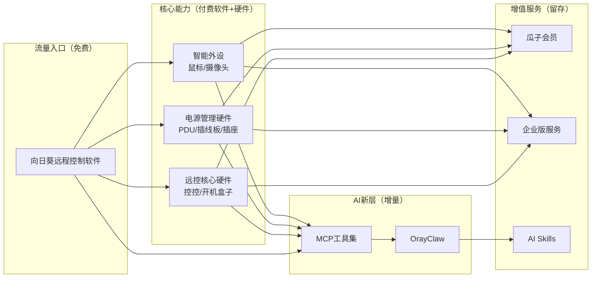
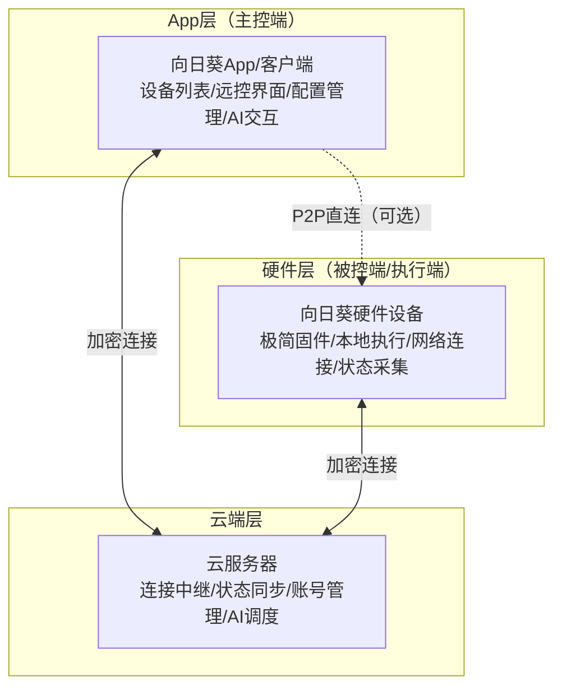

# 向日葵远程控制产品全面深度解析：国民远控的生态战略、商业模式与AI跃迁

> **官方网站**: <https://sunlogin.oray.com/>
> **贝锐20周年AI发布会**: <https://gf-oray.com.cn/#ai>
> **向日葵MCP官方文档**: <https://service.oray.com/question/50496.html>
> **GitHub开源仓库**: <https://github.com/OrayDev/awesun-mcp>

***

## 📋 目录导航

- [一、报告概述与学习目标 🎯](#一报告概述与学习目标)
- [二、贝锐20年发展与向日葵战略定位 📜](#二贝锐20年发展与向日葵战略定位)
- [三、产品矩阵全景：从软件到硬件到AI的完整生态 🧩](#三产品矩阵全景从软件到硬件到ai的完整生态)
    - [3.2.3 移动端远程控制](#323-移动端远程控制)
- [四、商业模式深度拆解：三层变现漏斗 💰](#四商业模式深度拆解三层变现漏斗)
- [五、技术架构一致性：硬件+App+云端三层范式 ⚙️](#五技术架构一致性硬件app云端三层范式)
- [六、2026竞品全景对比：十款远控软件横评 🏆](#六2026竞品全景对比十款远控软件横评)
- [七、产品哲学与设计原则 💡](#七产品哲学与设计原则)
- [八、AI战略深度解析：从远控工具到AI执行基础设施 🤖](#八ai战略深度解析从远控工具到ai执行基础设施)
- [九、市场用户与渠道策略 📊](#九市场用户与渠道策略)
- [十、核心洞察与跨领域启示 🚀](#十核心洞察与跨领域启示)
- [十一、常见问题解答（FAQ）❓](#十一常见问题解答faq)
- [十二、相关资源链接 🔗](#十二相关资源链接)

***

## 一、报告概述与学习目标 🎯

> **"连接世界、操作世界、服务世界"**
>
> —— 贝锐AI战略口号

### 1.1 研究背景

向日葵远程控制是贝锐科技（Oray）旗下的国民级远程控制产品，也是国内远程控制领域的开创者和领军者。经过17年发展（2009年至今），向日葵已从单一的远程桌面软件，进化为覆盖"软件+硬件+服务+AI"的完整远控生态，服务1.2亿+注册用户、150万+企业客户，累计接入设备超过26亿台。

2026年是贝锐成立20周年，也是向日葵战略转型的关键节点——随着向日葵16.5版本发布、OrayClaw（龙虾）AI能力底座推出、向日葵MCP开源，向日葵正在从"远程控制工具"向"AI执行基础设施"跃迁，为AI Agent提供"手和脚"，解决AI从"能说"到"能做"的最后一公里问题。

本报告在8篇单个产品Wiki的基础上，进行跨产品线的系统性整合分析，旨在全面理解向日葵的产品战略、商业模式、技术架构、竞争优势和AI转型路径，为AI Agent系统设计、IoT产品规划、软硬结合产品开发提供跨领域参考。

### 1.2 本报告学习目标

通过本报告的系统学习，你将能够：

1. **理解向日葵的完整生态战略**：掌握"软件引流+硬件变现+服务留存"的三层商业模式
2. **建立产品矩阵全景认知**：清晰了解向日葵四大品类（软件安全、远控核心硬件、电源管理、智能外设）的产品布局
3. **掌握技术架构设计范式**：理解"硬件端+App端+云端"三层架构在全产品线的一致性应用
4. **了解2026竞品格局**：通过十款主流远控软件的多维度横评，理解向日葵的差异化竞争优势
5. **洞察产品设计哲学**：提炼场景化设计、本地能力保底、双版本矩阵等核心设计原则
6. **理解AI转型路径**：深度解析向日葵MCP、OrayClaw的技术路线，及其对AI Agent领域的启示
7. **萃取可复用模式**：将向日葵的产品经验映射到AI Agent、IoT、SaaS等领域

### 1.3 分析框架说明

本报告遵循"从宏观到微观、从战略到产品、从技术到商业、从分析到洞察"的逻辑结构：

| 分析维度      | 核心问题                                | 对应章节 |
| --------- | ----------------------------------- | ---- |
| **公司战略层** | 向日葵在贝锐体系中扮演什么角色？20年发展遵循什么演进逻辑？      | 第二章  |
| **产品矩阵层** | 向日葵有哪些产品？如何形成协同效应？梯度如何设计？           | 第三章  |
| **商业模式层** | 向日葵如何赚钱？免费和付费的边界如何设计？转化漏斗如何构建？      | 第四章  |
| **技术架构层** | 所有产品共享什么底层架构范式？关键技术选型逻辑是什么？         | 第五章  |
| **竞争格局层** | 与TeamViewer/ToDesk等竞品相比，向日葵的优劣势是什么？ | 第六章  |
| **产品哲学层** | 向日葵产品设计遵循哪些核心原则？为什么能持续成功？           | 第七章  |
| **AI转型层** | 向日葵如何拥抱AI？MCP和OrayClaw解决什么问题？       | 第八章  |
| **市场运营层** | 向日葵的用户分层、渠道策略、市场定位是什么？              | 第九章  |
| **洞察启示层** | 向日葵经验对AI Agent/IoT/SaaS领域有什么可复用价值？  | 第十章  |

***

## 二、贝锐20年发展与向日葵战略定位 📜

> **"从解决'能访问'，到实现'能操作'，再到构建'能组网'、'可管理'，最终走向'AI执行'——这是贝锐20年的产品演进主线。"**

### 2.1 贝锐20年发展五阶段

贝锐成立于2006年，20年来始终围绕"连接"这一核心命题，产品演进遵循清晰的能力升级主线：

| 阶段       | 时间区间      | 核心产品      | 解决的核心问题  | 关键里程碑                                                                                                   |
| -------- | --------- | --------- | -------- | ------------------------------------------------------------------------------------------------------- |
| **第一阶段** | 2006-2009 | 花生壳DDNS   | **能访问**  | 动态域名解析技术诞生，解决公网IP动态变化下的设备访问问题，全球用户突破千万                                                                  |
| **第二阶段** | 2009-2015 | 向日葵远程控制   | **能操作**  | 从远程访问升级为远程操作，成为国民级远程控制产品；疫情期间成为远程办公关键支撑；完成信创生态适配（6大国产芯片+5大国产OS）；推出软硬结合方案（开机插座/IPKVM）；牵头制定《远程控制软件技术》团体标准 |
| **第三阶段** | 2015-2020 | 蒲公英异地组网   | **能组网**  | 从单点连接升级为网络组网，自研SD-WAN技术，实现即插即用无需公网IP，连续两年电商销量第一                                                         |
| **第四阶段** | 2020-2026 | 洋葱头企业应用管理 | **可管理**  | 从设备连接升级为组织级连接管理，构建统一账号体系、权限控制、行为审计能力                                                                    |
| **第五阶段** | 2026至今    | AI产品矩阵    | **AI执行** | 发布OrayClaw AI能力底座及全产品线AI升级，核心命题从"连接能力"跃升为"AI如何真正参与执行"                                                   |

**演进逻辑总结**：**能访问 → 能操作 → 能组网 → 可管理 → AI执行**

这五个阶段环环相扣，每一步都建立在前一阶段的技术积累和用户基础之上。向日葵作为第二阶段的核心产品，不仅是"能操作"的载体，更在后续阶段不断进化，成为贝锐"连接能力"最集中的体现。

### 2.2 向日葵在贝锐产品矩阵中的战略定位

贝锐五大产品形成从底层硬件到上层应用的完整技术栈：

| 产品名称                | 产品定位           | 在四层AI链路中的层级 | 与向日葵的协同                |
| ------------------- | -------------- | ----------- | ---------------------- |
| **向日葵远程控制**         | 远程设备控制平台       | 设备层         | 核心产品，提供设备操作能力          |
| **蒲公英智能组网**         | SD-WAN异地组网解决方案 | 网络层         | 为向日葵远程控制提供稳定的网络连接基础    |
| **花生壳内网穿透**         | 内网穿透与动态域名解析    | 访问层         | 解决向日葵在复杂网络环境下的连接可达性问题  |
| **洋葱头**             | 企业应用管理平台       | 应用层         | 与向日葵配合，实现从设备控制到业务操作的闭环 |
| **OrayOS/OrayClaw** | AI能力底座         | 中枢层         | 统一调度向日葵等四层能力，实现AI自主执行  |

**向日葵的战略角色**：

1. **流量入口**：向日葵免费软件是贝锐最大的用户获取渠道，贡献了海量用户基础
2. **能力核心**：远程设备控制是AI执行链路中最基础、最核心的"手"的能力
3. **硬件载体**：向日葵是贝锐"软硬结合"战略的主要承载者，硬件产品线最丰富
4. **AI先锋**：向日葵MCP是贝锐首个开源的AI能力接口，是AI战略的先行落地产品

### 2.3 从"国民远控"到"AI执行基础设施"的定位跃迁

2026年的AI战略发布，标志着向日葵的定位发生了根本性跃迁：

| 定位维度     | 传统定位（2009-2025） | 新定位（2026至今）            |
| -------- | --------------- | ---------------------- |
| **核心价值** | 让人能远程操作设备       | 让AI能自主操作设备             |
| **用户角色** | 人是操作者，软件是工具     | AI是执行者，人是监督者           |
| **交互方式** | 人手动点击鼠标键盘       | AI通过MCP协议调用工具          |
| **产品形态** | 客户端软件+硬件        | MCP工具集+AI能力底座+硬件生态     |
| **技术路线** | 远控协议优化、画质提升     | 视觉识别+键鼠模拟+任务编排         |
| **商业模式** | 会员付费+硬件销售       | Skills市场+API调用+企业级AI方案 |

这一跃迁并非否定过去，而是在向日葵十余年远控技术积累的基础上，将核心能力开放给AI，打开全新的市场空间。

***

## 三、产品矩阵全景：从软件到硬件到AI的完整生态 🧩

> **"所有硬件产品均遵循'硬件端+App端+云端'三层架构，硬件极简、App灵活、云做连接与增值服务"**
>
> —— 向日葵产品线共性洞察

### 3.1 四大品类全景概览

经过多年布局，向日葵已构建起覆盖"软件+硬件+服务+AI"的完整产品矩阵，分为四大品类：

| 品类          | 产品数量                     | 核心功能                         | 目标用户             | 价格带        |
| ----------- | ------------------------ | ---------------------------- | ---------------- | ---------- |
| **软件与安全产品** | 1个核心（远控软件）+ N个企业模块       | 远程桌面、文件传输、CMD/SSH、安全防护、企业管理  | 个人免费+个人付费+企业     | 免费-千元/年企业版 |
| **远控核心硬件**  | 控控系列（5款）+ 开机盒子（2款）       | IPKVM无网远控、WOL网络唤醒、BIOS级控制    | IT运维、工业控制、专业用户   | 200-2000元  |
| **电源管理硬件**  | PDU（2代）+ 插线板（2款）+ 插座（3款） | 远程电源控制、电量监控、定时开关、AC Recovery | 数据中心、企业、家庭用户     | 50-3000元   |
| **智能外设**    | 远控鼠标（2款）+ USB摄像头（1款）     | 远控指针操作、远程视频语音                | 设计师、远程协助、会议场景    | 100-500元   |
| **AI新品**    | 向日葵MCP + OrayClaw集成      | AI远控工具集、自然语言任务执行             | AI开发者、运维人员、自动化场景 | 免费+高级功能付费  |

### 3.2 一、软件与安全产品

**向日葵远程控制软件**是整个生态的基石和流量入口，最新版本为16.5（2026年发布）。

#### 3.2.1 核心功能矩阵

| 功能模块     | 具体功能                                      | 免费/付费      |
| -------- | ----------------------------------------- | ---------- |
| **基础远控** | 远程桌面、跨平台支持（Windows/Mac/Linux/iOS/Android） | 免费         |
| **性能特性** | 首帧<1秒、4K\@144fps、8K\@60fps、7ms低延迟、AI画质增强  | 部分付费（瓜子会员） |
| **高效协作** | 超级桌面（应用无缝融合）、闪传文件、成为副屏、多屏控多屏              | 免费+付费混合    |
| **远程管理** | 远程文件、CMD/SSH、远程打印、多协议远程（RDP）              | 部分付费       |
| **安全功能** | 免密远控（设备授信）、隐私屏、水印、访问密码、二次验证               | 基础免费，企业级付费 |
| **AI功能** | 向日葵AI助手、MCP服务器、OrayClaw集成                 | 基础免费       |

#### 3.2.2 16.5版本核心新特性（2026年）

向日葵16.5是AI战略落地的关键版本，新增多项重要功能：

| 新特性            | 功能说明                                       | 价值                         |
| -------------- | ------------------------------------------ | -------------------------- |
| **全功能MCP**     | 内置MCP服务器，一键启用，自动生成配置，支持Stdio/HTTP双模式       | 让任何支持MCP的AI都能调用向日葵远控能力     |
| **OrayClaw集成** | 内置运维级AI副手，理解自然语言、自动拆解任务、失败重试、进度推送          | 无需额外AI客户端，向日葵客户端直接具备AI执行能力 |
| **免密远控**       | 从"静态密码"升级为"主控设备授信"安全模型，授权设备一键直达            | 提升安全性的同时简化操作，安全验证隐性化       |
| **超级桌面**       | 将被控电脑应用直接映射到主控桌面，Windows/Mac可直接运行Windows应用 | 无缝融合设备，重新定义远程控制的交互体验       |
| **闪传文件**       | 拖拽到悬浮窗即可发送，本地操作无需三方传输软件                    | 大幅提升跨设备文件传输效率              |
| **成为副屏**       | 将另一台笔记本/iPad作为电脑扩展屏                        | 多屏协作效率翻倍                   |
| **AI画质增强**     | AI优化文字图片细节，弱网环境智能码率调整                      | 弱网体验提升，高清画质更细腻             |

#### 3.2.3 移动端远程控制

向日葵个人版for Windows除支持远程控制PC端外，还可实现对手机设备的远程控制，覆盖Android与iOS两大移动平台，是远控场景从桌面向移动终端延伸的重要能力。

##### 功能概述

移动端远程控制功能允许用户通过电脑端向日葵客户端，远程操控安卓/iOS手机设备，实现桌面控制、摄像头查看、文件传输等操作。该功能极大拓展了远程协助的场景边界，可用于远程协助长辈操作手机、远程查看手机摄像头画面、跨设备文件互传等场景。

> **重要提示**：移动端远程控制功能存在服务等级权限限制，免费用户与付费用户的功能权限存在差异。

##### 服务等级与权限

不同服务等级对移动端远程控制的支持权限存在明确区分：

| 服务等级             | 观看手机屏幕 | 控制手机 | 支持移动设备数量 |
| ---------------- | ------ | ---- | -------- |
| **免费用户**         | ✅      | ❌    | -        |
| **尝鲜版**          | ✅      | ✅    | 1台       |
| **瓜子会员**         | ✅      | ✅    | 2台       |
| **超级会员**         | ✅      | ✅    | 5台       |
| **商业版&企业版**      | ✅      | ✅    | 不限       |
| **行业青春版**        | ✅      | ❌    | -        |

> **权限说明**：付费服务（除行业青春版外）需同时具备移动授权方可支持控制手机功能。

各服务等级支持的可绑定移动设备数量限制如下：

| 会员类型     | 可绑定移动设备数量 |
| -------- | ---------- |
| 免费用户     | -（仅观看）    |
| 尝鲜版      | 1台         |
| 瓜子会员     | 2台         |
| 超级会员     | 5台         |
| 商业版&企业版  | 不限         |
| 行业青春版    | -（仅观看）    |

##### 手机端设置

手机端需先完成向日葵客户端安装与初始化配置：

1. **安装客户端**：在安卓/iOS设备的应用市场搜索"向日葵客户端"APP并下载安装
2. **账号登录**：打开APP，输入向日葵账号密码完成登录
3. **设置访问密码**：登录成功后，为本设备设置独立访问密码，用于远控时的身份验证

手机实现被远程控制需获取相关权限或借助智能硬件，共支持三种被控方式：

| 被控方式              | 适用平台       | 系统要求        | 实现难度 | 详细配置文档                                     |
| ----------------- | ---------- | ----------- | ---- | ------------------------------------------ |
| **获取Root权限**      | Android    | 无版本限制       | 较高   | <https://service.oray.com/question/5138.html>  |
| **开启辅助服务**        | Android    | Android 7.0及以上 | 较低   | <https://service.oray.com/question/15492.html> |
| **搭配UUPro智能硬件**   | Android/iOS | 无系统版本要求     | 最低   | <https://service.oray.com/question/13756.html> |

**三种被控方式说明**：

- **Root权限方式**：需借助Root工具获取手机Root权限，或在手机开发者选项中开启相关权限，适用于有一定技术能力的Android用户
- **辅助服务方式**：Android 7.0及以上系统支持，无需Root，仅需在手机设置中开启向日葵辅助服务权限，是Android平台推荐的主流方式
- **UUPro硬件方式**：UUPro设备通过蓝牙方式连接至手机，无需Root、无需系统特殊权限，即插即用，同时支持Android和iOS平台

##### 电脑端操作

电脑端操作流程如下：

1. **安装客户端**：从向日葵官网下载安装向日葵个人版for Windows（<https://sunlogin.oray.com/download>）
2. **账号登录**：使用与手机客户端相同的账号密码登录
3. **发起远控**：在【设备列表】中可看到在线的手机设备，完成授权后即可发起远程控制

##### 平台功能差异

由于iOS系统的封闭性限制，Android与iOS平台在移动端远程控制功能上存在差异：

| 功能模块   | Android | iOS | 备注                                    |
| ------ | ------- | --- | ------------------------------------- |
| **桌面控制** | ✅       | ✅   | iOS需搭配向日葵Q1完成连接（Q1使用手册：<https://service.oray.com/question/46943.html>） |
| **桌面观看** | ✅       | ✅   | 仅观看手机屏幕画面                            |
| **摄像头**  | ✅       | ❌   | Android支持远程查看手机摄像头现场画面                |
| **远程文件** | ✅       | ❌   | Android支持电脑与手机之间的文件互传                  |

> **iOS限制说明**：iOS桌面控制时需iOS设备与向日葵Q1硬件完成蓝牙连接方可实现，目前仅支持桌面控制与桌面观看两项基础功能，摄像头和远程文件功能暂不支持。

##### 核心功能演示

移动端远程控制包含三大核心功能：

1. **桌面控制**：在电脑端设备列表找到安卓手机，点击【桌面控制】，经过访问密码验证后即可在电脑上实时操控手机屏幕，支持鼠标点击、滑动、键盘输入等完整操作
2. **摄像头**：远程查看安卓手机摄像头现场画面，可灵活切换前后摄像头，支持截图、录像、变更横/竖屏及画面镜像功能，适用于远程监控、视频查看等场景
3. **远程文件**：让电脑轻松访问手机文件系统，实现电脑与手机两端文件的相互传输，无需数据线即可完成文件管理

##### 常见问题

**Q：使用远程文件功能时提示"路径不合法"如何解决？**

该问题通常是由于安卓系统权限限制导致，未开启【访问所有文件权限】。

**解决办法**：在安卓手机打开向日葵客户端APP，点击右上角设置图标，手动开启【访问所有文件权限】（适用于Android 11及以上系统版本）。开启后重新发起远程文件连接即可正常访问手机文件路径。

##### 移动端远控设计洞察

移动端远控看似只是"把远控延伸到手机"，实则蕴含着与桌面远控截然不同的设计智慧。以下四个设计观察，与第七章提炼的产品哲学一脉相承，是场景化设计、权限分层、跨平台务实主义在移动场景的集中体现。

**洞察一：权限分层的精细设计——"可看不可控"的价值感知与付费转化平衡**

免费用户仅可观看手机屏幕、付费用户才可控制操作——这一"看"与"控"的分离，是远控领域最精妙的免费/付费边界设计之一。

| 反例（粗暴权限分割）                | 向日葵做法（精细权限分层）                         |
| ------------------------- | ---------------------------------------- |
| 免费版完全不支持手机远控，用户连价值都感知不到      | 免费版开放"观看"权限，让用户真实体验手机远控的场景价值        |
| 免费版完全开放控制，付费用户无升级动力           | 付费版才解锁"控制"权限，为真正需要操作的用户留下付费空间       |
| 一刀切"全有或全无"，要么流失要么无转化           | "可看不可控"形成甜蜜点：既教育了市场，又保留了转化动力        |

> **核心洞察**：好的免费/付费边界不是"砍功能"，而是"给用户体验价值的窗口，但把真正解决问题的钥匙放在付费门后"。这与第七章"不打扰的安全UX"和"免费vs付费边界设计"原则完全呼应——基础价值必须让用户摸到，高阶价值才值得付费。

试想：如果免费用户连手机屏幕都看不到，他们怎么知道"远程帮长辈看手机问题"、"远程监控手机画面"这些场景有多刚需？如果免费用户直接就能控制手机，谁还会为这个功能付费？"可看不可控"恰好卡在用户价值感知和付费意愿的平衡点上。

**洞察二：多路径适配策略——软件方案→系统权限方案→硬件兜底方案的完整覆盖**

针对Android手机被控，向日葵设计了三条路径：Root权限、辅助服务、UUPro硬件，形成了从"零成本软件方案"到"高门槛系统权限方案"再到"零门槛硬件兜底方案"的完整梯度。

| 被控方式         | 门槛  | 功能完整度 | 适用人群                  | 设计定位     |
| ------------ | --- | ----- | --------------------- | -------- |
| **Root权限**   | 最高  | 最完整   | 极客玩家、技术用户             | 能力天花板方案  |
| **辅助服务**     | 中等  | 良好    | 普通Android用户（Android 7.0+） | 主流推荐方案   |
| **UUPro硬件**  | 最低  | 基础完整  | 所有用户（含iOS）、不想折腾系统的用户 | 硬件兜底方案   |

这一设计完美体现了第七章"场景化而非功能化"的核心原则——不是做一个"最好的方案"强迫所有人接受，而是为不同技术能力、不同使用场景、不同付费意愿的用户提供各自适合的路径。技术用户可以Root获得完整体验，普通用户开辅助服务即可满足需求，不想折腾系统或用iOS的用户买个UUPro硬件就能即插即用。三条路径互相补充，没有一条路径是"多余"的。

**洞察三：平台差异的务实应对——承认限制而非强行突破，用硬件做合规补全**

面对iOS系统的封闭性，向日葵没有试图"破解"或"绕过"iOS限制（这既不合规也不稳定），而是采取了极其务实的应对策略：

1. **不做虚假承诺**：明确告知iOS用户仅支持桌面控制和观看，不承诺安卓才有的摄像头和远程文件功能
2. **硬件补全能力**：通过Q1硬件提供官方合规的iOS控制解决方案，用蓝牙连接而非系统漏洞
3. **能力边界透明**：在功能对比表中清晰标注✅/❌，不让用户产生"为什么安卓有我没有"的预期落差

> **核心洞察**：这是"本地能力保底"原则在跨平台场景的延伸——承认平台限制是产品自信的表现，用官方合规的方式（硬件）做能力补全，比用黑客手段"破解"系统更能赢得用户长期信任。不承诺做不到的事，比承诺了却做不好，是更高级的产品智慧。

对比一些竞品"iOS也能远控"的模糊宣传，向日葵清晰的平台差异标注反而是更负责任的做法——用户知道自己能得到什么，不会在付费后才发现功能缺失。

**洞察四：系统权限的渐进式获取——按需申请而非一次性索要**

移动端权限设计最容易犯的错误就是"APP一打开就要一堆权限"，用户出于警惕直接拒绝或卸载。向日葵的做法是"按需申请、渐进授权"：

- 基础远控功能：只需要访问密码验证，不需要额外系统权限
- 远程文件功能：当用户真正使用时，才引导开启"访问所有文件权限"（Android 11+）
- 辅助服务方式：当用户选择该被控方式时，才引导跳转系统设置开启

这一设计与第七章"不打扰的安全UX"和"非侵入式安全UX"原则一脉相承，也完全符合移动应用权限设计的最佳实践：

| 反例（一次性索要所有权限）       | 向日葵做法（渐进式授权）                  |
| -------------------- | ----------------------------- |
| APP首次启动就弹10个权限请求，用户直接吓跑 | 用户用到哪个功能才申请哪个权限              |
| 用户不知道为什么要这个权限，一律拒绝    | 在具体场景下申请权限，用户理解"为什么需要"     |
| 为了"以防万一"提前要权限，实际很多用不上  | 只在真正需要时才申请，权限使用率高、拒绝率低   |

> **核心洞察**：信任是逐步建立的，不是一次性索要的。用户在使用过程中逐步授予权限，每一次授权都伴随着明确的价值反馈（"开启这个权限我就能传文件了"），接受度远高于首次安装时的"权限轰炸"。这一原则不仅适用于APP权限设计，也适用于AI Agent的能力授权——不要一开始就要所有权限，而是在AI执行具体任务时再请求对应权限。

***

移动端远控的四个设计洞察，本质上是第七章产品哲学在移动场景的具体落地："场景化而非功能化"体现为多路径适配，"本地能力保底"体现为硬件兜底方案，"不打扰的安全UX"体现为渐进式权限获取，"免费vs付费边界设计"体现为"可看不可控"的精细分层。这些设计原则不是抽象的口号，而是在每一个功能决策中具体体现的产品智慧。

### 3.3 二、远控核心硬件

远控核心硬件是向日葵"软硬结合"战略的核心体现，解决纯软件方案无法覆盖的场景（如无网环境、关机状态、BIOS级操作）。

#### 3.3.1 控控/IPKVM系列（无网远控）

控控系列是向日葵的旗舰硬件产品，基于IPKVM（IP Keyboard, Video, Mouse）技术实现**不依赖被控电脑操作系统的旁路远控**。

| 产品        | 定位     | 网络连接              | 核心特性                          | 价格定位  |
| --------- | ------ | ----------------- | ----------------------------- | ----- |
| **控控2**   | 旗舰款    | HDMI+USB+有线网+WiFi | 1080P\@60fps、USB HID仿真、HDMI环出 | 高端    |
| **Q1**    | 工业级4G版 | 4G+有线网+WiFi       | 无网环境远控、5年流量全包                 | 工业级   |
| **Q2Pro** | 蓝牙配网版  | 蓝牙+WiFi+有线网       | 蓝牙闪连、简化配置                     | 消费级高端 |
| **Q0.5**  | 入门便携版  | USB+WiFi          | 便携、即插即用                       | 消费级入门 |
| **Q5Pro** | 5G旗舰版  | 5G+有线网+WiFi       | 5G高速、工业级可靠性                   | 专业级   |

**核心技术模式萃取**：

1. **IPKVM旁路控制**：不侵入被控系统，在HDMI和USB层面进行信号截取和仿真，即使系统崩溃、蓝屏、未进OS也能远控
2. **多模网络冗余**：支持蓝牙/WiFi/4G/5G/有线等多种网络连接方式，根据场景自动选择最优链路
3. **USB HID仿真即插即用**：模拟标准USB键盘鼠标设备，被控端无需安装驱动，即插即用

#### 3.3.2 开机盒子系列（WOL网络唤醒）

开机盒子解决"设备关机状态下如何远程开机"这一刚需痛点，基于Wake-on-LAN（WOL）技术。

| 产品         | 定位  | 核心功能                 | 关键差异      |
| ---------- | --- | -------------------- | --------- |
| **开机盒子K3** | 入门版 | MAC开机、定时开机、异地组网      | 基础功能，价格亲民 |
| **开机盒子K4** | 专业版 | K3全部功能+批量开机+更稳定的网络性能 | 企业批量管理场景  |

**核心洞察**：开机盒子虽小，但解决了远控场景的"最后一米"问题——如果设备是关机状态，再好的远控软件也无能为力。硬件与软件形成完美闭环。

### 3.4 三、电源管理硬件

电源管理硬件是向日葵产品线的重要延伸，覆盖从数据中心到家庭的全场景电源控制需求。

| 产品系列      | 产品           | 定位      | 孔位数    | 核心功能                       |
| --------- | ------------ | ------- | ------ | -------------------------- |
| **智能PDU** | P8一代/二代      | 工业/机房级  | 8孔独立分控 | 电量监控、温湿度联动、用电保护、远程重启       |
| **智能插线板** | P4（4G版）      | 户外/无网场景 | 4孔     | 5年流量全包、温柔开关机、本地定时断网可用      |
| <br />    | P1Pro（WiFi版） | 主流家用/办公 | 4孔     | WiFi连接、AC Recovery、750°C阻燃 |
| **智能插座**  | C1Pro        | 入门基础款   | 1孔     | 蓝牙闪连、本地定时、过载保护             |
| <br />    | C2           | 进阶款     | 2孔     | 独立分控、电量统计                  |
| <br />    | C4           | 4G户外款   | 1孔     | 4G联网、户外场景、远程控制             |

**梯度设计洞察**：电源产品线完美体现了**从工业级到消费级的梯度覆盖策略**：

- **顶部**：PDU P8二代 → 面向数据中心、机房，专业功能齐全，价格最高
- **中部**：P4/P1Pro → 面向中小企业、门店、高级家庭用户，平衡功能与价格
- **底部**：C1Pro/C2/C4 → 面向普通家庭用户，做功能减法，聚焦核心场景，价格门槛极低

### 3.5 四、智能外设

智能外设是向日葵远控能力在交互层的延伸，为特定场景提供更优化的硬件交互体验。

#### 3.5.1 智能远控鼠标BM110/MM110

| 维度       | BM110（商务旗舰）           | MM110（便携入门） |
| -------- | --------------------- | ----------- |
| **定位**   | 商务办公、长时间使用            | 便携、移动办公     |
| **待机功耗** | 0.05mA（40倍优化）         | 2mA         |
| **电池续航** | 超长续航                  | 基础续航        |
| **核心功能** | 指针模式远控、双设备一键切换、人体工学设计 | 指针模式远控、便携轻薄 |
| **价格**   | 中高端                   | 入门级         |

**核心洞察**：远控鼠标通过硬件层面的指针模式优化，解决纯软件远控鼠标操作的延迟和精度问题，为设计师、工程师等对鼠标精度要求高的用户提供更好的远控体验。

#### 3.5.2 USB远程摄像头SU1

| 规格     | 参数                    | 价值          |
| ------ | --------------------- | ----------- |
| 分辨率/帧率 | 400万像素2K/1080P\@60fps | 高清流畅画面      |
| 音频     | 双全向麦克风，3米拾音           | 远程语音清晰      |
| 视角     | 360°水平旋转，4倍数码变倍       | 灵活查看各个角度    |
| 驱动     | UVC免驱                 | 即插即用，无需安装驱动 |
| 功耗     | 1.1W超低功耗              | 长时间工作稳定     |
| 畸变     | TV畸变<1%               | 画面真实无变形     |

**核心场景**：远程视频语音指导、远程医疗、视频会议、机房环境监控。

### 3.6 产品矩阵协同效应

四大品类并非孤立存在，而是形成强大的协同效应：



**协同逻辑**：

1. **软件引流**：免费远控软件获得海量用户
2. **场景识别**：用户在使用软件过程中遇到无网远控、远程开机、电源控制等场景，自然产生硬件需求
3. **硬件变现**：用户购买对应硬件解决特定场景痛点，硬件销售贡献高毛利
4. **服务留存**：硬件用户转化为付费会员，企业用户采购企业级服务，形成持续收入
5. **AI增量**：MCP和OrayClaw为所有用户（软件+硬件）提供AI增值，打开新的付费空间

***

## 四、商业模式深度拆解：三层变现漏斗 💰

> **"软件引流+硬件变现+服务留存"——向日葵三层商业模式**

### 4.1 三层变现架构

向日葵的商业模式是一个设计精巧的三层漏斗，每层承担不同的商业职能：

| 层级           | 载体                        | 价格策略            | 商业目标                  | 用户规模   | 毛利率          |
| ------------ | ------------------------- | --------------- | --------------------- | ------ | ------------ |
| **第一层：软件引流** | 向日葵远程控制免费版                | 免费              | 获取海量用户、建立品牌认知、培育使用习惯  | 亿级用户   | 负（获客成本）      |
| **第二层：硬件变现** | 控控、开机盒子、PDU、插线板、插座、鼠标、摄像头 | 一次性购买（50-3000元） | 高毛利变现、承接高价值需求、形成差异化壁垒 | 百万级    | 高（硬件毛利）      |
| **第三层：服务留存** | 瓜子会员、企业版服务、AI Skills      | 订阅制（百元-千元/年）    | 持续收入、提高用户粘性、LTV提升     | 十万-百万级 | 极高（边际成本趋近于零） |

### 4.2 第一层：软件免费的策略逻辑

为什么基础远控功能免费？这背后有清晰的商业考量：

1. **网络效应**：远控是双向需求——你用向日葵，自然会推荐给你需要协助的人、你需要控制的设备的使用者，免费加速病毒式传播
2. **场景教育**：用户在免费使用过程中，会自然遇到各种场景痛点（关机了开不了、无网环境控不了、要控制电源），这些痛点正是硬件产品的切入点
3. **替代壁垒**：免费策略建立了极高的替代壁垒——用户的设备列表、使用习惯、联系人都在向日葵上，迁移成本很高
4. **数据积累**：海量免费用户的使用数据，帮助向日葵持续优化产品、识别痛点、定义新硬件需求

**免费 vs 付费的边界设计**（免费版不砍核心功能，只限制高阶体验）：

| 功能类型      | 免费版        | 付费版                   | 设计逻辑                |
| --------- | ---------- | --------------------- | ------------------- |
| **基础远控**  | ✅ 完整支持     | ✅                     | 核心功能不能砍，否则用户直接流失到竞品 |
| **画质/帧率** | 1080P基础画质  | 4K/144fps/8K/AI增强     | 性能体验作为付费点，不影响基础使用   |
| **设备数量**  | 基础数量       | 更多设备/批量管理             | 个人用户够用，企业和重度用户付费    |
| **安全功能**  | 基础密码验证     | 免密授信、企业审计、MFA         | 个人基础安全足够，企业级需求付费    |
| **AI功能**  | 基础MCP/AI助手 | 高级OrayClaw能力/Skills市场 | AI新功能先免费培育市场，再逐步分层  |

### 4.3 第二层：硬件变现的核心优势

硬件是向日葵区别于ToDesk、TeamViewer等纯软件竞品的**核心差异化壁垒**：

| 优势维度     | 具体说明                                 |
| -------- | ------------------------------------ |
| **高毛利**  | 智能硬件毛利率通常在40-60%，远高于纯软件订阅的早期获客阶段     |
| **强刚需**  | 无网远控、远程开机、电源控制这些需求，纯软件根本无法解决，用户必须买硬件 |
| **低退货**  | 硬件解决的是明确痛点，用户购买后退货率低，满意度高            |
| **品牌感知** | 实体硬件比纯软件有更强的品牌存在感，用户粘性更高             |
| **生态锁定** | 用户买了向日葵硬件，自然会持续使用向日葵软件，不会轻易切换到竞品     |
| **场景延伸** | 一款硬件解决一个场景痛点，多个硬件覆盖更多场景，用户生命周期价值持续提升 |

**硬件定价策略——双版本矩阵**：

观察向日葵几乎所有硬件品类都采用"入门版+专业版"双版本策略：

- K3/K4（开机盒子）
- P4/P1Pro（插线板）
- MM110/BM110（鼠标）
- P8一代/二代（PDU）

这一策略的优势：

1. **覆盖两类用户**：价格敏感用户选入门版，功能敏感用户选专业版
2. **锚定效应**：专业版的存在让入门版显得"性价比很高"
3. **升级路径**：用户先用入门版，需求升级后自然购买专业版
4. **渠道适配**：不同渠道可以推不同版本（电商引流推入门，企业客户推专业）

### 4.4 第三层：服务留存的长期价值

会员和企业服务是真正实现长期稳定收入的层级：

| 服务类型       | 目标用户       | 核心价值                            |
| ---------- | ---------- | ------------------------------- |
| **瓜子会员**   | 个人重度用户     | 高画质、高帧率、多设备、无广告、优先通道            |
| **企业版**    | 中小企业到大型企业  | 批量部署、权限管理、行为审计、安全合规、专属客服        |
| **AI增值服务** | AI开发者、运维人员 | 高级OrayClaw能力、私有Skills市场、企业级AI编排 |

**订阅制的价值**：

- 收入可预测、可复购
- 用户留存率越高，LTV（用户生命周期价值）越高
- 持续的收入支撑持续的研发投入，形成正向循环

### 4.5 商业模式闭环总结

向日葵的商业模式形成了一个健康的正向循环：

```
免费软件获客 → 场景痛点识别 → 硬件销售变现 → 会员服务留存 → 收入投入研发 → 产品更好用 → 更多用户
                         ↓
                    AI能力增值 → 新付费场景 → 更高ARPU
```

对比纯软件竞品（ToDesk、TeamViewer等），向日葵的模式抗风险能力更强：

- 不单纯依赖订阅收入，硬件提供稳定现金流
- 软硬结合形成生态锁定，用户迁移成本极高
- AI时代到来时，硬件生态成为AI执行的物理载体，获得先发优势

***

## 五、技术架构一致性：硬件+App+云端三层范式 ⚙️

> **"所有硬件产品均遵循'硬件端+App端+云端'三层架构，这是向日葵产品线最显著的技术共性"**

### 5.1 三层架构总览

向日葵全产品线（从插座到控控，从鼠标到PDU）高度一致地采用"硬件端+App端+云端"三层架构范式：



### 5.2 三层架构各层职责设计原则

#### 5.2.1 硬件端设计原则：极简、可靠、本地保底

| 设计原则              | 具体体现                             |
| ----------------- | -------------------------------- |
| **极简固件**          | 硬件只做最核心的执行和采集功能，不做复杂逻辑，保证稳定性和低功耗 |
| **本地能力保底**        | 即使断网，核心功能仍可本地运行（如本地定时开关、蓝牙近场控制）  |
| **多模网络接入**        | 支持WiFi/蓝牙/4G/5G/有线等多种联网方式，适应不同场景 |
| **标准化接口**         | 尽量使用标准协议（如UVC、USB HID），降低兼容性问题   |
| **AC Recovery支持** | 断电恢复后自动回到 desired state，支持远程开机场景 |

**为什么硬件要极简？**

- 硬件算力有限，复杂逻辑容易导致bug和不稳定
- 硬件固件升级成本高（变砖风险），越简单越可靠
- 复杂逻辑放在App和云端，可以快速迭代更新

#### 5.2.2 App端设计原则：灵活、易用、体验统一

| 设计原则       | 具体体现                            |
| ---------- | ------------------------------- |
| **统一交互体验** | 所有硬件在App中采用一致的交互范式，降低学习成本       |
| **功能灵活迭代** | 新功能优先在App层实现，快速发布快速迭代           |
| **可视化操作**  | 所有操作都有直观的视觉反馈，避免"黑盒"操作          |
| **跨平台一致**  | iOS/Android/Windows/Mac体验尽量保持统一 |
| **AI交互入口** | 自然语言交互、MCP配置、OrayClaw调度都在App层集成 |

#### 5.2.3 云端设计原则：连接、调度、增值、AI

| 设计原则       | 具体体现                              |
| ---------- | --------------------------------- |
| **连接中继**   | P2P打洞失败时提供中继服务，保证任何网络环境下都能连接      |
| **状态同步**   | 设备状态、配置信息多端同步                     |
| **账号体系**   | 统一账号管理、设备绑定、权限控制                  |
| **增值服务**   | 会员权益、企业管理、安全审计等云端增值能力             |
| **AI能力调度** | OrayClaw任务编排、Skills管理、多设备协同都在云端调度 |

### 5.3 关键技术选型逻辑深度解析

#### 5.3.1 远控技术路线：视觉识别+键鼠模拟 vs API调用

向日葵MCP和AI远控选择了**基于视觉识别与真实键鼠模拟**的技术路线，而非依赖操作系统和应用软件API。

**为什么不依赖API？**

企业真实IT环境具有极强的异构性：

- 不同企业使用不同版本的操作系统（Windows 7/10/11、各种Linux发行版、macOS）
- 不同企业使用不同版本的业务软件，很多是老旧版本或定制化版本
- 大量行业专用软件根本没有开放API
- 软件界面更新频繁，基于界面元素定位的API调用容易因版本升级失效

如果依赖API，会面临严重的兼容性问题——在A电脑上能用的自动化脚本，到B电脑上可能因为软件版本不同就失效了，维护成本极高。

**视觉+键鼠路线的核心优势**：

1. **通用性极强**：只要有图形界面就能控制，不依赖目标系统开放任何API
2. **鲁棒性好**：不容易因为软件更新、界面变化而失效
3. **适配复杂环境**：完美适配企业复杂、异构的实际IT环境
4. **算力部署合理**：AI视觉识别和推理算力只需部署在主控端，被控端无需AI能力
5. **被控端零负担**：被控端无需额外安装AI组件、复杂脚本或特殊代理程序
6. **支持一对多管理**：一个主控端AI可以同时管理大量被控设备，实现规模化运维

这一技术选型体现了贝锐**务实的产品哲学**：不追求技术上的"高大上"，而是选择最能解决企业实际问题、最可靠耐用的方案。

#### 5.3.2 安全技术路线：全流程纵深防御

向日葵安全体系采用"三大场景×三层防护"的纵深防御架构：

| 防护层级     | 核心机制                          |
| -------- | ----------------------------- |
| **事前防范** | 访问验证码、授权确认、设备授信、多因子认证、访问策略    |
| **事中守护** | RSA+AES+国密加密、通道隔离、隐私屏、水印、实时监控 |
| **事后追溯** | 操作日志、会话记录、安全审计、异常告警、OSRC漏洞响应  |

安全设计的三大原则：

1. **用户主权默认**：被控方始终拥有最高权限，可以随时中断远控、查看操作记录
2. **最小权限原则**：远控会话只授予必要权限，敏感操作需要额外验证
3. **安全不打扰**：风险分级，常规操作不打扰用户，高风险操作才弹窗验证

#### 5.3.3 网络技术路线：多模冗余+智能弱网优化

| 技术            | 作用                            |
| ------------- | ----------------------------- |
| **SADDC智能协议** | 自研远控协议，根据网络状况动态调整码率和帧率        |
| **多路径容灾**     | 多条网络路径备份，一条断了自动切另一条           |
| **P2P打洞+中继**  | 优先P2P直连，打洞失败自动走云端中继           |
| **弱网优化**      | 智能识别弱网环境，动态调整画质保证流畅           |
| **多模网络（硬件）**  | 蓝牙/WiFi/4G/5G/有线多模备份，适应各种网络环境 |

### 5.4 "本地能力保底"设计哲学

这是向日葵所有硬件产品共同遵循的重要设计原则：**即使断网，核心功能仍可使用**。

| 产品       | 断网后仍可用的本地功能          |
| -------- | -------------------- |
| 智能插座/插线板 | 本地定时开关、物理按键控制、蓝牙近场控制 |
| 开机盒子     | 本地局域网开机、定时开机         |
| 控控       | 本地局域网远控、HDMI本地输出     |
| PDU      | 本地物理按键控制、定时任务        |

这一设计的核心考量是：**可靠性不能100%依赖云端**。云端可能故障、外网可能中断、WiFi可能不稳定，如果所有功能都依赖云端，一旦断网设备就变砖，用户体验极差。本地保底确保了设备的基本可用性，让用户对产品有可靠预期。

***

## 六、2026竞品全景对比：十款远控软件横评 🏆

> 数据来源：2026年多家第三方媒体横评报告（CSDN、快科技、驱动之家等）综合整理

### 6.1 十款产品核心维度评分对比

2026年主流远控软件市场呈现"国产崛起、国际厂商退守高端"的竞争格局。以下是十款产品在四大核心维度的表现：

| 产品             | 性能表现    | 功能体验 | 安全与性价比 | 软硬生态   | 综合评分    | 核心定位      |
| -------------- | ------- | ---- | ------ | ------ | ------- | --------- |
| **ToDesk**     | 9.2     | 8.9  | 9.0    | 5.0    | **9.0** | 性能优先的国民选择 |
| **向日葵**        | 6.8-7.5 | 8.5  | 8.0    | **10** | **8.2** | 软硬一体的生态王者 |
| **RayLink**    | 8.0     | 7.9  | 7.0    | 4.0    | 7.2     | 专业设计/游戏场景 |
| **Splashtop**  | 7.6     | 7.7  | 7.5    | 3.0    | 7.2     | 企业级高清远程   |
| **Parsec**     | 7.8     | 7.0  | 6.5    | 2.0    | 6.6     | 游戏串流专用    |
| **RustDesk**   | 7.5     | 7.3  | 8.5    | 3.0    | 7.3     | 开源极客首选    |
| **AnyDesk**    | 7.3     | 7.2  | 7.0    | 2.0    | 6.5     | 轻量弱网应急    |
| **TeamViewer** | 7.0     | 7.8  | 6.0    | 3.0    | 6.5     | 跨国协作老牌    |
| **网易UU远程**     | 6.5     | 6.0  | 6.5    | 2.0    | 5.8     | 游戏场景新手    |
| **Moonlight**  | 7.2     | 6.0  | 8.0    | 1.0    | 6.1     | 局域网游戏串流   |

> 注：向日葵的性能评分不同报告差异较大（6.8-7.5），主要因为免费版有画质帧率限制，付费会员版性能可达8.0+。软硬生态评分为本报告基于产品线丰富度的评估。

### 6.2 向日葵 vs 核心竞品深度对比

#### 6.2.1 向日葵 vs ToDesk（国内最大竞争对手）

| 对比维度        | 向日葵                            | ToDesk                | 优势方      |
| ----------- | ------------------------------ | --------------------- | -------- |
| **核心优势**    | 软硬结合生态完善、场景覆盖全、企业级方案成熟、AI布局早   | 纯软件性能极致、低延迟高帧率、免费版限制少 | 各有优势     |
| **性能（付费版）** | 4K\@144fps，7ms延迟               | 4K\@144fps/8K，3ms延迟   | ToDesk略优 |
| **免费版体验**   | 基础功能可用，高画质付费                   | 免费版限制少，体验更完整          | ToDesk   |
| **远程开机**    | ✅ 官方开机盒子/插座，完整闭环               | ❌ 需自行配置WOL，无官方硬件      | **向日葵**  |
| **无网远控**    | ✅ 控控系列IPKVM硬件                  | ❌ 纯软件无法实现             | **向日葵**  |
| **电源管理**    | ✅ PDU/插线板/插座全系列                | ❌ 无相关硬件               | **向日葵**  |
| **智能外设**    | ✅ 远控鼠标、摄像头                     | ❌ 无                   | **向日葵**  |
| **AI布局**    | ✅ MCP开源、OrayClaw内置、16.5版本全功能AI | 🚧 跟进中，暂无完整AI方案       | **向日葵**  |
| **企业级方案**   | 成熟，等保认证、批量管理、审计完善              | 相对薄弱，企业功能正在完善         | **向日葵**  |
| **个人用户体验**  | 功能全但略显复杂，付费点较多                 | 简洁轻量，上手快              | ToDesk   |

**结论**：ToDesk在纯软件性能和个人免费体验上占优，适合追求简单、高性能的个人用户；向日葵在软硬生态、企业级方案、AI布局上遥遥领先，适合需要完整远控解决方案、有硬件需求、看重长期生态的用户和企业。

#### 6.2.2 向日葵 vs TeamViewer（国际老牌）

| 对比维度       | 向日葵                   | TeamViewer            | 优势方        |
| ---------- | --------------------- | --------------------- | ---------- |
| **国内网络适配** | 国内节点密集，跨运营商稳定         | 国内节点不足，延迟常>100ms，卡顿频繁 | **向日葵**    |
| **国际连接**   | 一般                    | 全球节点覆盖，国际连接稳定         | TeamViewer |
| **个人免费版**  | 合理限制，无恶意误判            | 商用误判严重，频繁断连，体验差       | **向日葵**    |
| **设备绑定**   | 免费版绑定足够个人使用           | 免费版限3台设备，限制严格         | **向日葵**    |
| **软硬生态**   | 完整硬件矩阵                | 几乎无官方硬件               | **向日葵**    |
| **价格**     | 个人会员几十元/年，企业版几百-几千元/年 | 价格昂贵，企业版动辄上万/年        | **向日葵**    |
| **AR远程协助** | 暂无                    | ✅ 支持                  | TeamViewer |
| **信创适配**   | ✅ 6大国产芯片+5大国产OS适配     | 较弱                    | **向日葵**    |

**结论**：TeamViewer仅在跨国场景和AR等前沿功能上有优势，在国内市场的本地化、价格、生态、用户体验各方面已被向日葵等国产软件全面超越。

#### 6.2.3 向日葵 vs RustDesk（开源）

| 对比维度     | 向日葵              | RustDesk        | 优势方      |
| -------- | ---------------- | --------------- | -------- |
| **开源自建** | ❌ 闭源商业软件         | ✅ 完全开源，可自建中继服务器 | RustDesk |
| **数据可控** | 数据走贝锐云端（有加密）     | 数据完全自主可控        | RustDesk |
| **易用性**  | 开箱即用，零配置         | 需要一定技术能力部署维护    | **向日葵**  |
| **硬件生态** | 完整               | 无               | **向日葵**  |
| **AI能力** | 完整MCP+OrayClaw方案 | 社区探索中           | **向日葵**  |
| **适合对象** | 普通个人、企业用户        | 有技术团队的企业、隐私敏感极客 | 不同场景     |

**结论**：RustDesk适合对数据自主可控有极高要求、有技术能力自建维护的用户；向日葵适合绝大多数追求开箱即用、完整体验的个人和企业。

### 6.3 向日葵差异化竞争壁垒总结

通过竞品对比可以看出，向日葵最大的差异化优势不是纯软件性能（这方面ToDesk等竞品确实做得不错），而是**构建了一个竞品难以复制的软硬结合生态壁垒**：

1. **硬件壁垒**：远控不是只靠软件就能解决所有问题——关机状态的设备需要开机硬件、无网环境需要4G/5G硬件、BIOS级控制需要IPKVM硬件、电源控制需要智能插座/PDU。纯软件竞品根本无法覆盖这些场景。
2. **时间壁垒**：向日葵硬件产品线经过多年迭代，从插座到PDU到控控到鼠标，已经形成了完整的产品矩阵。竞品即使现在想做，也需要数年时间才能追上产品成熟度和供应链积累。
3. **心智壁垒**：在大量用户心中，"向日葵"几乎等同于"远程控制"。提到远程开机、无网远控，用户第一个想到的就是向日葵。这种品牌心智是长期投入的结果。
4. **AI先发壁垒**：向日葵MCP已经开源，OrayClaw已经落地，在AI远控这一新兴赛道已经建立了先发优势。当其他厂商还在做纯软件远控时，向日葵已经在为AI Agent造"手和脚"。
5. **企业级壁垒**：等保三级认证、国密算法支持、信创适配、批量部署管理、行为审计——这些企业级能力不是一朝一夕能建成的，需要长期投入和客户验证。

***

## 七、产品哲学与设计原则 💡

> 跨产品共性洞察提炼

### 7.1 原则一：场景化而非功能化

向日葵的产品设计不是从"功能列表"出发，而是从"用户场景"出发。

| 反例（功能化设计）          | 向日葵做法（场景化设计）                             |
| ------------------ | ---------------------------------------- |
| 安全功能罗列：加密、密码、验证... | 按三大场景设计安全：接受远控时怎么防、远控自己设备时怎么方便、企业部署时怎么合规 |
| 电源硬件做一个"全能款"       | 按场景分：数据中心用PDU、门店用4G插线板、家用有智能插座、入门有C1Pro  |
| 一个鼠标打天下            | 分商务场景（BM110，长续航人体工学）和便携场景（MM110，轻薄）      |

**为什么场景化设计更好？**

- 用户购买产品是为了解决具体场景的问题，不是为了买一堆功能
- 场景化设计天然形成产品梯度，不同场景对应不同价位产品
- 场景化的产品命名和营销更容易让用户"对号入座"，降低决策成本

### 7.2 原则二：双版本/多版本矩阵策略

如前所述，向日葵几乎每个品类都采用"入门版+专业版"的双版本策略，甚至多版本梯度：

| 品类   | 版本梯度（从低到高）                  |
| ---- | --------------------------- |
| 插座   | C1Pro → C2 → C4             |
| 插线板  | P1Pro（WiFi） → P4（4G）        |
| 开机盒子 | K3 → K4                     |
| 鼠标   | MM110 → BM110               |
| 控控   | Q0.5 → Q2Pro → Q5Pro/Q1/控控2 |
| PDU  | P8一代 → P8二代                 |

这一策略的本质是**用产品版本做用户和价格的细分**，最大化市场覆盖。

### 7.3 原则三：本地能力保底，云端增强体验

如第五章所述，所有硬件都遵循"断网仍能用核心功能"的设计原则。这一原则的深层逻辑是：

> **用户对"可靠性"的感知远大于对"功能多"的感知。**

一个功能少但永远能用的产品，远比一个功能多但关键时候掉链子的产品更能赢得用户信任。网络永远有不可靠的时候，把核心功能的可靠性建立在本地上，是对用户体验负责的设计选择。

### 7.4 原则四：AC Recovery——功能复用的经典案例

AC Recovery（断电恢复后自动开机）是一个在多个电源/开机产品中共享的核心功能：

- 智能插座支持
- 智能插线板支持
- PDU支持
- 开机盒子配合WOL实现

这一功能解决的是一个非常具体但刚需的痛点：很多场景下（比如停电后），用户希望设备能自动启动，不需要人到现场按电源键。

**洞察**：优秀的产品公司会识别出跨场景的高频刚需功能，然后在多个产品线中复用，形成功能合力，加深用户对品牌的认知——"要远程开机，找向日葵就对了"。

### 7.5 原则五：不打扰的安全UX

安全产品最容易犯的错误是"为了安全而严重影响体验"——什么操作都要验证、什么操作都弹窗，用户嫌麻烦就会关掉安全功能，反而更不安全。

向日葵的"非侵入式安全UX"设计原则：

1. **风险分级**：低风险操作（如在常用设备上远控自己的电脑）不打扰，高风险操作（新设备登录、敏感操作）才验证
2. **验证隐性化**：用"设备授信"替代"每次输密码"，安全验证在后台完成，用户无感知
3. **渐进式干预**：一开始给用户适当权限，发现异常行为再逐步升级验证强度，而不是一开始就把用户锁死
4. **用户主权**：无论什么情况，被控方用户始终有最高权限，可以看到谁在远控、随时断开、查看记录

这一原则对AI Agent系统设计有极强的参考意义——AI在执行操作时也需要类似的安全UX，既不能让AI随便乱动，也不能每一步都弹窗问用户"确定吗？"，把用户烦死。

### 7.6 原则六：用户主权默认

这是向日葵安全体系最核心的原则，也是从产品设计之初就内嵌的基因：

> **被控方始终拥有最高权限和最终控制权。**

具体体现：

- 被控端可以随时看到远程连接状态
- 被控端可以一键断开任何远控会话
- 被控端可以查看所有操作记录
- 远控需要被控端授权（或预先设置的可信设备）
- 隐私屏功能让被控端周围的人看不到屏幕内容

这一原则可以直接映射到AI Agent系统设计：**用户始终对AI有最高控制权，AI是助手不是主人，用户可以随时中断AI操作、查看AI操作记录、收回AI权限。**

***

## 八、AI战略深度解析：从远控工具到AI执行基础设施 🤖

> **"AI不应该只是生成答案，更应该参与执行"**
>
> —— 贝锐20周年AI战略核心主张

### 8.1 AI战略核心命题

当前AI行业正处于一个关键转折点：大模型在内容生成、信息分析、对话交互方面能力强大，但绝大多数AI应用仍停留在"对话框"层面——用户提问，AI生成答案，然后由人类根据答案去执行操作。AI本身无法直接与物理世界、企业系统、业务流程进行深度交互，无法完成"最后一公里"的执行动作。

向日葵AI战略瞄准的正是这一行业痛点：**让AI长出"手和脚"——通过将十余年积累的远控能力标准化为AI可调用的执行接口，AI不仅能"想"和"说"，更能"做"。**

### 8.2 向日葵AI开发者生态四层架构

向日葵于2026年构建了完整的AI开发者生态，采用清晰的四层架构设计，从底层能力到上层应用逐层封装，形成"MCP协议层→Skill封装层→CLI工具层→UI Locator层"的完整能力体系。

> 👉 **完整的四层架构详解、22个工具参考、客户端配置实战、Skill开发指南请见：[向日葵AI开发者生态（MCP+Skill+CLI+UI Locator）深度解析](sunlogin-ai-developer-ecosystem-wiki.md)**

#### 8.2.1 第一层：MCP Server（协议能力底座）

**MCP是什么？**
MCP（Model Context Protocol，模型上下文协议）是Anthropic提出的让AI模型能够调用外部工具的标准化协议。向日葵MCP基于这一标准协议，将向日葵十余年积累的远控能力封装为AI可直接调用的22个标准化工具，是整个AI开发者生态的能力底座。

**向日葵MCP核心能力**：共22个标准化工具，覆盖三大类：

| 工具类别     | 工具数量 | 具体工具                                                                                                                                                                                                                                             |
| -------- | ---- | ------------------------------------------------------------------------------------------------------------------------------------------------------------------------------------------------------------------------------------------------ |
| **设备管理** | 7个   | device\_add（添加设备）、device\_search（搜索设备）、device\_info（设备详情）、device\_update（更新设备）、device\_remove（删除设备）、device\_wakeup（远程开机）、device\_shutdown（远程关机）                                                                                                  |
| **远控会话** | 6个   | control\_connect（建立连接）、control\_sessions（查询会话）、control\_disconnect（断开连接）、control\_command（执行命令）、control\_screenshot（远程截图）、control\_portforward（端口转发）                                                                                             |
| **桌面操作** | 9个   | desktop\_click\_mouse（鼠标点击）、desktop\_move\_mouse（鼠标移动）、desktop\_drag\_mouse（鼠标拖拽）、desktop\_scroll\_mouse（滚轮滚动）、desktop\_press\_keys（按键按下/释放）、desktop\_typing\_keys（组合键）、desktop\_typing\_text（文本输入）、desktop\_paste\_text（粘贴文本）、desktop\_waiting（等待） |

**核心设计特点**：

1. **即开即用**：内置于向日葵客户端（V16.2.3+），无需额外安装服务端，一键启用自动生成配置
2. **双模式通信**：
   - Stdio模式（推荐）：本地进程通信，低延迟，适合本地AI客户端（Claude Desktop、OpenCode、OpenClaw等）
   - Streamable HTTP模式：基于HTTP远程通信，支持跨网络调用
3. **被控端零升级**：被控终端无需更新已有向日葵软件即可接入MCP能力，保护用户既有投资
4. **安全可靠**：基于向日葵成熟的远控安全体系，需要设备验证才能建立连接

#### 8.2.2 第二层：Skill封装层（渐进式能力封装）

Skill封装层建立在MCP协议层之上，为支持Skills的AI客户端（Claude Code、OpenCode、OpenClaw等）提供渐进式披露封装，是AI远控能力从"可用"到"好用"的关键一层。

**核心理念**：不是一次性向AI暴露全部22个工具（会导致上下文占用过高、操作流程混乱、成功率低），而是通过`SKILL.md`元数据描述+Python executor执行器，实现能力的渐进式暴露：
- 按需加载：只有当任务需要时才加载对应Skill
- 流程固化：将最佳实践操作流程封装在Skill中，减少AI犯错概率
- 上下文精简：每个Skill只携带必要的工具文档，大幅降低token消耗
- 成功率提升：通过预定义的调用流程和错误处理，提升远控操作成功率

**官方提供的两个核心Skill**：

| Skill名称 | 定位 | 核心功能 | 开源地址 |
|---------|------|---------|---------|
| **awesun-remote-control** | 基础远控Skill | 封装MCP的22个工具调用能力，提供标准调用流程、参数说明、错误处理指导 | [awesun-skill](https://github.com/OrayDev/awesun-skill) |
| **awesun-ui-locator** | 视觉定位Skill | 通过AI视觉模型分析截图，识别按钮/输入框/图标等UI元素，返回归一化坐标供MCP桌面操作工具使用 | [awesun-ui-locator](https://github.com/OrayDev/awesun-ui-locator) |

此外，官方还提供了**awesun-usecase-skill-example**仓库，包含飞书安装等场景化示例Skill，展示如何基于基础Skill封装特定业务场景的自动化流程，开发者可以参考示例快速构建自己的业务Skill。

#### 8.2.3 第三层：CLI工具层（脚本自动化集成）

**CLI定位**：向日葵CLI是面向开发者和运维人员的命令行接口，基于MCP能力实现，为传统脚本化、自动化场景提供远控能力入口，是连接"AI原生"与"传统自动化"的桥梁。

**五大核心特点**：

1. **全平台支持**：原生支持Windows、macOS、Linux及信创操作系统，覆盖企业异构IT环境
2. **一行指令操作千台设备**：支持批量大规模设备管理，适合运维场景
3. **开箱即用被控端零更新**：被控端无需升级现有向日葵客户端即可被CLI管理
4. **安全可追溯**：基于向日葵成熟安全体系，所有操作完整记录可审计
5. **20MB轻量无感知**：客户端体积小巧，资源占用极低，部署无负担

**四大命令类别**：

| 命令类别 | 典型命令示例 | 功能说明 |
|---------|------------|---------|
| **设备管理** | `awesun-cli device ls` | 设备列表查询、搜索、详情查看、开机/关机 |
| **远程会话与控制** | 桌面连接、命令执行 | 建立远控会话、执行远程命令、桌面操作 |
| **远程文件操作** | 文件上传/下载 | 远程文件传输、目录管理 |
| **端口映射** | 端口转发配置 | 本地端口与远程端口映射、内网穿透 |

**适用场景**：
- Shell脚本自动化运维
- CI/CD流水线集成（远程部署、测试）
- 批量设备运维操作
- 定时任务调度
- 无头服务器环境远控

**定位与互补关系**：

| 组件 | 面向场景 | 使用者 | 交互方式 |
|-----|---------|-------|---------|
| **MCP协议层** | 面向AI Agent的标准化协议接口 | AI大模型 | MCP协议调用 |
| **Skill封装层** | 面向支持Skill的AI客户端 | AI客户端+大模型 | Skill渐进式加载 |
| **CLI工具层** | 面向命令行/脚本/自动化场景 | 开发者/运维/脚本 | Shell命令执行 |

三层能力互补：MCP服务于AI原生场景，Skill优化AI使用体验，CLI服务于传统命令行和自动化场景，共同构建完整的远控能力开放体系。

#### 8.2.4 第四层：UI Locator视觉定位层

**定位**：UI Locator是四层架构中的视觉智能层，解决AI远控中最核心的"在哪里点击"问题，是实现"视觉操作闭环"的关键组件。

**工作原理**：
通过AI视觉模型分析远程桌面截图，识别按钮、输入框、图标等UI元素，计算并返回归一化坐标`[0.0, 1.0]`，供MCP桌面操作工具（如`desktop_click_mouse`）使用。

**坐标系统**：
- 原点：屏幕左上角为`(0.0, 0.0)`
- 右下角为`(1.0, 1.0)`
- 归一化公式：`x = x_pixel / width`, `y = y_pixel / height`
- 跨分辨率兼容：同一元素在不同分辨率下归一化坐标一致

**核心价值**：
大幅提升视觉操作准确率，是实现"截图→定位→操作→验证"完整视觉闭环的关键组件。没有UI Locator，AI只能依赖绝对坐标或图像模板匹配，鲁棒性差、准确率低；有了UI Locator，AI能像人一样"看懂"界面，精准定位元素。

**5类UI元素识别能力**：

| 元素类型 | 识别特征 | 典型场景 |
|---------|---------|---------|
| **按钮** | 矩形/圆角矩形、有背景色、包含文字或图标 | 点击"登录"、"确认"、"提交"按钮 |
| **输入框** | 矩形框、有边框或下划线、可能有占位符文字 | 定位用户名输入框、密码框、搜索框 |
| **图标** | 小型图形元素、位于工具栏或标题栏 | 设置齿轮、菜单汉堡线、搜索放大镜、关闭X |
| **导航元素** | 标签页、面包屑、侧边栏菜单、分页控件 | 切换标签页、选择菜单项 |
| **文本元素** | 标题、正文、链接、标签等 | 定位特定文字位置、点击链接 |

**与MCP配合形成视觉闭环**：
1. 使用`control_screenshot`获取远程桌面截图
2. 使用UI Locator分析截图，定位目标元素坐标
3. 使用`desktop_click_mouse`/`desktop_typing_text`等工具执行操作
4. 再次截图验证操作结果，形成闭环

---

**四层架构协同总结**：

四层架构从底层协议到上层视觉智能，逐层封装、能力互补，形成完整的AI远控能力体系：

```
┌─────────────────────────────────────────────────────────┐
│  第四层：UI Locator 视觉定位层                           │
│  "看懂界面在哪里" → AI视觉识别 → 归一化坐标              │
├─────────────────────────────────────────────────────────┤
│  第三层：CLI工具层                                      │
│  "脚本自动化集成" → Shell命令 → 批量运维/CI/CD           │
├─────────────────────────────────────────────────────────┤
│  第二层：Skill封装层                                    │
│  "渐进式能力暴露" → SKILL.md + executor → 高成功率     │
├─────────────────────────────────────────────────────────┤
│  第一层：MCP协议层                                      │
│  "标准化能力底座" → 22个工具 → 设备/会话/桌面操作       │
└─────────────────────────────────────────────────────────┘
```

**四层组合能力对比**：

| 组合方式 | 能力等级 | 典型适用场景 | 准确率 | 上下文占用 |
|---------|---------|------------|-------|----------|
| MCP单独使用 | ⭐⭐ | 已知坐标的简单操作 | 中 | 高（暴露全部22个工具） |
| MCP + Skill | ⭐⭐⭐ | 标准化远控流程 | 较高 | 中（按需加载） |
| MCP + Skill + CLI | ⭐⭐⭐⭐ | 混合自动化场景（AI+脚本） | 高 | 中 |
| MCP + Skill + UI Locator | ⭐⭐⭐⭐⭐ | 通用视觉操作（任意界面） | 很高 | 中 |
| 四层完整组合 | ⭐⭐⭐⭐⭐ | 复杂自动化任务、OrayClaw级能力 | 最高 | 按需优化 |

**视觉操作闭环工作流**（四层协同的典型范式）：
`MCP截图` → `UI Locator定位` → `MCP桌面操作` → `MCP再次截图验证` → （失败则重试/调整）

#### 8.2.5 OrayClaw（龙虾）：运维人的AI副手

OrayClaw是向日葵内置的运维级AI代理，它不是第五层架构，而是四层能力的"智能调度大脑"——理解自然语言指令，自动选择和编排四层能力完成复杂任务：

| 组件 | 角色 | 职责 |
|-----|------|------|
| **OrayClaw** | AI智能大脑 | 理解自然语言指令、拆解任务步骤、编排四层能力执行、失败重试、进度推送、结果汇总 |
| **四层架构（MCP/Skill/CLI/UI Locator）** | 能力执行层 | 提供具体的设备操作、视觉定位、脚本执行能力 |

**OrayClaw典型使用场景**：

| 场景 | 用户指令 | AI执行过程 |
|-----|---------|----------|
| **定时渲染** | "今晚凌晨3点，等电脑空闲后渲染C:\project\video.prproj，完成后发给我并关机" | 检测CPU负载判断空闲→UI Locator定位Premiere图标→MCP点击打开→加载工程→开始渲染→监控进度→渲染完成→传输文件→发送通知→关机 |
| **批量恢复环境** | "把测试机房10台设备恢复到出厂测试镜像" | CLI批量搜索设备→逐台建立MCP连接→UI Locator定位恢复按钮→截图确认→CLI记录结果→生成报告 |
| **自动运维** | "3楼交换机端口3异常断网，自动排查并尝试恢复" | CLI读取端口状态→MCP执行基础排查→UI Locator定位配置界面→尝试自动恢复→恢复成功则记录，失败则通知人工 |
| **访客网络** | "为来访客户创建一个24小时有效的访客WiFi"（配合蒲公英） | 调用蒲公英能力→创建独立SSID→设置隔离→设置24小时有效期→生成密码→返回给用户 |

**核心优势**：

- **会看屏幕**：通过UI Locator+截图，AI能"看到"远程桌面当前状态，像人一样理解界面
- **会动鼠标**：9个桌面操作工具完整覆盖鼠标键盘操作，能完成任何界面操作
- **批量定时任务**：支持CLI批量设备操作和定时触发，运维自动化
- **过程可视化**：操作全程截图记录，彻底告别AI自动化"黑盒"焦虑
- **客户端零部署**：被控端不需要装任何AI组件，现有向日葵客户端即可

### 8.3 技术路线：视觉+键鼠的通用性优势

向日葵AI远控同样选择了"视觉识别+键鼠模拟"的技术路线，而非API依赖，这一选择在AI场景下优势更加明显：

| 对比维度       | API依赖路线                      | 视觉+键鼠路线（向日葵选择）            |
| ---------- | ---------------------------- | ------------------------- |
| **通用性**    | 依赖目标软件开放API，大量老旧/定制/行业软件无API | 只要有图形界面就能操作，通用性极强         |
| **维护成本**   | 每个软件、每个版本都要适配，软件一更新脚本就失效     | 不依赖软件内部结构，界面怎么变都还是用鼠标键盘操作 |
| **被控端负担**  | 需要在被控端安装代理、脚本、SDK            | 被控端零部署，标准向日葵客户端即可         |
| **AI理解难度** | 需要理解每个软件的API文档和数据结构          | 基于视觉理解界面，和人看屏幕操作逻辑一致      |
| **可解释性**   | API调用是黑盒，出错了难定位              | 每一步操作都有截图，和人操作过程一样可追溯     |

### 8.4 AI战略的本质：从SaaS到"AI即执行"平台

向日葵AI战略不是在原有产品上加个"AI聊天框"这么简单，而是一次深刻的商业模式和产品定位跃迁：

| 维度        | 传统SaaS模式    | AI执行平台模式                        |
| --------- | ----------- | ------------------------------- |
| **核心交付物** | 软件功能（人手动操作） | 执行结果（AI自主完成）                    |
| **交互方式**  | 鼠标键盘操作GUI   | 自然语言下达指令                        |
| **价值衡量**  | 功能多少、体验好不好  | 能自动完成多少任务、节省多少人力                |
| **付费逻辑**  | 按功能/时间付费    | 按任务/价值/Skills付费                 |
| **生态模式**  | 应用软件生态      | Skills能力市场（用户/第三方/官方可发布可复用技能）   |
| **网络效应**  | 用户越多越有价值    | Skills越多平台越有价值，更多用户吸引更多Skill开发者 |

### 8.5 向日葵AI战略的行业意义

向日葵是国内首个将远程控制能力完整通过MCP协议开放给AI的厂商，这一动作具有行业标杆意义：

1. **为AI Agent提供物理世界执行能力**：之前AI只能操作数字世界（通过API），现在AI可以通过向日葵控制物理世界的电脑和设备
2. **验证了MCP协议在IoT/远控场景的落地**：MCP不止能连SaaS工具，也能连硬件和物理设备
3. **开创了"AI远控"新品类**：将远控从"人操作"升级到"AI自主操作"，打开了全新的市场空间
4. **为传统SaaS厂商AI转型提供了参考范本**：不做大模型，而是把自己的核心能力开放为AI可调用的工具，成为AI生态的一部分

***

## 九、市场用户与渠道策略 📊

### 9.1 用户规模与市场地位

| 指标   | 数据                 | 说明                     |
| ---- | ------------------ | ---------------------- |
| 注册用户 | 1.2亿+              | 覆盖全球200+国家和地区          |
| 企业客户 | 150万+              | 包括中小企业、政府、教育、大型企业      |
| 接入设备 | 26亿+               | 累计接入的电脑、手机、服务器、IoT设备等  |
| 发展历史 | 17年（2009年发布）       | 国内远控软件的开创者和常青树         |
| 市场地位 | 国民级远控软件            | 国内用户量最大、知名度最高的远控品牌之一   |
| 电商销量 | 智能硬件连续多年销量第一       | 开机盒子、智能插座等硬件在京东/天猫品类领先 |
| 标准制定 | 牵头制定《远程控制软件技术》团体标准 | 行业标准制定者                |

### 9.2 用户分层与需求画像

向日葵用户大致可以分为四层，每层需求和付费意愿差异明显：

| 用户层级             | 典型用户                 | 核心需求                      | 付费转化点               | 占比估算  |
| ---------------- | -------------------- | ------------------------- | ------------------- | ----- |
| **免费个人用户**       | 普通上班族、学生、远程帮亲友修电脑    | 基础远程桌面、文件传输               | 偶尔重度使用时买会员          | \~70% |
| **个人付费用户**       | 重度远程办公者、设计师、程序员、游戏玩家 | 高画质高帧率、多设备、无广告、远程开机       | 瓜子会员、开机硬件、远控鼠标      | \~25% |
| **中小企业用户**       | 小型IT运维、门店管理、初创公司     | 批量设备管理、稳定流畅、基础安全          | 企业版、插线板/PDU、控控      | \~4%  |
| **大型企业/政府/行业客户** | 大型企业IT部门、政府、医疗、教育、工业 | 等保合规、信创适配、行为审计、私有化部署、定制方案 | 企业级定制方案、批量硬件采购、年服务费 | \~1%  |

**用户转化漏斗**：

- 免费用户中，遇到远程开机、无网远控等场景痛点 → 购买硬件
- 硬件用户发现高画质/多设备需求 → 转化为会员
- 团队/企业用户随着规模扩大 → 升级到企业版
- 企业版用户随着自动化需求增加 → 采购AI增值服务

### 9.3 渠道策略

| 渠道                  | 目标用户       | 产品侧重                  |
| ------------------- | ---------- | --------------------- |
| **官方网站**            | 全量用户       | 全产品，软件下载入口、会员购买       |
| **电商平台（京东/天猫/拼多多）** | 个人用户、中小企业  | 硬件产品（插座、插线板、开机盒子、鼠标）  |
| **渠道代理商**           | 企业客户、行业客户  | 企业版方案、批量硬件采购、定制化服务    |
| **预装/OEM合作**        | 新电脑/硬件用户   | 软件预装、硬件捆绑             |
| **开源社区/GitHub**     | AI开发者、技术用户 | MCP开源、Skill生态、技术影响力建设 |
| **内容营销/教程**         | 潜在用户、学习型用户 | 场景化教程、使用技巧、口碑传播       |

### 9.4 向日葵的核心竞争壁垒总结

综合本章分析，向日葵构建了五层竞争壁垒：

1. **品牌心智壁垒**：17年市场教育，"远程控制=向日葵"的用户认知
2. **用户规模壁垒**：1.2亿用户基础，网络效应明显
3. **软硬生态壁垒**：全品类硬件矩阵，纯软件竞品无法复制
4. **技术积累壁垒**：17年远控技术沉淀、安全合规积累、信创适配
5. **AI先发壁垒**：MCP开源、OrayClaw落地，在AI远控赛道占得先机

***

## 十、核心洞察与跨领域启示 🚀

### 10.1 洞察一："免费软件引流+硬件变现+服务留存"是SaaS+硬件的黄金商业模式

向日葵的三层商业模式为所有软硬结合产品提供了可复用范本：

1. **用边际成本为零的免费软件获取海量用户**，建立流量池
2. **用软件解决不了的场景痛点引导硬件购买**，实现高毛利变现
3. **用订阅制服务留存用户**，获得长期稳定收入
4. **每一层都为下一层导流**，形成健康的转化漏斗

这一模式可映射到：智能家居（免费App→智能硬件→云服务）、AI硬件（免费工具→硬件设备→增值订阅）、企业服务（免费工具→硬件网关→企业版服务）等多个领域。

### 10.2 洞察二："硬件端+App端+云端"三层架构是IoT产品的通用范式

向日葵全产品线一致采用的三层架构，是经过大量产品验证的IoT产品可靠架构范式：

- **硬件极简**：只做执行和采集，保证稳定性，支持本地保底
- **App灵活**：做交互和复杂逻辑，快速迭代，跨平台统一体验
- **云端做连接和增值**：中继、账号、同步、AI、大数据分析

这一架构平衡了可靠性、迭代速度、用户体验，适用于绝大多数消费级和企业级IoT产品。

### 10.3 洞察三："视觉+通用接口"是AI Agent操作现实世界的可行技术路线

向日葵选择"视觉识别+键鼠模拟"而非API依赖，这一技术路线对AI Agent领域有重大启示：

- AI要操作异构、复杂、不断变化的现实世界/遗留系统，不可能依赖每个系统都开放API
- 像人一样"看屏幕、点鼠标、敲键盘"是最通用、最鲁棒、最不需要对方配合的方式
- AI的"手"应该是通用的操作能力，而非针对每个软件定制的专用接口

这一思路完全可以复制到：AI操作企业软件、AI控制手机、AI操作工业设备等场景。

### 10.4 洞察四："本地能力保底"是建立用户信任的关键设计原则

无论是IoT硬件还是AI Agent，用户最在意的永远是"可靠性"：

- 断网了设备不能变砖
- AI出问题了人能接管
- 云端故障了核心功能还能用
- 永远给用户保留最终控制权

把核心能力做成本地保底，把增值和增强放在云端，是赢得用户长期信任的设计智慧。

### 10.5 洞察五：场景化而非功能化，是To C/To SMB产品设计的黄金法则

不要做"功能大全"式产品，而要做"场景解决方案"：

- 用户买的不是功能，是场景问题的解决
- 按场景拆分产品，自然形成价格梯度
- 场景化的营销让用户"对号入座"，降低决策成本
- 场景化设计让产品边界清晰，不会越做越臃肿

### 10.6 洞察六：双版本矩阵是产品定价和市场覆盖的高效策略

几乎每个品类都做"入门版+专业版"：

- 入门版做价格锚点，降低决策门槛，覆盖价格敏感用户
- 专业版做利润款，提供完整体验，覆盖功能敏感用户
- 两个版本之间形成升级路径，用户成长后自然转化
- 不用做大量SKU，两个版本就能覆盖80%的市场需求

### 10.7 洞察七：安全UX应该是"非侵入式"的，风险分级、渐进式干预

安全和体验不是非此即彼的零和博弈：

- 不是所有操作都需要最高级别的验证
- 常规低风险操作不打扰，异常高风险操作才拦截
- 验证机制尽量隐性化（如设备授信替代每次输密码）
- 用户主权永远是第一位的——让用户有掌控感，而不是被安全机制控制

这对AI Agent安全设计尤其重要：AI需要有自主操作的空间，但高风险动作必须有人工确认，全程可审计可追溯，用户可以随时接管。

### 10.8 洞察八：传统SaaS厂商AI转型的务实路径——不做大模型，做AI可调用的能力

贝锐没有跟风做自己的通用大模型，而是把20年积累的连接能力通过MCP协议开放出来，成为AI执行基础设施。这一策略非常务实：

- 大模型赛道竞争激烈，是巨头的游戏
- 垂直领域的核心能力（连接、控制、行业know-how）才是真正的护城河
- 做AI生态的"手脚"，服务所有大模型，比自己做"大脑"市场空间更大
- MCP等开放协议让能力可以跨平台复用，不绑定单一AI厂商

这一思路为大量垂直领域SaaS厂商提供了AI转型的参考范本。

***

## 十一、常见问题解答（FAQ）❓

### Q1：向日葵免费版够用吗？要不要买会员？

A：对于普通远程协助、偶尔远程办公的个人用户，免费版完全够用。如果有以下需求，建议购买瓜子会员：

- 需要4K/144fps/8K等高画质高帧率
- 需要管理大量设备
- 需要长时间挂机远控
- 需要无广告、优先通道等更好体验

### Q2：向日葵和ToDesk我该选哪个？

A：

- 如果你主要是个人使用，追求极致性能和简洁体验，且不需要远程开机/无网远控等硬件功能 → 选ToDesk
- 如果你需要远程开机、无网远控、电源控制等硬件能力，或者是企业用户需要合规审计批量管理，或者看重AI功能 → 选向日葵
- 也可以两个都装，不同场景用不同工具

### Q3：向日葵MCP怎么用？需要付费吗？

A：向日葵MCP目前基础功能免费，只需要：

1. 升级向日葵客户端到V16.2.3以上版本
2. 在侧边栏进入"向日葵MCP"，点击"启用MCP服务器"
3. 选择Stdio或HTTP模式，复制配置到你的AI客户端（Claude Desktop、OpenCode、Cherry Studio等）
4. 推荐配合Kimi K2.5或Gemini 2.5 Pro等带视觉能力的模型使用，体验更好

### Q4：AI远控安全吗？会不会乱操作我的电脑？

A：向日葵AI远控的安全设计非常完善：

- AI远控和人远控使用同样的安全体系，需要设备验证和授权
- 你可以设置"危险操作前需要确认"，AI执行高风险动作前会先问你
- 所有操作过程全程截图记录，你可以随时查看AI做了什么
- 你随时可以一键断开AI连接，收回控制权
- 被控端不需要开放任何额外权限，和正常远控安全级别一致

### Q5：控控（IPKVM）和普通远控软件有什么区别？什么时候需要买控控？

A：普通远控软件需要被控电脑开机、正常运行操作系统、联网才能用。控控是硬件级旁路设备：

- 电脑关机状态可以远程开机
- 电脑蓝屏、死机、进不去系统可以远程排查
- 可以远程进BIOS设置、重装系统
- 甚至电脑没有联网（只有控控插4G卡）也能远控

如果你需要运维服务器、管理机房设备、处理工业电脑，或者经常遇到"电脑崩了需要远程修"的场景，控控是刚需。

### Q6：向日葵在Mac/Linux上好用吗？

A：向日葵全平台支持Windows、macOS、Linux、iOS、Android，跨平台体验一致。对于需要在不同系统间远程操作的用户（比如Mac控Windows、Windows控Linux服务器），向日葵的兼容性很好。

### Q7：免费版可以远程控制手机吗？

A：免费版仅支持观看手机屏幕，无法进行远程控制操作。如果需要对手机进行桌面控制、远程文件、摄像头等操作，需要升级到付费会员（尝鲜版及以上）或购买移动授权服务。

### Q8：iPhone可以被远程控制吗？需要什么条件？

A：由于iOS系统的封闭性，纯软件方式无法实现对iPhone的远程控制。需要搭配向日葵Q1硬件（通过蓝牙连接），且目前仅支持桌面控制和桌面观看功能，不支持摄像头和远程文件。详见Q1使用手册：<https://service.oray.com/question/46943.html>

### Q9：远程文件功能提示"路径不合法"怎么办？

A：这是因为安卓系统权限限制，Android 11及以上版本需要单独开启"访问所有文件权限"。解决方法：在安卓手机打开向日葵客户端APP，点击右上角设置图标，手动开启【访问所有文件权限】即可。

### Q10：不同会员等级可以控制多少台移动设备？

A：各服务等级支持远控的移动设备数量不同：尝鲜版支持1台，瓜子会员支持2台，超级会员支持5台，商业版和企业版不限数量。

***

## 十二、相关资源链接 🔗

### 官方资源

- **向日葵官网**: <https://sunlogin.oray.com/>
- **向日葵16.5新特性介绍**: <https://sunlogin.oray.com/product/feat>
- **向日葵MCP官方文档**: <https://service.oray.com/question/50496.html>
- **电脑远程控制手机官方教程**: <https://service.oray.com/question/17615.html>
- **MCP配置指南**: <https://service.oray.com/question/50091.html>
- **贝锐20周年AI发布会**: <https://gf-oray.com.cn/#ai>

### 开源资源

- **向日葵MCP GitHub仓库**: <https://github.com/OrayDev/awesun-mcp>
- **向日葵Skill**: <https://github.com/OrayDev/awesun-skill>
- **截图UI元素定位器Skill**: <https://github.com/OrayDev/awesun-ui-locator>
- **腾讯云MCP广场入口**: <https://developer.cloud.tencent.com/mcp/server/11808>

### 本系列其他Wiki

- [向日葵产品学习系列索引](sunlogin-product-series-index.md)
- [向日葵安全产品Wiki](sunlogin-security-wiki.md)
- [无网远控硬件Wiki](sunlogin-offline-hardware-wiki.md)
- [开机盒子分析](sunlogin-bootbox-analysis.md)
- [智能PDU Wiki](sunlogin-pdu-hardware-wiki.md)
- [P4/P1Pro插线板对比](sunlogin-p4-p1pro-comparison-wiki.md)
- [智能插座Wiki](sunlogin-smart-socket-wiki.md)
- [远控鼠标分析](sunlogin-mouse-bm110-mm110-analysis.md)
- [USB摄像头SU1 Wiki](sunlogin-camera-su1-wiki.md)
- [贝锐AI产品矩阵分析](oray-ai-product-matrix-analysis.md)

### 模式库参考

- [架构模式库](../../../../retrospective/patterns/architecture-patterns/README.md)（包含从向日葵产品线萃取的多个模式）
  - user-sovereignty-default.md（用户主权默认）
  - full-process-defense-depth.md（全流程纵深防御）
  - non-intrusive-security-ux.md（非侵入式安全UX）
  - ipkvm-bypass-control.md（IPKVM旁路控制）
  - multi-mode-network-redundancy.md（多模网络冗余）
  - usb-hid-emulation-plug-and-play.md（USB HID仿真即插即用）

***

*本报告创建于2026-07-06，基于向日葵16.5版本及贝锐20周年AI发布会公开信息整理分析；2026-07-06更新：补充电脑远程控制手机功能完整章节，含服务等级权限、操作流程、平台差异、功能演示、设计洞察*
