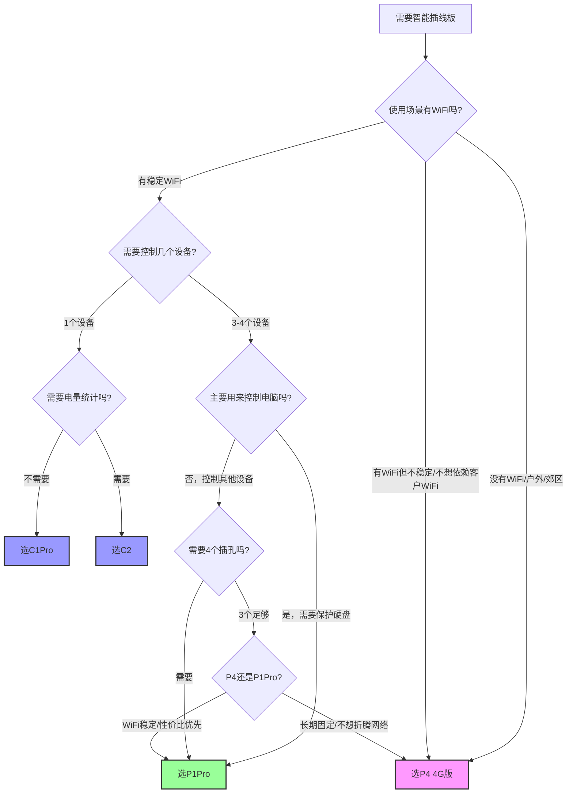

# 向日葵智能插线板P4（4G版）与P1Pro（WiFi版）对比学习教程

> **原文参考**: 
> - [向日葵智能插线板计电量版（P4）- 贝锐向日葵官网](https://sunlogin.oray.com/hardware/p4/)
> - [向日葵智能插线板新国标版（P1Pro）- 贝锐向日葵官网](https://sunlogin.oray.com/hardware/p1pro/)

## 📋 目录导航

- [一、产品概述](#一产品概述)
- [二、核心概念](#二核心概念)
- [三、P4产品深度解析（4G计电量版）](#三p4产品深度解析4g计电量版)
- [四、P1Pro产品深度解析（WiFi新国标版）](#四p1pro产品深度解析wifi新国标版)
- [五、多维度产品对比矩阵](#五多维度产品对比矩阵)
- [六、联网方式深度分析](#六联网方式深度分析)
- [七、安全设计与硬件工艺](#七安全设计与硬件工艺)
- [八、应用场景与解决方案](#八应用场景与解决方案)
- [九、用户群体与市场定位](#九用户群体与市场定位)
- [十、产品线布局与商业洞察](#十产品线布局与商业洞察)
- [十一、产品设计洞察](#十一产品设计洞察)
- [十二、常见问题FAQ](#十二常见问题faq)
- [十三、相关资源链接](#十三相关资源链接)

---

## 一、产品概述

### 1.1 品牌背景

向日葵（Sunlogin）是上海贝锐信息科技股份有限公司（Oray）旗下核心远程控制品牌，成立于2006年，以"连接无处不在"为愿景，构建了"软件+硬件+服务"的完整远程连接生态。其硬件产品线覆盖开机棒、控控、智能插座、智能插线板、智能PDU等多个品类，形成了从个人到企业的全场景远程电源管理解决方案。

### 1.2 产品线定位

向日葵智能插线板系列是面向消费级和轻商用市场的智能电源管理产品，定位介于单插孔智能插座和工业级智能PDU之间，填补了"多插孔独立分控+高性价比"的市场空白。

本次对比的两款核心产品：
- **P4（4G计电量版）**：主打"无网也能用"的4G联网方案，面向户外/分布式/无网络场景
- **P1Pro（WiFi新国标版）**：主打"温柔开关机"的室内WiFi方案，面向远程办公/家庭/小型办公场景

### 1.3 学习目标

通过本教程，您将能够：

| 学习目标 | 具体内容 |
|---------|---------|
| 理解概念 | 掌握智能插线板、独立分控、AC Recovery、4G/WiFi联网、负载类型等核心概念 |
| 熟悉产品 | 深入了解P4和P1Pro的功能差异、技术规格和设计理念 |
| 场景应用 | 掌握两款产品各自的典型应用场景和解决方案设计 |
| 选型决策 | 能够根据实际需求在P4、P1Pro及全系列产品中做出正确选型 |
| 商业洞察 | 理解向日葵"双产品战略"的逻辑，以及智能硬件的设计方法论 |

---

## 二、核心概念

### 2.1 智能插线板vs普通插线板

| 维度 | 普通插线板 | 智能插线板 |
|-----|-----------|-----------|
| 控制方式 | 手动机械开关 | APP远程控制、语音控制、定时控制 |
| 插孔控制 | 整体开关 | 独立分控，每个插孔单独开关 |
| 联网能力 | 无 | WiFi/4G/蓝牙联网，远程访问 |
| 电量监测 | 无 | 实时电流、功耗、用电量统计 |
| 安全保护 | 基础过载保护 | 多重保护、智能告警、自动断电 |
| 自动化能力 | 无 | 定时、倒计时、场景联动、断电记忆 |

### 2.2 独立分控

独立分控是指插线板的每个插孔都可以独立控制开关状态，而非所有插孔统一开关。

**价值体现**：
- 精细化管理：只控制需要的设备，不影响其他设备
- 节能：不用的设备插孔单独关闭，避免待机耗电
- 灵活命名：每个插孔可自定义设备名称（如"电脑"、"显示器"、"路由器"）
- 独立重启：单个设备死机可单独重启，无需全部断电

### 2.3 AC Recovery

AC Recovery（交流电源恢复，也叫"上电自启"、"断电再来电自动开机"）是主板BIOS的一项功能设置。

**工作原理**：
1. 在电脑BIOS中开启AC Recovery选项（不同主板名称可能为"Restore on AC Power Loss"、"Power On After Power Fail"等）
2. 当电脑因断电关机后，一旦电源恢复（插线板给插孔通电），主板会自动触发开机动作
3. 无需按机箱电源键，实现"通电即开机"

**应用价值**：这是远程开机的基础——结合智能插线板远程控制插孔通电，即可实现远程开机电脑。

### 2.4 温柔开关机（延时断电保护）

温柔开关机是P1Pro的特色功能，专为保护电脑主机设计：

**工作流程**：
1. 用户在APP发送"关机"指令
2. 插线板先向主机发送正常关机信号（配合向日葵远控软件）
3. 等待默认2分钟（让主机完成正常关机流程，时间可在APP自定义）
4. 2分钟后自动切断插孔电源

**价值**：避免直接断电造成的硬盘损坏、数据丢失、系统文件损坏等问题，延长主机使用寿命。

> 📝 **官方说明**：关机后熄灭电源的时间可自行更改，默认2分钟。倒计时和插线板定时功能会直接断电，可能损伤运行中的电脑，建议使用设备列表中的远程关机功能。

### 2.5 本地定时

本地定时是指定时任务存储在插线板本地硬件中，即使断网也能按照预设时间执行开关动作。

**对比云端定时**：
- 云端定时：依赖网络连接，断网后定时任务失效
- 本地定时：任务存储在设备本地，断网不影响执行

### 2.6 阻性/感性/容性负载

电气设备按负载特性分为三类，智能插线板对不同负载的承载能力不同：

| 负载类型 | 特性说明 | P4/P1Pro承载能力 | 典型设备 |
|---------|---------|-----------------|---------|
| **阻性负载** | 通过电阻发热做功，电流电压同相位 | 2500W | 白炽灯、电饭煲、电热水器、电暖器、电视机 |
| **感性负载** | 包含电磁线圈，启动电流大（可达额定3-5倍），功率因数低 | 850W | 风扇、空调、冰箱、洗衣机、路由器、变压器、电机类设备 |
| **容性负载** | 包含电容，通电瞬间有大电流充电，功率因数超前 | 850W | 充电宝、电瓶、开关电源、LED驱动电源、充电器 |

> **重要提示**：感性和容性负载启动时的冲击电流远大于额定电流，因此额定承载功率远低于阻性负载。实际使用时务必注意负载类型，避免超载。

### 2.7 V0级阻燃

V0级是UL94阻燃标准中的最高等级之一，表示塑料材料的阻燃性能：

**UL94阻燃等级从高到低**：
- **V0**：对样品进行两次10秒燃烧测试后，火焰在30秒内熄灭，不能有燃烧物掉下
- V1：火焰在60秒内熄灭，不能有燃烧物掉下
- V2：火焰在60秒内熄灭，可以有燃烧物掉下
- HB：最低阻燃等级，燃烧速度小于40mm/分钟

**750°C高温阻燃**：表示材料可承受750°C高温不起燃，远高于普通塑料的燃点，是用电安全的重要保障。

### 2.8 向日葵智能电源产品矩阵

| 产品型号 | 插孔数 | 联网方式 | 核心定位 | 特色功能 |
|---------|-------|---------|---------|---------|
| **C1Pro_BLE** | 1个 | WiFi | 入门单孔智能插座 | 基础远程开关、AC Recovery、定时 |
| **C2_BLE** | 1个 | WiFi | 计电量单孔智能插座 | 总电量统计、基础远程开关 |
| **P1Pro** | 4个（独立分控） | WiFi | 室内多插孔办公家用 | 温柔开关机、电量监控（历史曲线/月度耗电）、新国标五孔 |
| **P4** | 3个（独立分控） | 联通4G | 户外/无网场景商用 | 5年流量全包、独立分控、电量监控 |

---

## 三、P4产品深度解析（4G计电量版）

### 3.1 产品定位

**产品全称**：向日葵智能插线板计电量版

P4是向日葵专为无网络环境设计的智能插线板产品，核心解决"没有WiFi也想远程控制电源"的痛点，是国内消费级智能插线板中少有的4G联网方案。

**核心卖点**：4G入网，5年流量全包；三孔独立分控；实时监控设备用电；智能定时开关

### 3.2 4G入网与流量政策

P4采用联通4G网络直连基站，无需配置WiFi，插电即可联网：

| 项目 | 详情 |
|-----|------|
| 网络制式 | 联通4G LTE |
| 流量政策 | 购买即送联通5年流量全包 |
| 额外费用 | 5年内无流量费，无需办卡、无需续费 |
| 配网方式 | 蓝牙4.2本地配网（绑定设备） |
| 网络覆盖 | 联通4G信号覆盖区域即可使用 |

**5年流量全包的商业逻辑**：
- 物联网卡流量成本极低（每月几MB到几十MB足够）
- 将流量成本打包进硬件售价，用户获得"一次性付费，5年无忧"的体验
- 极大降低了用户使用门槛和决策成本，无需考虑后续资费问题

### 3.3 3孔独立分控

P4配备3个可独立控制的插孔：
- 1台P4 = 3个智能插座
- 每个插孔独立命名、独立开关、独立重启
- 配合向日葵APP统一管理

**为什么是3孔而非4孔？** 4G模块占用了更多内部空间和成本，在紧凑的插线板体积内，3孔是平衡功能、成本、体积的合理选择。

### 3.4 电量监控

P4支持实时电量监控功能：
- 手机APP实时查看电流、功耗数据
- 数据仅供参考（非计量级精度）
- 支持总电量统计
- 帮助了解设备用电情况，发现异常功耗

### 3.5 本地定时

P4支持本地定时功能：
- 定时任务存储在设备本地
- **断网仍可按原定时运行**
- 支持定时开关、倒计时开关
- 支持重复执行（每日/每周等）

这一功能对户外场景尤为重要——户外设备网络可能不稳定，但定时任务不能失效。

### 3.6 典型应用场景

| 场景类型 | 具体描述 | P4价值 |
|---------|---------|--------|
| **户外路由器/CPE** | 郊区、农村、工地、养殖场的网络设备 | 无WiFi环境，4G联网；设备死机远程重启 |
| **自助贩卖机** | 街边、商场、地铁站的自动售货机 | 分布广、无人值守；故障远程重启电源 |
| **户外广告机** | 楼宇外墙、公交站、商圈的LED广告屏 | 安装位置分散，4G信号覆盖；远程控制电源 |
| **分布式网点** | 连锁门店、快递柜、充电桩网点 | 多网点统一管理；无需每个网点配置WiFi |
| **临时展位/活动** | 展会、促销活动、临时施工现场 | 临时场景无网络；插电即用，无需布网 |
| **野外/郊区设备** | 气象监测、水文监测、安防监控 | 无WiFi覆盖区域；4G信号即可联网 |

### 3.7 技术参数表

| 参数类别 | 参数项 | 规格值 |
|---------|-------|-------|
| **基本信息** | 产品型号 | P4 |
| | 产品名称 | 向日葵智能插线板计电量版 |
| | 线长 | 1.8m |
| **电气规格** | 额定电压 | AC220V |
| | 额定电流 | 10A |
| | 最大总功率 | 2500W |
| | 插孔数量 | 3个 |
| | 独立分控 | 支持 |
| **连接方式** | 蜂窝网络 | 联通4G |
| | 蓝牙 | 蓝牙4.2（配网用） |
| | WiFi | 不支持 |
| **环境规格** | 工作温度 | -10°C ~ 40°C |
| | 阻燃等级 | V0级阻燃PC，750°C高温阻燃 |
| **功能特性** | 电量监控 | 支持（电流、功耗，数据仅供参考） |
| | 本地定时 | 支持（断网可用） |
| | AC Recovery | 支持（配合主板设置） |
| | 断电记忆 | 支持 |
| | 指示灯开关 | 支持 |
| **材质工艺** | 外壳材质 | V0级阻燃PC |
| | 导体材质 | 锡磷青铜接触片 |
| | 铜带工艺 | 一体化铜带 |
| | 插拔寿命 | 1000次拔插不松动 |
| **负载能力** | 阻性负载 | 2500W |
| | 感性负载 | 850W |
| | 容性负载 | 850W |
| **流量政策** | 运营商 | 联通 |
| | 流量时长 | 购买即送5年流量全包 |

### 3.8 温度使用提醒

P4工作温度范围为-10°C ~ 40°C，相比工业级设备（如PDU的0°C~70°C）范围较窄，更适合温和环境使用。在极端低温（低于-10°C的北方冬季户外）或极端高温环境下，需要注意防护或选用更宽温的工业级产品。

### 3.9 负载能力说明

P4的负载承载能力：
- **总功率限制2500W**，所有插孔功率之和不能超过此值
- 阻性负载（灯泡、电视、电饭煲等）可接近满载
- 感性负载（风扇、路由器、空调、冰箱等）最大850W
- 容性负载（充电宝、充电器、电瓶等）最大850W

> **安全提示**：接感性/容性负载时务必预留足够余量，因为电机类设备启动电流可达额定的3-5倍，直接插满可能导致过载保护或损坏设备。

---

## 四、P1Pro产品深度解析（WiFi新国标版）

### 4.1 产品定位

**产品全称**：向日葵智能插线板新国标版
**文档版本**：用户手册V1.1.0（2026-06-30）

P1Pro是向日葵面向室内WiFi环境的主力智能插线板产品，主打"温柔开关机"功能，专注于远程办公和家庭智能用电场景，是4插孔新国标五孔设计。

**核心卖点**：温柔开关机；4大核心安全升级；四大功能；多场景应用

### 4.2 产品规格（官方手册V1.1.0）

| 参数类别 | 参数项 | 规格值 |
|---------|-------|-------|
| **基本信息** | 产品型号 | P1Pro |
| | 产品尺寸 | 52mm × 225mm × 30mm |
| | 产品重量 | 约385g（含线） |
| | 电源线长 | 约2.1m |
| **电气规格** | 输入电压 | AC~220V |
| | 额定电流 | 10A |
| | 最大总功率 | 2500W |
| | 插孔数量 | 4个（S1/S2/S3/S4独立分控） |
| | 插孔类型 | 新国标五孔 |
| **连接方式** | WiFi | WiFi（2.4GHz）802.11b/g/n |
| | 蓝牙 | 蓝牙4.2（配网用） |
| | 蜂窝网络 | 不支持 |
| **环境规格** | 工作温度 | -10°C ~ 40°C |
| | 工作湿度 | ≤80% |
| | 阻燃等级 | V0级阻燃PC |
| **合规认证** | 执行标准 | GB 1002-2024；GB 2099.7-2024 |
| | 无线电发射型号核准 | CMIIT ID：2023DP8132 |
| | 建议使用年限 | 2年 |

### 4.3 接口与按键说明

| 部件 | 功能说明 |
|-----|---------|
| **电源输入** | AC~220V国标插头输入 |
| **复位按钮** | 短按：手动控制智能插线板断电/通电；长按5秒：重置设备（红灯闪一下后蓝灯闪烁即重置成功） |
| **指示灯** | 显示设备当前状态（蓝灯闪烁表示待配网） |
| **4个插孔** | S1/S2/S3/S4四个插孔，支持独立分控、独立命名、独立绑定主机 |

### 4.4 WiFi配网要求（官方完整清单）

添加P1Pro前需确保满足以下WiFi条件：

| 要求项 | 具体说明 |
|-------|---------|
| ✅ WiFi频段 | 仅支持2.4GHz WiFi，**不支持5GHz** |
| ✅ 无线模式 | 不支持11n only模式，需开启b/g/n兼容 |
| ✅ SSID广播 | 不可隐藏WiFi，需开启SSID广播 |
| ✅ 加密类型 | WPA2-PSK加密，认证类型为AES或两者自动 |
| ✅ 网络连通性 | WiFi需能连接互联网正常上网 |
| ⚠️ 修改WiFi | 修改WiFi名称或密码后需重置设备重新配网 |
| ⚠️ 手机权限 | 首次配网需开启手机蓝牙和定位权限 |
| ❌ 不支持 | 企业级认证、网页认证、需要验证码的WiFi（如酒店/校园网） |

**配网流程**：
1. 手机开启蓝牙、定位权限，连接2.4G WiFi
2. P1Pro通电，确认指示灯蓝灯闪烁
3. APP【设备】→【+】→【添加智能硬件】
4. 蓝牙搜索到P1Pro后选择添加（搜索不到可手动选择开机插线板P1Pro）
5. 自动识别WiFi名称，输入密码后等待配网成功
6. 添加成功后在【设备】-【全部设备】中可见

### 4.5 主机绑定步骤

1. P1Pro添加成功后，在控制端App【设备】-【全部设备】找到智能插线板
2. 将主机电源接入P1Pro的一个插孔（如S4）
3. 点击对应插孔（如S4）的"绑定主机"
4. 选择指定主机进行绑定
> 注意：若未找到主机，需在需开机的电脑上安装向日葵客户端且登录相同账号

### 4.6 WiFi联网定位

P1Pro采用WiFi联网方式：
- 适用于已有WiFi覆盖的室内环境（家庭、办公室、机房等）
- 配网简单，蓝牙4.2辅助配网
- 无需额外流量费用，使用现有家庭/办公网络
- 依赖WiFi路由器，WiFi断网则远程功能受限（本地定时仍可用）

### 4.7 温柔开关机（延时断电保护）

这是P1Pro的标志性功能，专为电脑用户设计：

**完整工作流程**：
1. 用户在向日葵APP发送关机指令
2. 插线板通过向日葵远控软件向电脑发送正常关机信号
3. 电脑执行系统关机流程，保存数据、关闭程序
4. 插线板等待默认2分钟（确保主机完全关闭，等待时间可在APP自定义设置）
5. 2分钟后自动切断对应插孔电源

**设置关机断电延时**：
在插线板详情页点击"绑定设备"图标 → 可设置"关机后关闭插线板电源"时间（默认2分钟），支持自定义调整。

**价值**：
- 保护硬盘：避免强制断电造成的磁头损坏、坏道
- 保护数据：防止正在写入的数据丢失、系统文件损坏
- 延长寿命：减少非正常关机对电子元件的冲击
- 节能：关机后彻底断电，消除待机功耗

> ⚠️ **重要提醒**：倒计时开关和插线板定时功能会直接切断电源，属于强制断电，可能损伤运行中的电脑，如需远程关闭设备，建议前往【设备】列表在对应设备功能列表中进行远程温柔关机。

### 4.8 AC Recovery远程开机

P1Pro支持配合主板AC Recovery实现远程开机（需BIOS开启"Restore AC Power Loss"等选项为Power On，以华硕主板为例：Advanced → APM configuration → Restore AC Power Loss → Power On）：

**远程办公完整工作流**：
1. 提前在电脑BIOS中开启AC Recovery（上电自启）
2. 人在外面时，在APP点击对应插孔"开机"
3. 插线板给插孔通电，主板检测到电源恢复自动开机
4. 电脑启动后，向日葵远控客户端自动上线
5. 通过向日葵远控软件远程连接电脑桌面，开始办公
6. 工作结束后，发送"温柔关机"指令
7. 电脑正常关机，默认2分钟后自动断电（时间可自定义）

### 4.9 4孔独立分控

P1Pro配备4个新国标五孔插孔（S1/S2/S3/S4），全部支持独立分控：
- 1台P1Pro = 4个智能插座
- 新国标五孔设计（兼容两扁插、两圆插、三扁插）
- 每个插孔独立命名、独立开关、独立重启、独立绑定主机
- 4个插孔满足多数桌面/办公场景需求（电脑主机+显示器+路由器+音箱/台灯/摄像头）

### 4.10 4大核心安全升级

P1Pro相比前代产品在安全方面做了4项重点升级：

| 安全升级 | 具体内容 | 防护目标 |
|---------|---------|---------|
| **超功率自动断电** | 总功率超过额定值时自动切断电源 | 防止过载引发火灾 |
| **耐弯折电线** | 电源线采用耐弯折设计 | 延长线材寿命，避免内部断线造成短路 |
| **V0级阻燃PC外壳** | 外壳采用V0级阻燃PC材料，750°C高温阻燃 | 即使内部故障也不易起火蔓延 |
| **一体化铜带+磷青铜接触片** | 内部采用一体化铜带工艺，锡磷青铜接触片 | 减少接触电阻、降低发热、保证可靠接触 |

**安全警告（官方手册）**：
- ⚠️ 多个插头同时插入使用时，总功率不得超过最大允许功率（2500W）
- ⚠️ 请勿盘绕使用延长线插座（盘绕时实际承载电流低于额定值）
- ⚠️ **禁止用于电动自行车充电**

### 4.11 四大核心功能

P1Pro的四大核心功能：

| 功能 | 说明 |
|-----|------|
| **四孔独立分控** | 4个新国标五孔插孔（S1-S4），每个独立开关、独立命名、独立绑定主机、独立重启 |
| **远程一键开机（温柔关机）** | 配合AC Recovery远程开机，关机时默认2分钟延时温柔断电保护主机（延时可自定义） |
| **实时电量监控** | 支持今日用电量、当前功耗、今日开关次数、用电统计（月/周/日/小时维度）、用电日志 |
| **智能定时开关（本地定时）** | 支持两种定时模式：插线板定时（直接开/关电源）+ 设备定时（配合温柔关机），断网仍可正常执行 |

**电量统计功能详情**：
- **电量统计首页**：展示今日用电量、当前功耗、今日开关次数
- **用电统计**：支持月、周、日、小时为单位查看电力数据和历史曲线
- **用电日志**：记录智能插线板启动和关闭的操作历史

**两种定时模式区别**：
| 定时类型 | 说明 | 是否伤电脑 |
|---------|------|-----------|
| **插线板定时** | 设置插线板在指定时间直接开/关电源 | ⚠️ 关闭为强制断电，可能损伤运行中的电脑 |
| **设备定时** | 设置主机设备在指定时间开启（配合AC Recovery），关机走温柔关机流程 | ✅ 安全，保护电脑 |

> ⚠️ 官方提示：使用插线板定时或倒计时功能关闭电源为直接断电，强制断电可能对运行中的电脑造成伤害。如需远程关闭设备，建议前往【设备】列表在对应设备功能列表中进行远程温柔关机。

**倒计时开关**：设定倒计时后开启或关闭。同样注意：倒计时关闭为直接断电，不建议用于运行中的电脑。

### 4.12 典型应用场景

| 场景类型 | 具体描述 | P1Pro价值 |
|---------|---------|--------|
| **远程办公** | 家里电脑忘关/在公司需要家里电脑资料 | 远程开机→远控→温柔关机→2分钟断电，完整工作流 |
| **游戏预热/下载** | 下班路上提前开电脑下载游戏/更新 | 回家前提前开机下载，到家直接玩 |
| **远程鱼缸喂食/宠物** | 出差时控制鱼缸灯光、喂食器电源 | 定时开关，远程监控设备状态 |
| **家庭智能用电** | 家里各种电器智能控制 | 定时开关、离家断电、远程控制 |
| **小型办公室** | SOHO、小型工作室IT设备管理 | 统一管理多台设备电源，远程重启死机设备 |
| **实验室/测试** | 测试设备定时开关、远程重启、自动化测试供电控制 | 本地定时断网可用，4插孔独立分控多台测试设备，电量统计辅助判断设备状态 |
| **摄像头自动化测试** | 控制网络摄像头电源进行断电重启、冷启动测试 | S1-S4独立分控，可同时测试多台摄像头，远程控制+定时 |

### 4.13 技术参数表（官方V1.1.0）

| 参数类别 | 参数项 | 规格值 |
|---------|-------|-------|
| **基本信息** | 产品型号 | P1Pro |
| | 产品名称 | 向日葵智能插线板新国标版 |
| | 产品尺寸 | 52mm × 225mm × 30mm |
| | 产品重量 | 约385g（含线） |
| | 线长 | 约2.1m |
| **电气规格** | 额定电压 | AC~220V |
| | 额定电流 | 10A |
| | 最大总功率 | 2500W |
| | 插孔数量 | 4个（S1/S2/S3/S4） |
| | 插孔类型 | 新国标五孔 |
| | 独立分控 | 支持（每个插孔独立） |
| **连接方式** | WiFi | WiFi（2.4GHz）802.11b/g/n |
| | 蓝牙 | 蓝牙4.2（配网用） |
| | 蜂窝网络 | 不支持 |
| **环境规格** | 工作温度 | -10°C ~ 40°C |
| | 工作湿度 | ≤80% |
| | 阻燃等级 | V0级阻燃PC |
| **功能特性** | 温柔开关机 | 支持（默认2分钟延时断电，时间可自定义） |
| | AC Recovery | 支持（配合主板BIOS设置） |
| | 电量监控 | 支持（今日用电量、当前功耗、开关次数、月/周/日/小时统计、用电日志） |
| | 本地定时 | 支持（插线板定时+设备定时，断网可用） |
| | 倒计时开关 | 支持 |
| | 断电记忆 | 支持 |
| | 指示灯开关 | 支持 |
| **安全升级** | 超功率自动断电 | 支持 |
| | 耐弯折电线 | 支持 |
| **材质工艺** | 外壳材质 | V0级阻燃PC |
| | 导体材质 | 锡磷青铜 |
| | 铜带工艺 | 一体化铜带 |
| **合规认证** | 执行标准 | GB 1002-2024；GB 2099.7-2024 |
| | 无线电核准 | CMIIT ID：2023DP8132 |
| | 建议使用年限 | 2年 |
| **负载能力** | 阻性负载 | 2500W |
| | 感性负载 | 850W |
| | 容性负载 | 850W |

### 4.14 远程办公完整工作流详解

P1Pro最核心的场景就是远程办公，其完整工作流如下：

```
【准备阶段】
1. 将电脑主机插在P1Pro的一个插孔上（如S1，命名为"办公电脑"）
2. 显示器、台灯、摄像头等外设插在其他插孔（S2-S4可选）
3. 进入电脑BIOS设置，开启"AC Recovery"或"Restore on AC Power Loss"选项为"Power On"
   （华硕主板：Advanced → APM configuration → Restore AC Power Loss → Power On）
4. 电脑安装向日葵远控客户端并设置开机自启、自动登录
5. 在向日葵APP中绑定P1Pro，绑定主机到对应插孔
6. 测试远程开关功能确认正常

【远程办公流程】
1. 人在外面需要使用家里/办公室电脑
2. 打开向日葵APP，找到绑定的主机（对应插孔）
3. 点击"开机"，插孔通电
4. 主板检测到电源恢复，自动触发开机（AC Recovery）
5. 等待1-3分钟电脑启动完成，向日葵客户端上线
6. 在APP中点击"远程控制"，进入电脑桌面
7. 正常办公：操作文件、运行程序、远程协作、观看摄像头
8. 工作结束，关闭所有文档和程序
9. 在APP中点击"温柔关机"
10. P1Pro发送关机信号 → 电脑正常关机 → 等待默认2分钟（可自定义）
11. 延时结束后P1Pro自动切断对应插孔电源
12. 完成，安全节能
```

### 4.15 绑定设备管理功能

点击插线板详情页"绑定设备"图标，可进行以下操作：
1. **解除绑定**：解除智能插线板和当前设备的绑定，可重新绑定其他设备
2. **绑定设备**：选择账号下已有的设备进行绑定
3. **关机后关闭插线板电源延时设置**：设置关闭远程设备后插线板电源关闭的时间（默认2分钟），实现不损伤设备且省电的目的

### 4.16 常见问题（官方FAQ）

**问题1：绑定插线板时App提示网络超时**
- 如果连接的不是2.4G网络会出现此提示，请更换2.4G WiFi后重试

**问题2：WiFi自检排查清单**
1. 仅支持2.4频段的WiFi，不支持5GHz
2. 无线模式不支持11n only，需开启b/g/n兼容
3. 不可隐藏WiFi，需开启SSID广播
4. WiFi加密类型为WPA2-PSK、认证类型为AES或两者都设为自动
5. 若修改WiFi名称或密码，会导致插线板无法连接，需要重置设备
   - 重置步骤：通电后长按电源键，期间红灯闪一下，待指示灯变成蓝灯闪烁即为重置成功
6. 首次绑定配置网络若无法正常获取WiFi名称，请先打开手机定位权限
7. WiFi需要能够连接到互联网正常上网

### 4.17 负载能力说明

P1Pro负载能力：
- **总功率限制2500W**，4个插孔总功率之和不能超过此值
- 阻性负载2500W，感性/容性负载850W
- 注意：电脑主机属于开关电源类（容性+感性混合），单台主机通常300-600W，留足余量可接1-2台主机加显示器、外设、摄像头等
- **禁止用于电动自行车充电**
- 不要盘绕使用电源线，盘绕时实际承载电流会低于额定值

---

## 五、多维度产品对比矩阵

### 5.1 核心规格对比表（16维度）

| 对比维度 | P4（4G计电量版） | P1Pro（WiFi新国标版） |
|---------|-----------------|---------------------|
| **型号** | P4 | P1Pro新国标版 |
| **产品定位** | 户外/无网场景商用 | 室内WiFi家用/办公 |
| **插孔数** | 3个 | 4个 |
| **插孔类型** | 国标插孔 | 新国标五孔 |
| **联网方式** | 联通4G直连基站 | WiFi 2.4GHz |
| **流量政策** | 购买即送5年联通流量全包，后续无费用 | 使用现有WiFi，无流量费但需要WiFi网络 |
| **电源线长** | 1.8m | 2.1m |
| **核心卖点** | 4G无网也能用、5年流量、户外部署 | 温柔开关机、延时断电保护、远程办公 |
| **安全特性** | V0阻燃、一体化铜带、锡磷青铜 | 超功率自动断电、耐弯折电线、V0阻燃、一体化铜带、锡磷青铜 |
| **电量统计** | 实时电流、功耗（数据仅供参考） | 实时电流功耗、历史曲线、月度耗电统计 |
| **AC Recovery** | 支持 | 支持 |
| **温柔开关机** | 不支持 | 支持（默认2分钟延时断电，时间可自定义） |
| **本地定时** | 支持（断网可用） | 支持（断网可用） |
| **工作温度** | -10°C ~ 40°C | -10°C ~ 40°C |
| **典型场景** | 户外广告机、自助贩卖机、郊区设备、分布式网点 | 远程办公、游戏预热、鱼缸宠物、家庭智能用电、小型办公室 |
| **目标用户** | 商用客户、工程商、有户外设备部署需求的用户 | 远程办公人群、数码爱好者、家庭用户、小型团队 |

### 5.2 功能支持对比表

| 功能项 | C1Pro_BLE | C2_BLE | P1Pro | P4 |
|-------|-----------|--------|-------|-----|
| **插孔数量** | 1 | 1 | 4 | 3 |
| **独立分控** | -（单孔） | -（单孔） | ✅ 4孔独立 | ✅ 3孔独立 |
| **联网方式** | WiFi | WiFi | WiFi | 联通4G |
| **AC Recovery** | ✅ | ✅ | ✅ | ✅ |
| **倒计时/定时** | ✅ | ✅ | ✅ | ✅ |
| **电量统计** | ❌ | ✅（仅总电量） | ✅（实时+历史+月度） | ✅（实时，数据仅供参考） |
| **断电记忆** | ✅ | ✅ | ✅ | ✅ |
| **用电日志** | ✅ | ✅ | ✅ | ✅ |
| **指示灯开关** | ✅ | ✅ | ✅ | ✅ |
| **温柔开关机** | ❌ | ❌ | ✅ | ❌ |
| **本地定时断网可用** | ✅ | ✅ | ✅ | ✅ |
| **流量政策** | -（用WiFi） | -（用WiFi） | -（用WiFi） | ✅ 5年流量全包 |
| **新国标五孔** | ❌（单孔） | ❌（单孔） | ✅ | ❌ |

### 5.3 全系列产品对比与选型建议

| 产品 | 价格定位 | 最适合场景 | 不适合场景 |
|-----|---------|-----------|-----------|
| **C1Pro_BLE** | 入门级，最便宜 | 只需要控制1个设备，不需要电量统计，预算有限 | 需要多插孔、需要电量统计 |
| **C2_BLE** | 入门级，略高于C1Pro | 单插孔、需要看总电量 | 多设备同时控制 |
| **P1Pro** | 中端，主力款 | 室内WiFi环境、远程办公、家用、多插孔需求、需要温柔开关机 | 无WiFi环境、户外部署 |
| **P4** | 中端，比P1Pro略高（含5年流量） | 无WiFi的户外/郊区/分布式场景、不想配置WiFi、临时部署 | 室内WiFi环境、需要4个插孔、需要温柔开关机 |

### 5.4 选型决策指南

**第一步：判断使用场景是否有WiFi**
- 完全没有WiFi，也不可能装WiFi → 选P4（4G版）
- 有稳定WiFi可用 → 进入第二步

**第二步：判断插孔数量需求**
- 只需要控制1个设备，预算有限 → 选C1Pro/C2（看是否要电量）
- 需要控制3-4个设备 → 进入第三步

**第三步：判断是否需要"温柔开关机"功能**
- 主要用来控制电脑，需要保护硬盘、正常关机 → 选P1Pro
- 控制路由器、广告机、灯具等不需要温柔关机的设备 → P1Pro/P4均可（看场景）

**第四步：特殊需求判断**
- 需要历史曲线和月度耗电统计 → 选P1Pro
- 长期户外无人值守、不想考虑网络问题 → 选P4
- 分布式多点位部署、统一管理 → 选P4（无需逐个配WiFi）

---

## 六、联网方式深度分析

### 6.1 4G联网（P4）优劣势与适用场景

**4G联网优势**：
1. **不依赖WiFi**：插电即用，不需要布置路由器、不需要配置WiFi密码
2. **部署灵活**：只要有联通4G信号的地方就能用，不受网线、WiFi覆盖限制
3. **网络稳定**：运营商基站网络可靠性高，比家用WiFi更稳定（不会出现路由器死机问题）
4. **一次性付费**：5年流量全包，无需后续续费、无需办卡、无需充值
5. **适合大规模部署**：分布式网点批量部署，无需逐个配置WiFi，统一管理
6. **适合临时场景**：展会、活动、工地等临时场景，用完即走，无需布设网络

**4G联网劣势**：
1. **依赖运营商信号**：联通4G信号差的地方（如地下室、偏远山区、屏蔽强的室内）无法使用
2. **只能用联通网络**：电信/移动用户无法选择自家运营商
3. **成本略高**：4G模块和流量成本使得P4硬件价格高于同规格WiFi版本
4. **无法访问局域网**：4G是公网，不能像WiFi一样访问局域网内的其他设备

**4G适用场景**：
- ✅ 户外设备（广告机、监控、路由器）
- ✅ 自助终端（贩卖机、快递柜、充电桩）
- ✅ 分布式网点（连锁门店、工地、养殖场）
- ✅ 临时场景（展会、活动、应急部署）
- ✅ 郊区/农村（无宽带、WiFi不稳定）
- ❌ 家庭室内（有WiFi，没必要用4G）
- ❌ 联通信号盲区（无法联网）

### 6.2 WiFi联网（P1Pro）优劣势与适用场景

**WiFi联网优势**：
1. **无流量限制**：使用家庭/办公已有WiFi，不需要额外流量费用
2. **带宽更高**：WiFi带宽远高于4G物联网卡，传输数据更快
3. **局域网访问**：同一局域网下可直接控制，不依赖外网
4. **成本更低**：WiFi模块成本低，硬件价格更亲民
5. **运营商无关**：不管用哪家宽带都能使用
6. **配网生态成熟**：蓝牙配网、扫码配网等体验已很成熟

**WiFi联网劣势**：
1. **依赖WiFi环境**：必须有可用的WiFi网络，且知道密码
2. **WiFi可能不稳定**：路由器死机、WiFi信号弱、断网都会影响使用
3. **需要配网**：换路由器、改密码后需要重新配网
4. **户外部署困难**：户外通常没有WiFi，难以部署
5. **批量部署麻烦**：每个设备都要配WiFi，大量部署时工作量大

**WiFi适用场景**：
- ✅ 家庭室内（已有WiFi）
- ✅ 办公室、SOHO（稳定WiFi环境）
- ✅ 机房、门店（有固定网络）
- ✅ 个人远程办公（固定场所）
- ❌ 无WiFi的户外场景
- ❌ 大量分布式点位部署
- ❌ WiFi信号差的环境

### 6.3 双产品战略分析：室内+户外场景全覆盖

向日葵同时推出P1Pro（WiFi）和P4（4G），是典型的"场景互补"双产品战略：

**战略逻辑**：
1. **全覆盖**：用两款产品覆盖"室内有WiFi"和"户外无WiFi"两大场景，不给竞争对手留死角
2. **差异化定价**：4G版本含5年流量，定价略高；WiFi版本性价比更高，精准匹配不同支付意愿
3. **降低用户选择成本**：用户不需要纠结"选WiFi还是4G"——看有没有WiFi就知道选哪款，决策路径清晰
4. **共用核心体验**：两款产品APP界面、管理方式、核心功能（独立分控、本地定时、AC Recovery）基本一致，用户买了一款，另一款不用重新学习
5. **渠道差异化**：P1Pro走消费电子渠道（京东、天猫、线下零售），P4走商用/工程渠道（行业客户、集成商、企业采购）

**为什么不是"二合一"产品？**
- 二合一（WiFi+4G）会增加硬件成本，导致价格上升，对只需要WiFi的用户不公平
- 二合一产品配置复杂，增加用户使用门槛
- 场景差异足够大，分开做两款产品更精准、性价比更高

这一战略本质是**"细分场景、精准定位、降低用户决策成本"**，是智能硬件产品矩阵设计的经典思路。

### 6.4 IoT设备联网选型启示

从P4和P1Pro的联网方式选择，可以总结IoT设备联网选型的通用原则：

| 选型维度 | 优先选WiFi | 优先选4G/蜂窝 |
|---------|-----------|-------------|
| **部署环境** | 室内、固定场所、有WiFi覆盖 | 户外、移动场景、无WiFi环境 |
| **设备移动性** | 固定不移动 | 可能移动、分散部署 |
| **部署规模** | 小数量（<10台）、集中部署 | 大数量、分布式、跨地域 |
| **网络自主权** | 自己能控制WiFi路由器 | 无法控制现场网络、不想依赖客户网络 |
| **数据流量** | 大数据量传输（视频、大文件） | 小数据量（开关指令、传感器数据） |
| **成本敏感度** | 对价格敏感、不想后续付费 | 愿意为便利性付费、一次性买断更省心 |
| **可靠性要求** | 可接受偶发WiFi断网 | 需要高可靠网络、不能因为路由器死机失控 |

> **IoT联网选型黄金法则**：能用WiFi就用WiFi（成本低、体验好）；WiFi用不了、部署麻烦、可靠性要求高时，果断上4G；不要为了"二合一"牺牲成本和体验。

---

## 七、安全设计与硬件工艺

用电安全是插线板产品的底线，P4和P1Pro在安全设计上既有共通点，也有各自的特色。

### 7.1 共同安全特性

两款产品共享以下安全设计：

| 安全特性 | 技术说明 | 安全价值 |
|---------|---------|---------|
| **V0级阻燃PC外壳** | 外壳材料达到UL94 V0阻燃等级，可承受750°C高温不起燃 | 即使内部出现故障打火，外壳也不易起火蔓延，给用户逃生和处置时间 |
| **一体化铜带工艺** | 内部导电采用一体化铜带而非导线焊接，减少接点数量 | 减少接触电阻和发热点，降低因接触不良导致的打火、过热风险 |
| **锡磷青铜接触片** | 插孔弹片采用锡磷青铜材质，弹性好、耐磨、抗疲劳 | 保证插头与插座接触紧密，减少接触电阻和发热，同时保证插拔手感 |
| **1000次拔插不松动** | 经过1000次插拔测试后接触片仍能保持足够夹持力 | 长期使用后不会出现插头松动、接触不良的问题，避免因接触不良引发安全事故 |
| **10A/2500W额定限制** | 总电流不超过10A，总功率不超过2500W | 防止整体过载引发线路过热、火灾 |

### 7.2 P1Pro专属安全特性

P1Pro在基础安全上额外增加了两项安全升级：

| 安全特性 | 技术说明 | 安全价值 |
|---------|---------|---------|
| **超功率自动断电** | 内置功率检测电路，当总功率超过额定值时自动切断电源 | 主动式过载保护，不是被动烧保险丝，反应更快，可自动恢复或提示用户 |
| **耐弯折电线** | 电源线采用耐弯折设计和材质 | 插线板电线经常被弯折、拉扯，普通线材容易内部断线造成短路，耐弯折设计大幅延长线材寿命 |

### 7.3 安全设计理念

向日葵智能插线板的安全设计遵循三层防护理念：

**第一层：源头防火——材料阻燃**
- 采用V0级最高等级阻燃PC材料
- 750°C高温阻燃，远超普通塑料燃点
- 即使内部故障，也从材料层面阻止火势蔓延

**第二层：过程防护——电气安全**
- 一体化铜带减少发热点
- 锡磷青铜保证接触可靠
- 超功率自动断电（P1Pro）
- 额定功率限制，防止过载

**第三层：长期可靠——工艺保障**
- 1000次插拔不松动（消费级标准，工业级为5000次）
- 耐弯折电线（P1Pro）
- 工作温度-10°C~40°C，适应常规环境

> **安全设计洞察**：插线板安全不是靠某一项"黑科技"，而是靠材料、工艺、电气设计的多重冗余防护。在用户看不到的地方（内部铜带、接触片材质、阻燃等级）下功夫，才是真正对用户安全负责。

### 7.4 用电安全提示

即使有多重安全保护，使用时仍需注意：

1. **不超负载**：总功率不超过2500W，感性/容性负载不超过850W，留20%余量更安全
2. **注意负载类型**：空调、冰箱、电机等感性负载不要接太多，启动电流大
3. **避免串接**：不要串接其他插线板（"排插接排插"），避免接点过多发热
4. **远离水源**：不要放在潮湿、有水的地方（卫生间、浴室、阳台露天处）
5. **注意环境温度**：不要在超过-10°C~40°C范围的环境使用，不要覆盖、遮挡插线板影响散热
6. **定期检查**：检查线材是否破损、插头是否松动、插线板是否异常发热
7. **不用时断电**：长期不使用的设备或离家时，建议关闭对应插孔或拔掉插头

---

## 八、应用场景与解决方案

### 8.1 P4专属场景

#### 场景1：户外广告机/显示屏
**痛点**：
- 户外广告机分布在商圈、楼宇外墙、公交站，位置分散
- 很多位置没有WiFi，拉网线成本高
- 设备死机需要派人现场重启，运维成本高
- 广告屏幕不能及时重启影响广告投放

**P4解决方案**：
- 广告机电源接P4，安装位置只要有联通4G信号即可
- 5年流量全包，无需单独办卡、缴费
- 设备死机/黑屏时，远程在APP重启电源
- 设置定时任务：凌晨自动重启一次，预防死机
- 多台广告机统一在一个账号下管理

#### 场景2：自助贩卖机/自助终端
**痛点**：
- 自助贩卖机、快递柜、充电桩遍布大街小巷
- 无人值守，设备死机直接影响营业
- 网点分散，派人现场重启效率低、成本高
- 每个网点装WiFi配置和维护成本高

**P4解决方案**：
- 每台自助设备配一台P4
- 插电即联网，不需要现场配置WiFi
- 设备离线告警后远程重启电源，快速恢复营业
- 运营人员在办公室就能管理全城所有网点
- 5年流量免维护，不用操心流量续费问题

#### 场景3：郊区/野外设备
**痛点**：
- 郊区养殖场、农村基站、野外气象/水文监测设备
- 没有宽带、没有WiFi，甚至没人常驻
- 设备故障需要跑几十公里去重启
- 网络环境不稳定，WiFi容易断

**P4解决方案**：
- 利用联通4G覆盖，只要有手机信号就能联网
- 本地定时功能断网也能执行，保证基础自动化
- 设备故障远程重启，无需跑现场
- 适合路由器、监控、传感器、养殖设备等

#### 场景4：临时展位/活动现场
**痛点**：
- 展会、促销活动、临时发布会、演唱会
- 现场只有供电，没有网络，拉专线成本高、周期长
- 活动只有几天，装宽带不划算
- 需要控制灯光、屏幕、设备电源

**P4解决方案**：
- P4插电即用，不需要配置网络，5年流量首日用了以后还能用
- 远程控制灯光、展示屏、互动设备电源
- 定时开关设备，活动开始前自动上电，结束后自动断电
- 活动结束收回，下次活动继续使用

#### 场景5：分布式连锁网点
**痛点**：
- 连锁便利店、餐饮门店、社区服务点
- 每个门店设备不多（路由器、POS机、监控NVR）
- 门店没有专业IT人员，设备故障需要总部派人
- 每个门店配置和维护WiFi麻烦

**P4解决方案**：
- 每个门店部署1台P4，管理门店IT设备电源
- 总部IT统一管理所有门店设备
- 路由器死机、POS机故障直接远程重启
- 不需要依赖门店WiFi，P4自己联网更可靠

### 8.2 P1Pro专属场景

#### 场景1：远程办公完整解决方案
**痛点**：
- 下班回家发现需要办公室电脑里的文件
- 周末公司有事需要处理，不想跑一趟
- 电脑死机了无法远程，必须到现场
- 直接远程断电伤硬盘

**P1Pro解决方案**：
- 电脑主机接P1Pro，BIOS开启AC Recovery
- 需要时远程开机，向日葵远控桌面
- 工作结束温柔关机，3分钟自动断电
- 不用跑公司，随时随地访问办公电脑
- 保护硬盘，不用担心强制断电损坏

#### 场景2：游戏预热/提前下载
**痛点**：
- 下班想玩游戏，但是游戏几十GB更新要下几小时
- 到家再开电脑下载，玩不了多久就要睡觉
- 挂机下载费电，电脑开一天不安全

**P1Pro解决方案**：
- 下班路上用手机APP远程开机
- Steam/Epic自动开始下载游戏更新
- 到家电脑已经下载完，直接开玩
- 不玩了远程温柔关机断电
- 不用电脑全天开机，省电安全

#### 场景3：鱼缸/宠物远程照顾
**痛点**：
- 出差/旅游没人照顾鱼缸、宠物
- 鱼缸灯光、过滤、加热棒需要定时控制
- 喂食器需要定时供电
- 担心设备故障出问题

**P1Pro解决方案**：
- 鱼缸灯光、过滤、喂食器分别接P1Pro不同插孔
- 设置定时任务：灯光按时开关、喂食器定时给电
- 远程随时查看设备状态，发现问题及时重启
- 出差也能照顾好鱼缸和宠物

#### 场景4：家庭智能用电
**痛点**：
- 出门总担心电器没关
- 待机功耗累积起来浪费电
- 热水器、电暖器想回家前提前开
- 小孩在家乱按插线板不安全

**P1Pro解决方案**：
- 离家模式：一键关闭所有非必要设备
- 定时控制：热水器下班前自动开，回家就有热水
- 远程查看：随时看哪些设备开着，远程关闭
- 指示灯可关：夜间不影响睡眠
- 4个插孔满足电视、机顶盒、路由器、台灯等客厅/卧室需求

#### 场景5：小型办公室/SOHO
**痛点**：
- 小型工作室、初创团队，没有专职IT
- 路由器、交换机、NAS、打印机死机了没人处理
- 加班晚了走得急忘关设备
- 周末需要访问办公室电脑拿资料

**P1Pro解决方案**：
- 所有IT设备接P1Pro，按设备命名
- 设备死机远程重启，不用跑办公室
- 设置定时：非工作时间自动关闭非必要设备
- 周末在家远程开机访问办公资料
- 成本低，一个P1Pro就能管理4台核心设备

### 8.3 通用场景

以下场景两款产品均可使用，根据网络环境选择：
- 路由器/CPE远程重启（有WiFi选P1Pro，无WiFi选P4）
- 监控设备/NVR远程管理
- 小型NAS/家庭服务器电源控制
- 实验室测试设备定时开关
- 老旧设备"智能化改造"（普通电器变智能）

### 8.4 场景选择决策树（Mermaid流程图）



---

## 九、用户群体与市场定位

### 9.1 P4用户画像

P4（4G版）主要面向商用和工程类用户：

| 用户类型 | 典型特征 | 核心需求 |
|---------|---------|---------|
| **1. 自助设备运营商** | 运营自助贩卖机、快递柜、充电桩，设备分布在全城 | 无人值守、远程重启、不依赖现场网络、批量管理 |
| **2. 广告传媒公司** | 运营户外广告机、数字标牌、LED屏 | 远程电源管理、故障快速恢复、无需拉网线 |
| **3. 安防/系统集成商** | 为客户安装监控、安防系统，需要提供售后维护 | 减少现场维护次数、远程排障、提升客户满意度 |
| **4. 户外工程/农业养殖** | 郊区养殖场、工地、野外监测站点 | 无宽带环境、设备远程控制、高可靠性 |
| **5. 连锁门店总部IT** | 管理几十上百家连锁门店的IT设备 | 集中管理、远程维护、减少差旅、不依赖门店网络 |

**P4用户共同特征**：
- 设备部署在无人值守环境
- 现场没有可靠WiFi或不愿意依赖现场网络
- 设备分散，现场运维成本高
- 愿意为便利性和可靠性一次性付费
- 更关注"能不能长期稳定工作"，而不是价格差几百块

### 9.2 P1Pro用户画像

P1Pro（WiFi版）主要面向消费级和办公用户：

| 用户类型 | 典型特征 | 核心需求 |
|---------|---------|---------|
| **1. 远程办公人群** | 经常需要在家访问公司电脑、或在公司访问家里电脑 | 远程开机、温柔关机、远控桌面、数据安全 |
| **2. 游戏玩家/数码爱好者** | 玩PC游戏，有提前下载更新、远程控制需求 | 游戏预热下载、多设备控制、折腾数码设备 |
| **3. 家庭用户/智能家居爱好者** | 想实现家电智能化控制，关注节能和安全 | 远程控制家电、定时开关、离家断电、电量统计 |
| **4. 鱼缸/宠物爱好者** | 养鱼、养宠物，出差需要照顾 | 设备定时控制、远程状态查看、异常重启 |
| **5. SOHO/小型团队** | 10人以下小团队，有NAS、路由器、几台办公电脑 | 简单IT设备管理、远程重启、无人值守 |
| **6. 技术极客/个人开发者** | 家里有NAS、软路由、服务器、开发板等设备 | 多设备独立控制、折腾自动化、高性价比 |

**P1Pro用户共同特征**：
- 使用环境在室内，有稳定WiFi
- 主要控制电脑、数码设备、家电等
- 对价格相对敏感，追求性价比
- 关注功能体验，尤其是远程办公场景
- 通过电商平台（京东、天猫）直接购买

### 9.3 市场定位差异：P4商用vs P1Pro消费办公

| 定位维度 | P4（4G版） | P1Pro（WiFi版） |
|---------|-----------|----------------|
| **市场层级** | 商用级/轻工业级 | 消费级/办公级 |
| **核心价值** | 无网可用、免运维、高可靠 | 温柔保护、功能丰富、高性价比 |
| **销售渠道** | 行业销售、企业采购、系统集成商、京东天猫企业购 | 电商零售、消费电子渠道、京东天猫自营 |
| **客单价** | 略高（含5年流量成本） | 亲民，走量 |
| **营销重点** | 5年流量全包、户外场景、免布线 | 远程办公、温柔开关机、保护硬盘 |
| **决策周期** | 较长（企业采购、项目评估） | 短（个人购买，几百块即时决策） |
| **复购特征** | 批量复购（按项目采购几十上百台） | 个人购买1-2台，口碑传播带动 |
| **售后重点** | 批量部署支持、稳定性、长期供货 | 使用指导、教程内容、社区运营 |

### 9.4 用户决策因素排序

用户在P4和P1Pro之间选择时，决策因素按重要性排序：

| 排序 | 决策因素 | 权重 | 说明 |
|-----|---------|------|------|
| **1** | **使用场景是否有WiFi** | ★★★★★ | 这是第一道分界线，无WiFi直接选P4 |
| **2** | **需要控制的插孔数量** | ★★★★☆ | 4孔选P1Pro，3孔两款都可以，1孔选C系列 |
| **3** | **是否需要温柔开关机（AC Recovery）** | ★★★★☆ | 控制电脑需要温柔关机选P1Pro |
| **4** | **部署规模和网络自主权** | ★★★☆☆ | 大规模部署、不想依赖客户网络选P4 |
| **5** | **电量统计需求深度** | ★★☆☆☆ | 需要历史曲线和月度统计选P1Pro |
| **6** | **价格敏感度** | ★★☆☆☆ | 预算特别敏感且场景合适选P1Pro |
| **7** | **线长需求** | ★☆☆☆☆ | 需要更长线（2.1m vs 1.8m）选P1Pro |

> **决策核心洞察**：大部分用户在第一步（有没有WiFi）和第三步（要不要控制电脑）就已经决定了选哪款，后面的因素影响很小。这也印证了P4/P1Pro双产品战略的成功——决策路径简单清晰，用户不用纠结。

---

## 十、产品线布局与商业洞察

### 10.1 硬件生态协同：开机→控制→电源闭环

向日葵围绕远程控制构建了完整的硬件生态，各产品协同形成闭环：

```
┌─────────────────────────────────────────────────────────────┐
│                    向日葵远程控制软件平台                     │
│  （统一账号体系、设备管理、远程桌面、文件传输、摄像头监控）     │
└──────────────────────────┬──────────────────────────────────┘
                           │ 统一管理、协同工作
                           ▼
┌────────────┐   ┌────────────┐   ┌────────────┐   ┌────────────┐
│  开机棒    │   │   控控     │   │ 智能插线板 │   │  智能PDU   │
│            │   │  (A2)      │   │ (C1/C2/P1  │   │  (P8一代   │
│  远程唤醒  │──▶│ 物理级远控 │──▶│  Pro/P4)   │──▶│  /二代)    │
│  开机      │   │ BIOS级控制 │   │ 电源层控制 │   │ 企业级电源 │
└────────────┘   └────────────┘   └────────────┘   └────────────┘
      │                │                │                │
      └────────────────┴────────────────┴────────────────┘
                           │
                           ▼
              ┌──────────────────────────┐
              │  全链路远程控制能力闭环  │
              │  开机→远控→关机→断电    │
              │  无论设备什么状态都能控│
              └──────────────────────────┘
```

**各产品分工**：
1. **开机棒**：解决"关机状态下远程开机"问题（Wake-on-LAN唤醒）
2. **控控/控控A2**：解决"无网络/系统崩溃/BIOS级"远程控制问题（HDMI物理级远控）
3. **智能插线板（C系列/P1Pro/P4）**：解决"消费级/轻商用电源控制"问题，覆盖个人、家庭、户外场景
4. **智能PDU（P8系列）**：解决"企业机房/工业级电源管理"问题，面向数据中心、机房运维

**闭环价值**：
- 设备正常关机但没开 → 开机棒开机
- 系统正常运行 → 向日葵远控软件直接连
- 系统崩溃但有电 → 控控物理层远控
- 设备完全死机无响应 → 插线板/PDU断电重启
- 从开机到控制到关机断电，全链路覆盖，没有死角

P1Pro和P4在这个闭环中扮演"消费级和轻商用场景电源入口"的角色，是生态中面向最广大用户的硬件产品。

### 10.2 软件引流硬件，硬件反哺软件

向日葵采用典型的"软件免费获客+硬件变现+服务增值"商业模式：

```
软件层（向日葵远程控制）
  ↓ 免费使用，积累海量用户，建立品牌认知
硬件层（开机棒/控控/插线板/PDU）
  ↓ 硬件销售变现，同时增强软件粘性，让用户离不开
服务层（会员服务/企业服务）
  ↓ 高级功能付费，长期持续变现
```

**软件引流硬件**：
- 向日葵远控软件有亿级用户，很多人先免费用软件，发现有远程开机需求，自然会购买开机棒/插线板
- 软件里直接推荐硬件，用户教育成本极低
- 用户已经有向日葵账号，买了硬件直接绑定使用，转化路径极短

**硬件反哺软件**：
- 硬件用户几乎100%会使用向日葵软件来管理，硬件为软件带来日活和粘性
- 用户买了多款硬件后，迁移成本极高（换其他品牌意味着所有硬件都要换），形成生态锁定
- 硬件用户付费意愿更强，更容易转化为付费会员

P4和P1Pro作为价格亲民的消费级硬件，是这个商业模式中重要的"流量转化器"——将海量免费软件用户转化为付费硬件用户，再进一步转化为付费会员用户。

### 10.3 主流+细分的产品矩阵策略

向日葵智能电源产品线采取"主流款打规模+细分款补场景"的矩阵策略：

| 层级 | 产品 | 战略角色 |
|-----|------|---------|
| **入门走量** | C1Pro/C2单孔插座 | 最低价格门槛，吸引价格敏感用户、尝鲜用户，做大规模 |
| **主力爆款** | P1Pro（4孔WiFi） | 主打最大众的远程办公/家用场景，功能均衡，承担主要销量 |
| **场景补全** | P4（3孔4G） | 补全无WiFi/户外这一P1Pro覆盖不到的场景，形成双产品合围 |
| **高端延伸** | P8智能PDU | 面向企业机房场景，向上延伸到商用市场，提升品牌专业形象 |

**矩阵策略的好处**：
1. **价格带全覆盖**：从几十块的单孔插座到几百块的PDU，覆盖不同预算用户
2. **场景全覆盖**：室内/户外、个人/企业、1孔/4孔/8孔，总有一款适合
3. **降低用户选择成本**：清晰的产品梯度，用户根据需求"对号入座"
4. **风险分散**：不依赖单一爆款，某款产品销售波动不影响整体
5. **向上销售**：入门用户用好了C1Pro，可能再买P1Pro甚至PDU，形成升级路径

### 10.4 智能硬件设计启示

从P4和P1Pro的产品设计，可以总结出消费级智能硬件的4点设计启示：

**1. 场景优先，功能其次**
- 不是先想"我要做什么功能"，而是先想"用户在什么场景下有什么痛点"
- P4不是"做个4G插线板"，而是"户外/无网场景下设备无法远程重启怎么办"
- 场景想清楚了，功能、配置、定价自然就清晰了

**2. 降低用户的"非产品成本"**
- 用户买智能硬件的成本不只是硬件价格，还有配网成本、学习成本、后续使用成本
- P4把5年流量打包，消除了"要不要办卡、续费会不会贵、流量够不够用"的决策顾虑和后续成本
- 本地定时功能让用户不用担心"断网了定时就失效"，减少使用顾虑

**3. 一个核心卖点打透，不要贪多**
- P1Pro的核心卖点就是"温柔开关机保护电脑"，把这一个场景打透做深
- P4的核心卖点就是"4G无网也能用+5年流量全包"，一句话说清价值
- 不要试图做"十全十美"的产品，有一个让用户记住、愿意买单的核心卖点就够了

**4. 软件定义硬件，但硬件要为软件兜底**
- 智能硬件的体验很大程度由软件决定，但硬件层面要考虑软件失效的情况
- 本地定时：断网（软件无法工作）时定时任务还能跑
- AC Recovery：不依赖软件，主板层面就能触发开机
- 硬件层的可靠性是最后一道防线

---

## 十一、产品设计洞察

### 11.1 P4设计洞察

P4的产品设计有4个值得学习的亮点：

**1. "一次性付费、多年无忧"的定价策略消解用户焦虑**
- 物联网通信最让用户担心的就是后续资费："会不会用几个月就要充值？流量用完了怎么办？每年要交多少钱？"
- P4直接把5年流量打包进售价，承诺"5年流量全包"，彻底消除用户对后续费用的焦虑
- 实际上物联网卡成本极低（每月几MB足够），用户感知到的价值远大于实际成本
- 这是非常高明的定价心理学——用一次性付费换取用户的长期安心

**2. 不为"可能有用"的功能增加成本**
- P4没有WiFi（纯4G），没有温柔开关机，3个插孔而非4个
- 看似"少了功能"，实际上这些功能在P4的目标场景（户外/商用）根本用不上——户外设备不需要温柔关机（广告机、路由器没有"正常关机"一说）
- 把成本花在用户真正需要的地方（4G模块、5年流量），砍掉不需要的功能，把价格控制在合理区间
- 这是"少即是多"的设计哲学：功能做减法，价值做加法

**3. 蓝牙配网解决4G设备初始绑定难题**
- 纯4G设备没有局域网，怎么在首次使用时绑定到用户账号？
- P4用蓝牙4.2做本地配网——手机蓝牙直连P4，完成账号绑定和初始化配置，之后走4G云端管理
- 这一设计既解决了配网问题，蓝牙模块成本又很低，是很巧妙的解决方案

**4. 本地定时保障断网场景基础自动化**
- 户外/4G场景虽然比家用WiFi稳定，但也可能遇到信号盲区、基站维护等断网情况
- 如果定时任务存在云端，断网就失效；存在本地，断网仍能正常运行
- 这一设计体现了"极端场景兜底"的可靠性设计思维——虽然断网不常见，但一旦发生，本地定时保证基础功能正常，用户不会因为断网导致定时任务失效而造成损失

### 11.2 P1Pro设计洞察

P1Pro的设计更加精细，有5个值得称道的设计决策：

**1. "温柔开关机"切中远程办公用户的核心痛点**
- 远程控制电脑的用户最大顾虑是什么？不是开不了机，而是"关机时直接断电会不会伤硬盘？"
- 很多人因为担心损坏硬盘、丢失数据，不敢用远程断电功能
- P1Pro的"3分钟延时断电"精准解决了这个顾虑：先通过软件发正常关机指令，等3分钟（足够任何电脑完成关机）再断电
- 这个功能实现起来不难（就是一个定时器），但极大降低了用户的心理门槛，是"低成本高感知价值"的功能典范

**2. 新国标五孔设计兼容性拉满**
- P1Pro采用新国标五孔插孔，兼容两扁插、两圆插、三扁插（国标所有插头类型）
- 不需要用户考虑"我的插头能不能插进去"，拿来就能用
- 细节处的兼容性设计，减少用户使用中的阻碍

**3. 电量统计做了"可视化增强"（历史曲线+月度统计）**
- P4的电量监控只有实时数据（"仅供参考"），而P1Pro做了历史曲线和月度耗电统计
- 因为P1Pro面向家用/办公用户，这些用户更关心"这个月用了多少电""哪台设备耗电多"
- 面向不同用户做差异化的功能深度，而不是功能简单堆砌——给用户他们真正需要的信息颗粒度

**4. 2.1m加长电源线适配桌面场景**
- P4线长1.8m，P1Pro线长2.1m，长了30cm
- 因为P1Pro主要放在桌面下、电脑旁，桌面环境往往需要更长的线才能到墙上插座
- 30cm的长度差异，看似微小，但在实际使用场景中"够不够长"是用户能直接感知到的体验差异
- 好的产品设计就是在这些细节处贴合场景

**5. 4大安全升级清晰传达安全感**
- P1Pro把安全升级提炼成"4大核心安全升级"（超功率断电、耐弯折电线、V0阻燃、一体化铜带）
- 插线板是安全产品，用户对"安全"有强烈诉求
- 把安全特性清晰、具象化地列出来（而不是笼统说"安全可靠"），让用户能感知到、能理解，建立信任感
- 安全不是说"我很安全"，而是具体说"我有哪几项安全设计，分别保护你什么"

### 11.3 两款产品共同的设计优点

P4和P1Pro在产品设计上有4个共同的优点：

**1. 沿用成熟的APP生态，学习成本为零**
- 两款产品都用向日葵APP管理，和向日葵其他硬件（开机棒、控控、PDU）体验一致
- 已经用向日葵的用户，买了新设备不用重新学怎么用，直接绑定就能管理
- 统一的账号体系、统一的设备列表、统一的操作逻辑，降低用户学习成本
- 这是生态型产品的巨大优势——单独做一个APP不难，难的是融入已有生态，不给用户增加负担

**2. 核心功能"重操作路径极短"**
- 用户用智能插线板最频繁的操作是什么？就是"开"和"关"
- 打开APP→找到设备→找到对应插孔→点开关，3-4次点击就能完成，没有多余步骤
- 核心功能路径短，不常用的功能（定时、设置）收在二级页面，不干扰日常使用
- 这是UX设计的重要原则：高频操作路径越短越好，低频功能再深也没关系

**3. 插孔自定义命名解决"哪个孔对应哪个设备"的实际问题**
- 多插孔设备最常见的用户痛点就是"我忘了这个孔插的是什么"
- 支持每个插孔自定义名称（"办公电脑""显示器""路由器"），打开APP一目了然
- 这个功能实现极简单，但解决了真实的使用痛点，是"小功能大体验"的典型

**4. 本地能力兜底，不把所有鸡蛋放在云端**
- 两款产品都支持本地定时——断网不影响定时任务
- 基础保护功能（过载保护等）在硬件层面实现，不依赖云端
- 即使云服务断了、家里WiFi断了，插线板本身还是安全的，定时任务还是会执行
- 这是智能硬件设计的重要原则：涉及安全和核心功能的，要在本地/硬件层实现，不能完全依赖云端

### 11.4 建设性优化建议

基于深度体验分析，对向日葵智能插线板提出3点优化建议：

**1. 推出"蓝牙本地直连"模式，断网也能在局域网内控制**
- 目前两款产品虽然有蓝牙，但主要只用来配网
- 如果WiFi/4G断了，用户在设备旁边（蓝牙范围内）也无法控制，这是体验缺口
- 建议增加蓝牙本地直连控制功能——断网时打开APP，蓝牙自动连接设备，依然可以本地开关、查看状态
- 提升极端场景下的可用性，对用户来说"哪怕网断了，我走到跟前还是能控制"是重要的安全感来源

**2. P4增加电信/移动网络选项或多网通版本**
- 当前P4仅支持联通4G，如果用户所在地联通信号不好就无法使用
- 建议推出电信版、移动版，或者推出三网通版本（自动选择信号最好的运营商）
- 虽然物联网卡以联通为主，但多一个选择就能多覆盖一批用户，尤其是信号覆盖因运营商差异很大的农村/郊区场景

**3. 开放简单的API/接入HomeKit/米家等主流IoT平台**
- 当前向日葵生态相对封闭，设备只能在向日葵APP里管理
- 建议开放简单的RESTful API，支持接入Home Assistant、HomeKit、米家、华为HiLink等主流智能家居平台
- 让用户可以在统一的智能家居平台里管理所有设备，而不是多个APP切换
- 开放API也能让开发者和极客用户玩出更多花样（如和其他智能设备联动、自动化脚本），扩大用户圈层

---

## 十二、常见问题FAQ

**Q1：P4和P1Pro我该怎么选？**

A：最简单的决策方法：使用位置有没有WiFi？没有WiFi选P4（4G版）；有WiFi并且主要用来控制电脑选P1Pro；有WiFi但不需要温柔开关机，3孔够用两款都可以，看价格和个人偏好。可以参考第八章的选型决策树。

**Q2：P4的5年流量用完了怎么办？需要续费吗？**

A：P4购买即送5年联通流量，这5年不需要额外付费、不需要充值、不需要办卡。5年后的续费政策请咨询向日葵官方客服，按物联网行业惯例，到期后可以以很低的价格续费（通常每年几元到十几元）。

**Q3：P4只能用联通卡吗？我家这边联通信号不好怎么办？**

A：是的，当前P4版本仅支持联通4G网络，内置联通物联网卡，不能自行换卡。如果联通信号不好，建议看使用位置能否装WiFi，能装WiFi选P1Pro；如果完全没有网络且联通信号差，建议咨询客服是否有其他运营商版本。

**Q4：温柔开关机是什么原理？直接断电真的会损坏电脑吗？延时时间可以调整吗？**

A：温柔开关机的原理是：发送关机指令后，先通过向日葵远控软件向电脑发送正常关机信号，等电脑完成关机流程后（默认等待2分钟，可在APP绑定设备设置中自定义调整），再切断电源。直接断电（强制断电）不一定每次都会坏，但确实有风险：可能导致正在写入的数据丢失、磁盘文件系统损坏、机械硬盘磁头未归位产生坏道、SSD异常掉电影响寿命。对于长期使用的电脑，温柔关机能显著降低这些风险。

**Q5：没有主板AC Recovery功能，是不是就不能远程开机了？**

A：是的，P1Pro/P4的远程开机依赖主板的AC Recovery（上电自启）功能——插线板能做的就是"给插孔通电"，电脑能不能自动开机取决于主板BIOS设置。如果主板不支持这个功能，通电后电脑不会自动开机，需要手动按机箱电源键。大部分近几年的台式机主板都支持这个功能，笔记本电脑支持情况不一。
- 华硕主板：Advanced → APM configuration → Restore AC Power Loss → Power On
- AC Recovery设置指南：http://url.oray.com/aYJHJr

**Q6：支持5GHz WiFi吗？为什么只有2.4GHz？**

A：两款产品都仅支持2.4GHz WiFi，不支持5GHz。这是IoT设备的常见选择，不是缩水：2.4GHz WiFi穿透性更好、传输距离更远，比5GHz更适合智能家居设备（插线板通常放在桌子下、墙角，对穿墙和距离要求高）；而且智能插线板只传输开关指令和少量电量数据，对带宽要求极低，2.4GHz完全够用。配网时请确保手机连接的是2.4GHz频段WiFi。

**Q7：2500W最大功率是什么概念？我能接多少设备？**

A：2500W是总功率，所有插孔加起来不能超过这个值。具体接多少要看设备：电脑主机300-600W，显示器30-100W，路由器/光猫10-30W，电饭煲500-1000W，电热水器1500-2000W。注意感性/容性负载（空调、冰箱、电机、充电器等）最大只能承载850W，不要只看额定功率忽略启动电流。建议实际使用留20%左右余量，不要长时间满负荷运行。

**Q8：断网了还能控制吗？定时任务还能用吗？**

A：WiFi断网或4G无信号时，无法通过手机APP远程控制（因为指令无法到达设备），但已设置好的本地定时任务仍会按时执行（定时存在设备本地，不依赖网络）。另外，硬件层面的安全保护（过载保护等）是纯硬件实现的，不管有没有网都会正常工作。如果在设备旁边，可以尝试蓝牙本地控制（取决于蓝牙连接范围）。

**Q9：P4的3个孔和P1Pro的4个孔，都是独立分控吗？每孔功率限制是多少？**

A：是的，所有插孔都是独立分控，每个孔可以单独开关、单独命名、单独重启。功率限制是总功率2500W，不是单孔限制——也就是说一个孔用了2000W，其他孔加起来只能用500W。使用时请合理分配设备，不要让总功率超限。

**Q10：智能插线板本身耗电多吗？长期开着费电吗？**

A：智能插线板本身的待机功耗非常低，通常在1W以内，一年也就几度电，可以忽略不计。相比之下，智能插线板帮你关掉待机设备（如电视待机、电脑待机、充电器空插）节省的电费远大于自身耗电。

**Q11：可以接插线板吗？（排插接排插）**

A：强烈不建议串接其他插线板。首先串接会增加接点数量，每个接点都有接触电阻和发热风险；其次，后接的插线板总功率无法被智能插线板检测和保护，容易在用户不知情的情况下过载。为了安全，直接把设备插在智能插线板上，不要串接排插。

**Q12：两款产品工作温度都是-10°C~40°C，北方冬天户外能用吗？**

A：-10°C是工作温度下限，北方冬季户外（尤其是东北、西北）气温可能低于-10°C，甚至达到-20°C~-30°C，这种环境下不建议使用P4，电子元件在超低温下可能工作异常、寿命缩短。如果需要在严寒户外使用，建议选用工业级宽温设备。P1Pro在室内使用，有暖气的环境一般没问题。

**Q13：支持HomeKit、米家、小度、Alexa等语音平台吗？**

A：截至官方资料公开信息，向日葵智能插线板主要接入自家向日葵APP，关于第三方平台接入情况请以官方最新信息为准。如果需要接入第三方智能家居平台，建议关注向日葵官方更新或咨询客服。当前可以通过向日葵APP本身的语音控制或配合向日葵智能音箱使用。

**Q14：P1Pro配网失败/连不上WiFi怎么办？**

A：P1Pro WiFi配网失败请按以下官方清单逐一排查：
1. ✅ 确认手机连接的是 **2.4GHz WiFi**，不是5GHz（建议暂时关闭"双频合一"）
2. ✅ 确认路由器无线模式不是"11n only"，需开启b/g/n兼容模式
3. ✅ WiFi未隐藏SSID，需开启SSID广播
4. ✅ WiFi加密类型为WPA2-PSK，认证类型为AES或两者自动
5. ✅ 不是企业级认证、网页认证、需要验证码的WiFi（如酒店/校园网）
6. ✅ WiFi可以正常连接互联网
7. ✅ 手机已开启蓝牙和定位权限（首次配网需要定位权限获取WiFi名称）
8. ⚠️ 如果修改过WiFi名称或密码，需要重置设备：通电后长按复位键5秒，红灯闪一下后指示灯变蓝灯闪烁即为重置成功，然后重新配网

**Q15：倒计时和插线板定时关机是温柔关机吗？**

A：不是。倒计时开关和插线板定时功能会直接切断电源，属于强制断电，可能对运行中的电脑造成伤害。如需远程关闭电脑，建议：
- 前往【设备】列表，在对应绑定设备的功能列表中选择"关机/重启"，会走温柔关机流程
- 使用"设备定时"功能（而非"插线板定时"），设备定时开机配合AC Recovery，关机走温柔关机流程

---

## 十三、相关资源链接

### 官方产品页面
- [向日葵智能插线板P4（计电量版）官网](https://sunlogin.oray.com/hardware/p4/)
- [向日葵智能插线板P1Pro（新国标版）官网](https://sunlogin.oray.com/hardware/p1pro/)
- [P1Pro用户手册V1.1.0（PDF官方）](https://doc.oray.com/sunlogin/doc/sunlogin_P1Pro_20260630.pdf)

### 向日葵官方资源
- [向日葵官网首页](https://sunlogin.oray.com/)
- [向日葵远程控制软件下载](https://sunlogin.oray.com/download/)
- [向日葵帮助中心](https://service.oray.com/)
- [向日葵硬件产品中心](https://sunlogin.oray.com/hardware/)

### 设置指南
- [AC Recovery（上电自启）设置指南](http://url.oray.com/aYJHJr)

### 其他硬件产品参考
- [向日葵开机棒](https://sunlogin.oray.com/hardware/boot/)
- [向日葵控控A2](https://sunlogin.oray.com/hardware/kongkong/)
- [向日葵智能PDU（P8系列）](https://sunlogin.oray.com/hardware/pdu/)
- [向日葵智能插座C1Pro/C2](https://sunlogin.oray.com/hardware/socket/)
