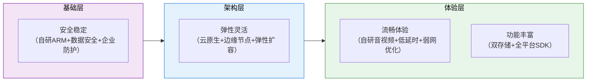

# 火山引擎云手机（ACEP）完整学习笔记

> **产品介绍页**: https://www.volcengine.com/product/ACEP
> **产品定位**: 一站式云手机解决方案——自研ARM服务器可靠稳定，高品质超低延时音视频技术流畅操控，最大化模拟真机环境与性能
> **核心客户**: 吉利汽车、中科深智、巨量引擎、快盘科技

---

## 一、产品概述与定位

### 1.1 产品定位："一站式云手机解决方案"

ACEP定位为**一站式云手机解决方案**，其核心内涵包含三个维度：

| 维度 | 内涵说明 |
|------|----------|
| **一站式** | 覆盖从基础设施、音视频传输、实例管理到应用分发的完整链路，客户无需集成多个厂商组件，在单一平台内完成云手机从部署到运营的完整闭环 |
| **云手机** | 将安卓手机系统运行在云端ARM服务器上，通过音视频串流技术将画面传输到终端，用户可在任意设备上远程操控云端手机实例 |
| **解决方案** | 不仅提供云手机实例资源，还包含管理运维、SDK集成、监控告警等配套能力，是面向业务场景的完整解决方案而非单纯的IaaS资源 |

### 1.2 三大核心卖点

| 核心卖点 | 具体内涵 | 技术支撑 |
|---------|---------|---------|
| **自研ARM服务器可靠稳定** | 采用火山引擎自研ARM SOC服务器芯片，从硬件层面保障稳定性与性能，而非依赖通用x86服务器转译 | 自研ARM架构、企业级硬件设计、高可用架构 |
| **高品质超低延时音视频技术流畅操控** | 端到端延时低于70ms，云游戏场景操作延时低于50ms，达到接近真机的操控体验 | 自研音视频编解码、弱网优化、边缘节点部署、高并发传输 |
| **最大化模拟真机环境与性能** | 从硬件规格、系统版本到传感器模拟全面贴近真机，应用兼容性高，无需修改即可运行 | 真机规格仿真、完整安卓系统支持、传感器模拟、GPU渲染加速 |

### 1.3 关键性能指标（KPI）

页面明确展示的量化性能数据：

| 指标项 | 数值 | 场景说明 |
|-------|------|---------|
| **端到端延时** | &lt;70ms | 通用云手机场景，从用户操作到画面反馈的全链路延时 |
| **云游戏操作延时** | &lt;50ms | 云游戏场景的操作响应延时，达到电竞级体验要求 |
| **示例搭建时间** | 24小时 | 从开通服务到完成示例应用搭建的时间 |
| **直播不间断时长** | 24小时 | 直播场景支持连续24小时稳定运行不中断 |

### 1.4 快速入口

页面提供三个核心快速入口：

| 入口 | 用途 | 目标用户 |
|-----|------|---------|
| **云手机控制台** | 实例管理、配置调整、运维监控 | 运维人员、管理员 |
| **说明文档** | API文档、SDK集成指南、最佳实践 | 开发者、技术人员 |
| **体验中心** | 产品体验、Demo试用 | 潜在客户、评估阶段用户 |

---

## 二、四大核心产品能力解析

### 2.1 能力一：丰富的产品规格

**官方定位**：提供多样化的实例规格选择，满足不同场景的性能与成本需求

| 规格维度 | 说明 | 业务价值 |
|---------|------|---------|
| **CPU/GPU配置梯度** | 从入门型到高性能型多种配置可选 | 按需选择，成本最优，避免资源浪费 |
| **内存/存储规格** | 不同内存容量、存储大小组合 | 适配轻量应用到重负载游戏等不同场景 |
| **系统版本支持** | 支持多个安卓系统版本 | 兼容不同应用的版本要求，降低适配成本 |
| **实例形态** | 可能包含单实例、多实例等形态 | 满足个人使用、批量集群等不同规模需求 |

**设计逻辑分析**：
- 丰富的规格是云服务产品的基础能力，体现"按需购买"的云原生理念
- 规格梯度让客户可以根据业务场景灵活选型，测试场景用低成本规格，生产场景用高性能规格
- 与第四大优势"弹性灵活、按需购买"形成能力-价值的对应关系

---

### 2.2 能力二：便捷的管理运维能力

**官方定位**：通过Open API、SDK、控制台、ADB等多种方式，实现便捷的实例管理与运维

**四大管理入口矩阵**：

| 管理方式 | 适用场景 | 目标用户 | 能力边界 |
|---------|---------|---------|---------|
| **Open API** | 自动化运维、批量操作、系统集成 | 开发者、运维团队 | 全功能可编程调用，适合大规模自动化场景 |
| **SDK** | 应用集成、终端接入、二次开发 | 开发者、集成商 | 封装音视频传输、操控指令等能力，快速集成到自有应用 |
| **控制台** | 可视化管理、手动操作、监控查看 | 管理员、运维人员 | Web界面，无需编码，适合日常管理与问题排查 |
| **ADB连接** | 应用调试、深度定制、问题定位 | 开发者、测试人员 | 标准安卓调试桥，兼容现有安卓开发工具链 |

**价值深度分析**：

多入口管理是企业级云服务的必备能力，四种方式覆盖了从开发调试到大规模运营的完整场景：

1. **ADB兼容**是关键——开发者无需学习新工具，直接使用熟悉的ADB命令即可调试云手机，大幅降低学习成本
2. **Open API**是规模化运营的基础——当需要管理成百上千台云手机实例时，必须通过API实现自动化
3. **SDK**降低集成门槛——客户不需要从零实现音视频传输、操控指令等复杂技术，直接集成SDK即可获得完整能力
4. **控制台**降低使用门槛——非技术人员也可以通过界面管理实例

---

### 2.3 能力三：超低延时音视频传输

**官方定位**：自研音视频技术，实现高并发、低延时、弱网优化的流畅操控体验

这是云手机产品的**核心技术能力**，直接决定用户体验。

| 技术维度 | 能力说明 | 性能指标 |
|---------|---------|---------|
| **延时表现** | 端到端全链路延时优化 | 通用场景&lt;70ms，云游戏场景&lt;50ms |
| **编解码技术** | 自研音视频编解码算法 | 高压缩率、低编码延时、画质损失小 |
| **传输协议** | 优化的网络传输协议 | 抗丢包、低抖动、自适应码率 |
| **弱网优化** | 弱网络环境下的体验保障 | 丢包容忍、带宽自适应、画质流畅优先策略 |
| **并发能力** | 高并发场景下的性能稳定 | 单节点支撑大量并发连接，无性能衰减 |
| **画质表现** | 高清画质输出 | 支持高分辨率、高帧率，画面清晰无明显压缩痕迹 |

**技术门槛分析**：

超低延时音视频是云手机的核心技术壁垒，原因在于：
1. 传统直播技术延时通常在3-10秒，无法满足云手机的实时操控需求
2. 视频会议延时通常在200-500ms，对于游戏等强交互场景仍显不足
3. 要实现&lt;50ms延时，需要从采集、编码、传输、解码、渲染全链路逐帧优化
4. 弱网环境下保持流畅体验是更大的挑战，需要复杂的自适应算法

---

### 2.4 能力四：运维监控

**官方定位**：提供完善的监控运维能力，保障业务稳定运行

| 监控维度 | 可能包含的能力 | 业务价值 |
|---------|---------------|---------|
| **实例监控** | CPU使用率、内存占用、磁盘IO、网络流量 | 实时掌握实例运行状态，及时发现资源瓶颈 |
| **性能监控** | 延时数据、帧率、丢包率、画质指标 | 量化用户体验，及时发现体验下降问题 |
| **告警通知** | 阈值告警、异常告警、多渠道通知 | 问题早发现、早处理，减少业务影响时间 |
| **日志查询** | 操作日志、系统日志、错误日志 | 问题排查、审计追溯、行为分析 |
| **数据统计** | 实例用量、在线时长、资源消耗统计 | 成本核算、容量规划、业务分析 |

**价值分析**：
运维监控是区分"玩具级产品"和"企业级产品"的重要标志——To B产品必须提供可观测性能力，让客户能够自主运维、快速定位问题。

---

## 三、四大产品优势深度剖析

### 3.1 优势一：功能丰富

**官方表述**：云盘/本地双存储、全平台SDK支持

**两大核心功能点解析**：

| 功能点 | 详细说明 | 解决的问题 |
|-------|---------|-----------|
| **云盘/本地双存储** | 同时支持云端持久化存储和实例本地存储，数据可灵活在两种存储间迁移 | ① 云盘存储：数据持久化不丢失，实例释放后数据保留，支持数据共享 ② 本地存储：IO性能高，适合临时数据、高频读写场景 |
| **全平台SDK** | SDK覆盖主流终端平台（Windows/macOS/Web/iOS/Android等） | 用户可在任意设备上接入云手机，无需限制终端类型，覆盖办公、家庭、移动等多场景 |

**功能丰富度评估**：
- ✅ 双存储设计是实用的架构选择，兼顾数据持久性与性能
- ✅ 全平台SDK是云服务的标配，体现了终端覆盖的完整性
- ⚠️ 页面展示的功能点相对精简，可能还有更多功能未在产品首页展示

---

### 3.2 优势二：弹性灵活

**官方表述**：云原生架构、海量边缘资源、弹性扩容、按需购买

**弹性能力四要素**：

| 要素 | 内涵说明 | 客户价值 |
|-----|---------|---------|
| **云原生架构** | 基于云原生理念设计，支持容器化、微服务、快速调度 | 架构弹性好，资源调度效率高，故障恢复快 |
| **海量边缘资源** | 全国范围内部署边缘计算节点，用户就近接入 | 低延时、高带宽、更好的网络质量，跨地域用户体验一致 |
| **弹性扩容** | 根据业务流量自动或手动扩缩容实例数量 | 业务高峰时快速扩容承载流量，业务低谷时缩容节省成本 |
| **按需购买** | 按实际使用量付费，无需预购大量资源 | 降低初始投入，现金流友好，适合业务波动大的场景 |

**弹性架构商业逻辑分析**：

弹性是云服务相对于传统IT架构的核心优势：
1. **业务波动场景刚需**：云游戏、直播、活动营销等场景流量波动大，固定资源配置要么不够用要么浪费
2. **边缘节点关键作用**：云手机对延时极度敏感，只有通过边缘节点让用户就近接入，才能实现&lt;70ms延时
3. **按需购买降低门槛**：客户可以从小规模试用开始，验证业务可行性后再扩大投入，降低决策风险

---

### 3.3 优势三：安全稳定

**官方表述**：数据云端防泄、企业级安全防护、自研ARM服务器

**安全稳定三层防护体系**：

| 层级 | 核心措施 | 防护目标 | 回应的客户顾虑 |
|-----|---------|---------|--------------|
| **数据安全层** | 数据云端存储防泄露 | 防止敏感数据在终端落地泄露 | "数据安全吗？会不会被拷贝外泄？" |
| **安全防护层** | 企业级安全防护体系 | 网络攻击防护、访问控制、权限管理、安全审计 | "会不会被攻击？权限能管控吗？" |
| **硬件稳定层** | 自研ARM SOC服务器 | 从硬件层面保障稳定性与性能，自研可控 | "服务稳定吗？会不会经常宕机？" |

**"数据不落地"价值分析**：

数据云端存储、终端不落地是云手机在安全办公、应用审核等场景的核心价值点：
- 企业数据全部在云端，员工终端只接收音视频流，无法下载、拷贝、外传数据
- 管理员可以统一管控所有云手机实例的数据访问、应用安装、外设连接
- 员工离职或设备丢失，数据仍然安全在云端，不会泄露

**自研ARM服务器战略意义**：

自研ARM服务器不是简单的硬件选型，而是具有深层战略考量：
1. **技术可控**：核心硬件自研，不依赖第三方芯片厂商，供应链安全有保障
2. **性能优化**：软硬件协同设计，可以针对云手机场景做深度优化，性能优于通用服务器
3. **成本优势**：规模化部署自研芯片可以降低硬件成本
4. **稳定性**：从芯片到系统全栈可控，故障定位与修复更快

---

### 3.4 优势四：流畅体验

**官方表述**：自研音视频技术、高并发低延时、弱网优化

这是对"超低延时音视频传输"产品能力的价值重申，从用户体验角度强调"流畅"。

| 体验维度 | 技术支撑 | 用户感知 |
|---------|---------|---------|
| **操作跟手** | 端到端延时&lt;70ms，云游戏&lt;50ms | 点击、滑动等操作即时响应，无明显迟滞感 |
| **画面流畅** | 高帧率支持、自适应码率 | 画面不卡顿、无明显拖影，动态场景流畅 |
| **高并发稳定** | 分布式架构、节点弹性扩展 | 大量用户同时使用时体验不下降 |
| **弱网可用** | 丢包重传、带宽自适应、画质与流畅度平衡 | 网络条件不佳时仍可使用，不至于完全无法操作 |

---

### 3.5 四大优势协同关系

四大优势不是孤立的，而是形成了完整的价值闭环：



---

## 四、五大应用场景详解

### 4.1 场景一：云游戏

**场景描述**：云端渲染、即点即玩，无需下载安装包，点击即可畅玩大型游戏

| 维度 | 详细说明 |
|-----|---------|
| **适用客户** | 游戏厂商、云游戏平台、互动娱乐平台 |
| **核心痛点** | 游戏包体大用户下载意愿低、高端游戏手机硬件门槛高、用户设备碎片化适配成本高 |
| **解决方案** | 游戏在云端ARM服务器运行渲染，终端只接收音视频流，任何设备都能玩高端游戏，即点即玩无需下载 |
| **关键性能要求** | 操作延时&lt;50ms、高帧率、高画质、高并发支撑 |
| **业务价值** | 降低用户获取门槛（无需下载）、扩大用户覆盖（低端设备也能玩）、减少游戏外挂（逻辑在云端）、版权保护（游戏包不落地） |

**云游戏场景对云手机的要求最高**——50ms以内延时是基本要求，任何卡顿、迟滞都会被玩家明显感知，直接影响体验。

---

### 4.2 场景二：仿真测试

**场景描述**：替代线下实体手机设备，支持自动化批量操作，大幅提升测试效率

| 维度 | 详细说明 |
|-----|---------|
| **适用客户** | App开发商、游戏厂商、测试服务商、互联网公司 |
| **核心痛点** | 采购大量实体手机成本高、设备管理维护麻烦、手工测试效率低、多机型兼容性测试覆盖难 |
| **解决方案** | 在云端批量创建云手机实例，通过API/ADB实现自动化测试脚本批量执行，按需创建销毁实例 |
| **关键能力要求** | ADB兼容、丰富规格覆盖多机型、API自动化支持、批量实例管理 |
| **业务价值** | 降低硬件采购成本、测试效率大幅提升（并行测试）、覆盖更多机型规格、设备利用率提升、无需物理空间存放设备 |

**仿真测试场景核心价值在于"降本增效"**——过去需要采购几十上百台手机放在测试机房，现在按需创建云手机实例即可，用完即释放。

---

### 4.3 场景三：直播互娱

**场景描述**：AI虚拟人直播、一播多，支持24小时不间断直播

| 维度 | 详细说明 |
|-----|---------|
| **适用客户** | 直播平台、MCN机构、电商商家、品牌方 |
| **核心痛点** | 真人主播成本高、直播时长有限、多平台同时直播需要多台设备、虚拟人直播需要高性能GPU |
| **解决方案** | 虚拟人在云手机中运行推流，支持7×24小时不间断直播，一台云服务器可以同时推多路流到多个平台 |
| **关键能力要求** | 24小时稳定运行、GPU渲染能力、多路推流、高网络带宽 |
| **业务价值** | 直播时长不受限（24小时不间断）、降低主播人力成本、一播多覆盖多平台、虚拟人直播规模化落地 |

**"24小时直播不间断"是这个场景的核心卖点**——真人主播不可能24小时直播，云手机+虚拟人可以实现全天候直播。

---

### 4.4 场景四：应用审核

**场景描述**：自动化安装运行待审核应用，提升审核效率，保障审核环境安全

| 维度 | 详细说明 |
|-----|---------|
| **适用客户** | 应用商店、广告平台、内容审核平台、互联网公司 |
| **核心痛点** | 待审核应用可能包含恶意代码、人工审核效率低、审核环境需要隔离、批量应用审核耗时耗力 |
| **解决方案** | 每个待审核应用在独立云手机实例中安装运行，自动截图/录屏/行为分析，审核后销毁实例，安全隔离 |
| **关键能力要求** | 实例快速创建销毁、安全隔离、应用自动安装、行为监控、批量操作API |
| **业务价值** | 提升审核效率（自动化批量审核）、安全隔离（恶意应用不影响物理设备）、审核标准统一、降低人工成本 |

**应用审核场景的核心是"安全隔离"**——待审核应用可能包含木马、病毒、恶意代码，在云手机中运行即使出问题也只影响该实例，不会污染审核环境。

---

### 4.5 场景五：安全办公

**场景描述**：数据不落地、统一管理，保障企业数据安全

| 维度 | 详细说明 |
|-----|---------|
| **适用客户** | 金融机构、政府单位、大型企业、对数据安全有高要求的组织 |
| **核心痛点** | 员工手机上办公数据易泄露、BYOD设备管理困难、数据外发难以管控、离职员工数据清理不彻底 |
| **解决方案** | 办公应用和数据全部运行在云端云手机，员工终端只显示画面无法下载数据，管理员统一管控所有实例权限 |
| **关键能力要求** | 数据不落地、权限精细管控、外设管控（禁用USB/拷贝）、审计日志、企业级安全认证 |
| **业务价值** | 数据安全防泄露、统一策略管理、合规审计、支持移动办公但数据可控、离职员工权限即时回收 |

**安全办公场景的核心是"数据不落地"**——这是金融、政府等强监管行业最关心的点。

---

### 4.6 场景-能力匹配矩阵

| 应用场景 | 核心需求 | 最依赖的产品能力 | 关键性能指标 |
|---------|---------|----------------|-------------|
| **云游戏** | 极致流畅体验 | 超低延时音视频、GPU性能、边缘节点 | 操作延时&lt;50ms、高帧率 |
| **仿真测试** | 自动化、多机型兼容 | Open API、ADB连接、丰富规格 | 实例创建速度、API并发 |
| **直播互娱** | 长时间稳定运行 | 高可用、GPU渲染、网络带宽 | 24小时稳定性、推流质量 |
| **应用审核** | 安全隔离、批量操作 | 实例隔离、快速创建销毁、API自动化 | 隔离安全性、批量调度能力 |
| **安全办公** | 数据安全、管控 | 安全防护、权限管理、审计日志 | 数据防泄露能力、管控精细度 |

---

## 五、产品架构与关键技术分析

> **注**：基于产品页面公开信息分析，不涉及内部技术实现细节。

### 5.1 八大核心模块架构

页面明确提到一站式解决方案包含**八大核心模块**：

```
┌─────────────────────────────────────────────────────────────────────┐
│                        火山引擎ACEP云手机架构                         │
├─────────────────────────────────────────────────────────────────────┤
│                      【终端接入层】                                   │
│  ┌──────────────┐  ┌──────────────┐  ┌──────────────┐               │
│  │  全平台SDK   │  │  Web浏览器   │  │   ADB连接    │               │
│  └──────────────┘  └──────────────┘  └──────────────┘               │
├─────────────────────────────────────────────────────────────────────┤
│                      【音视频与控制层】                               │
│  ┌──────────────────────┐  ┌──────────────────────┐                 │
│  │  超低延时音视频传输   │  │   高可靠控制指令通道  │                 │
│  └──────────────────────┘  └──────────────────────┘                 │
├─────────────────────────────────────────────────────────────────────┤
│                      【调度与分发层】                                 │
│  ┌──────────────────────┐  ┌──────────────────────┐                 │
│  │     智能调度系统      │  │   应用安装与分发     │                 │
│  └──────────────────────┘  └──────────────────────┘                 │
├─────────────────────────────────────────────────────────────────────┤
│                      【基础设施层】                                   │
│  ┌──────────────────────┐  ┌──────────────────────┐                 │
│  │  全国边缘计算节点    │  │  自研ARM SOC服务器   │                 │
│  └──────────────────────┘  └──────────────────────┘                 │
├─────────────────────────────────────────────────────────────────────┤
│                      【管理与存储层】                                 │
│  ┌──────────────────────┐  ┌──────────────────────┐                 │
│  │ 实例/镜像/应用管理   │  │     存算分离架构     │                 │
│  └──────────────────────┘  └──────────────────────┘                 │
└─────────────────────────────────────────────────────────────────────┘
```

### 5.2 八大核心模块详解

| 模块序号 | 模块名称 | 核心职责 | 技术要点 |
|---------|---------|---------|---------|
| 1 | **超低延时音视频** | 云端画面采集、编码、传输、终端解码渲染 | 自研编解码、全链路延时优化、弱网算法 |
| 2 | **高可靠控制指令** | 用户操作指令（触摸、按键、滑动等）的可靠低延时传输 | 指令可靠传输、丢包重传、时序保证 |
| 3 | **智能调度** | 根据用户位置、节点负载、实例规格智能调度最优资源 | 就近接入、负载均衡、故障自动迁移 |
| 4 | **应用安装分发** | 应用批量安装、版本管理、分发到云手机实例 | 应用仓库、批量部署、增量更新 |
| 5 | **全国边缘计算节点** | 在全国范围内部署边缘节点，用户就近接入 | 边缘节点覆盖、低延时网络、节点间调度 |
| 6 | **自研ARM SOC服务器** | 云手机运行的硬件载体，自研ARM架构芯片 | 自研芯片、硬件虚拟化、性能优化、稳定性 |
| 7 | **实例/镜像/应用管理** | 云手机实例生命周期管理、镜像制作、应用管理 | 实例创建/销毁/重启、镜像快照、应用生命周期 |
| 8 | **存算分离架构** | 计算资源与存储资源分离，数据持久化与弹性扩展 | 云盘存储、数据持久化、计算存储独立扩缩容 |

---

### 5.3 关键技术模块深度分析

#### 5.3.1 自研ARM SOC服务器

**技术定位**：火山引擎云手机的核心硬件底座，核心竞争力来源

| 技术维度 | 说明 | 商业意义 |
|---------|------|---------|
| **架构选择** | ARM架构而非x86架构 | 原生运行安卓系统，无需指令集转译，性能更高、兼容性更好 |
| **自研芯片** | 自主设计ARM SOC芯片 | 技术可控、供应链安全、软硬件协同优化、成本优势 |
| **虚拟化支持** | 硬件级虚拟化支持 | 单台物理服务器运行多个云手机实例，资源隔离、密度高 |
| **GPU集成** | 集成GPU能力 | 支持游戏渲染、视频编解码、AI计算等GPU加速场景 |

**为什么必须用ARM？**
- 安卓系统原生运行在ARM架构上
- x86服务器运行安卓需要指令集转译，性能损失大、兼容性问题多
- 云游戏等重负载场景对性能敏感，必须用原生ARM

---

#### 5.3.2 超低延时音视频技术栈

**技术定位**：云手机体验的核心技术壁垒

端到端延时需要逐环节优化：

```
用户操作 → 指令上行 → 云端接收 → 应用响应 → 画面渲染 → 
视频采集 → 视频编码 → 网络传输 → 视频解码 → 画面渲染 → 用户看到
```

每一个环节都要极致优化才能实现&lt;70ms甚至&lt;50ms延时。

| 技术环节 | 优化方向 |
|---------|---------|
| **视频编码** | 采用低延时编码配置、硬件编码加速、码率自适应 |
| **网络传输** | UDP协议、自定义拥塞控制、前向纠错FEC、丢包重传ARQ |
| **边缘部署** | 边缘节点部署让用户就近接入，减少网络传输延时 |
| **终端渲染** | 终端硬解码、低延时渲染管线、最小缓冲 |
| **全链路优化** | 逐帧追踪延时，消除所有不必要的缓冲和等待 |

---

#### 5.3.3 存算分离架构

**技术定位**：云原生架构的关键设计

| 设计要点 | 说明 | 价值 |
|---------|------|------|
| **计算与存储分离** | 云手机运行在计算节点，数据存储在独立的存储集群 | 计算资源可以弹性调度，数据不随实例迁移/销毁而丢失 |
| **云盘持久化** | 用户数据存储在云盘，可挂载/卸载/备份/快照 | 数据可靠性高、支持数据迁移、备份恢复方便 |
| **本地存储缓存** | 高频访问数据在本地缓存，冷数据在云盘 | 兼顾性能与持久性，本地存储IO性能高 |

---

#### 5.3.4 边缘计算节点布局

**技术定位**：实现低延时的网络层保障

| 布局要点 | 说明 |
|---------|------|
| **全国覆盖** | 在全国主要区域部署边缘节点，覆盖各地区用户 |
| **就近接入** | 智能DNS+调度系统让用户接入最近的边缘节点 |
| **BGP网络** | 多线BGP网络，保障不同运营商用户的网络质量 |
| **节点间调度** | 节点故障或负载过高时自动调度到邻近节点 |

---

### 5.4 技术选型策略分析

| 技术选型 | 选择方向 | 商业逻辑 |
|---------|---------|---------|
| **芯片架构** | 自研ARM SOC，非x86 | 原生安卓兼容、性能最优、技术可控 |
| **存储架构** | 存算分离+双存储 | 数据持久化、弹性扩展、兼顾性能 |
| **网络架构** | 全国边缘节点覆盖 | 低延时接入、用户体验一致 |
| **管理入口** | API+SDK+控制台+ADB四入口 | 覆盖不同用户群体、降低使用门槛 |
| **售卖模式** | 按需购买+弹性扩容 | 降低准入门槛、适配业务波动 |

---

## 六、客户案例与落地实践

### 6.1 四大标杆客户一览

| 客户名称 | 所属行业 | 应用场景 | 核心价值体现 |
|---------|---------|---------|-------------|
| **吉利汽车** | 汽车制造 | 云车机、车云算力协同 | 车机应用云端运行、车端算力与云端协同 |
| **中科深智** | AI虚拟人 | AI虚拟人直播、24小时不间断 | 24小时不间断直播、虚拟人规模化部署 |
| **巨量引擎** | 互联网广告 | 自动化应用审核 | 应用自动化审核、安全隔离、效率提升 |
| **快盘科技** | 云游戏 | 云游戏平台、&lt;50ms延时 | 云游戏场景落地、极致延时体验 |

客户覆盖**汽车、AI虚拟人、互联网广告、云游戏**四个领域，分别验证了云手机在不同场景的落地能力。

---

### 6.2 案例一：吉利汽车——云车机与车云算力协同

**案例概述**：吉利汽车采用火山引擎云手机方案，实现云车机应用与车云算力协同。

| 维度 | 分析 |
|-----|------|
| **场景理解** | 智能汽车的车机系统本质上就是"车轮上的安卓手机"，但车机硬件更新迭代慢，无法跟上应用更新速度；同时车端算力有限，无法运行大型应用 |
| **解决方案** | 车机应用在云端云手机运行，车机作为"终端"接收音视频流和发送操控指令；车端算力与云端算力协同，重负载应用在云端运行 |
| **核心价值** | ① 车机硬件无需频繁升级即可运行最新应用 ② 应用迭代不受车机硬件限制 ③ 车云协同拓展车载应用生态 ④ 降低车机硬件成本 |
| **技术挑战** | 车机场景网络环境复杂（移动网络、隧道、地下车库等），对弱网优化要求极高；车载场景对安全性、稳定性要求远高于消费级场景 |

**案例启示**：
云手机的应用场景远不止手机——凡是需要"安卓系统+远程操控+低延时"的场景都是潜在市场，车载是一个重要的垂直场景。

---

### 6.3 案例二：中科深智——AI虚拟人24小时直播

**案例概述**：中科深智基于火山引擎云手机实现AI虚拟人24小时不间断直播。

| 维度 | 分析 |
|-----|------|
| **场景理解** | 虚拟人直播需要高性能GPU渲染，单台物理服务器能运行的虚拟人数量有限，且难以7×24小时稳定运行；传统真人直播成本高、时长有限 |
| **解决方案** | 虚拟人推流程序运行在云手机实例中，利用云端GPU性能渲染虚拟人画面并直接推流到直播平台，支持7×24小时不间断运行 |
| **核心价值** | ① 24小时不间断直播（页面明确指标） ② 规模化部署——按需创建多个虚拟人实例同时直播 ③ 降低硬件采购和运维成本 ④ 弹性扩缩容应对直播高峰 |
| **关键验证点** | 24小时稳定运行——这是直播场景的刚需，页面明确提到"24小时直播不间断"的性能指标，通过中科深智案例验证 |

---

### 6.4 案例三：巨量引擎——自动化应用审核

**案例概述**：巨量引擎采用火山引擎云手机进行自动化应用审核。

| 维度 | 分析 |
|-----|------|
| **场景理解** | 巨量引擎作为广告平台，每天需要审核大量广告应用和素材，人工审核效率低，且待审核应用可能包含恶意代码，需要安全的隔离环境 |
| **解决方案** | 每个待审核应用在独立的云手机实例中自动安装运行，自动进行截图、录屏、行为分析，检测违规内容后自动标记，审核完毕后立即销毁实例 |
| **核心价值** | ① 安全隔离——恶意应用在独立云手机中运行，不会影响物理基础设施 ② 自动化批量审核——效率远高于人工 ③ 弹性扩容——审核高峰时快速创建大量实例并行审核 ④ 标准统一——自动化审核标准一致，避免人工主观差异 |
| **标杆意义** | 巨量引擎是字节跳动旗下的广告平台，"自己用自己的产品"是最好的信任背书——说明产品已经在内部大规模使用验证 |

---

### 6.5 案例四：快盘科技——云游戏&lt;50ms延时体验

**案例概述**：快盘科技基于火山引擎云手机搭建云游戏平台，实现&lt;50ms操作延时。

| 维度 | 分析 |
|-----|------|
| **场景理解** | 云游戏对延时极度敏感，操作延时超过50ms玩家就能明显感觉到迟滞，影响游戏体验；云游戏需要高并发支撑大量玩家同时在线 |
| **解决方案** | 游戏在云端ARM服务器运行渲染，通过火山引擎超低延时音视频技术将画面传输到玩家终端，操作延时控制在50ms以内 |
| **核心价值** | ① &lt;50ms操作延时——达到云游戏场景的高端体验标准 ② 即点即玩——玩家无需下载游戏包 ③ 高并发支撑——支撑大规模玩家同时在线 ④ 防外挂——游戏逻辑在云端运行，客户端无法篡改 |
| **关键验证点** | &lt;50ms延时——这是页面明确给出的云游戏场景性能指标，快盘科技案例直接验证了这一指标的落地能力 |

---

### 6.6 客户案例-场景-指标对应关系

| 客户 | 验证场景 | 验证的核心指标 |
|-----|---------|--------------|
| 吉利汽车 | 云车机/车云协同 | 复杂网络环境适应性、车载级稳定性 |
| 中科深智 | 虚拟人直播 | 24小时不间断稳定运行 |
| 巨量引擎 | 应用审核 | 安全隔离、批量自动化、弹性调度 |
| 快盘科技 | 云游戏 | 操作延时&lt;50ms |

四个案例分别验证了产品在不同场景的核心能力，形成了完整的信任背书体系。

---

## 七、网页信息架构与UX设计分析

> **模式沉淀说明**：本节分析的B端产品"七段式认知递进"信息架构已正式沉淀为方法论模式，详见：
> [b2b-product-seven-segment-ia.md](../../../retrospective/patterns/methodology-patterns/research-knowledge/b2b-product-seven-segment-ia.md)（L2-verified，3次验证）

### 7.1 页面信息架构：七段式认知递进结构

ACEP产品页面严格遵循B端技术产品的**七段式认知递进**信息架构，信息组织完全匹配用户购买决策路径（认知→兴趣→信任→转化），是该模式的典型验证案例：

```mermaid
flowchart TB
    ENTRY["用户进入页面"] --> HERO["首屏Hero区<br/>「一站式云手机解决方案」<br/>三大核心卖点：自研ARM/超低延时/真机模拟<br/>关键数据：<70ms延时/24小时搭建/24小时直播"]
    HERO --> CTA1["主CTA区域<br/>控制台/文档/体验中心"]
    HERO --> NAV["顶部导航栏"]
    NAV --> SEC1["产品能力模块<br/>（四大能力）"]
    NAV --> SEC2["产品优势模块<br/>（四大优势）"]
    NAV --> SEC3["应用场景模块<br/>（五大场景）"]
    NAV --> SEC4["产品架构模块<br/>（八大核心模块）"]
    NAV --> SEC5["客户案例模块<br/>（四大客户）"]
    subgraph SEC1_CAP ["四大核心能力"]
        direction TB
        C1["丰富产品规格"]
        C2["管理运维能力<br/>(API/SDK/控制台/ADB)"]
        C3["超低延时音视频"]
        C4["运维监控"]
    end
    subgraph SEC2_ADV ["四大产品优势"]
        direction TB
        A1["功能丰富<br/>(双存储/全平台SDK)"]
        A2["弹性灵活<br/>(云原生/边缘/弹性扩容)"]
        A3["安全稳定<br/>(数据防泄/自研ARM)"]
        A4["流畅体验<br/>(自研音视频/弱网优化)"]
    end
    subgraph SEC3_SCN ["五大应用场景"]
        direction TB
        S1["云游戏<br/>(云端渲染/即点即玩)"]
        S2["仿真测试<br/>(替代真机/自动化)"]
        S3["直播互娱<br/>(虚拟人/一播多)"]
        S4["应用审核<br/>(自动化/安全隔离)"]
        S5["安全办公<br/>(数据不落地/统一管理)"]
    end
    subgraph SEC4_ARCH ["八大核心模块架构"]
        direction TB
        M1["超低延时音视频"]
        M2["高可靠控制指令"]
        M3["智能调度"]
        M4["应用安装分发"]
        M5["全国边缘节点"]
        M6["自研ARM服务器"]
        M7["实例/镜像/应用管理"]
        M8["存算分离"]
    end
    subgraph SEC5_CASE ["四大客户案例"]
        direction TB
        CS1["吉利汽车<br/>(云车机/车云协同)"]
        CS2["中科深智<br/>(虚拟人直播/24h)"]
        CS3["巨量引擎<br/>(自动化审核)"]
        CS4["快盘科技<br/>(云游戏/<50ms)"]
    end
    SEC1 --> SEC1_CAP
    SEC2 --> SEC2_ADV
    SEC3 --> SEC3_SCN
    SEC4 --> SEC4_ARCH
    SEC5 --> SEC5_CASE
    SEC1_CAP --> CTA2
    SEC2_ADV --> CTA3
    SEC3_SCN --> CTA4
    SEC4_ARCH --> CTA5
    SEC5_CASE --> CTA6["底部CTA/快速入口"]
    CTA1 --> CTA_FINAL["转化行动<br/>控制台/文档/体验中心"]
    CTA2 --> CTA_FINAL
    CTA3 --> CTA_FINAL
    CTA4 --> CTA_FINAL
    CTA5 --> CTA_FINAL
    CTA6 --> CTA_FINAL
    SEC5_CASE --> FOOTER["页脚区域"]
    style ENTRY fill:#e3f2fd,stroke:#1976d2,color:#000
    style HERO fill:#fff3e0,stroke:#f57c00,color:#000
    style CTA1 fill:#d4edda,stroke:#28a745,color:#000
    style CTA2 fill:#d4edda,stroke:#28a745,color:#000
    style CTA3 fill:#d4edda,stroke:#28a745,color:#000
    style CTA4 fill:#d4edda,stroke:#28a745,color:#000
    style CTA5 fill:#d4edda,stroke:#28a745,color:#000
    style CTA6 fill:#d4edda,stroke:#28a745,color:#000
    style CTA_FINAL fill:#c8e6c9,stroke:#388e3c,color:#000
    style SEC1_CAP fill:#e1f5fe,stroke:#0288d1
    style SEC2_ADV fill:#e8f5e9,stroke:#388e3c
    style SEC3_SCN fill:#fff8e1,stroke:#ffa000
    style SEC4_ARCH fill:#f3e5f5,stroke:#7b1fa2
    style SEC5_CASE fill:#ffebee,stroke:#c62828
```



### 7.2 内容组织逻辑：七段式与决策路径对应

页面内容严格遵循B端云产品七段式认知递进架构，每一段回答用户决策路径上的一个关键问题：

| 段落序号 | 模块名称 | 对应七段式架构 | 回答用户问题 | 关键信息 |
|---------|---------|---------------|-------------|---------|
| 1 | **首屏Hero区** | Hero首屏区 | "这是什么？能给我什么核心价值？" | 一句话定位，三大核心卖点，关键数据抓眼球（&lt;70ms/&lt;50ms/24小时） |
| 2 | **四大核心能力** | 核心能力区 | "具体能做什么？" | 规格、管理、音视频、监控四大基础能力，展示功能边界 |
| 3 | **四大产品优势** | 产品优势区 | "为什么选你而不是竞品？" | 功能、弹性、安全、体验四个价值维度，强化差异化 |
| 4 | **五大应用场景** | 应用场景区 | "我能用在什么地方？" | 云游戏、测试、直播、审核、办公五大场景，匹配用户需求 |
| 5 | **八大核心模块** | 技术架构区 | "技术上靠谱吗？会不会是黑盒？" | 展示完整技术架构，从硬件到应用全栈覆盖，体现技术深度 |
| 6 | **四大客户案例** | 客户案例区 | "别人用得怎么样？有成功先例吗？" | 四个标杆客户（吉利/中科深智/巨量引擎/快盘科技），每个验证一个核心能力 |
| 7 | **快速入口** | 行动转化区 | "怎么开始？" | 控制台/文档/体验中心三个明确入口，覆盖不同决策阶段用户 |

### 7.3 视觉层次与信息权重分析

基于页面实际内容和B端云产品设计惯例分析：

| 信息层级 | 内容 | 视觉呈现特点 |
|---------|------|-------------|
| **L1 最高权重** | 产品定位、三大核心卖点、关键性能数据（&lt;70ms、&lt;50ms、24小时） | 首屏大标题、大字号、高对比度、数据可视化突出 |
| **L2 高权重** | 四大能力、四大优势、五大场景 | 模块标题、图标+短句、每个点配图标/示意图 |
| **L3 中权重** | 八大架构模块、客户案例详情 | 架构图、Logo+场景说明、数据亮点 |
| **L4 基础权重** | 功能细节、技术说明、辅助信息 | 正文文字、较小字号 |

### 7.4 CTA设计分析

页面设置三个核心快速入口，而非单一的"立即咨询"或"立即购买"：

| CTA入口 | 目标用户 | 用户决策阶段 | 转化路径 |
|---------|---------|-------------|---------|
| **云手机控制台** | 已付费用户、已决定试用用户 | 决策后期/使用阶段 | 直接进入产品使用 |
| **说明文档** | 开发者、技术评估人员 | 评估阶段、技术调研 | 查看技术文档，评估集成难度 |
| **体验中心** | 潜在客户、初步了解用户 | 兴趣阶段、早期评估 | 先体验产品，建立直观认知再决策 |

**三个CTA的设计逻辑值得学习**：
1. 不是只有一个"联系销售"按钮，而是覆盖了用户从体验→评估→使用的完整路径
2. "体验中心"降低了尝试门槛——用户不需要联系销售就能先体验产品
3. "说明文档"服务于技术决策者——B端采购中技术人员的评估意见很重要
4. "控制台"服务于已有用户——兼顾新客户转化和老客户使用

---

## 八、UX设计特点与优势评估

### 8.1 UX设计优势

#### 优势1：关键性能指标前置，用数据建立第一印象

首屏就亮出核心数据：
- 端到端延时&lt;70ms
- 云游戏操作延时&lt;50ms
- 24小时完成示例搭建
- 24小时直播不间断

**设计逻辑**：B端技术产品采购中，技术人员最关心"性能怎么样"，直接在首屏亮出硬指标，快速抓住技术决策者注意力，建立"技术领先"的第一印象。

---

#### 优势2：卖点-能力-优势-场景-案例形成完整逻辑链条

页面内容不是零散堆砌，而是形成了严密的论证链条：

```
三大核心卖点（是什么）
    ↓
四大核心能力（有什么功能）
    ↓
四大产品优势（能带来什么价值）
    ↓
五大应用场景（用在哪些地方）
    ↓
八大架构模块（技术怎么实现）
    ↓
四大客户案例（谁已经用了、效果如何）
```

这种层层递进的结构符合B端客户的决策逻辑——从概念认知到功能理解，到价值判断，到场景代入，到技术信任，最后用案例打消顾虑。

---

#### 优势3：客户案例与场景/指标一一对应，可信度高

四个客户案例不是随便放Logo，而是每个案例都对应一个场景、验证一个核心指标：
- 快盘科技 → 云游戏 → 验证&lt;50ms延时
- 中科深智 → 直播互娱 → 验证24小时稳定运行
- 巨量引擎 → 应用审核 → 验证规模化、自动化、安全
- 吉利汽车 → 创新场景（车云协同） → 验证场景拓展能力

这种"案例+场景+数据"的组合比单纯放Logo墙可信度高得多。

---

#### 优势4：CTA分层设计，覆盖不同决策阶段用户

如前所述，三个快速入口（控制台、文档、体验中心）分别对应：
- 已经决策的用户 → 直接用控制台
- 技术评估用户 → 看文档
- 初步了解用户 → 去体验中心

相比单一的"立即咨询"，这种分层设计提升了整体转化率。

---

#### 优势5："一站式"定位清晰，降低认知负担

"一站式云手机解决方案"的定位清晰明确，客户不需要理解复杂的技术架构就能理解产品价值——"我需要云手机，找这一家就能全部搞定，不用自己拼多个组件"。

---

### 8.2 UX设计可改进点（基于提取信息的客观分析）

| 优先级 | 问题类型 | 具体问题 | 改进建议 |
|--------|---------|---------|---------|
| 🔴 高 | 定价信息 | 页面未提及定价模式、价格区间、计费方式 | 增加定价页面入口，至少说明计费模式（按实例按时长？按配置？包年包月？），即使是"联系商务询价"也应该有价格区间提示 |
| 🔴 高 | 产品可视化 | 提取信息中未提及产品截图、界面预览、Demo视频 | 增加云手机实际运行画面截图、控制台界面预览、操作演示视频，让客户直观看到产品长什么样 |
| 🟠 中高 | 规格细节 | "丰富的产品规格"没有展示具体规格表（CPU/内存/GPU/分辨率/帧率等） | 增加具体规格对照表，列出不同规格的参数和适用场景，方便客户选型 |
| 🟠 中高 | 与竞品差异 | 未说明与其他云手机厂商的差异点 | 增加"为什么选择我们"的差异化对比，突出自研ARM、音视频技术、边缘节点等独特优势 |
| 🟡 中 | 客户证言 | 客户案例只有客户名称和场景，缺乏客户引言、证言视频、详细数据 | 增加客户引用语、更详细的案例数据（如快盘科技服务了多少玩家、中科深智开了多少路直播） |
| 🟡 中 | SDK/文档展示 | 提到了全平台SDK和说明文档，但没有展示SDK支持的平台、文档结构、API能力概览 | 增加SDK支持平台列表、API能力预览、文档快速链接，降低开发者评估门槛 |
| 🟡 中 | SLA承诺 | 未提及服务可用性SLA、故障赔付等企业级服务承诺 | 增加SLA说明（如99.9%可用性），增强企业客户信心 |
| 🟢 低 | 常见问题 | 没有FAQ模块解答常见疑问 | 增加FAQ模块，回答计费、安全、兼容性、集成等常见问题，减少售前咨询压力 |

---

## 九、可借鉴设计模式与B端产品展示经验总结

> **模式沉淀说明**：本章总结的B端产品展示经验已系统化沉淀为方法论模式库，核心模式包括：
> - [b2b-product-seven-segment-ia.md](../../../retrospective/patterns/methodology-patterns/research-knowledge/b2b-product-seven-segment-ia.md)：B端技术产品页面七段式认知递进信息架构（L2-verified，3次验证）
> - [b2b-product-page-ux-five-dimensions.md](../../../retrospective/patterns/methodology-patterns/research-knowledge/b2b-product-page-ux-five-dimensions.md)：ToB产品页UX分析五维框架（L2-verified，2次验证）
> - [b2b-value-quantification-case-validation.md](../../../retrospective/patterns/methodology-patterns/research-knowledge/b2b-value-quantification-case-validation.md)：B端产品价值量化与案例验证双闭环模式（L2-verified，2次验证，本章模式1+3萃取）
> - [external-website-analysis-fallback-strategy.md](../../../retrospective/patterns/methodology-patterns/research-knowledge/external-website-analysis-fallback-strategy.md)：外部网站分析信息源分层兜底策略（L2-verified，8次验证）

### 9.1 七大可复用B端技术产品展示模式

#### 模式1：硬指标首屏亮剑——关键性能数据前置

**模式描述**：在首屏最显眼位置直接亮出产品最核心的量化性能指标，用数字建立技术信任感，第一时间抓住技术决策者注意力。

**关键要素**：
1. **指标要硬核**：必须是客户最关心的核心性能指标（如延时、QPS、可用性、部署时间）
2. **数字要具体**：用"<70ms"而非"超低延时"，用"24小时"而非"快速部署"，具体数字比模糊形容词有说服力10倍
3. **位置要靠前**：放在首屏Hero区，用户进入页面第一眼就能看到
4. **要有对比**：最好能暗示行业水平，让客户知道这个数字意味着什么（如"<50ms"意味着达到电竞级体验）

**ACEP实践**：首屏直接亮出&lt;70ms、&lt;50ms、24小时搭建、24小时直播四个硬指标。

**可借鉴场景**：所有技术产品、云服务、基础设施类产品都适用——性能指标是技术采购的硬通货。

---

#### 模式2：能力-优势-场景三层价值表达

**模式描述**：不要只罗列功能列表，而是按"我有什么能力→这些能力带来什么优势→这些优势用在什么场景解决什么问题"三层结构组织内容，让客户从功能理解上升到价值理解。

**三层结构逻辑**：
| 层级 | 表达内容 | 回答客户问题 |
|-----|---------|------------|
| **能力层** | 产品功能列表、技术特性 | "你的产品有什么功能？" |
| **优势层** | 功能带来的差异化价值、比竞品好在哪里 | "为什么选你不选别人？" |
| **场景层** | 这些能力和优势在具体场景中如何解决问题 | "这个产品对我有什么用？" |

**ACEP实践**：四大能力→四大优势→五大场景，形成完整的价值表达链路。

---

#### 模式3：案例-场景-指标三点闭环背书

**模式描述**：客户案例不是放Logo就完事，每个案例要对应一个核心场景，验证一个关键指标，形成"客户是谁→在什么场景用→验证了什么指标"的三点闭环，可信度倍增。

**三点闭环要素**：
1. **客户选得准**：选择行业内有知名度的标杆客户
2. **场景对得上**：案例场景与前面讲的应用场景一一对应
3. **指标验得实**：每个案例要验证一个首屏亮出的硬指标，前后呼应

**ACEP实践**：
- 快盘科技 → 云游戏场景 → 验证&lt;50ms延时
- 中科深智 → 直播场景 → 验证24小时稳定运行
- 巨量引擎 → 审核场景 → 验证规模化自动化
- 吉利汽车 → 车载场景 → 验证场景拓展性

---

#### 模式4：CTA分层覆盖决策全路径

**模式描述**：不要只有一个"联系销售"或"立即购买"按钮，要根据用户决策的不同阶段设置不同CTA，让每个阶段的用户都有适合的下一步行动。

**CTA分层设计**：
| 用户决策阶段 | 心理状态 | 合适的CTA |
|------------|---------|----------|
| **早期：了解阶段** | "我先看看这是什么" | 体验中心、产品演示、视频介绍 |
| **中期：评估阶段** | "我要评估技术上是否可行" | 说明文档、API文档、技术白皮书 |
| **后期：决策阶段** | "我已经决定要买/试" | 控制台、立即开通、免费试用 |
| **疑惑阶段** | "我还有些问题想了解" | 联系我们、售前咨询、预约演示 |

**ACEP实践**：体验中心（早期）→ 说明文档（中期）→ 控制台（后期），三层CTA覆盖完整决策路径。

---

#### 模式5：架构可视化建立技术信任

**模式描述**：B端技术采购中，客户会关心"你的技术是怎么实现的？架构是否合理？是否有单点风险？"，展示清晰的产品架构图能快速建立技术深度认知，增强技术信任感。

**架构展示要点**：
1. **分层清晰**：按接入层、传输层、调度层、基础设施层等分层展示
2. **模块明确**：标注核心模块名称，让客户知道包含哪些组件
3. **不暴露机密**：展示逻辑架构而非实现细节，既体现技术深度又不泄密
4. **与优势呼应**：架构模块要能支撑前面讲的优势（如展示边缘节点对应"低延时"优势）

**ACEP实践**：明确展示八大核心模块构成的完整架构，从音视频、控制指令到自研ARM服务器、存算分离，技术体系完整清晰。

---

#### 模式6："一站式"定位降低决策复杂度

**模式描述**：如果你的产品是整合型解决方案，明确打出"一站式"定位，告诉客户"找我一家就能搞定，不用自己整合多个组件"，降低客户的决策复杂度和集成焦虑。

**"一站式"成立的条件**：
1. **能力完整**：真的覆盖了完整链路，没有明显短板需要客户自己补
2. **集成良好**：各模块之间已经预集成，不是简单拼凑
3. **统一入口**：有统一的控制台、统一的API、统一的账号体系
4. **责任清晰**：出了问题找你一家就行，不用在多个厂商间推诿

**ACEP实践**：从ARM服务器、音视频技术、调度系统到SDK、API、管理运维，八大模块构成完整闭环，名副其实"一站式"。

---

#### 模式7：多管理入口覆盖不同用户角色

**模式描述**：B端产品有多个角色使用（开发者、运维、管理员、业务人员），要为不同角色提供适合的使用入口，而不是让所有人都用同一个界面。

**常见入口组合**：
| 用户角色 | 适合的入口 | 核心需求 |
|---------|----------|---------|
| **开发者** | SDK、API、CLI、ADB/调试工具 | 可编程、自动化、兼容现有工具链 |
| **运维人员** | API、控制台、监控告警 | 批量管理、自动化运维、问题排查 |
| **管理员** | 控制台、可视化界面 | 权限管理、资源管控、用量统计 |
| **业务人员** | 简化控制台、业务后台 | 无需理解技术细节，聚焦业务操作 |

**ACEP实践**：Open API（开发者/运维）、SDK（开发者集成）、控制台（管理员/运维）、ADB（开发者调试），四个入口覆盖不同角色需求。

---

### 9.2 B端云产品页面：七段式认知递进标准结构

从ACEP、HiAgent、SearchInfinity等火山引擎产品验证的B端云服务/技术产品页面标准内容结构，已正式沉淀为方法论模式（L2-verified）：

| 序号 | 模块（七段式） | 必要性 | 核心内容 | 对应决策阶段 |
|-----|---------------|-------|---------|-------------|
| 1 | **Hero首屏区** | 必须 | 产品定位Slogan、3-4个核心卖点、3-4个关键硬指标、首屏CTA | Attention（建立认知） |
| 2 | **核心能力区** | 必须 | 3-5个核心产品能力，每个讲清楚是什么、有什么用 | Interest（功能信任） |
| 3 | **产品优势区** | 必须 | 3-5个差异化优势，讲清楚为什么选你 | Interest（价值强化） |
| 4 | **应用场景区** | 必须 | 4-6个典型应用场景，让不同行业客户都能找到代入感 | Desire（需求匹配） |
| 5 | **技术架构区** | 强烈建议 | 架构图+核心模块说明，建立技术信任感 | Desire（技术信任） |
| 6 | **客户案例区** | 必须 | 3-5个标杆客户，每个案例讲清楚：客户是谁→在什么场景用→验证了什么指标 | Desire（社会证明） |
| 7 | **行动转化区** | 必须 | 分层CTA（体验/文档/控制台），引导用户下一步行动 | Action（促成转化） |

**七段之外的补充模块**（根据产品特性可选）：

| 序号 | 补充模块 | 必要性 | 核心内容 |
|-----|---------|-------|---------|
| 8 | **定价信息** | 强烈建议 | 计费模式、价格区间、套餐对比（或明确"联系商务询价"） |
| 9 | **常见问题FAQ** | 建议 | 解答售前常见疑问，减少咨询成本 |
| 10 | **文档/资源链接** | 必须 | 文档中心、API参考、SDK下载、开发者社区等 |

> **完整模式文档**：详见 [b2b-product-seven-segment-ia.md](../../../retrospective/patterns/methodology-patterns/research-knowledge/b2b-product-seven-segment-ia.md)，包含各段设计规范、完整性检查清单、反模式识别等详细内容。

---

## 十、行业启示与技术趋势

> **模式沉淀说明**：本章五大趋势判断已系统化沉淀为行业分析方法论模式：
> [tech-product-commercialization-evolution.md](../../../retrospective/patterns/methodology-patterns/product-growth/tech-product-commercialization-evolution.md)（技术驱动型产品商业化演进五维分析框架，L1-experimental）
>
> 五维框架对应关系：
> - 趋势1（ARM自研护城河）→ 维度五：竞争格局"自研护城河分化"规律
> - 趋势2（云游戏规模化落地）→ 维度一：技术成熟度"三条件引爆"模型
> - 趋势3（C端→B端场景拓展）→ 维度二：场景渗透"C端先行→B端渗透"路径
> - 趋势4（边缘节点成为准入门槛）→ 维度三：门槛演进"优化项→竞争门槛→准入门槛"规律
> - 趋势5（云手机+X生态衍生）→ 维度四：生态衍生"底座型产品+X"范式

### 10.1 云手机行业五大趋势判断

#### 趋势1：ARM自研成为头部厂商核心竞争力

云手机厂商正在分化为两条路线：
- **自研路线**：火山引擎等头部厂商自研ARM服务器芯片，软硬件协同优化，性能、成本、可控性占优
- **通用路线**：采购通用ARM服务器或x86转译方案，门槛低但性能和成本优化空间有限

**趋势判断**：自研ARM是云手机赛道的"硬核护城河"——这不是小玩家能做的事，需要芯片设计能力和大规模资金投入，头部效应会越来越明显。

---

#### 趋势2：云游戏从概念走向规模化落地

曾经云游戏被认为是"伪需求"，但随着：
1. 延时技术突破（&lt;50ms达到可用水平）
2. 边缘节点覆盖完善
3. 版权方态度转变（云游戏成为新分发渠道）

云游戏正在从Demo阶段走向规模化商用。快盘科技等客户案例说明云游戏已经有成熟的落地实践。

**关键指标**：&lt;50ms延时是云游戏体验的"甜蜜点"——低于这个阈值大部分玩家感知不到明显迟滞，云游戏体验可以被主流玩家接受。

---

#### 趋势3：云手机应用场景从泛娱乐向企业级拓展

早期云手机主要用于云游戏、云手机托管等偏娱乐/C端场景，现在快速向B端/企业级场景渗透：
- 仿真测试（互联网公司批量测试）
- 应用审核（广告平台、应用商店）
- 安全办公（金融、政府数据不落地）
- 云车机（汽车智能化）
- 虚拟人直播（直播电商）

**趋势判断**：B端场景将成为云手机增长最快的市场——B端客户付费能力强、需求稳定、规模大，且对云手机的价值认知更清晰（降本增效安全）。

---

#### 趋势4：边缘节点成为云手机的"必备基建"

延时是云手机的生命线，而延时主要来自网络传输：
- 中心机房部署 → 跨地域用户延时高（100ms+）
- 边缘节点部署 → 用户就近接入，延时可以控制在50ms以内

**趋势判断**：没有全国边缘节点覆盖的云手机厂商将无法服务对体验敏感的场景（云游戏、互动直播），边缘节点布局将成为行业准入门槛。

---

#### 趋势5："云手机+"成为新的创新业态

云手机不是单一产品，而是一个"安卓云"底座，可以衍生出多种创新业态：
- **云手机+车机**=云车机（吉利案例）
- **云手机+虚拟人**=云端虚拟人直播（中科深智案例）
- **云手机+AI Agent**=云端AI智能体手机
- **云手机+办公**=移动安全办公空间
- **云手机+云游戏**=即点即玩云游戏平台

**趋势判断**：未来"云手机+X"的创新场景会不断涌现，云手机作为"云端安卓基础设施"的价值会越来越大。

---

### 10.2 对云服务产品设计的四点启示

| 启示编号 | 启示内容 | 对应模式 |
|---------|---------|---------|
| **启示1** | **硬指标是B端产品的第一语言**：不要用"超低延时"、"高性能"、"高可用"这类模糊形容词，直接亮出数字——<70ms、99.99%、100万QPS，数字是技术人员的通用语言 | [b2b-value-quantification-case-validation.md](../../../retrospective/patterns/methodology-patterns/research-knowledge/b2b-value-quantification-case-validation.md)（首屏量化亮剑） |
| **启示2** | **案例必须带数据**："某某客户选择了我们"是无效背书，"某某客户用了我们之后，延时降低到50ms以内，支撑XX万用户，成本降低XX%"才是有效背书 | [b2b-value-quantification-case-validation.md](../../../retrospective/patterns/methodology-patterns/research-knowledge/b2b-value-quantification-case-validation.md)（案例三点闭环验证） |
| **启示3** | **CTA不要只有"联系销售"**：技术用户喜欢先看文档、先动手试，给他们体验中心和文档入口，比只给一个销售电话转化率高得多 | [b2b-product-page-ux-five-dimensions.md](../../../retrospective/patterns/methodology-patterns/research-knowledge/b2b-product-page-ux-five-dimensions.md)（维度三：CTA四层分类策略） |
| **启示4** | **"一站式"对B端客户吸引力巨大**：企业客户讨厌集成多个厂商组件——出了问题互相推诿、责任不清。如果能真正提供一站式解决方案，是强大的差异化优势 | 待验证（L1候选，需更多案例确认普适性） |

---

### 10.3 云手机与相关技术领域的关系

| 相关技术 | 关系 | 协同价值 |
|---------|------|---------|
| **边缘计算** | 云手机是边缘计算的重要应用场景 | 边缘节点让云手机实现低延时接入 |
| **ARM虚拟化** | 云手机的底层技术基础 | 单台服务器运行多个云手机实例的核心技术 |
| **音视频技术** | 云手机体验的核心 | 低延时音视频传输决定用户体验上限 |
| **云原生** | 云手机的架构理念 | 存算分离、弹性调度、容器化等云原生技术让云手机具备弹性能力 |
| **AI虚拟人** | 云手机的重要应用场景 | 云端GPU+云手机让虚拟人可以7×24小时规模化运行 |
| **自动驾驶/智能汽车** | 云手机的新兴场景 | 云车机让车机应用摆脱硬件限制，实现车云协同 |

---

## 十一、专业术语表

| 术语 | 英文/缩写 | 解释 |
|-----|----------|------|
| **云手机** | Cloud Phone | 将安卓手机系统运行在云端服务器上，通过网络将音视频传输到终端，用户可远程操控的虚拟手机服务 |
| **ACEP** | Advanced Cloud Engine Phone | 火山引擎云手机产品的内部代号/产品标识 |
| **ARM架构** | Advanced RISC Machine | 一种精简指令集处理器架构，安卓系统原生运行的架构，相比x86在移动端和云手机场景能效比更高 |
| **SOC** | System on Chip | 系统级芯片，将CPU、GPU、内存控制器、IO等集成在单颗芯片上 |
| **端到端延时** | End-to-End Latency | 从用户在终端发起操作，到操作结果画面在终端显示的全链路时间延迟 |
| **ADB** | Android Debug Bridge | 安卓调试桥，安卓官方提供的调试工具，用于连接和调试安卓设备/实例 |
| **边缘计算** | Edge Computing | 在靠近用户的边缘节点部署计算资源，而非全部在中心机房，以降低网络延时、提升带宽 |
| **存算分离** | Storage-Compute Separation | 计算资源和存储资源独立部署、独立扩展的架构模式，存储不依赖于特定计算节点 |
| **云盘** | Cloud Disk | 云端块存储服务，数据持久化存储，可挂载到任意计算实例，实例销毁后数据保留 |
| **BGP** | Border Gateway Protocol | 边界网关协议，BGP网络指多线接入的网络，可让不同运营商用户都有良好的访问速度 |
| **FEC** | Forward Error Correction | 前向纠错，在网络传输中发送冗余数据，接收方在丢包时可直接恢复数据而无需重传，降低延时 |
| **ARQ** | Automatic Repeat-reQuest | 自动重传请求，网络传输中检测到丢包时请求发送方重传数据，保障可靠性 |
| **SDK** | Software Development Kit | 软件开发工具包，封装了特定能力的库和工具，方便开发者集成到自己的应用中 |
| **API** | Application Programming Interface | 应用程序编程接口，系统对外提供的可编程调用入口 |
| **GPU** | Graphics Processing Unit | 图形处理器，擅长并行计算，用于游戏渲染、视频编解码、AI计算等场景 |
| **SLA** | Service Level Agreement | 服务等级协议，云服务商承诺的服务可用性等指标及未达标时的赔付标准 |
| **即点即玩** | Click-to-Play | 云游戏场景中用户无需下载游戏包，点击链接即可直接开始游戏的体验 |
| **一播多** | One-to-Many Streaming | 单路直播源同时推流到多个直播平台，或一个主播同时服务多个观众的直播模式 |
| **数据不落地** | Data Not Landing | 数据全部在云端存储和处理，终端只显示画面无法下载保存数据，防止数据泄露的安全理念 |

---

## 十二、相关资源链接

### 12.1 官方资源

| 资源类型 | 链接 | 说明 |
|---------|------|------|
| **产品主页** | https://www.volcengine.com/product/ACEP | 火山引擎云手机（ACEP）官方产品介绍页 |
| **云手机控制台** | （产品页入口） | 云手机实例管理控制台 |
| **说明文档** | （产品页入口） | API文档、SDK集成指南、使用文档 |
| **体验中心** | （产品页入口） | 云手机产品体验入口 |

### 12.2 相关火山引擎产品

| 产品名称 | 定位 | 协同关系 |
|---------|------|---------|
| **火山引擎边缘计算** | 边缘计算节点服务 | 为云手机提供低延时接入的边缘基础设施 |
| **火山引擎视频云** | 音视频云服务 | 低延时音视频技术支撑 |
| **火山方舟** | 大模型服务平台 | 与云手机结合可实现云端AI Agent、智能虚拟人等场景 |

### 12.3 学习与延伸阅读建议

| 学习方向 | 学习内容 |
|---------|---------|
| **基础技术** | ARM虚拟化技术、安卓容器化、低延时音视频编解码、实时网络传输协议 |
| **行业资料** | 云手机行业白皮书、云游戏技术标准、边缘计算产业报告 |
| **竞品参考** | 其他主流云手机厂商的产品架构、定价模式、场景布局 |
| **场景案例** | 云游戏、移动办公、应用测试等场景的落地实践案例 |

---

## 十三、复盘与模式沉淀

本学习任务已完成完整复盘流程，相关产出如下：

| 产出类型 | 链接 | 说明 |
|---------|------|------|
| **复盘报告** | [retrospective-volcengine-acep-learning-20260707/](../../../retrospective/reports/competitive-analysis/retrospective-volcengine-acep-learning-20260707/) | 包含事实收集、过程分析、洞察萃取、导出建议完整四件套 |
| **新模式沉淀1** | [b2b-product-seven-segment-ia.md](../../../retrospective/patterns/methodology-patterns/research-knowledge/b2b-product-seven-segment-ia.md) | B端技术产品页面七段式认知递进信息架构（L2-verified，3次验证） |
| **新模式沉淀2** | [b2b-value-quantification-case-validation.md](../../../retrospective/patterns/methodology-patterns/research-knowledge/b2b-value-quantification-case-validation.md) | B端产品价值量化与案例验证双闭环模式（L2-verified，2次验证，第九章模式1+3萃取） |
| **新模式沉淀3** | [tech-product-commercialization-evolution.md](../../../retrospective/patterns/methodology-patterns/product-growth/tech-product-commercialization-evolution.md) | 技术驱动型产品商业化演进五维分析框架（L1-experimental，第十章五大趋势萃取） |
| **模式升级验证1** | [b2b-product-page-ux-five-dimensions.md](../../../retrospective/patterns/methodology-patterns/research-knowledge/b2b-product-page-ux-five-dimensions.md) | ToB产品页UX分析五维框架（L1→L2升级，第2次验证，补充ACEP案例） |
| **模式升级验证2** | [external-website-analysis-fallback-strategy.md](../../../retrospective/patterns/methodology-patterns/research-knowledge/external-website-analysis-fallback-strategy.md) | 外部网站分析信息源分层兜底策略（第8次验证，validation_count=8） |
| **洞察萃取** | [insight-extraction.md](../../../retrospective/reports/competitive-analysis/retrospective-volcengine-acep-learning-20260707/insight-extraction.md) | 3个核心洞察、3个可复用模式、3项改进建议 |

---

**笔记创建日期**：2026-07-06
**最后更新**：2026-07-07（第十章趋势洞察萃取：新增技术商业化演进五维框架L1、完善所有章节模式回链）
**信息来源**：火山引擎云手机（ACEP）官方产品页面（https://www.volcengine.com/product/ACEP），通过浏览器工具（integrated_browser）完整采集动态渲染内容
**分析说明**：本笔记基于产品页面公开信息整理分析，UX分析和行业趋势部分均已沉淀为可复用方法论模式，形成B端产品从页面UX到行业趋势的完整分析工具体系。
