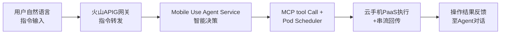

# 火山引擎Mobile Use Agent完整学习笔记

> **产品介绍页**: https://www.volcengine.com/docs/6394/1583515?lang=zh
> **产品定位**: 企业级AI智能体——运行于火山引擎云手机平台之上，依托豆包视觉大模型，专为执行移动端应用自动化任务而设计
> **核心标签**: 行业首发 Mobile AI infra 到 agent 的完整 All-In-One 解决方案

---

## 📋 目录导航

- [一、产品概述与定位](#一产品概述与定位)
- [二、六大产品优势深度解析](#二六大产品优势深度解析)
- [三、产品架构与工作原理](#三产品架构与工作原理)
- [四、四大使用场景详解](#四四大使用场景详解)
- [五、方案集成与接入方式](#五方案集成与接入方式)
- [六、关键技术洞察](#六关键技术洞察)
- [七、与同类产品对比分析](#七与同类产品对比分析)
- [八、可借鉴设计理念](#八可借鉴设计理念)
- [九、专业术语表](#九专业术语表)
- [十、相关资源链接](#十相关资源链接)

---

## 一、产品概述与定位

### 1.1 产品定位："Mobile AI infra 到 agent 的完整 All-In-One 解决方案"

Mobile Use Agent 定位为**企业级 AI 智能体**，其核心内涵包含三个维度：

| 维度 | 内涵说明 |
|------|----------|
| **企业级** | 面向 B 端客户提供生产级稳定性、并发能力、隐私安全与系统定制能力，而非个人玩具型 Agent |
| **云手机原生** | 运行于火山引擎云手机平台之上，AI 任务全程在云端手机环境执行，与本机环境完全隔离 |
| **移动端自动化** | 专为移动端应用自动化任务设计，覆盖传统纯视觉 GUI Agent 无法触达的复杂场景 |

官方明确强调："Mobile Use Agent 是行业首发 Mobile AI infra 到 agent 的完整 All-In-One 解决方案"——这一表述暗示产品不仅提供 Agent 能力本身，更打通了从底层基础设施（云手机 ARM 集群）到中间件（PaaS 调度）再到上层 Agent 应用的全链路。

### 1.2 核心价值主张

| 价值支柱 | 核心内涵 | 支撑能力 |
|---------|---------|---------|
| **精准执行** | 视觉识别 + 系统级指令 + 三方工具调用三模式协同 | 豆包视觉大模型、MCP 协议、系统级 API |
| **资源隔离** | 任务在云端手机执行，不占用本机资源、不中断本机操作 | 云手机 PaaS、独立实例隔离 |
| **全平台覆盖** | PC（Web/Mac/Windows）+ 移动端（Android/iOS）全平台协同 | 跨端串流、统一交互层 |
| **高并发** | 多云手机实例并行执行多任务，告别串行等待 | 智能调度、Pod Scheduler、弹性扩缩容 |
| **隐私安全** | 数据存储、传输、计算全流程加密 | Jeddak AICC 集成 |

### 1.3 与 ACEP 云手机的关系

Mobile Use Agent 与火山引擎 [ACEP 云手机](./volcengine-acep-cloudphone-analysis.md) 是"上层应用 + 底层基础设施"的协同关系：

| 关系维度 | ACEP 云手机 | Mobile Use Agent |
|---------|-----------|-----------------|
| **层级** | IaaS + PaaS 基础设施 | Agent 应用层 |
| **目标用户** | 业务开发者、运维人员 | AI 应用开发商、企业终端用户 |
| **核心能力** | 提供云手机实例、串流、管理 | 提供自然语言→移动端自动化的智能体能力 |
| **依赖关系** | 独立产品 | 依赖 ACEP 作为运行时环境 |

> 💡 **设计启示**：Mobile Use Agent 体现了"基础设施产品化→上层 Agent 产品化"的演递路径——ACEP 提供通用云手机能力，Mobile Use Agent 在其之上构建垂直场景的 Agent 解决方案，复用底层能力的同时通过 Agent 抽象层降低用户使用门槛。

### 1.4 接入方式演进（重要变更）

> ⚠️ **重要提示**：原 veFaaS 接入方式将下线，需升级至 OpenAPI 接入。

| 接入方式 | 状态 | 适用场景 |
|---------|------|---------|
| **veFaaS**（旧） | 即将下线 | 历史用户，需迁移 |
| **Mobile Use Agent OpenAPI**（新） | 推荐 | 标准生产接入 |
| **控制台** | 推荐 | 快速体验与配置 |
| **Mobile Use 代码框架** | 可选 | 二次开发 |
| **Mobile Use Agent SDK** | 可选 | 深度集成 |
| **Mobile Use Agent MCP** | 可选 | 兼容 MCP 协议的 Agent 任务 |

---

## 二、六大产品优势深度解析

### 2.1 视觉+指令双驱动（核心差异化能力）

**官方表述**：支持视觉识别触控操作、系统级指令和三方工具调用，实现更精准快速的任务执行，覆盖传统纯视觉 GUI Agent 无法触达的复杂场景。

| 驱动模式 | 工作原理 | 适用场景 | 局限性 |
|---------|---------|---------|--------|
| **视觉识别触控** | 多模态 LLM 解析界面截图，定位 UI 元素并模拟点击 | 动态界面、无 API 暴露的 APP | 受界面渲染速度影响，OCR/目标识别可能误判 |
| **系统级指令** | 直接调用云手机系统 API（如安装/启动 APP、设置权限） | 系统级操作、性能敏感任务 | 需要系统权限，部分场景受限 |
| **三方工具调用** | 通过 MCP 协议调用预集成的云手机常用工具 | 复合任务、跨应用工作流 | 依赖工具生态成熟度 |

> 🔍 **洞察**：双驱动模式是 GUI Agent 领域的重要工程化突破——纯视觉方案（如早期 AppAgent、SeeAct）存在"看不准、点不快"问题，纯指令方案受限于 APP 是否暴露 API。Mobile Use Agent 通过多模态 LLM 动态决策"何时用视觉、何时用指令"，类似 Anthropic Computer Use 的"动作类型自适应"思路。

### 2.2 云手机环境隔离

**核心价值**：AI 任务全程在云端手机环境执行，任务运行期间不中断本机任何操作，且不占用用户本机资源。

| 隔离维度 | 传统本机 Agent | Mobile Use Agent |
|---------|--------------|-----------------|
| **设备占用** | 占用本机屏幕、CPU、内存 | 完全不占用本机资源 |
| **任务中断** | 任务运行期间无法使用本机 | 本机可自由使用 |
| **环境一致性** | 受本机系统版本、APP 版本影响 | 云端标准化环境 |
| **并发能力** | 单设备串行执行 | 多云手机实例并行 |

### 2.3 环境适配与系统定制能力

摆脱本机系统权限限制，同时支持根据业务需求定制专属系统环境，适配更多复杂场景。

- **权限突破**：云手机 root 权限、系统级权限可定制，突破本机沙箱限制
- **系统镜像定制**：可预装特定 APP、配置特定系统版本
- **网络环境定制**：可配置代理、网络拦截、DNS 等

### 2.4 全平台跨端支持

| 端 | 形态 | 主要场景 |
|----|------|---------|
| **PC Web** | 浏览器访问 | 办公场景、开发调试 |
| **Mac** | 客户端 | 设计、开发场景 |
| **Windows** | 客户端 | 企业办公场景 |
| **Android** | APP | 移动办公、现场场景 |
| **iOS** | APP | 移动办公、现场场景 |

### 2.5 高并发任务处理能力

支持用户终端侧利用多个云手机环境，实现多任务同步运行，告别串行等待模式。

> 💡 **架构启示**：高并发的核心是 Pod Scheduler + 弹性云手机集群——这与 K8s 调度器思路一致，将"云手机实例"抽象为可调度 Pod，按任务负载自动扩缩容。对 Agent 平台而言，这是从"单 Agent 串行执行"到"Agent 任务队列并行处理"的关键能力。

### 2.6 全链路隐私安全保障

集成 [Jeddak AICC](https://www.volcengine.com/docs/85010/1408106) 解决方案，对用户隐私数据的存储、传输、计算全流程进行加密保护。

| 安全维度 | 保护措施 |
|---------|---------|
| **存储** | 数据加密存储，密钥分离管理 |
| **传输** | TLS 加密通道，端到端传输保护 |
| **计算** | 可信执行环境（TEE），密文计算 |

---

## 三、产品架构与工作原理

### 3.1 三层产品架构

Mobile Use Agent 采用经典的"IaaS + PaaS + SaaS"分层设计：

```
┌─────────────────────────────────────────────────┐
│  Agent 交互层（SaaS）                            │
│  ┌──────────┬──────────┬──────────┬──────────┐ │
│  │ Demo     │ MCP      │ 代码框架 │ SDK      │ │
│  │ 免费体验 │ MCP工具  │ 快速搭建 │ 业务集成 │ │
│  └──────────┴──────────┴──────────┴──────────┘ │
├─────────────────────────────────────────────────┤
│  PaaS 调度层                                     │
│  ┌────────┬────────┬────────┬────────┐         │
│  │ 智能调度│ 模型服务│ 流媒体 │ 监控运维│        │
│  │ 资源分配│ 方舟 LLM│ 串流   │ 日志    │        │
│  └────────┴────────┴────────┴────────┘         │
├─────────────────────────────────────────────────┤
│  IaaS 资源层                                     │
│  ┌────────┬────────┬────────┬────────┬────────┐│
│  │ 云手机 │ 弹性计算│ 网络   │ 存储   │ 安全   ││
│  │ ARM集群│ 扩缩容  │ 低延迟 │ TOS    │ 隔离   ││
│  └────────┴────────┴────────┴────────┴────────┘│
└─────────────────────────────────────────────────┘
```

| 层级 | 核心组件 | 职责 |
|------|---------|------|
| **Agent 交互层** | Demo / MCP / 代码框架 / SDK | 面向用户的智能交互层，提供自然语言交互和任务编排能力 |
| **PaaS 调度层** | 智能调度 / 模型服务 / 流媒体 / 监控运维 | 提供中间件服务和智能调度能力，连接底层资源与上层应用 |
| **IaaS 资源层** | 云手机集群 / 弹性计算 / 网络 / 存储 / 安全 | 提供稳定可靠的计算和存储资源 |

### 3.2 Agent 交互层的四种接入方式

| 接入方式 | 适用场景 | 复杂度 |
|---------|---------|--------|
| **Mobile Use Agent Demo** | 免费快速体验，支持多端试用 | ★（最低） |
| **Mobile Use Agent MCP** | 面向 Agent 任务，预集成云手机常用工具，兼容标准 MCP 协议 | ★★ |
| **Mobile Use 代码框架** | 使用示例代码快速搭建 Agent 并添加业务逻辑 | ★★★ |
| **Mobile Use Agent SDK** | 通过 SDK 集成进业务，`agent.run()` 一行调用 | ★★★ |

### 3.3 工作原理（5 步流程）

以"用户让云手机打开某 APP 并点击按钮"为例：



| 步骤 | 组件 | 关键动作 |
|------|------|---------|
| **1. 指令输入** | Agent 对话聊天 | 用户发送自然语言（如"帮我打开 xxx APP"） |
| **2. 指令传输** | 火山 APIG 网关 | 转发指令到 Mobile Use Agent Service |
| **3. 智能决策** | Prompt + Memory + 多模态 LLM | Prompt 模块构建提示词，结合 Memory 上下文，LLM 生成"打开 APP→点击按钮"操作逻辑 |
| **4. 操作调度** | MCP tool Call + Pod Scheduler | MCP 调用接口转化操作逻辑为指令，Pod Scheduler 分配可用云手机实例 |
| **5. 执行与反馈** | 云手机 PaaS + 串流 | 执行操作并实时回传画面，结果反馈至 Agent 对话 |

---

## 四、四大使用场景详解

### 4.1 通用/垂直领域 Agent 开发

| 维度 | 详情 |
|------|------|
| **客户类型** | AI 应用开发商、互联网平台、垂直行业 SaaS 服务提供商 |
| **典型场景** | 手机端通用智能助手、车机端智能助手、电商智能购物助手、出行智能规划助手 |
| **方案优势** | 快速构建具备实际执行能力的 AI 助手，无需逐一对接各平台 MCP |
| **核心能力** | 多平台数据整合、智能决策引擎、端到端服务闭环、个性化体验 |

### 4.2 APP 自动化测试

| 维度 | 详情 |
|------|------|
| **客户类型** | 移动应用开发商、应用测试公司、质量保障团队 |
| **典型场景** | 需要自然语言理解和画面执行，而非单纯跑固定操作流程的测试 |
| **方案优势** | 大幅降低测试成本，提升测试覆盖率，缩短产品发布周期 |
| **核心能力** | 功能回归测试、用户体验测试 |

### 4.3 内容审核与合规检测

| 维度 | 详情 |
|------|------|
| **客户类型** | 社交平台、内容平台、监管科技公司 |
| **典型场景** | 移动端应用侧内容的大规模自动化审核和合规检测 |
| **方案优势** | 提升审核效率，降低人工成本，确保合规要求的及时响应 |
| **核心能力** | 多平台内容监控、实时合规检测、证据收集保全 |

### 4.4 AI 数据收集与训练

| 维度 | 详情 |
|------|------|
| **客户类型** | 视觉理解模型开发与训练公司、数据服务商、科研院所 |
| **典型场景** | 收集大量移动端交互数据用于大模型训练与 Agent 训练开发 |
| **方案优势** | 快速获得高质量训练数据，加速 AI 模型迭代和优化 |
| **核心能力** | UI 交互数据收集、用户行为模拟、多模态数据获取、数据清洗标注 |

> 🔍 **场景洞察**：四大场景呈"由软到硬"递进——Agent 开发是上层应用、自动化测试是工程能力、内容审核是合规场景、数据收集反哺模型训练。第四个场景尤其值得关注：Mobile Use Agent 本身是豆包视觉大模型驱动的，但其生成的"移动端交互轨迹数据"又可反过来用于训练下一代视觉模型，形成数据飞轮。

---

## 五、方案集成与接入方式

### 5.1 接入入口

| 入口 | 用途 | 链接 |
|------|------|------|
| **Web Demo** | 免费快速体验 | https://console.volcengine.com/vefaas/region:vefaas+cn-beijing/market/mobile |
| **控制台指南** | 完整控制台使用文档 | [Mobile Use Agent 控制台指南](https://www.volcengine.com/docs/6394/2280699) |
| **OpenAPI 概览** | 接口文档 | [Mobile Use Agent OpenAPI 概览](https://www.volcengine.com/docs/6394/1953040) |
| **调用示例** | 快速接入 | [调用示例](https://www.volcengine.com/docs/6394/2091709) |

### 5.2 体验流程

1. 阅读 [Mobile Use Agent 体验版用户协议](https://www.volcengine.com/docs/6394/1583516)，勾选同意
2. 点击"立即体验"进入体验界面
3. 使用自然语言输入任务（可参考快捷任务提示）
4. 关注右侧云手机画面，核实每一步操作行为
5. （可选）通过"问卷反馈"提交意见

### 5.3 OpenAPI 核心能力

Mobile Use Agent OpenAPI 提供移动端使用的智能代理任务管理接口，主要包括：

- **配置管理**：实例配置、权限配置、环境配置
- **任务执行**：任务提交、任务查询、任务取消
- **回调处理**：任务状态回调、结果回调

---

## 六、关键技术洞察

### 6.1 MCP 协议在 Mobile Use Agent 中的应用

Mobile Use Agent 明确提到"Mobile Use Agent MCP：面向 Agent 任务预集成云手机常用工具，兼容标准 MCP 协议"。

| MCP 应用维度 | 在 Mobile Use Agent 中的体现 |
|-------------|----------------------------|
| **工具暴露** | 云手机常用操作（如安装 APP、启动 APP、点击坐标、滑动、截图）被封装为 MCP tool |
| **协议兼容** | 任何兼容 MCP 协议的 Agent 框架（如 Claude Desktop、Cursor）都可调用 |
| **任务编排** | 多模态 LLM 决策何时调用哪个 MCP tool，形成任务执行链 |

> 💡 **与本项目的关联**：本项目 [agent-communication-protocols/01-mcp.md](../01-agent-protocols-interfaces/agent-communication-protocols/01-mcp.md) 系统介绍了 MCP 协议规范，Mobile Use Agent 是 MCP 在生产级移动端 Agent 产品中的典型落地案例，可作为"工业实践"参考。

### 6.2 "视觉+指令"双驱动的工程价值

| 对比维度 | 纯视觉 GUI Agent | 纯指令 Agent | Mobile Use Agent 双驱动 |
|---------|-----------------|-------------|----------------------|
| **界面适配** | 通用，依赖 OCR/目标检测 | 受限于 API 暴露程度 | 自适应选择 |
| **执行速度** | 慢（需截图+识别） | 快（直接调用） | 视任务类型动态选择 |
| **准确性** | 受界面渲染影响 | 高（API 稳定） | 视场景而定 |
| **覆盖范围** | 通用界面 | 仅 API 暴露的操作 | 全场景覆盖 |
| **典型代表** | AppAgent、SeeAct | Appium、UIAutomator | Mobile Use Agent |

### 6.3 云手机作为 Agent 运行时的架构创新

传统 Agent 运行时通常是"沙箱/容器/虚拟机"，Mobile Use Agent 选择"云手机"作为运行时，带来三大独特价值：

| 价值维度 | 传统容器运行时 | 云手机运行时 |
|---------|-------------|------------|
| **环境真实性** | 模拟环境，部分 APP 无法运行 | 完整安卓系统，应用兼容性高 |
| **隔离强度** | 容器隔离，存在逃逸风险 | 实例级隔离，安全边界清晰 |
| **可观测性** | 日志、指标 | 实时串流画面，可视化执行过程 |

### 6.4 隐私安全方案：Jeddak AICC

Jeddak AICC 是火山引擎的隐私计算解决方案，在 Mobile Use Agent 中承担"全链路隐私安全"职责：

- **AICC** = AI Confidential Computing，AI 机密计算
- **核心能力**：可信执行环境（TEE）、密文计算、密钥管理
- **应用场景**：在云手机处理用户敏感数据时，确保数据"可用不可见"

---

## 七、与同类产品对比分析

### 7.1 与纯视觉 GUI Agent 对比

| 对比维度 | Mobile Use Agent | 通用纯视觉 GUI Agent |
|---------|-----------------|--------------------|
| **运行环境** | 云手机（隔离） | 本机或模拟器 |
| **驱动方式** | 视觉+指令+MCP 三模式 | 纯视觉 |
| **并发能力** | 多实例并行 | 通常单实例 |
| **平台覆盖** | 全平台跨端 | 通常单平台 |
| **企业级能力** | 完整（安全/监控/运维） | 通常较弱 |

### 7.2 与火山引擎其他 Agent 产品的协同

| 产品 | 定位 | 与 Mobile Use Agent 关系 |
|------|------|------------------------|
| **[ACEP 云手机](./volcengine-acep-cloudphone-analysis.md)** | 云手机 IaaS/PaaS | 底层基础设施 |
| **[HiAgent](../06-business-trends-analysis/volcengine-hiagent-platform-analysis.md)** | 企业级 Agent 平台 | 互补：HiAgent 通用企业 Agent，Mobile Use Agent 专注移动端 |
| **方舟大模型** | 模型服务 | 提供 LLM 能力 |
| **Jeddak AICC** | 隐私计算 | 提供安全加密 |

### 7.3 行业定位

> "Mobile Use Agent 是行业首发 Mobile AI infra 到 agent 的完整 All-In-One 解决方案"

| 定位维度 | 含义 |
|---------|------|
| **行业首发** | 声明市场领先地位 |
| **Mobile AI infra 到 agent** | 强调全栈覆盖，从基础设施到 Agent 应用 |
| **完整 All-In-One** | 客户无需集成多个厂商组件 |
| **解决方案** | 非单一产品，而是端到端方案 |

---

## 八、可借鉴设计理念

### 8.1 三层架构分层设计

**模式**：IaaS 资源层 + PaaS 调度层 + SaaS 交互层

**借鉴价值**：任何复杂的 AI Agent 产品都可通过分层实现关注点分离——底层资源稳定可靠、中层调度智能高效、上层交互简单易用。

### 8.2 双驱动模式

**模式**：视觉识别 + 指令调用 + 工具集成（MCP）

**借鉴价值**：单一驱动模式都有边界，工程上应根据任务类型动态选择执行路径。这与 [Karpathy LLM Coding Guidelines](../02-agent-engineering-methodology/karpathy-llm-coding-guidelines/00-overview.md) 中"工具优先，代码其次"的原则一致。

### 8.3 环境隔离策略

**模式**：任务在云手机执行，本机完全不被占用

**借鉴价值**：Agent 任务隔离不仅解决资源占用问题，更带来环境一致性、安全隔离、并发能力等多重价值。本项目的 [vendor 子模块沙箱](../../operations/vendor-flexloop-integration-guide.md) 也采用类似思路。

### 8.4 接入方式分层

**模式**：Demo → MCP → 代码框架 → SDK

**借鉴价值**：从体验到深度集成的渐进式披露，与本项目 [capabilities/](../../../../.agents/capabilities/README.md) 的 L0/L1/L2 三层架构理念完全一致——L0 快速了解、L1 标准使用、L2 深度定制。

---

## 九、专业术语表

| 术语 | 全称 | 含义 |
|------|------|------|
| **Mobile Use Agent** | - | 火山引擎移动端使用智能体 |
| **ACEP** | Auto-Cloud-End-Platform | 火山引擎云手机产品 |
| **MCP** | Model Context Protocol | 模型上下文协议，Agent 工具调用标准 |
| **Jeddak AICC** | AI Confidential Computing | 火山引擎 AI 机密计算解决方案 |
| **TEE** | Trusted Execution Environment | 可信执行环境 |
| **veFaaS** | Volcano Engine Function as a Service | 火山引擎函数计算服务 |
| **APIG** | API Gateway | API 网关 |
| **TOS** | Tinder Object Storage | 火山引擎对象存储 |
| **Pod Scheduler** | - | 容器组调度器，借鉴 K8s 概念 |
| **GUI Agent** | Graphical User Interface Agent | 图形界面智能体 |

---

## 十、相关资源链接

### 10.1 原始资源

- [Mobile Use Agent 解决方案介绍（本文档来源）](https://www.volcengine.com/docs/6394/1583515?lang=zh)
- [Mobile Use Agent 控制台指南](https://www.volcengine.com/docs/6394/2280699)
- [Mobile Use Agent OpenAPI 概览](https://www.volcengine.com/docs/6394/1953040)
- [调用示例](https://www.volcengine.com/docs/6394/2091709)
- [接入方式变更公告](https://www.volcengine.com/docs/6394/2275218)

### 10.2 关联产品文档

- [Jeddak AICC 文档](https://www.volcengine.com/docs/85010/1408106)
- [Web Demo 体验入口](https://console.volcengine.com/vefaas/region:vefaas+cn-beijing/market/mobile)
- [Mobile Use Agent 体验版用户协议](https://www.volcengine.com/docs/6394/1583516)

### 10.3 本项目内相关 wiki

- [火山引擎云手机（ACEP）完整学习笔记](./volcengine-acep-cloudphone-analysis.md) - Mobile Use Agent 的底层基础设施
- [火山引擎 HiAgent 平台分析](../06-business-trends-analysis/volcengine-hiagent-platform-analysis.md) - 火山引擎企业级 Agent 平台
- [MCP 协议深度解析](../01-agent-protocols-interfaces/agent-communication-protocols/01-mcp.md) - Mobile Use Agent 依赖的协议标准
- [Agent 通信协议全景](../01-agent-protocols-interfaces/agent-communication-protocols/00-overview.md) - MCP 在协议生态中的定位
- [Karpathy LLM Coding Guidelines](../02-agent-engineering-methodology/karpathy-llm-coding-guidelines/00-overview.md) - 工具优先原则的理论基础

### 10.4 联系方式

- **售前服务热线**：400-034-7888（7×12 小时）
- [业务咨询](https://www.volcengine.com/contact/product-acep)
- [提交工单](https://console.volcengine.com/workorder/create?step=2&SubProductID=P00000173)
