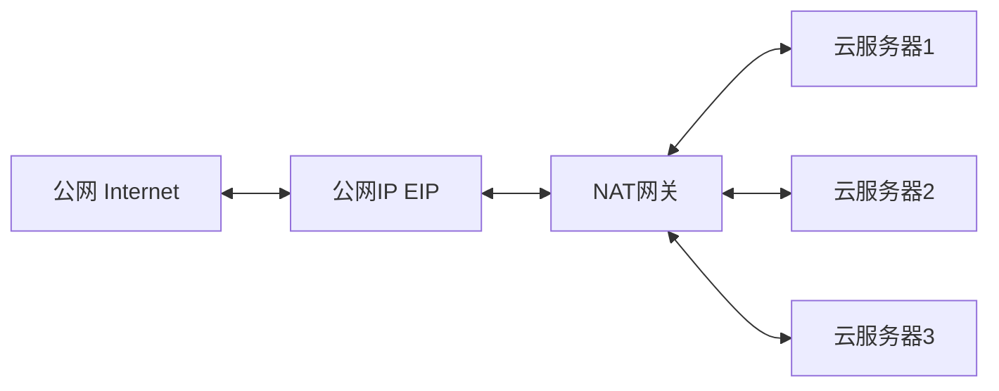
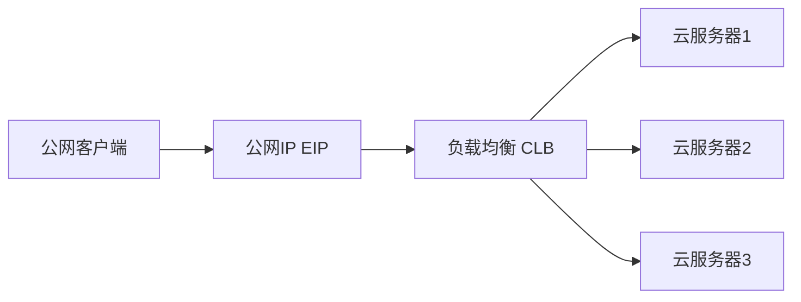
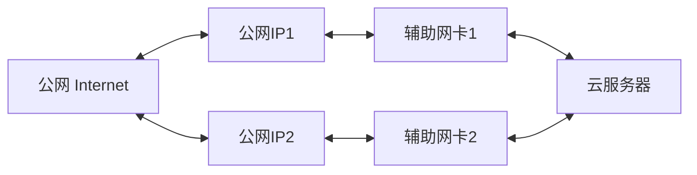
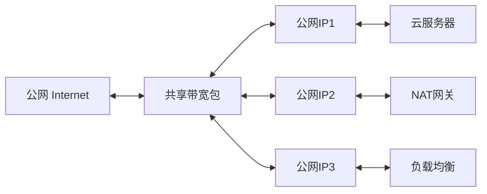
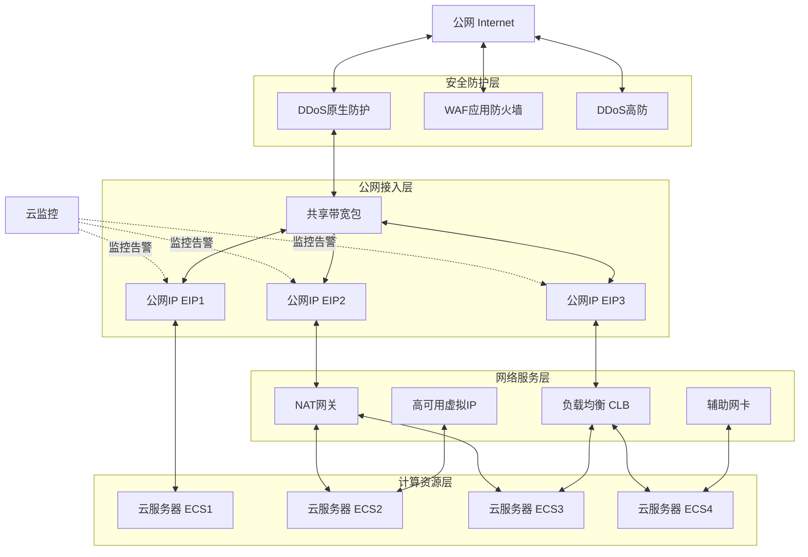

# 火山引擎公网IP（EIP）完整学习笔记

> **产品介绍页**: https://www.volcengine.com/product/eip
> **产品定位**: 可独立购买和持有的公网IP地址连通服务——为云服务器、NAT网关、负载均衡等云资源提供公网互通能力
> **核心价值**: 灵活接入（跨域互访无需专线）、高可用（跨可用区容灾无单点故障）、易于管理（灵活绑定解绑带宽即时调整）、更低成本（多种计费模式+共享带宽包）

---

## 📋 目录导航

- [一、产品定位与核心价值主张](#一产品定位与核心价值主张)
- [二、四大产品优势深度剖析](#二四大产品优势深度剖析)
- [三、四大核心产品功能解析](#三四大核心产品功能解析)
- [四、技术参数与规格整理](#四技术参数与规格整理)
- [五、云资源绑定关系梳理](#五云资源绑定关系梳理)
- [六、应用场景与网络架构](#六应用场景与网络架构)
- [七、安全防护体系分析](#七安全防护体系分析)
- [八、计费模式与成本优化策略](#八计费模式与成本优化策略)
- [九、配额与限制参数](#九配额与限制参数)
- [十、相关产品生态与协同关系](#十相关产品生态与协同关系)
- [十一、客户案例解读](#十一客户案例解读)
- [十二、网页信息架构与UX设计分析](#十二网页信息架构与ux设计分析)
- [十三、B端云网络产品展示设计模式总结](#十三b端云网络产品展示设计模式总结)
- [十四、术语表与参考文档](#十四术语表与参考文档)

---

## 一、产品定位与核心价值主张

### 1.1 产品核心定位

公网IP（Elastic IP Address，EIP）及其公网出口带宽，是火山引擎为云资源提供的**可独立购买和持有的IP连通服务**。

公网IP作为独立的云资源，可以不依赖于其他云资源单独购买持有，通过与云服务器、NAT网关、负载均衡、辅助网卡等云资源绑定，为云资源提供公网互通能力，满足多种业务场景的公网访问需求。

### 1.2 基本概念

| 概念 | 说明 |
|------|------|
| **中文名称** | 公网IP |
| **英文名称** | Elastic IP Address（EIP） |
| **核心定义** | 可独立购买和持有的公网IP地址连通服务 |
| **绑定关系** | 通过与云资源绑定实现云资源与公网的连接 |
| **支持绑定资源** | 云服务器（ECS/EBM裸金属/GPU云服务器）、公网NAT网关、传统型负载均衡、辅助网卡等组件 |

### 1.3 核心价值主张

#### 灵活接入（跨域互访）

通过绑定公网IP实现不同地域的云资源互访，无需通过专线或VPN等额外的网络设备和配置，大幅简化网络架构。用户可以快速构建跨地域的网络互通能力，降低网络部署复杂度。

#### 高可用（跨区容灾）

底层架构具备高可靠性，无单点故障，支持跨可用区容灾，提供稳定的公网访问服务。在多活容灾场景中，主备云服务器实时同步应用和资源，故障时公网IP可快速解绑并绑定至备用云服务器，无需修改DNS服务，保证服务连续性。

#### 易于管理（配置灵活）

- 支持灵活绑定和解绑多种云资源（含云服务器、NAT网关、私网负载均衡、辅助网卡）
- 可根据业务需求随时调整公网IP的带宽上限，调整立即生效
- 提供多种计费策略，可按需选择购买方式，并在不再需要时释放实例

#### 更低成本（计费丰富）

- 支持包年包月和按量计费两种计费模式，灵活满足不同客户的业务场景
- 按量计费公网IP支持加入共享带宽包，多个公网IP共用一条带宽，提高带宽复用率，降低整体公网成本
- 按需调整带宽规格，避免资源闲置浪费

### 1.4 核心功能概览

| 功能模块 | 核心能力 |
|----------|----------|
| **灵活管理** | 多种计费策略，按需调整带宽，支持实例释放 |
| **弹性使用** | 可与云服务器、NAT网关、负载均衡等云资源绑定，实现公网通信 |
| **资源丰富** | 同时接入多家运营商线路，可灵活申请不同线路类型公网IP，保障通信快速稳定 |
| **安全防护** | DDoS基础防护默认开启，支持加入DDoS原生防护，获得低延时、Tbps级别的防护能力 |

### 1.5 快速入口链接

| 入口类型 | 链接 |
|----------|------|
| **立即使用** | [https://console.volcengine.com/eip](https://console.volcengine.com/eip) |
| **价格计算器** | [https://www.volcengine.com/pricing?product=EIP&tab=2](https://www.volcengine.com/pricing?product=EIP&tab=2) |
| **产品文档** | [https://www.volcengine.com/docs/6402/67936](https://www.volcengine.com/docs/6402/67936) |
| **立即咨询** | [https://www.volcengine.com/contact/product?t=%E5%85%AC%E7%BD%91IP&source=%E4%B8%9A%E5%8A%A1%E5%92%A8%E8%AF%A2](https://www.volcengine.com/contact/product?t=%E5%85%AC%E7%BD%91IP&source=%E4%B8%9A%E5%8A%A1%E5%92%A8%E8%AF%A2) |

---

## 二、四大产品优势深度剖析

### 2.1 优势一：灵活接入（跨域互访）

| 维度 | 详细说明 |
|------|----------|
| **技术支撑点** | 通过绑定公网IP实现不同地域的云资源互访，无需部署专线或VPN等额外网络设备和配置 |
| **业务价值** | 大幅简化网络架构，降低网络部署复杂度和成本；用户可快速构建跨地域网络互通能力 |
| **典型适用场景** | 跨地域业务部署、多地域资源互通、分布式系统跨区域通信 |

---

### 2.2 优势二：高可用（跨区容灾）

| 维度 | 详细说明 |
|------|----------|
| **技术支撑点** | 底层架构无单点故障设计，支持跨可用区容灾；故障时公网IP可快速解绑并绑定至备用云资源 |
| **业务价值** | 提供稳定的公网访问服务；故障切换无需修改DNS配置，大幅缩短故障恢复时间，保障业务连续性 |
| **典型适用场景** | 多活容灾架构、高可用业务部署、业务连续性保障、核心业务系统容灾 |

---

### 2.3 优势三：易于管理（配置灵活）

| 维度 | 详细说明 |
|------|----------|
| **技术支撑点** | 支持灵活绑定解绑多种云资源（云服务器、NAT网关、负载均衡、辅助网卡）；带宽即时调整，立即生效；支持实例按需释放 |
| **业务价值** | 运维便捷高效，资源可按需调配，快速响应业务变化；无需复杂网络规划即可实现资源弹性调整 |
| **典型适用场景** | 弹性业务场景、资源动态调整、快速扩缩容、业务上云与迁移 |

#### 支持绑定的云资源清单：
- 云服务器（ECS/EBM裸金属/GPU云服务器）
- 公网NAT网关
- 传统型负载均衡
- 辅助网卡

---

### 2.4 优势四：更低成本（计费丰富）

| 维度 | 详细说明 |
|------|----------|
| **技术支撑点** | 提供包年包月+按量计费双模式；按量计费公网IP支持加入共享带宽包，多IP共用带宽；带宽规格可按需调整 |
| **业务价值** | 灵活满足不同业务场景的计费需求；带宽复用提高资源利用率，降低整体公网成本；避免资源闲置浪费 |
| **典型适用场景** | 稳定生产业务、弹性波动业务、多IP公网出口场景、成本敏感型业务 |

#### 成本优化建议：
| 业务类型 | 推荐计费模式 | 优化策略 |
|----------|-------------|----------|
| 稳定业务 | 包年包月 | 长期使用享受折扣，降低单位成本 |
| 波动业务 | 按量计费 | 按实际使用量付费，避免资源闲置 |
| 多IP场景 | 共享带宽包 | 多公网IP共用带宽，提高复用率 |

---

**信息来源**：
- 产品页面：https://www.volcengine.com/product/eip
- 产品文档：https://www.volcengine.com/docs/6402/67936

---

## 三、四大核心产品功能解析

### 3.1 功能一：灵活管理

#### 功能详情

| 功能点 | 详细说明 |
|--------|----------|
| **多种计费策略** | 支持三种计费方式： • 包年包月：预付费模式，适合长期稳定业务 • 按带宽上限：按固定带宽规格计费，带宽稳定可预测 • 按实际流量：按实际产生的流量计费，适合流量波动场景 |
| **按需调整带宽** | 支持随时调整公网IP的带宽上限，调整操作立即生效，无需重启或等待配置同步，快速响应业务带宽需求变化 |
| **实例生命周期管理** | 提供完整的实例管理能力： • 申请：独立购买公网IP实例 • 绑定：将公网IP关联至目标云资源 • 解绑：将公网IP与云资源分离 • 释放：不再需要时释放实例，停止计费 |

#### 核心价值

> **资源弹性调配，避免资源浪费**

- **成本可控**：多种计费策略灵活选择，匹配不同业务模型，优化成本支出
- **响应迅速**：带宽即时调整，秒级生效，快速应对业务突发流量
- **运维便捷**：全生命周期管理能力，资源申请、使用、释放流程清晰可控
- **避免闲置**：按需使用、按需释放，杜绝资源长期闲置造成的浪费

---

### 3.2 功能二：弹性使用

#### 功能详情

| 功能点 | 详细说明 |
|--------|----------|
| **支持绑定的云资源类型** | 公网IP可绑定至以下云资源，为其提供公网连通能力： • 云服务器（ECS）：通用云服务器实例 • 弹性裸金属服务器（EBM）：高性能裸金属实例 • GPU云服务器：GPU加速计算实例 • NAT网关：为公网NAT网关提供公网出口 • 传统型负载均衡：为负载均衡实例提供公网接入 • 辅助网卡：弹性网卡可绑定公网IP • 高可用虚拟IP：为HA场景提供公网接入能力 |
| **灵活解绑重绑** | 公网IP支持与当前绑定资源解绑后，重新绑定至其他云资源，IP地址保持不变，实现在不同云资源间的灵活切换 |

#### 支持绑定资源清单

| 资源类别 | 具体资源类型 | 典型应用场景 |
|----------|-------------|-------------|
| 计算资源 | 云服务器ECS、弹性裸金属EBM、GPU云服务器 | 单实例公网访问、应用服务器对外服务 |
| 网关资源 | NAT网关 | VPC内多实例统一公网出口、SNAT/DNAT |
| 负载均衡 | 传统型负载均衡 | 业务流量分发、多实例负载均衡 |
| 网络资源 | 辅助网卡、高可用虚拟IP | 高可用架构、多网卡场景、主备切换 |

#### 核心价值

> **一个IP可服务于不同资源，适配业务变化**

- **架构灵活**：同一公网IP可在不同资源间切换，无需重新配置DNS或业务地址
- **快速容灾**：业务故障时可快速将IP切换至备用资源，缩短恢复时间
- **业务平滑迁移**：资源升级、迁移时保持公网入口地址不变，对客户端无感知
- **资源复用**：IP资源可重复利用，提高资源利用率，降低管理复杂度

---

### 3.3 功能三：资源丰富

#### 功能详情

| 功能点 | 详细说明 |
|--------|----------|
| **多运营商线路接入** | 同时接入国内多家主流运营商网络（电信、联通、移动等），实现多线网络覆盖 |
| **BGP（多线）线路** | 推荐使用BGP线路类型： • 使用BGP协议实现多线路互联 • 自动选择最优路由路径 • 保障跨运营商访问的低延时和稳定性 • 用户无需配置多IP或多线路 |

#### 线路类型对比

| 线路类型 | 技术特点 | 适用场景 | 访问质量 |
|----------|---------|---------|---------|
| **BGP（多线）** | BGP协议动态选路，多运营商互联 | 推荐通用场景，面向全国用户业务 | 跨运营商访问最优，延时低，稳定性高 |
| 单线 | 单运营商线路接入 | 特定运营商用户群体场景 | 对应运营商访问质量好，跨网一般 |

#### 核心价值

> **优质网络质量，跨运营商访问体验好**

- **全国覆盖**：多运营商接入，覆盖全国各地区用户群体
- **智能选路**：BGP协议自动选择最优路径，避免跨网绕行
- **体验一致**：无论用户使用哪家运营商网络，均能获得良好的访问速度和稳定性
- **降低复杂度**：无需购买多个IP分别配置不同线路，一个BGP IP解决多线接入问题

---

### 3.4 功能四：安全防护

#### 功能详情

| 功能点 | 详细说明 |
|--------|----------|
| **DDoS基础防护** | 默认开启，无需额外配置，为公网IP提供基础DDoS攻击防护能力，抵御常见小规模网络攻击 |
| **DDoS原生防护（邀测）** | 提供Tbps级海量DDoS攻击防护能力： • 防护容量大，可抵御超大规模流量攻击 • 低延时转发，不影响正常业务访问体验 • 原生接入，无需改变网络架构 • 注：当前处于邀测阶段，需申请开通 |
| **WAF/高防接入** | 公网IP支持作为源站IP接入Web应用防火墙（WAF）和DDoS高防服务，构建多层次安全防护体系 |

#### 安全防护体系分层

| 防护层级 | 防护能力 | 适用场景 | 状态 |
|----------|---------|---------|------|
| **第一层：DDoS基础防护** | 基础流量清洗，常见攻击防护 | 所有公网IP默认启用，基础安全保障 | 默认开启 |
| **第二层：DDoS原生防护** | Tbps级大容量防护，低延时 | 有大流量攻击风险的重要业务 | 邀测中 |
| **第三层：WAF/高防** | Web应用防护+高级DDoS防护 | 核心业务系统、Web应用、高安全需求场景 | 可接入 |

#### 核心价值

> **多层次安全防护，抵御网络攻击**

- **开箱即用**：基础防护默认开启，无需配置即可获得基础安全保障
- **纵深防御**：多层次防护体系，从基础到高级满足不同安全等级需求
- **大容量防护**：Tbps级防护能力，轻松应对大规模DDoS攻击
- **低影响**：原生防护低延时转发，防护开启不影响正常业务性能
- **灵活扩展**：可无缝对接WAF和高防服务，构建完整安全防护链

---

## 四、技术参数与规格整理

### 4.1 线路类型

火山引擎公网IP提供BGP（多线）作为默认推荐线路类型，如需其他线路类型需联系客户经理。

| 线路类型 | 是否默认 | 技术特点 | 适用说明 |
|----------|---------|---------|---------|
| **BGP（多线）** | 是 | 使用BGP协议实现多运营商互联，自动选择最优路由路径，跨网访问延时低、稳定性高 | 推荐线路类型，默认选择，适用于面向全国用户的通用业务场景 |
| **其他线路** | 否 | 单运营商线路接入 | 需联系客户经理咨询开通，适用于特定运营商用户群体场景 |

### 4.2 带宽规格

公网IP带宽为对称带宽，分别应用于上行带宽和下行带宽。不同计费方式下的带宽规格限制如下：

| 计费方式 | 申请时带宽上限 | 规格变更时带宽上限 |
|---------|--------------|------------------|
| 按量计费-按实际流量计费 | 1 ~ 200 Mbps | 1 ~ 200 Mbps |
| 按量计费-按带宽上限计费 | 1 ~ 500 Mbps | 1 ~ 1000 Mbps |
| 包年包月 | 1 ~ 500 Mbps | 1 ~ 1000 Mbps |

> **说明**：带宽分别应用于上行带宽和下行带宽，即上下行带宽对称，设置的带宽值对入方向和出方向同时生效（受出入带宽规则影响）。

### 4.3 出入带宽规则

公网IP的入方向和出方向带宽遵循以下规则：

| 带宽设置值 | 入方向带宽 | 出方向带宽 | 备注 |
|-----------|-----------|-----------|------|
| ≤ 10 Mbps | 10 Mbps（默认分配） | 与设置值一致 | 保障小带宽用户的入方向访问体验 |
| > 10 Mbps | 与设置值一致 | 与设置值一致 | 带宽对称 |

**额外说明**：
- 当按量计费EIP绑定云服务器时，地域级限速生效
- 出方向带宽始终与用户设置的带宽上限保持一致

### 4.4 地域级带宽限制

按量计费公网IP受地域级带宽限制约束，加入共享带宽包后相关限制失效：

| 限制项 | 上限 | 生效对象 |
|-------|------|---------|
| 地域级出向带宽上限 | 5 Gbps | 按实际流量计费的公网IP |
| 地域级入向带宽上限 | 5 Gbps | 按实际流量计费的公网IP |
| 地域级带宽购买上限 | 50 Gbps | 所有公网IP和IPv6公网带宽总和 |

> **说明**：公网IP加入共享带宽包后，地域级出入带宽上限失效，所有公网IP共用共享带宽包的带宽资源。

### 4.5 带宽提升说明

如需获得更高的公网带宽能力，可通过以下方式实现：

1. **加入共享带宽包**：将公网IP加入共享带宽包，多个公网IP共享大带宽资源，突破单IP带宽上限限制
2. **咨询客户经理**：如有特殊带宽需求（超过1000Mbps的单IP带宽或其他定制需求），可联系火山引擎客户经理沟通解决方案

---

## 五、云资源绑定关系梳理

### 5.1 支持绑定的云资源类型

| 云资源类型 | 说明 | 绑定数量限制 |
|-----------|------|------------|
| 云服务器（ECS/EBM/GPU） | 包括ECS云服务器、EBM裸金属服务器、GPU云服务器 | 单EIP同时仅绑定1台 |
| 公网NAT网关 | 实现多台ECS共享公网IP | 单个NAT网关最多绑定10个EIP，至少1个 |
| 传统型负载均衡（CLB） | 公网流量分发到后端服务器 | 单个LB同时仅绑定1个EIP |
| 辅助网卡 | 实现单台ECS多公网IP | 单台ECS可挂载多张辅助网卡 |
| 高可用虚拟IP | 高可用场景使用 | - |
| IP地址（邀测） | 直接绑定私有网络中的IP地址（邀测中） | 需联系客户经理申请 |

### 5.2 通用绑定规则

- 单个公网IP在同一时间仅支持绑定1个同地域的云资源
- 公网IP与云服务器绑定后，作为云服务器的子资源
- 云服务器变更项目时，公网IP随之变更项目
- 已申请的公网IP地址不支持修改
- 公网IP仅支持绑定状态为运行中和已停止的云服务器

### 5.3 特殊功能说明

- **EIP直通功能**（邀测）：开启后可在云服务器网卡上直接查看公网IP地址，需配置EIP直通脚本（邀测中，需联系客户经理）
- **随实例释放**：按量计费EIP绑定ECS时，可设置随ECS释放（系统回收/主动释放行为说明）
- **系统自动创建的EIP**：如创建公网负载均衡时自动创建的EIP，生命周期跟随实例，仅支持修改标签，不支持绑定/解绑/删除等操作

### 5.4 不同绑定方式的适用场景

- 绑定云服务器：单个ECS需要独立公网IP
- 绑定NAT网关：多台ECS共享公网IP，统一出口
- 绑定负载均衡：高可用公网服务，流量分发
- 绑定辅助网卡：单台ECS多公网IP，多业务部署
- 绑定高可用虚拟IP：主备切换场景

---

## 六、应用场景与网络架构

### 场景1：单个云资源访问公网

**场景描述**：公网IP绑定云服务器实例，实现云服务器实例与公网互通。适用于单台云服务器需要独立公网出口的场景，如开发测试环境、小型应用部署、独立运维节点等。

**网络架构图**：

**架构优势**：
- 简单直接：架构极简，无需额外网关设备
- 独立公网出口：单台云服务器拥有独立公网IP，不与其他资源共享
- 配置便捷：绑定操作简单，即绑即用，快速开通公网访问能力

**相关产品**：云服务器

---

### 场景2：多个云资源共享公网（NAT网关）

**场景描述**：公网IP绑定公网NAT网关，通过SNAT/DNAT规则，实现多台云服务器共享公网IP访问公网或向公网提供服务。适用于VPC内大量云服务器需要统一公网出口、内网资源隐藏的场景。

**网络架构图**：

**架构优势**：
- 统一公网出口：VPC内所有云服务器通过同一公网IP访问公网，便于安全策略管控和流量审计
- 多机共享IP：多台云服务器共享少量公网IP，减少公网IP资源占用
- 安全隐藏内网：内网云服务器无需直接暴露公网，通过NAT网关代理访问，提升内网安全性
- 成本优化：减少公网IP购买数量，降低公网资源使用成本

**相关产品**：云服务器、NAT网关

---

### 场景3：负载均衡公网接入

**场景描述**：公网IP绑定传统型负载均衡实例，公网客户端请求按负载均衡策略分发到后端多台服务器处理。适用于高可用业务部署、流量分发、弹性扩展的生产环境场景。

**注意**：创建公网负载均衡时系统自动创建EIP，生命周期跟随LB实例，不支持单独绑定/解绑/删除操作。

**网络架构图**：

**架构优势**：
- 流量分发：按预设策略将公网流量分发到后端多台服务器，避免单点压力过大
- 高可用：负载均衡本身具备高可用能力，后端服务器故障自动隔离
- 弹性扩展：可根据业务流量动态增减后端服务器数量，对客户端无感知
- 故障自动切换：后端服务器健康检查失败自动切流，保障业务可用性

**相关产品**：云服务器、负载均衡

---

### 场景4：多网卡多IP部署

**场景描述**：公网IP绑定辅助网卡，实现一台云服务器实例具备多个公网IP，构建灵活的网络部署方案。适用于多业务隔离、多公网出口、精细化网络管理等场景。

**网络架构图**：

**架构优势**：
- 多业务隔离：同一台云服务器上的不同业务可通过不同网卡/IP对外提供服务，实现网络层面隔离
- 多公网出口：单台云服务器具备多个公网出口IP，可实现不同业务走不同公网线路
- 灵活网络配置：辅助网卡可独立配置安全组、路由策略，网络管理粒度更细

**相关产品**：云服务器、辅助网卡

---

### 场景5：共享带宽包成本优化

**场景描述**：多个公网IP加入到一个共享带宽包实例，共用一条带宽，提高带宽复用率，降低公网使用成本。适用于多公网IP场景下的带宽成本优化，如同时使用云服务器、NAT网关、负载均衡等多种公网资源。

**网络架构图**：

**架构优势**：
- 带宽复用：多个公网IP共享带宽资源，削峰填谷，提高带宽利用率
- 成本降低：相比为每个公网IP单独购买带宽，共享带宽包模式可显著降低带宽成本
- 统一带宽管理：所有公网IP带宽在共享带宽包中统一管理，简化运维配置
- 弹性共享：带宽资源在多IP间动态分配，自动适配各IP流量波动

**相关产品**：云服务器、NAT网关、负载均衡、共享带宽包

---

### 场景6：高可用容灾切换

**场景描述**：在多活容灾场景中，主备云服务器实时同步应用和资源。主云服务器与公网IP绑定，故障时解绑，然后绑定至备用云服务器，无需修改DNS服务，保证服务连续性。适用于核心业务系统高可用部署、业务连续性保障场景。

**网络架构图**：

**架构优势**：
- 服务连续性：故障切换过程中IP地址保持不变，无需修改DNS配置，客户端无感知
- 多活容灾：支持主备/多活架构部署，数据实时同步，保障数据一致性
- 高可靠：底层网络架构无单点故障，公网IP解绑重绑操作快速完成
- 故障快速切换：故障检测后可快速将公网IP切换至备用服务器，大幅缩短故障恢复时间（RTO）

**相关产品**：云服务器

---

## 七、安全防护体系分析

### 7.1 安全防护体系概览

火山引擎公网IP采用**分层防护架构**，从基础网络层到应用层构建多层次纵深防御体系，满足不同业务场景的安全需求：

- **分层架构设计**：从L1基础防护到L4应用层防护，层层递进，形成完整安全防护链
- **默认开启防护**：DDoS基础防护为所有公网IP默认开启，无需额外配置
- **可选升级能力**：支持根据业务安全等级需求，灵活升级至增强防护、原生防护或接入WAF/DDoS高防
- **纵深防御理念**：多层防护协同工作，单一防护失效时仍有其他层级提供保护

---

### 7.2 DDoS基础防护（默认防护）

| 维度 | 详细说明 |
|------|----------|
| **开启状态** | 默认为所有公网IP开启，**不支持关闭** |
| **防护能力** | 提供基础DDoS防护能力，可抵御常见小规模网络攻击 |
| **费用** | **免费**，包含在公网IP服务中，无需额外付费 |
| **适用线路** | 所有线路类型（BGP多线、单线等） |
| **适用计费模式** | 包年包月、按量计费均支持 |
| **适用场景** | 常规业务防护，满足基础安全需求，适合绝大多数业务场景 |

**核心特点**：
- 开箱即用，无需任何配置
- 覆盖所有公网IP实例，无遗漏
- 基础流量清洗能力，保障业务基本可用性
- 零成本投入，普惠型安全保障

---

### 7.3 增强防护（邀测）

| 维度 | 详细说明 |
|------|----------|
| **当前状态** | **邀测中**，需联系客户经理申请开通 |
| **支持范围** | 仅支持**BGP（多线）线路类型**的**按量计费**公网IP |
| **核心功能** | 具备DDoS基础防护能力 + 支持加入DDoS原生防护（企业版） |
| **计费模式** | 仅支持按量计费（按带宽上限、按实际流量） |

**关键限制规则**：
1. 申请完成后**不支持切换**安全防护类型（增强防护无法回退至默认防护）
2. 包年包月公网IP**默认且仅支持**默认防护类型，无法使用增强防护
3. 默认防护类型公网IP**不支持变更**为增强防护类型（需在创建时选择）
4. 增强防护支持**按带宽上限**和**按实际流量**计费之间互转

**适用场景**：
- 业务有较高安全防护需求，需要Tbps级DDoS防护能力
- 可接受邀测阶段使用限制
- 使用BGP多线按量计费公网IP的业务

---

### 7.4 DDoS原生防护（企业版）

| 维度 | 详细说明 |
|------|----------|
| **防护能力** | 低延时、高可达**Tbps级别**的DDoS原生防护能力 |
| **接入方式** | 增强防护类型公网IP可加入原生防护企业版实例 |
| **防护特点** | 原生接入，无需改变网络架构，低延时转发不影响业务性能 |
| **移出限制** | 加入后**不支持移出** |
| **适用场景** | 金融、游戏、电商等对安全要求高的业务，易受大流量DDoS攻击的场景 |

**核心优势**：
- **超大防护容量**：Tbps级防护带宽，轻松抵御超大规模DDoS攻击
- **低延时转发**：原生架构设计，防护开启不增加业务访问延时
- **透明接入**：无需修改业务配置或网络拓扑，接入过程平滑
- **专业防护**：企业级防护能力，覆盖各类DDoS攻击类型

---

### 7.5 WAF和DDoS高防接入

公网IP支持作为**源站IP**接入更高层级的安全防护服务，提供应用层和网络层的全方位安全防护：

#### WAF（Web应用防火墙）接入
- **接入方式**：公网IP作为源站IP加入WAF
- **防护层级**：应用层（L7）防护
- **防护能力**：
  - Web应用攻击防护（SQL注入、XSS跨站脚本、Webshell上传等）
  - CC攻击防护
  - 恶意爬虫防护
  - 漏洞攻击防护
  - Bot管理
- **适用场景**：有Web业务、网站、API服务的场景

#### DDoS高防接入
- **接入方式**：公网IP作为源站IP加入DDoS高防
- **防护层级**：网络层（L3/L4）+ 应用层（L7）高级防护
- **防护能力**：
  - 超大容量DDoS攻击防护（高于原生防护）
  - 专业级CC攻击防护
  - 多线路BGP高防节点
  - 智能攻击检测与清洗
- **适用场景**：极易遭受DDoS攻击、对业务连续性要求极高的核心业务

**接入价值**：
- 构建完整的多层次安全防护体系
- 网络层和应用层防护协同工作
- 覆盖从网络攻击到Web应用攻击的全类型威胁
- 可根据业务需求灵活选择接入组合

---

### 7.6 安全防护能力对比表

| 防护层级 | 防护类型 | 防护能力 | 适用场景 | 开通方式 |
|---------|---------|---------|---------|---------|
| **L1 基础防护** | DDoS基础防护 | 基础DDoS防护能力，抵御常见小规模攻击 | 常规业务，满足基础安全需求 | 默认开启，免费，所有公网IP自动获得 |
| **L2 增强防护** | 增强防护（邀测） | 基础防护能力 + 原生防护接入资格 | 需要Tbps级防护能力的业务 | 邀测申请，仅支持BGP（多线）按量计费EIP |
| **L3 高级防护** | DDoS原生防护（企业版） | Tbps级低延时DDoS防护，大容量攻击清洗 | 金融、游戏、电商等高安全需求业务 | 增强防护类型EIP加入原生防护企业版实例 |
| **L4 应用层防护** | WAF/DDoS高防 | Web应用防护（SQL注入/XSS/CC等）+ 高级DDoS防护 | 有Web业务、API服务、对安全要求极高的核心场景 | 公网IP作为源站IP接入WAF或DDoS高防 |

---

### 7.7 安全防护限制规则

#### 7.7.1 防护类型变更限制
- 默认防护类型公网IP**不可变更**为增强防护类型（创建时确定，不可后续切换）
- 增强防护类型公网IP申请完成后**不支持切换**回默认防护类型
- 包年包月公网IP**默认且仅支持**默认防护类型，无法使用增强防护

#### 7.7.2 增强防护使用限制
- 增强防护类型公网IP**仅支持按量计费**模式（不支持包年包月）
- 增强防护类型公网IP**仅支持BGP（多线）**线路类型（不支持单线等其他线路）
- 增强防护支持**按带宽上限**和**按实际流量**两种计费方式之间互转

#### 7.7.3 原生防护接入限制
- 仅增强防护类型公网IP可加入DDoS原生防护（企业版）
- 默认防护类型公网IP**无法直接**加入原生防护企业版
- 增强防护公网IP加入原生防护企业版后**不支持移出**（需谨慎操作）

#### 7.7.4 WAF/高防接入说明
- 所有类型公网IP（无论默认防护还是增强防护）均可作为源站IP接入WAF
- 所有类型公网IP均可作为源站IP接入DDoS高防
- WAF和DDoS高防接入与EIP本身防护类型不冲突，可叠加使用

---

## 八、计费模式与成本优化策略

### 8.1 计费类型总览

火山引擎公网IP提供两大计费类型，其中按量计费下细分两种计费方式，共计三种计费方式供用户选择：

| 计费方式 | 付费模式 | 计费因子 | 适用场景 | 核心特点 |
|---------|---------|---------|---------|---------|
| **包年包月** | 预付费 | 购买时长 | 业务流量稳定、长期使用的场景 | 价格优惠，成本可控，支持自动续费 |
| **按量计费-按带宽上限** | 后付费 | 带宽上限 + 使用时长 | 业务流量波动但带宽峰值较稳定的场景 | 带宽有保障，费用可预期 |
| **按量计费-按实际流量** | 后付费 | 实际使用流量 + 带宽占用 | 业务流量波动大、峰值持续时间短的场景 | 用多少付多少，成本灵活 |

---

### 8.2 包年包月

| 维度 | 详细说明 |
|------|----------|
| **付费模式** | 预付费，按购买时长一次性支付费用 |
| **适用场景** | 业务流量稳定、长期使用的场景（如官网、企业应用、生产环境核心业务） |
| **核心特点** | 价格优惠，相比按量计费享受长期折扣，成本可预期可控 |
| **自动续费** | 支持开启自动续费功能，默认续费周期为1个月，避免因忘记续费导致业务中断 |
| **安全防护** | 默认且仅支持默认防护类型（DDoS基础防护），无法使用增强防护 |
| **带宽范围** | 申请时1-500Mbps，规格变更可达1-1000Mbps |

---

### 8.3 按量计费-按带宽上限计费

| 维度 | 详细说明 |
|------|----------|
| **付费模式** | 后付费，按设定的带宽上限和实际使用时长计费 |
| **适用场景** | 业务流量有波动但带宽峰值相对稳定的场景（如API服务、常规业务系统） |
| **带宽范围** | 申请时1-500Mbps，规格变更后可达1-1000Mbps |
| **核心特点** | 带宽有保障，无论实际流量多少均按固定带宽规格计费，费用可预期 |
| **安全防护** | 支持默认防护，BGP多线类型可选择增强防护（邀测） |

---

### 8.4 按量计费-按实际流量计费

| 维度 | 详细说明 |
|------|----------|
| **付费模式** | 后付费，按实际产生的出方向流量和带宽占用情况计费 |
| **适用场景** | 业务流量波动大、峰值持续时间短的场景（如活动推广、测试环境、临时业务） |
| **带宽范围** | 1-200Mbps |
| **核心特点** | 用多少付多少，按实际使用流量付费，成本灵活，避免闲置浪费 |
| **地域级限制** | 单地域出入方向带宽峰值限制为5Gbps，加入共享带宽包后该限制失效 |
| **安全防护** | 支持默认防护，BGP多线类型可选择增强防护（邀测） |

---

### 8.5 计费转换规则

公网IP支持不同计费方式之间的灵活转换，转换规则如下：

| 转换方向 | 是否支持 | 生效时间 |
|---------|---------|---------|
| 包年包月 → 按量计费 | 支持 | 立即生效 |
| 按量计费 → 包年包月 | 支持 | 立即生效 |
| 按带宽上限 → 按实际流量 | 支持 | 立即生效 |
| 按实际流量 → 按带宽上限 | 支持 | 立即生效 |

> **说明**：所有计费方式转换均立即生效，无需等待或重启实例，业务无感知。

---

### 8.6 共享带宽包成本优化方案

共享带宽包是火山引擎提供的重要成本优化工具，适用于多公网IP场景。

#### 核心机制
将单个地域内的多个公网IP添加到一个共享带宽包实例中，所有公网IP共用一条带宽资源，实现带宽的共享复用。

#### 适用场景
- 多公网IP业务场景（同时使用云服务器、NAT网关、负载均衡等多种公网资源）
- 带宽峰值错峰的场景（不同业务的流量高峰出现在不同时间段）
- 需要统一公网带宽管理的场景

#### 成本优势
| 优势项 | 详细说明 |
|-------|---------|
| **提高带宽复用率** | 多个IP共享带宽资源，削峰填谷，避免单个IP带宽闲置浪费 |
| **降低整体公网成本** | 相比为每个公网IP单独购买带宽，共享带宽包模式可显著降低带宽支出 |
| **简化带宽管理** | 统一管理共享带宽规格，无需为每个IP单独配置带宽 |

#### 使用规则
- 加入共享带宽包后，原EIP的计费方式和带宽上限失效，统一使用共享带宽包的带宽
- 移出共享带宽包后，EIP恢复原计费方式和带宽上限设置

#### 使用限制
| 限制项 | 说明 |
|-------|------|
| **计费类型限制** | 仅支持按量计费公网IP加入，包年包月公网IP不支持 |
| **地域限制** | 共享带宽包需与公网IP在同一地域，不支持跨地域共享 |
| **安全防护限制** | 加入共享带宽包的公网IP安全防护类型需相同 |
| **数量限制** | 单个共享带宽包可添加的公网IP数量有配额限制 |

---

### 8.7 带宽调整规则

| 规则项 | 详细说明 |
|-------|---------|
| **调整时间** | 支持随时调整带宽上限，无时间窗口限制 |
| **生效时间** | 带宽调整操作立即生效，无需等待配置同步 |
| **业务影响** | 无需重启实例，对业务无感知，不中断现有连接 |
| **调整方向** | 支持升配和降配，可灵活根据业务流量变化调整带宽规格 |

---

### 8.8 成本优化建议

针对不同业务类型，推荐以下计费方式和成本优化策略：

| 业务类型 | 推荐计费方式 | 成本优化建议 |
|---------|------------|------------|
| **长期稳定业务**（如官网、企业应用、生产环境核心系统） | 包年包月 | 一次性购买长期套餐（如1年、3年），享受更大折扣力度，降低单位成本 |
| **带宽稳定但用量波动**（如API服务、常规业务系统） | 按带宽上限计费 | 根据业务历史峰值数据设置合理的带宽上限，避免过度配置造成浪费 |
| **流量波动大**（如活动推广、测试环境、临时业务、弹性伸缩场景） | 按实际流量计费 | 按实际使用流量付费，业务空闲时成本极低，避免闲置资源浪费 |
| **多IP业务**（如多站点部署、NAT网关+负载均衡组合使用、多业务公网出口） | 共享带宽包 | 将多个公网IP加入共享带宽包，多个IP共享带宽资源，提高带宽复用率，削峰填谷降低整体公网成本 |

---

### 8.9 费用相关文档入口

| 文档类型 | 链接 |
|---------|------|
| 规格变更说明 | https://www.volcengine.com/docs/6402/81314 |
| 计费转换说明 | https://www.volcengine.com/docs/6402/75202 |
| 欠费说明 | https://www.volcengine.com/docs/6402/68408 |
| 到期说明 | https://www.volcengine.com/docs/6402/75163 |
| 续费说明 | https://www.volcengine.com/docs/6402/97753 |
| 退订说明 | https://www.volcengine.com/docs/6402/97754 |

---

## 九、配额与限制参数

### 9.1 配额限制

| 限制项 | 默认最大值 | 说明 |
|-------|----------|------|
| 单个账号单个地域可申请公网IP数量 | 20个 | 如果默认配额无法满足需要，可前往配额中心申请提升配额 |
| 单个账号单个地域每日申请公网IP次数 | 可申请数量的2倍 | 申请次数 = 控制台操作次数 + API调用次数 |
| 单个账号单个地域每日公网IP绑定云资源次数 | 可申请数量的3倍 | 绑定次数 = 控制台操作次数 + API调用次数 |

### 9.2 功能限制

| 限制项 | 限制说明 |
|-------|---------|
| 公网IP绑定数量 | 单个公网IP在同一时间仅支持绑定1个同地域的云资源 |
| IP地址修改 | 已申请的公网IP地址不支持修改 |
| 绑定云服务器状态 | 公网IP仅支持绑定状态为运行中和已停止的云服务器实例 |
| NAT网关绑定数量 | 单个公网NAT网关最多支持绑定10个公网IP，至少需要绑定1个 |
| 负载均衡绑定数量 | 单个负载均衡实例在同一时间仅支持绑定1个公网IP |
| 辅助网卡绑定 | 单台云服务器可挂载多张辅助网卡，通过辅助网卡绑定公网IP实现单台ECS多公网IP |

### 9.3 性能限制

| 计费方式 | 申请时带宽上限 | 规格变更时带宽上限 |
|---------|--------------|------------------|
| 按量计费-按实际流量计费 | 1 ~ 200 Mbps | 1 ~ 200 Mbps |
| 按量计费-按带宽上限计费 | 1 ~ 500 Mbps | 1 ~ 1000 Mbps |
| 包年包月 | 1 ~ 500 Mbps | 1 ~ 1000 Mbps |

### 9.4 安全防护限制

- 默认防护类型的公网IP不支持变更为增强防护类型
- 增强防护类型公网IP仅支持按量计费
- 增强防护类型公网IP仅支持BGP（多线）线路类型
- 增强防护类型公网IP加入DDoS原生防护（企业版）实例之后不支持移出
- DDoS基础防护默认开启，不支持关闭

### 9.5 邀测功能说明

- **EIP直通功能**：支持在云服务器网卡上查看公网IP地址，需配置EIP直通脚本（邀测中，联系客户经理申请）
- **增强防护类型**：支持加入DDoS原生防护企业版，仅支持BGP多线按量计费EIP（邀测中）
- **IP地址池**：从指定IP地址池分配公网IP，不再收取IP配置费（邀测中，联系客户经理申请）
- **IP地址实例类型**：直接绑定私有网络中的IP地址（邀测中）

### 9.6 配额提升说明

- 如默认配额无法满足业务需求，可前往配额中心申请提升
- 配额中心地址：https://console.volcengine.com/quota/productList/coParameterList?ProviderCode=EIP

---

## 十、相关产品生态与协同关系

### 10.1 EIP在火山引擎网络生态中的定位

公网IP（EIP）是火山引擎网络层的基础组件，在整个云网络生态中占据核心地位：

- **公网连通基础**：为各种云资源提供公网连通能力，是云资源访问公网和被公网访问的入口
- **VPC与公网桥梁**：作为私有网络（VPC）与公网之间的桥梁，实现内网资源与公网的互通
- **生态协同枢纽**：与计算、网关、负载均衡、安全、监控等各类网络产品协同，构建完整的云上网络解决方案

---

### 10.2 核心协同产品

#### 10.2.1 云服务器（ECS/EBM/GPU）

| 维度 | 协同关系说明 |
|------|-------------|
| **定位** | EIP最常用的绑定对象，为单台云服务器提供独立公网访问能力 |
| **协同方式** | EIP绑定ECS后，ECS可主动访问公网，也可被公网访问 |
| **资源关系** | EIP绑定ECS后，作为ECS的子资源，随ECS项目变更而变更 |
| **典型场景** | 单台应用服务器对外服务、开发测试环境、独立运维节点等 |
| **绑定数量** | 单个EIP同时仅绑定1台ECS |

#### 10.2.2 公网NAT网关

| 维度 | 协同关系说明 |
|------|-------------|
| **定位** | 多台ECS共享公网IP的核心组件，VPC统一公网出口 |
| **协同方式** | 通过SNAT规则让多台ECS共享EIP主动访问公网；通过DNAT规则将公网请求转发到内网ECS |
| **绑定数量** | 单个NAT网关最多绑定10个EIP，至少需要绑定1个 |
| **典型场景** | VPC内大量云服务器统一公网出口、内网资源隐藏、多机共享IP降低成本 |
| **核心价值** | 统一出口便于安全管控，减少公网IP占用，提升内网安全性 |

#### 10.2.3 传统型负载均衡（CLB）

| 维度 | 协同关系说明 |
|------|-------------|
| **定位** | 公网业务高可用入口，流量分发枢纽 |
| **协同方式** | EIP绑定CLB后，公网流量按预设策略分发到后端多台ECS，实现负载均衡和高可用 |
| **特殊说明** | 创建公网CLB时系统自动创建EIP，该EIP生命周期跟随CLB实例，不支持单独绑定/解绑/删除操作 |
| **绑定数量** | 单个CLB同时仅绑定1个EIP |
| **典型场景** | 高可用业务部署、流量分发、弹性扩展、生产环境公网服务 |

#### 10.2.4 辅助网卡

| 维度 | 协同关系说明 |
|------|-------------|
| **定位** | 实现单台ECS多公网IP的关键组件 |
| **协同方式** | 一张辅助网卡绑定一个EIP，单台ECS可挂载多张辅助网卡，每张辅助网卡可独立绑定EIP |
| **典型场景** | 多业务隔离部署、单台ECS多公网出口、精细化网络管理 |
| **核心价值** | 不同业务可通过不同网卡/IP对外服务，实现网络层面隔离，辅助网卡可独立配置安全组和路由策略 |

#### 10.2.5 高可用虚拟IP

| 维度 | 协同关系说明 |
|------|-------------|
| **定位** | 高可用场景专用，支持主备切换下的IP漂移 |
| **协同方式** | EIP绑定高可用虚拟IP，在主备切换场景下实现公网IP地址的平滑漂移 |
| **典型场景** | 主备高可用架构、Keepalived等HA部署、数据库主备切换等需要IP漂移的场景 |
| **核心价值** | 故障切换时公网入口保持不变，保障业务连续性 |

---

### 10.3 安全防护协同产品

| 安全产品 | 协同关系说明 | 防护能力 |
|---------|-------------|---------|
| **DDoS原生防护（企业版）** | 增强防护类型EIP加入后获得Tbps级低延时DDoS防护能力 | Tbps级海量DDoS攻击清洗，低延时转发不影响业务性能 |
| **WAF（Web应用防火墙）** | EIP可作为源站IP接入WAF，获得应用层安全防护 | SQL注入、XSS跨站脚本、Webshell上传、CC攻击、恶意爬虫等Web应用层攻击防护 |
| **DDoS高防** | EIP可作为源站IP接入DDoS高防，获得大流量DDoS攻击防护能力 | 超大容量DDoS防护（高于原生防护）、专业级CC防护、多线路BGP高防节点 |

**协同特点**：
- 所有类型EIP（无论默认防护还是增强防护）均可作为源站IP接入WAF和DDoS高防
- WAF/DDoS高防接入与EIP本身防护类型不冲突，可叠加使用
- 构建从网络层到应用层的多层次纵深防御体系

---

### 10.4 运维管理协同产品

| 运维产品 | 协同关系说明 | 核心能力 |
|---------|-------------|---------|
| **云监控** | EIP对接云监控服务，实时监控业务指标 | 实时监控带宽、流量、包量等核心指标，支持设置阈值告警通知，帮助及时发现异常 |
| **共享带宽包** | 多EIP共享带宽资源，提高复用率 | 多个公网IP加入同一共享带宽包，共用一条带宽，削峰填谷，降低公网整体成本；加入后地域级带宽限制失效 |

---

### 10.5 基础网络环境

| 基础产品 | 协同关系说明 | 依赖关系 |
|---------|-------------|---------|
| **私有网络（VPC）** | EIP服务的网络基础环境，所有云资源均部署在VPC内 | EIP绑定的云资源必须位于VPC中，VPC是云网络的隔离边界 |
| **IPv4网关** | VPC关联IPv4网关后，VPC内的IP地址才可绑定EIP（IP地址类型实例） | 使用IP地址类型实例绑定EIP时，需要VPC先关联IPv4网关 |

---

### 10.6 产品生态协同图

**架构分层说明**：
- **安全防护层**：位于公网入口，提供DDoS防护、WAF应用层防护等安全能力
- **公网接入层**：共享带宽包+多个EIP，提供公网IP接入和带宽共享能力
- **网络服务层**：NAT网关、负载均衡、辅助网卡、高可用虚拟IP等网络服务组件
- **计算资源层**：云服务器等实际运行业务的计算资源
- **云监控**：对所有EIP进行监控告警，贯穿整个架构

---

### 10.7 产品页面推荐的相关产品链接

| 产品名称 | 产品页面链接 |
|---------|------------|
| 云服务器 | https://www.volcengine.com/product/ecs |
| NAT网关 | https://www.volcengine.com/product/nat |
| 负载均衡 | https://www.volcengine.com/product/clb |

---

## 十一、客户案例解读

### 11.1 客户案例概览

火山引擎公网IP（EIP）产品页面展示了4个标杆客户案例，覆盖游戏、消费电子、金融、AIGC四大核心行业，充分体现EIP产品在多行业场景下的适用性和价值，为不同领域客户提供网络基础设施支撑。

### 11.2 四个标杆客户案例详细解读

| 客户名称 | 所属行业 | 价值体现 | EIP在业务中的作用 |
|---------|---------|---------|-----------------|
| **中手游** | 游戏行业 | "携手火山引擎，提供极致游戏体验" | 为游戏服务器提供稳定低延时的公网接入，保障玩家流畅体验；支持游戏高并发场景下的网络稳定性；结合DDoS防护抵御游戏行业常见的网络攻击 |
| **vivo** | 消费电子/手机厂商 | "为vivo提供安全稳定的云服务" | 为vivo的云服务提供可靠的公网连通能力；高可用架构保障手机相关云服务的连续性；多运营商BGP线路保障不同网络环境用户的访问体验 |
| **海豚股票** | 金融/证券行业 | "打造金融级稳定安全的应用环境" | 提供金融级高可用的公网接入，保障证券交易系统稳定性；结合DDoS安全防护满足金融行业的安全合规要求；容灾切换能力保障交易业务连续性 |
| **无界AI** | AIGC/人工智能 | "致力打造国内领先的AIGC内容创作平台" | 为AIGC平台提供稳定的公网访问能力，支持AI推理服务的网络需求；弹性带宽支持AI业务的流量波动；高带宽能力支持大模型推理结果的快速传输 |

### 11.3 客户案例行业覆盖分析

#### 游戏行业（中手游）
- **核心需求**：低延时、高并发、抗DDoS
- **痛点**：游戏行业对网络延时极度敏感，玩家体验直接影响留存；游戏上线及活动期间存在高并发场景；游戏服务器是DDoS攻击的高发目标
- **EIP价值匹配**：BGP多线保障低延时接入，弹性带宽应对高并发，多层次DDoS防护抵御攻击

#### 消费电子（vivo）
- **核心需求**：海量用户访问、多运营商覆盖、高稳定性
- **痛点**：手机厂商云服务面向海量终端用户，用户分布广泛，覆盖三大运营商网络；云服务中断直接影响用户体验和品牌形象
- **EIP价值匹配**：多运营商BGP线路保障全网用户一致体验，高可用架构保障服务连续性，稳定可靠的公网连通能力支撑海量访问

#### 金融行业（海豚股票）
- **核心需求**：金融级高可用、强安全防护、业务连续性
- **痛点**：证券交易系统对可用性要求极高，交易时段不能中断；金融行业受严格监管，安全合规是硬性要求；交易数据传输需要稳定可靠的网络
- **EIP价值匹配**：高可用架构保障交易系统稳定，DDoS安全防护满足合规要求，容灾切换能力保障业务连续性

#### AIGC行业（无界AI）
- **核心需求**：高带宽、弹性伸缩、稳定公网接入
- **痛点**：AI推理服务流量波动大，存在明显的峰谷特征；大模型推理结果传输需要高带宽支持；AI平台需要稳定的公网服务面向创作者
- **EIP价值匹配**：弹性带宽支持流量波动，高带宽能力满足大文件传输，稳定公网接入保障平台可用性

### 11.4 案例价值总结

1. **行业覆盖广度**：覆盖互联网四大核心赛道（游戏、终端、金融、AI），充分体现EIP产品的通用性和跨行业适配能力
2. **价值呼应优势**：每个案例的价值表述与EIP的四大核心优势（灵活接入、高可用、易管理、低成本）形成精准呼应
3. **行业特性突出**：
   - 金融案例突出**安全**和**稳定**，满足金融行业强监管高可靠要求
   - 游戏案例突出**体验**，保障低延时高并发下的玩家体验
   - AI案例突出**弹性**，适配AIGC业务流量波动和高带宽需求
   - 终端案例突出**覆盖**，保障多运营商海量用户的一致访问体验

---

## 十二、网页信息架构与UX设计分析

### 12.1 页面内容组织逻辑（用户决策路径）

火山引擎公网IP产品页面遵循B端产品典型的转化路径设计，完整覆盖用户从认知到行动的全决策漏斗：

| 页面模块 | 核心作用 | 用户心理阶段 | 关键信息 |
|---------|---------|------------|---------|
| **Hero区（首屏）** | 建立产品认知 | 这是什么？ | 产品名称"公网IP"+一句话定义+"立即使用/价格计算器/产品文档"三个核心CTA，让用户快速理解产品定位 |
| **产品优势** | 强化产品价值 | 为什么选火山引擎？ | 灵活接入、高可用、易于管理、更低成本四大优势，回答"为什么选择火山引擎EIP而非竞品" |
| **产品功能** | 展示产品能力 | 产品能做什么？ | 灵活管理、弹性使用、资源丰富、安全防护四大功能模块，清晰展示产品核心能力边界 |
| **应用场景** | 匹配业务需求 | 我能用在什么地方？ | 弹性绑定、容灾两个核心场景（含架构图），让用户快速找到与自身业务对应的使用场景 |
| **客户案例** | 提供社会证明 | 别人用得怎么样？ | 中手游、vivo、海豚股票、无界AI四个标杆案例，建立信任感，降低决策风险 |
| **使用指南** | 降低使用门槛 | 怎么开始用？ | 计费说明、快速入门、最佳实践、监控、安全防护，帮助用户快速上手，消除使用顾虑 |
| **CTA引导转化** | 促进行动转化 | 下一步做什么？ | 每个模块后都有"立即咨询"按钮，形成多点转化触达，降低转化门槛 |

### 12.2 视觉层次设计分析

页面采用清晰的视觉层次结构，符合B端用户快速扫读的使用习惯：

**信息层级递进**：
1. 大标题（产品名称）→ 建立第一视觉焦点
2. 副标题（产品定义）→ 补充说明核心概念
3. 模块配图/架构图 → 视觉化呈现降低理解成本
4. 详细文字描述 → 提供深度信息支撑
5. CTA按钮 → 引导下一步行动

**四元组结构模式**：
每个核心模块均采用"标题+配图+文字+按钮"的统一四元组结构，形成一致的视觉节奏，用户无需重新适应阅读模式，大幅提升信息获取效率。

**重点信息突出**：
- 重要数据和核心价值点使用突出样式（如卡片、色块、加粗等）展示
- 关键优势点采用图标+短文案的形式，便于快速扫读
- 架构图采用可视化方式呈现网络拓扑，比纯文字更直观

### 12.3 CTA布局特点

页面CTA设计覆盖不同用户意图，形成多触点转化网络：

#### Hero区三个核心入口
| CTA按钮 | 目标用户角色 | 对应决策阶段 | 用户意图 |
|--------|------------|------------|---------|
| **立即使用** | 已决策用户、运维/开发人员 | 行动阶段 | 直接进入控制台开始使用，面向已完成评估的用户 |
| **价格计算器** | 采购/决策者、财务人员 | 商业决策阶段 | 计算成本，进行预算评估和方案对比 |
| **产品文档** | 技术人员、架构师 | 技术评估阶段 | 查看技术细节、API文档、使用指南，进行技术可行性评估 |

#### 多点转化触达
- 每个优势模块后设置"立即咨询"按钮
- 每个功能模块后设置"立即咨询"按钮
- 每个应用场景模块后设置"立即咨询"按钮
- 客户案例模块后设置"立即咨询"按钮
- 咨询入口在视觉上保持一致且易于识别，用户在任何决策环节产生咨询意向时都能快速找到入口

#### CTA设计价值
- **降低转化摩擦**：用户无需滚动到页面底部即可找到转化入口
- **捕捉即时意向**：在用户被某个模块内容打动时立即提供行动路径
- **覆盖多元需求**：控制台、价格、文档、咨询四类入口覆盖不同角色、不同决策阶段的需求

### 12.4 快速入口设计（页尾使用指南）

页尾使用指南按用户旅程进行分类组织，形成清晰的文档导航体系：

| 分类 | 包含内容 | 面向用户阶段 | 核心价值 |
|-----|---------|------------|---------|
| **计费使用指南** | 规格变更、计费转换、欠费说明、到期说明、续费说明、退订说明 | 购买决策+使用全周期 | 覆盖用户从购买到生命周期结束的全流程计费相关问题 |
| **快速入门** | 申请公网IP并绑定云服务器 | 新手用户 | 提供step-by-step引导，帮助新用户完成首次使用，降低上手门槛 |
| **最佳实践** | 通过公网IP实现公网访问 | 进阶用户 | 提供推荐配置方案和典型场景实践，帮助用户正确高效使用产品 |
| **查看数据监控** | 查看监控数据 | 运维阶段 | 指导用户如何进行日常运维监控，及时发现和排查问题 |
| **加入安全防护** | DDoS防护概述、基础防护、原生防护 | 安全配置阶段 | 安全能力配置指南，帮助用户构建安全防护体系 |

**设计特点**：
- 按用户从"了解计费→首次使用→进阶实践→日常运维→安全配置"的旅程顺序组织
- 每个分类下的文档都是该阶段用户最可能遇到的问题
- 降低用户在海量文档中查找信息的成本

### 12.5 导航设计

页面采用三层导航体系，满足不同场景的导航需求：

#### 顶部主导航
- 火山引擎全局导航栏，提供跨产品导航能力
- 包含产品、解决方案、定价、文档、支持、合作伙伴等全局入口
- 用户可快速跳转到火山引擎其他产品或服务页面

#### 页内锚点导航
页面右侧或顶部提供页内锚点导航，可快速跳转到对应模块：
- 产品优势
- 产品功能
- 应用场景
- 客户案例
- 使用指南

#### 页脚导航
页脚提供分类完整的站点导航：
- 产品分类链接
- 解决方案分类链接
- 服务支持（文档、工单、社区等）
- 公司信息、法律声明等

### 12.6 页面问题观察（可改进点）

通过对页面的观察分析，发现以下可优化的问题点：

#### 内容重复问题
产品功能模块和应用场景模块在页面中存在重复展示的现象：
- 四大功能（灵活管理/弹性使用/资源丰富/安全防护）在页面不同位置重复出现
- 弹性绑定场景在多个模块中重复展示
- 这种重复虽然可能是为了强化记忆，但可能影响阅读流畅度，让用户产生"是不是看重复了"的困惑

#### 架构图信息有限
- 应用场景配置的架构图为静态图片形式
- 图片本身无法交互，无法点击查看组件详情
- 架构图配套的文字说明不够充分，部分网络拓扑细节需要用户自行理解
- 建议可考虑增加交互式架构图或补充更详细的图注说明

#### 客户案例信息简洁
- 案例部分仅有一句话价值描述
- 缺乏具体的使用场景细节（如"具体用EIP做了什么"、"部署架构是什么样的"）
- 缺乏量化价值数据（如"降低了多少成本"、"提升了多少可用性"、"支撑了多大并发"等）
- B端用户决策非常看重可量化的ROI数据，简洁的案例描述说服力有限

### 12.7 UX设计特点总结

#### 特点1：经典B端决策漏斗转化路径设计
页面严格遵循"认知→价值→能力→场景→证明→行动"的经典B端用户决策路径，每个模块精准对应一个决策阶段，引导用户逐步完成从了解产品到产生转化的完整过程。

#### 特点2：多点CTA布局降低转化门槛
在用户决策路径的每个关键环节都提供转化入口，无论是Hero区的三个核心入口还是各模块后的"立即咨询"按钮，确保用户在任何时刻产生意向时都能快速行动，大幅降低转化摩擦。

#### 特点3：使用指南按用户旅程分类组织
页尾使用指南不是简单罗列文档，而是按照用户从新手到专家、从购买到运维的完整旅程进行分类组织，符合用户的认知规律和使用习惯，显著降低新用户上手门槛。

#### 特点4：Hero区三入口覆盖多角色需求
首屏同时提供"立即使用（控制台）"、"价格计算器（商业决策）"、"产品文档（技术决策）"三个入口，分别面向操作层、决策层、技术层三类不同角色用户，确保不同背景的访问者都能快速找到自己需要的信息。

#### 特点5：产品优势排序符合决策逻辑
四大优势按"灵活接入→高可用→易于管理→更低成本"排序，先讲技术接入能力，再讲可靠性，然后讲运维便捷性，最后讲成本，符合技术人员到业务决策者的决策逻辑链条，先解决"能不能用"、"稳不稳定"，再解决"好不好管"、"贵不贵"的问题。

#### 特点6：场景配架构图直观降低理解成本
每个应用场景都配备网络架构图，将抽象的网络概念通过可视化方式呈现，帮助用户快速理解产品部署方式和网络拓扑，大幅降低技术产品的理解门槛，比纯文字描述高效得多。

---

## 十三、B端云网络产品展示设计模式总结

基于对火山引擎公网IP（EIP）产品页面的深度分析，结合对ACEP、HiAgent、SearchInfinity等其他火山引擎B端产品页面的观察，总结出以下7个可复用的B端云网络产品展示设计模式。这些模式符合B端客户采购决策路径，具有较强的可操作性，可指导类似网络产品页面设计。

### 模式1：B端云网络产品标准信息架构模式

**核心设计要点**：
遵循"是什么→为什么选→能做什么→怎么用→谁在用→怎么开始"的递进逻辑，完整覆盖B端客户采购决策路径，每个模块精准对应一个决策阶段。

**EIP页面例证**：
- **是什么（Hero区）**：产品名称"公网IP"+一句话定位"可独立购买和持有的IP连通服务"+三个核心CTA按钮（立即使用、价格计算器、产品文档）
- **为什么选（产品优势）**：灵活接入、高可用、易于管理、更低成本4个核心价值维度，解决客户"为什么选你"的问题
- **能做什么（产品功能）**：灵活管理、弹性使用、资源丰富、安全防护4大核心功能模块，配图标和文字说明
- **怎么用（应用场景）**：弹性绑定、高可用容灾等典型场景+网络架构图，帮助客户匹配自身业务
- **谁在用（客户案例）**：中手游、vivo、海豚股票、无界AI四大行业标杆客户logo+一句话案例，提供社会证明
- **怎么开始（使用指南）**：按用户旅程分类的文档入口（计费相关、快速入门、最佳实践、日常运维、安全配置），降低上手门槛

**可复用价值**：
该架构是B端云产品的标准信息组织范式，适用于所有云计算产品页面设计。递进逻辑符合用户从认知到评估再到决策的心理过程，确保用户在每个决策阶段都能获得所需信息，大幅提升转化效率。

---

### 模式2：价值传达递进逻辑设计模式

**核心设计要点**：
价值传达遵循双重递进逻辑：（1）从抽象价值到具体功能；（2）从技术价值到商业价值；（3）优势排序遵循客户决策路径，先解决技术可行性，再解决可靠性、运维便利性，最后才是成本。

**EIP页面例证**：
- **从抽象价值到具体功能**：先讲"灵活接入"价值（跨域互访、简化网络架构），再讲具体功能实现（支持绑定多种云资源、灵活解绑重绑）；先讲"高可用"价值（无单点故障、业务连续性），再讲具体实现（跨可用区容灾、故障快速切换无需改DNS）
- **从技术价值到商业价值**：技术优势"BGP多线接入、自动选路"→业务价值"跨运营商访问低延时、用户体验一致"；技术优势"无单点故障架构"→业务价值"服务稳定、业务连续性保障、故障恢复时间短"；技术优势"带宽即时调整、多种计费模式"→业务价值"快速响应业务变化、成本优化、避免资源浪费"
- **优势排序遵循决策路径**：灵活接入（网络接入可行性）→高可用（可靠性）→易于管理（运维便利性）→更低成本（决策层关注），技术人员先看技术可行性和可靠性，运维人员关注管理便捷性，最后决策层关注成本

**可复用价值**：
该模式解决了B端产品"技术语言如何转化为客户语言"的核心问题。通过双重递进和排序逻辑，既能满足技术人员对技术细节的需求，又能让业务决策者理解产品的商业价值，同时符合B端采购决策中"技术评估→运维评估→商业评估"的多角色决策流程。

---

### 模式3：转化点（CTA）设计策略模式

**核心设计要点**：
采用多点CTA布局、分角色CTA设计、低门槛转化入口、文档直达链接、相关产品推荐五位一体的转化策略，覆盖不同角色、不同决策阶段的转化需求，不丢失任何转化机会。

**EIP页面例证**：
- **多点CTA布局**：每个核心模块（产品优势、产品功能、应用场景、客户案例）后都放置"立即咨询"按钮，用户在任何模块被打动时都能立即行动
- **分角色CTA设计**：Hero区同时提供三个入口：控制台入口"立即使用"（面向开发者/运维人员，已决策用户）、价格计算器（面向采购/决策者，预算评估阶段）、产品文档（面向技术决策者/架构师，技术评估阶段），覆盖不同角色需求
- **低门槛转化入口**："立即咨询"按钮在各模块始终可见，咨询是最低门槛的转化方式，适合首次接触还在评估阶段的客户
- **文档直达**：使用指南模块每个分类都提供具体文档链接，每个功能/优势点后隐含"查看详情"的深度了解路径
- **相关产品链接**：每个应用场景后列出"相关产品"（如弹性绑定场景推荐ECS、NAT网关、CLB），场景模块后引导生态产品探索

**可复用价值**：
B端产品决策周期长、参与角色多，单一CTA无法覆盖所有转化场景。该模式通过分层、分角色、多点位的CTA设计，构建了完整的转化触点网络，既满足想直接使用的用户，也满足想深入了解的用户，还满足想咨询销售的用户，大幅提升整体转化率。

---

### 模式4：技术可信度建立方法模式

**核心设计要点**：
通过性能参数量化、多运营商线路强调、高可用架构可视化、安全防护分层展示、标杆客户背书五种方式建立技术可信度，消除B端客户对技术产品的顾虑。

**EIP页面例证**：
- **性能参数量化**：使用具体数字建立专业感：带宽范围1-1000Mbps、DDoS原生防护Tbps级防护能力、地域级带宽上限5Gbps、单个NAT网关最多绑定10个EIP、按量计费EIP申请带宽1-200Mbps等具体参数
- **多运营商线路强调**：突出"BGP（多线）线路"，明确说明"同时接入国内多家主流运营商网络（电信、联通、移动等）"、"BGP协议自动选择最优路由路径"、"跨运营商访问低延时"，暗示网络质量有保障
- **高可用架构可视化**：高可用容灾场景用对比架构图展示正常状态和故障切换状态，直观呈现跨可用区容灾、无单点故障、IP漂移等特性，比纯文字更有说服力
- **安全防护能力分层展示**：构建四层防护体系并清晰展示：L1 DDoS基础防护（默认开启、免费）→L2增强防护（邀测）→L3 DDoS原生防护（Tbps级）→L4 WAF/高防（应用层），体现安全纵深，让客户感受到安全能力的完整性和可扩展性
- **标杆客户背书**：选择游戏、金融、手机、AI四大行业标杆客户（中手游、海豚股票、vivo、无界AI），每个行业都有代表性客户，且每个案例的价值表述与产品优势呼应，建立"这些行业头部客户都在用"的信任感

**可复用价值**：
B端客户尤其是技术决策者对"模糊的形容词"不敏感，对具体数字、架构图、标杆客户更信任。该模式提供了技术可信度建立的完整方法论：用量化参数替代空泛描述，用架构图替代纯文字说明，用分层体系展示能力深度，用标杆客户提供社会证明，系统性地建立产品的专业感和信任感。

---

### 模式5：使用指南模块设计模式

**核心设计要点**：
使用指南不简单罗列文档，而是按用户旅程组织文档入口，符合新用户从了解到上手、从新手到专家的认知过程，降低上手门槛。

**EIP页面例证**：
按用户旅程分为5个清晰分类，顺序符合用户从购买到运维的完整路径：
- **计费相关**：先了解价格（规格变更、计费转换、欠费说明、到期说明、续费说明、退订说明）——用户最关心的成本问题前置
- **快速入门**：第一次使用（申请公网IP并绑定云服务器）——提供step-by-step引导，帮助新用户完成首次使用
- **最佳实践**：进阶使用（通过公网IP实现公网访问）——提供推荐配置方案和典型场景实践
- **日常运维**：监控查看（查看监控数据）——指导日常运维监控，及时发现问题
- **安全配置**：安全加固（DDoS防护概述、基础防护、原生防护）——安全能力配置指南

**可复用价值**：
该模式解决了"文档很多但用户找不到需要的内容"的问题。传统文档中心是按产品功能分类，而产品页面的使用指南应该按用户旅程分类，从用户视角出发，回答"我现在到了哪个阶段，应该看什么文档"的问题，大幅降低新用户的上手门槛，减少因文档复杂导致的流失。

---

### 模式6：场景化相关产品推荐模式

**核心设计要点**：
每个应用场景后列出"相关产品"，通过场景建立产品间关联，引导客户了解完整解决方案，帮助客户理解产品在整个云生态中的位置和协同方式。

**EIP页面例证**：
- 单个云资源访问公网场景 → 相关产品：云服务器
- 多个云资源共享公网（NAT网关）场景 → 相关产品：云服务器、NAT网关
- 负载均衡公网接入场景 → 相关产品：云服务器、负载均衡
- 多网卡多IP部署场景 → 相关产品：云服务器、辅助网卡
- 共享带宽包成本优化场景 → 相关产品：云服务器、NAT网关、负载均衡、共享带宽包
- 高可用容灾切换场景 → 相关产品：云服务器

**可复用价值**：
云产品不是孤立使用的，客户需要的是完整解决方案而非单一产品。该模式通过"场景+相关产品"的组合，从卖单一产品转向卖解决方案，既帮助客户理解产品间的协同关系，又能引导客户探索生态内其他产品，提升客单价和产品粘性。

---

### 模式7：架构图可视化设计模式

**核心设计要点**：
每个应用场景配网络拓扑架构图，用简单的框图和箭头直观展示产品部署方式和网络流向，降低理解成本；架构图旁配"架构优势"要点，图文结合强化价值；容灾场景用对比图展示状态切换。

**EIP页面例证**：
- 6个应用场景每个都配了Mermaid架构图（学习笔记中已复现）：单ECS绑定、NAT网关共享、CLB负载均衡、多网卡多IP、共享带宽包、高可用容灾
- 架构图采用简单的框图+连线方式，清晰展示网络流向：公网→EIP→云资源/网关→ECS
- 每个架构图下方配"架构优势"要点列表，将视觉信息转化为价值点：简单直接、统一公网出口、流量分发、多业务隔离、带宽复用、服务连续性等
- 高可用容灾场景采用对比架构图，分为"正常状态"和"故障切换"两个子图，直观展示主备切换过程和IP漂移机制

**可复用价值**：
网络产品是抽象的，纯文字描述网络拓扑和流量走向客户很难理解。该模式提供了技术产品可视化的标准范式：用简洁框图替代复杂架构，用箭头表示流量方向，用对比图展示状态变化，用要点列表强化价值点。图文结合的方式比纯文字描述理解效率高3-5倍，是降低技术产品理解门槛的关键手段。

---

## 十四、术语表与参考文档

### 14.1 核心术语表

| 术语缩写 | 全称/中文名称 | 定义与作用 |
|---------|-------------|-----------|
| EIP | 公网IP（Elastic IP） | 火山引擎提供的公网IP地址资源，可独立购买持有，通过与云资源绑定提供公网连通能力 |
| BGP | 边界网关协议（Border Gateway Protocol） | 支持多运营商线路接入的网络协议，实现不同运营商用户快速稳定访问 |
| DDoS | 分布式拒绝服务攻击 | 通过大量恶意流量淹没目标服务的网络攻击，EIP提供多层级DDoS防护 |
| NAT | 网络地址转换（Network Address Translation） | 实现多台ECS共享公网IP访问公网的网关服务 |
| SNAT | 源地址转换（Source NAT） | NAT网关功能，将内网ECS源IP转换为EIP IP，多台ECS共享公网出口 |
| DNAT | 目的地址转换（Destination NAT） | NAT网关功能，将访问EIP的公网请求转发到内网ECS，提供对公网服务 |
| CLB | 传统型负载均衡（Cloud Load Balancer） | 将公网请求按策略分发到多台后端服务器，实现负载均衡和高可用 |
| VPC | 私有网络（Virtual Private Cloud） | 云上隔离的网络环境，是部署云资源的网络基础 |
| ECS | 云服务器（Elastic Compute Service） | 火山引擎弹性计算服务，最常见的EIP绑定对象 |
| EBM | 弹性裸金属服务器 | 兼具虚拟机弹性和物理机性能的计算服务，支持绑定EIP |
| ENI | 弹性网卡（Elastic Network Interface） | 即可绑定的虚拟网卡，辅助网卡支持绑定EIP实现单ECS多公网IP |
| HAVIP | 高可用虚拟IP（High-Availability VIP） | 用于高可用主备切换场景的浮动IP，支持绑定EIP |
| Tbps | 太比特每秒（Terabits per second） | 带宽单位，DDoS原生防护提供Tbps级防护能力 |
| Mbps | 兆比特每秒（Megabits per second） | 带宽单位，EIP带宽范围1-1000Mbps |
| WAF | Web应用防火墙（Web Application Firewall） | 保护Web应用安全的防火墙产品，EIP可作为源站IP接入 |
| IPsec | IP安全协议（Internet Protocol Security） | VPN连接使用的加密协议，支持绑定EIP |
| SSL VPN | 安全套接层VPN | 基于SSL协议的远程访问VPN，支持绑定EIP |

### 14.2 参考文档列表

#### 产品文档

| 文档名称 | 链接 |
|---------|------|
| 公网IP产品文档首页 | https://www.volcengine.com/docs/6402/67936 |
| 公网IP计费说明 | https://www.volcengine.com/docs/6402/75202 |
| 产品限制说明 | https://www.volcengine.com/docs/6402/71910 |
| 产品优势 | https://www.volcengine.com/docs/6402/67938 |
| 应用场景 | https://www.volcengine.com/docs/6402/67939 |
| 公网IP安全防护 | https://www.volcengine.com/docs/6402/100508 |

#### 快速入门

| 文档名称 | 链接 |
|---------|------|
| 申请公网IP并绑定云服务器 | https://www.volcengine.com/docs/6402/67940 |

#### 用户指南

| 文档名称 | 链接 |
|---------|------|
| 申请公网IP | https://www.volcengine.com/docs/6402/67946 |
| 绑定云资源 | https://www.volcengine.com/docs/6402/67947 |
| 解绑云资源 | https://www.volcengine.com/docs/6402/67948 |
| 加入/移出共享带宽包 | https://www.volcengine.com/docs/6402/68019 |
| 公网IP监控指标 | https://www.volcengine.com/docs/6402/68003 |

#### 相关产品

| 产品名称 | 链接 |
|---------|------|
| 云服务器产品页面 | https://www.volcengine.com/product/ecs |
| NAT网关产品页面 | https://www.volcengine.com/product/nat |
| 负载均衡产品页面 | https://www.volcengine.com/product/clb |
| 共享带宽包产品文档 | https://www.volcengine.com/docs/6402/70032 |

### 14.3 学习笔记总结

本学习笔记共包含14个章节，系统梳理了火山引擎公网IP（EIP）的产品信息：

- **第一至二章**：产品定位与核心价值主张、四大产品优势深度解析
- **第三至六章**：四大核心产品功能、技术参数规格、云资源绑定关系、六大应用场景
- **第七至九章**：安全防护体系、计费模式与成本优化、配额与限制参数
- **第十至十三章**：产品生态协同、客户案例、UX设计分析、B端设计模式总结
- **第十四章**：术语表与参考文档（本章）
