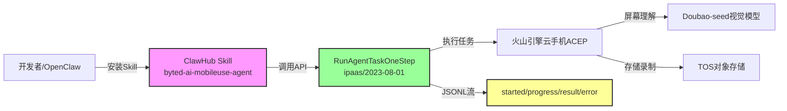
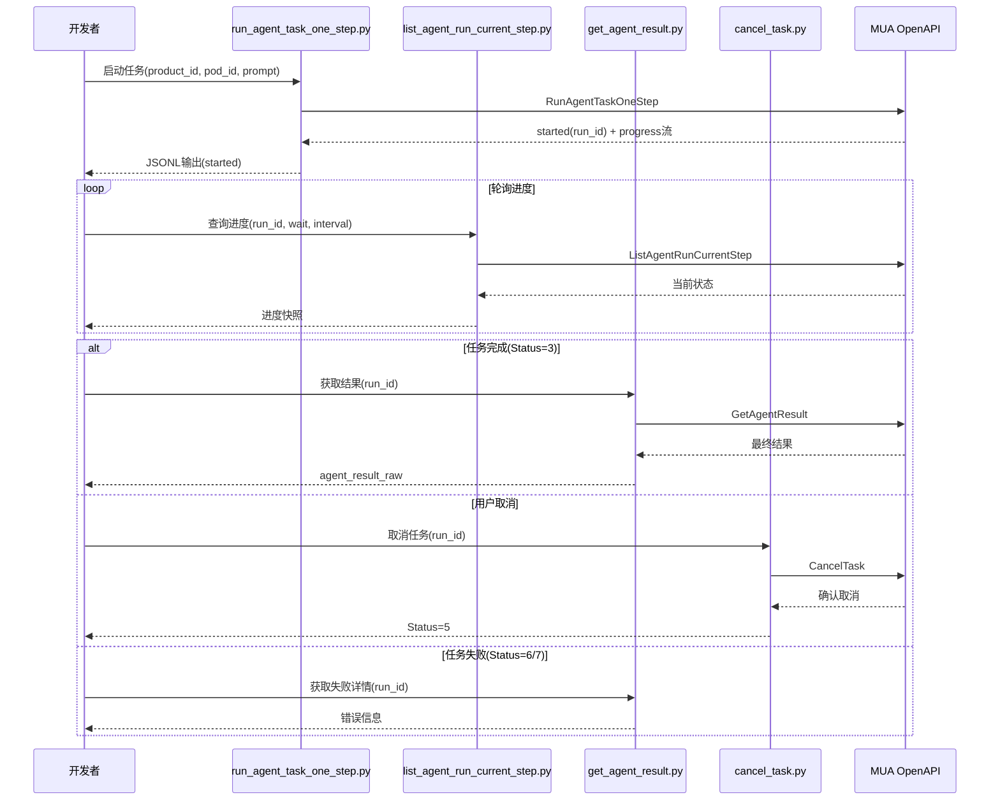
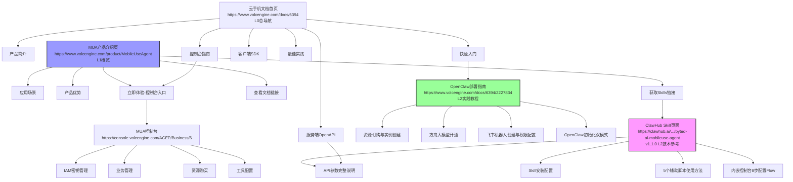

# 火山引擎Mobile Use Agent Skill与API技术实现指南

> **来源**: 
> - ClawHub Skill页面: https://clawhub.ai/volcengine-skills/skills/byted-ai-mobileuse-agent (v1.1.0)
> - OpenClaw部署指南: https://www.volcengine.com/docs/6394/2227834
> - 产品介绍页: https://www.volcengine.com/product/MobileUseAgent
> **提取日期**: 2026-07-07
> **说明**: 本笔记为技术实现补充文档，产品概述与架构分析请参见 `volcengine-mobile-use-agent-analysis.md`

---

## 一、概述

### 1.1 文档定位

本笔记专注于Mobile Use Agent（MUA）的**技术实现细节**，覆盖ClawHub Skill安装配置、API完整参数、JSONL输出格式解析、控制台配置流程、OpenClaw部署、错误处理与最佳实践，为开发者提供可直接落地的技术参考。

**核心技术特性**：
- **Skill包名**: `@volcengine-skills/byted-ai-mobileuse-agent`（v1.1.0）
- **核心API**: `RunAgentTaskOneStep`（ipaas / 2023-08-01版本）
- **输出格式**: JSONL流式输出（每行一个JSON对象）
- **运行时环境**: OpenClaw开源AI代理平台
- **底层模型**: 豆包Doubao-seed视觉大模型系列（GUI理解能力）
- **认证方式**: Ark Skill API代理（优先）/ 火山引擎AK/SK（备选）

### 1.2 技术架构概览



---

## 二、核心术语表

> **来源**: 综合ClawHub Skill页面 + OpenClaw部署文档 + 产品介绍页

| 术语 | 全称/定义 | 来源URL |
|------|----------|---------|
| **MUA** | Mobile Use Agent，云手机应用助手，基于火山引擎云手机和豆包视觉模型的移动端AI Agent解决方案 | https://www.volcengine.com/product/MobileUseAgent |
| **ACEP** | Auto-Cloud-End-Platform，火山引擎云手机产品 | https://www.volcengine.com/docs/6394 |
| **OpenClaw** | 开源、本地优先的AI代理与自动化平台，可集成飞书通信能力与大语言模型 | https://www.volcengine.com/docs/6394/2227834 |
| **ClawHub** | OpenClaw技能市场，用于分发和安装Skill包 | https://clawhub.ai/volcengine-skills/skills/byted-ai-mobileuse-agent |
| **Skill** | OpenClaw/ClawHub体系中的可安装功能模块，通过`openclaw skills install`命令安装 | https://clawhub.ai/volcengine-skills/skills/byted-ai-mobileuse-agent |
| **RunId** | Agent任务运行ID，用于追踪和查询任务状态 | https://clawhub.ai/volcengine-skills/skills/byted-ai-mobileuse-agent |
| **ThreadId** | 线程ID，传入arkclaw session_id以关联同一会话中的多次运行 | https://clawhub.ai/volcengine-skills/skills/byted-ai-mobileuse-agent |
| **ProductId** | 云手机业务ID，创建业务时生成（即product_id） | https://clawhub.ai/volcengine-skills/skills/byted-ai-mobileuse-agent |
| **PodId** | 云手机实例ID，购买资源后获得（即pod_id） | https://clawhub.ai/volcengine-skills/skills/byted-ai-mobileuse-agent |
| **JSONL** | JSON Lines格式，每行一个JSON对象，用于流式输出任务进度 | https://clawhub.ai/volcengine-skills/skills/byted-ai-mobileuse-agent |
| **ServiceRoleForIPaaS** | IAM服务角色，MUA操作所需依赖服务权限之一（必须授权） | https://clawhub.ai/volcengine-skills/skills/byted-ai-mobileuse-agent |
| **PaasServiceRole** | IAM服务角色，MUA操作所需依赖服务权限之一（必须授权） | https://clawhub.ai/volcengine-skills/skills/byted-ai-mobileuse-agent |
| **TOS** | Tinder Object Storage，火山引擎对象存储，用于屏幕录制文件存储 | https://clawhub.ai/volcengine-skills/skills/byted-ai-mobileuse-agent |
| **Doubao-seed** | 火山方舟豆包视觉大模型系列，支持GUI理解能力 | https://www.volcengine.com/docs/6394/2227834 |
| **config_openclaw** | OpenClaw初始化配置命令，在云手机终端执行 | https://www.volcengine.com/docs/6394/2227834 |
| **ark模式** | OpenClaw配置模式之一，使用火山引擎方舟大模型平台 | https://www.volcengine.com/docs/6394/2227834 |
| **volcengine-plan模式** | OpenClaw配置模式之一，使用火山引擎Coding Plan订阅服务 | https://www.volcengine.com/docs/6394/2227834 |
| **AOSP** | Android Open Source Project，安卓开源项目，云手机系统基础 | https://www.volcengine.com/docs/6394/2227834 |
| **g3.8c24g** | 云手机实例规格系列，支持单开/双开/三开配置 | https://www.volcengine.com/docs/6394/2227834 |
| **应用操作指南** | Markdown格式的应用操作说明文档，上传至控制台供Agent参考执行 | https://clawhub.ai/volcengine-skills/skills/byted-ai-mobileuse-agent |
| **终端状态** | 任务最终状态，包括Status 3(已完成)/5(已取消)/6(失败)/7(中断) | https://clawhub.ai/volcengine-skills/skills/byted-ai-mobileuse-agent |

---

## 三、Skill安装与配置

> **来源**: https://clawhub.ai/volcengine-skills/skills/byted-ai-mobileuse-agent

### 3.1 环境要求

| 依赖项 | 要求 | 说明 |
|--------|------|------|
| **Python版本** | Python 3.9+ | Skill脚本基于Python开发 |
| **Python SDK** | volcengine-python-sdk（volcenginesdkcore） | 火山引擎官方Python SDK |
| **OpenClaw运行时** | 已安装OpenClaw平台 | Skill需安装在OpenClaw环境中 |
| **云手机实例** | g3.8c24g三开及以上规格 | OpenClaw部署最低要求 |

### 3.2 Skill安装流程

#### 步骤1：安装Skill包
```bash
openclaw skills install @volcengine-skills/byted-ai-mobileuse-agent
```

#### 步骤2：安装Python依赖
```bash
pip install -r "skills/byted-ai-mobileuse-agent/references/requirements.txt"
```

### 3.3 认证配置（两种方式）

#### 方式一：Ark Skill API代理（优先，生产环境推荐）

无需火山引擎AK/SK，通过Skill API代理访问：

```bash
export ARK_SKILL_API_BASE="<api-base-url>"
export ARK_SKILL_API_KEY="<api-key>"
```

#### 方式二：火山引擎AK/SK（本地开发备选）

通过IAM密钥直接认证：

```bash
# 环境变量名（两种写法均可）
export VOLCENGINE_ACCESS_KEY="<your-access-key>"
export VOLCENGINE_SECRET_KEY="<your-secret-key>"

# 或使用简写形式
export VOLC_ACCESSKEY="<your-access-key>"
export VOLC_SECRETKEY="<your-secret-key>"
```

**密钥获取地址**: https://console.volcengine.com/iam/keymanage

---

## 四、API参考：RunAgentTaskOneStep完整参数

> **来源**: https://clawhub.ai/volcengine-skills/skills/byted-ai-mobileuse-agent
> **API版本**: ipaas / 2023-08-01
> **功能**: 启动一个云手机Agent任务，单步执行模式

### 4.1 必填参数

| 参数名 | 类型 | 说明 | 示例值 |
|--------|------|------|--------|
| `--product-id` | string | 云手机产品ID（业务ID），在控制台创建业务后获取 | （控制台记录） |
| `--pod-id` | string | 云手机实例（pod）ID，购买资源后获得 | （控制台记录） |
| `--prompt` | string | 自然语言指令，描述要执行的移动端任务 | "Open Xiaohongshu and go to the Search page" |
| `--thread-id` | string | 线程ID，传入arkclaw `session_id`以关联同一会话中的多次运行 | thread-123 / session_id |

### 4.2 可选参数

| 参数名 | 类型 | 取值范围 | 默认值 | 说明 |
|--------|------|---------|--------|------|
| `--max-step` | integer | 1 ~ 500 | 未设置 | 最大智能体执行步数，建议设置300左右 |
| `--timeout` | integer | 1 ~ 86400秒 | 未设置 | 任务超时时间（秒），建议设置1800秒（30分钟） |
| `--is-screen-record` | boolean | true/false | false | 是否启用屏幕录制功能 |
| `--tos-bucket` | string | - | 未设置 | 屏幕录制存储的TOS桶名称（启用录制时必填） |
| `--tos-endpoint` | string | - | 未设置 | 屏幕录制存储的TOS端点（启用录制时必填） |
| `--tos-region` | string | - | 未设置 | 屏幕录制存储的TOS区域（启用录制时必填） |

### 4.3 环境变量汇总

| 变量名 | 说明 | 认证模式 |
|--------|------|---------|
| `ARK_SKILL_API_BASE` | Ark Skill API代理地址 | 代理模式（优先） |
| `ARK_SKILL_API_KEY` | Ark Skill API代理密钥 | 代理模式（优先） |
| `VOLCENGINE_ACCESS_KEY` / `VOLC_ACCESSKEY` | 火山引擎Access Key | AK/SK模式（备选） |
| `VOLCENGINE_SECRET_KEY` / `VOLC_SECRETKEY` | 火山引擎Secret Key | AK/SK模式（备选） |

---

## 五、输入输出格式

> **来源**: https://clawhub.ai/volcengine-skills/skills/byted-ai-mobileuse-agent

### 5.1 输入格式

通过命令行参数传递，调用`run_agent_task_one_step.py`脚本，参数详见第四章API参考。

### 5.2 输出格式：JSONL流

执行脚本输出JSONL流（每行一个JSON对象），共4种消息类型，主智能体可以实时消费进度。

#### 类型一：type=started（任务已创建）

任务启动成功后立即返回：
```json
{
  "type": "started",
  "run_id": "756729984938989****",
  "thread_id": "thread-123"
}
```

**关键字段**:
- `run_id`: 任务运行ID，后续查询和取消操作都需要此ID
- `thread_id`: 线程ID，与输入参数一致

#### 类型二：type=progress（进度更新）

任务执行过程中周期性返回进度快照：
```json
{
  "type": "progress",
  "status": "<当前状态值>",
  "raw_payload": {}
}
```

#### 类型三：type=result（最终结果）

任务达到终端状态或超时后返回最终摘要：
```json
{
  "type": "result",
  "ok": true,
  "run_id": "756729984938989****",
  "run_name": "test-run",
  "thread_id": "thread-123",
  "raw_response": {},
  "current_step_status": 3,
  "current_step_raw": {},
  "agent_result_raw": {}
}
```

**终端状态码说明**：
| Status值 | 含义 | 是否可取消 |
|---------|------|-----------|
| **3** | 已完成 | 否（终端状态） |
| **5** | 已取消 | 否（终端状态） |
| **6** | 失败 | 否（终端状态） |
| **7** | 中断 | 否（终端状态） |
| 其他值 | 执行中 | 是 |

#### 类型四：type=error（致命错误）

发生不可恢复错误时返回：
```json
{
  "type": "error",
  "error_code": "<错误码>",
  "error_message": "<错误描述>"
}
```

### 5.3 JSONL解析建议

```python
import json
import sys

for line in sys.stdin:
    line = line.strip()
    if not line:
        continue
    msg = json.loads(line)
    msg_type = msg["type"]
    
    if msg_type == "started":
        run_id = msg["run_id"]
        print(f"任务已启动，RunId: {run_id}")
    elif msg_type == "progress":
        print(f"进度更新，状态: {msg['status']}")
    elif msg_type == "result":
        if msg["ok"] and msg["current_step_status"] == 3:
            print("任务成功完成")
        else:
            print(f"任务结束，状态码: {msg['current_step_status']}")
    elif msg_type == "error":
        print(f"错误: {msg['error_code']} - {msg['error_message']}")
```

---

## 六、控制台配置步骤

> **来源**: https://clawhub.ai/volcengine-skills/skills/byted-ai-mobileuse-agent（内嵌控制台指南）
> **控制台入口**: https://console.volcengine.com/ACEP/Business/6

控制台配置共8个流程（Flow），必须按顺序完成：

### Flow 1：创建AccessKey

**目的**: 获取API调用凭证

1. 访问 https://console.volcengine.com/iam/keymanage
2. 点击"创建密钥"按钮
3. 安全记录AccessKey ID和SecretAccessKey（仅显示一次）

### Flow 2：首次授权（必需）

**目的**: 授予MUA操作所需的跨服务访问权限

1. 检查`ServiceRoleForIPaaS`角色：
   - 如果角色不存在：访问 https://console.volcengine.com/iam/service/attach_role/?ServiceName=ipaas 授予授权
   - 如果角色已存在：继续下一步
2. 检查`PaasServiceRole`角色：
   - 如果角色不存在：访问 https://console.volcengine.com/iam/identitymanage/role 创建并授予角色
   - 如果角色已存在：完成授权

> ⚠️ **注意**: 在调用MUA OpenAPI之前，必须完成此跨服务访问授权，否则会返回权限错误。

### Flow 3：启用MUA Token服务

**目的**: 为业务启用MUA Token服务

1. 访问 https://console.volcengine.com/ACEP/Business/6
2. 阅读并接受服务条款和SLA
3. 点击"立即启用"按钮

### Flow 4：创建业务

**目的**: 创建逻辑隔离的业务单元，所有资源和配置都属于该业务

1. 在MUA业务管理页面点击"创建业务"
2. 填写业务名称（如：OpenClaw-Test）
3. 提交创建
4. **立即记录业务ID（product_id）**——后续API调用必需

### Flow 5：购买资源

**目的**: 为业务购买并启用云手机实例

1. 在业务列表中找到目标业务，点击"购买资源"
2. 完成规格选择和支付流程
3. **等待2-3分钟**，直到实例状态变为"就绪"
4. 刷新页面并检查资源状态
5. **记录实例ID/名称（pod_id）**——后续API调用必需

> ⚠️ **注意**: 购买资源后必须等待约2-3分钟，实例状态变为"就绪"后才能调用API，否则任务会一直排队。

### Flow 6：上传/升级应用操作指南

**入口**: 业务管理 → 工具配置 → 应用操作指南

**目的**: 为Agent提供特定应用的操作说明文档（Markdown格式）

- **新建指南**: 上传Markdown格式的指南文件
- **升级指南**: 上传的包名必须与现有指南的包名完全匹配，否则升级失败
- **参考模板**: https://lf3-static.bytednsdoc.com/obj/eden-cn/uhmlnbs/%E5%BA%94%E7%94%A8%E6%93%8D%E4%BD%9C%E6%8C%87%E5%8D%97%E6%A8%A1%E7%89%88.md

### Flow 7：配置技能

**入口**: 业务管理 → 工具配置 → 技能配置

**目的**: 指定技能文件的存储位置

- 在"技能存储位置"填写文件夹路径
- ⚠️ **重要**: 必须是文件夹级别路径，不能是单个文件路径
- 点击"保存"

### Flow 8：发布应用（如需要）

**入口**: 云手机业务 → 进入业务 → 应用管理 → 添加应用

**目的**: 如果任务需要特定应用（默认镜像未预装），需先发布/安装

- 输入应用名称
- 通过URL上传或本地上传APK安装包
- 点击"确认"

> ⚠️ **注意**: 默认云手机镜像包含的预装应用有限，任务需要特定应用时必须先完成此步骤。

### 控制台配置检查清单

| 配置项 | 是否必需 | 获取位置 | 记录值 |
|--------|---------|---------|--------|
| AccessKey ID | ✅ 是 | IAM密钥管理 | |
| SecretAccessKey | ✅ 是 | IAM密钥管理（仅显示一次） | |
| ServiceRoleForIPaaS | ✅ 是 | IAM角色授权 | 自动检查 |
| PaasServiceRole | ✅ 是 | IAM角色管理 | 自动检查 |
| product_id（业务ID） | ✅ 是 | MUA业务管理 → 创建业务后 | |
| pod_id（实例ID） | ✅ 是 | 购买资源后，实例列表 | |
| 应用操作指南 | ⭕ 按需 | 工具配置 → 应用操作指南 | |
| 技能存储路径 | ⭕ 按需 | 工具配置 → 技能配置 | |
| TOS配置（屏幕录制） | ⭕ 按需 | TOS控制台 | |

---

## 七、OpenClaw部署指南

> **来源**: https://www.volcengine.com/docs/6394/2227834

### 7.1 部署前置要求

| 要求项 | 具体配置 | 说明 |
|--------|---------|------|
| **地域** | 华东区域 | OpenClaw暂仅支持华东 |
| **机房** | 浙江温州三线03-ppe | 指定机房，不可选错 |
| **存储方案** | 云盘存储 | 仅支持云盘存储类型 |
| **实例规格** | g3.8c24g三开及以上 | 最低配置：3vCPU｜8GB内存 |
| **实例镜像** | 公共镜像/img-1080115458 | **必须选择此镜像，不可使用其他镜像** |
| **实例存储** | 不低于32GB | 存储容量要求 |
| **系统版本** | AOSP13 | Android开源项目13版本 |

### 7.2 实例规格对比

| 实例规格 | vCPU核数 | 内存（GB） | Android版本 | 适用场景 |
|---------|---------|-----------|------------|---------|
| g3.8c24g单开 | 8 | 24 | AOSP13 | 高性能单实例任务 |
| g3.8c24g双开 | 4 | 12 | - | 中等负载双实例 |
| g3.8c24g三开 | 3 | 8 | - | OpenClaw最低要求配置 |

### 7.3 部署步骤

#### 步骤一：订购资源与创建实例

1. 登录[云手机控制台](https://console.volcengine.com/ACEP/)
2. 创建云盘存储类型业务（若已有可跳过）：
   - 业务名称：OpenClaw
   - 存储方案：云盘存储
3. 购买资源：
   - 地域：国内通用
   - 计费方式：后付费
   - 区域：华东
   - 可用区/机房：指定机房-浙江温州三线03-ppe
   - 实例规格：g3.8c24g三开
4. 创建云手机实例：
   - 左侧导航：实例管理 → 实例列表
   - 点击"创建实例"
   - 实例存储：≥32GB
   - 实例镜像：公共镜像/img-1080115458
   - 勾选"创建后开机"

#### 步骤二：开通火山方舟大模型

1. 登录[方舟开通管理页面](https://console.volcengine.com/ark/region:ark+cn-beijing/openManagement?LLM=%7B%7D&advancedActiveKey=model)
2. 选择支持GUI能力的模型，推荐**Doubao-seed-1.8**（GUI交互任务）
3. 进入「系统管理 > API Key管理」，创建并获取API Key

#### 步骤三：创建飞书机器人应用

1. 登录[飞书开发者平台](https://open.larkoffice.com/app?lang=zh-CN)
2. 创建企业自建应用
3. 添加机器人能力
4. 配置权限（批量导入以下JSON）：

```json
{
  "scopes": {
    "tenant": [
      "im:chat:read",
      "im:chat:update",
      "im:message.group_at_msg:readonly",
      "im:message.p2p_msg:readonly",
      "im:message.pins:read",
      "im:message.pins:write_only",
      "im:message.reactions:read",
      "im:message.reactions:write_only",
      "im:message:readonly",
      "im:message:recall",
      "im:message:send_as_bot",
      "im:message:send_multi_users",
      "im:message:send_sys_msg",
      "im:message:update",
      "im:resource",
      "contact:contact.base:readonly"
    ],
    "user": [
      "contact:user.employee_id:readonly"
    ]
  }
}
```

5. 获取App ID与App Secret
6. 发布应用
7. 事件配置（「开发配置 > 事件与回调」）：
   - 选择"使用长连接接收事件"
   - 添加事件：勾选"接收消息"及其他需要订阅的事件

#### 步骤四：初始化OpenClaw

1. 登录云手机控制台，连接云手机
2. 在实例详情页面，单击"终端"按钮
3. 执行初始化命令：
```bash
config_openclaw
```
4. 选择服务提供商：
   - **ark模式**：使用火山引擎方舟大模型平台
   - **volcengine-plan模式**：使用火山引擎Coding Plan订阅服务

##### ark模式配置参数

| 参数 | 说明 | 示例 |
|------|------|------|
| Enter models id | 模型ID | doubao-seed-1-8-251228 |
| Enter apiKey | 方舟API Key | e615c7a1-dab3-40fa-af54-d4**** |
| Enter Feishu appId | 飞书App ID | cli_a92bfb97be3**** |
| Enter Feishu appSecret | 飞书App Secret | 2oGtsZDR083GMvWfPIbLFcy**** |
| Enter Feishu botName | 机器人名称 | My OpenClaw Bot |
| Enable Feishu? | 是否启用飞书 | true |

##### volcengine-plan模式配置参数

| 参数 | 说明 | 示例 |
|------|------|------|
| Enter models id | 模型ID（推荐doubao-seed-2.0-code） | doubao-seed-2.0-code |
| Enter apiKey | API Key | e615c7a1-dab3-40fa-af54-d4**** |
| Enter Feishu appId | 飞书App ID | cli_a92bfb97be3**** |
| Enter Feishu appSecret | 飞书App Secret | 2oGtsZDR083GMvWfPIbLFcy**** |
| Enter Feishu botName | 机器人名称 | My OpenClaw Bot |
| Enable Feishu? | 是否启用飞书 | true |

5. 验证Web UI：
```bash
openclaw dashboard
```
- 获取Dashboard URL后，在云手机中打开Via浏览器访问
- 验证可正常对话并生成内容

---

## 八、本地使用示例

> **来源**: https://clawhub.ai/volcengine-skills/skills/byted-ai-mobileuse-agent

### 8.1 设置认证环境变量

```bash
# AK/SK模式（本地开发）
export VOLC_ACCESSKEY="<your-access-key>"
export VOLC_SECRETKEY="<your-secret-key>"

# 或使用Ark Skill API代理模式（生产环境）
export ARK_SKILL_API_BASE="<api-base-url>"
export ARK_SKILL_API_KEY="<api-key>"
```

### 8.2 启动Agent任务

```bash
python "skills/byted-ai-mobileuse-agent/scripts/run_agent_task_one_step.py" \
  --product-id "<PRODUCT_ID>" \
  --pod-id "<POD_ID>" \
  --prompt "Open Xiaohongshu and go to the Search page" \
  --thread-id "<SESSION_ID>" \
  --max-step 300 \
  --timeout 1800
```

**参数说明**:
- `--max-step 300`: 最大执行步数300步
- `--timeout 1800`: 30分钟超时

### 8.3 带屏幕录制的任务启动

```bash
python "skills/byted-ai-mobileuse-agent/scripts/run_agent_task_one_step.py" \
  --product-id "<PRODUCT_ID>" \
  --pod-id "<POD_ID>" \
  --prompt "Open Settings and check WiFi status" \
  --thread-id "<SESSION_ID>" \
  --is-screen-record true \
  --tos-bucket "<your-bucket-name>" \
  --tos-endpoint "tos-cn-beijing.volces.com" \
  --tos-region "cn-beijing"
```

> ⚠️ **前置条件**: 使用屏幕录制前需先在控制台配置TOS对象存储。

---

## 九、脚本工具说明

> **来源**: https://clawhub.ai/volcengine-skills/skills/byted-ai-mobileuse-agent

Skill提供5个Python辅助脚本，位于`skills/byted-ai-mobileuse-agent/scripts/`目录下：

### 9.1 run_agent_task_one_step.py - 启动任务

**功能**: 启动一个云手机Agent任务，输出JSONL流

**主要参数**:
- 必填：`--product-id`、`--pod-id`、`--prompt`、`--thread-id`
- 可选：`--max-step`、`--timeout`、`--is-screen-record`、`--tos-bucket`、`--tos-endpoint`、`--tos-region`

### 9.2 list_agent_run_current_step.py - 查询当前进度

**功能**: 轮询查询任务当前执行步骤和状态

```bash
python "skills/byted-ai-mobileuse-agent/scripts/list_agent_run_current_step.py" \
  --run-id "<RunId>" \
  --thread-id "<SESSION_ID>" \
  --wait 10 \
  --interval 2 \
  --pretty
```

**参数说明**:
- `--run-id`: 启动任务时返回的RunId
- `--thread-id`: 会话线程ID
- `--wait`: 轮询等待秒数（建议10秒）
- `--interval`: 轮询间隔秒数（建议2秒）
- `--pretty`: 格式化输出JSON

### 9.3 get_agent_result.py - 获取最终结果

**功能**: 当任务达到终端状态（Status 3/5/6/7）时，获取完整执行结果

```bash
python "skills/byted-ai-mobileuse-agent/scripts/get_agent_result.py" \
  --run-id "<RunId>" \
  --thread-id "<SESSION_ID>" \
  --pretty
```

### 9.4 cancel_task.py - 取消运行中任务

**功能**: 取消正在运行的任务（仅当Status不在3/5/6/7时有效）

```bash
python "skills/byted-ai-mobileuse-agent/scripts/cancel_task.py" \
  --run-id "<RunId>" \
  --thread-id "<SESSION_ID>" \
  --wait 20 \
  --interval 2 \
  --pretty
```

**取消逻辑**:
1. 用户明确要求停止时，先调用`list_agent_run_current_step.py`检查当前状态
2. 如果Status不在3/5/6/7中（非终端状态），再调用取消API
3. 轮询等待任务进入已取消状态（Status=5）

### 9.5 console_help.py - 控制台帮助查询

**功能**: 按关键词查询控制台配置相关流程说明

```bash
python "skills/byted-ai-mobileuse-agent/scripts/console_help.py" \
  --question "How do I grant first-time authorization?" \
  --pretty
```

**适用问题**: 授权、启用服务、创建业务、购买资源、上传操作指南、配置技能、发布应用等控制台相关问题。

### 9.6 脚本调用流程图



---

## 十、应用场景

> **来源**: 综合产品介绍页 + OpenClaw部署指南

### 10.1 MUA通用应用场景

| 场景分类 | 具体场景 | 场景描述 |
|---------|---------|---------|
| **手机应用测试** | 自动化UI测试 | 雇佣一个不知疲倦、像真实用户一样思考和操作的24*7 AI测试员 |
| **数据收集整理** | 价格/库存监控 | 自动进入指定App检查价格、库存、页面状态，并输出结果摘要 |
| **内容合规检测** | 内容审核 | 智能化获取数据，减少对技术人员的依赖，提高检测任务的成功率和效率 |
| **自动任务助手** | 运营自动化 | 自动执行内容发布、巡检和多平台搬运等重复性运营任务 |

### 10.2 OpenClaw专属应用场景

| 场景分类 | 具体场景 | 场景描述 |
|---------|---------|---------|
| **批量账号运营** | 自动化流程执行 | 内容分发、任务调度、标准化操作流程，有效降低重复操作成本 |
| **AI智能客服** | 自动消息响应 | 作为AI客服助手，实现消息自动回复与智能咨询处理，提升响应速度与服务效率 |
| **工作流协同** | 日常办公助手 | 深度集成日常工作流程，实现文档生成、任务提醒、待办事项实时推送 |

---

## 十一、限制与注意事项

> **来源**: 综合ClawHub Skill页面 + OpenClaw部署指南

### 11.1 OpenClaw部署限制

| 限制类型 | 具体限制 |
|---------|---------|
| **地域限制** | OpenClaw暂仅支持华东区域 |
| **机房限制** | OpenClaw指定机房：浙江温州三线03-ppe |
| **存储方案** | OpenClaw仅支持云盘存储，不支持其他存储类型 |
| **镜像限制** | OpenClaw必须使用公共镜像/img-1080115458，不可使用其他镜像 |
| **存储最低要求** | 实例存储不低于32GB |
| **实例最低规格** | g3.8c24g三开（3vCPU｜8GB内存） |

### 11.2 控制台配置限制

| 限制类型 | 具体限制 |
|---------|---------|
| **实例等待时间** | 购买资源后需等待约2-3分钟，直到实例状态变为"就绪" |
| **技能路径要求** | "技能存储位置"必须指向文件夹路径，不能是单个文件路径 |
| **应用指南升级规则** | 升级"应用操作指南"时，上传包名必须与之前版本完全匹配，否则升级失败 |
| **预装应用限制** | 默认云手机镜像预装应用有限，需特定应用须先通过"发布应用"安装 |

### 11.3 API调用限制

| 限制类型 | 具体限制 |
|---------|---------|
| **API QPS限制** | 整体50 QPS，每用户10 QPS，超出限制的请求可能被限流 |
| **max-step范围** | 1 ~ 500步 |
| **timeout范围** | 1 ~ 86400秒（最大24小时） |
| **Python版本** | 需要Python 3.9+ |

### 11.4 功能使用限制

| 功能 | 限制与前置条件 |
|------|--------------|
| **屏幕录制** | `IsScreenRecord=true`时需先在控制台配置对象存储（TOS），同时传入tos-bucket、tos-endpoint、tos-region三个参数，否则录制请求可能失败 |
| **会话关联** | 同一会话的多次运行必须使用相同的thread-id（传入session_id），否则上下文会丢失 |
| **授权前置** | 调用OpenAPI之前必须完成ServiceRoleForIPaaS和PaasServiceRole两个角色的授权 |

---

## 十二、最佳实践

> **来源**: 综合分析结果 + 官方文档推荐

### 12.1 模型选择建议

| 任务类型 | 推荐模型 | 说明 |
|---------|---------|------|
| GUI交互任务 | Doubao-seed-1.8 | 视觉理解能力强，适合屏幕理解和UI操作 |
| 编码相关任务 | doubao-seed-2.0-code | 代码能力强，适合需要编程的场景 |

### 12.2 认证方式选择

| 环境 | 推荐认证方式 | 原因 |
|------|------------|------|
| 生产环境 | Ark Skill API代理 | 无需管理火山引擎AK/SK，安全性更高 |
| 本地开发调试 | 火山引擎AK/SK | 配置简单，适合快速测试 |

### 12.3 参数配置建议

| 参数 | 建议值 | 说明 |
|------|-------|------|
| `--max-step` | 300左右 | 兼顾任务完成率和执行时间 |
| `--timeout` | 1800秒（30分钟） | 大多数任务可在30分钟内完成 |
| `--wait`（轮询） | 10秒 | list脚本轮询等待时间 |
| `--interval`（轮询） | 2秒 | 轮询间隔时间 |

### 12.4 开发实践建议

| 实践项 | 具体建议 |
|--------|---------|
| **会话管理** | 同一会话多次调用必须传入相同的session_id作为thread-id，保证上下文连续性 |
| **状态轮询** | 使用`list_agent_run_current_step.py`轮询进度，建议wait=10、interval=2 |
| **取消逻辑** | 用户要求停止时先检查状态，非终端状态（Status不在3/5/6/7）再调用取消API |
| **应用准备** | 任务需要特定应用时，必须先通过"应用管理→添加应用"发布安装 |
| **屏幕录制** | 需要录制时必须同时配置tos-bucket、tos-endpoint、tos-region三个TOS参数 |
| **Dashboard验证** | OpenClaw初始化后执行`openclaw dashboard`获取URL，用Via浏览器访问验证 |
| **错误重试** | 任务失败时可根据错误信息判断是否需要重试，注意幂等性 |
| **结果持久化** | 任务完成后及时调用`get_agent_result.py`获取并保存结果，避免结果过期 |

---

## 十三、常见问题排查

> **来源**: 综合ClawHub Skill页面 + OpenClaw部署文档

| 问题现象 | 可能原因 | 解决方案 |
|---------|---------|---------|
| **API调用返回权限错误** | 未完成首次授权，缺少ServiceRoleForIPaaS或PaasServiceRole角色 | 按控制台配置Flow 2完成两个角色的授权：<br>1. https://console.volcengine.com/iam/service/attach_role/?ServiceName=ipaas<br>2. https://console.volcengine.com/iam/identitymanage/role |
| **任务一直排队不执行** | 实例状态未就绪 | 购买资源后等待2-3分钟，刷新页面确认实例状态为"就绪"后再调用API |
| **屏幕录制失败** | 未配置TOS对象存储或TOS参数不全 | 1. 先在TOS控制台创建存储桶<br>2. 调用API时传入完整的tos-bucket、tos-endpoint、tos-region三个参数 |
| **Skill加载失败** | 技能存储路径配置错误 | 进入"业务管理→工具配置→技能配置"，确认配置的是文件夹路径而非单个文件路径 |
| **应用指南升级失败** | 上传包名与现有版本不匹配 | 确保上传的Markdown文件中包名与现有指南包名完全一致后重新上传 |
| **找不到特定应用** | 默认云手机镜像未预装该应用 | 通过"云手机业务→进入业务→应用管理→添加应用"发布并安装所需应用 |
| **请求被限流** | QPS超出限制 | 降低请求频率：整体不超过50 QPS，单用户不超过10 QPS，添加适当的请求间隔和重试机制 |
| **OpenClaw初始化失败** | 镜像选择错误或规格不满足要求 | 1. 确认使用img-1080115458公共镜像<br>2. 确认实例规格≥g3.8c24g三开<br>3. 确认存储≥32GB |
| **飞书机器人收不到消息** | 事件配置错误或权限不足 | 1. 确认在飞书开发者平台配置了16项权限（见7.3节JSON）<br>2. 确认使用长连接接收事件<br>3. 确认已勾选"接收消息"事件<br>4. 确认应用已发布 |
| **同一会话上下文丢失** | thread-id不一致 | 同一会话的多次API调用必须传入相同的session_id作为thread-id参数 |
| **找不到RunId** | 未正确解析started消息 | 启动任务后解析第一行JSONL输出（type=started），从中提取run_id字段保存 |
| **任务超时未完成** | max-step设置过小或任务过于复杂 | 1. 适当增大--max-step参数（最大500）<br>2. 适当增大--timeout参数（最大86400秒）<br>3. 将复杂任务拆分为多个简单任务 |
| **config_openclaw命令不存在** | 镜像选择错误 | 确认实例使用的是指定公共镜像img-1080115458，重新创建实例 |
| **区域选择错误导致部署失败** | 未选择华东区域/指定机房 | 重新购买资源，确认选择：区域=华东，机房=浙江温州三线03-ppe |

---

## 十四、资源关联图

> **来源**: 综合所有提取内容的资源定位分析

### 14.1 资源层级关系图



### 14.2 关键入口速查表

| 资源类型 | URL | 用途 |
|---------|-----|------|
| **MUA控制台** | https://console.volcengine.com/ACEP/Business/6 | 业务管理、资源购买、工具配置 |
| **IAM密钥管理** | https://console.volcengine.com/iam/keymanage | 创建和管理AccessKey |
| **ServiceRoleForIPaaS授权** | https://console.volcengine.com/iam/service/attach_role/?ServiceName=ipaas | 首次授权（角色1） |
| **PaasServiceRole管理** | https://console.volcengine.com/iam/identitymanage/role | 首次授权（角色2） |
| **ClawHub Skill页面** | https://clawhub.ai/volcengine-skills/skills/byted-ai-mobileuse-agent | Skill安装和文档 |
| **OpenClaw部署指南** | https://www.volcengine.com/docs/6394/2227834 | 部署教程 |
| **产品介绍页** | https://www.volcengine.com/product/MobileUseAgent | 产品概览 |
| **云手机文档首页** | https://www.volcengine.com/docs/6394 | 文档总入口 |
| **方舟开通管理** | https://console.volcengine.com/ark/region:ark+cn-beijing/openManagement | 模型开通和API Key |
| **飞书开发者平台** | https://open.larkoffice.com/app?lang=zh-CN | 创建飞书机器人 |
| **TOS存储桶列表** | https://console.volcengine.com/tos/bucket?projectName=default | 屏幕录制存储配置 |
| **应用操作指南模板** | https://lf3-static.bytednsdoc.com/obj/eden-cn/uhmlnbs/应用操作指南模版.md | 编写应用指南参考 |
| **发布应用说明** | https://www.volcengine.com/docs/6394/1223958?lang=zh | 应用发布文档 |
| **屏幕录制API文档** | https://www.volcengine.com/docs/6394/1997312?lang=zh | StartRecording接口 |

---

## 十五、参考资料

### 15.1 官方文档

1. **ClawHub Skill页面** - https://clawhub.ai/volcengine-skills/skills/byted-ai-mobileuse-agent (v1.1.0)
   - Skill安装配置、API参数、脚本使用方法、内嵌控制台指南

2. **云手机快速部署OpenClaw，集成飞书AI助手** - https://www.volcengine.com/docs/6394/2227834
   - OpenClaw部署流程、飞书集成、初始化配置

3. **Mobile Use Agent产品介绍页** - https://www.volcengine.com/product/MobileUseAgent
   - 产品定位、应用场景、产品优势

4. **云手机文档首页** - https://www.volcengine.com/docs/6394
   - 云手机产品文档总入口

### 15.2 控制台入口

1. MUA业务管理控制台: https://console.volcengine.com/ACEP/Business/6
2. IAM访问密钥管理: https://console.volcengine.com/iam/keymanage
3. 火山方舟开通管理: https://console.volcengine.com/ark/region:ark+cn-beijing/openManagement
4. 飞书开放平台: https://open.larkoffice.com/app?lang=zh-CN
5. TOS对象存储控制台: https://console.volcengine.com/tos/bucket?projectName=default

### 15.3 相关笔记

1. `volcengine-mobile-use-agent-analysis.md` - Mobile Use Agent产品概述与架构分析（本笔记的配套产品文档）
2. `volcengine-ark-introduction-core-notes.md` - 火山引擎方舟大模型平台核心笔记（Doubao模型相关参考）

---

> **笔记说明**: 本笔记基于ClawHub Skill v1.1.0官方文档、OpenClaw部署指南（2026年3月10日更新版本）及产品介绍页提取整理，专注于技术实现细节。Skill包名：`@volcengine-skills/byted-ai-mobileuse-agent`，核心API：`RunAgentTaskOneStep`（ipaas/2023-08-01）。具体功能、价格与限制以火山引擎官网最新公告为准。
