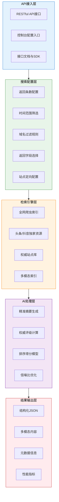
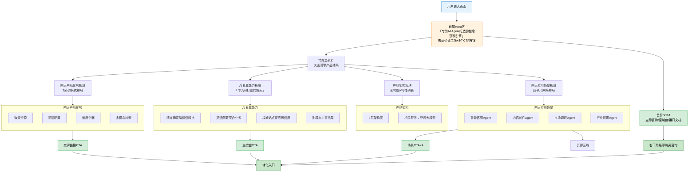
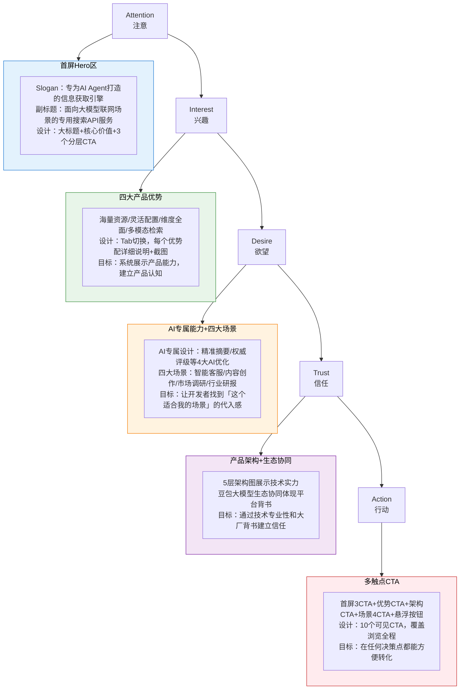
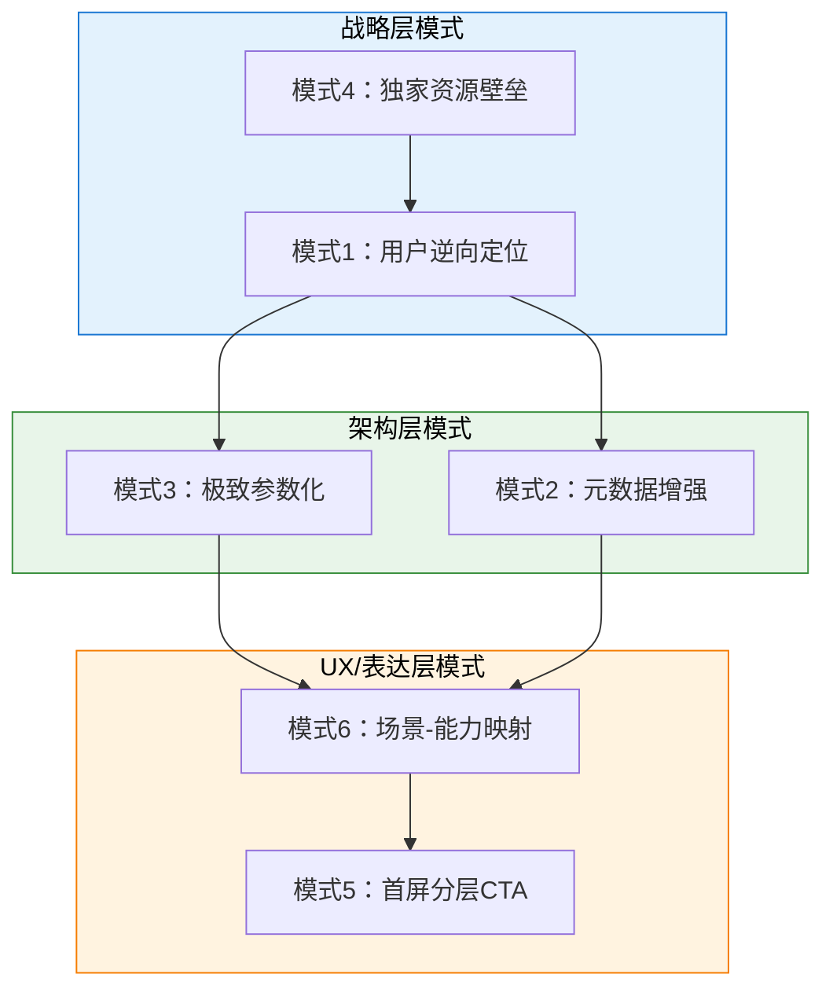
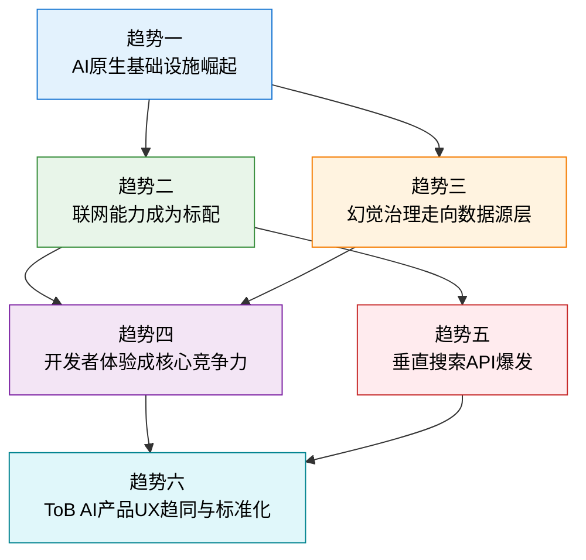

# 豆包搜索（SearchInfinity）完整学习笔记

> **产品介绍页**: https://www.volcengine.com/product/SearchInfinity
> **产品定位**: 专为AI Agent打造的信息获取引擎——面向大模型联网场景的专用搜索API服务
> **核心价值**: 凭借高度灵活的搜索配置和覆盖全面的高质量信源，精准捕捉联网信息，满足大模型联网场景下对信息时效性、权威性及准确性的需求

---

## 一、产品定位与价值主张分析

### 1.1 产品定位："专为AI Agent打造的信息获取引擎"

豆包搜索（SearchInfinity）定位为**面向大模型联网场景的专用搜索API服务**，其核心定位内涵包含三个关键维度：

| 维度 | 内涵说明 |
|------|----------|
| **服务对象** | 专为AI Agent、大模型应用设计，而非人类终端用户 |
| **产品形态** | API服务，以标准化接口形式提供，便于开发者集成 |
| **核心场景** | 大模型联网场景，解决大模型获取实时、准确、权威信息的需求 |

### 1.2 目标用户画像

| 用户类型 | 核心诉求 | 决策关注点 |
|---------|---------|-----------|
| **AI应用开发者** | 快速集成联网搜索能力到AI应用 | API易用性、文档完善度、调用成本 |
| **大模型应用工程师** | 提升大模型回答准确性、降低幻觉 | 搜索结果质量、信噪比、权威性评级 |
| **Agent平台研发人员** | 为Agent提供可靠的信息获取能力 | 可配置性、多模态支持、生态集成 |
| **企业IT决策者** | 企业级AI应用的信息基础设施 | 稳定性、安全性、合规性、厂商背书 |

### 1.3 核心价值主张拆解

豆包搜索的核心价值主张是：**凭借高度灵活的搜索配置和覆盖全面的高质量信源，精准捕捉联网信息，满足大模型联网场景下对信息时效性、权威性及准确性的需求**。

| 价值支柱 | 核心内涵 | 支撑能力 |
|---------|---------|---------|
| **灵活配置** | 高度可定制的搜索参数，适配不同场景 | 返回条数1-50条可配置、时间范围筛选、域名黑白名单、返回字段选择 |
| **高质量信源** | 覆盖全面且权威的信息来源 | 全网主流站点、权威机构公开信息、头条/抖音百科独家资源 |
| **AI友好设计** | 专为大模型优化的结果输出 | 精准摘要降低信噪比、权威评级、结构化字段、多模态返回 |

### 1.4 差异化竞争优势

与通用搜索引擎（百度、Google、Bing）相比，豆包搜索具有明确的差异化定位：

| 对比维度 | 通用搜索引擎（面向人类） | 豆包搜索（面向AI Agent） |
|---------|-----------------------|-----------------------|
| **目标用户** | 人类用户，浏览网页 | AI Agent/大模型，程序调用 |
| **结果设计** | 网页标题+摘要+链接，供人点击浏览 | 结构化JSON+精准摘要+元数据，供大模型直接消费 |
| **信噪比** | 包含广告、SEO优化内容、导航元素等高噪声 | 精准摘要过滤冗余，低信噪比输出 |
| **可配置性** | 基础筛选功能，面向普通用户 | 高度参数化配置，面向开发者 |
| **元数据** | 基础信息（标题、URL、时间） | 丰富元数据（权威评级、排序得分、搜索耗时） |
| **独家资源** | 各自生态内容 | 头条、抖音百科独家资源整合 |

---

## 二、四大产品优势深度解析

### 2.1 优势一：海量资源

**官方表述**：覆盖全网主流站点与权威机构公开信息，深度整合头条、抖音百科优质独家资源，资源储备丰富且覆盖维度全面，满足多元信息检索需求

**核心能力矩阵**：

| 能力项 | 具体说明 | 业务价值 |
|-------|---------|---------|
| **全网主流站点覆盖** | 索引全网主流网站内容 | 保证信息的广度，满足通用搜索需求 |
| **权威机构公开信息** | 政府、机构、高校、企业官网等权威来源 | 提供可信信息源，降低错误信息风险 |
| **头条优质资源整合** | 今日头条生态内容独家接入 | 获取字节生态独家优质内容 |
| **抖音百科独家资源** | 抖音百科内容深度整合 | 独家知识库资源，形成内容差异化 |
| **多维度信息覆盖** | 新闻、资讯、百科、报告、博客等多类型 | 满足不同类型Agent的多元信息需求 |

**独家资源的战略价值**：

头条和抖音百科的独家资源整合是豆包搜索的重要差异化壁垒：
1. **内容差异化**：获得其他搜索引擎无法获取的独家内容
2. **时效性优势**：字节生态内内容实时更新，热点信息获取更快
3. **质量保障**：抖音百科经过审核，信息质量相对有保障
4. **生态协同**：与字节内容生态形成闭环，数据持续迭代优化

---

### 2.2 优势二：灵活配置

**官方表述**：支持1-50条返回量、时效及域名自定义，可自主设置正文、URL、摘要等返回项，适配行业、权威站点定向搜索，贴合多样业务场景

**可配置参数详细说明**：

| 参数类别 | 配置项 | 取值范围/选项 | 应用场景 |
|---------|-------|-------------|---------|
| **结果数量** | 返回条数 | 1-50条可配置 | 简单问答1-3条快速响应；深度调研20-50条全面覆盖 |
| **时间筛选** | 时间范围 | 自定义时间区间 | 热点新闻限定24小时内；历史研究不限时间 |
| **域名控制** | 域名黑白名单 | 自定义允许/屏蔽域名 | 企业知识库只搜内部域名；竞品分析定向竞品官网 |
| **字段选择** | 返回字段 | 正文/URL/摘要/标题/站点信息等 | 节省token只返回摘要；深度分析需要完整正文 |
| **站点定向** | 行业/权威站点限定 | 指定行业站点或权威来源 | 金融研报只搜券商和咨询公司；医疗只搜权威医疗机构 |

**灵活配置的商业价值**：

1. **场景适配最大化**：不同Agent场景对搜索的需求差异巨大，灵活配置让一个API服务多种场景
2. **成本可控**：通过返回条数和字段选择控制token消耗和API调用成本
3. **质量可控**：通过域名白名单和权威站点限定，主动控制信息来源质量
4. **减少二次开发**：参数化配置替代代码层面的过滤和处理，降低开发成本

---

### 2.3 优势三：维度全面

**官方表述**：结果涵盖标题、站点信息、发布时间等基础项，搭配多字数摘要及权威评级，同步展示排序得分与搜索耗时，信息维度完整

**返回字段完整清单**：

| 字段类别 | 字段名称 | 字段说明 | AI价值 |
|---------|---------|---------|-------|
| **基础信息** | title（标题） | 搜索结果标题 | 快速识别内容主题 |
| | site_info（站点信息） | 来源站点信息 | 判断信息来源渠道 |
| | publish_time（发布时间） | 内容发布时间 | 判断信息时效性 |
| | url（链接） | 原始页面链接 | 溯源引用、用户点击跳转 |
| **内容信息** | summary（摘要） | 多字数摘要选项 | 大模型直接获取核心内容，减少token消耗 |
| | content（正文） | 页面正文内容 | 深度分析场景获取完整内容 |
| **质量元数据** | authority_rating（权威评级） | 站点权威性评分 | 帮助大模型判断信息可信度，降低幻觉 |
| | ranking_score（排序得分） | 结果相关性得分 | 理解结果排序逻辑，可二次过滤 |
| **性能指标** | search_latency（搜索耗时） | 搜索响应时间 | 性能监控、用户体验优化 |

**权威评级的AI价值**：

权威评级是豆包搜索"AI专属"设计的重要体现：
1. **解决幻觉根源**：大模型幻觉的重要原因之一是无法区分信息来源的可信度
2. **自动质量筛选**：大模型可以根据权威评级自动过滤低质量信息
3. **可解释性增强**：引用信息时可以附带来源权威性说明，提升用户信任
4. **业务规则灵活**：企业可以设置阈值，只使用权威评级达到一定标准的信息

---

### 2.4 优势四：多模态检索

**官方表述**：支持图片、卡片等多模态内容返回，丰富信息呈现形式，为检索需求提供更直观、多元的结果体验

**支持模态类型**：

| 模态类型 | 说明 | 适用场景 |
|---------|------|---------|
| **text（文本）** | 标题、摘要、正文等文本内容 | 通用问答、内容生成、信息提取 |
| **image（图片）** | 结果中的图片内容检索与返回 | 配图需求、视觉内容理解、以图搜图延伸 |
| **card（卡片式结果）** | 结构化卡片式信息展示 | 知识卡片、信息汇总、快速答案展示 |
| **structured_data（结构化数据）** | 标准化结构化数据返回 | 数据提取、表格生成、知识图谱构建 |

**多模态对Agent的价值**：

随着多模态大模型成为主流，纯文本搜索已无法满足需求：
1. **多模态输入适配**：当用户用图片提问时，搜索也需要理解和返回视觉内容
2. **回答质量提升**：图文结合的回答比纯文本更直观、更有说服力
3. **创作场景支持**：内容创作Agent需要自动获取配图素材
4. **信息密度提升**：卡片式结构化信息比纯文本摘要信息密度更高

---

### 2.5 四大优势协同关系

四大优势不是孤立存在的，而是形成了完整的"AI搜索能力闭环"：

```mermaid
flowchart LR
    subgraph FOUNDATION ["资源层：海量资源"]
        A1["全网主流站点"]
        A2["权威机构信息"]
        A3["头条独家资源"]
        A4["抖音百科资源"]
    end
    subgraph CONTROL ["控制层：灵活配置"]
        B1["返回条数配置"]
        B2["时间范围筛选"]
        B3["域名黑白名单"]
        B4["返回字段选择"]
    end
    subgraph OUTPUT ["输出层：维度全面"]
        C1["基础信息字段"]
        C2["精准摘要生成"]
        C3["权威评级元数据"]
        C4["性能指标数据"]
    end
    subgraph EXPERIENCE ["体验层：多模态检索"]
        D1["文本内容返回"]
        D2["图片内容返回"]
        D3["卡片式结果"]
        D4["结构化数据"]
    end
    FOUNDATION --> CONTROL
    CONTROL --> OUTPUT
    OUTPUT --> EXPERIENCE
    style FOUNDATION fill:#e3f2fd,stroke:#1976d2,color:#000
    style CONTROL fill:#e8f5e9,stroke:#388e3c,color:#000
    style OUTPUT fill:#fff3e0,stroke:#f57c00,color:#000
    style EXPERIENCE fill:#f3e5f5,stroke:#7b1fa2,color:#000
```



---

## 三、AI专属搜索能力设计分析

豆包搜索专门设置了"专为AI打造的搜索"板块，凸显其与传统搜索的本质区别。

### 3.1 AI专属能力总览

| 能力名称 | 解决的痛点 | 技术路径 | 业务价值 |
|---------|---------|---------|---------|
| **精准摘要降低信噪比** | 传统搜索返回噪声大，需要大模型二次处理 | 摘要算法优化，提取核心信息片段 | 减少大模型token消耗，提升响应速度 |
| **灵活配置更契合业务需求** | 通用搜索无法满足垂直场景的特定需求 | API参数化设计，支持细粒度配置 | 一个API适配多种业务场景，减少定制开发 |
| **权威站点提高内容可信度** | 网络信息良莠不齐，错误信息导致大模型幻觉 | 站点权威性评级算法，可信源优先排序 | 从源头降低幻觉风险，提升回答准确性 |
| **多模态能力丰富搜索结果** | 纯文本搜索无法满足多模态生成需求 | 多模态内容理解与结构化返回 | 适配多模态大模型，提升回答丰富度 |

### 3.2 精准摘要：AI搜索的核心差异化能力

传统搜索引擎返回的摘要主要面向人类用户浏览，设计目标是"吸引点击"；而豆包搜索的精准摘要面向大模型，设计目标是"直接可用"。

| 摘要维度 | 传统搜索引擎摘要 | 豆包搜索精准摘要 |
|---------|---------------|---------------|
| **设计目标** | 吸引用户点击，包含营销性语言 | 提取核心信息，供大模型直接使用 |
| **噪声水平** | 包含导航、广告、SEO关键词等噪声 | 过滤冗余信息，只保留核心内容 |
| **信息密度** | 信息密度低，需要人工提取要点 | 信息密度高，直接呈现关键信息 |
| **长度控制** | 固定长度截断，可能不完整 | 根据内容语义智能截取，保证完整性 |
| **token优化** | 未考虑token消耗 | 优化表述，减少不必要token |

### 3.3 权威评级：构建可信AI的基础设施

权威评级机制是豆包搜索解决大模型幻觉问题的关键设计：

**评级维度可能包含**：
1. **站点类型**：政府官网>权威媒体>机构网站>企业官网>博客论坛
2. **内容质量**：原创深度内容>转载整合>用户生成内容
3. **历史可信度**：历史发布信息的准确率记录
4. **领域专业性**：在特定领域的专业度评分

**在AI Agent中的使用方式**：
```
输入：用户问题
→ 豆包搜索返回结果（含权威评级）
→ Agent根据策略过滤（如：只保留评级≥4分的结果）
→ 大模型基于可信信息生成回答
→ 回答中可引用来源及可信度说明
```

### 3.4 API设计的开发者友好性

作为面向开发者的API服务，豆包搜索在API设计上体现了对开发者体验的重视：

| 设计维度 | 具体表现 | 开发者价值 |
|---------|---------|-----------|
| **RESTful接口** | 标准化API设计 | 学习成本低，易于集成 |
| **控制台配置** | 可视化配置界面 | 无需代码即可调整参数，快速调试 |
| **详细文档** | 完整的接口文档 | 降低接入门槛，减少对接成本 |
| **结构化返回** | JSON格式标准化输出 | 易于解析处理，减少数据转换工作 |
| **元数据丰富** | 提供多种辅助字段 | 便于监控、调试、质量控制 |

---

## 四、四大应用场景分析（含场景-能力矩阵）

豆包搜索展示了四大典型Agent应用场景，覆盖企业服务、内容生产、商业分析、专业研究四大领域。

### 4.1 场景一：智能客服 Agent

**场景分类**：企业服务
**场景描述**：多源权威信息快速响应客户咨询，提供准确可信的客服回答

| 能力映射 | 匹配的产品能力 | 业务价值 |
|---------|-------------|---------|
| 多源权威信息快速响应客问 | 海量资源+权威站点 | 确保客服回答准确可信，提升客户满意度 |
| 自定义返回数量适配问答效率 | 灵活配置 | 根据问答场景调整信息量，平衡响应速度与完整性 |
| 精准摘要快速提取答客核心 | 精准摘要 | 直接提取答案要点，减少大模型处理时间，提升响应速度 |

**典型用例**：
- 电商售前咨询：快速获取产品参数、价格、促销信息
- 企业知识库问答：整合企业内部文档与外部信息回答员工问题
- 产品售后支持：准确查询售后政策、网点信息、常见问题解答
- 政务咨询服务：基于权威政策文件准确回答市民咨询

**客服场景对搜索的特殊要求**：
1. **响应速度快**：客户等待耐心有限，搜索+生成需要在秒级完成
2. **准确性要求高**：回答错误会直接导致客户投诉或业务损失
3. **信息要权威**：政策、规则类问题必须引用官方来源
4. **成本要可控**：客服是高频场景，token和API成本需要优化

---

### 4.2 场景二：内容创作 Agent

**场景分类**：内容生产
**场景描述**：整合优质创作素材，获取最新热点，自动配图，提升内容生产效率和质量

| 能力映射 | 匹配的产品能力 | 业务价值 |
|---------|-------------|---------|
| 整合头条抖音优质创作素材 | 海量资源（独家资源） | 获取独家优质内容素材，提升创作内容质量和差异化 |
| 图片返回丰富内容视觉呈现 | 多模态检索 | 自动配图，丰富内容形式，提升阅读体验 |
| 指定时效检索最新创作参考 | 灵活配置（时间范围） | 获取最新热点和趋势，保证内容时效性 |

**典型用例**：
- 新媒体内容生成：整合热点资讯、素材，快速生成公众号/小红书内容
- 营销文案创作：获取产品信息、竞品动态、用户反馈，生成营销文案
- 新闻资讯写作：快速搜集多方信息源，撰写新闻报道
- 短视频脚本生成：结合热点话题、流行梗，生成短视频脚本

**内容创作场景对搜索的特殊要求**：
1. **素材要新鲜**：热点内容时效性强，需要获取最新信息
2. **来源要独家**：独家素材能让内容更有差异化竞争力
3. **要有配图**：图文结合是内容消费的基本要求
4. **素材要多元**：文字、图片、数据、观点都需要

---

### 4.3 场景三：市场调研 Agent

**场景分类**：商业分析
**场景描述**：定向检索企业关联信息，筛选高价值调研内容，覆盖权威机构信息，支撑商业决策

| 能力映射 | 匹配的产品能力 | 业务价值 |
|---------|-------------|---------|
| 定向域名检索企业关联信息 | 灵活配置（域名定向） | 精准检索企业官网、财经站点等特定来源，提高调研效率 |
| 权威评级筛选高价值调研内容 | 维度全面（权威评级） | 自动过滤低质量信息，聚焦权威来源，提升调研可信度 |
| 覆盖机构站点补齐调研维度 | 海量资源（权威机构） | 获取行业报告、统计数据、政策文件等机构信息，调研维度全面 |

**典型用例**：
- 竞品分析：定向检索竞品官网、新闻、财报，全面分析竞品动态
- 行业研究：搜集行业报告、政策文件、统计数据，形成行业洞察
- 企业尽调：查询企业工商信息、舆情、法律诉讼，支撑投资决策
- 市场趋势分析：追踪新闻、社交媒体、研报，判断市场趋势

**市场调研场景对搜索的特殊要求**：
1. **来源要精准**：需要定向检索特定网站（如竞品官网、财经站点）
2. **信息要可信**：商业决策依赖准确信息，必须过滤低质量来源
3. **维度要全面**：需要覆盖新闻、报告、数据、政策等多维度信息
4. **要能去重**：同一信息在多个来源重复出现时需要识别和整合

---

### 4.4 场景四：行业研报 Agent

**场景分类**：专业研究
**场景描述**：一站式获取全网权威机构研报，支持全文和切片提取，定向行业站点检索，支撑深度专业研究

| 能力映射 | 匹配的产品能力 | 业务价值 |
|---------|-------------|---------|
| 全网权威机构信息一站式获取 | 海量资源+权威站点 | 整合券商、咨询公司、研究机构等多源权威研报，信息全面 |
| 全文+切片满足研报素材提取 | 灵活配置（返回字段）+精准摘要 | 支持完整文档和关键片段获取，满足深度分析和快速引用双重需求 |
| 定向行业站点检索专属数据 | 灵活配置（行业站点定向） | 垂直行业站点定向检索，获取专业领域独家数据和深度洞察 |

**典型用例**：
- 行业深度报告生成：整合多家机构研报，生成全面的行业分析报告
- 投资研究分析：检索券商研报、财报、公告，支撑投资决策
- 政策影响评估：搜集政策文件、官方解读、专家分析，评估政策影响
- 产业链研究：沿着产业链上下游检索相关企业、行业信息

**行业研报场景对搜索的特殊要求**：
1. **来源要权威**：券商、咨询公司、官方机构是研报核心来源
2. **内容要深度**：需要完整正文而非摘要，支撑深度分析
3. **要能定向行业**：垂直行业有专业网站和数据源，需要定向检索
4. **时间要可追溯**：研究需要历史数据和报告，不能只看最新内容

---

### 4.5 场景-能力矩阵总览

| 产品能力 | 智能客服 | 内容创作 | 市场调研 | 行业研报 |
|---------|---------|---------|---------|---------|
| **海量资源（全网）** | ⭐⭐⭐ | ⭐⭐⭐ | ⭐⭐⭐ | ⭐⭐⭐ |
| **海量资源（头条/抖音独家）** | ⭐ | ⭐⭐⭐ | ⭐⭐ | ⭐ |
| **权威机构信息** | ⭐⭐⭐ | ⭐⭐ | ⭐⭐⭐ | ⭐⭐⭐ |
| **返回条数配置** | ⭐⭐（1-5条） | ⭐⭐（10-20条） | ⭐⭐⭐（20-30条） | ⭐⭐⭐（30-50条） |
| **时间范围筛选** | ⭐⭐（近期） | ⭐⭐⭐（最新热点） | ⭐⭐（灵活） | ⭐⭐⭐（历史+最新） |
| **域名黑白名单** | ⭐⭐（企业知识库） | ⭐ | ⭐⭐⭐（竞品/财经定向） | ⭐⭐⭐（行业/机构定向） |
| **返回字段选择** | ⭐⭐⭐（只取摘要） | ⭐⭐（摘要+图片） | ⭐⭐（灵活） | ⭐⭐⭐（需要正文） |
| **权威评级** | ⭐⭐⭐ | ⭐⭐ | ⭐⭐⭐ | ⭐⭐⭐ |
| **多模态（图片）** | ⭐ | ⭐⭐⭐ | ⭐⭐ | ⭐⭐ |
| **卡片式结果** | ⭐⭐⭐ | ⭐⭐ | ⭐⭐ | ⭐⭐ |

*注：⭐⭐⭐=核心依赖，⭐⭐=重要支撑，⭐=辅助使用*

---

## 五、产品架构与生态协同分析

### 5.1 五层产品架构分析

基于公开信息，豆包搜索采用分层架构设计：



各层详细职责：

| 架构层级 | 核心组件 | 职责说明 |
|---------|---------|---------|
| **API接入层** | RESTful API、控制台、文档 | 提供标准化接入方式，支持开发者快速集成和可视化配置 |
| **搜索配置层** | 参数配置中心 | 解析和应用开发者的配置参数，确定搜索范围、过滤规则、返回格式 |
| **检索引擎层** | 多源索引库 | 从全网、独家资源、权威站点、多模态索引中召回相关文档 |
| **AI处理层** | 摘要、评级、排序、降噪 | 专为AI优化的后处理，输出低噪声、高质量、带可信度标记的结果 |
| **结果输出层** | 结构化响应组装 | 按照配置组装最终响应，附带完整元数据和性能指标 |

### 5.2 数据流程详解

一次完整的API调用数据流程：

1. **请求发起**：开发者/Agent发起API请求，携带query和配置参数
2. **参数解析**：配置层解析参数，确定返回条数、时间范围、域名规则、返回字段等
3. **多源召回**：检索引擎层从全网索引、头条/抖音独家资源、权威站点库中召回相关文档
4. **排序过滤**：根据相关性、权威性、时效性进行排序和过滤
5. **AI后处理**：
   - 为每个结果生成精准摘要
   - 计算/附加权威评级
   - 计算排序得分
   - 进行信噪比优化
6. **结果组装**：按照配置的返回字段组装结构化JSON响应
7. **响应返回**：将结果返回给调用方，附带搜索耗时等性能指标

### 5.3 火山引擎生态协同

豆包搜索不是孤立产品，而是火山引擎AI生态的重要组成部分：

| 协同产品 | 协同方式 | 生态价值 |
|---------|---------|---------|
| **豆包通用大模型** | 与豆包大模型深度集成，可在方舟平台直接搭配使用 | 形成"搜索+大模型"一体化解决方案，降低集成成本 |
| **火山方舟（大模型服务平台）** | 作为方舟平台的基础能力插件，可被方舟上的模型和Agent调用 | 成为火山引擎大模型生态的标配联网能力 |
| **HiAgent智能体平台** | 作为HiAgent平台中Agent的默认信息获取工具 | 企业Agent开箱即有联网搜索能力 |
| **其他火山引擎云服务** | 可与云服务器、数据库、存储等云服务组合使用 | 融入企业整体云架构 |

**生态协同的商业逻辑**：
1. **能力互补**：大模型需要联网获取实时信息，搜索需要大模型理解和生成内容，两者天然互补
2. **捆绑销售**：搜索作为基础能力，带动大模型和Agent平台的销售
3. **数据飞轮**：更多使用带来更多数据，搜索质量和大模型效果持续优化
4. **锁定效应**：使用火山引擎整套AI栈的客户迁移成本更高

---

## 六、网页信息架构与UX设计分析（含AIDA模型和CTA策略）

### 6.1 页面信息架构

豆包搜索产品页面采用经典的B端API产品落地页结构，信息组织遵循开发者转化逻辑：



### 6.2 视觉设计分析

| 设计维度 | 具体表现 | 分析 |
|---------|---------|------|
| **配色方案** | 火山引擎品牌蓝为主色调，浅灰渐变背景，白色卡片式布局 | 符合B端产品专业、可信的视觉调性，品牌一致性好 |
| **排版层级** | 大标题粗体突出，副标题中等字重，正文常规字重 | 层级清晰，信息主次分明，便于快速扫描 |
| **布局结构** | 模块化卡片设计，各板块之间有明确分隔 | 信息组织清晰，符合开发者"快速找到所需信息"的浏览习惯 |
| **交互设计** | Tab切换展示四大优势，卡片悬浮效果 | 交互简洁不花哨，减少干扰，让用户聚焦内容 |
| **图片使用** | 每个板块配产品示意图（WebP格式） | 可视化展示产品能力，一图胜千言 |

### 6.3 AIDA转化模型分析

页面内容组织严格遵循AIDA营销转化漏斗模型，并针对开发者群体做了定制化：



| AIDA阶段 | 对应页面模块 | 核心策略 | 开发者针对性设计 |
|---------|------------|---------|---------------|
| **Attention（注意）** | 首屏Hero区 | Slogan"专为AI Agent打造"直接命中目标用户痛点 | 用"AI Agent""大模型联网"等开发者熟悉的术语快速建立身份认同 |
| **Interest（兴趣）** | 四大产品优势 | 从资源、配置、维度、模态四个角度展示能力 | 每个优势配具体参数和技术特性，满足工程师对细节的需求 |
| **Desire（欲望）** | AI专属能力+四大场景 | 展示"这是专门为你做的"，并提供场景代入 | 四大场景覆盖主流Agent类型，每个开发者都能找到自己的场景 |
| **Trust（信任）** | 产品架构+生态 | 通过架构专业性和字节生态背书建立信任 | 架构图展示技术深度，与豆包大模型协同体现平台实力 |
| **Action（行动）** | 多触点CTA | 10个CTA覆盖全程，随时可转化 | 首屏提供3个分层CTA：咨询（销售）、控制台（体验）、文档（技术调研） |

### 6.4 CTA策略深度分析

豆包搜索页面共设置**10个可见CTA按钮**，形成了完整的转化触点网络：

| CTA统计维度 | 数据 | 分析 |
|-----------|------|------|
| **CTA总数** | 10个可见CTA | 密度适中，既保证全程有转化入口，又不会过度打扰 |
| **CTA文案分布** | 立即咨询3个、申请测试4个、购买咨询1个、控制台1个、接口文档1个 | 以销售转化为主（8/10），同时兼顾自助体验和技术调研 |
| **CTA位置分布** | Hero首屏3个、产品优势1个、AI能力/架构1个、应用场景4个、悬浮1个 | 覆盖用户浏览全路径：进入→了解能力→认可价值→场景匹配→随时转化 |
| **CTA样式分布** | 品牌蓝主按钮7个、白色描边按钮1个、文字链接2个 | 主按钮突出主转化路径，次要按钮和文字链接提供辅助入口 |

**首屏3CTA分层设计——针对不同决策阶段用户**：

| CTA按钮 | 样式 | 目标用户 | 用户意图 | 转化路径 |
|---------|------|---------|---------|---------|
| **立即咨询** | 品牌蓝填充主按钮 | 高意向客户，已有明确需求 | 想了解价格、方案、商务合作 | 联系销售→需求沟通→方案报价→签约 |
| **控制台** | 白色描边次要按钮 | 已有账号用户/想直接体验者 | 想直接试用、看实际效果 | 进入控制台→开通服务→API测试→付费使用 |
| **接口文档** | 蓝色文字链接（带箭头） | 技术调研阶段的开发者 | 想先评估技术可行性、API易用性 | 查看文档→技术评估→POC验证→正式采购 |

**CTA策略亮点**：
1. **分层CTA覆盖不同用户**：不是只放一个"立即咨询"，而是同时提供销售、体验、文档三个入口
2. **场景CTA精准匹配**：四大场景各有一个"申请测试"CTA，用户在看到自己感兴趣的场景时可以立即转化
3. **悬浮按钮全程跟随**：右下角"购买咨询"固定悬浮，滚动到任何位置都能随时点击
4. **文案差异化**：场景用"申请测试"比"立即咨询"更贴合场景——用户看到场景后想"我也想试试"

---

## 七、UX优劣势评估与改进建议

### 7.1 UX设计优势

#### 优势1：定位清晰精准——"专为AI Agent打造"

- 不做"下一代搜索引擎"这种空泛概念，直接说清楚"给谁用、做什么用"
- - "AI Agent"是当前AI领域最热的赛道之一，精准命中目标开发者群体
- 与通用搜索引擎形成明确区隔，避免直接竞争
- 开发者一眼就能判断"这是不是我需要的"

---

#### 优势2：首屏分层CTA设计——兼顾不同决策阶段

- 主按钮（立即咨询）、次按钮（控制台）、文字链接（接口文档）三个层级
- 覆盖商务决策者、产品体验者、技术调研者三类用户
- 避免"只有一个咨询按钮把技术人员赶走"的问题
- 开发者可以先看文档再决定是否咨询，符合B端产品采购决策流程

---

#### 优势3：Tab切换式优势展示——信息密度高但不杂乱

- 四大优势用Tab切换展示，而不是全部平铺
- 页面保持简洁，用户可以按需切换查看感兴趣的优势
- 每个Tab下有详细说明和配套截图，信息充足
- 比长页面滚动更高效，比轮播图更可控

---

#### 优势4：场景卡片化设计——直观易理解

- 四大场景用2×2网格卡片布局，视觉平衡
- 每个卡片有场景图、场景名、3个能力点、CTA按钮
- 每个场景下的能力点直接映射到产品优势，"能力-场景"关联清晰
- 开发者可以快速扫描，找到自己对应的场景

---

#### 优势5：开发者视角的内容组织——用技术语言说话

- 不说营销空话，每个优势都有具体参数（如"1-50条可配置"）
- 返回字段清单直接列出来，工程师一眼就能拿到需要的信息
- 提供API文档入口，尊重开发者"先看文档"的习惯
- 控制台入口让用户可以直接体验，而不是只能看宣传

---

### 7.2 UX设计可改进点

基于页面内容，从客观中立角度提出以下改进建议：

| 优先级 | 问题类型 | 具体问题 | 改进建议 |
|--------|---------|---------|---------|
| 🔴 高 | 定价信息缺失 | 完全没有定价或套餐信息，开发者无法预估成本 | 增加定价页面入口；至少提供"按调用量计费，XX元/千次"的价格提示；提供定价计算器 |
| 🔴 高 | 在线体验缺失 | 没有在线Demo或交互式体验，只能"申请测试" | 提供在线搜索Playground，用户输入query即可看到返回结果；提供免费额度试用 |
| 🔴 高 | 代码示例缺失 | 没有API调用示例代码，开发者无法快速上手 | 增加"快速开始"板块，提供curl/Python/Java等语言的调用示例；提供可直接运行的Demo代码 |
| 🟠 中高 | 量化效果数据不足 | 缺乏"比通用搜索好多少"的对比数据 | 增加对比数据：如"摘要精准度提升X%""token消耗降低Y%""权威信息覆盖率Z%" |
| 🟠 中高 | 客户案例缺失 | 没有展示任何客户案例或使用案例 | 增加2-3个典型客户案例（如某AI助手、某客服厂商、某内容平台）；展示"谁在用、怎么用、效果如何" |
| 🟠 中高 | 与Viking AI搜索的关系不清晰 | 火山引擎有Viking AI搜索（面向企业站内搜索）和豆包搜索（面向Agent联网），两者区别未说明 | 增加"产品对比"或"常见问题"说明两者区别和适用场景；在产品矩阵中明确各自定位 |
| 🟡 中 | 权威评级说明不足 | 提到了"权威评级"但未说明评级标准和分级 | 简要说明权威评级的维度和分级方式（如1-5分，各分数段含义）；说明如何使用评级字段 |
| 🟡 中 | 性能指标缺失 | 没有提到API响应时间、并发支持、SLA等性能指标 | 补充性能数据：平均响应时间、P99延迟、并发QPS、可用性SLA承诺 |
| 🟡 中 | 导航便捷性 | 页面内没有锚点导航，长页面浏览不便 | 增加吸顶锚点导航（产品优势、AI能力、产品架构、应用场景）；增加回到顶部按钮 |
| 🟢 低 | 视觉层次 | 四大优势Tab的视觉权重相近，没有突出重点 | 可以标注"核心优势"或对最重要的优势做视觉强化；根据用户研究突出最打动客户的优势 |

---

## 八、可借鉴设计理念总结

### 8.1 六大可复用产品设计模式

> **v1.1 更新（2026-07-06）**：基于深度UX分析和复盘洞察，系统提炼六大可复用产品设计模式，补充模式总览、关系图、方法论关联和复用指导。

豆包搜索产品页的设计体现了ToB AI API产品和ToB产品着陆页的多个经典设计模式。这些模式不仅适用于AI搜索产品，也是B端技术产品设计的通用最佳实践。

#### 六大模式总览

| # | 模式名称 | 模式类型 | 核心解决问题 | 豆包搜索实践 | 普适性 |
|---|---------|---------|------------|------------|--------|
| 1 | 用户逆向定位 | 产品战略模式 | 如何为新用户群体（AI）重新设计传统能力 | 为AI Agent而非人类重新设计搜索 | ⭐⭐⭐⭐⭐ |
| 2 | 元数据增强 | API设计模式 | 如何让AI/程序能判断信息质量 | 返回权威评级、排序得分等质量元数据 | ⭐⭐⭐⭐⭐ |
| 3 | 极致参数化 | 产品架构模式 | 如何用一个产品服务N种场景 | 5大类配置参数覆盖搜索全维度 | ⭐⭐⭐⭐ |
| 4 | 独家资源壁垒 | 竞争战略模式 | 如何构建难以复制的差异化护城河 | 整合头条/抖音生态独家内容 | ⭐⭐⭐⭐ |
| 5 | 首屏分层CTA | UX转化模式 | 如何尊重B端多角色决策流程 | 咨询+控制台+文档三类首屏入口 | ⭐⭐⭐⭐⭐ |
| 6 | 场景-能力映射 | 价值传达模式 | 如何让用户快速对号入座理解价值 | 四大场景卡片的能力-价值映射 | ⭐⭐⭐⭐⭐ |

#### 六大模式关系图



**模式分层逻辑**：
- **战略层**（模式1、4）：决定产品为谁服务、差异化在哪里，是最上层的决策
- **架构层**（模式2、3）：在战略指导下，决定产品如何设计API和能力
- **UX/表达层**（模式5、6）：决定产品如何向用户传达价值、促成转化

---

#### 模式1：用户逆向定位——为"AI"而非"人"重新设计搜索

**模式描述**：不照搬面向人类的搜索引擎设计，而是深入理解AI Agent的使用特点，从结果格式、元数据、信噪比等维度重新设计专为AI消费的搜索服务。

**关键要素**：
1. **识别使用者差异**：人类浏览网页 vs 大模型程序调用，使用方式完全不同
2. **重新设计输出**：从"吸引点击的网页列表"到"供模型直接消费的结构化数据"
3. **解决AI特有痛点**：信噪比、幻觉、token成本、可信度判断是AI的特有问题
4. **不做增量改进**：不是在传统搜索上加个API，而是从底层为AI重构

**豆包搜索实践**：精准摘要降低信噪比、权威评级解决幻觉、结构化字段便于解析、参数化配置适配场景。

**可借鉴场景**：所有"传统IT能力+AI"的产品都应该思考——AI怎么用这个能力？和人用有什么不同？需要做哪些重新设计？

**📚 方法论关联**：本模式已正式沉淀为方法论模式 [ai-native-user-reversal-design.md](../../../../retrospective/patterns/methodology-patterns/product-growth/ai-native-user-reversal-design.md)（L1初始模式）。分析框架同时融入 [vendor-product-learning-twelve-step-template.md](../../../../retrospective/patterns/methodology-patterns/research-knowledge/vendor-product-learning-twelve-step-template.md) Step 4（差异化能力分析）。对应复盘洞察1（AI原生搜索范式转移）。

---

#### 模式2：元数据增强——为AI判断提供"思考材料"

**模式描述**：不仅返回内容本身，还返回丰富的元数据（来源权威性、发布时间、排序得分、搜索耗时等），让大模型能像人一样判断信息质量和可信度。

**设计要点**：
1. **不要假设AI"知道"什么是可信的**：明确标注来源权威性，而不是让模型自己猜
2. **提供判断依据而非判断结论**：给出权威评级分数，由Agent根据场景决定阈值
3. **元数据要可机读**：结构化、数值化、标准化，便于程序处理
4. **性能数据也要返回**：搜索耗时等指标便于监控和优化

**豆包搜索实践**：返回权威评级、排序得分、发布时间、站点信息等完整元数据。

**可借鉴场景**：所有面向AI的数据/API服务都应该思考——除了数据本身，AI还需要什么"元信息"来做判断？

**📚 方法论关联**：本模式已正式沉淀为方法论模式 [ai-consumption-metadata-design.md](../../../../retrospective/patterns/methodology-patterns/product-growth/ai-consumption-metadata-design.md)（L1初始模式）。本模式体现了"AI友好设计"原则，部分价值量化原则已融入 [b2b-product-page-ux-five-dimensions.md](../../../../retrospective/patterns/methodology-patterns/research-knowledge/b2b-product-page-ux-five-dimensions.md) 维度二。对应复盘洞察1（权威评级作为抗幻觉基础设施）。

---

#### 模式3：极致参数化——把控制权交给开发者

**模式描述**：不是做"一个搜索服务打天下"，而是通过高度参数化的设计，让开发者可以根据自己的场景定制搜索行为，一个API服务N种场景。

**参数化维度**：
1. **结果数量**：1-50条可配置，从快速问答到深度调研全覆盖
2. **时间范围**：自定义时间筛选，热点场景和历史研究都满足
3. **来源控制**：域名黑白名单，想搜什么站点、不想搜什么站点都能控制
4. **字段选择**：要摘要还是正文、要哪些字段，按需选择节省token
5. **站点定向**：可以限定只搜特定行业或权威站点

**豆包搜索实践**：五大类可配置参数，覆盖搜索行为的主要维度。

**可借鉴场景**：B端API产品设计的核心原则之一——"机制而非策略"，提供灵活的机制，让用户自己决定策略。

**📚 方法论关联**：本模式已正式沉淀为方法论模式 [ai-api-extreme-parameterization.md](../../../../retrospective/patterns/methodology-patterns/product-growth/ai-api-extreme-parameterization.md)（L1初始模式），与 [scenario-driven-parameter-tradeoff.md](../../../../retrospective/patterns/methodology-patterns/product-growth/scenario-driven-parameter-tradeoff.md)（硬件参数保守取舍）形成互补模式对。部分分析框架融入 [vendor-product-learning-twelve-step-template.md](../../../../retrospective/patterns/methodology-patterns/research-knowledge/vendor-product-learning-twelve-step-template.md) Step 4。对应复盘洞察1（灵活参数配置是Agent工具核心竞争力）。

---

#### 模式4：独家资源壁垒——内容生态形成差异化

**模式描述**：通用搜索难以差异化，但通过整合集团内部生态的独家内容资源，可以形成难以复制的竞争壁垒。

**壁垒构建逻辑**：
| 壁垒类型 | 说明 | 可复制性 |
|---------|------|---------|
| **技术壁垒** | 搜索算法、排序模型、摘要算法 | 可追赶，人才流动可缩小差距 |
| **数据壁垒** | 全网数据大家都能爬，差异化小 | 低，可复制 |
| **独家内容壁垒** | 头条、抖音百科等自家生态独家内容 | 高，无法复制 |
| **生态协同壁垒** | 与自家大模型、Agent平台深度整合 | 高，需要完整生态 |

**豆包搜索实践**：深度整合头条、抖音百科独家资源，形成内容差异化。

**可借鉴场景**：做平台型产品时，思考"我有什么独家资源是别人拿不到的？"——这往往是真正的护城河。

**📚 方法论关联**：本模式的四层壁垒分析框架（技术/数据/独家内容/生态协同）已作为第4条核心规则升级至 [ecosystem-barrier-evaluation.md](../../../../retrospective/patterns/methodology-patterns/ai-collaboration/ecosystem-barrier-evaluation.md)（L2验证级，3个案例验证）。同时融入 [vendor-product-learning-twelve-step-template.md](../../../../retrospective/patterns/methodology-patterns/research-knowledge/vendor-product-learning-twelve-step-template.md) Step 4（差异化能力与壁垒分析）。对应复盘洞察2（生态闭环护城河）和洞察3（独家内容差异化壁垒）。

---

#### 模式5：首屏分层CTA——尊重B端决策流程

**模式描述**：B端产品决策涉及多个角色（决策者、技术评估者、使用者），首屏CTA不能只有一个"立即咨询"，而是要为不同角色、不同决策阶段提供不同入口。

**三层CTA设计框架**：
| CTA层级 | 目标用户 | 目标 | 设计 |
|---------|---------|------|------|
| **主转化路径** | 商务决策者、高意向客户 | 联系销售 | 品牌蓝填充按钮，最突出 |
| **产品体验路径** | 想试用的用户、已有客户 | 直接体验产品 | 白色描边次要按钮 |
| **技术调研路径** | 工程师、技术负责人 | 评估技术可行性 | 文字链接，低调但可发现 |

**豆包搜索实践**：首屏"立即咨询+控制台+接口文档"三个CTA，覆盖三类用户。

**可借鉴场景**：所有B端产品落地页都应该考虑——我的用户有哪些角色？他们在决策的不同阶段需要什么入口？

**📚 方法论关联**：本模式完整融入 [b2b-product-page-ux-five-dimensions.md](../../../../retrospective/patterns/methodology-patterns/research-knowledge/b2b-product-page-ux-five-dimensions.md) 维度三（CTA策略），包含CTA四层分类表（AIDA对应关系、典型文案、目标用户、决策阶段）和检查清单。对应复盘洞察4（分层CTA设计）。⏳ 独立模式"Tiered CTA Conversion Design Pattern"待3+案例验证后创建。

---

#### 模式6：场景-能力映射——让用户"对号入座"

**模式描述**：不是孤立地罗列功能点，而是通过典型应用场景展示产品能力，每个场景下明确说明"用了什么能力、解决什么问题、带来什么价值"，让用户快速找到自己的场景并理解价值。

**场景卡片标准结构**：
1. **场景名称与分类**：明确这是什么场景（如"智能客服Agent"）
2. **场景配图**：直观展示场景
3. **3个能力映射点**：每个点说明"场景需求→产品能力→业务价值"
4. **典型用例清单**：列出该场景下的具体使用例子
5. **场景CTA**：看完场景可以立即行动

**豆包搜索实践**：四大场景卡片，每个都严格遵循"能力-价值"映射结构。

**可借鉴场景**：B端产品功能介绍的最佳实践——不要只说"我有什么功能"，而要说"在XX场景下，我的功能帮你解决XX问题，带来XX价值"。

**📚 方法论关联**：本模式作为价值传达核心原则，融入 [b2b-product-page-ux-five-dimensions.md](../../../../retrospective/patterns/methodology-patterns/research-knowledge/b2b-product-page-ux-five-dimensions.md) 维度二（价值传达）的场景具象化检查项；场景卡片标准结构（用户-痛点-能力-价值四要素）写入 [vendor-product-learning-twelve-step-template.md](../../../../retrospective/patterns/methodology-patterns/research-knowledge/vendor-product-learning-twelve-step-template.md) Step 5（场景分析）。对应复盘洞察5（价值量化+场景具象黄金组合）。

---

#### 模式复用指导

| 适用场景 | 优先使用的模式 | 注意事项 |
|---------|--------------|---------|
| **新API/AI产品设计** | 模式1（用户逆向定位）→ 模式2（元数据增强）→ 模式3（极致参数化） | 先确定目标用户是谁，再设计输出格式和配置维度 |
| **B端产品着陆页设计** | 模式5（首屏分层CTA）→ 模式6（场景-能力映射）→ 模式2的价值量化部分 | 先画用户决策路径，再布置CTA和场景卡片 |
| **平台型产品竞争策略** | 模式4（独家资源壁垒）→ 模式1（逆向定位找新用户群） | 壁垒分析按四层模型排查：技术/数据/独家内容/生态 |
| **已有产品AI化改造** | 模式1（用户逆向定位）→ 模式2（元数据增强） | 不要在旧产品上简单加API，要重新思考AI怎么用 |

**模式验证状态**：
- 模式1（用户逆向定位）：✅ 已沉淀为独立方法论模式 [ai-native-user-reversal-design.md](../../../../retrospective/patterns/methodology-patterns/product-growth/ai-native-user-reversal-design.md)（L1，1案例验证）
- 模式2（元数据增强）：✅ 已沉淀为独立方法论模式 [ai-consumption-metadata-design.md](../../../../retrospective/patterns/methodology-patterns/product-growth/ai-consumption-metadata-design.md)（L1，1案例验证）
- 模式3（极致参数化）：✅ 已沉淀为独立方法论模式 [ai-api-extreme-parameterization.md](../../../../retrospective/patterns/methodology-patterns/product-growth/ai-api-extreme-parameterization.md)（L1，1案例验证），与硬件参数取舍模式形成互补模式对
- 模式4（独家资源壁垒）：✅ 四层壁垒模型已升级至现有模式 [ecosystem-barrier-evaluation.md](../../../../retrospective/patterns/methodology-patterns/ai-collaboration/ecosystem-barrier-evaluation.md)（L2，3案例验证：WPS+Copilot+豆包搜索）
- 模式5（首屏分层CTA）：⏳ 已完整融入 [b2b-product-page-ux-five-dimensions.md](../../../../retrospective/patterns/methodology-patterns/research-knowledge/b2b-product-page-ux-five-dimensions.md) 维度三，独立模式待3+案例验证后创建
- 模式6（场景-能力映射）：⏳ 核心原则已融入UX五维框架和产品学习模板，独立模式待更多B端产品案例验证

---

## 九、行业启示与趋势判断

> **v1.1 更新（2026-07-06）**：补充趋势关系图、六大产品模式映射、不同角色行动建议，新增趋势六（ToB AI产品着陆页UX趋同）。

基于对豆包搜索的深度分析，可以提炼出AI搜索和ToB AI产品领域的六大行业趋势。这些趋势不是孤立存在的，而是形成了从基础设施到应用层的完整演进链条。

### 趋势总览与关系图



**趋势演进逻辑**：
- **基础设施层**（趋势一）：AI原生基础设施品类出现 → 驱动联网成为标配（趋势二）
- **质量保障层**（趋势二→三）：联网标配后，幻觉问题凸显，治理下沉到数据源层
- **竞争分化层**（趋势三→四→五）：基础设施成熟后，竞争焦点从技术转向DX，垂直场景机会出现
- **标准化层**（趋势四→五→六）：经过市场验证，ToB AI产品的UX设计和产品模式趋于标准化

### 趋势与六大产品模式映射

| 趋势 | 直接支撑的产品模式 | 核心关联 |
|------|------------------|---------|
| 趋势一：AI原生基础设施 | 模式1（用户逆向定位）、模式2（元数据增强） | 为AI重新设计是AI原生基础设施的核心方法论 |
| 趋势二：联网能力标配 | 模式3（极致参数化） | 标配后竞争差异化在于参数灵活性和场景适配 |
| 趋势三：幻觉治理到数据源层 | 模式2（元数据增强）、模式4（独家资源壁垒） | 权威评级+独家权威资源是数据源层质量控制的关键 → 沉淀为四层防御模型 |
| 趋势四：开发者体验为核心 | 模式5（分层CTA）、模式6（场景-能力映射） | DX在着陆页上的直接体现就是分层入口和场景代入 → 沉淀为DX六要素 |
| 趋势五：垂直搜索API爆发 | 模式3（极致参数化）、模式4（独家资源壁垒） | 垂直API的竞争力在于领域专属参数和领域独家数据 |
| 趋势六：UX趋同标准化 | 模式5、模式6 | 最佳实践经过验证后成为行业标准设计范式 → UX五维框架补充趋同元原则 |

### 9.1 趋势一：AI原生基础设施正在崛起

豆包搜索代表了一个重要趋势：**专为AI设计的基础设施层正在形成**。

传统IT基础设施是为人、为软件设计的：
- 搜索引擎：为人类浏览设计
- 数据库：为事务处理设计
- API：为应用程序调用设计

AI时代需要一套新的基础设施：
- **AI搜索**：为大模型获取信息设计（如豆包搜索）
- **AI记忆**：为Agent存储和检索记忆设计
- **AI工具调用**：为大模型使用工具设计（如MCP协议）
- **AI监控**：为监控大模型行为和效果设计

**启示**：未来2-3年，"AI原生基础设施"将是一个重要的创业和产品方向，每个传统IT品类都值得用"AI原生"思路重新做一遍。

---

### 9.2 趋势二：联网能力将成为大模型和Agent的标配

大模型不联网就是"有知识截止日期的聪明人"，联网能力正在从"加分项"变为"必备项"：

| 阶段 | 联网能力定位 | 代表产品 |
|-----|-----------|---------|
| **阶段1：插件时代** | 联网是可选插件，需要用户手动启用 | ChatGPT Browse、Copilot联网 |
| **阶段2：默认联网** | 回答需要实时信息时自动联网，用户无感知 | 新版Bing、Perplexity、豆包 |
| **阶段3：API标准化** | 联网搜索成为大模型平台的标配API，Agent随时调用 | 豆包搜索、Bing Search API、Google Search API |

**启示**：
1. 大模型平台必须提供可靠的联网搜索能力，否则竞争力不足
2. 搜索API将成为大模型时代的"水电煤"基础设施，调用量将持续增长
3. 搜索质量直接决定大模型回答质量，"搜索+模型"一体化体验是竞争关键

---

### 9.3 趋势三：降低幻觉从"模型层"走向"数据源层"

解决大模型幻觉的思路正在演进：
1. **模型层**：改进训练数据、RLHF、让模型"更诚实"——效果有限
2. **Prompt层**：要求模型"只根据上下文回答""不知道就说不知道"——有一定效果但不稳定
3. **检索层（RAG）**：提供准确的参考资料，让模型基于资料回答——效果显著
4. **数据源层**：从源头保证信息源质量，提供权威评级——豆包搜索代表的方向

**豆包搜索的思路**：不指望模型自己"学会"辨别信息可信度，而是在数据源层面就做好质量控制——优先返回权威来源，附带权威评级，让Agent和模型可以基于这些信号做判断。

**启示**：解决AI可靠性问题需要全链路协同，数据源层的质量控制是第一道也是最重要的一道关口。

**📌 模式沉淀状态**：✅ 已沉淀为独立方法论模式 [ai-reliability-four-layer-defense.md](../../../../retrospective/patterns/methodology-patterns/product-growth/ai-reliability-four-layer-defense.md)（L1，1案例验证：火山引擎豆包搜索四层幻觉治理实践）

---

### 9.4 趋势四：B端AI产品的"开发者体验"成为核心竞争力

豆包搜索的设计体现了B端AI产品的竞争焦点变化：
- 过去：比模型参数、比算法SOTA、比技术领先性
- 现在：比API易用性、比文档完整性、比调试便捷性、比场景适配性

**开发者体验（DX）的关键要素**：
1. **5分钟快速开始**：看文档→复制代码→运行出结果，不超过5分钟
2. **Playground在线体验**：不用注册、不用写代码就能试
3. **清晰的定价**：不用联系销售就能知道多少钱
4. **丰富的代码示例**：主流语言都有可直接运行的示例
5. **透明的性能指标**：响应时间、可用性等指标公开
6. **完善的控制台**：可视化配置、监控、调试

**启示**：AI时代的B端产品，技术领先性是基础门槛，开发者体验才是决定 adoption 的关键。

**📌 模式沉淀状态**：✅ 已沉淀为独立方法论模式 [b2b-ai-developer-experience-six-elements.md](../../../../retrospective/patterns/methodology-patterns/product-growth/b2b-ai-developer-experience-six-elements.md)（L1，1深度案例+行业最佳实践归纳）

---

### 9.5 趋势五：垂直场景搜索API将迎来爆发

豆包搜索是通用AI搜索API，但未来垂直场景的搜索API将有更大机会：

| 垂直搜索方向 | 核心价值 | 目标客户 |
|-----------|---------|---------|
| **学术搜索API** | 论文、专利、学术文献检索，面向科研Agent | 科研机构、学术AI公司 |
| **医疗搜索API** | 权威医学知识、药品说明、临床指南检索 | 医疗AI企业、互联网医院 |
| **金融搜索API** | 财报、公告、研报、新闻，面向投研Agent | 券商、基金、金融科技 |
| **法律搜索API** | 法条、案例、裁判文书检索 | 律所、法律AI、企业法务 |
| **电商搜索API** | 商品、价格、评价、参数检索，面向导购Agent | 电商平台、AI导购应用 |

垂直搜索API的优势：
1. **数据更深**：垂直领域数据更全、更专业
2. **质量更高**：领域内权威来源更明确，信息质量可控
3. **理解更准**：针对领域术语和查询意图优化
4. **附加值高**：可以提供领域特有的元数据和结构化信息

**启示**：通用搜索API是基础设施层（大厂竞争），垂直搜索API是应用层（创业公司机会）——未来每个垂直领域都值得有一个专门的AI搜索API。

---

### 9.6 趋势六：ToB AI产品着陆页UX设计趋于标准化

从对豆包搜索以及其他主流云厂商产品页的分析中，可以观察到一个明显趋势：**优秀的ToB AI产品着陆页正在形成一套标准化的UX设计范式**。

**标准化的具体表现**：

| UX维度 | 正在形成的标准范式 | 代表产品 |
|--------|------------------|---------|
| **首屏结构** | 一句话定位+核心价值+分层CTA（主按钮/次按钮/文档链接） | Stripe、飞书、火山引擎、Notion |
| **信息架构** | Hero→产品优势→能力详解→典型场景→架构/技术→信任背书→CTA | 主流B端SaaS产品普遍采用 |
| **CTA策略** | 多触点分层CTA，覆盖AIDA全路径；首屏至少3个入口 | Stripe（Start now/Contact sales/Docs） |
| **价值传达** | 量化数字+具象场景，拒绝空洞形容词；用"用户-痛点-能力-价值"结构 | 优秀开发者产品普遍遵循 |
| **场景展示** | 2×2或3列场景卡片，每个卡片含场景图+能力点+CTA | 几乎所有云厂商产品页 |
| **信任建立** | 客户Logo→架构图→生态协同→文档/控制台入口，六层信任模型 | 豆包搜索、AWS、阿里云 |

**趋同的原因**：
1. **B端决策模式标准化**：B端采购和评估流程有共性（认知→兴趣→评估→试用→采购）
2. **开发者群体习惯趋同**：全球开发者浏览技术产品页的行为模式相似
3. **最佳实践快速传播**：A/B测试验证过的高转化设计被快速复制
4. **设计系统成熟**：Tailwind、shadcn等设计系统让标准设计易于实现

**启示**：
- 做ToB AI产品着陆页时，不必"重新发明轮子"——先研究行业标准范式
- 六大产品模式（特别是模式5、6）可以作为着陆页设计的检查清单
- 差异化不应体现在页面结构上，而应体现在定位精准度、价值传达清晰度、场景匹配度上
- UX五维分析框架可以作为产品页设计质量的评估工具

**📌 模式沉淀状态**：✅ "范式趋同，结构不创新"元原则已补充至 [b2b-product-page-ux-five-dimensions.md](../../../../retrospective/patterns/methodology-patterns/research-knowledge/b2b-product-page-ux-five-dimensions.md) 作为使用元原则（L2升级补充）

---

### 给不同角色的行动建议

| 角色 | 核心行动建议 |
|------|------------|
| **AI产品经理** | ① 用"用户逆向定位"模式审视你的产品——AI怎么用？是否为AI重新设计了？② 产品功能采用"极致参数化"，用机制而非策略服务多场景；③ 着陆页严格遵循六大模式中的UX模式（5和6），不要做"创意性"偏离 |
| **API/平台架构师** | ① 参考"元数据增强"模式，为你的API返回丰富的质量元数据（可信度、时效性、来源）；② 从设计之初就考虑可配置性，不要后期硬加参数；③ 垂直领域API考虑整合领域独家数据源构建壁垒 |
| **UX/增长设计师** | ① 首屏必须有分层CTA（至少3类入口），不要只放一个"立即咨询"；② 场景卡片严格遵循"用户-痛点-能力-价值"四要素结构；③ 用UX五维框架定期审视你的产品页，识别信息架构和转化短板 |
| **创业者/战略决策者** | ① "AI原生基础设施"是大赛道，但大厂已布局通用层，创业应聚焦垂直场景；② 思考你手上有什么独家数据/资源——这是比算法更难复制的壁垒；③ 开发者体验是B端AI产品的胜负手，技术领先只是入场券 |
| **竞品分析/研究人员** | ① 产品学习可使用十二步模板系统化执行，避免遗漏维度；② 分析ToB产品页时使用UX五维框架作为检查清单；③ 跨产品对比时关注CTA分层策略和场景映射方式的差异 |

---

## 十、术语表与资源链接整理

### 10.1 术语表

| 术语 | 解释 |
|-----|------|
| **SearchInfinity（豆包搜索）** | 火山引擎推出的专为AI Agent打造的信息获取引擎，面向大模型联网场景的专用搜索API服务 |
| **AI Agent** | 人工智能代理，能够自主感知环境、进行决策并执行动作的AI系统，通常需要联网获取信息 |
| **大模型联网** | 大语言模型通过调用搜索API获取实时信息，突破训练数据的时间截止限制 |
| **信噪比（SNR）** | 信号（有用信息）与噪声（无关冗余信息）的比例，低信噪比意味着有效信息占比高 |
| **精准摘要** | 针对大模型优化的摘要技术，过滤冗余信息，直接提取核心内容片段 |
| **权威评级** | 对搜索结果来源的可信度进行评分，帮助大模型判断信息质量，降低幻觉风险 |
| **域名黑白名单** | 搜索配置项，白名单限定只检索指定域名，黑名单屏蔽指定域名 |
| **多模态检索** | 支持文本、图片、卡片等多种模态内容的检索和返回 |
| **RAG（Retrieval-Augmented Generation）** | 检索增强生成，先检索相关信息再让大模型基于检索结果生成回答的技术范式 |
| **幻觉（Hallucination）** | 大模型生成看似合理但实际错误或虚假信息的现象 |
| **Token** | 大模型处理文本的基本单位，API调用成本通常按token计算 |
| **RESTful API** | 表述性状态转移应用程序编程接口，一种流行的API设计风格 |
| **SLA（Service Level Agreement）** | 服务等级协议，云服务商承诺的服务可用性、性能等指标 |
| **Playground** | 在线体验环境，开发者可以无需编码直接试用产品功能 |

### 10.2 资源链接

| 资源类型 | 链接 | 说明 |
|---------|------|------|
| **产品官网** | https://www.volcengine.com/product/SearchInfinity | 豆包搜索产品介绍页 |
| **控制台入口** | https://console.volcengine.com/search-infinity/web-search | 豆包搜索管理控制台 |
| **API接口文档** | https://www.volcengine.com/docs/87772/2272953?lang=zh | 官方接口文档 |
| **商务咨询** | https://www.volcengine.com/contact/product?t=%E8%81%94%E7%BD%91%E6%90%9C%E7%B4%A2API&source=%E4%BA%A7%E5%93%81%E5%92%A8%E8%AF%A2 | 产品咨询与测试申请 |
| **相关产品：豆包大模型** | 火山引擎方舟平台可集成 | 与豆包搜索生态协同 |

### 10.3 同类产品参考

| 产品名称 | 厂商 | 产品定位 | 参考价值 |
|---------|------|---------|---------|
| **Bing Search API** | 微软 | 通用搜索API，面向开发者 | 全球最主流的搜索API，可对比功能和定价 |
| **Google Custom Search API** | 谷歌 | 自定义搜索引擎API | 谷歌生态的搜索API，对比技术能力 |
| **Perplexity API** | Perplexity | AI原生搜索API，带摘要和引用 | 海外AI搜索创业公司代表，产品体验参考 |
| **Viking AI搜索** | 火山引擎 | 搜索+推荐+问答一体化，面向企业站内搜索 | 同厂不同定位产品，注意区分适用场景 |

---

*本学习笔记基于火山引擎官网公开信息整理分析，具体产品功能、价格、文档以官网最新公告为准。*
