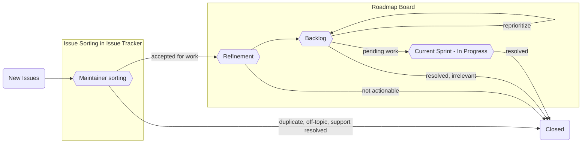

# Issue Sorting 与标签体系

> 本章深度解读 `HOW_WE_USE_GITHUB.md` 的核心机制：Issue Sorting（Issue 排序）流程、标签体系语法与互斥/并发规则、Roadmap Board 流转、6 项自动化汇总以及常用回复模板。这是 Conda 社区如何管理海量 Issue 的方法论核心。

## 1. Issue Sorting 概念与目的

### 1.1 为什么叫 "Sorting" 而不叫 "Triaging"

文档明确指出：

> "Issue sorting" 类似于 "triaging"，但我们刻意选用不同术语，因为 "triaging" 与非常沉重的主题（如伤病、战争）相关，我们希望对其内涵保持敏感。此外，我们对排序采取更"模糊"（fuzzy）的方式（例如严重度未必会赋值）。

即两个原因：

1. **措辞敏感性**：`triaging`（分诊）带医学/战争隐喻，语义沉重。
2. **模糊化取向**：排序不追求严格分级，严重度等字段并非必须赋值。

### 1.2 四种优先级

排序后的 Issue 最终落入四大优先级类别：

| 优先级 | 含义 |
|--------|------|
| **Do now** | 立即做 |
| **Do sometime** | 以后做 |
| **Provide user support** | 提供用户支持 |
| **Never do（即 close）** | 永不做，关闭 |

### 1.3 排序的目的

- 保证新 Issue 以不亚于新增速度的节奏被处理（处理速度 ≥ 流入速度）。
- **避免工程师倦怠**：消除"未经任何维护者评审的无尽积压"。
- 让工作可持续，同时便于维护者追踪并攻克大范围设计与架构类目标。

### 1.4 谁做排序、如何做

- **执行者**：核心维护者（core maintainers），负责关闭 Issue、设定功能工作优先级等。
- **排序时的处理结果**：
  - 通过短期 workaround 与修复缓解；
  - 重定向到正确项目；
  - 判断能否为报错与疑问提供支持；
  - 关闭重复/离题 Issue。
- **关键认知**：排序阶段的目标**不是解决问题**，而是理解 Issue、判断其是否合理，并尽可能收集信息，供维护者决定合理的解决排期。该"调查阶段"通常持续最久（1–2 周），期间查询用户更多细节、尝试其他 workaround 等。

### 1.5 排序后的流向

- 排序结束且有足够信息 → 加入 Roadmap Board 的 **Refinement** 栏（`orgs/conda/projects/22/views/14`）。
- 未被接受为计划工作的 Issue（重复、重定向、用户错误、已解决的支持问题等）→ 直接关闭。
- 新开的 PR 由 `.github/workflows/project.yml` 自动加入 **Review 板**（`orgs/conda/projects/16`）。

## 2. Roadmap Board 流转 Mermaid 流程图



流转语义：

1. **New Issues** 进入 Issue Tracker 的 **Maintainer sorting**（排序）。
2. 被接受为工作 → **Refinement**（细化）→ **Backlog**（积压，可重新排优先级）→ **Current Sprint**（当前迭代进行中）→ 完成即 **Closed**。
3. 未接受的（duplicate、off-topic、support resolved）直接 Closed。
4. 各阶段也可关闭：Refinement 后不可操作、Backlog 中已解决/无关、Current Sprint 中已解决。

## 3. 标签体系

### 3.1 标签的作用

- 核心维护者借助标签跟踪 Issue 状态（异步沟通场景下尤为重要），快速识别严重度与讨论状态。
- 每个标签有描述，悬停可见；颜色用于按类别区分。

### 3.2 标签语法 [category::topic]

新标签采用**带作用域的语法**，可选高层类别 + 具体主题：

```text
[topic]                 # 纯主题
[category::topic]       # 类别::主题
[category::topic-phrase] # 类别::主题短语
```

该语法有助于排序强制：保证已排序的 Issue 至少被 `type` 与 `source` 类别标记。不同仓库的标签术语被标准化为相似（甚至相同）的标签。

### 3.3 互斥 / 并发规则

**同类标签一般互斥**，但部分"限定词"类标签可并发出现：

| 类别 | 规则 | 示例 |
|------|------|------|
| `type` | **互斥**（一 Issue 至多一个） | `type::bug`、`type::feature`、`type::documentation` |
| `source` | **互斥**（一 Issue 至多一个） | 作者所属子群组（partner、frequent contributor、wider community 等） |
| `severity` | **互斥** | `type::bug` 必需，其他类型可选用于表示需求程度 |
| `os` | **可并发**（可标一个或多个） | `os::linux`、`os::macos`、`os::windows` |

示例说明：一个 Issue 不应同时是 bug 与 feature request；但涉及多操作系统的 Issue 可同时标注多个 `os` 标签。

### 3.4 每个 Issue 的最低标签要求

- 加入 Refinement 栏前，**必须**同时指定 `type` 与 `source` 标签。
- 所有 bug 还须带 `severity` 标签。
- `type`/`source`/`severity` 三类的描述在使用前应在 labels 页面核对。

> **自动化联动**：带 `type::support` 的 Issue 会走更激进的 stale 时间线（21 天标记 stale、30 天自动关闭），详见第 5 节。

### 3.5 全局 / 局部标签的定义位置

- **全局标签**（适用于组织内所有仓库）：加入 `conda/infrastructure` 的 `.github/global.yml`。
- **局部标签**（特定仓库）：加入各仓库自己的 `.github/labels.yml`。
- `labels.yml` 工作流将全局 + 局部标签聚合，同步到仓库可用标签集合。

## 4. 常见 Issue 类型

| 类型 | 定义 |
|------|------|
| **Standard Issue** | 典型的 bug 报告、功能请求或其他有明确定义与预期结果的工作项 |
| **Epics** | 可拆分为更小 Issue 的大工作项（重大功能/跨迭代变更）；用 GitHub sub-issues 功能关联 |
| **Spikes** | 结果未知甚至可选的工作：可能不完成、不一定实现，通常 timeboxed（限时）；不强制志愿者执行；用于探索未知问题或原型 |

**何时创建 Spike**：信息不足无法推进时（遇到团队从未见过的未知数）。**何时不该创建**：为已知可实现的特性写技术规格、API 外观设计、任何必须完成的工作。

## 5. 自动化汇总（6 项）

| # | 自动化 | 行为 |
|---|--------|------|
| 1 | **stale.yml**（Stale） | 见下方"双策略" |
| 2 | **lock.yml**（Lock） | 关闭后 365 天无进一步活动的 Issue/PR 被锁定 |
| 3 | **project.yml**（入板） | 新 PR 自动加入 Review 板（`orgs/conda/projects/16`） |
| 4 | **issues.yml**（标签切换） | 贡献者评论后，把 `pending::feedback` 切换为 `pending::support`，提示维护者关注 |
| 5 | **cla.yml**（CLA） | 合并前校验 CLA 签名；未签名则阻塞合并直至人工复核 |
| 6 | **sync.yml**（中央推送） | 从 `conda/infrastructure` 同步下发模板、标签、工作流与文档到各仓库 |

### 5.1 stale 双策略（文档口径）

| 对象 | 标记 stale | 关闭 | 总计 |
|------|-----------|------|------|
| `type::support` Issue | 21 天无活动 | 再 7 天 | 约 30 天 |
| 非 support Issue | 365 天无活动 | 再 30 天 | 约 1 年 1 个月 |
| 所有 PR | 365 天无活动 | 再 30 天 | 约 1 年 1 个月 |

> **文档与工作流差异提示**：`HOW_WE_USE_GITHUB.md` 按上述口径描述；但本地 `stale.yml` 实际配置为——support Issue：`days-before-issue-stale: 90`、`days-before-issue-close: 21`；非 support Issue 与 PR：365/30。`lock.yml` 实际配置为 issue 180 天、PR 365 天。阅读时以文档口径理解设计意图，以工作流文件为当前实现事实。

## 6. 常见回复模板（三个 details 块）

文档内置三个常用回复模板（可用 GitHub 的 Saved Reply 功能避免重复输入）：

### 6.1 Duplicate Issue（重复 Issue）

```text
This is a duplicate of [link to primary issue]; please feel free to continue the discussion there.
```

> ⚠️ 对被关闭的 Issue 应用 `duplicate` 标签，对原始 Issue 应用 `duplicate::primary` 标签。

### 6.2 Anaconda Products（Anaconda 产品问题）

```text
Thank you for filing this issue! Unfortunately, this is off-topic for this repo because
it is related to an Anaconda product. If you are encountering issues with Anaconda
products or services, you have several options for receiving community support:
- Anaconda community forums (https://community.anaconda.cloud)
- Anaconda issue tracker on GitHub (https://github.com/ContinuumIO/anaconda-issues/issues)
```

> ⚠️ 关闭前应用 `off-topic` 标签。

### 6.3 General Off Topic（一般性离题）

```text
Unfortunately, this issue is outside the scope of support we offer via GitHub or is
not directly related to this project. Community support can be found elsewhere, though,
and we encourage you to explore the following options:
- Conda discourse forum (https://conda.discourse.group/)
- Community chat channels (https://conda.org/community#chat)
- Stack Overflow posts tagged "conda" (https://stackoverflow.com/questions/tagged/conda)
```

> ⚠️ 关闭前应用 `off-topic` 标签。

## 7. 本章小结

- **Issue Sorting**：刻意区别于 triaging 的模糊化排序机制，产出四种优先级，核心维护者执行，目标是保证处理速度 ≥ 流入速度并避免倦怠。
- **标签体系**：`[category::topic]` 语法；`type`/`source`/`severity` 三类互斥、`os` 可并发；每个 Issue 至少 `type`+`source`，bug 需 `severity`。
- **流转**：New Issues → Maintainer sorting → Refinement → Backlog → Current Sprint → Closed（见第 2 节 Mermaid 图）。
- **自动化**：stale 双策略、lock 365 天、project 入板、issues 标签切换、CLA、sync 中央推送共 6 项。

> `HOW_WE_USE_GITHUB.md` 还覆盖 Working on Issues、Development Processes 与 Code Review/Merging（单 reviewer、必要时 second review、squash and merge），这些运营细则详见下一章运营指南。

---

**上一章**：[05-infrastructure-sync-model.md](05-infrastructure-sync-model.md) | **返回目录**：[00-overview.md](00-overview.md) | **下一章**：[07-operations-guide.md](07-operations-guide.md)
