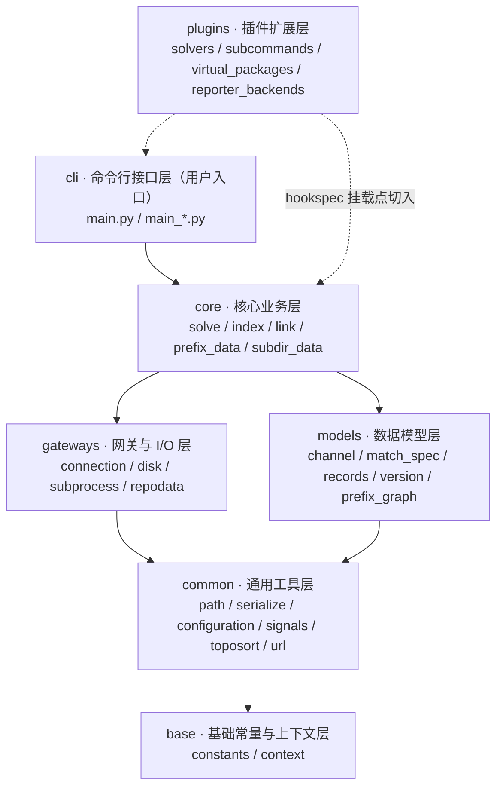

# conda 源码与 conda-docs 文档 Wiki 教程总览

本教程系统性学习 conda 包管理器源码（本地镜像 `external/libs/conda-dev/conda`）与 conda 官方文档站点源码（本地镜像 `external/libs/conda-dev/conda-docs`），梳理其模块分层、依赖关系与文档构建架构，帮助不同技术水平的读者循序渐进地读懂 conda 的内部实现。

## 1. 教程引言：为什么研究 conda 的源码

conda 是跨平台、语言无关的二进制包管理器，被 Miniforge、Anaconda Distribution 等发行版广泛使用，也是 Python 数据科学生态的基础设施之一。它的命令行接口完全用 Python 编写，采用 BSD-3-Clause 开源许可证。研究它的源码有几方面的价值：

| 价值维度 | 说明 |
|---------|------|
| **工程范本** | 一个约十万行级别的真实 Python 项目，展示了如何在大型工程中做模块分层、插件化与配置管理 |
| **核心机制** | 深入理解「环境 → 索引 → 求解 → 下载 → 链接」这条包管理主链路是如何被拆分与实现的 |
| **插件体系** | 学习 `pluggy` 钩子驱动的插件架构：求解器、子命令、虚拟包、通知等均以插件方式挂载 |
| **文档工程** | 通过 conda 内嵌 docs 与独立 conda-docs 两套 Sphinx 体系，理解 ReadTheDocs「主项目 + 子项目」的文档治理模式 |

本教程内容均以本地镜像的实际目录与文件为准；对未逐行核实的函数签名，一律采用概括性描述而不臆造细节。

## 2. 研究对象与本地路径

| 对象 | 本地路径 | 内容 |
|------|---------|------|
| conda 源码仓库 | `external/libs/conda-dev/conda` | 包管理器实现，主 Python 包位于 `conda/conda/` |
| conda 官方文档站点源码 | `external/libs/conda-dev/conda-docs` | `docs.conda.io` 门户站点源码，Sphinx 工程位于 `docs/source/` |

注意：conda 源码仓库内部也自带一套文档（`conda/docs/source/`，含 user-guide / dev-guide / commands），它与独立的 conda-docs 仓库是**两套文档体系**。二者的关系与差异将在 [01-architecture.md](01-architecture.md) 第 8 节详细对比。

## 3. 分层架构定位图

conda 主包 `conda/conda/` 内部按「基础 → 通用 → 模型 → 核心 → 网关 → 命令行」的层级组织，插件层横向切入。下图给出整体定位（自底向上分层，依赖方向由上层指向下层）：

> 说明：此图为**抽象分层示意**，用于建立整体心智模型，不代表严格的代码 import 关系。每一层的职责将在对应章节展开。

## 4. 章节导航表（共 10 章）

| 章节 | 文件 | 标题 | 简介 |
|------|------|------|------|
| 00 | [00-overview.md](00-overview.md) | 教程总览与导航索引 | 本教程的引言、分层定位图、章节导航、目标读者与阅读路径 |
| 01 | [01-architecture.md](01-architecture.md) | conda/conda-docs 整体架构 | conda 源码完整目录树、分层依赖、conda-docs 构建架构与两套文档体系对比 |
| 02 | [02-core-modules.md](02-core-modules.md) | 核心求解与安装模块（core/） | solve/index/link/prefix_data/subdir_data 等核心业务链路的机制 |
| 03 | [03-base-common.md](03-base-common.md) | 基础常量与通用工具层（base/ + common/） | constants/context 配置与 path/serialize/configuration/logic 等通用工具 |
| 04 | [04-models.md](04-models.md) | 数据模型层（models/） | channel/match_spec/records/version/prefix_graph 等核心数据模型 |
| 05 | [05-gateways.md](05-gateways.md) | 网关与 I/O 层（gateways/） | connection 多协议适配（http/ftp/s3/localfs）、disk 文件操作、subprocess 进程管理、repodata |
| 06 | [06-cli.md](06-cli.md) | 命令行接口层（cli/） | main.py 入口与 main_*.py 各命令的实现与注册方式 |
| 07 | [07-plugins.md](07-plugins.md) | 插件与扩展体系（plugins/） | hookspec/manager/solvers/virtual_packages/subcommands/reporter_backends 等插件能力 |
| 08 | [08-env-notices.md](08-env-notices.md) | 环境管理与通知（env/ + notices/） | env/specs/installers 环境文件解析与 notices 通知获取缓存 |
| 09 | [09-resources.md](09-resources.md) | 术语表与参考资料 | 术语表、权威资料链接与按难度分级的阅读建议 |

> 章节 02–09 为教程规划章节，将在后续逐步补全。当前已完成的章节可直接点击阅读。

## 5. 目标读者（三级）

| 读者类型 | 背景假设 | 阅读目标 |
|---------|---------|---------|
| **初学者** | 会使用 `conda install/create/activate` 等命令，好奇其内部如何工作 | 建立 conda 的分层心智模型，不陷入具体实现细节 |
| **进阶读者** | 熟悉 Python 与包管理概念（依赖求解、channel、prefix 等） | 理解各层的职责划分与模块间协作关系 |
| **源码研究者** | 有意阅读/贡献 conda 源码或做二次开发 | 沿目录树与依赖链精读源码，掌握插件扩展点与文档构建方式 |

## 6. 阅读路径建议

- **快速入门**：先读 [01-architecture.md](01-architecture.md) 掌握仓库全貌与分层，再按需跳读感兴趣的子包章节
- **系统学习**：按 `00 → 01 → … → 09` 顺序通读，从结构到机制逐步深入
- **关注包管理主链路**：重点阅读 02（core/）与 05（gateways/），理解「求解 → 下载 → 链接」的落地方式
- **关注扩展能力**：重点阅读 07（plugins/），理解插件如何横向增强求解器、子命令等能力
- **关注文档工程**：重点阅读 01 第 8 节，理解两套 Sphinx 文档体系的定位与差异

## 7. 关联 conda-dev-github-wiki 的说明

本教程属于 **08-systems-infrastructure** 主题，与该主题下的 [📘 conda .github 元仓库 Wiki](../conda-dev-github-wiki/README.md) 同源于 conda 生态，但聚焦点不同：

- **conda-dev-github-wiki**：研究 conda 组织级 `.github` 元仓库的**治理资产**——工作流、Issue 模板、中央同步模型，偏「组织协作与 GitHub 平台能力」。
- **本教程**：研究 conda **业务源码**与**文档站点源码**，偏「包管理器实现与文档工程」。

两个 Wiki 互补：前者回答「conda 组织如何协作」，后者回答「conda 软件如何实现、文档如何构建」。建议从 `.github` 治理侧切入后，再进入本教程深入代码实现。

---

- [🏠 返回系统基础设施目录](../README.md)