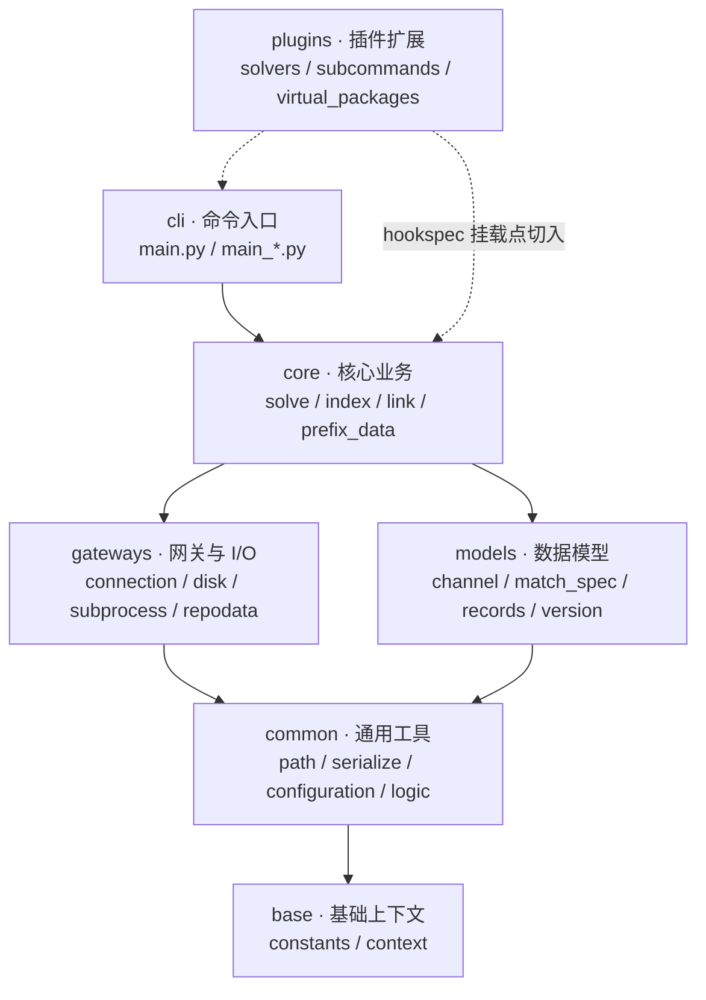

# conda/conda-docs 整体架构

本章从「目录树 → 分层依赖 → 文档构建」三个维度建立 conda 源码与文档体系的整体认知，并在最后对比仓内文档与独立 conda-docs 两套体系的关系与差异。

## 1. 仓库全景：两个研究对象

本教程涉及两个本地仓库：

1. **conda 源码仓库**（`external/libs/conda-dev/conda`）：跨平台二进制包管理器的实现与配套文档。外层 `conda/` 是仓库根，主 Python 包位于 `conda/conda/`。
2. **conda-docs 仓库**（`external/libs/conda-dev/conda-docs`）：`docs.conda.io` 门户站点的 Sphinx 源码，作为 ReadTheDocs 的「主项目」统领 conda / conda-build 子项目。

## 2. conda 源码仓库根目录结构

```text
conda/                            # 源码仓库根（外层 conda）
├── .github/                      # CI/CD 工作流、Issue/PR 模板、组织级配置
├── .devcontainer/                # Dev Container 开发容器配置
├── conda/                        # 主 Python 包（本教程核心研究对象）
├── dev/                          # 本地开发引导脚本（start / start.bat）
├── docs/                         # 仓库内嵌 Sphinx 文档（user-guide / dev-guide / commands）
├── durations/                    # 性能基准采集数据（Linux / macOS / Windows JSON）
├── news/                         # 变更日志片段（每个变更一个文件，随版本合并进 CHANGELOG）
├── recipe/                       # conda 自身的打包 recipe（meta.yaml 等）
├── tests/                        # 顶层测试（镜像主包内各子包结构）
├── .readthedocs.yml              # ReadTheDocs 构建配置
├── pyproject.toml                # 构建 / 格式化 / lint 配置（Ruff 等）
├── Makefile                      # 构建与常用任务入口
├── CHANGELOG.md                  # 正式变更日志（由 news/ 片段合并而来）
├── CONTRIBUTING.md               # 贡献指南
├── RELEASE.md                    # 发布流程说明
├── CITATION.cff                  # 学术引用元数据
├── CODE_OF_CONDUCT.md            # 行为准则
└── README.md                     # 项目说明（安装、入门、更新 conda 等）
```

需要区分的两个「conda」：**仓库根** `conda/`（外层）与**主包** `conda/conda/`（内层）。教程后续提到的「主包」均指内层 `conda/conda/`。

## 3. 主包 conda/conda/ 的 11 个子包

主包含 11 个业务子包，另有 3 个特殊目录：

| 子包 | 职责 | 关键文件（部分） |
|------|------|----------------|
| `base/` | 基础常量与全局上下文 | `constants.py`、`context.py` |
| `common/` | 跨模块通用工具 | `path/`、`serialize/`、`configuration.py`、`signals.py`、`toposort.py`、`url.py`、`compat.py`、`io.py`、`logic.py` |
| `models/` | 核心数据模型 | `channel.py`、`match_spec.py`、`records.py`、`version.py`、`prefix_graph.py` |
| `core/` | 核心业务逻辑 | `solve.py`、`index.py`、`link.py`、`prefix_data.py`、`subdir_data.py`、`package_cache_data.py` |
| `gateways/` | 网关与 I/O | `connection/`（http/ftp/s3/localfs 适配）、`disk/`、`subprocess.py`、`repodata/`、`shards/` |
| `cli/` | 命令行接口 | `main.py` 与大量 `main_*.py` 命令文件 |
| `plugins/` | 插件与扩展 | `hookspec.py`、`manager.py`、`solvers.py`、`virtual_packages/`、`subcommands/` |
| `env/` | 环境文件解析与安装 | `specs/`、`installers/`、`env.py`、`pip_util.py` |
| `notices/` | 渠道通知 | `core.py`、`fetch.py`、`cache.py` |
| `auxlib/` | 内嵌辅助库 | `collection.py`、`compat.py`、`entity.py`、`logz.py` |
| `shell/` | 平台 shell 激活脚本 | `condabin/`、`bin/`、`etc/profile.d/` |

特殊目录：

- `testing/`：测试工具与共享 fixtures（`fixtures.py`、`cases.py`、`http_test_server.py` 等）
- `_private/`：内部实现（`shards/`、`exception_guidance.py`、`extract.py`、`zstd.py` 等）
- `_preview/`：预览功能（如 `env_setup/`），以 `_` 前缀表示内部/实验性，不对外承诺 API 稳定

## 4. 根级模块

主包根目录下的模块承担「入口、异常、导出、历史」等横切职责：

| 模块 | 职责 |
|------|------|
| `__init__.py` | 包元数据（`__version__` 等）、`CondaError`/`CondaMultiError`/`CondaExitZero` 异常基类、`conda_signal_handler` 信号处理、`CONDA_PACKAGE_ROOT`/`CONDA_SOURCE_ROOT` 路径常量 |
| `__main__.py` | `python -m conda` 入口 |
| `exceptions.py` | conda 异常体系（含 `CondaSignalInterrupt` 等） |
| `exception_handler.py` | 异常统一处理与用户可读输出 |
| `api.py` | 供外部程序调用的 Python API |
| `resolve.py` / `deprecations.py` | 求解相关 / 废弃机制约定 |
| `exports.py` / `history.py` / `instructions.py` / `misc.py` / `reporters.py` / `utils.py` / `activate.py` | 导出、环境历史、指令、杂项、报告器、工具、激活等辅助逻辑 |
| `py.typed` | 类型标注标记文件（PEP 561） |

## 5. 分层依赖关系（文字说明）

conda 主包内部形成清晰的层级，依赖方向总体**自上而下、收敛到 base**：

1. **base 层**最底层：提供全局常量与上下文（`context.py` 聚合渠道、前缀、线程、安全等运行期参数），几乎所有层都要读取它。
2. **common 层**是通用工具库：路径处理（`path/`）、序列化（`serialize/`）、配置加载（`configuration.py`）、拓扑排序（`toposort.py`）、URL 处理（`url.py`）等，被上层广泛复用，不依赖业务模型。
3. **models 层**定义核心数据模型：channel、MatchSpec、PackageRecord、version 比较、prefix 依赖图等，是「求解」与「建模」的语言基础。
4. **core 层**承载业务逻辑：拉取索引（`index.py`/`subdir_data.py`）、依赖求解（`solve.py`）、事务链接（`link.py`）、前缀数据（`prefix_data.py`）等，组合 models 与 common。
5. **gateways 层**负责与外部交互：网络连接（connection 的多协议适配器）、磁盘文件原子操作（`disk/`）、子进程调用（`subprocess.py`）、repodata 获取解析，为 core 提供数据输入与落地能力。
6. **cli 层**位于最上层：解析用户命令并调用 core/gateways 完成操作，是唯一面向用户的入口。
7. **plugins 层**横向切入：通过 `hookspec.py` 定义钩子、`manager.py` 注册插件，向求解器（solvers）、子命令（subcommands）、虚拟包（virtual_packages）、输出后端（reporter_backends）等注入扩展，实现「核心稳定、能力可插拔」。

> 此分层为便于理解的**抽象概括**；实际代码中存在少量跨层直接依赖（例如某些轻量工具彼此引用），但整体上遵循上述收敛方向。

## 6. 分层依赖图



## 7. conda-docs 目录树与构建架构

conda-docs 是 `docs.conda.io` 的**门户/落地页**仓库，也是 ReadTheDocs 的 primary project。其结构如下：

```text
conda-docs/
├── docs/
│   ├── Makefile                  # Sphinx 构建入口（make html）
│   └── source/                   # Sphinx 源目录
│       ├── conf.py               # Sphinx 配置（project=conda-docs、主题、重定向）
│       ├── index.rst             # 主文档/落地页（toctree：help-support/contributing/license）
│       ├── announcements.rst     # 公告
│       ├── intro.rst             # 项目简介
│       ├── conda.rst             # conda 项目落地页（重定向出口）
│       ├── conda-build.rst       # conda-build 落地页（重定向出口）
│       ├── miniconda.rst         # Miniconda 落地页（重定向出口）
│       ├── contributing.rst      # 贡献指南页
│       ├── help-support.rst      # 帮助与支持页
│       ├── get-involved.rst      # 参与方式页
│       ├── license.rst           # 许可证页
│       ├── redirects.rst         # 重定向声明源
│       ├── robots.txt            # 站点 robots（指向 sitemap）
│       ├── _static/              # CSS/JS/图片
│       ├── _templates/           # 主题模板（layout.html）
│       └── img/                  # 页面配图
├── requirements.txt              # 文档构建依赖（pip install -r）
├── .readthedocs.yml              # ReadTheDocs 配置
└── README.md                     # 说明「主项目 + 子项目」模型
```

构建架构要点：

- **主题与扩展**：`conf.py` 使用 `conda_sphinx_theme` 主题，扩展精简（autodoc、autosummary、graphviz、sphinx_design、sphinx_reredirects、sphinx_sitemap 等）。
- **重定向**：`conf.py` 的 `redirects` 将 `conda`、`conda-build`、`miniconda` 分别指向 `docs.conda.io/projects/...` 各自站点，实现门户 → 项目文档的跳转。
- **主项目/子项目模型**：conda-docs 是 ReadTheDocs primary project，`conda` 与 `conda-build` 作为 subproject 各自在仓库内构建文档，最终汇聚到同一域名下。
- **本地构建**：`cd docs && make html`，产物输出到 `_build/html`。

## 8. 两套文档体系的关系与差异对比

conda 的文档实际上由**两套独立的 Sphinx 工程**构成，分别存在于两个仓库：

| 维度 | conda 仓库内嵌 `conda/docs/source/` | 独立 conda-docs 仓库 `conda-docs/docs/source/` |
|------|-----------------------------------|----------------------------------------------|
| Sphinx 项目名 | `conda`（`project = conda.__name__`） | `conda-docs` |
| 版本注入 | `version = release = conda.__version__`（CalVer） | 空字符串（无独立版本号） |
| 主题 | `conda_sphinx_theme` | `conda_sphinx_theme` |
| 关键扩展 | autoapi、myst_parser、napoleon、intersphinx、mermaid、plantuml、sphinxarg、copybutton 等，以及自研 `conda_umls` / `nav_glossary` | autodoc、autosummary、graphviz、sphinx_design、sphinx_reredirects、sphinx_sitemap 等精简集合 |
| 内容范围 | 面向使用者与开发者的完整手册：`user-guide/`、`dev-guide/`、`commands/`、glossary、configuration、release-notes | 门户与落地页：announcements、intro、conda/conda-build/miniconda、contributing、license、help-support |
| 构建定位 | ReadTheDocs 的 **subproject**（随源码版本发布） | ReadTheDocs 的 **primary project**（统领子项目、统一域名） |
| 出口 URL | `https://docs.conda.io/projects/conda/en/latest` | `https://docs.conda.io/`（首页门户 + 重定向） |
| 重定向职责 | — | 将 `conda`/`conda-build`/`miniconda` 指向各自站点 |

一句话总结二者关系：**conda 仓库内嵌 docs 承载「具体内容」，conda-docs 仓库承载「门户与跳转」**。conda-docs 不重复维护用户手册，而是通过 ReadTheDocs 的组合把各仓库文档统一到一个域名下。学习 conda 源码时应以 conda 仓库内嵌 docs（尤其 `dev-guide/`）为权威手册。

## 9. 本章小结

通过本章可建立三层坐标系：**仓库根**（工程外围：构建、测试、CI、发布）→ **主包**（11 子包 + 根级模块，遵循 base→…→cli 分层）→ **文档体系**（内嵌 docs 承载内容，conda-docs 承载门户）。后续章节将按分层逐层深入。

---

**上一章**：[00-overview.md](00-overview.md) | **返回目录**：[00-overview.md](00-overview.md) | **下一章**：[02-core-modules.md](02-core-modules.md)