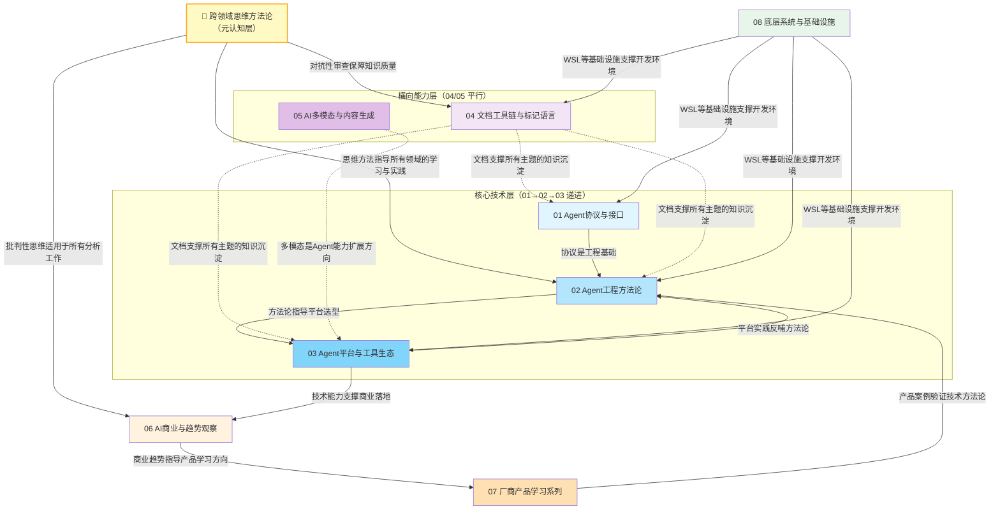

# Learning Wiki 主题分类体系

> 知识库架构设计与导航指南
> 创建日期：2026-07-05
> 内容范围：分类原则→主题关系→学习路径→Wiki清单

---

## 一、分类设计原则

Learning Wiki 采用**认知递进式**主题分类架构，遵循以下6条核心设计原则：

### 1. 认知递进原则

主题编号按从"基础协议"→"工程方法"→"平台工具"→"工具链"→"多模态"→"商业落地"→"案例研究"→"底层系统"的认知路径排列，符合从抽象到具体、从理论到实践的学习规律。

- **01-03**：技术核心层（协议→方法→平台），构建Agent技术认知
- **04-05**：横向能力层（文档工具→多模态内容），补充工程与创作能力
- **06**：商业落地层，连接技术与商业价值
- **07**：案例支撑层，通过厂商产品学习深化理解
- **08**：底层支撑层，夯实系统基础设施认知

### 2. 知识内聚原则

每个主题目录内的Wiki共享同一认知域，主题词重叠度≥60%。例如：
- `01-agent-protocols-interfaces/` 内所有Wiki都围绕"协议/接口/通信"展开
- `07-vendor-product-learning/` 采用二级子目录按厂商聚合，避免跨厂商知识混杂

### 3. 唯一归属原则

每个Wiki有且仅有一个主题归属，不跨主题重复放置。对于边界模糊的内容：
- 优先归入"核心主题"而非"支撑主题"
- 跨主题内容以Wiki内部链接方式关联，不重复归档
- 系列索引文件作为导航入口而非内容重复载体

### 4. 系列聚合原则

同一厂商或同一产品线的Wiki通过**二级子目录**聚合，如：
- `07-vendor-product-learning/sunlogin/`：向日葵全系列12个Wiki
- `07-vendor-product-learning/tuya/`：涂鸦TuyaOpen 3个Wiki

子目录内设置**系列索引入口**（如 `sunlogin-product-series-index.md`）作为系列导航。

### 5. 粒度均衡原则

单个主题目录内Wiki数量控制在2-15个范围内：
- 少于2个：合并到相邻主题
- 多于15个：按二级维度拆分子目录（如厂商子目录）
- 原子化Wiki的子章节文件不计入数量统计（仅统计入口.md文件）

### 6. 面向检索原则

主题命名采用"编号-关键词"格式，支持：
- **数字序号浏览**：按01→08顺序系统学习
- **关键词检索**：通过目录名中的英文关键词快速定位
- **标签关联**：每个Wiki携带5-8个主题标签，支持跨主题检索

---

## 二、主题间关联关系图



**图例说明**：
- **实线箭头（→）**：强依赖/递进关系，前置主题是后置主题的学习基础
- **虚线箭头（-·→）**：支撑/关联关系，横向能力或底层系统为多个主题提供支撑
- **颜色编码**：蓝色系=核心技术层，紫色系=横向能力层，橙色系=商业案例层，绿色系=底层支撑层

---

## 三、推荐学习路径

### 路径1：入门路径（Agent技术全貌）

适合人群：刚接触AI Agent领域，希望建立完整技术认知的学习者

| 顺序 | 主题 | 核心Wiki | 学习目标 |
|------|------|----------|---------|
| 1 | 01 协议与接口 | [Agent通信协议](01-agent-protocols-interfaces/agent-communication-protocols-wiki.md)、[四层概念](01-agent-protocols-interfaces/interface-api-abi-protocol-wiki/00-overview.md) | 理解Agent互联互通的基础标准 |
| 2 | 02 工程方法论 | [四代工程概念](02-agent-engineering-methodology/four-engineering-concepts-wiki.md)、[Harness工程](02-agent-engineering-methodology/harness-engineering-wiki.md) | 掌握从Prompt到Loop的工程范式演进 |
| 3 | 03 平台工具 | [Claude Tag](03-agent-platforms-tools/claude-tag-article.md)、[Open Code Review](03-agent-platforms-tools/open-code-review-wiki.md) | 了解主流Agent平台与工具生态 |
| 4 | 06 商业趋势 | [AI变现指南](06-business-trends-analysis/ai-monetization-wiki/00-overview.md) | 理解技术如何转化为商业价值 |

**预计学习时间**：2-3周

### 路径2：垂直领域路径（厂商产品深度学习）

适合人群：需要深入研究特定厂商产品或垂直领域解决方案的学习者

**前置要求**：已完成入门路径的01-02主题

| 方向 | 主题 | 核心Wiki | 学习目标 |
|------|------|----------|---------|
| 远程控制 | 07 厂商产品→向日葵 | [产品系列索引](07-vendor-product-learning/sunlogin/sunlogin-product-series-index.md)、[开机盒子](07-vendor-product-learning/sunlogin/sunlogin-bootbox-analysis.md)、[无网远控硬件](07-vendor-product-learning/sunlogin/sunlogin-offline-hardware-wiki.md) | 系统学习贝锐向日葵软硬结合远程控制方案 |
| AIoT | 07 厂商产品→涂鸦 | [TuyaOpen全面报告](07-vendor-product-learning/tuya/tuya-open-learning-report.md) | 掌握跨平台AI-IoT SDK开发方法 |
| 金融Agent | 03 平台工具 | [Anthropic金融服务](03-agent-platforms-tools/anthropic-financial-services-wiki.md)、[QuantDinger量化交易](03-agent-platforms-tools/quantdinger-ai-trading-wiki.md) | 理解金融垂直领域Agent应用 |
| 安全Agent | 03 平台工具 | [MopMonk安全Agent](03-agent-platforms-tools/mopmonk-security-agent-wiki.md) | 学习AI安全Agent技术实现 |

### 路径3：底层技术路径（系统与基础设施）

适合人群：需要夯实底层技术、理解系统实现原理的开发者

| 顺序 | 主题 | 核心Wiki | 学习目标 |
|------|------|----------|---------|
| 1 | 08 底层系统 | [WSL学习计划](08-systems-infrastructure/wsl-learning-plan.md)、[WSL CLI与架构](08-systems-infrastructure/wsl-cli-and-architecture-wiki.md) | 掌握Windows/Linux互操作底层机制 |
| 2 | 01 协议与接口 | [FFI外部函数接口](01-agent-protocols-interfaces/ffi-wiki/00-overview.md)、[IDL接口定义语言](01-agent-protocols-interfaces/idl-wiki/00-overview.md)、[TVM FFI](01-agent-protocols-interfaces/tvm-ffi-wiki/00-overview.md) | 理解跨语言调用与接口定义底层技术 |
| 3 | 01 协议与接口 | [Agent Runtime Protocol](01-agent-protocols-interfaces/agent-runtime-protocol-wiki.md) | 深入生产级Agent运行时协议设计 |
| 4 | 02 工程方法论 | [Headroom上下文压缩](02-agent-engineering-methodology/headroom-context-compression-wiki.md)、[DSpark推理加速](02-agent-engineering-methodology/dspark-paper-wiki.md) | 掌握Agent性能优化底层技术 |

---

## 四、8个主题详细说明

---

### 01 Agent协议与接口技术栈

**认知定位**：Agent生态的"通信宪法"层——定义Agent之间、Agent与工具之间如何对话、如何连接、如何互操作，是所有Agent应用的技术地基。

**核心主题词**：`agent-protocols`、`mcp`、`a2a`、`acp`、`anp`、`interface`、`api`、`ffi`、`idl`、`skills-standard`

**边界说明**：

| 归入本主题 | 不归入本主题 |
|-----------|-------------|
| Agent间通信协议（MCP/ACP/A2A/ANP） | 具体Agent平台的产品评测（归入03） |
| Interface/API/ABI/Protocol四层概念 | Agent工程方法论（归入02） |
| 外部函数接口（FFI）、接口定义语言（IDL） | 文档标记语言（归入04） |
| Agent Skills开放标准、国内Skill/MCP生态 | 厂商私有协议实现（归入07） |
| TVM FFI等深度学习编译器跨语言接口 | 操作系统级系统调用（归入08） |

**完整Wiki清单**：

| Wiki名 | 入口文件 | 一句话说明 | 类型 |
|--------|---------|-----------|------|
| Agent通信协议教程 | [agent-communication-protocols-wiki.md](01-agent-protocols-interfaces/agent-communication-protocols-wiki.md) | MCP/ACP/A2A/ANP四层协议栈完整教程，含协议对比、交互流程、代码示例 | 原子化 |
| Agent Interface深度解析 | [agent-interface-deep-dive/00-overview.md](01-agent-protocols-interfaces/agent-interface-deep-dive/00-overview.md) | 从Agent视角解析Interface/API/ABI/Protocol四层技术栈在MCP/ACP/A2A生态中的具体体现 | 原子化 |
| Agent Runtime Protocol | [agent-runtime-protocol-wiki.md](01-agent-protocols-interfaces/agent-runtime-protocol-wiki.md) | 生产级Agent运行时协议对象与八大维度解析，覆盖LangGraph/OpenAI Assistants/AutoGen/Claude SDK | 单文件 |
| Agent Skills开放标准 | [agent-skills-open-standard-wiki.md](01-agent-protocols-interfaces/agent-skills-open-standard-wiki.md) | agentskills.io开放标准完整指南，含目录结构、SKILL.md格式、渐进式披露、客户端集成 | 单文件 |
| Agent Skills完整教程 | [agent-skills-wiki/00-overview.md](01-agent-protocols-interfaces/agent-skills-wiki/00-overview.md) | agentskills.io官方教程原子化拆解，含快速入门、最佳实践、描述优化、质量评估、脚本使用 | 原子化 |
| 国内Skill/MCP生态盘点 | [domestic-skill-mcp-ecosystem-wiki.md](01-agent-protocols-interfaces/domestic-skill-mcp-ecosystem-wiki.md) | 16个国内品牌的Agent化浪潮盘点，覆盖微信/飞书/钉钉/支付等生态 | 单文件 |
| FFI外部函数接口 | [ffi-wiki/00-overview.md](01-agent-protocols-interfaces/ffi-wiki/00-overview.md) | 外部函数接口完整教程，含工作原理、多语言实现、使用场景、优缺点对比 | 原子化 |
| IDL接口定义语言 | [idl-wiki/00-overview.md](01-agent-protocols-interfaces/idl-wiki/00-overview.md) | 接口定义语言系统教程，含语法类型、主流IDL规范对比、工具链、使用场景 | 原子化 |
| Interface/API/ABI/Protocol四层概念 | [interface-api-abi-protocol-wiki/00-overview.md](01-agent-protocols-interfaces/interface-api-abi-protocol-wiki/00-overview.md) | 软件接口四层抽象通用概念辨析，不局限于Agent语境 | 原子化 |
| TVM FFI深度学习编译器 | [tvm-ffi-wiki/00-overview.md](01-agent-protocols-interfaces/tvm-ffi-wiki/00-overview.md) | TVM深度学习编译器FFI系统完整解析，含架构、C++核心API、类型系统、Python绑定、CUDA支持 | 原子化 |

---

### 02 Agent工程方法论

**认知定位**：Agent开发的"兵法"层——从Prompt Engineering到Loop Engineering的四代工程范式演进，提供驾驭AI Agent的系统化思维框架与实战方法论。

**核心主题词**：`harness-engineering`、`prompt-engineering`、`context-engineering`、`loop-engineering`、`karpathy-guidelines`、`context-compression`、`vibe-coding`、`longcat`

**边界说明**：

| 归入本主题 | 不归入本主题 |
|-----------|-------------|
| Agent工程范式演进（Prompt→Context→Harness→Loop） | 具体通信协议标准（归入01） |
| Harness Engineering驾驭工程方法论 | 具体Agent平台产品（归入03） |
| Karpathy LLM编程四条准则 | 文档工具链使用方法（归入04） |
| Headroom上下文压缩中间件 | 多模态内容生成技术（归入05） |
| LongCat Agent + Loop Engineering实战 | 商业变现方法论（归入06） |
| Vibe Coding两大神级Prompt（第一性原理+对抗式审查） | 厂商产品案例分析（归入07） |
| DSpark推理加速论文 | 底层系统基础设施（归入08） |

**完整Wiki清单**：

| Wiki名 | 入口文件 | 一句话说明 | 类型 |
|--------|---------|-----------|------|
| DSpark推理加速论文 | [dspark-paper-wiki.md](02-agent-engineering-methodology/dspark-paper-wiki.md) | DeepSeek DSpark推理加速论文学习笔记 | 单文件 |
| 四代工程概念演进 | [four-engineering-concepts-wiki.md](02-agent-engineering-methodology/four-engineering-concepts-wiki.md) | Prompt→Context→Harness→Loop四代AI工程概念的范式演进与瓶颈转移分析 | 单文件 |
| Harness驾驭工程 | [harness-engineering-wiki.md](02-agent-engineering-methodology/harness-engineering-wiki.md) | 阿里Harness Engineering方法论完整教程，含四条铁律、六大模式、悟空AI招聘案例 | 原子化 |
| Headroom上下文压缩 | [headroom-context-compression-wiki.md](02-agent-engineering-methodology/headroom-context-compression-wiki.md) | AI Agent上下文压缩中间件完整教程，1万Token压到1千且质量不降反升，含六种压缩算法、CCR可逆机制 | 原子化 |
| Karpathy LLM编程准则 | [karpathy-llm-coding-guidelines-tutorial.md](02-agent-engineering-methodology/karpathy-llm-coding-guidelines-tutorial.md) | Karpathy四条行为准则完整教程，含真实代码正反例、四种分发格式、Multica平台介绍、SpecWeave整合 | 原子化 |
| LongCat Agent实测 | [longcat-agent-learning-wiki.md](02-agent-engineering-methodology/longcat-agent-learning-wiki.md) | 美团LongCat-2.0（1.6T MoE）接入Claude Code完整流程，含BI看板实战、Token效率对比、Loop Engineering | 原子化 |
| Vibe Coding神级Prompt | [vibe-coding-prompts-learning-analysis.md](02-agent-engineering-methodology/vibe-coding-prompts-learning-analysis.md) | 第一性原理（管生成）与对抗式审查（管验证）构成的Vibe Coding双Prompt闭环分析 | 单文件 |

---

### 03 Agent平台与工具生态

**认知定位**：Agent技术的"兵器谱"层——汇聚国内外主流Agent平台、垂直领域Agent产品、开源工具，是方法论落地的实际载体。

**核心主题词**：`anthropic`、`claude`、`trae`、`agent-platform`、`multi-agent`、`browser-automation`、`code-review`、`trading-agent`、`security-agent`、`rl-agent`

**边界说明**：

| 归入本主题 | 不归入本主题 |
|-----------|-------------|
| 通用Agent平台与产品路线图（Anthropic等） | Agent通信协议标准（归入01） |
| 垂直领域Agent（金融/安全/浏览器/量化交易） | Agent工程方法论（归入02） |
| 企业协作Agent（Claude Tag等） | 文档工具链（MyST/ExecutableBooks等，归入04） |
| 开源Agent项目（Open Code Review/The Agency等） | 多模态AIGC内容工具（归入05） |
| 自演进Agent在线强化学习（AReaL） | 商业趋势与变现分析（归入06） |
| 桌面Agent（EchoBird百灵鸟等） | 厂商全系列产品深度学习（归入07） |
| 多Agent协作平台（Octo明略科技） | WSL等底层系统（归入08） |

**完整Wiki清单**：

| Wiki名 | 入口文件 | 一句话说明 | 类型 |
|--------|---------|-----------|------|
| Anthropic Agent路线图 | [anthropic-agent-roadmap-wiki.md](03-agent-platforms-tools/anthropic-agent-roadmap-wiki.md) | Conway永久在线智能体、文件记忆、Orbit主动助手、Operon科研平台、BugCrawl代码审计与GPT-5.6竞争分析 | 单文件 |
| Anthropic金融服务Agent | [anthropic-financial-services-wiki.md](03-agent-platforms-tools/anthropic-financial-services-wiki.md) | 华尔街AI金融Agent工具箱完整教程 | 单文件 |
| AReaL自演进Agent RL | [areal-agent-rl-wiki.md](03-agent-platforms-tools/areal-agent-rl-wiki.md) | 蚂蚁集团AReaL 2.0自演进Agent在线强化学习基础设施 | 单文件 |
| BrowserAct浏览器自动化 | [browseract-wiki.md](03-agent-platforms-tools/browseract-wiki.md) | 让Agent真正能操作浏览器的自动化工具，基于Playwright与Skill Forge | 单文件 |
| Claude Tag企业协作 | [claude-tag-article.md](03-agent-platforms-tools/claude-tag-article.md) | Anthropic企业协作工具Claude Tag知识捕获，卡帕西称其为LLM用户界面第三次变革 | 原子化 |
| EchoBird百灵鸟桌面Agent | [echobird-wiki.md](03-agent-platforms-tools/echobird-wiki.md) | Tauri+Rust桌面Agent，Model Nexus支持本地LLM（Claude Code/Codex/OpenClaw） | 单文件 |
| MopMonk安全Agent | [mopmonk-security-agent-wiki.md](03-agent-platforms-tools/mopmonk-security-agent-wiki.md) | MiniMax M3驱动的安全Agent，CyberGym漏洞挖掘 | 原子化 |
| Octo多Agent协作平台 | [octo-platform-wiki.md](03-agent-platforms-tools/octo-platform-wiki.md) | 明略科技Octo：Private AI时代多Agent协作基础设施，含Matter/Taste/Orchestration核心技术 | 单文件 |
| Open Code Review代码评审 | [open-code-review-wiki.md](03-agent-platforms-tools/open-code-review-wiki.md) | 阿里开源AI代码评审工具完整教程，含安装、使用、优化、集成、效果验证 | 原子化 |
| QuantDinger AI量化交易 | [quantdinger-ai-trading-wiki.md](03-agent-platforms-tools/quantdinger-ai-trading-wiki.md) | 开源自托管AI量化交易平台，Docker Compose一键部署，MCP Agent Gateway双轨策略开发 | 单文件 |
| Rainman AI翻译工具 | [rainman-translate-book-wiki.md](03-agent-platforms-tools/rainman-translate-book-wiki.md) | Rainman Translate Book AI翻译工具Wiki教程 | 原子化 |
| TRAE v3.3.74版本发布笔记 | [trae-v3-3-74-release-notes.md](03-agent-platforms-tools/trae-v3-3-74-release-notes.md) | TRAE IDE版本更新：Browser配置聚合页、Windows MSSDK接入 | 单文件 |
| The Agency项目 | [the-agency-project-wiki.md](03-agent-platforms-tools/the-agency-project-wiki.md) | The Agency多Agent项目学习笔记 | 单文件 |

---

### 04 文档工具链与标记语言

**认知定位**：知识沉淀的"工匠精神"层——高质量的文档是知识可复用、可传播的基础，本主题聚焦Markdown生态扩展、技术文档工具链与构建系统。

**核心主题词**：`myst-markdown`、`executablebooks`、`jupyter-book`、`documentation-toolchain`、`markup-language`、`scikit-build`、`declarative-html`、`python-build`

**边界说明**：

| 归入本主题 | 不归入本主题 |
|-----------|-------------|
| MyST Markdown语法与生态 | Agent协议与接口标准（归入01） |
| ExecutableBooks/Jupyter Book技术文档体系 | Agent工程方法论（归入02） |
| HTML声明式局部更新等Web标准特性 | Agent平台产品使用（归入03） |
| Python构建工具（scikit-build-core） | 多模态内容生成（归入05） |
| 标记语言扩展（Directives/Roles/Cross-references） | 商业趋势分析（归入06） |
| 文档项目结构与frontmatter配置 | 厂商产品文档（归入07） |
| | 操作系统级文档（归入08） |

**完整Wiki清单**：

| Wiki名 | 入口文件 | 一句话说明 | 类型 |
|--------|---------|-----------|------|
| HTML声明式局部更新 | [declarative-partial-updates-wiki.md](04-docs-markup-tooling/declarative-partial-updates-wiki.md) | Chrome声明式局部更新能力解析，Streaming/SSR/Declarative Shadow DOM | 单文件 |
| ExecutableBooks/MyST指南 | [executablebooks-myst-guide-wiki.md](04-docs-markup-tooling/executablebooks-myst-guide-wiki.md) | MyST Markdown生态概览、核心语法、项目结构、frontmatter配置、TOC配置、最佳实践 | 原子化 |
| MyST Markdown完整教程 | [myst-markdown-tutorial/README.md](04-docs-markup-tooling/myst-markdown-tutorial/README.md) | MyST Markdown从入门到精通16章教程，含基础语法、高级Directives/Roles、交叉引用、数学公式、UI组件、工具链 | 原子化 |
| scikit-build-core Python构建 | [scikit-build-core-wiki/00-overview.md](04-docs-markup-tooling/scikit-build-core-wiki/00-overview.md) | 下一代Python构建系统scikit-build-core完整教程，含概念架构、项目结构、核心API、最佳实践 | 原子化 |

---

### 05 AI多模态与内容生成

**认知定位**：AI创造力的"工具箱"层——覆盖文本之外的音频、视频、3D、CAD、动画等多模态内容生成技术与创作平台。

**核心主题词**：`ai-video`、`audio-generation`、`text-to-cad`、`3d-animation`、`ai-shortdrama`、`creative-platform`、`multimodal`、`aigc`、`animejs`、`threejs`

**边界说明**：

| 归入本主题 | 不归入本主题 |
|-----------|-------------|
| AI视频/短剧生成平台（Agnes/Pavo/LibTV） | Agent通信协议（归入01） |
| 极速音频生成（AudioX-Turbo） | Agent工程方法论（归入02） |
| 文本转CAD（Text-to-CAD） | 通用Agent平台（归入03） |
| 前端3D动画（Anime.js+Three.js） | 文档标记语言（归入04） |
| AI配图Skill（Ian小嘿插图） | 商业变现方法论（归入06） |
| 多模态创意生成平台 | 厂商硬件产品（归入07） |
| | 底层系统基础设施（归入08） |

**完整Wiki清单**：

| Wiki名 | 入口文件 | 一句话说明 | 类型 |
|--------|---------|-----------|------|
| Agnes/Pavo AI短剧平台 | [agnes-pavo-creative-platform-wiki.md](05-ai-multimodal-content/agnes-pavo-creative-platform-wiki.md) | 免费多模态API+一站式AI短剧工作流创作平台 | 单文件 |
| Anime.js+Three.js 3D动画 | [animejs-threejs-adapter-analysis.md](05-ai-multimodal-content/animejs-threejs-adapter-analysis.md) | Anime.js 4.5官方Three.js适配器解析，适配器模式解决Three.js动画六大痛点 | 单文件 |
| AudioX-Turbo极速音频生成 | [audiox-turbo-audio-generation-wiki.md](05-ai-multimodal-content/audiox-turbo-audio-generation-wiki.md) | 4步推理+6种任务统一+920万数据集的Anything-to-Audio框架，Distribution-Matching-Distillation师生蒸馏 | 单文件 |
| Ian小嘿插图AI配图Skill | [ian-xiaohei-illustrations.md](05-ai-multimodal-content/ian-xiaohei-illustrations.md) | AI配图Skill学习分析 | 单文件 |
| LibTV AI短剧创作工具 | [libtv-ai-shortdrama-wiki.md](05-ai-multimodal-content/libtv-ai-shortdrama-wiki.md) | AI短剧/AI漫画创作工具，含3D导演、角色质量控制、情感控制 | 单文件 |
| Text-to-CAD文本转CAD | [text-to-cad-wiki.md](05-ai-multimodal-content/text-to-cad-wiki.md) | 文本转CAD技术学习笔记 | 单文件 |

---

### 06 AI商业与趋势观察

**认知定位**：技术价值的"罗盘"层——从商业视角审视AI技术，分析变现路径、行业趋势、产品选型，连接技术能力与市场需求。

**核心主题词**：`ai-monetization`、`business-model`、`domestic-llm`、`personal-ip`、`solopreneur`、`marketing-creation`、`trend-analysis`、`pmf`

**边界说明**：

| 归入本主题 | 不归入本主题 |
|-----------|-------------|
| AI变现方法论与商业模式 | Agent协议标准（归入01） |
| 国产AI模型对比与选型 | Agent工程实践方法（归入02） |
| 个人IP创业趋势（Papi酱案例） | 具体Agent平台产品评测（归入03） |
| AI工具对比分析 | 文档工具技术细节（归入04） |
| 营销创作平台案例（火山KickArt） | 多模态生成技术原理（归入05） |
| 行业趋势观察与商业洞察 | 厂商产品深度拆解（归入07） |
| | 底层系统技术（归入08） |

**完整Wiki清单**：

| Wiki名 | 入口文件 | 一句话说明 | 类型 |
|--------|---------|-----------|------|
| AI变现完整指南 | [ai-monetization-wiki/00-overview.md](06-business-trends-analysis/ai-monetization-wiki/00-overview.md) | 从技术到商业的全流程方法论，含市场分析、商业模式、技术选型、产品开发、GTM策略、盈利路径、三类场景 | 原子化 |
| 国产AI模型对比 | [domestic-llm-comparison-notes.md](06-business-trends-analysis/domestic-llm-comparison-notes.md) | DeepSeek V4/Kimi K2.7/MiniMax M3/GLM 5.2四款国产模型对比，按四类人群推荐方案，"能力是入场券，信任才是留下来的理由" | 单文件 |
| Papi酱个人IP创业趋势 | [papi-jiang-solo-ip-trend-wiki.md](06-business-trends-analysis/papi-jiang-solo-ip-trend-wiki.md) | Papi酱十年创业时间线解析，"把公司做小，把IP做大"创业新趋势，小而美模式实践启示 | 原子化 |
| 三大AI工具分析 | [three-ai-tools-wiki.md](06-business-trends-analysis/three-ai-tools-wiki.md) | 三大AI工具对比分析 | 单文件 |
| 火山引擎KickArt营销创作 | [volcengine-kickart-marketing-creation-analysis.md](06-business-trends-analysis/volcengine-kickart-marketing-creation-analysis.md) | 火山引擎KickArt营销创作平台分析 | 单文件 |

---

### 07 厂商产品学习系列

**认知定位**：理论落地的"解剖台"层——通过对特定厂商全系列产品的系统性深度学习，将抽象的技术方法论与具体的产品实现对应起来，是"从知道到做到"的关键桥梁。采用二级子目录按厂商聚合。

**核心主题词**：`sunlogin`、`oray`、`tuya`、`tuyaopen`、`iot`、`smart-hardware`、`remote-control`、`product-learning`、`case-study`

**边界说明**：

| 归入本主题 | 不归入本主题 |
|-----------|-------------|
| 贝锐向日葵全系列产品（开机盒子/摄像头/鼠标/插座/PDU/无网远控等） | 通用Agent协议标准（归入01） |
| 贝锐Oray AI产品矩阵分析 | 通用Agent工程方法论（归入02） |
| 涂鸦TuyaOpen AI-IoT SDK完整学习 | 不绑定特定厂商的通用Agent平台（归入03） |
| 厂商产品的技术拆解、UX分析、版本策略 | 文档工具链通用技术（归入04） |
| 厂商产品系列索引与学习路径 | 不绑定特定厂商的多模态技术（归入05） |
| | 不绑定特定厂商的商业趋势（归入06） |
| | 操作系统级底层技术（归入08） |

**完整Wiki清单（向日葵子系列）**：

| Wiki名 | 入口文件 | 一句话说明 | 类型 |
|--------|---------|-----------|------|
| 贝锐Oray AI产品矩阵 | [oray-ai-product-matrix-analysis.md](07-vendor-product-learning/sunlogin/oray-ai-product-matrix-analysis.md) | 贝锐（Oray）AI产品矩阵系统性学习，向日葵/蒲公英/花生壳/洋葱头/龙虾OrayClaw AI执行基础设施 | 单文件 |
| 向日葵开机盒子 | [sunlogin-bootbox-analysis.md](07-vendor-product-learning/sunlogin/sunlogin-bootbox-analysis.md) | 向日葵开机盒子深度拆解，WOL远程开机技术、版本策略、Web UX分析、WOL技术原理 | 原子化 |
| 向日葵USB摄像头SU1 | [sunlogin-camera-su1-wiki.md](07-vendor-product-learning/sunlogin/sunlogin-camera-su1-wiki.md) | 400万高清、双全向麦克风、远程视频多面手深度解析，远程医疗/视频会议场景 | 单文件 |
| 向日葵智能远控鼠标 | [sunlogin-mouse-bm110-mm110-analysis.md](07-vendor-product-learning/sunlogin/sunlogin-mouse-bm110-mm110-analysis.md) | BM110/MM110智能远控鼠标分析 | 单文件 |
| 向日葵无网远控硬件 | [sunlogin-offline-hardware-wiki.md](07-vendor-product-learning/sunlogin/sunlogin-offline-hardware-wiki.md) | 无网远控硬件系列（空空2/Q1/Q2Pro BLE/Q0.5/Q5Pro）技术解析与对比 | 原子化 |
| 向日葵智能插线板P4/P1Pro | [sunlogin-p4-p1pro-comparison-wiki.md](07-vendor-product-learning/sunlogin/sunlogin-p4-p1pro-comparison-wiki.md) | P4与P1Pro智能插线板对比分析 | 单文件 |
| 向日葵智能PDU | [sunlogin-pdu-hardware-wiki.md](07-vendor-product-learning/sunlogin/sunlogin-pdu-hardware-wiki.md) | 向日葵智能PDU机房配电设备学习 | 单文件 |
| 向日葵产品系列索引 | [sunlogin-product-series-index.md](07-vendor-product-learning/sunlogin/sunlogin-product-series-index.md) | 向日葵全系列产品导航入口，系列学习路径总览 | 单文件 |
| 向日葵安全产品 | [sunlogin-security-wiki.md](07-vendor-product-learning/sunlogin/sunlogin-security-wiki.md) | 向日葵安全产品学习 | 单文件 |
| 向日葵智能插座 | [sunlogin-smart-socket-wiki.md](07-vendor-product-learning/sunlogin/sunlogin-smart-socket-wiki.md) | 向日葵智能插座产品学习 | 单文件 |

**完整Wiki清单（涂鸭子系列）**：

| Wiki名 | 入口文件 | 一句话说明 | 类型 |
|--------|---------|-----------|------|
| TuyaOpen全面学习报告 | [tuya-open-learning-report.md](07-vendor-product-learning/tuya/tuya-open-learning-report.md) | 涂鸦开源跨平台/跨芯片/跨操作系统AI-IoT SDK完整学习报告，TKL/TAL/TDD/TDL分层架构 | 单文件 |
| TuyaOpen-dev-skills学习笔记 | [tuyaopen-dev-skills-learning.md](07-vendor-product-learning/tuya/tuyaopen-dev-skills-learning.md) | TuyaOpen硬件开发流程AI Skills仓库，最小SKILL.md+references按需加载+scripts可执行脚本三分结构 | 单文件 |
| TuyaOpen目录学习路径 | [tuyaopen-folder-learning-path.md](07-vendor-product-learning/tuya/tuyaopen-folder-learning-path.md) | 从LINUX target构建闭环到硬件烧录与AI智能体硬件能力区的可执行学习路线 | 单文件 |

**完整Wiki清单（跨厂商对比系列）**：

| Wiki名 | 入口文件 | 一句话说明 | 类型 |
|--------|---------|-----------|------|
| 向日葵vs涂鸦智能七维度对比 | [sunlogin-tuya-comparison-wiki.md](07-vendor-product-learning/comparison/sunlogin-tuya-comparison-wiki.md) | 向日葵远程控制vs涂鸦智能产品矩阵、技术架构、商业模式七维度全面对比分析 | 单文件 |
| 神卓互联vs cpolar vs花生壳内网穿透对比 | [nat-penetration-tools-comparison-wiki.md](07-vendor-product-learning/comparison/nat-penetration-tools-comparison-wiki.md) | 三款主流内网穿透工具六维度全面对比（功能/性能/易用性/安全/价格/服务），含8类场景选型建议 | 单文件 |

**完整Wiki清单（火山引擎系列）**：

| Wiki名 | 入口文件 | 一句话说明 | 类型 |
|--------|---------|-----------|------|
| 火山引擎ACEP云手机 | [volcengine-acep-cloudphone-analysis.md](07-vendor-product-learning/volcengine-acep-cloudphone-analysis.md) | 火山引擎ACEP云手机产品系统性学习，含超低延时音视频传输、云原生架构、七段式信息架构UX分析 | 单文件 |
| 火山引擎Mobile Use Agent | [volcengine-mobile-use-agent-analysis.md](07-vendor-product-learning/volcengine-mobile-use-agent-analysis.md) | 火山引擎Mobile Use Agent完整学习笔记，云手机+豆包视觉大模型的企业级移动端AI智能体，含六大优势/三层架构/四大场景/MCP协议实践洞察 | 单文件 |
| 火山引擎SearchInfinity搜索 | [volcengine-searchinfinity-analysis.md](07-vendor-product-learning/volcengine/volcengine-searchinfinity-analysis.md) | 火山引擎SearchInfinity搜索产品分析 | 单文件 |
| 火山引擎ARK大模型平台 | [volcengine-ark-introduction-analysis-report.md](07-vendor-product-learning/volcengine/volcengine-ark-introduction-analysis-report.md) | 火山引擎ARK大模型服务平台介绍分析 | 单文件 |
| 火山引擎维京AI搜索推荐 | [viking-ai-search-rec-core-notes.md](07-vendor-product-learning/volcengine/viking-ai-search-rec-core-notes.md) | 火山引擎维京AI搜索推荐产品核心笔记 | 单文件 |

---

### 08 底层系统与基础设施

**认知定位**：所有上层应用的"地基"层——操作系统、运行时环境、系统架构等底层基础设施，是Agent开发与运行的物理载体。

**核心主题词**：`wsl`、`windows-subsystem-linux`、`system-architecture`、`cli`、`plan9`、`drvfs`、`interop`、`container`、`learning-path`

**边界说明**：

| 归入本主题 | 不归入本主题 |
|-----------|-------------|
| WSL架构与CLI命令树 | Agent协议标准（归入01） |
| WSL系统学习计划（源码级） | Agent工程方法论（归入02） |
| Windows/Linux互操作机制（Plan9/DrvFs/binfmt） | Agent平台产品（归入03） |
| 系统级容器与虚拟化技术 | 文档工具链（归入04） |
| CLI架构与命令设计 | 多模态内容生成（归入05） |
| 跨编译构建系统（CMake等） | 商业趋势分析（归入06） |
| | 厂商产品学习（归入07） |

**完整Wiki清单**：

| Wiki名 | 入口文件 | 一句话说明 | 类型 |
|--------|---------|-----------|------|
| WSL CLI与架构参考 | [wsl-cli-and-architecture-wiki.md](08-systems-infrastructure/wsl-cli-and-architecture-wiki.md) | 基于external/WSL源码深度核实的CLI命令树、参数定义、CLI架构四层模型、interop binfmt机制、systemd启动流程 | 单文件 |
| WSL系统学习计划 | [wsl-learning-plan.md](08-systems-infrastructure/wsl-learning-plan.md) | 涵盖三层架构、Linux侧核心进程、Plan9/DrvFs互操作、WSLC Container API三语言投影、CMake跨编译、5个实操练习、4周学习路径 | 单文件 |

---

### 跨领域思维方法论（独立专题）

**认知定位**：超越Agent技术栈的通用思维方法与认知工具，适用于所有知识工作场景的元方法论层。不采用编号前缀，作为独立于01-08技术主题之外的思维基础存在。

**核心主题词**：`first-principles`、`critical-thinking`、`mental-models`、`cognitive-biases`、`adversarial-review`、`epistemology`

**边界说明**：

| 归入本专题 | 不归入本专题 |
|-----------|-------------|
| 跨学科通用思维方法（第一性原理、系统思维等） | 特定技术领域的工程方法论（归入02） |
| 认知偏差防御与批判性思维工具 | 具体Agent平台的产品评测（归入03） |
| 知识质量控制方法论（对抗性审查等） | 绑定特定厂商的产品案例（归入07） |

**完整Wiki清单**：

| Wiki名 | 入口文件 | 一句话说明 | 类型 |
|--------|---------|-----------|------|
| 第一性原理知识档案 | [first-principles/](first-principles/README.md) | 哲学起源+物理学应用+商业创新案例跨领域系统化档案，含对抗性审查协议、术语表、时间线、方法论框架、来源验证日志（12个原子化文件） | 原子化 |

---

## 五、统计摘要

| 主题编号 | 主题名称 | Wiki数量 | 原子化Wiki | 单文件Wiki |
|---------|---------|---------|-----------|-----------|
| 01 | Agent协议与接口技术栈 | 10 | 7 | 3 |
| 02 | Agent工程方法论 | 7 | 4 | 3 |
| 03 | Agent平台与工具生态 | 13 | 4 | 9 |
| 04 | 文档工具链与标记语言 | 4 | 3 | 1 |
| 05 | AI多模态与内容生成 | 6 | 0 | 6 |
| 06 | AI商业与趋势观察 | 5 | 2 | 3 |
| 07 | 厂商产品学习系列 | 20 | 2 | 18 |
| 08 | 底层系统与基础设施 | 2 | 0 | 2 |
| 专题 | 跨领域思维方法论 | 1 | 1 | 0 |
| **合计** | | **68** | **23** | **45** |

> **注**：Wiki数量统计仅包含各主题入口文件（.md），原子化Wiki的子章节文件（如`00-overview.md`、`01-core-concepts.md`等）不计入统计。

---

## 六、新增Wiki归类决策树

当新增一个Wiki时，按以下决策树确定归属：

```
1. 是否是特定厂商全系列产品深度拆解？
   → 是 → 07-vendor-product-learning/（新建或加入对应厂商子目录）
   → 否 ↓

2. 是否是WSL/操作系统/底层运行时相关？
   → 是 → 08-systems-infrastructure/
   → 否 ↓

3. 是否是商业变现/趋势观察/模型选型/个人IP？
   → 是 → 06-business-trends-analysis/
   → 否 ↓

4. 是否是音频/视频/3D/CAD/动画等多模态内容生成？
   → 是 → 05-ai-multimodal-content/
   → 否 ↓

5. 是否是Markdown/文档工具/构建系统/标记语言？
   → 是 → 04-docs-markup-tooling/
   → 否 ↓

6. 是否是具体Agent平台/工具/垂直领域Agent产品？
   → 是 → 03-agent-platforms-tools/
   → 否 ↓

7. 是否是Prompt/Context/Harness/Loop等工程方法论或编程准则？
   → 是 → 02-agent-engineering-methodology/
   → 否 ↓

8. 是否是协议/接口/通信/FFI/IDL/Skills标准？
   → 是 → 01-agent-protocols-interfaces/
   → 否 ↓

9. 边界模糊时：重新阅读最近主题的"边界说明"，选择主题词重叠度最高的主题
```
