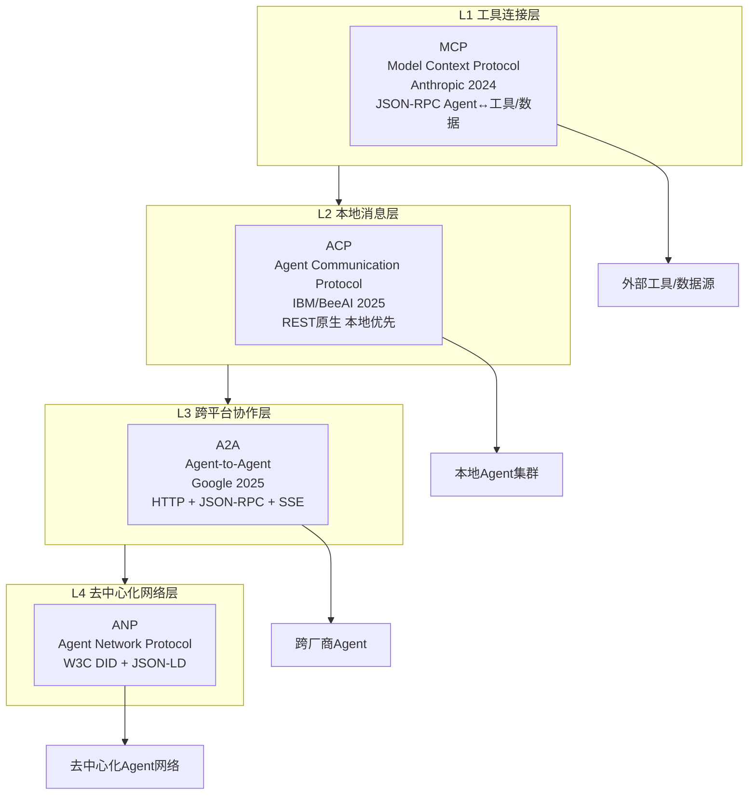

# Agent 通信协议完整教程：MCP/ACP/A2A/ANP 四层协议栈

> 多Agent系统互操作性标准完整指南
> 创建日期：2026-07-03
> 内容范围：协议背景→分层架构→技术规范→实践指南→快速参考

---

## 教程简介与定位

随着AI Agent生态的快速发展，不同厂商、不同框架的Agent之间如何互联互通成为核心挑战。本教程系统讲解当前Agent通信领域的四大主流协议，帮助读者理解协议分层设计、掌握各协议适用场景、实现多Agent系统的标准化集成。

### 四大协议一句话定位

| 协议 | 一句话定位 |
|------|-----------|
| **MCP** (Model Context Protocol) | Agent与工具/数据源连接的"USB接口"，解决Agent如何调用外部能力的问题 |
| **ACP** (Agent Communication Protocol) | 本地优先的Agent间消息传递协议，解决同环境下Agent协作问题 |
| **A2A** (Agent-to-Agent) | 跨厂商跨平台的Agent协作标准，解决不同厂商Agent互操作问题 |
| **ANP** (Agent Network Protocol) | 面向去中心化Agent网络的通信协议，解决开放网络中Agent发现与信任问题 |

### 协议分层架构

---

## 文档导航

本文档按单一职责原则原子化为12个独立章节文件，存放于 [agent-communication-protocols/](agent-communication-protocols/) 目录：

| 序号 | 章节 | 文件 | 内容概要 |
|------|------|------|---------|
| 00 | 概述与背景 | [00-overview.md](agent-communication-protocols/00-overview.md) | 多Agent系统发展现状、协议生态时间线、N×M集成问题分析、四层协议栈定位 |
| 01 | MCP协议详解 | [01-mcp.md](agent-communication-protocols/01-mcp.md) | Model Context Protocol：定义、Anthropic发起/2024.11、Client-Server架构、Tools/Resources/Prompts三原语、JSON-RPC 2.0、stdio/HTTP/SSE传输、OAuth2.1认证 |
| 02 | ACP协议详解 | [02-acp.md](agent-communication-protocols/02-acp.md) | Agent Communication Protocol：定义、IBM/BeeAI发起/2025.03、REST原生、零SDK、本地优先、mDNS发现、MIME内容协商、多传输支持、离线发现 |
| 03 | A2A协议详解 | [03-a2a.md](agent-communication-protocols/03-a2a.md) | Agent-to-Agent Protocol：定义、Google发起/2025.04、Agent Card、Task状态机、SSE流式、Well-Known URI发现、Push Notification、OAuth2/mTLS、生态现状 |
| 04 | ANP协议概述 | [04-anp.md](agent-communication-protocols/04-anp.md) | Agent Network Protocol：去中心化Agent网络、W3C DID、JSON-LD、早期发展阶段说明 |
| 05 | 协议对比与分层架构 | [05-comparison.md](agent-communication-protocols/05-comparison.md) | 四层分层架构图、多维度技术对比表、ACP vs A2A深度对比、互补关系说明、选型决策树、分阶段采用路线图 |
| 06 | 交互流程与协作模式 | [06-flows.md](agent-communication-protocols/06-flows.md) | MCP工具调用时序图、A2A任务委派时序图、ACP本地协同时序图、混合场景端到端时序图、任务状态机、协作模式分类 |
| 07 | 技术实现要点与代码示例 | [07-implementation.md](agent-communication-protocols/07-implementation.md) | Agent Card JSON示例、MCP/A2A/ACP核心API示例、curl命令、Python最小代码片段、消息结构详解、最佳实践 |
| 08 | 典型应用场景 | [08-scenarios.md](agent-communication-protocols/08-scenarios.md) | 企业数字员工团队、跨组织SaaS协作、边缘IoT/机器人、去中心化Agent市场、AI编码助手场景分析与协议推荐 |
| 09 | 术语表 | [09-glossary.md](agent-communication-protocols/09-glossary.md) | 关键术语解释（JSON-RPC/SSE/Agent Card/Task/Artifact/DID/mDNS等≥15个术语） |
| 10 | 资源与参考链接 | [10-resources.md](agent-communication-protocols/10-resources.md) | 官方规范、GitHub仓库、学术论文、SDK工具、相关文章资源分类汇总 |
| 11 | 快速参考卡 | [11-quick-reference.md](agent-communication-protocols/11-quick-reference.md) | 协议快速对比表、选型CheckList、API速查表、Agent Card模板、FAQ |

---

## 面向读者的阅读建议

### 按角色阅读

| 角色 | 推荐阅读路径 |
|------|-------------|
| **应用开发者** | 00-overview → 01-mcp → 07-implementation → 11-quick-reference |
| **Agent框架开发者** | 00-overview → 01-mcp → 02-acp → 03-a2a → 05-comparison → 06-flows |
| **去中心化应用研究者** | 00-overview → 04-anp → 05-comparison → 08-scenarios |
| **架构师/技术负责人** | 00-overview → 全部协议详解章节（01-04）→ 05-comparison → 08-scenarios |

### 按学习阶段

1. **入门阶段**：先读00-overview建立全局认知，理解为什么需要标准化协议
2. **进阶阶段**：根据需求选择1-2个核心协议深入学习（建议从MCP开始，它最成熟）
3. **实战阶段**：结合对应实战章节动手实现，参考11-quick-reference快速查阅
4. **架构阶段**：通读9章对比和10章最佳实践，设计适合自己场景的协议组合

### 前置知识

- 基础的HTTP/REST、JSON-RPC概念
- 了解AI Agent基本概念（工具调用、多Agent协作）
- 至少一门编程语言基础（Python/TypeScript/Go均可）

---

## Changelog

<!-- changelog -->
- 2026-07-03 | docs | 初始创建：建立agent-communication-protocols/原子化目录，创建总览入口文档和00-overview章节，包含四层协议架构图和12章导航表
