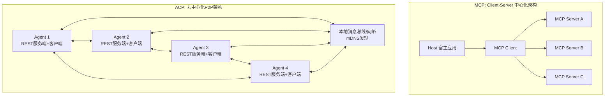
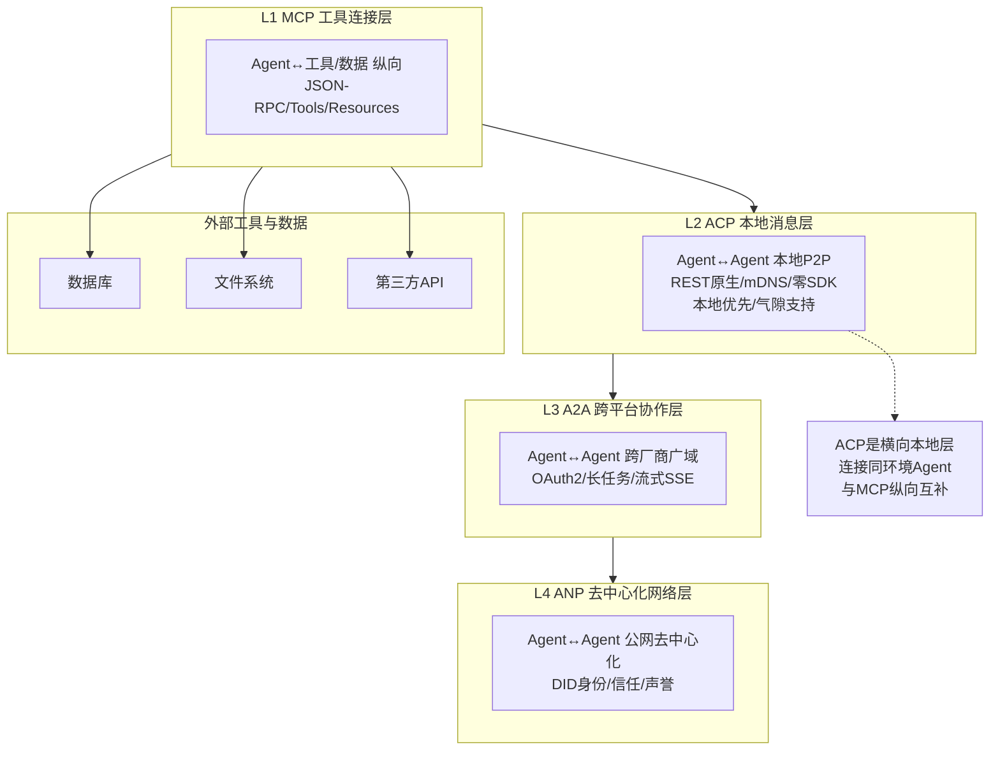

# 02、ACP协议详解：Agent Communication Protocol

## 2.1 ACP概览

**Agent Communication Protocol（ACP，Agent通信协议）** 由IBM Research与BeeAI社区于2025年3月联合发布，现由Linux基金会AI & Data进行中立治理。ACP是专注于本地优先、边缘部署和企业内网环境的Agent间对等通信协议。

### 核心定位

ACP的核心定位：**Agent与Agent在本地/内网环境对等通信的"局域网Wi-Fi"，横向本地P2P层**。它专为无云依赖、低延迟、去中心化的本地协作场景设计，实现同一环境下多Agent直接发现和通信，无需中央调度器。

| 属性 | 详情 |
|------|------|
| 发布时间 | 2025年3月 |
| 发起方 | IBM Research / BeeAI社区 |
| 治理机构 | Linux基金会 AI & Data |
| 协议层级 | L2 本地消息层 |
| 消息格式 | REST + JSON / OpenAPI |
| 架构模式 | 去中心化P2P |
| 当前状态 | 快速演进中 |

## 2.2 核心定位与设计哲学

ACP的设计哲学与A2A形成鲜明对比：A2A面向跨平台、跨厂商的广域协作，ACP则专注本地优先的高效通信。

### REST原生设计

ACP基于标准HTTP方法（GET/POST/PUT/DELETE）构建，不引入自定义RPC层。任何支持HTTP的工具（curl、Postman、浏览器、wget）都可以直接与ACP Agent交互，无需学习专用协议格式。

### 零SDK依赖

与MCP/A2A需要官方SDK不同，ACP不强制使用任何SDK。开发者使用任意HTTP客户端库即可完成集成，大幅降低接入门槛，特别适合资源受限环境和非标准技术栈。

### 本地优先（Local-first）

- **无云依赖**：不依赖任何云服务或外部注册中心即可运行
- **气隙环境支持**：完全离线环境（Air-gapped）下可正常工作
- **数据主权**：所有通信和数据保留在本地环境，不经过第三方服务器
- **自主运行**：即使网络完全断开，本地Agent间仍可协作

### 去中心化对等（P2P）

Agent之间直接通信，无需中央消息代理或调度器。每个Agent既是服务提供者也是服务消费者，网络拓扑随Agent上下线动态调整。

### 低延迟

REST原生HTTP + 本地网络/IPC传输，避免了中心化架构的额外跳数，适合实时交互场景（如机器人协同、实时推理、工业控制）。

### BeeAI平台支撑

ACP是BeeAI平台的核心通信协议，BeeAI提供了Agent运行时、编排能力和开发工具链，支撑ACP协议的实际落地和生态发展。

## 2.3 架构设计

ACP采用去中心化P2P架构，与MCP的Client-Server模式形成对比：每个Agent既是服务端（对外提供能力）也是客户端（调用其他Agent能力）。



### 架构特性对比

| 特性 | MCP架构 | ACP架构 |
|------|---------|---------|
| 拓扑结构 | 中心化星形 | 网状P2P |
| 中心节点 | 有（Client/Host） | 无 |
| 通信方向 | Client→Server单向调用 | Agent间双向对等 |
| 角色划分 | Client/Server固定 | 每个Agent兼具双角色 |
| 单点故障风险 | Client故障影响全局 | 单个Agent下线不影响网络 |
| 适用规模 | 单个Agent连接多个工具 | 多Agent本地对等协作 |

## 2.4 关键概念

### Agent Cards（Agent卡片）

每个Agent通过Agent Card描述自身能力、端点和元数据。与A2A同名概念机制不同：

- **A2A Agent Card**：通常通过HTTP端点动态获取，需要Agent运行中
- **ACP Agent Card**：支持静态打包分发，可嵌入Docker镜像、部署包或配置文件，Agent未运行时也能被发现（离线发现）

```json
{
  "name": "image-processor",
  "version": "1.0.0",
  "description": "图像处理Agent，支持缩放、裁剪、格式转换",
  "endpoints": {
    "rest": "http://localhost:8081",
    "grpc": "localhost:8082"
  },
  "capabilities": ["resize", "crop", "convert", "filter"],
  "inputTypes": ["image/png", "image/jpeg"],
  "outputTypes": ["image/png", "image/webp"]
}
```

### mDNS本地发现

ACP使用mDNS（multicast DNS，组播DNS）实现零配置局域网发现。Agent启动时通过mDNS广播自身服务，其他Agent无需预先知道IP地址和端口即可自动发现网络中的同伴。

- 类似AirPrint、Chromecast的局域网发现机制
- 零配置，无需DNS服务器或注册中心
- 仅在本地子网内生效，天然隔离公网
- Agent离线后自动从发现列表移除

### Task生命周期

ACP以Task（任务）为核心交互单元，任务状态机定义清晰：

| 状态 | 说明 |
|------|------|
| `created` | 任务已创建，等待执行 |
| `running` | 任务执行中 |
| `completed` | 任务成功完成，包含结果 |
| `failed` | 任务执行失败，包含错误信息 |

Task支持异步执行模式：客户端创建任务后可轮询状态或等待回调，适合长时运行操作。

### MIME类型内容协商

ACP通过标准MIME类型进行内容协商，支持多种消息格式：

- `text/plain`：纯文本消息
- `application/json`：结构化JSON数据
- `application/octet-stream`：二进制数据（文件、图片、模型权重）
- `multipart/form-data`：多部分混合消息（同时传递文本和二进制附件）

### 运行时控制器（可选）

ACP架构支持可选的运行时控制器（Runtime Controller），用于：

- **编排**：管理复杂多Agent工作流
- **遥测**：收集通信日志、性能指标
- **策略执行**：访问控制、限流、审计
- **监控**：健康检查、故障告警

控制器不是必须的，纯P2P模式下Agent可完全自主通信。

## 2.5 传输协议（灵活多选）

ACP不绑定单一传输协议，提供多种传输选项适应不同场景：

| 传输方式 | 适用场景 | 延迟 | 性能 | 依赖 |
|---------|---------|------|------|------|
| **RESTful HTTP** | 主要方式，通用场景 | 低 | 中 | 网络栈 |
| **gRPC** | 高性能、低延迟场景 | 极低 | 高 | HTTP/2 |
| **ZeroMQ** | 分布式消息、高吞吐 | 极低 | 极高 | 无（独立库） |
| **本地总线/IPC** | 同设备进程间通信 | 最低 | 极高 | 操作系统 |

### RESTful HTTP（主要方式）

标准HTTP/1.1或HTTP/2，使用JSON序列化，是默认和最广泛支持的传输方式。可与现有HTTP基础设施（反向代理、负载均衡、防火墙）无缝协作。

### gRPC（高性能场景）

基于HTTP/2的高性能RPC框架，使用Protocol Buffers二进制序列化，适合低延迟、高吞吐的实时场景（如机器人控制、高频交易）。

### ZeroMQ（分布式消息）

无中心化的高性能消息队列库，支持多种通信模式（请求-响应、发布-订阅、管道），适合复杂分布式部署和高吞吐量消息传递。

### 本地总线/IPC（进程间通信）

同一设备上的Agent通过Unix域套接字、命名管道或共享内存通信，延迟最低，适合嵌入式设备和边缘网关内的多Agent协作。

## 2.6 消息格式

ACP基于REST + OpenAPI规范，使用标准HTTP语义，消息格式直观易懂。

### 核心API端点

| 方法 | 路径 | 用途 |
|------|------|------|
| GET | `/agent-card` | 获取Agent能力描述 |
| POST | `/tasks` | 创建新任务 |
| GET | `/tasks/{id}` | 查询任务状态和结果 |
| DELETE | `/tasks/{id}` | 取消/删除任务 |
| GET | `/tasks` | 列出所有任务 |
| POST | `/messages` | 发送即时消息（可选） |

### 创建任务请求示例

```http
POST /tasks HTTP/1.1
Host: localhost:8081
Content-Type: application/json

{
  "taskId": "task-001",
  "operation": "resize",
  "input": {
    "width": 1024,
    "height": 768,
    "imageUrl": "http://localhost:8080/images/photo.jpg"
  },
  "priority": "normal",
  "callbackUrl": "http://localhost:8082/callbacks/task-001"
}
```

### 创建任务响应示例

```json
{
  "taskId": "task-001",
  "status": "created",
  "createdAt": "2025-03-15T10:30:00Z",
  "estimatedDuration": 5,
  "_links": {
    "self": "/tasks/task-001",
    "cancel": "/tasks/task-001"
  }
}
```

### 查询任务结果示例

```json
{
  "taskId": "task-001",
  "status": "completed",
  "createdAt": "2025-03-15T10:30:00Z",
  "completedAt": "2025-03-15T10:30:03Z",
  "output": {
    "resultUrl": "http://localhost:8081/results/task-001/resized.jpg",
    "format": "image/jpeg",
    "size": 245760
  }
}
```

### curl调用示例（零SDK特点）

无需安装任何SDK，一条curl命令即可调用ACP Agent：

```bash
# 创建图像处理任务
curl -X POST http://localhost:8081/tasks \
  -H "Content-Type: application/json" \
  -d '{
    "operation": "resize",
    "input": { "width": 1024, "height": 768, "imageUrl": "http://localhost:8080/images/photo.jpg" }
  }'

# 查询任务状态
curl http://localhost:8081/tasks/task-001

# 获取Agent能力卡片
curl http://localhost:8081/agent-card
```

### MIME多部分消息示例

同时发送文本指令和二进制文件：

```http
POST /tasks HTTP/1.1
Host: localhost:8081
Content-Type: multipart/form-data; boundary=----Boundary

------Boundary
Content-Disposition: form-data; name="operation"

analyze
------Boundary
Content-Disposition: form-data; name="file"; filename="document.pdf"
Content-Type: application/pdf

<binary PDF data>
------Boundary--
```

## 2.7 离线发现能力

ACP独有的离线发现是其区别于A2A的重要特性。Agent元数据不仅在运行时可通过HTTP获取，还可以静态分发：

- **Docker镜像标签**：Agent Card作为镜像标签或内置元数据打包在容器镜像中
- **部署清单**：Kubernetes/Helm Chart中嵌入Agent Card，部署前即可感知集群内Agent能力
- **配置文件**：静态YAML/JSON文件离线分发，支持气隙环境预配置
- **本地目录扫描**：Agent运行时扫描指定目录的Agent Card文件，自动注册

这意味着在气隙（完全离线）环境中，管理员可以预先导入所有Agent的描述文件，系统启动后即可建立完整的Agent拓扑，无需依赖运行时发现。

## 2.8 安全机制

ACP面向本地/内网环境，安全模型与面向跨网协作的A2A不同，更轻量且适配信任边界内场景。

### DID（去中心化标识符）

支持W3C DID（Decentralized Identifier）作为Agent身份标识，实现自主可控身份，无需中央身份提供商。DID可本地生成，无需向外部CA申请证书。

### RBAC（基于角色的访问控制）

本地细粒度权限控制，管理员可定义角色和访问策略：

- 哪些Agent可以调用哪些操作
- 资源访问配额限制
- 操作审计日志

### 本地安全模型

| 安全特性 | ACP（本地/内网） | A2A（跨平台/跨域） |
|---------|-----------------|------------------|
| 身份认证 | DID / 本地密钥 | OAuth 2.0 / OIDC |
| 传输加密 | TLS（可选，内网可简化） | 强制HTTPS/TLS |
| 授权模型 | RBAC本地策略 | OAuth Scope精细授权 |
| 网络边界 | 本地子网/内网，天然隔离 | 公网/跨组织，需纵深防御 |
| 证书管理 | 本地自签名/内部CA | 公网CA证书 |

> 注：ACP安全模型基于本地信任边界假设。若在不可信网络使用，应额外配置TLS和更严格的访问策略。

## 2.9 ACP在协议栈中的位置

ACP位于四层协议栈的L2（本地消息层），与MCP（纵向工具层）、A2A（跨平台层）、ANP（去中心化层）互补：

- **MCP（L1 纵向）**：解决Agent如何连接外部工具和数据，上下方向
- **ACP（L2 横向本地）**：解决同一环境内Agent如何高效对等通信，本地网状方向
- **A2A（L3 横向跨域）**：解决不同厂商、不同平台Agent如何跨组织协作，广域方向
- **ANP（L4 横向公网）**：解决开放网络中Agent如何去中心化发现和互信，公网方向



### 协议互补关系

同一应用可以同时使用多层协议：
1. 本地Agent通过ACP互相协作（L2）
2. 每个Agent通过MCP调用本地工具和数据库（L1）
3. 需要跨云/跨厂商协作时通过A2A调用外部Agent（L3）

## 2.10 典型适用场景

ACP的设计决定了它特别适合以下场景：

### 边缘设备 / IoT / 机器人

- 工业机器人多关节控制器实时协同
- IoT网关内多传感器数据处理Agent本地通信
- 自动驾驶车载多模块低延迟消息传递
- 网络不稳定或无网络环境下的自主运行

### 私有部署企业内网

- 金融、政府等强合规行业的内网Agent协作
- 数据不出域要求下的本地多Agent工作流
- 企业私有云内部微服务式Agent通信

### 离线 / 气隙环境

- 军事、涉密场所完全离线环境
- 偏远地区无网络基础设施场景
- 工业控制系统隔离网络

### 资源受限嵌入式设备

- 树莓派、Jetson等边缘开发板
- 内存和CPU受限的嵌入式系统（零SDK优势）
- 无法运行重型SDK或运行时的环境

## 2.11 与A2A的关键差异

ACP和A2A虽同属Agent间通信协议，但设计目标和适用场景截然不同，是互补而非竞争关系。

| 对比维度 | ACP（本地优先） | A2A（跨平台） |
|---------|----------------|--------------|
| **架构模式** | 去中心化P2P | Client-Server + 可选Agent Router |
| **传输协议** | REST/gRPC/ZeroMQ/IPC多选 | HTTP + JSON-RPC + SSE |
| **SDK依赖** | 零SDK，原生HTTP | 需要官方SDK |
| **发现机制** | mDNS本地广播 + 离线静态发现 | HTTP端点动态发现Agent Card |
| **网络依赖** | 本地网络/IPC，无外网依赖 | 可在公网/跨域运行 |
| **气隙支持** | 原生支持 | 需要额外配置 |
| **安全模型** | DID + 本地RBAC | 企业级OAuth 2.0/OIDC |
| **延迟** | 极低（本地/IPC） | 中高（跨网络） |
| **核心类比** | AI的局域网Wi-Fi | AI的互联网 |
| **治理** | Linux基金会 AI & Data | Linux基金会（Google捐赠） |
| **生态成熟度** | 早期，BeeAI主导 | 快速增长，Google推动 |

### 选型建议

- 本地多Agent低延迟协作 → 选ACP
- 跨厂商/跨云Agent互操作 → 选A2A
- 边缘/嵌入式/气隙环境 → 选ACP
- Agent连接外部工具/数据 → 选MCP（在两者下层）
- 复杂场景 → 多层协议组合使用

## 2.12 章节导航

| 导航 | 链接 |
|------|------|
| 返回总览 | [Agent通信协议总览](../agent-communication-protocols-wiki.md) |
| 上一章 | [01、MCP协议详解：Model Context Protocol](./01-mcp.md) |
| **下一章** | [03、A2A协议详解：Agent-to-Agent Protocol](./03-a2a.md) |
