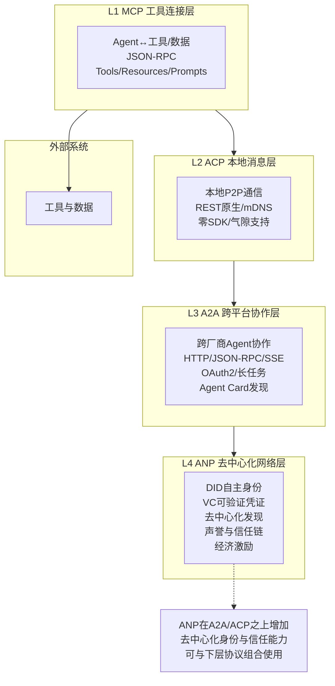

# 04、ANP协议概述：Agent Network Protocol

## 4.1 ANP概览

**Agent Network Protocol（ANP，智能体网络协议）** 是面向去中心化Agent网络与开放Agent市场的新兴协议，旨在解决完全开放的公网环境中Agent之间的发现、身份验证、信任建立与经济协作问题。ANP被业界类比为"Agent经济的互联网层"——类似TCP/IP为互联网提供基础通信能力，ANP试图为开放的Agent经济提供去中心化的信任与协作基础设施。

### 核心定位

ANP的核心定位：**面向开放公网环境的去中心化Agent协作网络层，L4去中心化网络层**。与MCP（纵向工具连接）、ACP（本地P2P）、A2A（跨厂商企业级协作）不同，ANP面向完全无中心、无预置信任的公网环境，让任何Agent都能在开放网络中自主发现彼此、验证身份、建立信任并进行价值交换。

| 属性 | 详情 |
|------|------|
| 协议层级 | L4 去中心化网络层 |
| 核心技术基础 | W3C DID、JSON-LD、Verifiable Credentials |
| 网络环境 | 完全开放的公网环境 |
| 身份模型 | 去中心化自主身份（DID） |
| 当前状态 | 早期发展阶段，规范演进中 |

> ⚠️ **重要说明**：ANP是一个处于早期探索阶段的新兴协议方向，规范尚未最终定型，生态也远未成熟。本章以概念概述为主，不涉及具体API或实现细节。

## 4.2 为什么需要ANP

MCP、ACP、A2A三层协议解决了不同场景下的Agent通信问题，但在面向完全开放的公网Agent网络时仍存在根本性挑战：

### 从封闭网络到开放网络的挑战

| 协议 | 解决的问题 | 局限 |
|------|-----------|------|
| **A2A** | 跨厂商、跨组织Agent协作 | 依赖Well-Known URI发现、企业级OAuth/OIDC认证，需要预置信任关系或中心化身份提供商 |
| **ACP** | 本地/内网P2P Agent通信 | 仅适用于本地子网或气隙环境，无法穿越公网，不解决跨信任域问题 |
| **MCP** | Agent与工具/数据的纵向连接 | 不是Agent间横向通信协议 |

当我们进入**完全开放的公网Agent生态**时，会面临四个根本性问题，现有协议无法完整解决：

### 开放网络中的Agent发现问题

在封闭/半封闭网络中，我们有中心化注册中心、企业目录、Well-Known URI等发现机制。但在完全开放的公网中：
- 没有中心化的"Agent电话簿"
- 任何人都可以发布Agent，也可以随时下线
- Agent可能动态迁移、变化能力
- 需要去中心化的发现机制，不依赖单一控制点

### 跨信任域身份验证

在企业级场景中，我们依赖OAuth 2.0、OIDC、API Key等中心化身份体系，但在开放网络中：
- 没有统一的身份提供商（IdP）
- 你怎么知道公网上某个Agent真的是它声称的那个？
- 如何防止Agent冒充、女巫攻击（Sybil Attack）？
- Agent需要拥有**自主主权身份**，不依赖任何中心化机构

### 可信协作机制

发现了Agent、验证了身份之后，如何建立信任？
- 这个Agent过往的服务质量如何？
- 它有没有作恶记录？
- 如何在没有中心化仲裁的情况下解决纠纷？
- 需要去中心化的声誉系统和信任链机制

### 经济激励与价值交换

当Agent在开放网络中为彼此提供服务时，需要价值交换机制：
- Agent A使用Agent B的服务，如何付费？
- 如何实现微支付、自动结算？
- 如何设计激励机制让诚实节点获益、作恶节点受损？
- 这是"Agent经济"真正运转的基础

## 4.3 核心技术基础

ANP并非从零发明新技术，而是构建在W3C已有的去中心化Web标准之上。

### W3C DID（Decentralized Identifiers，去中心化标识符）

DID是W3C推荐标准，是一种新型的去中心化标识符，让实体（人、组织、Agent、设备）可以拥有：
- **完全自主的身份**：不需要向任何中心化机构注册
- **可验证的所有权**：通过密码学证明你拥有这个DID
- **去中心化解析**：不依赖单一根域名系统或注册商

DID的基本形式示例：
```
did:example:123456789abcdefghi
```

每个DID对应一个DID Document，包含公钥、服务端点等信息，存储在去中心化网络（如区块链、IPFS、DHT）上。在ANP中，每个Agent都拥有自己的DID作为网络上的唯一身份标识。

### JSON-LD 图谱（JSON Linked Data）

JSON-LD是W3C标准，为JSON数据添加语义上下文，让不同系统对数据有共同理解：
- 普通JSON只有语法结构，没有语义
- JSON-LD通过`@context`定义术语的含义
- 支持链接数据，形成知识图谱
- 让Agent之间不仅能交换数据，还能理解数据的语义

在ANP中，JSON-LD用于Agent能力描述、服务声明、信任凭证等的语义化表示，确保不同厂商实现的Agent能互相理解。

### Verifiable Credentials（可验证凭证，VC）

VC是W3C推荐标准，是数字版的"可验证证书"：
- 由发行方签名，不可伪造
- 持有者可以自主出示
- 验证方可以独立验证真伪，不需要联系发行方
- 支持选择性披露（只披露必要信息，不泄露全部数据）

在ANP中，VC用于构建信任链：
- 认证机构可以给合规的Agent颁发"合规凭证"
- 过往用户可以给服务良好的Agent颁发"声誉凭证"
- Agent之间可以互相验证对方的凭证
- 不需要中心化平台背书

## 4.4 设计目标

ANP的设计围绕开放网络的特殊需求展开：

| 设计目标 | 说明 |
|---------|------|
| **开放网络中的Agent发现** | 不依赖中心化注册中心，通过去中心化网络实现Agent发现 |
| **去中心化身份认证** | 基于W3C DID，Agent拥有自主主权身份，不依赖中心化IdP |
| **可信协作机制** | 通过VC和声誉系统建立去中心化信任链，无需预置信任 |
| **语义互操作性** | 基于JSON-LD实现语义级互操作，不同实现能互相理解 |
| **价值交换原生支持** | 原生支持Agent间的微支付和经济激励机制 |
| **与现有协议兼容** | 可以在A2A/ACP/MCP之上运行，作为补充层而非替代 |
| **抗审查与容错** | 无单点故障，不依赖任何单一机构，网络鲁棒性强 |

## 4.5 ANP与其他三层协议的关系

ANP位于四层协议栈的最顶层（L4），在A2A/ACP/MCP之上扩展去中心化能力。它不是替代现有协议，而是为开放公网场景提供额外的信任与发现层。



### 四层协议栈全景

| 层级 | 协议 | 网络环境 | 信任模型 | 发现机制 |
|------|------|---------|---------|---------|
| L4 | ANP | 开放公网 | 去中心化信任链（DID/VC） | 去中心化发现 |
| L3 | A2A | 跨组织/跨厂商 | 预置信任/OAuth企业认证 | Well-Known URI |
| L2 | ACP | 本地子网/内网 | 本地信任/气隙环境 | mDNS广播 |
| L1 | MCP | 本地/远程 | API Key/OAuth | 直接配置Server地址 |

ANP可以看作是为A2A（或ACP）的跨域协作增加了一层去中心化的"安全壳"——当你在完全开放的公网中与陌生Agent交互时，ANP提供身份验证、信任建立和激励机制；当你在企业内部或已知合作伙伴之间协作时，直接使用A2A即可，不需要ANP。

## 4.6 与MCP/ACP/A2A的定位差异

下表清晰对比四个协议的定位差异：

| 对比维度 | MCP | ACP | A2A | ANP |
|---------|-----|-----|-----|-----|
| **协议层级** | L1 工具连接层 | L2 本地消息层 | L3 跨平台协作层 | L4 去中心化网络层 |
| **通信方向** | 纵向（Agent↔工具） | 横向本地P2P | 横向跨域 | 横向公网开放 |
| **网络环境** | 本地/远程 | 本地子网/内网/气隙 | 跨组织/跨厂商网络 | 完全开放公网 |
| **身份模型** | API Key/OAuth 2.1 | 本地身份/DID | OAuth 2.0/OIDC | W3C DID自主身份 |
| **信任模型** | 预置信任（用户配置） | 本地信任/无外网 | 企业级预置信任/IdP | 去中心化信任链/VC/声誉 |
| **发现机制** | 用户手动配置Server | mDNS本地广播/静态分发 | Well-Known URI/中心化目录 | 去中心化发现（DHT/区块链等） |
| **是否需要中心化组件** | 否（P2P配置） | 否（纯P2P） | 可选（企业IdP/目录） | 否（完全去中心化） |
| **典型场景** | Agent调用工具/读数据 | 车载多模块/边缘设备内网 | 企业调用SaaS Agent/跨供应商协作 | 开放Agent市场/公网Agent经济 |
| **成熟度** | 生产就绪 | 快速发展 | 广泛采用/快速增长 | 早期探索阶段 |
| **经济激励** | 不涉及 | 不涉及 | 不涉及 | 原生支持（微支付/结算） |

## 4.7 当前发展阶段

需要客观说明的是，ANP目前处于**非常早期的发展阶段**：

- **规范尚未定型**：没有统一的、广泛接受的正式规范，不同团队有不同的设计思路和技术路线
- **生态尚未成熟**：没有大规模生产部署案例，也没有成熟的SDK或工具链
- **技术路线存在分歧**：对于去中心化发现的具体实现（DHT？区块链？layer2？）、声誉系统设计、支付协议等关键问题，业界尚未达成共识
- **仍在概念验证阶段**：目前更多是学术研究、原型验证和概念探索，距离生产可用还有较长距离
- **与现有协议的整合方式也在探索中**：ANP是作为独立协议层，还是作为A2A的扩展，这些问题也在讨论中

> ⚠️ **阅读建议**：对于希望构建生产系统的读者，当前阶段建议优先关注MCP/A2A等成熟协议；ANP值得关注和研究，但不宜在生产中重度依赖。可以跟踪社区进展，为未来的开放Agent经济做技术储备。

## 4.8 潜在应用场景

尽管仍在早期阶段，ANP指向的应用场景非常广阔：

### 开放Agent市场/经济平台
- 任何人都可以发布Agent提供服务
- 任何人都可以发现并使用这些Agent服务
- 自动发现、自动谈判、自动结算
- 没有中心化平台抽成或审核

### 跨组织可信协作网络
- 多个没有预置信任关系的组织之间
- 通过VC凭证和声誉系统建立临时信任
- 完成特定协作任务后信任关系可以结束
- 不需要共同的身份提供商或中心化平台

### 去中心化AI服务市场
- 算力提供者通过Agent出租GPU
- 模型提供者通过Agent提供推理服务
- 数据提供者通过Agent安全售卖数据访问权
- 整个市场自动运行，无中心平台

### 自主Agent经济系统
- Agent拥有自己的DID和钱包
- Agent可以自主决定购买什么服务、售卖什么服务
- 多Agent自动分工协作完成复杂任务
- 价值在Agent网络中自动流转
- 这是真正的"自主Agent经济"愿景

## 4.9 章节导航

| 导航 | 链接 |
|------|------|
| 返回总览 | [Agent通信协议总览](../agent-communication-protocols-wiki.md) |
| 上一章 | [03、A2A协议详解：Agent-to-Agent Protocol](./03-a2a.md) |
| **下一章** | [05、四层协议对比与选型指南](./05-comparison.md) |
