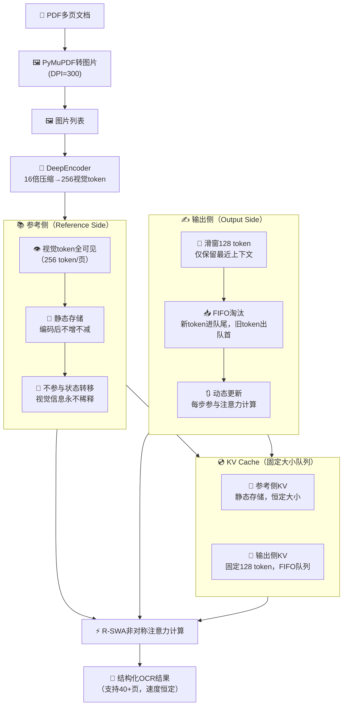

# 百度 Unlimited-OCR 长文档解析技术完全指南 — 概述

> 一句话摘要：百度开源的Unlimited-OCR以3B总参数/500M激活参数的MoE小模型，通过R-SWA非对称注意力机制模仿人类"抄书"模式，在OmniDocBench上以93.23%/93.92%的SOTA成绩反超235B大模型，实现40+页文档"一气呵成"解析且推理速度恒定（TPS 7847领先35%），是机制创新远胜参数堆砌的典范。

---

## 1. 背景与痛点

长文档OCR（光学字符识别）一直是多模态AI领域的顽疾，传统方案在处理超过数页的文档时面临两大核心问题：

- **记忆丢失**：随着输出token增长，视觉信息被逐渐"稀释"，文档越往后识别越不准，甚至出现关键内容遗忘
- **速度下降**：标准Transformer注意力复杂度O(n²)，KV cache随输出线性增长，输出越长推理越慢，最终内存爆炸

更根本的矛盾在于：通用大模型用"全注意力"处理所有任务，但OCR本质是"有参考、逐字抄录"而非"无中生有创作"——抄书者不需要记住10分钟前写的字句，只需要"眼睛盯着原文、记得笔停在哪里"。Unlimited-OCR正是从这个认知出发，通过架构层面的机制创新，跳出了"追求全记住"的思维定式。

---

## 2. 项目简介

Unlimited-OCR是百度最新开源的端到端长文档OCR模型，其核心定位是通过任务定制架构设计，从根本上解决长文档解析的记忆丢失和速度衰减问题。

- **GitHub地址**：https://github.com/baidu/Unlimited-OCR
- **arXiv论文**：[Unlimited OCR Works](https://arxiv.org/abs/2606.23050)（2606.23050）
- **Hugging Face模型**：https://huggingface.co/baidu/Unlimited-OCR
- **ModelScope模型**：https://modelscope.cn/models/PaddlePaddle/Unlimited-OCR
- **核心参数**：3B总参数（MoE稀疏激活架构），实际激活仅500M（约5亿）
- **基准成绩**：OmniDocBench v1.5 93.23%、v1.6 93.92%（端到端SOTA）
- **核心反差**：500M激活参数（约为Qwen3-VL的1/470）反超235B Qwen3-VL 4.08个百分点
- **长文档能力**：支持40+页PDF文档一次性解析，20页编辑距离0.057，40+页<0.11
- **推理效率**：输出6144 token时TPS达7847，领先DeepSeek-OCR 35%，速度不随输出长度下降
- **训练背景**：基于DeepSeek-OCR继续训练约4000步

项目引入"软遗忘"机制，不追求"记住一切"，而是"该记的永不遗忘、该忘的主动遗忘"，实现了真正的"无限长度"文档解析能力。

---

## 3. 核心特性一览表

| 特性 | 说明 |
|------|------|
| **R-SWA非对称注意力** | 参考侧（视觉token）全可见，输出侧仅保留最近128 token滑动窗口，模仿人类抄书注意力模式 |
| **DeepEncoder 16倍压缩** | 1024×1024页面图像压缩为256个视觉token，一次性编码不参与状态转移，视觉信息永不稀释 |
| **固定大小KV Cache** | FIFO固定队列结构，输出侧KV cache恒定为128 token，输出1万与10万token内存占用完全相同 |
| **MoE稀疏激活** | 3B总参数提供足够知识容量，500M激活参数保证推理速度，实现容量与效率解耦 |
| **40+页长文档支持** | 无记忆丢失、无速度下降、无内容重复，Distinct-35达97%几乎无重复生成 |
| **恒定推理速度** | 每步注意力计算范围固定，TPS不随输出长度下降，真正实现"越用越稳" |
| **两种推理方式** | Transformers快速上手、SGLang高性能部署、vLLM生产部署，满足开发调试到大规模生产不同需求 |
| **批量推理脚本** | 内置infer.py支持目录/PDF自动批量处理，自动管理SGLang服务生命周期，默认8并发 |
| **双图像模式** | gundam模式（单图高精度，640裁剪）和base模式（多页/PDF，1024不裁剪），自适应不同场景 |

---

## 4. 目标受众

| 角色 | 典型痛点 | 建议关注章节 |
|------|---------|-------------|
| **AI工程师** | 长文档处理成本高、速度慢、长序列OCR精度下降 | 全部章节，尤其[01-核心架构](01-core-architecture.md)、[03-快速上手](03-quick-start.md) |
| **OCR研究者** | 探索文档理解新架构、注意力机制改进方向 | [01-核心架构](01-core-architecture.md)、[02-性能数据](02-performance-data.md)、[05-架构启示](05-architecture-insights.md) |
| **架构设计者** | 寻找小模型超越大模型的路径、专用模型架构设计思路 | [01-核心架构](01-core-architecture.md)、[02-性能数据](02-performance-data.md)、[05-架构启示](05-architecture-insights.md)、[06-迁移模式](06-transferable-patterns.md) |
| **Agent开发者** | 多智能体长上下文管理、RAG与文档处理集成 | [05-架构启示](05-architecture-insights.md)、[06-迁移模式](06-transferable-patterns.md)、[07-SpecWeave启示](07-specweave-implications.md) |
| **技术学习者** | 理解AI架构创新方法论、学习技术传播策略 | 全部章节，尤其[05-架构启示](05-architecture-insights.md)、[08-总结FAQ](08-summary-faq.md) |

---

## 5. 章节导航

| 章节 | 标题 | 内容概要 | 难度 |
|------|------|---------|------|
| 00 | [概述](00-overview.md)（当前页） | 背景痛点、项目简介、核心特性、R-SWA架构图、阅读路径 | ⭐ |
| 01 | [核心架构与设计理念](01-core-architecture.md) | R-SWA非对称注意力原理、DeepEncoder视觉编码、固定KV cache、免费午餐解读 | ⭐⭐ |
| 02 | [性能数据与基准测试](02-performance-data.md) | OmniDocBench基准对比、长文档表现、推理效率TPS、参数效率反差解读 | ⭐⭐ |
| 03 | [快速上手指南](03-quick-start.md) | 环境要求、gundam/base双图像模式、Transformers/SGLang/vLLM三种部署、infer.py批量推理、选型建议 | ⭐ |
| 04 | [局限性与风险提示](04-limitations-risks.md) | 5大局限性分析、项目成熟度评估、适用场景建议、风险提示 | ⭐⭐ |
| 05 | [架构创新深度启示](05-architecture-insights.md) | 归纳偏置力量、"软遗忘"哲学、静态/动态信息分区、视觉token不稀释原理 | ⭐⭐⭐⭐ |
| 06 | [可迁移模式与行业启示](06-transferable-patterns.md) | MoE效率哲学、小模型路线、R-SWA迁移性分析（代码/客服等场景）、技术传播模式 | ⭐⭐⭐⭐ |
| 07 | [对SpecWeave的可行动启示](07-specweave-implications.md) | 规范前置+对话滑窗中间件、文档编码器+按需检索机制 | ⭐⭐⭐ |
| 08 | [总结与常见问题](08-summary-faq.md) | 核心要点回顾、速查表、7个FAQ、延伸阅读 | ⭐ |

---

## 6. 阅读路径建议

### 🟢 快速体验路径（直接上手用）
```
00 → 03
```
1. 读完当前概述了解项目核心价值
2. 直接跳转到[快速上手指南](03-quick-start.md)安装环境、运行示例

> 适合：想马上体验Unlimited-OCR效果、需要快速验证技术可行性的开发者

### 🔵 深度理解路径（知其然知其所以然）
```
00 → 01 → 02 → 05 → 06
```
1. 理解[核心架构与设计理念](01-core-architecture.md)，掌握"抄书注意力"本质
2. 通过[性能数据与基准测试](02-performance-data.md)验证技术效果，理解500M打败235B的原因
3. 深入[架构创新深度启示](05-architecture-insights.md)，理解归纳偏置和软遗忘哲学
4. 最后通过[可迁移模式与行业启示](06-transferable-patterns.md)萃取可复用的架构设计模式

> 适合：OCR研究者、AI架构师、希望深入理解技术创新本质的技术人员

### 🟣 全栈路径（完整掌握+迁移应用）
```
00 → 01 → 02 → 03 → 04 → 05 → 06 → 07 → 08
```
按章节顺序通读，不仅掌握Unlimited-OCR本身，还学习技术写作策略和架构创新方法论，适合希望全面掌握并将思想迁移到自身项目的开发者。

---

## 7. R-SWA核心架构图



> **架构解读**：R-SWA的核心是"非对称"——参考侧（视觉信息）像人眼盯着原文，始终全部可见且静态存储不参与状态转移；输出侧像人落笔写字，只记得刚写的128 token，更早内容通过FIFO主动"软遗忘"。这种设计让KV cache大小恒定，从根本上解决了长文档的内存爆炸和速度衰减问题。

---

## 8. 前置知识

阅读本教程前，建议具备以下基础知识：

- **Transformer注意力机制**：理解标准自注意力、KV cache、注意力复杂度等基本概念（01-02章涉及）
- **OCR基本概念**：了解文档识别、端到端OCR、多模态模型等基本术语
- **MoE基础**：了解稀疏激活、专家混合模型的基本思想（有助于理解参数效率）
- **Python基础**：能读懂Python代码示例（04章上手需要）
- **命令行基本使用**：pip安装、基本Shell命令（04章部署需要）

不要求有OCR项目经验或深度学习进阶知识，教程会用"人抄书"等生动类比讲解核心概念。

---

- [下一章：核心架构与设计理念](01-core-architecture.md) →
