# 百度 Unlimited-OCR 核心架构与设计理念

> 核心设计理念：OCR本质是"有参考、逐字抄录"而非"无中生有创作"——抄书者不需要记住10分钟前写的字句，只需要"眼睛盯着原文、记得笔停在哪里"。Unlimited-OCR跳出"追求全记住"的思维定式，通过R-SWA非对称注意力机制实现"该记的永不遗忘、该忘的主动遗忘"，用机制设计而非参数堆砌解决长文档OCR难题。

---

## 1. R-SWA机制详解

R-SWA（Reference Sliding Window Attention，参考侧滑动窗口注意力）是Unlimited-OCR的核心创新，其设计灵感直接来源于人类抄书时的注意力模式。

### 1.1 "人抄书"类比解释核心思想

想象一个人在抄书：
- **眼睛**：始终盯着全部原文，翻到哪一页都能看到完整内容
- **落笔**：只需要回头看刚写下的几行，确保上下文连贯
- **记忆**：不需要记住10分钟前抄的具体字句，因为原文就在眼前

R-SWA正是将这种人类认知模式直接编码进注意力机制：
- **参考侧**（输入图像/原文）→ 人的眼睛，始终全部可见
- **输出侧**（生成内容）→ 人的落笔位置，只回溯最近几行

### 1.2 非对称注意力设计

R-SWA最关键的设计是**非对称注意力**，打破了标准Transformer"一视同仁"的注意力模式：

| 侧别 | 角色 | 注意力可见范围 | 类比 |
|------|------|---------------|------|
| **参考侧** | 输入图像/视觉token | **全部可见**，永不截断 | 眼睛看全部原文 |
| **输出侧** | 生成的文本token | 仅可见最近 **128个token** | 落笔只看最近几行 |

这种非对称设计精准匹配OCR任务本质：抄录任务需要随时查阅原文参考，但生成历史只需要保留近期上下文即可保证连贯性。

### 1.3 "软遗忘"机制

R-SWA引入了"软遗忘"概念，这是与传统长上下文方案最根本的区别：

> **关键澄清**："软遗忘"**不是遗忘参考信息**，而是有选择地遗忘早期输出历史。

- **永不遗忘**：参考侧的视觉信息、原始文档内容，始终完整保留
- **主动遗忘**：输出侧生成超过128 token后，最早的输出历史自动移出注意力窗口

为什么这在OCR任务中是合理的？因为OCR是**"抄录"任务而非"创作"任务**：
- 创作任务（如写小说）需要记住前面的情节、人物关系、伏笔
- 抄录任务（如OCR）只需要知道"原文是什么"和"刚刚写到哪里"

人类抄书者不会刻意背诵自己10分钟前抄的每一个字——原文就在那里，忘了抬头看一眼就行。R-SWA让模型也拥有了这种"外部记忆优先"的认知模式。

### 1.4 全注意力层替换说明

R-SWA不是在标准注意力之外额外增加的模块，而是**将模型中所有标准注意力层全部替换为R-SWA注意力层**。

这意味着：
- 每一层注意力计算都遵循"参考侧全可见+输出侧滑窗"的非对称规则
- 不需要特殊的位置编码或额外的记忆模块
- 改动范围极小但效果贯穿整个模型

这种"全层替换"策略保证了非对称注意力模式在模型的每一个抽象层级都得到贯彻，从底层视觉特征到高层语义理解都受益于这一机制。

---

## 2. DeepEncoder视觉编码器

DeepEncoder是Unlimited-OCR的视觉编码组件，继承自DeepSeek-OCR，与R-SWA协同工作解决视觉信息稀释问题。

### 2.1 16倍高效压缩

DeepEncoder实现了极高的视觉信息压缩比：

- **输入分辨率**：1024×1024（PDF页面渲染后的标准分辨率）
- **输出token数**：仅256个视觉token
- **压缩倍率**：**16倍**高效压缩

这意味着一张百万像素级别的页面图像，被浓缩为256个高密度语义token，极大降低了后续注意力计算的负担。

### 2.2 一次性编码设计

DeepEncoder最关键的设计是**一次性编码**：

1. 视觉token在**解码开始前只编码一次**
2. 整个解码过程中，视觉token**不参与状态转移**
3. 每一步生成时，都能直接访问原始编码的视觉信息

这与传统多模态模型形成鲜明对比——传统模型中视觉token和文本token一起进入循环的注意力计算，随着输出变长，视觉信息在不断的状态转移中被逐渐"稀释"。

### 2.3 与R-SWA的协同效应

DeepEncoder与R-SWA不是两个独立的技术，而是紧密协同的整体：

- R-SWA将视觉token**挡在输出侧状态转移之外**
- 视觉信息始终保持**原始编码状态**，不会被后续生成内容稀释
- 每一步注意力计算时，参考侧的视觉token都是"新鲜"的原始编码

### 2.4 解决的核心问题

传统多模态模型处理长文档时普遍存在"越往后越不准"的现象，根源正是视觉信息稀释：

| 问题 | 传统方案 | Unlimited-OCR方案 |
|------|---------|------------------|
| 视觉token参与状态转移 | ✅ 是，每步都更新 | ❌ 否，只编码一次 |
| 长文档后半段识别精度 | 逐渐下降 | 保持稳定 |
| 图像信息保真度 | 随输出变长被稀释 | 始终保持原始状态 |
| 多页一致性 | 容易前后不一致 | 40+页精度稳定 |

---

## 3. 固定大小KV cache队列

KV cache是Transformer推理的核心机制，R-SWA对其进行了根本性改造，从无限增长变为固定大小队列。

### 3.1 标准Transformer vs Unlimited-OCR

| 方案 | KV cache行为 | 内存特性 | 速度特性 |
|------|-------------|---------|---------|
| **标准Transformer** | 随输出长度**线性增长**，每生成一个token就新增一组KV | 输出越长内存越大，最终爆炸 | O(n²)复杂度，输出越长越慢 |
| **Unlimited-OCR** | **固定大小FIFO队列**，新token进队尾，旧token出队首 | 内存占用恒定，与输出长度无关 | 每步计算范围固定，速度恒定 |

### 3.2 队列大小设计

输出侧KV cache队列大小固定为**128**，这正好对应R-SWA输出侧的滑动窗口大小。

FIFO（先进先出）淘汰规则：
- 新生成的token进入队列尾部
- 当队列满128个token后，最旧的token自动从队首移出
- 队列始终保持恰好128个输出token的KV

### 3.3 参考侧/输出侧KV cache对比表

参考侧和输出侧的KV cache采用完全不同的管理策略，这是非对称架构的直接体现：

| 维度 | 参考侧（原文/图像） | 输出侧（生成内容） |
|------|-------------------|-------------------|
| **注意力可见性** | 全部可见（始终完整） | 仅可见最近128 token |
| **KV cache行为** | 静态存储，不增不减 | 固定大小队列，FIFO淘汰 |
| **内存占用** | 恒定（由输入长度决定） | 恒定（128 token固定） |
| **信息特性** | 原始参考信息，永不遗忘 | 近期输出上下文，"软遗忘"早期内容 |

### 3.4 解决的两大顽疾

固定大小KV cache从根本上解决了长文档推理的两大顽疾：

**1. 内存爆炸问题**
- 输出1万token → 内存占用X
- 输出10万token → 内存占用**仍然是X**
- 理论上支持"无限长度"输出（受限于参考侧输入和实现细节）

**2. 速度衰减问题**
- 传统模型：第1步注意力计算范围小，第10000步计算范围是10000+输入长度，越来越慢
- Unlimited-OCR：每一步注意力计算范围都是"参考侧全量 + 128个输出token"，范围固定
- TPS（每秒token数）不随输出长度下降，真正实现"越用越稳"

---

## 4. R-SWA vs 标准注意力对比

让我们从多个维度系统对比R-SWA与标准Transformer注意力的差异：

| 对比维度 | 标准全注意力 | R-SWA非对称注意力 |
|---------|-------------|------------------|
| **注意力模式** | 对称：所有token一视同仁 | 非对称：参考侧/输出侧区别对待 |
| **参考侧可见性** | 随输出增长相对被稀释 | 始终全部可见，永不截断 |
| **输出侧可见性** | 全部历史可见 | 仅最近128 token可见 |
| **KV cache大小** | 线性增长O(n) | 恒定（参考侧固定+输出侧128） |
| **时间复杂度** | O(n²)，n为总序列长度 | O(n_ref + 128)，n_ref为参考侧长度 |
| **空间复杂度** | O(n)线性增长 | O(1)恒定（输出侧部分） |
| **长文档内存** | 输出越长内存越大，易爆炸 | 输出1万与10万token内存相同 |
| **推理速度** | 输出越长越慢 | 速度恒定，TPS不衰减 |
| **视觉信息保真** | 随输出变长被稀释 | 一次性编码，永不稀释 |
| **任务适配性** | 通用但对OCR等任务冗余 | 专为"有参考逐字输出"任务优化 |
| **改动成本** | 基准方案 | 极小，仅替换注意力层 |

---

## 5. R-SWA注意力计算流程

下面的流程图展示了R-SWA每一步生成token时的注意力计算过程：

```mermaid
flowchart LR
    subgraph Input["输入阶段"]
        PDF["📄 PDF文档"] --> Convert["🖼️ PyMuPDF转图片"]
        Convert --> Encode["🧠 DeepEncoder一次性编码<br/>1024×1024 → 256视觉token"]
    end

    subgraph RefStatic["📚 参考侧（静态存储）"]
        direction TB
        VisKV["👁️ 视觉token KV<br/>静态存储，不增不减"]
        RefFull["🔍 全注意力可见<br/>每步都能访问全部视觉信息"]
        VisKV --> RefFull
    end

    subgraph OutDynamic["✍️ 输出侧（FIFO队列）"]
        direction TB
        OutQueue["📥 固定128 token队列<br/>FIFO淘汰机制"]
        OutSlide["🔄 滑窗注意力<br/>仅计算最近128 token"]
        OutQueue --> OutSlide
    end

    Encode --> VisKV

    NewToken["🆕 新生成token"] --> OutQueue

    RefFull --> AttnCalc["⚡ R-SWA非对称注意力计算"]
    OutSlide --> AttnCalc

    AttnCalc --> NextToken["📝 预测下一个token"]
    NextToken --> NewToken

    style RefStatic fill:#e8f5e9,stroke:#4caf50,stroke-width:2px
    style OutDynamic fill:#fff3e0,stroke:#ff9800,stroke-width:2px
    style AttnCalc fill:#e3f2fd,stroke:#2196f3,stroke-width:2px
```

> **流程解读**：
> 1. 文档图像通过DeepEncoder一次性编码为视觉token，存入参考侧静态KV
> 2. 每生成一个新token，先加入输出侧FIFO队列，若队列超128则淘汰最旧token
> 3. 注意力计算时，参考侧提供全部视觉KV（全注意力），输出侧只提供128个滑窗KV
> 4. 两者融合计算后预测下一个token，如此循环直到生成结束
> 5. 整个过程中参考侧KV始终保持初始编码状态，不会被稀释或修改

---

## 6. 为什么R-SWA是"免费午餐"

正如原文总结：**"R-SWA对于解析任务来说就是一份真正的'免费午餐'"**。

### 6.1 极小的改动成本

R-SWA的工程改动量极小：
- 不需要重新设计模型架构
- 不需要万亿token预训练
- 不需要发明新的位置编码
- 只需要将标准注意力层替换为R-SWA注意力层
- 基于DeepSeek-OCR只需要继续训练约4000步让模型适应新机制

### 6.2 巨大的双重收益

用极小的改动，同时获得了两项关键能力：

| 收益 | 具体表现 |
|------|---------|
| **✅ 无限长度能力** | 从"最多几页"到"40+页一气呵成"，理论上内存不再是瓶颈 |
| **✅ 恒定推理速度** | TPS不随输出长度下降，输出6144 token时TPS达7847，领先DeepSeek-OCR 35% |
| **✅ 精度不降级** | OmniDocBench v1.5 93.23%、v1.6 93.92%，端到端SOTA |
| **✅ 小模型胜大模型** | 500M激活参数反超235B Qwen3-VL 4.08个百分点 |

### 6.3 "免费午餐"的本质

R-SWA之所以能成为"免费午餐"，本质是因为它**做对了减法而非加法**：

- 传统长上下文方案：增加复杂的记忆机制、检索模块、递归结构 → 加复杂度
- R-SWA：发现OCR任务不需要"记住一切"，只需要"记住该记住的" → 减复杂度

它没有给模型增加额外能力，而是**移除了与任务本质不匹配的通用设计冗余**——标准Transformer为了通用性保留了"全部可见"的输出侧注意力，但这对抄录任务是不必要的计算浪费。R-SWA只是按照OCR任务的真实需求重新分配了注意力资源，就获得了惊人的收益。

这正是机制创新的力量：当架构设计与任务认知模式精准匹配时，小模型完全可以打败大模型。

---

## 章节导航

← 上一章：[概述](00-overview.md)

[下一章：性能数据与基准测试](02-performance-data.md) →
