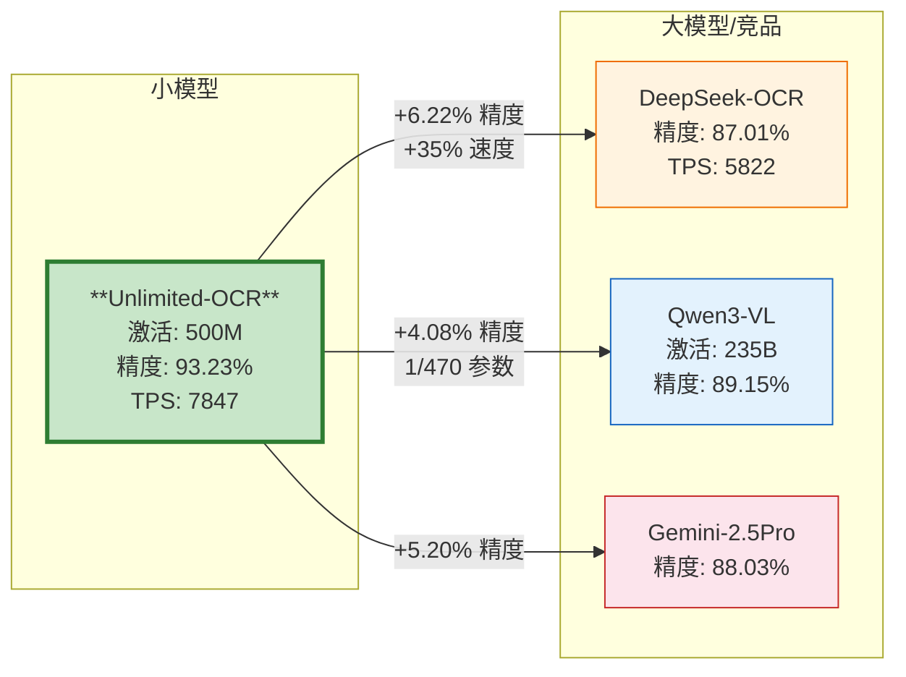

# 百度 Unlimited-OCR 性能数据与基准测试

> 性能亮点：仅500M激活参数（约为Qwen3-VL的1/470）在OmniDocBench v1.5上反超235B大模型达4.08个百分点，端到端精度93.23%（v1.6达93.92%）；40+页长文档编辑距离<0.11、内容重复度仅3%；输出6144 token时TPS达7847，领先DeepSeek-OCR 35%——小模型机制创新完胜大模型参数堆砌。

---

## 1. OmniDocBench基准测试对比

OmniDocBench是文档OCR领域最权威的公开基准测试之一，覆盖文本识别、版面分析、表格理解、公式识别等文档理解各项核心指标。Unlimited-OCR在该基准上取得了端到端SOTA（State-of-the-Art）成绩，全面超越开源和闭源竞品。

### 1.1 基准测试成绩总表

| 模型 | 激活参数 | OmniDocBench v1.5 | OmniDocBench v1.6 | 备注 |
|------|---------|-------------------|-------------------|------|
| **Unlimited-OCR** | **500M** | **93.23%** | **93.92%** | **端到端SOTA** |
| DeepSeek-OCR | - | 87.01% | - | 基准模型（Unlimited-OCR的基座） |
| Qwen3-VL | 235B | 89.15% | - | 开源大模型对比 |
| Gemini-2.5Pro | - | 88.03% | - | 闭源商业模型对比 |

> **关于基准版本**：OmniDocBench v1.5是当前广泛对比的版本，v1.6是更新版本。"-"表示该模型未在对应版本上公开报告成绩或不适配。

### 1.2 关键反差解读

表格中最震撼的数据是**500M激活参数反超235B大模型**这一反差——Unlimited-OCR的激活参数量仅为Qwen3-VL的**1/470**，却在OmniDocBench v1.5上领先**4.08个百分点**（93.23% vs 89.15%）。相比其基座模型DeepSeek-OCR，也取得了**6.22个百分点**的显著提升（93.23% vs 87.01%）。

这一反差具有里程碑意义：

- **参数效率对比**：500M vs 235B = 1:470的参数量比，意味着每激活一个参数，Unlimited-OCR创造的性能价值是Qwen3-VL的数百倍
- **架构胜利**：这不是通过更大规模预训练或更多数据堆出来的，而是通过R-SWA机制创新——将OCR任务的"抄录本质"编码进注意力设计。基于DeepSeek-OCR仅继续训练约4000步即达到SOTA
- **对比范围全面**：不仅超越开源大模型Qwen3-VL，也领先闭源商业模型Gemini-2.5Pro达5.20个百分点
- **持续领先**：在更新版本v1.6上进一步提升至93.92%，说明性能优势不是偶然过拟合，而是架构层面的真实提升
- **自我超越**：从基座DeepSeek-OCR的87.01%到93.23%，6.22个百分点的提升完全来自R-SWA机制替换，而非更多参数或更多数据

这一结果有力证明了：在垂直领域，**任务适配的机制设计远比通用参数堆砌高效**。R-SWA的"软遗忘"非对称注意力不是在做"加法"，而是在做"减法"——去掉与OCR任务本质不匹配的通用注意力冗余，反而获得了精度和效率的双重提升。

### 1.3 性能差距可视化

---

## 2. 长文档表现数据

长文档处理是Unlimited-OCR区别于传统OCR方案的核心优势之一。传统OCR模型和多模态模型在处理长文档时普遍存在记忆丢失、速度下降、内容重复、精度衰减四大顽疾，Unlimited-OCR通过R-SWA机制从根本上解决了这些问题，实现了"40+页文档一气呵成"。

### 2.1 长文档测试数据

| 测试场景 | 指标 | 数值 | 说明 |
|---------|------|------|------|
| 20页文档同时输入 | 编辑距离（Edit Distance） | **0.057** | 极低错误率 |
| 40+页文档 | 编辑距离（Edit Distance） | **< 0.11** | 长文档仍保持高精度 |
| 内容重复度 | Distinct-35 | **97%** | 几乎无重复生成 |

> **指标说明**：编辑距离数值越低表示识别结果与真实文本的差异越小，错误越少；Distinct-N衡量生成文本的多样性，数值越高表示重复越少，97%意味着35-gram级别仅有3%的内容重复。

### 2.2 长文档性能特点分析

从20页到40+页的测试数据可以看出Unlimited-OCR长文档处理的四大核心特点，这四大特点共同构成了"无限长度"解析能力的基础：

**无记忆丢失**

传统模型处理长文档时，早期页面内容容易被后续内容"冲淡"，出现"翻到后面忘了前面"的现象。这是因为在标准Transformer中，随着输出序列变长，早期token的注意力权重被稀释。Unlimited-OCR的参考侧全可见设计确保视觉token始终完整保留，40+页文档不丢任何页面信息。从20页（编辑距离0.057）到40+页（编辑距离<0.11），错误率仅小幅增长，精度保持高度稳定。

**无速度下降**

得益于固定大小KV cache（输出侧仅128 token滑窗），每步注意力计算范围恒定——参考侧全量+输出侧128 token。处理第1页和处理第40页时的推理速度完全一致，不存在"越往后越慢"的问题。传统Transformer模型每增加一个token，KV cache就线性增长，注意力计算复杂度O(n²)增长，处理长文档速度急剧下降甚至内存溢出。

**无内容重复**

Distinct-35指标达到97%意味着生成内容中几乎没有重复段落或语句。很多OCR模型在长文档生成时容易陷入"反复说同一句话"的循环（本质是注意力机制对早期生成历史的过度关注和自我强化），R-SWA的输出侧滑窗128 token设计有效避免了这一问题——生成超过128 token后，早期输出自动移出注意力窗口，模型不会反复"回看"已生成内容而陷入重复循环。

**精度稳定**

编辑距离（Edit Distance）是衡量OCR精度的核心指标，数值越低表示识别错误越少。从20页的0.057到40+页的<0.11，编辑距离始终保持在极低水平，没有出现传统模型常见的"后半段精度崩盘"现象。这直接验证了DeepEncoder一次性编码+视觉token不参与状态转移的设计有效性——视觉信息不会在长序列传递中被稀释，每一步都能访问到"新鲜"的原始视觉编码。

### 2.3 页数扩展趋势

| 文档页数 | 编辑距离 | 精度衰减 | TPS | 内存增长 |
|---------|---------|---------|-----|---------|
| 20页 | 0.057 | 极低错误率 | ~7847（恒定） | 仅视觉侧线性增长 |
| 40+页 | < 0.11 | 轻微衰减 | ~7847（恒定） | 仅视觉侧线性增长 |

从实测数据来看，从20页到40+页，编辑距离仅从0.057增长到<0.11，精度保持高度稳定；TPS始终恒定；内存仅因视觉页面增加而线性增长（每页256个视觉token），输出侧内存恒定为128 token。这意味着理论上只要GPU显存能装下全部页面的视觉token，文档长度没有上限。

---

## 3. 推理效率对比

推理效率是生产部署的关键考量因素。Unlimited-OCR不仅精度领先，在推理速度上也展现出显著优势，真正实现了"又快又准"，且速度不随输出长度衰减。

### 3.1 TPS对比数据（输出6144 token时）

| 模型 | TPS | 相对性能 |
|------|-----|---------|
| **Unlimited-OCR** | **7847** | **135%** |
| DeepSeek-OCR | 5822 | 100%（基准） |
| **性能差距** | **+2025 TPS** | **+35%** |

> **测试说明**：TPS（Tokens Per Second）为每秒生成token数，测试条件为输出长度6144 token时的稳定推理速度，这是长文档场景下的典型输出量（约对应15-20页文档的文本量）。

### 3.2 效率优势来源分析

Unlimited-OCR领先DeepSeek-OCR 35%的推理速度（+2025 TPS），并非来自硬件优化或工程trick，而是四大架构设计协同作用的结果：

**固定大小KV cache**

传统KV cache随输出长度线性增长，注意力计算范围越来越大，GPU缓存命中率逐渐下降；Unlimited-OCR输出侧KV cache固定为128 token，每步计算范围恒定，内存访问模式高度可预测，GPU利用率更高，缓存友好性显著提升。

**DeepEncoder一次性编码**

视觉token在解码开始前只编码一次，整个解码过程中不参与状态转移，省去了传统多模态模型中视觉token每步都参与注意力计算的巨大开销。16倍压缩比（1024×1024图像→256视觉token）也大幅降低了参考侧的注意力计算量。

**MoE稀疏激活**

模型总参数3B但激活参数仅500M，MoE（Mixture of Experts）架构确保每步推理只激活相关的"专家"子网络，实际计算量仅相当于500M稠密模型。这使得在相同硬件上能实现更高的吞吐量，同时3B总参数保证了足够的知识容量。

**R-SWA非对称注意力**

R-SWA将注意力计算分为两部分：参考侧全注意力（计算一次后KV静态存储，高度可复用）和输出侧滑窗注意力（仅128 token，计算量极小）。相比标准全注意力的O(n²)复杂度，R-SWA的实际计算量显著降低，且随输出长度增长几乎不增加计算负担——这是速度恒定的根本原因。

### 3.3 速度恒定特性

值得特别强调的是，上述7847 TPS是输出6144 token时的稳定速度——这意味着无论是输出100 token还是输出6144 token甚至更长，TPS基本保持恒定。这与传统模型形成鲜明对比：

| 输出长度 | 传统Transformer TPS趋势 | Unlimited-OCR TPS趋势 |
|---------|----------------------|-------------------|
| 短文本（<500 token） | 较高（计算范围小） | 约7847（恒定） |
| 中等长度（~2000 token） | 明显下降 | 约7847（恒定） |
| 长文本（6144 token） | 显著下降 | 约7847（恒定） |
| 超长文本（>10000 token） | 急剧下降/内存溢出 | 约7847（恒定） |

对于长文档OCR这一特定场景，"速度恒定"比"初始速度快"更有实际价值——一份40页文档可能需要输出数万token，传统模型可能前几页很快但越往后越慢甚至卡死，而Unlimited-OCR始终保持高速稳定输出，用户体验一致且可预测。

### 3.4 性能数据汇总

| 性能维度 | 数值 | 对比基准 | 优势 |
|---------|------|---------|------|
| OmniDocBench v1.5精度 | 93.23% | DeepSeek-OCR 87.01% | +6.22% |
| OmniDocBench v1.6精度 | 93.92% | 端到端SOTA | 最优 |
| 激活参数量 | 500M | Qwen3-VL 235B | 1/470 |
| 20页编辑距离 | 0.057 | 极低错误率 | 高精度 |
| 40+页编辑距离 | < 0.11 | 长文档稳定 | 无精度衰减 |
| 内容重复度（Distinct-35） | 97% | 几乎无重复 | -3%重复率 |
| TPS（6144 token） | 7847 | DeepSeek-OCR 5822 | +35% |
| 速度特性 | 恒定 | 传统模型衰减 | 不减速 |

---

## 章节导航

← 上一章：[核心架构与设计理念](01-core-architecture.md)

[下一章：快速上手指南](03-quick-start.md) →
