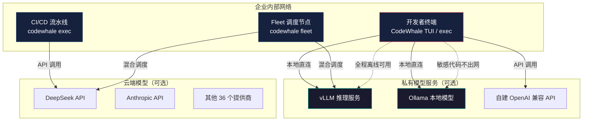

# CodeWhale 核心功能对比表

> 面向团队快速介绍，一页看清 CodeWhale 的定位、能力与差异化优势。

---

## 1. 核心速览

| 指标 | 数据 |
|------|------|
| 当前版本 | v0.9.3（候选版 v0.9.4） |
| 开源协议 | MIT |
| 开发语言 | Rust（edition 2024） |
| 提供商路由 | 36 个 |
| 运行模式 | 3 种（Plan / Act / Operate） |
| 权限姿态 | 3 种（Ask / Auto-Review / Full Access） |
| 运行时入口 | 5 种（TUI / exec / Web / API+MCP / Fleet） |
| 安装渠道 | 7 种（npm / Cargo / Homebrew / Docker / 预编译二进制 / Nix / 源码编译） |
| 支持平台 | macOS、Linux、Windows（x64 + arm64） |
| 国际化 | 15 种语言（含简体中文） |
| 内置 Skill 包 | 35 个 |
| CI/CD 工作流 | 14 个 |

---

## 2. 竞品全面对比

| 维度 | CodeWhale | Claude Code | Cursor | GitHub Copilot |
|------|-----------|-------------|--------|---------------|
| **产品形态** | 终端独立应用 | 终端 CLI | IDE 插件（VS Code 分支） | IDE 插件 |
| **开源协议** | MIT 开源 | 闭源 | 闭源（部分开源） | 闭源 |
| **模型绑定** | 模型无关，36 个提供商 | 绑定 Claude 生态 | 多模型，IDE 为中心 | 多模型，云端为主 |
| **本地运行时** | 支持（vLLM/SGLang/Ollama） | 不支持 | 不支持 | 不支持 |
| **离线可用** | 支持 | 不支持 | 不支持 | 不支持 |
| **数据隐私** | 代码不出本地 | 代码上传至 Anthropic | 本地处理 | 代码上传至云端 |
| **合规性** | 满足金融/军工等严格合规要求 | 数据跨境传输风险 | 中等 | 数据跨境传输风险 |
| **多运行时** | 5 种（TUI/exec/Web/API/Fleet） | 1 种（CLI） | 1 种（IDE） | 1 种（IDE） |
| **工作流引擎** | 内置 Fleet 多任务调度 | 单会话模式 | 无 | 无 |
| **CI/CD 集成** | 原生支持（codewhale exec） | 有限 | 不支持 | 有限 |
| **沙箱安全** | 操作系统级沙箱隔离 | 权限控制 | IDE 沙箱 | 无 |
| **MCP 协议** | 原生支持（stdio + HTTP/SSE） | 原生支持 | 通过插件 | 通过插件 |
| **ACP 协议** | 原生支持（Zed 等编辑器） | 不支持 | 不支持 | 不支持 |
| **国际化** | 15 种语言 | 有限 | 有限 | 有限 |
| **安装方式** | 7 种渠道 | npm | IDE 插件市场 | IDE 插件市场 |
| **编辑器绑定** | 无（编辑器无关） | 无 | 绑定 VS Code | 绑定 VS Code / JetBrains |
| **多 Agent 编排** | Fleet（持久化控制平面） | 无 | 无 | 无 |
| **子 Agent 管理** | 沙箱隔离 + 信任分级 + 预算控制 | 无 | 无 | 无 |
| **声明式工作流** | 支持（Workflow JS 脚本） | 不支持 | 不支持 | 不支持 |
| **生命周期 Hook** | 11 个事件 | 有限 | 无 | 无 |
| **搜索后端** | 9 个（DuckDuckGo/Bing/Tavily 等） | 有限 | 有限 | 有限 |
| **上下文分层** | 3 层（L1 热/L2 温/L3 冷） | 单层 | 单层 | 单层 |
| **私有化部署** | 完整支持（零云端依赖） | 不支持（强依赖 Anthropic API） | 不支持（强依赖云端模型 API） | 不支持（强依赖 GitHub 云端） |

---

## 2.5 私有化部署深度对比

> CodeWhale 是目前唯一支持完整私有化部署的主流 AI 编程助手。以下从部署架构、数据主权、模型选择、安全管控、运维管理五个维度展开说明。

### 2.5.1 部署架构对比

| 部署维度 | CodeWhale | Claude Code | Cursor | GitHub Copilot |
|---------|-----------|-------------|--------|---------------|
| **部署模式** | 纯本地二进制，零云端依赖 | 终端客户端 + Anthropic 云端 API | IDE 插件 + 云端模型 API | IDE 插件 + GitHub 云端推理 |
| **网络要求** | 离线可用（本地模型）/ 仅模型 API 需网络 | 必须全程联网 | 必须全程联网 | 必须全程联网 |
| **容器化部署** | Docker 镜像（ghcr.io），开箱即用 | 不支持 | 不支持 | 不支持 |
| **Nix 包管理** | 支持（flake.nix） | 不支持 | 不支持 | 不支持 |
| **源码编译** | `cargo build --release --locked`，标准 Rust 工具链 | 闭源不可编译 | 闭源不可编译 | 闭源不可编译 |
| **气隙环境** | 完全支持（本地模型 + 离线运行） | 不支持 | 不支持 | 不支持 |

### 2.5.2 数据主权对比

| 数据维度 | CodeWhale | Claude Code | Cursor | GitHub Copilot |
|---------|-----------|-------------|--------|---------------|
| **代码传输** | 代码不出本地机器 | 代码上传至 Anthropic 服务器 | 本地处理，但模型调用经云端 | 代码上传至 GitHub 云端 |
| **配置文件** | `~/.codewhale/` 本地存储，用户完全掌控 | 本地 + 云端同步 | 本地 + 云端同步 | 本地 + GitHub 账户绑定 |
| **会话数据** | 本地 SQLite 持久化（`sessions/` 目录） | 云端存储 | 本地 + 云端 | 云端存储 |
| **审计日志** | 本地 `audit.log` 完整记录凭证/审批/提权事件 | 不透明 | 不透明 | 不透明 |
| **GDPR/数据合规** | 天然合规，数据永不跨境 | 跨境传输风险 | 跨境传输风险 | 跨境传输风险 |
| **供应商锁定** | 无锁定，可随时切换模型和提供商 | 锁定 Anthropic 生态 | 锁定 Cursor 平台 | 锁定 GitHub/Microsoft 生态 |

### 2.5.3 私有模型接入对比

| 模型维度 | CodeWhale | Claude Code | Cursor | GitHub Copilot |
|---------|-----------|-------------|--------|---------------|
| **本地推理引擎** | vLLM / SGLang / Ollama 直连 localhost | 不支持 | 不支持 | 不支持 |
| **自建模型服务** | 任何 OpenAI 兼容 API 均可接入 | 仅支持 Anthropic API | 有限支持 | 不支持 |
| **API 密钥需求** | 本地模型无需 API 密钥 | 必须 Anthropic API 密钥 | 必须各模型 API 密钥 | 必须 GitHub 订阅 |
| **模型切换成本** | 零成本，修改 config.toml 一行配置 | 无法切换（仅 Claude） | 需重新配置 | 无法自定义 |
| **混合部署** | 同一会话中混合使用本地模型 + 云端模型 | 不支持 | 不支持 | 不支持 |
| **国产模型适配** | 内置 DeepSeek/Kimi/Qwen/StepFun/MiniMax/火山方舟/百度千帆 | 不支持 | 有限支持 | 不支持 |

### 2.5.4 安全管控对比

| 安全维度 | CodeWhale | Claude Code | Cursor | GitHub Copilot |
|---------|-----------|-------------|--------|---------------|
| **沙箱机制** | 操作系统级（macOS Seatbelt / Linux bubblewrap） | 权限提示 | 无 | 无 |
| **审批策略** | `always()` / `once()` / `never()` 三级 | 二元（允许/拒绝） | 二元（允许/拒绝） | 无 |
| **嵌套宪法** | 五级优先级硬约束体系 | 软性 Prompt 约束 | 软性 Prompt 约束 | 无 |
| **信任分级** | sandbox / local / remote-verified / operator 四级 | 无 | 无 | 无 |
| **进程隔离** | 每个子 Agent 独立沙箱，互不干扰 | 无子 Agent | 无子 Agent | 无子 Agent |
| **可审计性** | 完整审计日志 + 会话转录重放 | 部分可审计 | 部分可审计 | 不透明 |

### 2.5.5 运维管理对比

| 运维维度 | CodeWhale | Claude Code | Cursor | GitHub Copilot |
|---------|-----------|-------------|--------|---------------|
| **集中配置管理** | `config.toml` 单文件，支持项目级（`.codewhale/`）和用户级（`~/.codewhale/`）两层覆盖 | 有限 | 有限 | 有限 |
| **版本锁定** | 预编译二进制 + SHA-256 校验，可精确锁定版本 | npm 版本管理 | IDE 插件自动更新 | IDE 插件自动更新 |
| **CI/CD 集成** | `codewhale exec` 单命令，原生管道友好 | 有限 | 不支持 | 有限 |
| **监控告警** | Fleet 6 种告警事件（stale/restart_exhausted/needs_human/budget_exceeded/verifier_failed/run_completed） | 无 | 无 | 无 |
| **批量部署** | 预编译二进制分发 + Docker 镜像 + Nix flake | npm 安装 | IDE 插件市场 | IDE 插件市场 |
| **多平台支持** | macOS / Linux / Windows / Android Termux | macOS / Linux | macOS / Linux / Windows | macOS / Linux / Windows |

### 2.5.6 私有化部署典型架构

> 核心原则：敏感代码通过本地模型（vLLM/Ollama）处理，**永不出企业内网**；非敏感任务可按需调用云端 API，模型提供商可在配置文件中自由切换，不被任何单一供应商锁定。

---

## 3. 运行模式 × 权限姿态矩阵

|  | Plan（规划） | Act（执行） | Operate（调度） |
|------|:---:|:---:|:---:|
| **Ask（询问）** | 只读 + 每次确认 | 读写 + 每次确认 | 多任务 + 每次确认 |
| **Auto-Review（自动审查）** | 只读 + 自动审查 | 读写 + 自动审查 | 多任务 + 自动审查 |
| **Full Access（完全访问）** | 只读 + 无审批 | 读写 + 无审批（安全拦截仍生效） | 多任务 + 无审批 |

> 模式通过 `Tab` 键切换，权限姿态通过 `Shift+Tab` 键切换。

---

## 4. 五种运行时对比

| 运行时 | 入口 | 适用场景 | 典型用户 |
|--------|------|---------|---------|
| **TUI** | `codewhale` | 交互式日常开发、代码审查 | 全栈开发者 |
| **exec** | `codewhale exec "<任务>"` | 脚本化、CI/CD 流水线、Git hooks | DevOps / SRE |
| **Web** | 浏览器访问 `127.0.0.1:7878` | 可视化输出、轻量交互 | 偏好 GUI 的开发者 |
| **Runtime API + MCP** | HTTP + SSE（`/v1/*`） | 工具链集成、自定义前端、子 Agent 调用 | 平台工程师 |
| **Fleet** | `codewhale fleet` | 大规模代码库维护、多任务并行 | 团队负责人 |

---

## 5. 核心功能能力清单

| 功能领域 | 能力 | 说明 |
|---------|------|------|
| **模型路由** | 36 个提供商独立选择 | Provider/Model/推理档位 四字段路由，不发生静默切换 |
| | 本地模型直连 | vLLM/SGLang/Ollama 直连 localhost，无需 API 密钥 |
| | 云端/本地混合 | 同一会话中混合使用本地和云端模型 |
| **安全架构** | 嵌套宪法 | 五级优先级体系，硬编码安全 > Prompt 工程安全 |
| | 沙箱隔离 | macOS Seatbelt / Linux bubblewrap，操作系统级隔离 |
| | 审批姿态 | 三种权限姿态，支持 always()/once()/never() 审批策略 |
| | 审计日志 | 完整操作收据，每步可追溯 |
| **多 Agent 编排** | Exact Fleet | 冻结每个 worker 的 provider/model/权限上限 |
| | Reasoning Router | 可复用服务，仅选择推理层级 |
| | 信任分级 | sandbox / local / remote-verified / operator 四级 |
| | 预算控制 | 每个 Agent 独立 Token 和计算预算上限 |
| **工作流** | 声明式 Workflow JS | 编译专用的声明式 JS 子集，Rust 校验与执行 |
| | 验证边界 | 每次运行最多 100 个 worker、最多 5 层递归、16 个并发 |
| **扩展机制** | 工具扩展 | tools/ 目录创建处理器并注册 |
| | MCP 服务器 | mcp.json 配置，stdio 或 HTTP/SSE 传输 |
| | Skill 包 | 35 个内置 Skill（debug/review/security-review 等） |
| | 生命周期 Hook | 11 个事件（session_start/end、tool_call_before/after 等） |
| **开发者体验** | 15 种语言国际化 | 含简体中文、繁体中文 |
| | 7 种安装渠道 | npm/Cargo/Homebrew/Docker/预编译/Nix/源码 |
| | 中国用户加速 | CNB 镜像、清华大学 TUNA 镜像 |
| | 零密钥启动 | 首次运行无需 API 密钥，Plan 模式安全探索 |

---

## 6. 差异化优势一句话总结

| 差异化维度 | 一句话 | 对比竞品 |
|-----------|--------|---------|
| **模型无关** | 不被任何模型供应商锁定，36 个提供商自由切换 | Claude Code 绑定 Claude，Cursor 隐式选择 |
| **终端优先** | 不依赖任何 IDE，终端即完整开发环境 | Cursor 绑定 VS Code，Copilot 绑定 IDE |
| **开源 MIT** | 零法律障碍，可审计、可 fork、可商用 | 三大竞品均为闭源 |
| **本地优先** | 代码不出本地，离线可用，满足合规要求 | Copilot 纯云端，Claude Code 上传代码 |
| **Fleet 多 Agent** | 持久化控制平面，沙箱隔离 + 预算控制 | 三大竞品均无多 Agent 编排能力 |
| **私有化部署** | 唯一支持完整私有化部署的主流 AI 编程助手，代码永不出企业内网 | 三大竞品均强依赖云端 API，无法离线运行 |

---

## 7. 适用场景推荐

| 场景 | 推荐工具 | 原因 |
|------|---------|------|
| 个人日常开发，需要多模型灵活切换 | **CodeWhale** | 终端原生，模型无关，无供应商锁定 |
| 团队代码库维护，需要多任务并行 | **CodeWhale**（Fleet） | 持久化多 Agent 编排，沙箱隔离 |
| CI/CD 流水线集成 | **CodeWhale**（exec） | 原生支持，单命令即可嵌入 |
| 金融/军工等强合规场景 | **CodeWhale** | 本地运行，代码不出机器 |
| 深度绑定 Claude 生态，追求极致对话体验 | Claude Code | 与 Claude 模型深度集成 |
| 重度 VS Code 用户，需要 IDE 内嵌 AI | Cursor / Copilot | IDE 深度集成，零配置开箱即用 |
| 中国大陆用户，需要中文支持和镜像加速 | **CodeWhale** | 15 种语言含中文，CNB/TUNA 镜像 |

---

## 延伸阅读

- [项目概述](tech/intro.md)
- [核心功能详解](tech/features.md)
- [设计哲学与行业洞察](topics/index.md)
- [CodeWhale 知识库首页](index.md)